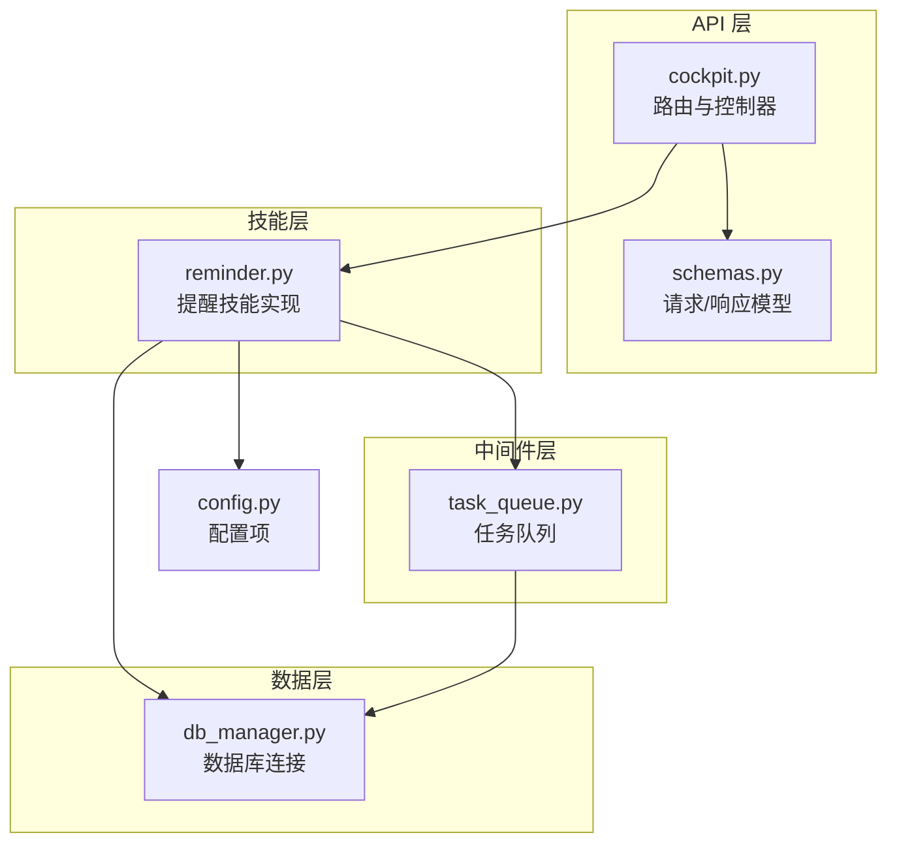
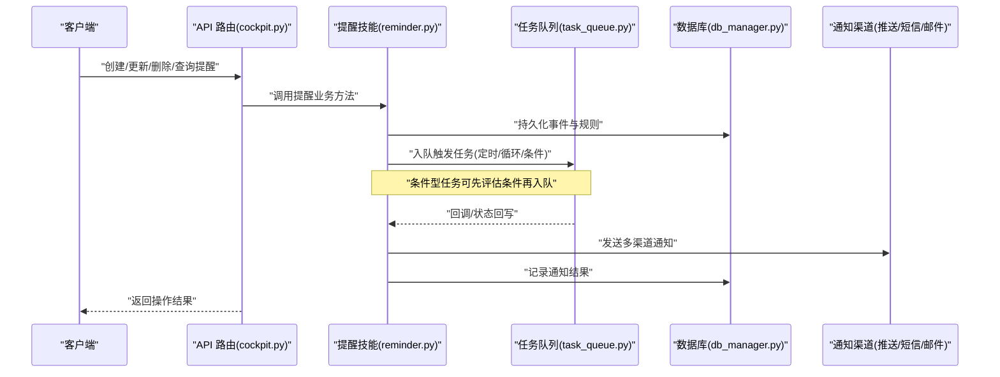
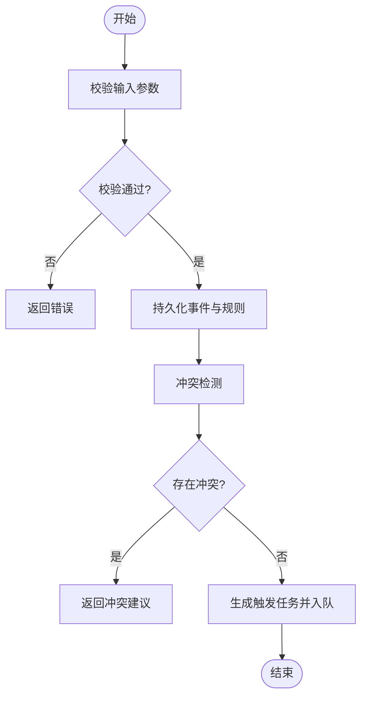
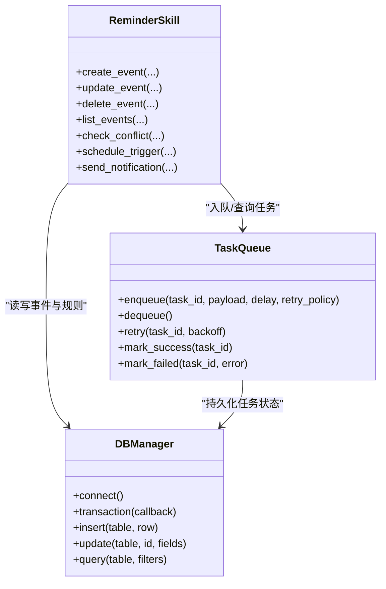
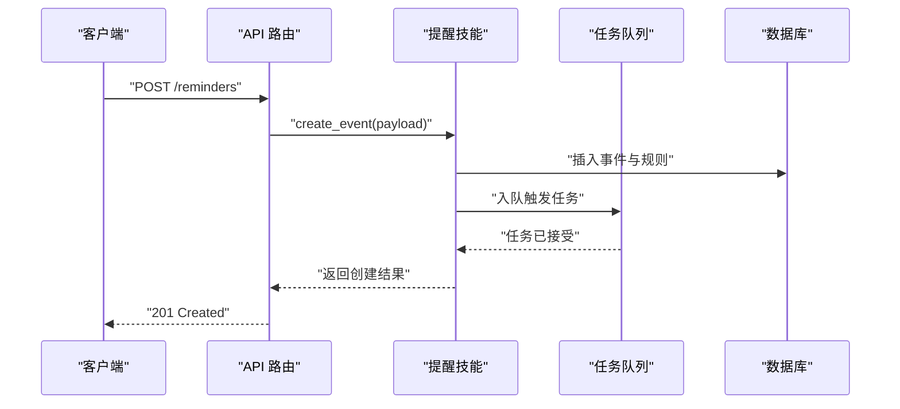
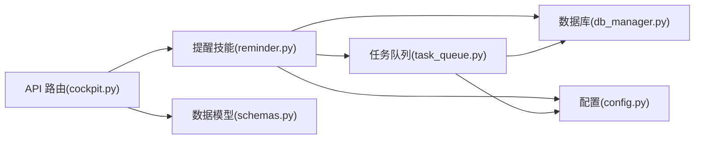

# 提醒服务

<cite>
**本文引用的文件**   
- [backend_design/nexus/skills/reminder.py](file://backend_design/nexus/skills/reminder.py)
- [backend_design/nexus/middleware/task_queue.py](file://backend_design/nexus/middleware/task_queue.py)
- [backend_design/nexus/core/db_manager.py](file://backend_design/nexus/core/db_manager.py)
- [backend_design/nexus/api/routes/cockpit.py](file://backend_design/nexus/api/routes/cockpit.py)
- [backend_design/nexus/models/schemas.py](file://backend_design/nexus/models/schemas.py)
- [backend_design/nexus/config.py](file://backend_design/nexus/config.py)
</cite>

## 目录
1. [简介](#简介)
2. [项目结构](#项目结构)
3. [核心组件](#核心组件)
4. [架构总览](#架构总览)
5. [详细组件分析](#详细组件分析)
6. [依赖关系分析](#依赖关系分析)
7. [性能与并发](#性能与并发)
8. [故障排查指南](#故障排查指南)
9. [结论](#结论)
10. [附录：API参考](#附录api参考)

## 简介
本文件为 NexusCockpit 提醒服务的完整使用文档，覆盖时间管理（日程安排、事件创建、冲突检测）、触发机制（定时、条件、循环）、多渠道通知（推送、短信、邮件）、API 接口参考（CRUD、触发规则配置、通知管理）、实际使用示例、并发处理与可靠性保证，以及与任务队列的集成和失败重试机制。

## 项目结构
提醒服务位于后端 Python 模块中，主要涉及以下位置：
- 技能层：提醒能力封装与业务编排
- 中间件层：任务队列与调度
- 数据层：数据库连接与持久化
- API 层：对外暴露的 REST 接口
- 模型层：请求/响应数据结构定义
- 配置层：系统运行参数

图表来源
- [backend_design/nexus/api/routes/cockpit.py](file://backend_design/nexus/api/routes/cockpit.py)
- [backend_design/nexus/models/schemas.py](file://backend_design/nexus/models/schemas.py)
- [backend_design/nexus/skills/reminder.py](file://backend_design/nexus/skills/reminder.py)
- [backend_design/nexus/middleware/task_queue.py](file://backend_design/nexus/middleware/task_queue.py)
- [backend_design/nexus/core/db_manager.py](file://backend_design/nexus/core/db_manager.py)
- [backend_design/nexus/config.py](file://backend_design/nexus/config.py)

章节来源
- [backend_design/nexus/skills/reminder.py](file://backend_design/nexus/skills/reminder.py)
- [backend_design/nexus/middleware/task_queue.py](file://backend_design/nexus/middleware/task_queue.py)
- [backend_design/nexus/core/db_manager.py](file://backend_design/nexus/core/db_manager.py)
- [backend_design/nexus/api/routes/cockpit.py](file://backend_design/nexus/api/routes/cockpit.py)
- [backend_design/nexus/models/schemas.py](file://backend_design/nexus/models/schemas.py)
- [backend_design/nexus/config.py](file://backend_design/nexus/config.py)

## 核心组件
- 提醒技能（Reminder Skill）
  - 负责提醒事件的创建、更新、删除、查询、冲突检测、触发规则解析与执行编排。
  - 支持定时、条件、循环三类触发；支持多通道通知（推送、短信、邮件）。
- 任务队列（Task Queue）
  - 提供异步任务入队、出队、重试、延迟执行等能力，保障高吞吐与可靠性。
- 数据库管理器（DB Manager）
  - 统一数据库连接、事务与访问封装，支撑提醒事件与通知记录的持久化。
- API 路由（Cockpit Routes）
  - 暴露提醒 CRUD、触发规则配置、通知管理等 HTTP 接口。
- 数据模型（Schemas）
  - 定义请求体、响应体、错误码与校验规则。
- 配置（Config）
  - 集中管理提醒服务相关配置项（如队列、通知渠道、超时与重试策略）。

章节来源
- [backend_design/nexus/skills/reminder.py](file://backend_design/nexus/skills/reminder.py)
- [backend_design/nexus/middleware/task_queue.py](file://backend_design/nexus/middleware/task_queue.py)
- [backend_design/nexus/core/db_manager.py](file://backend_design/nexus/core/db_manager.py)
- [backend_design/nexus/api/routes/cockpit.py](file://backend_design/nexus/api/routes/cockpit.py)
- [backend_design/nexus/models/schemas.py](file://backend_design/nexus/models/schemas.py)
- [backend_design/nexus/config.py](file://backend_design/nexus/config.py)

## 架构总览
提醒服务采用“API 层 -> 技能层 -> 中间件/数据层”的分层架构，结合任务队列实现可靠、可扩展的提醒与通知流程。

图表来源
- [backend_design/nexus/api/routes/cockpit.py](file://backend_design/nexus/api/routes/cockpit.py)
- [backend_design/nexus/skills/reminder.py](file://backend_design/nexus/skills/reminder.py)
- [backend_design/nexus/middleware/task_queue.py](file://backend_design/nexus/middleware/task_queue.py)
- [backend_design/nexus/core/db_manager.py](file://backend_design/nexus/core/db_manager.py)

## 详细组件分析

### 提醒技能（Reminder Skill）
职责
- 事件生命周期管理：创建、更新、删除、查询。
- 冲突检测：基于时间窗口与优先级进行重叠判断。
- 触发规则解析：支持定时、条件、循环三种模式。
- 通知编排：根据规则选择推送、短信、邮件等渠道并记录结果。

关键流程
- 创建提醒：校验输入 -> 写入数据库 -> 生成触发任务 -> 入队。
- 冲突检测：按时间范围与优先级计算重叠，返回冲突建议或拒绝。
- 条件触发：在任务执行前评估条件表达式，满足则继续，否则丢弃或延后。
- 循环提醒：基于间隔或 Cron 表达式周期性入队新任务。
- 通知发送：按渠道模板渲染内容，调用对应发送器，落库记录。

图表来源
- [backend_design/nexus/skills/reminder.py](file://backend_design/nexus/skills/reminder.py)
- [backend_design/nexus/core/db_manager.py](file://backend_design/nexus/core/db_manager.py)

章节来源
- [backend_design/nexus/skills/reminder.py](file://backend_design/nexus/skills/reminder.py)
- [backend_design/nexus/core/db_manager.py](file://backend_design/nexus/core/db_manager.py)

### 任务队列（Task Queue）
职责
- 提供延迟任务、周期任务、条件任务的入队与消费。
- 支持失败重试、退避策略、死信队列与幂等去重。
- 与提醒技能协作，确保触发任务的高可用与顺序性控制。

关键特性
- 延迟执行：基于时间戳或 Cron 表达式调度。
- 条件执行：在消费者侧评估条件，不满足则丢弃或延后。
- 重试与退避：指数退避、最大重试次数、失败告警。
- 幂等键：基于提醒 ID 与版本号避免重复执行。

图表来源
- [backend_design/nexus/middleware/task_queue.py](file://backend_design/nexus/middleware/task_queue.py)
- [backend_design/nexus/skills/reminder.py](file://backend_design/nexus/skills/reminder.py)
- [backend_design/nexus/core/db_manager.py](file://backend_design/nexus/core/db_manager.py)

章节来源
- [backend_design/nexus/middleware/task_queue.py](file://backend_design/nexus/middleware/task_queue.py)
- [backend_design/nexus/skills/reminder.py](file://backend_design/nexus/skills/reminder.py)
- [backend_design/nexus/core/db_manager.py](file://backend_design/nexus/core/db_manager.py)

### API 路由（Cockpit Routes）
职责
- 暴露提醒相关的 REST 接口：CRUD、触发规则配置、通知管理。
- 对请求进行鉴权、参数校验、限流与审计。
- 将业务逻辑委托给提醒技能，并返回标准化响应。

典型接口
- 提醒事件
  - POST /reminders：创建提醒
  - PUT /reminders/{id}：更新提醒
  - DELETE /reminders/{id}：删除提醒
  - GET /reminders/{id}：获取提醒详情
  - GET /reminders：列表查询（支持分页、过滤）
- 触发规则
  - POST /reminders/{id}/rules：新增/更新触发规则
  - GET /reminders/{id}/rules：查询触发规则
- 通知管理
  - POST /reminders/{id}/notify：手动触发通知测试
  - GET /reminders/{id}/notifications：查询通知历史

图表来源
- [backend_design/nexus/api/routes/cockpit.py](file://backend_design/nexus/api/routes/cockpit.py)
- [backend_design/nexus/skills/reminder.py](file://backend_design/nexus/skills/reminder.py)
- [backend_design/nexus/middleware/task_queue.py](file://backend_design/nexus/middleware/task_queue.py)
- [backend_design/nexus/core/db_manager.py](file://backend_design/nexus/core/db_manager.py)

章节来源
- [backend_design/nexus/api/routes/cockpit.py](file://backend_design/nexus/api/routes/cockpit.py)
- [backend_design/nexus/models/schemas.py](file://backend_design/nexus/models/schemas.py)

### 数据模型（Schemas）
职责
- 定义提醒事件、触发规则、通知记录的请求/响应结构。
- 提供字段类型、必填约束、默认值与错误信息。

关键字段（概念说明）
- 提醒事件：标题、描述、开始时间、结束时间、优先级、标签、状态。
- 触发规则：类型（定时/条件/循环）、表达式、时区、生效区间。
- 通知渠道：推送、短信、邮件的目标地址与模板变量。
- 通知记录：渠道、状态、发送时间、错误信息。

章节来源
- [backend_design/nexus/models/schemas.py](file://backend_design/nexus/models/schemas.py)

### 配置（Config）
职责
- 集中管理提醒服务相关配置项，包括队列、通知渠道、超时与重试策略。

常见配置项（概念说明）
- 队列：连接地址、并发消费者数、最大重试次数、退避策略。
- 通知：推送/短信/邮件的凭据与端点。
- 通用：日志级别、监控指标开关、健康检查路径。

章节来源
- [backend_design/nexus/config.py](file://backend_design/nexus/config.py)

## 依赖关系分析
提醒服务内部依赖关系如下：
- API 路由依赖提醒技能与数据模型。
- 提醒技能依赖任务队列与数据库管理器。
- 任务队列依赖数据库管理器进行状态持久化。
- 所有组件均读取配置以获取运行时参数。

图表来源
- [backend_design/nexus/api/routes/cockpit.py](file://backend_design/nexus/api/routes/cockpit.py)
- [backend_design/nexus/skills/reminder.py](file://backend_design/nexus/skills/reminder.py)
- [backend_design/nexus/middleware/task_queue.py](file://backend_design/nexus/middleware/task_queue.py)
- [backend_design/nexus/core/db_manager.py](file://backend_design/nexus/core/db_manager.py)
- [backend_design/nexus/models/schemas.py](file://backend_design/nexus/models/schemas.py)
- [backend_design/nexus/config.py](file://backend_design/nexus/config.py)

章节来源
- [backend_design/nexus/api/routes/cockpit.py](file://backend_design/nexus/api/routes/cockpit.py)
- [backend_design/nexus/skills/reminder.py](file://backend_design/nexus/skills/reminder.py)
- [backend_design/nexus/middleware/task_queue.py](file://backend_design/nexus/middleware/task_queue.py)
- [backend_design/nexus/core/db_manager.py](file://backend_design/nexus/core/db_manager.py)
- [backend_design/nexus/models/schemas.py](file://backend_design/nexus/models/schemas.py)
- [backend_design/nexus/config.py](file://backend_design/nexus/config.py)

## 性能与并发
- 并发处理
  - 任务队列消费者并行度可调，避免单点瓶颈。
  - 提醒技能内部尽量无锁设计，减少竞争。
- 可靠性保证
  - 幂等键防止重复执行。
  - 失败重试配合指数退避，降低瞬时抖动影响。
  - 死信队列用于异常任务隔离与人工干预。
- 资源优化
  - 批量写入数据库，减少往返开销。
  - 条件任务提前评估，避免无效入队。
  - 通知模板预编译，提升渲染效率。

[本节为通用指导，无需特定文件引用]

## 故障排查指南
常见问题与定位步骤
- 任务未触发
  - 检查队列是否正常运行、消费者是否在线。
  - 查看任务状态与重试计数，确认是否进入死信队列。
- 通知发送失败
  - 核对渠道配置与凭据。
  - 查看通知记录中的错误信息与重试次数。
- 冲突检测误判
  - 检查事件时间范围与时区设置。
  - 验证优先级与冲突阈值配置。
- 性能问题
  - 观察队列积压与消费者 CPU/内存占用。
  - 调整并发度与批大小，关注数据库慢查询。

章节来源
- [backend_design/nexus/middleware/task_queue.py](file://backend_design/nexus/middleware/task_queue.py)
- [backend_design/nexus/skills/reminder.py](file://backend_design/nexus/skills/reminder.py)
- [backend_design/nexus/core/db_manager.py](file://backend_design/nexus/core/db_manager.py)

## 结论
提醒服务通过分层架构与任务队列实现了高可靠、可扩展的提醒与通知能力。其支持多种触发模式与多渠道通知，并提供完善的 API 与数据模型，便于上层应用集成。在生产环境中，建议合理配置并发与重试策略，并结合监控与日志进行持续优化。

[本节为总结性内容，无需特定文件引用]

## 附录：API参考
以下为提醒服务常用接口的概览说明（具体字段与校验规则请参考数据模型）：
- 提醒事件
  - POST /reminders：创建提醒
  - PUT /reminders/{id}：更新提醒
  - DELETE /reminders/{id}：删除提醒
  - GET /reminders/{id}：获取提醒详情
  - GET /reminders：列表查询（支持分页、过滤）
- 触发规则
  - POST /reminders/{id}/rules：新增/更新触发规则
  - GET /reminders/{id}/rules：查询触发规则
- 通知管理
  - POST /reminders/{id}/notify：手动触发通知测试
  - GET /reminders/{id}/notifications：查询通知历史

章节来源
- [backend_design/nexus/api/routes/cockpit.py](file://backend_design/nexus/api/routes/cockpit.py)
- [backend_design/nexus/models/schemas.py](file://backend_design/nexus/models/schemas.py)