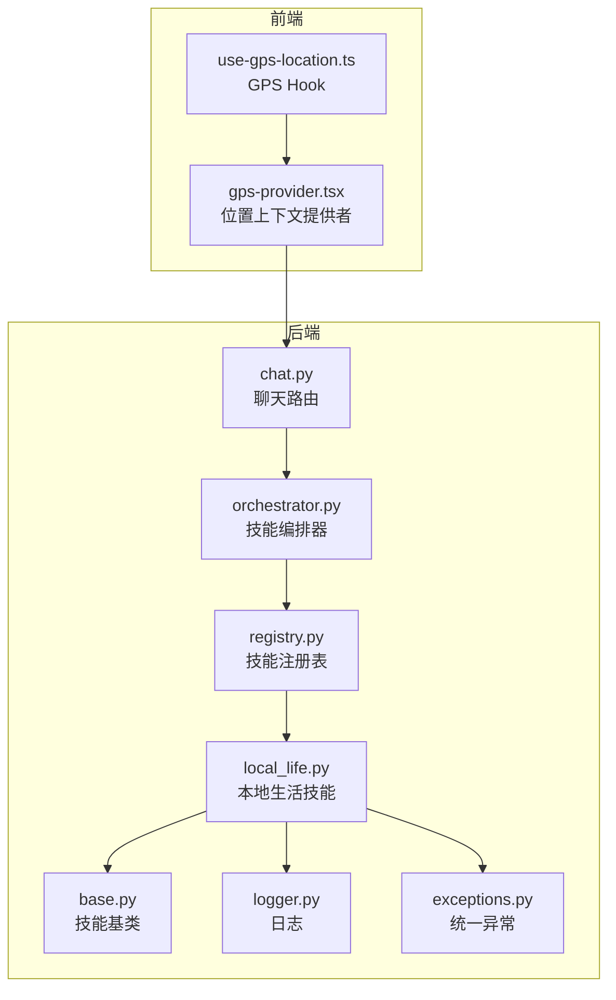
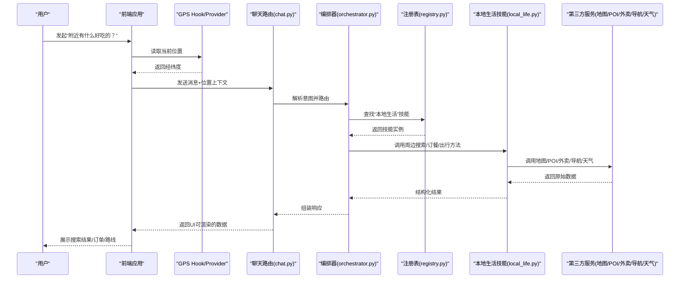
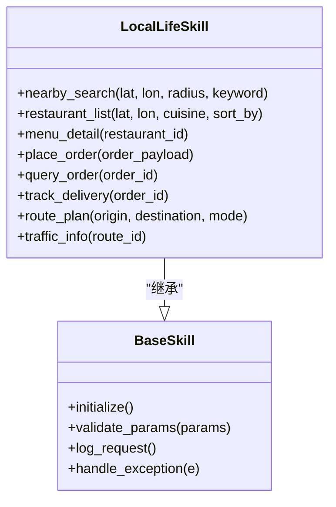
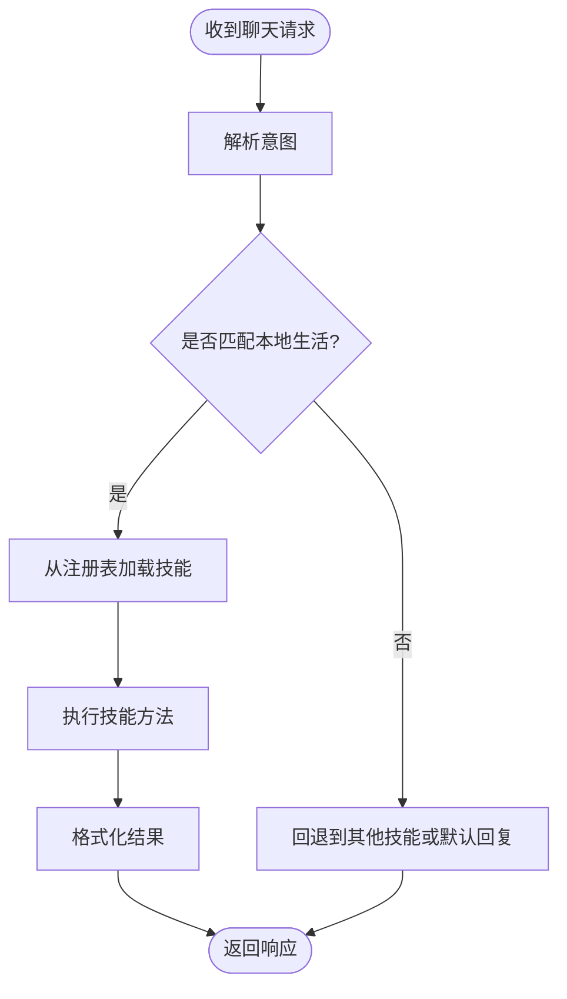
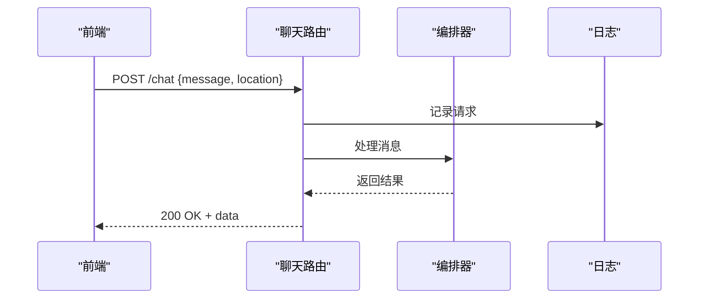
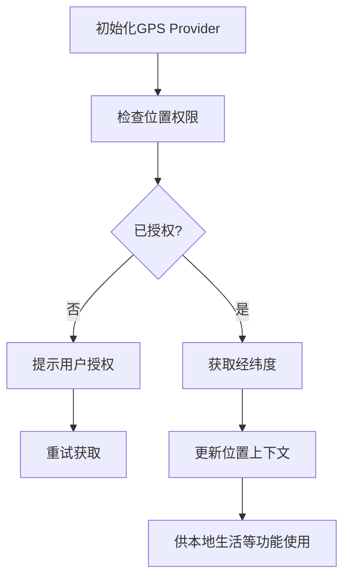
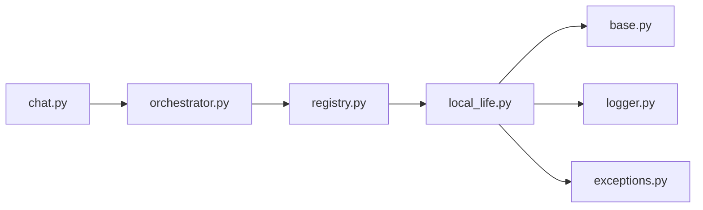

# 本地生活服务

<cite>
**本文引用的文件**   
- [backend_design/nexus/skills/local_life.py](file://backend_design/nexus/skills/local_life.py)
- [backend_design/nexus/skills/base.py](file://backend_design/nexus/skills/base.py)
- [backend_design/nexus/skills/orchestrator.py](file://backend_design/nexus/skills/orchestrator.py)
- [backend_design/nexus/skills/registry.py](file://backend_design/nexus/skills/registry.py)
- [backend_design/nexus/api/routes/chat.py](file://backend_design/nexus/api/routes/chat.py)
- [backend_design/nexus/core/logger.py](file://backend_design/nexus/core/logger.py)
- [backend_design/nexus/core/exceptions.py](file://backend_design/nexus/core/exceptions.py)
- [frontend_design/src/hooks/use-gps-location.ts](file://frontend_design/src/hooks/use-gps-location.ts)
- [frontend_design/src/components/layout/gps-provider.tsx](file://frontend_design/src/components/layout/gps-provider.tsx)
</cite>

## 目录
1. [简介](#简介)
2. [项目结构](#项目结构)
3. [核心组件](#核心组件)
4. [架构总览](#架构总览)
5. [详细组件分析](#详细组件分析)
6. [依赖分析](#依赖分析)
7. [性能考虑](#性能考虑)
8. [故障排查指南](#故障排查指南)
9. [结论](#结论)
10. [附录](#附录)

## 简介
本文件面向NexusCockpit的“本地生活技能”，围绕以下能力提供完整使用文档与实现说明：
- 周边搜索：地点查找、商家信息与用户评价展示
- 外卖订餐服务：餐厅选择、菜品浏览、订单管理与配送跟踪
- 出行规划：路线推荐、交通方式选择与实时路况信息
- API接口参考：位置服务、商户查询、订单操作
- 实际使用示例：从前端到后端的端到端流程
- 第三方服务集成：地图、POI、外卖平台、导航与天气等
- 错误处理方案：异常分类、重试与降级策略
- 地理位置权限与隐私保护：权限申请、最小化采集与数据留存

## 项目结构
本地生活技能位于后端技能的“skills”模块中，通过统一的技能编排器与注册表接入聊天路由。前端通过GPS定位Hook与Provider获取用户位置，驱动本地生活相关对话与结果渲染。

**图表来源**
- [frontend_design/src/hooks/use-gps-location.ts](file://frontend_design/src/hooks/use-gps-location.ts)
- [frontend_design/src/components/layout/gps-provider.tsx](file://frontend_design/src/components/layout/gps-provider.tsx)
- [backend_design/nexus/api/routes/chat.py](file://backend_design/nexus/api/routes/chat.py)
- [backend_design/nexus/skills/orchestrator.py](file://backend_design/nexus/skills/orchestrator.py)
- [backend_design/nexus/skills/registry.py](file://backend_design/nexus/skills/registry.py)
- [backend_design/nexus/skills/local_life.py](file://backend_design/nexus/skills/local_life.py)
- [backend_design/nexus/skills/base.py](file://backend_design/nexus/skills/base.py)
- [backend_design/nexus/core/logger.py](file://backend_design/nexus/core/logger.py)
- [backend_design/nexus/core/exceptions.py](file://backend_design/nexus/core/exceptions.py)

**章节来源**
- [backend_design/nexus/skills/local_life.py](file://backend_design/nexus/skills/local_life.py)
- [backend_design/nexus/skills/base.py](file://backend_design/nexus/skills/base.py)
- [backend_design/nexus/skills/orchestrator.py](file://backend_design/nexus/skills/orchestrator.py)
- [backend_design/nexus/skills/registry.py](file://backend_design/nexus/skills/registry.py)
- [backend_design/nexus/api/routes/chat.py](file://backend_design/nexus/api/routes/chat.py)
- [frontend_design/src/hooks/use-gps-location.ts](file://frontend_design/src/hooks/use-gps-location.ts)
- [frontend_design/src/components/layout/gps-provider.tsx](file://frontend_design/src/components/layout/gps-provider.tsx)

## 核心组件
- 本地生活技能（Local Life Skill）
  - 职责：封装周边搜索、外卖订餐、出行规划等业务逻辑；对外暴露统一方法；内部调用第三方服务或工具。
  - 关键能力：
    - 周边搜索：按坐标与半径检索POI，聚合商家详情与评价摘要。
    - 外卖订餐：支持餐厅列表、菜单浏览、下单、订单状态查询与配送跟踪。
    - 出行规划：根据起点终点生成路线，支持多交通方式与实时路况。
- 技能基类（Base Skill）
  - 职责：定义技能通用生命周期、参数校验、日志与异常包装。
- 技能编排器（Orchestrator）
  - 职责：解析意图、选择并调度对应技能，管理会话上下文与结果组装。
- 技能注册表（Registry）
  - 职责：维护技能名称到实现的映射，支持动态发现与加载。
- 聊天路由（Chat Route）
  - 职责：接收前端消息，交由编排器处理，返回结构化响应。
- GPS Hook与Provider（前端）
  - 职责：获取设备位置、管理权限与更新位置上下文，供本地生活功能消费。

**章节来源**
- [backend_design/nexus/skills/local_life.py](file://backend_design/nexus/skills/local_life.py)
- [backend_design/nexus/skills/base.py](file://backend_design/nexus/skills/base.py)
- [backend_design/nexus/skills/orchestrator.py](file://backend_design/nexus/skills/orchestrator.py)
- [backend_design/nexus/skills/registry.py](file://backend_design/nexus/skills/registry.py)
- [backend_design/nexus/api/routes/chat.py](file://backend_design/nexus/api/routes/chat.py)
- [frontend_design/src/hooks/use-gps-location.ts](file://frontend_design/src/hooks/use-gps-location.ts)
- [frontend_design/src/components/layout/gps-provider.tsx](file://frontend_design/src/components/layout/gps-provider.tsx)

## 架构总览
本地生活技能采用“前端位置上下文 + 后端技能编排 + 第三方服务集成”的分层架构。前端负责采集与展示位置信息；后端通过编排器将自然语言或结构化请求分发至具体技能；技能内部再调用地图、POI、外卖平台、导航与天气等外部服务。

**图表来源**
- [backend_design/nexus/api/routes/chat.py](file://backend_design/nexus/api/routes/chat.py)
- [backend_design/nexus/skills/orchestrator.py](file://backend_design/nexus/skills/orchestrator.py)
- [backend_design/nexus/skills/registry.py](file://backend_design/nexus/skills/registry.py)
- [backend_design/nexus/skills/local_life.py](file://backend_design/nexus/skills/local_life.py)
- [frontend_design/src/hooks/use-gps-location.ts](file://frontend_design/src/hooks/use-gps-location.ts)
- [frontend_design/src/components/layout/gps-provider.tsx](file://frontend_design/src/components/layout/gps-provider.tsx)

## 详细组件分析

### 本地生活技能（Local Life Skill）
- 设计要点
  - 以统一接口暴露三类能力：周边搜索、外卖订餐、出行规划。
  - 对第三方服务进行抽象封装，便于替换与测试。
  - 内置参数校验、缓存与限流策略，提升稳定性与性能。
- 数据结构与复杂度
  - 周边搜索：输入为经纬度与半径，输出为POI列表及详情；时间复杂度主要取决于外部服务分页与过滤。
  - 外卖订餐：包含餐厅、菜单、订单实体；下单与状态查询涉及幂等与一致性保障。
  - 出行规划：计算多条路线并融合实时路况，排序策略影响最终推荐质量。
- 错误处理
  - 区分网络超时、鉴权失败、业务无结果等场景，返回标准化错误码与提示。
  - 对第三方服务调用增加重试与熔断保护。

**图表来源**
- [backend_design/nexus/skills/base.py](file://backend_design/nexus/skills/base.py)
- [backend_design/nexus/skills/local_life.py](file://backend_design/nexus/skills/local_life.py)

**章节来源**
- [backend_design/nexus/skills/local_life.py](file://backend_design/nexus/skills/local_life.py)
- [backend_design/nexus/skills/base.py](file://backend_design/nexus/skills/base.py)

### 技能编排器与注册表
- 编排器
  - 负责意图识别后的技能选择与会话上下文传递。
  - 对技能执行结果进行二次加工与格式化。
- 注册表
  - 维护技能名称到实现的映射，支持热插拔与版本兼容。

**图表来源**
- [backend_design/nexus/skills/orchestrator.py](file://backend_design/nexus/skills/orchestrator.py)
- [backend_design/nexus/skills/registry.py](file://backend_design/nexus/skills/registry.py)

**章节来源**
- [backend_design/nexus/skills/orchestrator.py](file://backend_design/nexus/skills/orchestrator.py)
- [backend_design/nexus/skills/registry.py](file://backend_design/nexus/skills/registry.py)

### 聊天路由（API入口）
- 职责
  - 接收前端消息与位置上下文，调用编排器处理。
  - 统一鉴权、限流与日志记录。
- 典型流程
  - 校验请求体与权限
  - 转发至编排器
  - 返回结构化响应

**图表来源**
- [backend_design/nexus/api/routes/chat.py](file://backend_design/nexus/api/routes/chat.py)
- [backend_design/nexus/core/logger.py](file://backend_design/nexus/core/logger.py)

**章节来源**
- [backend_design/nexus/api/routes/chat.py](file://backend_design/nexus/api/routes/chat.py)
- [backend_design/nexus/core/logger.py](file://backend_design/nexus/core/logger.py)

### 前端GPS定位与权限管理
- 功能要点
  - 使用Hook获取当前经纬度，并在Provider中共享给各页面。
  - 在首次使用时申请位置权限，拒绝时给出引导提示。
  - 支持后台刷新与精度控制，减少电量消耗。
- 隐私保护
  - 仅传输必要的最小位置信息。
  - 不持久化高精度轨迹，必要时做模糊化处理。

**图表来源**
- [frontend_design/src/hooks/use-gps-location.ts](file://frontend_design/src/hooks/use-gps-location.ts)
- [frontend_design/src/components/layout/gps-provider.tsx](file://frontend_design/src/components/layout/gps-provider.tsx)

**章节来源**
- [frontend_design/src/hooks/use-gps-location.ts](file://frontend_design/src/hooks/use-gps-location.ts)
- [frontend_design/src/components/layout/gps-provider.tsx](file://frontend_design/src/components/layout/gps-provider.tsx)

## 依赖分析
- 组件耦合
  - 本地生活技能依赖技能基类与日志、异常模块。
  - 编排器依赖注册表与具体技能实现。
  - 聊天路由依赖编排器与日志。
- 外部依赖
  - 地图与POI服务、外卖平台API、导航与天气服务。
- 潜在循环依赖
  - 通过注册表解耦，避免直接导入造成的循环引用。

**图表来源**
- [backend_design/nexus/api/routes/chat.py](file://backend_design/nexus/api/routes/chat.py)
- [backend_design/nexus/skills/orchestrator.py](file://backend_design/nexus/skills/orchestrator.py)
- [backend_design/nexus/skills/registry.py](file://backend_design/nexus/skills/registry.py)
- [backend_design/nexus/skills/local_life.py](file://backend_design/nexus/skills/local_life.py)
- [backend_design/nexus/skills/base.py](file://backend_design/nexus/skills/base.py)
- [backend_design/nexus/core/logger.py](file://backend_design/nexus/core/logger.py)
- [backend_design/nexus/core/exceptions.py](file://backend_design/nexus/core/exceptions.py)

**章节来源**
- [backend_design/nexus/api/routes/chat.py](file://backend_design/nexus/api/routes/chat.py)
- [backend_design/nexus/skills/orchestrator.py](file://backend_design/nexus/skills/orchestrator.py)
- [backend_design/nexus/skills/registry.py](file://backend_design/nexus/skills/registry.py)
- [backend_design/nexus/skills/local_life.py](file://backend_design/nexus/skills/local_life.py)
- [backend_design/nexus/skills/base.py](file://backend_design/nexus/skills/base.py)
- [backend_design/nexus/core/logger.py](file://backend_design/nexus/core/logger.py)
- [backend_design/nexus/core/exceptions.py](file://backend_design/nexus/core/exceptions.py)

## 性能考虑
- 缓存策略
  - 对热门POI与菜单信息进行短期缓存，降低重复请求。
- 并发与限流
  - 对第三方服务调用设置超时与最大重试次数，避免雪崩。
- 数据裁剪
  - 按需返回字段，减少前后端传输体积。
- 前端优化
  - 位置更新节流与去抖，避免频繁触发后端查询。

[本节为通用指导，无需特定文件来源]

## 故障排查指南
- 常见问题
  - 位置权限被拒：检查前端权限提示与用户选择，确保重新授权流程可用。
  - 第三方服务不可用：查看日志中的错误码与堆栈，确认限流与熔断配置。
  - 订单状态不一致：核对幂等键与重试策略，检查事务与补偿机制。
- 诊断步骤
  - 启用调试日志，追踪请求链路。
  - 复现问题并收集位置上下文与请求参数。
  - 隔离第三方服务，验证是否为上游故障。

**章节来源**
- [backend_design/nexus/core/logger.py](file://backend_design/nexus/core/logger.py)
- [backend_design/nexus/core/exceptions.py](file://backend_design/nexus/core/exceptions.py)

## 结论
本地生活技能通过清晰的分层与模块化设计，实现了周边搜索、外卖订餐与出行规划的完整闭环。结合前端的GPS能力与后端的编排器，系统具备良好的扩展性与可维护性。建议在生产环境完善监控告警、灰度发布与数据合规审计，进一步提升用户体验与系统可靠性。

[本节为总结性内容，无需特定文件来源]

## 附录

### API接口参考（概念性）
- 位置服务
  - 获取当前位置：返回经纬度与精度
  - 地址解析：经纬度转地址文本
- 商户查询
  - 周边搜索：按坐标、半径、关键词检索POI
  - 商家详情：基础信息、评分、营业时间
  - 用户评价：摘要与精选评论
- 订单操作
  - 创建订单：提交菜品与收货信息
  - 查询订单：订单状态与明细
  - 配送跟踪：实时位置与预计到达时间

[本节为概念性接口说明，未直接分析具体代码文件，故不附“章节来源”]

### 实际使用示例（端到端）
- 示例一：周边找餐厅
  - 前端获取位置并发送消息
  - 后端编排器调用本地生活技能进行周边搜索
  - 返回餐厅列表与评分，前端渲染卡片
- 示例二：下单与配送跟踪
  - 选择餐厅与菜品，提交订单
  - 轮询订单状态直至完成
  - 显示配送进度与预计到达时间
- 示例三：出行规划
  - 输入起点与终点，选择交通方式
  - 返回多条路线与实时路况
  - 一键启动导航

[本节为概念性示例，未直接分析具体代码文件，故不附“章节来源”]

### 第三方服务集成
- 地图与POI：用于地点检索与地理编码
- 外卖平台：用于餐厅、菜单与订单能力
- 导航服务：用于路线规划与导航启动
- 天气服务：用于出行建议与风险提示

[本节为概念性集成说明，未直接分析具体代码文件，故不附“章节来源”]

### 地理位置权限与隐私保护
- 权限管理
  - 首次访问时申请位置权限，提供清晰的用途说明
  - 支持用户随时撤销权限，并提供降级体验
- 隐私保护
  - 最小化采集原则，仅保留必要字段
  - 数据脱敏与短周期留存，定期清理
  - 传输加密与访问控制，防止泄露

[本节为概念性安全与隐私说明，未直接分析具体代码文件，故不附“章节来源”]