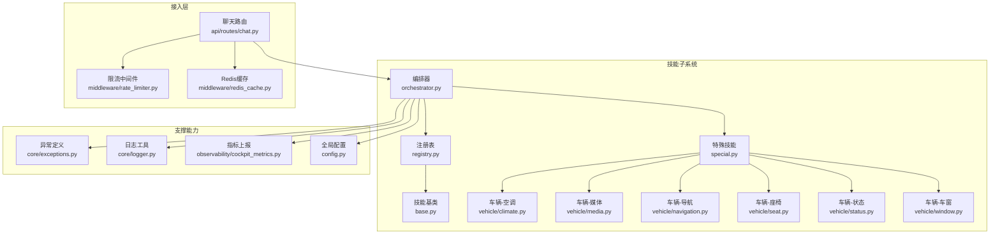
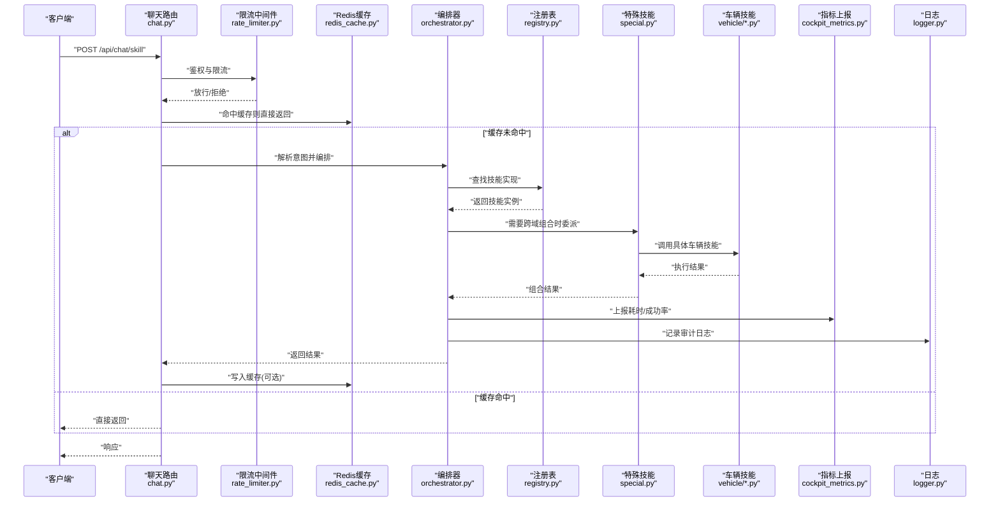
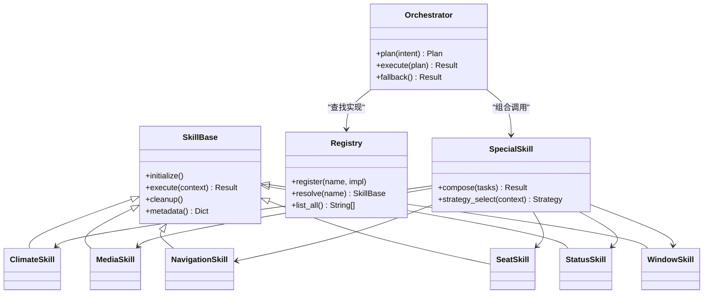
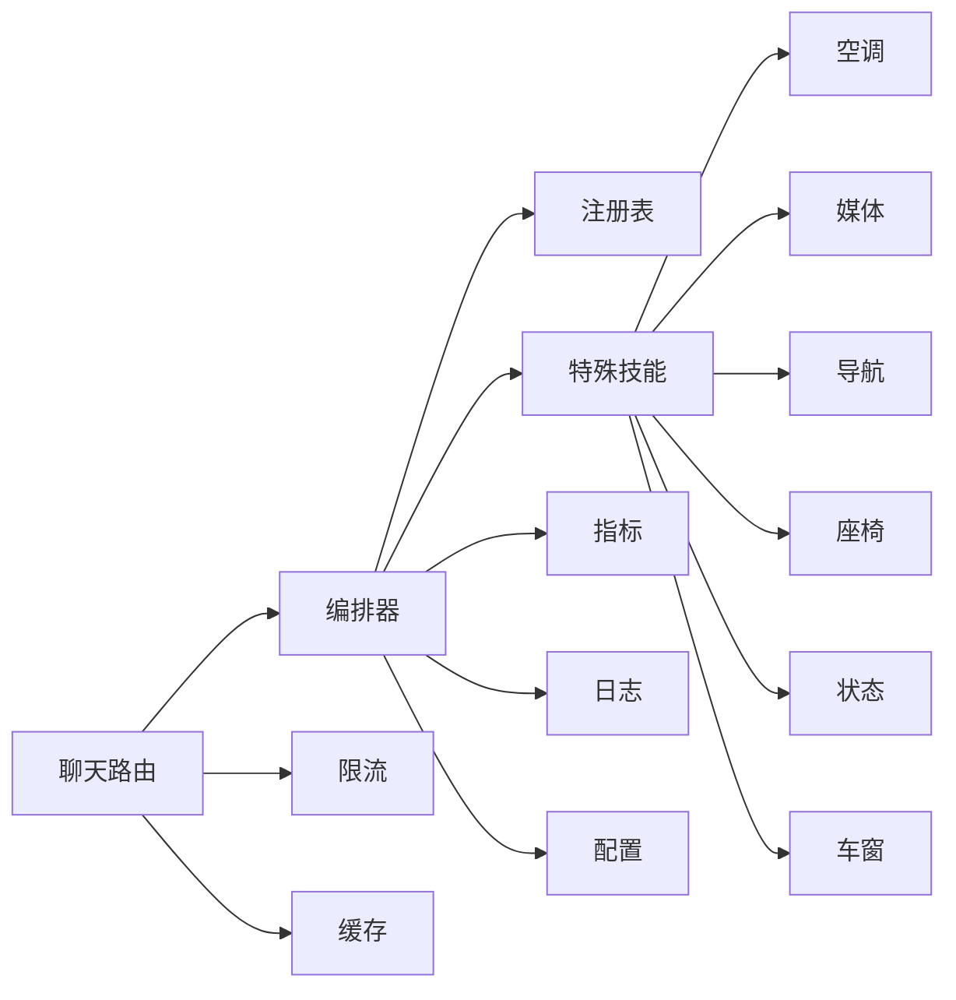

# 特殊技能

<cite>
**本文引用的文件**   
- [backend_design/nexus/skills/__init__.py](file://backend_design/nexus/skills/__init__.py)
- [backend_design/nexus/skills/base.py](file://backend_design/nexus/skills/base.py)
- [backend_design/nexus/skills/registry.py](file://backend_design/nexus/skills/registry.py)
- [backend_design/nexus/skills/orchestrator.py](file://backend_design/nexus/skills/orchestrator.py)
- [backend_design/nexus/skills/special.py](file://backend_design/nexus/skills/special.py)
- [backend_design/nexus/skills/vehicle/climate.py](file://backend_design/nexus/skills/vehicle/climate.py)
- [backend_design/nexus/skills/vehicle/media.py](file://backend_design/nexus/skills/vehicle/media.py)
- [backend_design/nexus/skills/vehicle/navigation.py](file://backend_design/nexus/skills/vehicle/navigation.py)
- [backend_design/nexus/skills/vehicle/seat.py](file://backend_design/nexus/skills/vehicle/seat.py)
- [backend_design/nexus/skills/vehicle/status.py](file://backend_design/nexus/skills/vehicle/status.py)
- [backend_design/nexus/skills/vehicle/window.py](file://backend_design/nexus/skills/vehicle/window.py)
- [backend_design/nexus/api/routes/chat.py](file://backend_design/nexus/api/routes/chat.py)
- [backend_design/nexus/core/exceptions.py](file://backend_design/nexus/core/exceptions.py)
- [backend_design/nexus/core/logger.py](file://backend_design/nexus/core/logger.py)
- [backend_design/nexus/middleware/rate_limiter.py](file://backend_design/nexus/middleware/rate_limiter.py)
- [backend_design/nexus/middleware/redis_cache.py](file://backend_design/nexus/middleware/redis_cache.py)
- [backend_design/nexus/observability/cockpit_metrics.py](file://backend_design/nexus/observability/cockpit_metrics.py)
- [backend_design/nexus/config.py](file://backend_design/nexus/config.py)
</cite>

## 目录
1. [简介](#简介)
2. [项目结构](#项目结构)
3. [核心组件](#核心组件)
4. [架构总览](#架构总览)
5. [详细组件分析](#详细组件分析)
6. [依赖关系分析](#依赖关系分析)
7. [性能考虑](#性能考虑)
8. [故障排查指南](#故障排查指南)
9. [结论](#结论)
10. [附录：API参考与配置项](#附录api参考与配置项)

## 简介
本文件面向NexusCockpit的“特殊技能”能力，提供从原理到实践的系统化文档。内容覆盖：
- 高级功能实现原理与调用链路
- 复杂业务逻辑处理与定制化扩展点
- 异常流程、边界条件与性能优化策略
- 插件机制与第三方服务集成方式
- API接口参考（调用、参数、回调）
- 使用示例、调试技巧与排障指南
- 安全、权限控制与审计日志机制

## 项目结构
特殊技能子系统位于后端nexus模块的skills目录，围绕“注册—编排—执行—可观测性”的主线组织。关键路径如下：
- 基础抽象与注册表：定义技能基类、统一接口与注册机制
- 编排器：负责技能发现、选择、顺序与并发编排
- 特殊技能：封装高阶或跨域能力的组合与策略
- 车辆子域技能：空调、媒体、导航、座椅、状态、车窗等
- 外部交互：通过API路由暴露调用入口，结合中间件进行限流与缓存
- 可观测性与配置：指标上报、日志记录与全局配置注入

图表来源
- [backend_design/nexus/skills/base.py](file://backend_design/nexus/skills/base.py)
- [backend_design/nexus/skills/registry.py](file://backend_design/nexus/skills/registry.py)
- [backend_design/nexus/skills/orchestrator.py](file://backend_design/nexus/skills/orchestrator.py)
- [backend_design/nexus/skills/special.py](file://backend_design/nexus/skills/special.py)
- [backend_design/nexus/skills/vehicle/climate.py](file://backend_design/nexus/skills/vehicle/climate.py)
- [backend_design/nexus/skills/vehicle/media.py](file://backend_design/nexus/skills/vehicle/media.py)
- [backend_design/nexus/skills/vehicle/navigation.py](file://backend_design/nexus/skills/vehicle/navigation.py)
- [backend_design/nexus/skills/vehicle/seat.py](file://backend_design/nexus/skills/vehicle/seat.py)
- [backend_design/nexus/skills/vehicle/status.py](file://backend_design/nexus/skills/vehicle/status.py)
- [backend_design/nexus/skills/vehicle/window.py](file://backend_design/nexus/skills/vehicle/window.py)
- [backend_design/nexus/api/routes/chat.py](file://backend_design/nexus/api/routes/chat.py)
- [backend_design/nexus/middleware/rate_limiter.py](file://backend_design/nexus/middleware/rate_limiter.py)
- [backend_design/nexus/middleware/redis_cache.py](file://backend_design/nexus/middleware/redis_cache.py)
- [backend_design/nexus/core/exceptions.py](file://backend_design/nexus/core/exceptions.py)
- [backend_design/nexus/core/logger.py](file://backend_design/nexus/core/logger.py)
- [backend_design/nexus/observability/cockpit_metrics.py](file://backend_design/nexus/observability/cockpit_metrics.py)
- [backend_design/nexus/config.py](file://backend_design/nexus/config.py)

章节来源
- [backend_design/nexus/skills/base.py](file://backend_design/nexus/skills/base.py)
- [backend_design/nexus/skills/registry.py](file://backend_design/nexus/skills/registry.py)
- [backend_design/nexus/skills/orchestrator.py](file://backend_design/nexus/skills/orchestrator.py)
- [backend_design/nexus/skills/special.py](file://backend_design/nexus/skills/special.py)
- [backend_design/nexus/skills/vehicle/climate.py](file://backend_design/nexus/skills/vehicle/climate.py)
- [backend_design/nexus/skills/vehicle/media.py](file://backend_design/nexus/skills/vehicle/media.py)
- [backend_design/nexus/skills/vehicle/navigation.py](file://backend_design/nexus/skills/vehicle/navigation.py)
- [backend_design/nexus/skills/vehicle/seat.py](file://backend_design/nexus/skills/vehicle/seat.py)
- [backend_design/nexus/skills/vehicle/status.py](file://backend_design/nexus/skills/vehicle/status.py)
- [backend_design/nexus/skills/vehicle/window.py](file://backend_design/nexus/skills/vehicle/window.py)
- [backend_design/nexus/api/routes/chat.py](file://backend_design/nexus/api/routes/chat.py)
- [backend_design/nexus/middleware/rate_limiter.py](file://backend_design/nexus/middleware/rate_limiter.py)
- [backend_design/nexus/middleware/redis_cache.py](file://backend_design/nexus/middleware/redis_cache.py)
- [backend_design/nexus/core/exceptions.py](file://backend_design/nexus/core/exceptions.py)
- [backend_design/nexus/core/logger.py](file://backend_design/nexus/core/logger.py)
- [backend_design/nexus/observability/cockpit_metrics.py](file://backend_design/nexus/observability/cockpit_metrics.py)
- [backend_design/nexus/config.py](file://backend_design/nexus/config.py)

## 核心组件
- 技能基类与统一接口
  - 职责：定义技能的输入输出契约、生命周期钩子、错误模型与元数据描述
  - 关键点：统一的上下文对象、结果封装、异步支持、可插拔执行策略
- 注册表
  - 职责：维护技能名称到实现的映射，支持动态发现与版本兼容
  - 关键点：去重策略、冲突检测、热更新友好
- 编排器
  - 职责：根据意图/规则选择并编排多个技能，管理并发、超时、重试与熔断
  - 关键点：拓扑编排、短路策略、降级回退、指标埋点
- 特殊技能
  - 职责：聚合多领域能力，提供跨域复合操作（如“健康+习惯+提醒”联动）
  - 关键点：策略模式、条件分支、副作用幂等性保障
- 车辆子域技能
  - 职责：对车辆硬件/系统能力进行抽象封装（空调、媒体、导航、座椅、状态、车窗）
  - 关键点：设备可达性校验、参数校验、状态同步、失败隔离

章节来源
- [backend_design/nexus/skills/base.py](file://backend_design/nexus/skills/base.py)
- [backend_design/nexus/skills/registry.py](file://backend_design/nexus/skills/registry.py)
- [backend_design/nexus/skills/orchestrator.py](file://backend_design/nexus/skills/orchestrator.py)
- [backend_design/nexus/skills/special.py](file://backend_design/nexus/skills/special.py)
- [backend_design/nexus/skills/vehicle/climate.py](file://backend_design/nexus/skills/vehicle/climate.py)
- [backend_design/nexus/skills/vehicle/media.py](file://backend_design/nexus/skills/vehicle/media.py)
- [backend_design/nexus/skills/vehicle/navigation.py](file://backend_design/nexus/skills/vehicle/navigation.py)
- [backend_design/nexus/skills/vehicle/seat.py](file://backend_design/nexus/skills/vehicle/seat.py)
- [backend_design/nexus/skills/vehicle/status.py](file://backend_design/nexus/skills/vehicle/status.py)
- [backend_design/nexus/skills/vehicle/window.py](file://backend_design/nexus/skills/vehicle/window.py)

## 架构总览
特殊技能在请求进入后，经API路由与中间件（限流、缓存）到达编排器；编排器基于注册表解析目标技能，必要时由特殊技能进行跨域组合；最终由具体车辆子域技能完成动作执行，并通过指标与日志上报运行态信息。

图表来源
- [backend_design/nexus/api/routes/chat.py](file://backend_design/nexus/api/routes/chat.py)
- [backend_design/nexus/middleware/rate_limiter.py](file://backend_design/nexus/middleware/rate_limiter.py)
- [backend_design/nexus/middleware/redis_cache.py](file://backend_design/nexus/middleware/redis_cache.py)
- [backend_design/nexus/skills/orchestrator.py](file://backend_design/nexus/skills/orchestrator.py)
- [backend_design/nexus/skills/registry.py](file://backend_design/nexus/skills/registry.py)
- [backend_design/nexus/skills/special.py](file://backend_design/nexus/skills/special.py)
- [backend_design/nexus/skills/vehicle/climate.py](file://backend_design/nexus/skills/vehicle/climate.py)
- [backend_design/nexus/skills/vehicle/media.py](file://backend_design/nexus/skills/vehicle/media.py)
- [backend_design/nexus/skills/vehicle/navigation.py](file://backend_design/nexus/skills/vehicle/navigation.py)
- [backend_design/nexus/skills/vehicle/seat.py](file://backend_design/nexus/skills/vehicle/seat.py)
- [backend_design/nexus/skills/vehicle/status.py](file://backend_design/nexus/skills/vehicle/status.py)
- [backend_design/nexus/skills/vehicle/window.py](file://backend_design/nexus/skills/vehicle/window.py)
- [backend_design/nexus/observability/cockpit_metrics.py](file://backend_design/nexus/observability/cockpit_metrics.py)
- [backend_design/nexus/core/logger.py](file://backend_design/nexus/core/logger.py)

## 详细组件分析

### 技能基类与统一接口
- 设计要点
  - 输入输出契约：标准化请求体、响应体与错误码
  - 生命周期钩子：初始化、预热、执行、清理
  - 上下文传递：会话、租户、用户画像、设备状态
  - 异步与并发：支持协程与任务池
- 复杂度与扩展
  - 新增技能只需继承基类并实现必要方法，即可被注册表自动发现
  - 可通过装饰器或配置开关启用/禁用特定能力

章节来源
- [backend_design/nexus/skills/base.py](file://backend_design/nexus/skills/base.py)

### 注册表与动态发现
- 设计要点
  - 名称到实现的映射维护，支持版本前缀与别名
  - 冲突检测与覆盖策略，避免重复注册
  - 热加载：运行时新增/替换技能无需重启
- 典型用法
  - 在模块导入时自动注册
  - 通过配置中心动态调整可用技能集

章节来源
- [backend_design/nexus/skills/registry.py](file://backend_design/nexus/skills/registry.py)

### 编排器与执行策略
- 设计要点
  - 意图识别后的技能选择与排序
  - 并行/串行编排、超时控制、重试与熔断
  - 降级策略：当部分技能不可用时，回退到最小可用集合
- 可观测性
  - 指标埋点：QPS、P95/P99延迟、错误率
  - 审计日志：关键决策与副作用操作的完整轨迹

章节来源
- [backend_design/nexus/skills/orchestrator.py](file://backend_design/nexus/skills/orchestrator.py)
- [backend_design/nexus/observability/cockpit_metrics.py](file://backend_design/nexus/observability/cockpit_metrics.py)
- [backend_design/nexus/core/logger.py](file://backend_design/nexus/core/logger.py)

### 特殊技能（跨域组合）
- 设计要点
  - 将多个子域技能组合为“场景化能力”，如“健康建议+习惯打卡+提醒设置”
  - 条件分支与策略模式：依据用户画像与环境动态选择子任务
  - 幂等与一致性：确保多次触发不会产生副作用累积
- 典型流程
  - 解析输入→选择策略→并行执行子技能→合并结果→上报指标

章节来源
- [backend_design/nexus/skills/special.py](file://backend_design/nexus/skills/special.py)

### 车辆子域技能
- 空调
  - 能力：温度设定、风量、风向、自动模式
  - 边界：温度范围、设备在线检查、互斥操作
- 媒体
  - 能力：播放/暂停、切歌、音量调节、列表管理
  - 边界：资源可用性、版权限制、播放队列一致性
- 导航
  - 能力：目的地设置、路线偏好、实时路况
  - 边界：定位精度、网络质量、地理围栏
- 座椅
  - 能力：位置记忆、加热/通风、角度调节
  - 边界：安全锁止、占用检测、防夹保护
- 状态
  - 能力：车辆状态查询、告警上报、诊断摘要
  - 边界：轮询频率、数据新鲜度、隐私脱敏
- 车窗
  - 能力：开合控制、防夹、一键关闭
  - 边界：车速阈值、儿童锁、环境光/雨量联动

章节来源
- [backend_design/nexus/skills/vehicle/climate.py](file://backend_design/nexus/skills/vehicle/climate.py)
- [backend_design/nexus/skills/vehicle/media.py](file://backend_design/nexus/skills/vehicle/media.py)
- [backend_design/nexus/skills/vehicle/navigation.py](file://backend_design/nexus/skills/vehicle/navigation.py)
- [backend_design/nexus/skills/vehicle/seat.py](file://backend_design/nexus/skills/vehicle/seat.py)
- [backend_design/nexus/skills/vehicle/status.py](file://backend_design/nexus/skills/vehicle/status.py)
- [backend_design/nexus/skills/vehicle/window.py](file://backend_design/nexus/skills/vehicle/window.py)

### 面向对象关系图（代码级）

图表来源
- [backend_design/nexus/skills/base.py](file://backend_design/nexus/skills/base.py)
- [backend_design/nexus/skills/registry.py](file://backend_design/nexus/skills/registry.py)
- [backend_design/nexus/skills/orchestrator.py](file://backend_design/nexus/skills/orchestrator.py)
- [backend_design/nexus/skills/special.py](file://backend_design/nexus/skills/special.py)
- [backend_design/nexus/skills/vehicle/climate.py](file://backend_design/nexus/skills/vehicle/climate.py)
- [backend_design/nexus/skills/vehicle/media.py](file://backend_design/nexus/skills/vehicle/media.py)
- [backend_design/nexus/skills/vehicle/navigation.py](file://backend_design/nexus/skills/vehicle/navigation.py)
- [backend_design/nexus/skills/vehicle/seat.py](file://backend_design/nexus/skills/vehicle/seat.py)
- [backend_design/nexus/skills/vehicle/status.py](file://backend_design/nexus/skills/vehicle/status.py)
- [backend_design/nexus/skills/vehicle/window.py](file://backend_design/nexus/skills/vehicle/window.py)

## 依赖关系分析
- 内部依赖
  - 编排器依赖注册表获取具体技能实现
  - 特殊技能依赖各车辆子域技能
  - 所有组件共享配置与日志/指标基础设施
- 外部依赖
  - 中间件：限流与缓存
  - 可观测性：指标与日志
  - 配置中心：运行时参数注入

图表来源
- [backend_design/nexus/skills/orchestrator.py](file://backend_design/nexus/skills/orchestrator.py)
- [backend_design/nexus/skills/registry.py](file://backend_design/nexus/skills/registry.py)
- [backend_design/nexus/skills/special.py](file://backend_design/nexus/skills/special.py)
- [backend_design/nexus/skills/vehicle/climate.py](file://backend_design/nexus/skills/vehicle/climate.py)
- [backend_design/nexus/skills/vehicle/media.py](file://backend_design/nexus/skills/vehicle/media.py)
- [backend_design/nexus/skills/vehicle/navigation.py](file://backend_design/nexus/skills/vehicle/navigation.py)
- [backend_design/nexus/skills/vehicle/seat.py](file://backend_design/nexus/skills/vehicle/seat.py)
- [backend_design/nexus/skills/vehicle/status.py](file://backend_design/nexus/skills/vehicle/status.py)
- [backend_design/nexus/skills/vehicle/window.py](file://backend_design/nexus/skills/vehicle/window.py)
- [backend_design/nexus/observability/cockpit_metrics.py](file://backend_design/nexus/observability/cockpit_metrics.py)
- [backend_design/nexus/core/logger.py](file://backend_design/nexus/core/logger.py)
- [backend_design/nexus/config.py](file://backend_design/nexus/config.py)
- [backend_design/nexus/api/routes/chat.py](file://backend_design/nexus/api/routes/chat.py)
- [backend_design/nexus/middleware/rate_limiter.py](file://backend_design/nexus/middleware/rate_limiter.py)
- [backend_design/nexus/middleware/redis_cache.py](file://backend_design/nexus/middleware/redis_cache.py)

章节来源
- [backend_design/nexus/skills/orchestrator.py](file://backend_design/nexus/skills/orchestrator.py)
- [backend_design/nexus/skills/registry.py](file://backend_design/nexus/skills/registry.py)
- [backend_design/nexus/skills/special.py](file://backend_design/nexus/skills/special.py)
- [backend_design/nexus/skills/vehicle/climate.py](file://backend_design/nexus/skills/vehicle/climate.py)
- [backend_design/nexus/skills/vehicle/media.py](file://backend_design/nexus/skills/vehicle/media.py)
- [backend_design/nexus/skills/vehicle/navigation.py](file://backend_design/nexus/skills/vehicle/navigation.py)
- [backend_design/nexus/skills/vehicle/seat.py](file://backend_design/nexus/skills/vehicle/seat.py)
- [backend_design/nexus/skills/vehicle/status.py](file://backend_design/nexus/skills/vehicle/status.py)
- [backend_design/nexus/skills/vehicle/window.py](file://backend_design/nexus/skills/vehicle/window.py)
- [backend_design/nexus/observability/cockpit_metrics.py](file://backend_design/nexus/observability/cockpit_metrics.py)
- [backend_design/nexus/core/logger.py](file://backend_design/nexus/core/logger.py)
- [backend_design/nexus/config.py](file://backend_design/nexus/config.py)
- [backend_design/nexus/api/routes/chat.py](file://backend_design/nexus/api/routes/chat.py)
- [backend_design/nexus/middleware/rate_limiter.py](file://backend_design/nexus/middleware/rate_limiter.py)
- [backend_design/nexus/middleware/redis_cache.py](file://backend_design/nexus/middleware/redis_cache.py)

## 性能考虑
- 缓存优先
  - 对读多写少的技能结果进行短期缓存，降低下游压力
  - 合理设置TTL与失效策略，避免脏读
- 并发与超时
  - 编排器对独立子任务并行执行，设置整体超时与单项超时
  - 采用熔断与快速失败，防止雪崩
- 限流与背压
  - 入口限流保护系统稳定，按租户/用户维度配额
- 指标驱动优化
  - 关注P95/P99延迟与错误率，定位热点技能与瓶颈环节
- 幂等与去抖
  - 对写操作引入幂等键，避免重复提交导致副作用

章节来源
- [backend_design/nexus/middleware/redis_cache.py](file://backend_design/nexus/middleware/redis_cache.py)
- [backend_design/nexus/middleware/rate_limiter.py](file://backend_design/nexus/middleware/rate_limiter.py)
- [backend_design/nexus/observability/cockpit_metrics.py](file://backend_design/nexus/observability/cockpit_metrics.py)
- [backend_design/nexus/skills/orchestrator.py](file://backend_design/nexus/skills/orchestrator.py)

## 故障排查指南
- 常见问题定位
  - 限流触发：检查入口限流配置与配额，确认是否遭遇突发流量
  - 缓存未命中：核对缓存键生成规则与TTL，验证缓存服务连通性
  - 技能不可用：查看注册表是否存在该技能，确认依赖服务健康
  - 超时/熔断：观察编排器指标，定位慢技能与失败原因
- 日志与指标
  - 审计日志：包含请求ID、租户、用户、技能名、入参摘要、出参摘要、耗时、错误码
  - 指标看板：QPS、延迟分布、错误率、熔断次数、缓存命中率
- 调试技巧
  - 开启调试日志级别，捕获关键决策点
  - 使用只读模式或Mock下游，隔离问题域
  - 复现用例：构造最小可复现场景，逐步缩小范围

章节来源
- [backend_design/nexus/core/logger.py](file://backend_design/nexus/core/logger.py)
- [backend_design/nexus/observability/cockpit_metrics.py](file://backend_design/nexus/observability/cockpit_metrics.py)
- [backend_design/nexus/middleware/rate_limiter.py](file://backend_design/nexus/middleware/rate_limiter.py)
- [backend_design/nexus/middleware/redis_cache.py](file://backend_design/nexus/middleware/redis_cache.py)
- [backend_design/nexus/skills/orchestrator.py](file://backend_design/nexus/skills/orchestrator.py)

## 结论
特殊技能体系以“统一接口+注册发现+编排执行”为核心，结合限流、缓存、指标与日志形成高可用、可扩展的能力平台。通过特殊技能进行跨域组合，能够灵活满足复杂业务需求，并在安全、权限与审计方面提供完善支撑。

## 附录：API参考与配置项

### API接口参考
- 端点
  - POST /api/chat/skill
  - 说明：提交技能调用请求，支持单技能与组合场景
- 请求头
  - Authorization：Bearer Token（鉴权）
  - X-Tenant-ID：租户标识（多租户隔离）
  - X-User-ID：用户标识（个性化与审计）
- 请求体字段（示例）
  - intent：字符串，意图关键词或模板ID
  - params：对象，技能参数集合（不同技能差异较大）
  - options：对象，执行选项（超时、重试、并发度、是否缓存）
  - callback_url：字符串，可选，异步回调地址
- 响应体字段（示例）
  - code：整数，业务状态码
  - message：字符串，人类可读消息
  - data：对象，技能执行结果
  - trace_id：字符串，追踪ID（用于日志关联）
  - metrics：对象，本次执行的简要指标（耗时、缓存命中等）
- 错误码（示例）
  - 400：参数校验失败
  - 401：鉴权失败
  - 403：权限不足
  - 429：限流触发
  - 500：内部错误
  - 503：服务不可用/熔断
- 回调处理
  - 异步执行时，服务端向callback_url发送POST，携带trace_id与结果摘要
  - 前端需实现幂等接收与重试策略

章节来源
- [backend_design/nexus/api/routes/chat.py](file://backend_design/nexus/api/routes/chat.py)
- [backend_design/nexus/core/exceptions.py](file://backend_design/nexus/core/exceptions.py)

### 配置项（节选）
- 限流
  - rate_limit.enabled：布尔，是否启用
  - rate_limit.per_second：数值，每秒配额
  - rate_limit.tenant_aware：布尔，是否按租户隔离
- 缓存
  - redis_cache.enabled：布尔，是否启用
  - redis_cache.default_ttl：数值，默认过期时间（秒）
  - redis_cache.key_prefix：字符串，键前缀
- 编排器
  - orchestrator.default_timeout_ms：数值，默认超时
  - orchestrator.max_concurrency：数值，最大并发
  - orchestrator.fallback_enabled：布尔，是否启用降级
- 指标与日志
  - metrics.enabled：布尔，是否上报
  - metrics.interval_sec：数值，上报间隔
  - logger.level：字符串，日志级别
  - logger.audit_enabled：布尔，是否开启审计日志

章节来源
- [backend_design/nexus/middleware/rate_limiter.py](file://backend_design/nexus/middleware/rate_limiter.py)
- [backend_design/nexus/middleware/redis_cache.py](file://backend_design/nexus/middleware/redis_cache.py)
- [backend_design/nexus/skills/orchestrator.py](file://backend_design/nexus/skills/orchestrator.py)
- [backend_design/nexus/observability/cockpit_metrics.py](file://backend_design/nexus/observability/cockpit_metrics.py)
- [backend_design/nexus/core/logger.py](file://backend_design/nexus/core/logger.py)
- [backend_design/nexus/config.py](file://backend_design/nexus/config.py)

### 安全与权限控制
- 鉴权
  - 基于JWT的访问令牌校验，支持刷新与吊销
- 授权
  - 基于角色的访问控制（RBAC），细粒度到技能/参数
  - 租户隔离：不同租户的数据与配置严格分离
- 审计
  - 全量审计日志：谁、何时、做了什么、结果如何
  - 敏感字段脱敏：手机号、车牌号、坐标等
- 传输安全
  - 强制HTTPS，证书校验与HSTS
  - 请求签名与防重放（可选）

章节来源
- [backend_design/nexus/core/logger.py](file://backend_design/nexus/core/logger.py)
- [backend_design/nexus/config.py](file://backend_design/nexus/config.py)

### 实际使用示例（步骤式）
- 单技能调用
  - 准备参数：intent=“打开空调”，params={“temperature”: 24}
  - 发起请求：POST /api/chat/skill，带上鉴权与租户头
  - 处理响应：检查code与data，记录trace_id
- 组合场景
  - 准备参数：intent=“健康出行”，params={“mode”: “eco”, “reminder”: true}
  - 编排器自动选择相关技能并并行执行
  - 若某技能失败，按降级策略返回最小可用结果
- 异步回调
  - 设置callback_url，等待服务端推送结果
  - 实现幂等处理与重试逻辑

章节来源
- [backend_design/nexus/api/routes/chat.py](file://backend_design/nexus/api/routes/chat.py)
- [backend_design/nexus/skills/orchestrator.py](file://backend_design/nexus/skills/orchestrator.py)
- [backend_design/nexus/skills/special.py](file://backend_design/nexus/skills/special.py)

### 扩展点与插件机制
- 自定义技能
  - 继承技能基类，实现execute与必要钩子
  - 在模块导入时注册到注册表
- 自定义策略
  - 在特殊技能中注入策略函数，按上下文选择子任务
- 第三方服务集成
  - 通过适配器模式封装外部API，统一错误模型与重试策略
  - 使用配置中心切换不同实现（灰度/AB测试）

章节来源
- [backend_design/nexus/skills/base.py](file://backend_design/nexus/skills/base.py)
- [backend_design/nexus/skills/registry.py](file://backend_design/nexus/skills/registry.py)
- [backend_design/nexus/skills/special.py](file://backend_design/nexus/skills/special.py)