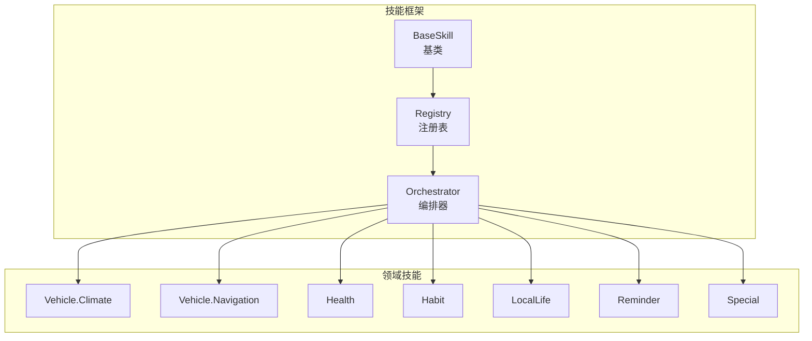
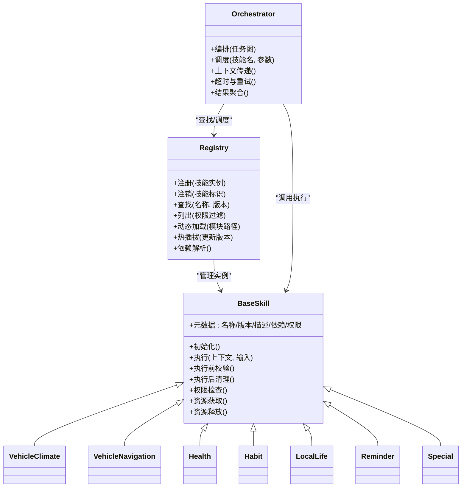
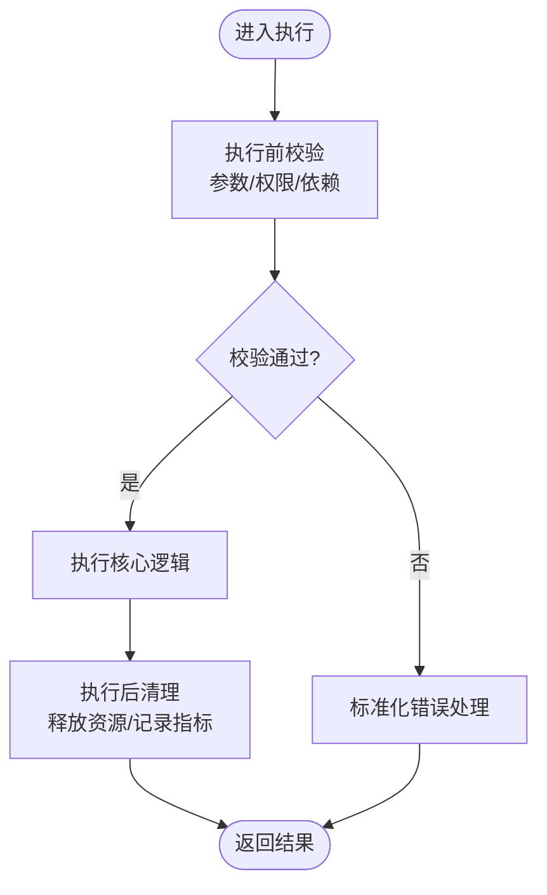
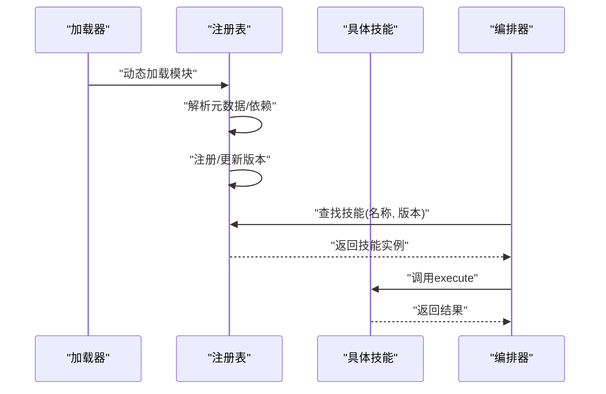
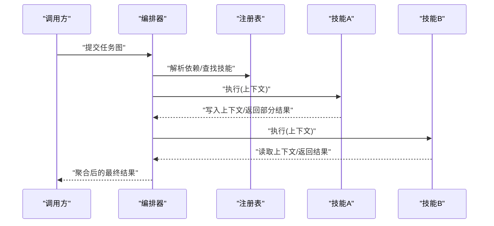
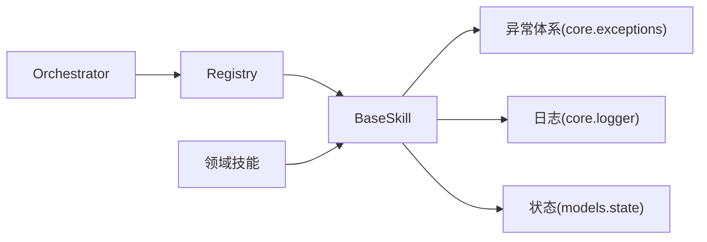

# 技能框架设计

<cite>
**本文引用的文件**   
- [backend_design/nexus/skills/base.py](file://backend_design/nexus/skills/base.py)
- [backend_design/nexus/skills/registry.py](file://backend_design/nexus/skills/registry.py)
- [backend_design/nexus/skills/orchestrator.py](file://backend_design/nexus/skills/orchestrator.py)
- [backend_design/nexus/skills/__init__.py](file://backend_design/nexus/skills/__init__.py)
- [backend_design/nexus/skills/vehicle/climate.py](file://backend_design/nexus/skills/vehicle/climate.py)
- [backend_design/nexus/skills/vehicle/navigation.py](file://backend_design/nexus/skills/vehicle/navigation.py)
- [backend_design/nexus/skills/health.py](file://backend_design/nexus/skills/health.py)
- [backend_design/nexus/skills/habit.py](file://backend_design/nexus/skills/habit.py)
- [backend_design/nexus/skills/local_life.py](file://backend_design/nexus/skills/local_life.py)
- [backend_design/nexus/skills/reminder.py](file://backend_design/nexus/skills/reminder.py)
- [backend_design/nexus/skills/special.py](file://backend_design/nexus/skills/special.py)
- [backend_design/nexus/core/exceptions.py](file://backend_design/nexus/core/exceptions.py)
- [backend_design/nexus/core/logger.py](file://backend_design/nexus/core/logger.py)
- [backend_design/nexus/models/state.py](file://backend_design/nexus/models/state.py)
</cite>

## 目录
1. [简介](#简介)
2. [项目结构](#项目结构)
3. [核心组件](#核心组件)
4. [架构总览](#架构总览)
5. [详细组件分析](#详细组件分析)
6. [依赖关系分析](#依赖关系分析)
7. [性能考虑](#性能考虑)
8. [故障排查指南](#故障排查指南)
9. [结论](#结论)
10. [附录](#附录)

## 简介
本文件面向NexusCockpit的技能框架，系统性阐述基础技能类BaseSkill的设计模式与核心接口、技能注册表Registry的实现原理（动态加载、热插拔、版本管理）、技能元数据定义、依赖声明与权限控制机制，并提供自定义技能开发的完整指南。文档同时覆盖技能间通信、状态管理与资源清理的最佳实践，并给出可落地的示例路径与流程图，帮助读者快速上手与扩展。

## 项目结构
技能框架位于后端模块的skills子系统中，围绕“基类+注册表+编排器”的三层组织方式构建：
- 基类与公共能力：定义技能生命周期、参数校验、错误处理、元数据与权限等通用能力
- 注册表：集中管理技能的发现、注册、卸载、版本选择与热插拔
- 编排器：负责调用链编排、上下文传递、并发与超时控制、结果聚合
- 领域技能：车辆、健康、习惯、本地生活、提醒、特殊场景等具体实现

图表来源
- [backend_design/nexus/skills/base.py](file://backend_design/nexus/skills/base.py)
- [backend_design/nexus/skills/registry.py](file://backend_design/nexus/skills/registry.py)
- [backend_design/nexus/skills/orchestrator.py](file://backend_design/nexus/skills/orchestrator.py)
- [backend_design/nexus/skills/vehicle/climate.py](file://backend_design/nexus/skills/vehicle/climate.py)
- [backend_design/nexus/skills/vehicle/navigation.py](file://backend_design/nexus/skills/vehicle/navigation.py)
- [backend_design/nexus/skills/health.py](file://backend_design/nexus/skills/health.py)
- [backend_design/nexus/skills/habit.py](file://backend_design/nexus/skills/habit.py)
- [backend_design/nexus/skills/local_life.py](file://backend_design/nexus/skills/local_life.py)
- [backend_design/nexus/skills/reminder.py](file://backend_design/nexus/skills/reminder.py)
- [backend_design/nexus/skills/special.py](file://backend_design/nexus/skills/special.py)

章节来源
- [backend_design/nexus/skills/base.py](file://backend_design/nexus/skills/base.py)
- [backend_design/nexus/skills/registry.py](file://backend_design/nexus/skills/registry.py)
- [backend_design/nexus/skills/orchestrator.py](file://backend_design/nexus/skills/orchestrator.py)

## 核心组件
本节聚焦BaseSkill与Registry两大核心，说明其职责边界、关键接口与交互契约。

- BaseSkill（基础技能）
  - 职责：统一技能生命周期钩子、输入输出Schema校验、错误与异常封装、日志与指标埋点、权限检查入口、资源初始化与释放。
  - 关键能力：
    - 生命周期：初始化、执行前校验、执行、执行后清理、失败回滚（可选）
    - 参数验证：基于Schema对入参进行类型、必填、范围等校验
    - 错误处理：将业务异常转换为统一的技能错误对象，便于上层编排
    - 元数据：名称、版本、描述、依赖、权限标签等
    - 权限控制：在execute前后进行鉴权拦截
    - 资源管理：提供统一的资源获取与释放钩子
- Registry（注册表）
  - 职责：维护技能实例映射、支持按名称或ID查找、版本选择、动态加载与热插拔、依赖解析与冲突检测。
  - 关键能力：
    - 注册/注销：运行时新增或移除技能
    - 版本管理：同技能多版本并存，按策略选择最佳版本
    - 动态加载：从包扫描或配置清单加载技能模块
    - 依赖声明：解析技能依赖图，确保加载顺序与可用性
    - 权限过滤：根据当前上下文返回可用技能集合

章节来源
- [backend_design/nexus/skills/base.py](file://backend_design/nexus/skills/base.py)
- [backend_design/nexus/skills/registry.py](file://backend_design/nexus/skills/registry.py)

## 架构总览
下图展示技能框架的整体协作关系：编排器通过注册表解析并调度具体技能；BaseSkill为所有技能提供统一的生命周期与校验能力；领域技能实现各自业务逻辑。

图表来源
- [backend_design/nexus/skills/base.py](file://backend_design/nexus/skills/base.py)
- [backend_design/nexus/skills/registry.py](file://backend_design/nexus/skills/registry.py)
- [backend_design/nexus/skills/orchestrator.py](file://backend_design/nexus/skills/orchestrator.py)
- [backend_design/nexus/skills/vehicle/climate.py](file://backend_design/nexus/skills/vehicle/climate.py)
- [backend_design/nexus/skills/vehicle/navigation.py](file://backend_design/nexus/skills/vehicle/navigation.py)
- [backend_design/nexus/skills/health.py](file://backend_design/nexus/skills/health.py)
- [backend_design/nexus/skills/habit.py](file://backend_design/nexus/skills/habit.py)
- [backend_design/nexus/skills/local_life.py](file://backend_design/nexus/skills/local_life.py)
- [backend_design/nexus/skills/reminder.py](file://backend_design/nexus/skills/reminder.py)
- [backend_design/nexus/skills/special.py](file://backend_design/nexus/skills/special.py)

## 详细组件分析

### BaseSkill设计与生命周期
BaseSkill定义了技能的标准模板方法，子类只需关注业务执行逻辑，其余由基类统一管理。

- 生命周期阶段
  - 初始化：加载配置、建立连接、预热资源
  - 执行前校验：参数Schema校验、权限检查、前置依赖检查
  - 执行：核心业务逻辑
  - 执行后清理：释放资源、记录指标、持久化中间态（可选）
  - 失败回滚：在需要时撤销已生效的外部副作用
- 参数验证
  - 使用Schema定义输入/输出结构，支持类型、必填、枚举、范围等约束
  - 校验失败抛出标准化错误，便于上层捕获与提示
- 错误处理
  - 将业务异常包装为统一错误对象，包含错误码、消息、上下文信息
  - 区分可恢复与不可恢复错误，配合编排器进行重试或降级
- 权限控制
  - 在execute前后进行鉴权拦截，结合上下文中的用户/租户/角色信息
- 资源管理
  - 提供统一的资源获取与释放钩子，避免泄漏

图表来源
- [backend_design/nexus/skills/base.py](file://backend_design/nexus/skills/base.py)
- [backend_design/nexus/core/exceptions.py](file://backend_design/nexus/core/exceptions.py)
- [backend_design/nexus/core/logger.py](file://backend_design/nexus/core/logger.py)

章节来源
- [backend_design/nexus/skills/base.py](file://backend_design/nexus/skills/base.py)
- [backend_design/nexus/core/exceptions.py](file://backend_design/nexus/core/exceptions.py)
- [backend_design/nexus/core/logger.py](file://backend_design/nexus/core/logger.py)

### 注册表Registry实现原理
Registry负责技能的发现、注册、版本选择与热插拔，是框架可扩展性的关键。

- 动态加载
  - 支持从包扫描或配置清单加载技能模块，自动识别并注册到内存映射
- 热插拔
  - 运行时注册新技能或替换旧版本，无需重启服务
- 版本管理
  - 同一技能可存在多个版本，按策略（如最高兼容版本、指定版本）选择
- 依赖声明与解析
  - 每个技能声明依赖列表，注册表在加载时解析依赖图，保证顺序与可用性
- 权限过滤
  - 根据当前上下文（用户/租户/角色）过滤可用技能集合

图表来源
- [backend_design/nexus/skills/registry.py](file://backend_design/nexus/skills/registry.py)
- [backend_design/nexus/skills/orchestrator.py](file://backend_design/nexus/skills/orchestrator.py)

章节来源
- [backend_design/nexus/skills/registry.py](file://backend_design/nexus/skills/registry.py)
- [backend_design/nexus/skills/orchestrator.py](file://backend_design/nexus/skills/orchestrator.py)

### 编排器Orchestrator与技能间通信
编排器负责将多个技能组合成工作流，管理上下文传递、并发、超时与重试、结果聚合。

- 上下文传递
  - 使用共享上下文对象在各技能间传递请求级状态与中间结果
- 技能间通信
  - 通过上下文读写共享数据，或通过事件总线发布/订阅（若集成）
- 并发与超时
  - 支持并行调用独立技能，设置全局或单技能超时
- 结果聚合
  - 将多个技能的结果合并为最终响应，必要时进行转换与格式化

图表来源
- [backend_design/nexus/skills/orchestrator.py](file://backend_design/nexus/skills/orchestrator.py)
- [backend_design/nexus/skills/registry.py](file://backend_design/nexus/skills/registry.py)

章节来源
- [backend_design/nexus/skills/orchestrator.py](file://backend_design/nexus/skills/orchestrator.py)

### 领域技能示例与最佳实践
以下领域技能展示了如何继承BaseSkill、定义Schema、声明依赖与权限，并在execute中实现业务逻辑。

- 车辆相关
  - 空调控制：Vehicle.Climate
  - 导航：Vehicle.Navigation
- 其他领域
  - 健康：Health
  - 习惯：Habit
  - 本地生活：LocalLife
  - 提醒：Reminder
  - 特殊场景：Special

开发要点
- 继承BaseSkill，重写execute与必要的钩子
- 定义输入/输出Schema，确保类型与约束正确
- 声明依赖与权限标签，便于注册表与权限系统处理
- 在execute前后进行必要的资源获取与释放
- 使用统一错误对象，避免泄露内部异常

章节来源
- [backend_design/nexus/skills/vehicle/climate.py](file://backend_design/nexus/skills/vehicle/climate.py)
- [backend_design/nexus/skills/vehicle/navigation.py](file://backend_design/nexus/skills/vehicle/navigation.py)
- [backend_design/nexus/skills/health.py](file://backend_design/nexus/skills/health.py)
- [backend_design/nexus/skills/habit.py](file://backend_design/nexus/skills/habit.py)
- [backend_design/nexus/skills/local_life.py](file://backend_design/nexus/skills/local_life.py)
- [backend_design/nexus/skills/reminder.py](file://backend_design/nexus/skills/reminder.py)
- [backend_design/nexus/skills/special.py](file://backend_design/nexus/skills/special.py)

### 自定义技能开发指南
- 步骤一：创建技能类
  - 继承BaseSkill，填写元数据（名称、版本、描述、依赖、权限）
- 步骤二：定义Schema
  - 输入Schema：字段、类型、必填、默认值、取值范围
  - 输出Schema：结构化返回，便于编排器聚合
- 步骤三：实现execute
  - 读取上下文与输入参数
  - 执行业务逻辑，处理外部调用
  - 返回符合输出Schema的结果
- 步骤四：资源管理
  - 在初始化钩子中获取资源，在清理钩子中释放
- 步骤五：错误处理
  - 使用统一错误对象，明确错误码与消息
- 步骤六：权限控制
  - 在execute前后进行鉴权，拒绝无权限访问
- 步骤七：注册与热插拔
  - 通过注册表动态加载或手动注册，支持运行时更新版本

章节来源
- [backend_design/nexus/skills/base.py](file://backend_design/nexus/skills/base.py)
- [backend_design/nexus/skills/registry.py](file://backend_design/nexus/skills/registry.py)

### 状态管理与上下文
- 上下文对象
  - 用于跨技能传递请求级状态、中间结果、临时缓存
- 状态存储
  - 可使用模型层的状态管理（如state.py）持久化关键状态
- 注意事项
  - 避免在上下文中存放敏感信息
  - 合理划分上下文作用域，防止污染

章节来源
- [backend_design/nexus/models/state.py](file://backend_design/nexus/models/state.py)

## 依赖关系分析
- 组件耦合
  - BaseSkill与领域技能：松耦合，通过接口与Schema约定
  - Registry与Orchestrator：强耦合，编排器依赖注册表进行查找与调度
  - 领域技能与外部系统：通过适配器或工具类隔离，降低直接依赖
- 外部依赖
  - 日志与指标：core.logger与observability（若集成）
  - 异常体系：core.exceptions
  - 状态模型：models.state

图表来源
- [backend_design/nexus/skills/base.py](file://backend_design/nexus/skills/base.py)
- [backend_design/nexus/skills/registry.py](file://backend_design/nexus/skills/registry.py)
- [backend_design/nexus/skills/orchestrator.py](file://backend_design/nexus/skills/orchestrator.py)
- [backend_design/nexus/core/exceptions.py](file://backend_design/nexus/core/exceptions.py)
- [backend_design/nexus/core/logger.py](file://backend_design/nexus/core/logger.py)
- [backend_design/nexus/models/state.py](file://backend_design/nexus/models/state.py)

章节来源
- [backend_design/nexus/skills/base.py](file://backend_design/nexus/skills/base.py)
- [backend_design/nexus/skills/registry.py](file://backend_design/nexus/skills/registry.py)
- [backend_design/nexus/skills/orchestrator.py](file://backend_design/nexus/skills/orchestrator.py)
- [backend_design/nexus/core/exceptions.py](file://backend_design/nexus/core/exceptions.py)
- [backend_design/nexus/core/logger.py](file://backend_design/nexus/core/logger.py)
- [backend_design/nexus/models/state.py](file://backend_design/nexus/models/state.py)

## 性能考虑
- 批量与并行
  - 对无依赖的技能采用并行执行，缩短整体时延
- 超时与熔断
  - 为外部调用设置超时，结合熔断策略避免雪崩
- 缓存与复用
  - 对读多写少的数据进行缓存，减少重复计算
- 资源池
  - 数据库/HTTP连接等资源使用连接池，避免频繁创建销毁
- 监控与度量
  - 记录关键指标（耗时、错误率、吞吐），辅助定位瓶颈

[本节为通用指导，不直接分析具体文件]

## 故障排查指南
- 常见问题
  - 参数校验失败：检查输入Schema与传参类型
  - 权限不足：确认上下文中的用户/租户/角色信息与权限标签匹配
  - 依赖缺失：查看注册表的依赖解析日志，确认依赖是否已加载
  - 资源泄漏：检查初始化与清理钩子是否成对调用
- 定位手段
  - 启用详细日志，关注执行前校验与执行后清理阶段
  - 使用统一错误对象的错误码与消息，快速定位问题根因
  - 通过注册表列出当前可用技能与版本，确认热插拔是否生效

章节来源
- [backend_design/nexus/core/exceptions.py](file://backend_design/nexus/core/exceptions.py)
- [backend_design/nexus/core/logger.py](file://backend_design/nexus/core/logger.py)
- [backend_design/nexus/skills/registry.py](file://backend_design/nexus/skills/registry.py)

## 结论
NexusCockpit的技能框架以BaseSkill为核心抽象，结合Registry与Orchestrator实现了高内聚、低耦合的可扩展架构。通过统一的元数据、Schema与错误处理，开发者可以快速构建高质量技能；通过动态加载与热插拔，系统具备在线演进能力。建议在实际项目中遵循本文档的最佳实践，持续完善监控与测试，保障稳定性与可维护性。

[本节为总结性内容，不直接分析具体文件]

## 附录
- 参考实现路径
  - 车辆技能：[backend_design/nexus/skills/vehicle/climate.py](file://backend_design/nexus/skills/vehicle/climate.py)、[backend_design/nexus/skills/vehicle/navigation.py](file://backend_design/nexus/skills/vehicle/navigation.py)
  - 健康与习惯：[backend_design/nexus/skills/health.py](file://backend_design/nexus/skills/health.py)、[backend_design/nexus/skills/habit.py](file://backend_design/nexus/skills/habit.py)
  - 本地生活与提醒：[backend_design/nexus/skills/local_life.py](file://backend_design/nexus/skills/local_life.py)、[backend_design/nexus/skills/reminder.py](file://backend_design/nexus/skills/reminder.py)
  - 特殊场景：[backend_design/nexus/skills/special.py](file://backend_design/nexus/skills/special.py)
- 公共入口
  - 技能包初始化：[backend_design/nexus/skills/__init__.py](file://backend_design/nexus/skills/__init__.py)