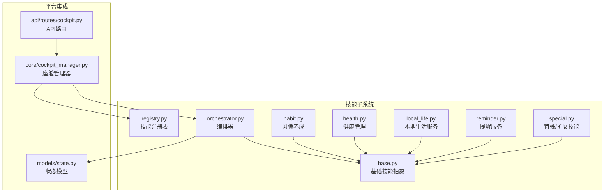
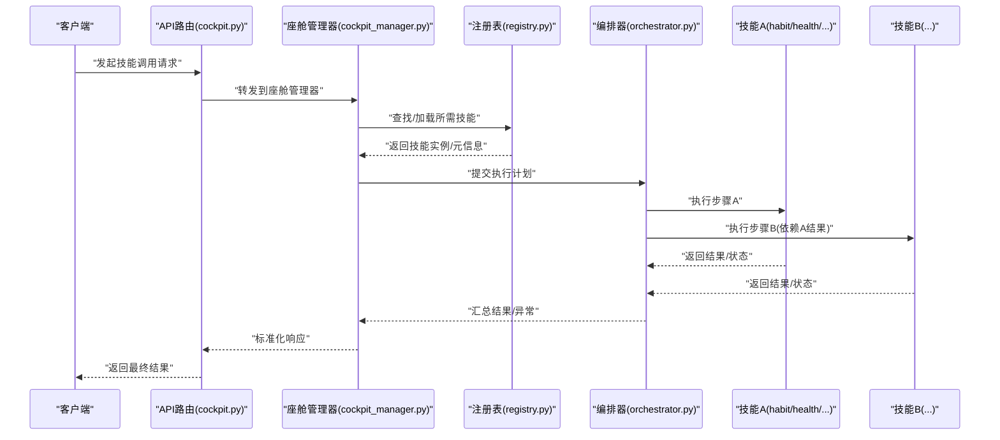
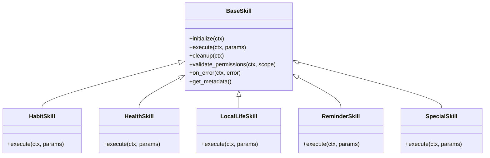
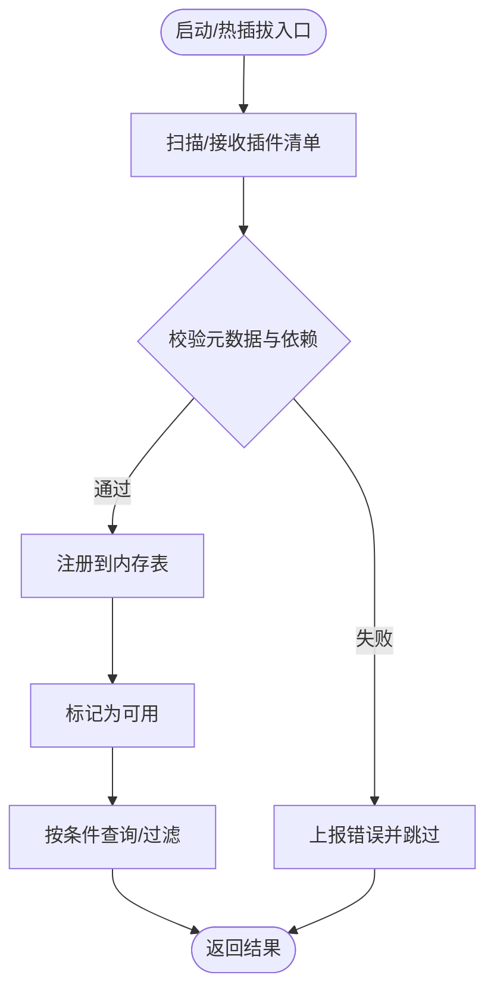
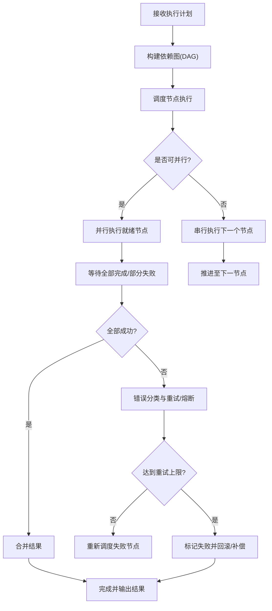
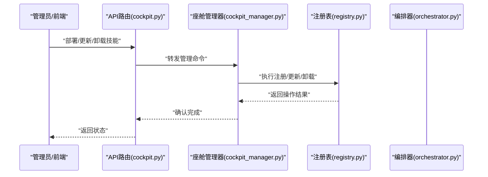
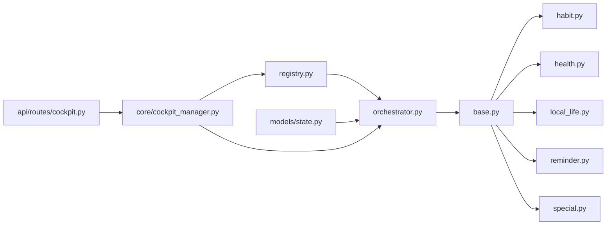

# 技能系统

<cite>
**本文引用的文件**   
- [backend_design/nexus/skills/base.py](file://backend_design/nexus/skills/base.py)
- [backend_design/nexus/skills/registry.py](file://backend_design/nexus/skills/registry.py)
- [backend_design/nexus/skills/orchestrator.py](file://backend_design/nexus/skills/orchestrator.py)
- [backend_design/nexus/skills/habit.py](file://backend_design/nexus/skills/habit.py)
- [backend_design/nexus/skills/health.py](file://backend_design/nexus/skills/health.py)
- [backend_design/nexus/skills/local_life.py](file://backend_design/nexus/skills/local_life.py)
- [backend_design/nexus/skills/reminder.py](file://backend_design/nexus/skills/reminder.py)
- [backend_design/nexus/skills/special.py](file://backend_design/nexus/skills/special.py)
- [backend_design/nexus/core/cockpit_manager.py](file://backend_design/nexus/core/cockpit_manager.py)
- [backend_design/nexus/api/routes/cockpit.py](file://backend_design/nexus/api/routes/cockpit.py)
- [backend_design/nexus/models/state.py](file://backend_design/nexus/models/state.py)
</cite>

## 目录
1. [简介](#简介)
2. [项目结构](#项目结构)
3. [核心组件](#核心组件)
4. [架构总览](#架构总览)
5. [详细组件分析](#详细组件分析)
6. [依赖关系分析](#依赖关系分析)
7. [性能考量](#性能考量)
8. [故障排查指南](#故障排查指南)
9. [结论](#结论)
10. [附录](#附录)

## 简介
本文件为 NexusCockpit 的技能系统提供全面文档，覆盖技能注册机制、编排器工作原理、动态加载与热插拔能力、基础技能类设计与扩展接口、内置技能功能说明（习惯养成、健康管理、本地生活服务、提醒服务等），以及自定义技能开发指南（定义、参数配置、权限控制、错误处理）和最佳实践（协作、依赖管理、版本兼容）。

## 项目结构
技能系统位于后端模块的 skills 子包中，围绕“基础抽象 + 注册中心 + 编排器”的三层设计组织。核心入口由 CockpitManager 统一装配并对外暴露 API。

图表来源
- [backend_design/nexus/skills/base.py](file://backend_design/nexus/skills/base.py)
- [backend_design/nexus/skills/registry.py](file://backend_design/nexus/skills/registry.py)
- [backend_design/nexus/skills/orchestrator.py](file://backend_design/nexus/skills/orchestrator.py)
- [backend_design/nexus/skills/habit.py](file://backend_design/nexus/skills/habit.py)
- [backend_design/nexus/skills/health.py](file://backend_design/nexus/skills/health.py)
- [backend_design/nexus/skills/local_life.py](file://backend_design/nexus/skills/local_life.py)
- [backend_design/nexus/skills/reminder.py](file://backend_design/nexus/skills/reminder.py)
- [backend_design/nexus/skills/special.py](file://backend_design/nexus/skills/special.py)
- [backend_design/nexus/core/cockpit_manager.py](file://backend_design/nexus/core/cockpit_manager.py)
- [backend_design/nexus/api/routes/cockpit.py](file://backend_design/nexus/api/routes/cockpit.py)
- [backend_design/nexus/models/state.py](file://backend_design/nexus/models/state.py)

章节来源
- [backend_design/nexus/skills/base.py](file://backend_design/nexus/skills/base.py)
- [backend_design/nexus/skills/registry.py](file://backend_design/nexus/skills/registry.py)
- [backend_design/nexus/skills/orchestrator.py](file://backend_design/nexus/skills/orchestrator.py)
- [backend_design/nexus/core/cockpit_manager.py](file://backend_design/nexus/core/cockpit_manager.py)
- [backend_design/nexus/api/routes/cockpit.py](file://backend_design/nexus/api/routes/cockpit.py)
- [backend_design/nexus/models/state.py](file://backend_design/nexus/models/state.py)

## 核心组件
- 基础技能抽象：定义技能的通用生命周期、上下文、输入输出契约、权限校验钩子与错误语义，供所有具体技能继承实现。
- 注册中心：维护技能元数据与实例映射，支持按名称/标签查询、条件过滤、动态发现与卸载。
- 编排器：根据意图或策略将多个技能组合为执行计划，负责调度、依赖解析、并发控制、重试与回滚。
- 内置技能：习惯养成、健康管理、本地生活服务、提醒服务、特殊技能等，均基于基础抽象实现。
- 平台集成：座舱管理器在启动时完成注册与初始化；API 路由通过管理器调用编排器执行技能流程。

章节来源
- [backend_design/nexus/skills/base.py](file://backend_design/nexus/skills/base.py)
- [backend_design/nexus/skills/registry.py](file://backend_design/nexus/skills/registry.py)
- [backend_design/nexus/skills/orchestrator.py](file://backend_design/nexus/skills/orchestrator.py)
- [backend_design/nexus/skills/habit.py](file://backend_design/nexus/skills/habit.py)
- [backend_design/nexus/skills/health.py](file://backend_design/nexus/skills/health.py)
- [backend_design/nexus/skills/local_life.py](file://backend_design/nexus/skills/local_life.py)
- [backend_design/nexus/skills/reminder.py](file://backend_design/nexus/skills/reminder.py)
- [backend_design/nexus/skills/special.py](file://backend_design/nexus/skills/special.py)
- [backend_design/nexus/core/cockpit_manager.py](file://backend_design/nexus/core/cockpit_manager.py)
- [backend_design/nexus/api/routes/cockpit.py](file://backend_design/nexus/api/routes/cockpit.py)

## 架构总览
技能系统采用“插件化 + 编排式”的架构：
- 插件化：每个技能以独立模块形式存在，遵循统一接口并通过注册中心集中管理。
- 编排式：编排器依据任务目标与依赖图进行动态组装与执行，支持并行、重试、熔断与降级。
- 热插拔：运行时可新增/更新/移除技能，无需重启服务。

图表来源
- [backend_design/nexus/api/routes/cockpit.py](file://backend_design/nexus/api/routes/cockpit.py)
- [backend_design/nexus/core/cockpit_manager.py](file://backend_design/nexus/core/cockpit_manager.py)
- [backend_design/nexus/skills/registry.py](file://backend_design/nexus/skills/registry.py)
- [backend_design/nexus/skills/orchestrator.py](file://backend_design/nexus/skills/orchestrator.py)
- [backend_design/nexus/skills/habit.py](file://backend_design/nexus/skills/habit.py)
- [backend_design/nexus/skills/health.py](file://backend_design/nexus/skills/health.py)

## 详细组件分析

### 基础技能类与扩展接口
- 职责边界：定义统一的输入输出模型、上下文对象、生命周期钩子（初始化、执行、清理）、权限校验点、错误类型与重试策略。
- 扩展方式：新技能通过继承基础类并实现必要方法完成接入；可通过元数据声明依赖、版本约束、权限范围与资源需求。
- 设计模式：模板方法模式（骨架流程固定，细节由子类实现）、策略模式（不同技能作为可替换策略）、观察者模式（事件通知用于编排与监控）。

图表来源
- [backend_design/nexus/skills/base.py](file://backend_design/nexus/skills/base.py)
- [backend_design/nexus/skills/habit.py](file://backend_design/nexus/skills/habit.py)
- [backend_design/nexus/skills/health.py](file://backend_design/nexus/skills/health.py)
- [backend_design/nexus/skills/local_life.py](file://backend_design/nexus/skills/local_life.py)
- [backend_design/nexus/skills/reminder.py](file://backend_design/nexus/skills/reminder.py)
- [backend_design/nexus/skills/special.py](file://backend_design/nexus/skills/special.py)

章节来源
- [backend_design/nexus/skills/base.py](file://backend_design/nexus/skills/base.py)
- [backend_design/nexus/skills/habit.py](file://backend_design/nexus/skills/habit.py)
- [backend_design/nexus/skills/health.py](file://backend_design/nexus/skills/health.py)
- [backend_design/nexus/skills/local_life.py](file://backend_design/nexus/skills/local_life.py)
- [backend_design/nexus/skills/reminder.py](file://backend_design/nexus/skills/reminder.py)
- [backend_design/nexus/skills/special.py](file://backend_design/nexus/skills/special.py)

### 注册中心（动态加载与热插拔）
- 注册机制：启动阶段扫描并注册内置技能；运行时支持按需加载外部插件。
- 元数据管理：记录技能名称、版本、依赖、权限范围、资源限制等。
- 热插拔：支持在线添加、更新、卸载技能，保证服务不中断。
- 查询与过滤：按名称、标签、版本区间、权限范围检索可用技能。

图表来源
- [backend_design/nexus/skills/registry.py](file://backend_design/nexus/skills/registry.py)

章节来源
- [backend_design/nexus/skills/registry.py](file://backend_design/nexus/skills/registry.py)

### 编排器（执行计划与依赖管理）
- 计划生成：根据任务目标与技能元数据构建有向无环图（DAG），解析依赖顺序。
- 执行策略：支持串行、并行、分支与汇聚；具备超时、重试、熔断与降级策略。
- 状态同步：在执行过程中维护中间状态，便于恢复与审计。
- 错误处理：捕获异常、分类错误、触发补偿动作与告警。

图表来源
- [backend_design/nexus/skills/orchestrator.py](file://backend_design/nexus/skills/orchestrator.py)
- [backend_design/nexus/models/state.py](file://backend_design/nexus/models/state.py)

章节来源
- [backend_design/nexus/skills/orchestrator.py](file://backend_design/nexus/skills/orchestrator.py)
- [backend_design/nexus/models/state.py](file://backend_design/nexus/models/state.py)

### 内置技能概览
- 习惯养成：跟踪用户日常行为、设定目标与提醒、周期性评估与反馈。
- 健康管理：采集健康指标、生成建议、联动提醒与健康档案。
- 本地生活服务：整合周边服务（餐饮、出行、娱乐等），提供查询与预订能力。
- 提醒服务：定时/条件触发提醒，支持多通道通知与优先级管理。
- 特殊技能：面向特定场景的扩展能力，如设备控制、第三方系统集成等。

章节来源
- [backend_design/nexus/skills/habit.py](file://backend_design/nexus/skills/habit.py)
- [backend_design/nexus/skills/health.py](file://backend_design/nexus/skills/health.py)
- [backend_design/nexus/skills/local_life.py](file://backend_design/nexus/skills/local_life.py)
- [backend_design/nexus/skills/reminder.py](file://backend_design/nexus/skills/reminder.py)
- [backend_design/nexus/skills/special.py](file://backend_design/nexus/skills/special.py)

### 平台集成与API
- 座舱管理器：在应用启动时完成注册与编排器初始化，提供统一的技能调用入口。
- API 路由：将外部请求转换为内部编排指令，封装鉴权、限流与日志追踪。
- 状态模型：贯穿执行过程的状态持久化与快照，支持断点续跑与审计。

图表来源
- [backend_design/nexus/api/routes/cockpit.py](file://backend_design/nexus/api/routes/cockpit.py)
- [backend_design/nexus/core/cockpit_manager.py](file://backend_design/nexus/core/cockpit_manager.py)
- [backend_design/nexus/skills/registry.py](file://backend_design/nexus/skills/registry.py)
- [backend_design/nexus/skills/orchestrator.py](file://backend_design/nexus/skills/orchestrator.py)

章节来源
- [backend_design/nexus/core/cockpit_manager.py](file://backend_design/nexus/core/cockpit_manager.py)
- [backend_design/nexus/api/routes/cockpit.py](file://backend_design/nexus/api/routes/cockpit.py)

## 依赖关系分析
- 内聚性：基础抽象与注册中心职责清晰，编排器专注执行计划与调度，各内置技能仅关注领域逻辑。
- 耦合度：编排器对注册中心与状态模型存在直接依赖；API 层通过管理器间接访问技能子系统。
- 外部依赖：可能涉及存储、消息队列、外部服务（健康数据源、本地生活供应商等），通过适配器隔离。

图表来源
- [backend_design/nexus/skills/base.py](file://backend_design/nexus/skills/base.py)
- [backend_design/nexus/skills/registry.py](file://backend_design/nexus/skills/registry.py)
- [backend_design/nexus/skills/orchestrator.py](file://backend_design/nexus/skills/orchestrator.py)
- [backend_design/nexus/skills/habit.py](file://backend_design/nexus/skills/habit.py)
- [backend_design/nexus/skills/health.py](file://backend_design/nexus/skills/health.py)
- [backend_design/nexus/skills/local_life.py](file://backend_design/nexus/skills/local_life.py)
- [backend_design/nexus/skills/reminder.py](file://backend_design/nexus/skills/reminder.py)
- [backend_design/nexus/skills/special.py](file://backend_design/nexus/skills/special.py)
- [backend_design/nexus/core/cockpit_manager.py](file://backend_design/nexus/core/cockpit_manager.py)
- [backend_design/nexus/api/routes/cockpit.py](file://backend_design/nexus/api/routes/cockpit.py)
- [backend_design/nexus/models/state.py](file://backend_design/nexus/models/state.py)

章节来源
- [backend_design/nexus/skills/base.py](file://backend_design/nexus/skills/base.py)
- [backend_design/nexus/skills/registry.py](file://backend_design/nexus/skills/registry.py)
- [backend_design/nexus/skills/orchestrator.py](file://backend_design/nexus/skills/orchestrator.py)
- [backend_design/nexus/core/cockpit_manager.py](file://backend_design/nexus/core/cockpit_manager.py)
- [backend_design/nexus/api/routes/cockpit.py](file://backend_design/nexus/api/routes/cockpit.py)
- [backend_design/nexus/models/state.py](file://backend_design/nexus/models/state.py)

## 性能考量
- 并发与并行：编排器应充分利用并行执行减少端到端延迟，同时避免资源争用。
- 缓存与去重：对读多写少的查询（如本地生活服务）引入缓存层，降低外部依赖压力。
- 背压与限流：在高负载下对上游请求进行限流，保护下游服务与数据库。
- 幂等与重试：确保关键操作的幂等性，合理设置重试退避策略。
- 资源隔离：为高消耗技能分配独立线程池或进程池，防止相互影响。

[本节为通用指导，不涉及具体文件分析]

## 故障排查指南
- 常见问题
  - 技能未注册：检查注册表是否包含对应元数据与实例。
  - 依赖缺失：核对依赖声明与实际可用版本。
  - 权限不足：确认调用方权限范围与技能要求匹配。
  - 执行超时：调整超时阈值或优化下游服务。
  - 循环依赖：检查 DAG 是否存在环，必要时拆分技能。
- 定位手段
  - 查看编排器日志与状态快照，定位失败节点。
  - 使用注册表的查询接口验证技能可用性。
  - 通过 API 路由的请求链路追踪定位问题环节。
- 恢复策略
  - 自动重试与熔断后降级到备用路径。
  - 回滚已变更状态，保持系统一致性。

章节来源
- [backend_design/nexus/skills/orchestrator.py](file://backend_design/nexus/skills/orchestrator.py)
- [backend_design/nexus/skills/registry.py](file://backend_design/nexus/skills/registry.py)
- [backend_design/nexus/api/routes/cockpit.py](file://backend_design/nexus/api/routes/cockpit.py)

## 结论
NexusCockpit 的技能系统通过清晰的抽象、灵活的注册与强大的编排能力，实现了插件化与热插拔的高可用架构。内置技能覆盖了用户日常生活的多个方面，开发者可基于统一接口快速扩展。配合完善的错误处理、性能优化与运维工具，系统具备良好的可维护性与可扩展性。

[本节为总结性内容，不涉及具体文件分析]

## 附录

### 自定义技能开发指南
- 技能定义
  - 继承基础技能类，实现必要的生命周期方法与业务逻辑。
  - 声明元数据：名称、版本、描述、依赖、权限范围、资源需求。
- 参数配置
  - 定义输入参数模型，进行必填项与格式校验。
  - 支持默认值、枚举值与范围约束。
- 权限控制
  - 在权限校验钩子中检查调用者身份与作用域。
  - 结合角色与资源粒度进行细粒度授权。
- 错误处理
  - 区分可重试与不可重试错误，返回标准错误码与消息。
  - 记录上下文信息以便排障。
- 测试与发布
  - 编写单元测试与集成测试，覆盖正常与异常路径。
  - 通过注册中心进行灰度发布与回滚。

章节来源
- [backend_design/nexus/skills/base.py](file://backend_design/nexus/skills/base.py)
- [backend_design/nexus/skills/registry.py](file://backend_design/nexus/skills/registry.py)
- [backend_design/nexus/skills/orchestrator.py](file://backend_design/nexus/skills/orchestrator.py)

### 技能间协作与依赖管理最佳实践
- 明确依赖边界：通过元数据声明强依赖与弱依赖，编排器据此生成安全执行计划。
- 解耦与适配：使用适配器屏蔽外部差异，提升复用性。
- 版本兼容：采用向后兼容策略，逐步淘汰旧接口；在注册表中维护版本区间。
- 可观测性：埋点关键指标（耗时、成功率、错误率），纳入统一监控。

章节来源
- [backend_design/nexus/skills/registry.py](file://backend_design/nexus/skills/registry.py)
- [backend_design/nexus/skills/orchestrator.py](file://backend_design/nexus/skills/orchestrator.py)