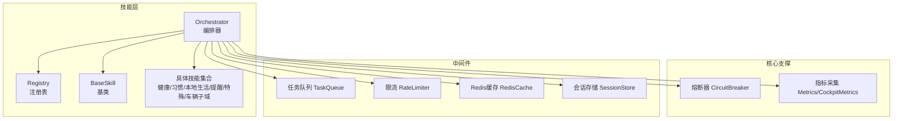
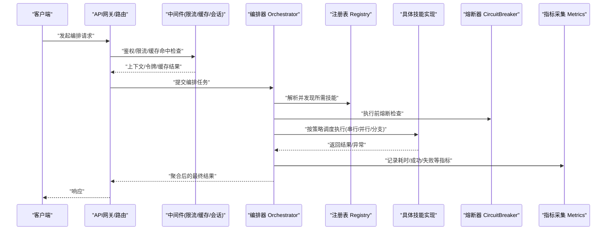
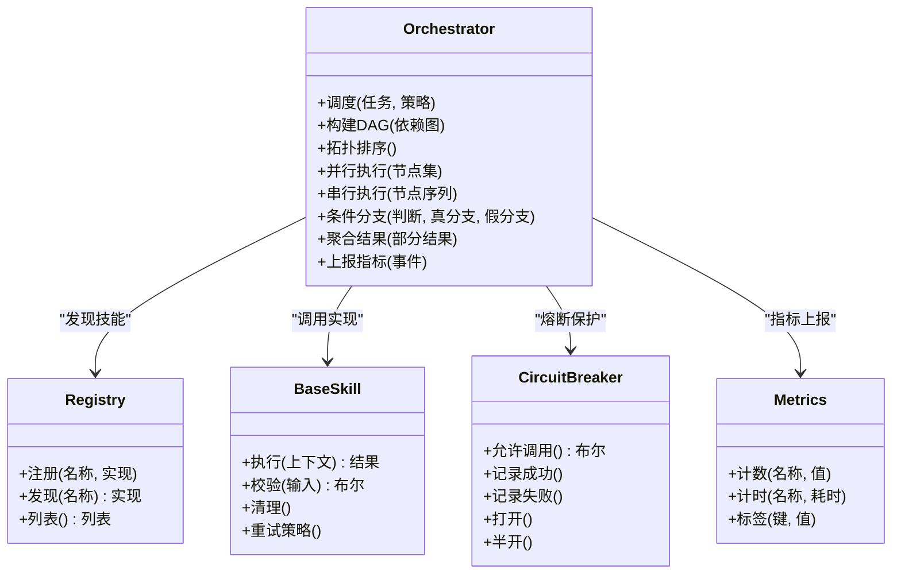
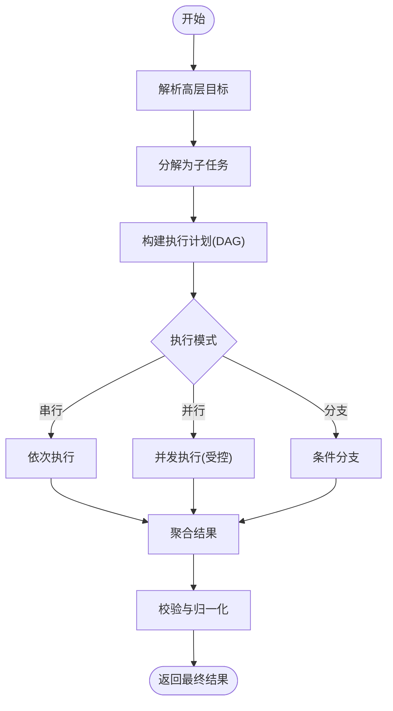
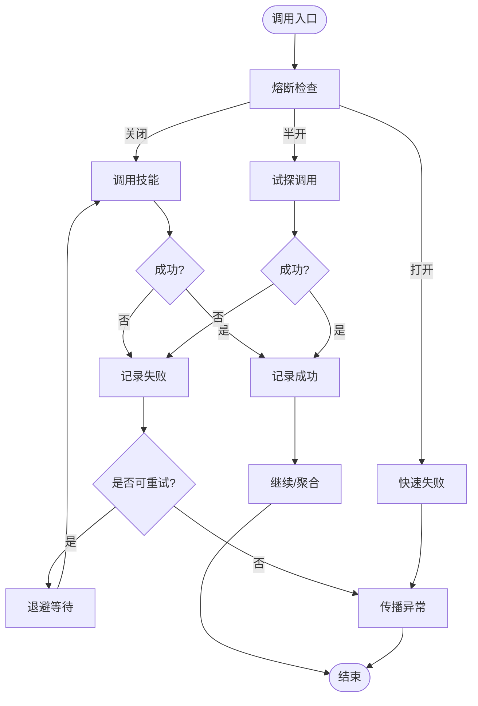
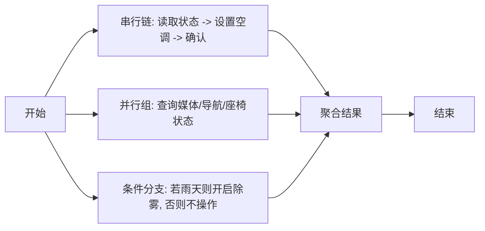
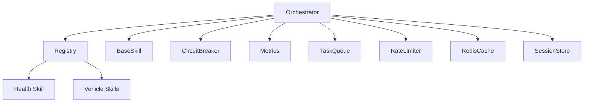

# 技能编排器

<cite>
**本文引用的文件**   
- [orchestrator.py](file://backend_design/nexus/skills/orchestrator.py)
- [base.py](file://backend_design/nexus/skills/base.py)
- [registry.py](file://backend_design/nexus/skills/registry.py)
- [health.py](file://backend_design/nexus/skills/health.py)
- [habit.py](file://backend_design/nexus/skills/habit.py)
- [local_life.py](file://backend_design/nexus/skills/local_life.py)
- [reminder.py](file://backend_design/nexus/skills/reminder.py)
- [special.py](file://backend_design/nexus/skills/special.py)
- [vehicle/climate.py](file://backend_design/nexus/skills/vehicle/climate.py)
- [vehicle/media.py](file://backend_design/nexus/skills/vehicle/media.py)
- [vehicle/navigation.py](file://backend_design/nexus/skills/vehicle/navigation.py)
- [vehicle/seat.py](file://backend_design/nexus/skills/vehicle/seat.py)
- [vehicle/status.py](file://backend_design/nexus/skills/vehicle/status.py)
- [vehicle/window.py](file://backend_design/nexus/skills/vehicle/window.py)
- [circuit_breaker.py](file://backend_design/nexus/core/circuit_breaker.py)
- [cockpit_metrics.py](file://backend_design/nexus/observability/cockpit_metrics.py)
- [metrics.py](file://backend_design/nexus/observability/metrics.py)
- [task_queue.py](file://backend_design/nexus/middleware/task_queue.py)
- [rate_limiter.py](file://backend_design/nexus/middleware/rate_limiter.py)
- [redis_cache.py](file://backend_design/nexus/middleware/redis_cache.py)
- [session_store.py](file://backend_design/nexus/middleware/session_store.py)
- [main.py](file://backend_design/nexus/main.py)
- [config.py](file://backend_design/nexus/config.py)
</cite>

## 目录
1. [简介](#简介)
2. [项目结构](#项目结构)
3. [核心组件](#核心组件)
4. [架构总览](#架构总览)
5. [详细组件分析](#详细组件分析)
6. [依赖关系分析](#依赖关系分析)
7. [性能与资源调度](#性能与资源调度)
8. [故障排查指南](#故障排查指南)
9. [结论](#结论)
10. [附录：编排模式与示例](#附录编排模式与示例)

## 简介
本文件面向NexusCockpit的技能编排器，聚焦Orchestrator类及其周边能力，系统性阐述以下主题：
- 技能调度算法、执行顺序控制与并发管理
- 复杂任务分解、子技能调用与结果聚合
- 错误传播、重试策略与熔断机制
- 多技能协作的编排模式（串行、并行、条件分支）
- 性能优化、资源调度与监控指标配置
- 实际业务场景编排示例（健康管理流程、车辆控制组合操作等）

## 项目结构
围绕“技能编排”的核心代码位于 backend_design/nexus/skills 目录，配合 core 层的熔断器、middleware 层的队列/限流/缓存与会话存储，以及 observability 层的指标采集，共同构成可观测、可治理、可扩展的编排体系。

图表来源
- [orchestrator.py](file://backend_design/nexus/skills/orchestrator.py)
- [registry.py](file://backend_design/nexus/skills/registry.py)
- [base.py](file://backend_design/nexus/skills/base.py)
- [circuit_breaker.py](file://backend_design/nexus/core/circuit_breaker.py)
- [cockpit_metrics.py](file://backend_design/nexus/observability/cockpit_metrics.py)
- [metrics.py](file://backend_design/nexus/observability/metrics.py)
- [task_queue.py](file://backend_design/nexus/middleware/task_queue.py)
- [rate_limiter.py](file://backend_design/nexus/middleware/rate_limiter.py)
- [redis_cache.py](file://backend_design/nexus/middleware/redis_cache.py)
- [session_store.py](file://backend_design/nexus/middleware/session_store.py)

章节来源
- [orchestrator.py](file://backend_design/nexus/skills/orchestrator.py)
- [registry.py](file://backend_design/nexus/skills/registry.py)
- [base.py](file://backend_design/nexus/skills/base.py)
- [circuit_breaker.py](file://backend_design/nexus/core/circuit_breaker.py)
- [cockpit_metrics.py](file://backend_design/nexus/observability/cockpit_metrics.py)
- [metrics.py](file://backend_design/nexus/observability/metrics.py)
- [task_queue.py](file://backend_design/nexus/middleware/task_queue.py)
- [rate_limiter.py](file://backend_design/nexus/middleware/rate_limiter.py)
- [redis_cache.py](file://backend_design/nexus/middleware/redis_cache.py)
- [session_store.py](file://backend_design/nexus/middleware/session_store.py)

## 核心组件
- Orchestrator（编排器）
  - 职责：解析用户意图或上游任务，将复杂目标拆解为子任务，按策略调度并执行具体技能，聚合结果并返回。
  - 关键能力：
    - 调度算法：支持串行、并行、条件分支等多种执行模式；可结合优先级与依赖关系进行拓扑排序。
    - 执行顺序控制：基于有向无环图（DAG）或声明式编排描述，确保依赖满足后再执行。
    - 并发管理：通过线程池/协程池或任务队列控制并发度，避免资源争用。
    - 结果聚合：对并行结果进行合并、过滤、去重与归一化。
    - 上下文传递：携带会话、租户、权限、设备状态等上下文信息贯穿执行链路。
- Registry（技能注册表）
  - 职责：维护技能名称到实现的映射，提供发现、加载与版本选择能力。
- BaseSkill（技能基类）
  - 职责：定义统一接口（输入校验、执行、清理）、通用日志/指标埋点、错误封装与重试钩子。
- 具体技能
  - 健康/习惯/本地生活/提醒/特殊/车辆子域等，均继承自BaseSkill并通过Registry注册。

章节来源
- [orchestrator.py](file://backend_design/nexus/skills/orchestrator.py)
- [registry.py](file://backend_design/nexus/skills/registry.py)
- [base.py](file://backend_design/nexus/skills/base.py)
- [health.py](file://backend_design/nexus/skills/health.py)
- [habit.py](file://backend_design/nexus/skills/habit.py)
- [local_life.py](file://backend_design/nexus/skills/local_life.py)
- [reminder.py](file://backend_design/nexus/skills/reminder.py)
- [special.py](file://backend_design/nexus/skills/special.py)
- [vehicle/climate.py](file://backend_design/nexus/skills/vehicle/climate.py)
- [vehicle/media.py](file://backend_design/nexus/skills/vehicle/media.py)
- [vehicle/navigation.py](file://backend_design/nexus/skills/vehicle/navigation.py)
- [vehicle/seat.py](file://backend_design/nexus/skills/vehicle/seat.py)
- [vehicle/status.py](file://backend_design/nexus/skills/vehicle/status.py)
- [vehicle/window.py](file://backend_design/nexus/skills/vehicle/window.py)

## 架构总览
下图展示了从请求进入至编排执行的端到端路径，涵盖中间件、编排器、熔断器与指标采集。

图表来源
- [orchestrator.py](file://backend_design/nexus/skills/orchestrator.py)
- [registry.py](file://backend_design/nexus/skills/registry.py)
- [circuit_breaker.py](file://backend_design/nexus/core/circuit_breaker.py)
- [cockpit_metrics.py](file://backend_design/nexus/observability/cockpit_metrics.py)
- [metrics.py](file://backend_design/nexus/observability/metrics.py)
- [task_queue.py](file://backend_design/nexus/middleware/task_queue.py)
- [rate_limiter.py](file://backend_design/nexus/middleware/rate_limiter.py)
- [redis_cache.py](file://backend_design/nexus/middleware/redis_cache.py)
- [session_store.py](file://backend_design/nexus/middleware/session_store.py)

## 详细组件分析

### Orchestrator 类工作原理
- 调度算法
  - 支持多种模式：串行、并行、条件分支；可按依赖关系构建DAG并拓扑排序。
  - 优先级与权重：在同等依赖下，依据优先级决定执行次序。
- 执行顺序控制
  - 基于声明式编排描述或动态解析生成执行计划，保证前置节点完成后再触发后续节点。
- 并发管理
  - 使用任务队列或线程/协程池限制并发度，避免下游服务过载。
- 结果聚合
  - 对并行结果进行合并、过滤、去重与格式归一化，形成统一的输出模型。
- 上下文与状态
  - 贯穿会话、租户、设备状态、权限等信息，供各技能消费。
- 可观测性
  - 在每个阶段埋点：开始/结束、耗时、成功/失败、重试次数、熔断状态等。

图表来源
- [orchestrator.py](file://backend_design/nexus/skills/orchestrator.py)
- [registry.py](file://backend_design/nexus/skills/registry.py)
- [base.py](file://backend_design/nexus/skills/base.py)
- [circuit_breaker.py](file://backend_design/nexus/core/circuit_breaker.py)
- [metrics.py](file://backend_design/nexus/observability/metrics.py)

章节来源
- [orchestrator.py](file://backend_design/nexus/skills/orchestrator.py)
- [registry.py](file://backend_design/nexus/skills/registry.py)
- [base.py](file://backend_design/nexus/skills/base.py)
- [circuit_breaker.py](file://backend_design/nexus/core/circuit_breaker.py)
- [metrics.py](file://backend_design/nexus/observability/metrics.py)

### 复杂任务分解、子技能调用与结果聚合
- 任务分解
  - 将高层目标拆分为原子子任务，标注依赖与约束（如必须/可选、超时、重试）。
- 子技能调用
  - 通过Registry定位具体实现，注入上下文参数，执行并捕获异常。
- 结果聚合
  - 合并多个子任务的输出，处理缺失项与冲突项，生成标准化结果。

图表来源
- [orchestrator.py](file://backend_design/nexus/skills/orchestrator.py)
- [registry.py](file://backend_design/nexus/skills/registry.py)

章节来源
- [orchestrator.py](file://backend_design/nexus/skills/orchestrator.py)
- [registry.py](file://backend_design/nexus/skills/registry.py)

### 错误传播、重试策略与熔断机制
- 错误传播
  - 子任务异常向上冒泡，编排器根据策略决定是否继续、跳过或终止。
- 重试策略
  - 指数退避、最大重试次数、幂等性与去抖；区分可重试与不可重试异常。
- 熔断机制
  - 基于成功率/错误率/慢调用比例判定打开/半开/关闭状态，快速失败与恢复探测。

图表来源
- [circuit_breaker.py](file://backend_design/nexus/core/circuit_breaker.py)
- [orchestrator.py](file://backend_design/nexus/skills/orchestrator.py)

章节来源
- [circuit_breaker.py](file://backend_design/nexus/core/circuit_breaker.py)
- [orchestrator.py](file://backend_design/nexus/skills/orchestrator.py)

### 多技能协作编排模式
- 串行执行
  - 适用于强依赖与顺序敏感的场景，如先读取车辆状态再执行空调设置。
- 并行执行
  - 适用于独立子任务，如同时查询媒体与导航状态，缩短整体时延。
- 条件分支
  - 根据上下文或前序结果选择不同路径，如根据天气调整车内环境策略。

图表来源
- [orchestrator.py](file://backend_design/nexus/skills/orchestrator.py)

章节来源
- [orchestrator.py](file://backend_design/nexus/skills/orchestrator.py)

## 依赖关系分析
- 直接依赖
  - Orchestrator 依赖 Registry 进行技能发现，依赖 BaseSkill 的统一接口，依赖 CircuitBreaker 进行保护，依赖 Metrics 进行观测。
- 间接依赖
  - 通过中间件（任务队列、限流、缓存、会话存储）增强稳定性与吞吐。
- 外部集成
  - 车辆子系统、健康数据源、本地生活服务、提醒服务等作为具体技能实现接入。

图表来源
- [orchestrator.py](file://backend_design/nexus/skills/orchestrator.py)
- [registry.py](file://backend_design/nexus/skills/registry.py)
- [base.py](file://backend_design/nexus/skills/base.py)
- [circuit_breaker.py](file://backend_design/nexus/core/circuit_breaker.py)
- [metrics.py](file://backend_design/nexus/observability/metrics.py)
- [task_queue.py](file://backend_design/nexus/middleware/task_queue.py)
- [rate_limiter.py](file://backend_design/nexus/middleware/rate_limiter.py)
- [redis_cache.py](file://backend_design/nexus/middleware/redis_cache.py)
- [session_store.py](file://backend_design/nexus/middleware/session_store.py)
- [health.py](file://backend_design/nexus/skills/health.py)
- [vehicle/climate.py](file://backend_design/nexus/skills/vehicle/climate.py)
- [vehicle/media.py](file://backend_design/nexus/skills/vehicle/media.py)
- [vehicle/navigation.py](file://backend_design/nexus/skills/vehicle/navigation.py)
- [vehicle/seat.py](file://backend_design/nexus/skills/vehicle/seat.py)
- [vehicle/status.py](file://backend_design/nexus/skills/vehicle/status.py)
- [vehicle/window.py](file://backend_design/nexus/skills/vehicle/window.py)

章节来源
- [orchestrator.py](file://backend_design/nexus/skills/orchestrator.py)
- [registry.py](file://backend_design/nexus/skills/registry.py)
- [base.py](file://backend_design/nexus/skills/base.py)
- [circuit_breaker.py](file://backend_design/nexus/core/circuit_breaker.py)
- [metrics.py](file://backend_design/nexus/observability/metrics.py)
- [task_queue.py](file://backend_design/nexus/middleware/task_queue.py)
- [rate_limiter.py](file://backend_design/nexus/middleware/rate_limiter.py)
- [redis_cache.py](file://backend_design/nexus/middleware/redis_cache.py)
- [session_store.py](file://backend_design/nexus/middleware/session_store.py)
- [health.py](file://backend_design/nexus/skills/health.py)
- [vehicle/climate.py](file://backend_design/nexus/skills/vehicle/climate.py)
- [vehicle/media.py](file://backend_design/nexus/skills/vehicle/media.py)
- [vehicle/navigation.py](file://backend_design/nexus/skills/vehicle/navigation.py)
- [vehicle/seat.py](file://backend_design/nexus/skills/vehicle/seat.py)
- [vehicle/status.py](file://backend_design/nexus/skills/vehicle/status.py)
- [vehicle/window.py](file://backend_design/nexus/skills/vehicle/window.py)

## 性能与资源调度
- 并发控制
  - 通过任务队列与线程/协程池限制并发度，避免下游过载。
- 缓存与去重
  - 利用Redis缓存热点数据，减少重复计算与IO开销。
- 限流与背压
  - 在入口层实施限流，保障系统稳定；在高负载时启用背压策略。
- 指标与告警
  - 采集P95/P99延迟、成功率、错误码分布、熔断状态、队列长度等指标，用于容量规划与问题定位。
- 配置要点
  - 合理设置并发度、超时时间、重试次数与退避策略、熔断阈值与窗口大小。

章节来源
- [task_queue.py](file://backend_design/nexus/middleware/task_queue.py)
- [redis_cache.py](file://backend_design/nexus/middleware/redis_cache.py)
- [rate_limiter.py](file://backend_design/nexus/middleware/rate_limiter.py)
- [cockpit_metrics.py](file://backend_design/nexus/observability/cockpit_metrics.py)
- [metrics.py](file://backend_design/nexus/observability/metrics.py)
- [config.py](file://backend_design/nexus/config.py)

## 故障排查指南
- 常见问题
  - 熔断频繁打开：检查下游错误率与慢调用比例，评估阈值与窗口大小。
  - 重试风暴：确认幂等性与退避策略，避免雪崩。
  - 结果不一致：检查并行执行的去重与合并逻辑，确保一致性。
  - 指标缺失：确认埋点位置与上报通道是否正常。
- 诊断步骤
  - 查看编排日志与指标面板，定位瓶颈节点。
  - 检查熔断状态与重试次数，验证配置合理性。
  - 审查中间件限流与缓存命中率，评估资源占用。
  - 复现最小用例，逐步隔离问题范围。

章节来源
- [circuit_breaker.py](file://backend_design/nexus/core/circuit_breaker.py)
- [cockpit_metrics.py](file://backend_design/nexus/observability/cockpit_metrics.py)
- [metrics.py](file://backend_design/nexus/observability/metrics.py)
- [task_queue.py](file://backend_design/nexus/middleware/task_queue.py)
- [rate_limiter.py](file://backend_design/nexus/middleware/rate_limiter.py)
- [redis_cache.py](file://backend_design/nexus/middleware/redis_cache.py)

## 结论
NexusCockpit的技能编排器以Orchestrator为核心，结合Registry、BaseSkill、熔断器与指标采集，提供了高内聚、低耦合、可观测且可治理的编排能力。通过串行、并行与条件分支的组合，能够灵活应对复杂业务场景；借助中间件与配置化策略，可在稳定性、性能与成本之间取得平衡。

## 附录：编排模式与示例

### 健康管理流程编排示例
- 目标：综合健康建议（体检数据、生活习惯、饮食与运动）
- 模式：并行收集 + 条件分支 + 串行汇总
- 步骤：
  - 并行获取体检指标、习惯记录、饮食偏好
  - 条件分支：若某指标异常则增加专项建议
  - 串行汇总：生成个性化健康报告

章节来源
- [health.py](file://backend_design/nexus/skills/health.py)
- [habit.py](file://backend_design/nexus/skills/habit.py)
- [local_life.py](file://backend_design/nexus/skills/local_life.py)
- [orchestrator.py](file://backend_design/nexus/skills/orchestrator.py)

### 车辆控制组合操作编排示例
- 目标：舒适驾驶准备（空调、座椅、媒体、车窗）
- 模式：串行依赖 + 并行读取状态
- 步骤：
  - 并行读取媒体、导航、座椅、车窗状态
  - 串行执行：设置空调温度/风量 -> 调整座椅位置 -> 确认车窗状态
  - 聚合结果并反馈执行摘要

章节来源
- [vehicle/climate.py](file://backend_design/nexus/skills/vehicle/climate.py)
- [vehicle/media.py](file://backend_design/nexus/skills/vehicle/media.py)
- [vehicle/navigation.py](file://backend_design/nexus/skills/vehicle/navigation.py)
- [vehicle/seat.py](file://backend_design/nexus/skills/vehicle/seat.py)
- [vehicle/status.py](file://backend_design/nexus/skills/vehicle/status.py)
- [vehicle/window.py](file://backend_design/nexus/skills/vehicle/window.py)
- [orchestrator.py](file://backend_design/nexus/skills/orchestrator.py)

### 监控指标与配置方法
- 指标维度
  - 编排任务：开始/结束、耗时、成功/失败、重试次数、熔断状态
  - 技能级：调用次数、错误码分布、P95/P99延迟
  - 中间件：队列长度、限流拒绝数、缓存命中率
- 配置项建议
  - 并发度、超时、重试次数与退避、熔断阈值与窗口、缓存TTL、限流阈值

章节来源
- [cockpit_metrics.py](file://backend_design/nexus/observability/cockpit_metrics.py)
- [metrics.py](file://backend_design/nexus/observability/metrics.py)
- [config.py](file://backend_design/nexus/config.py)