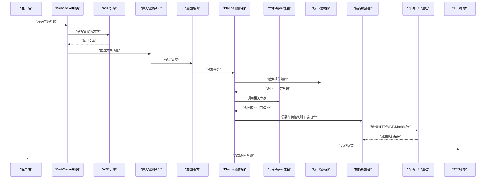
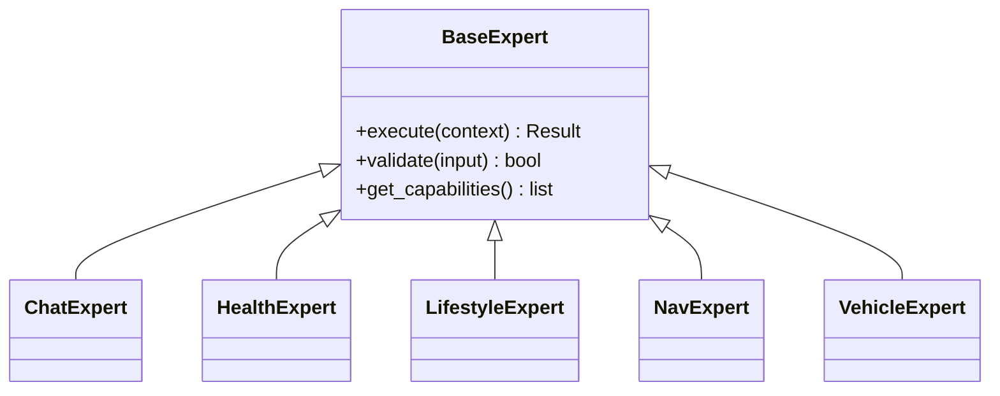
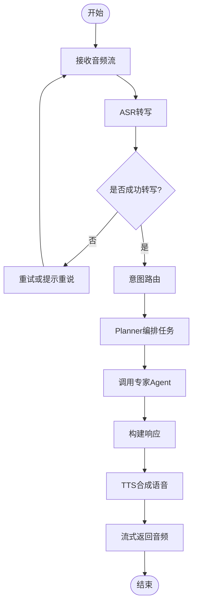
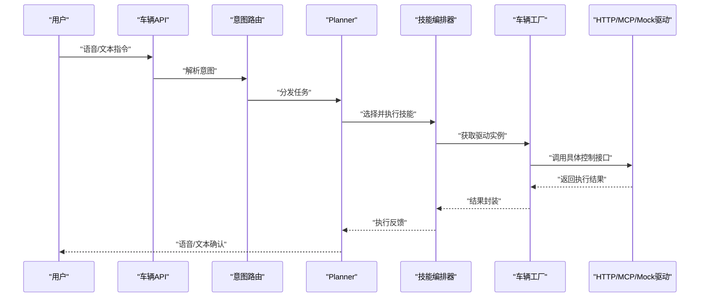
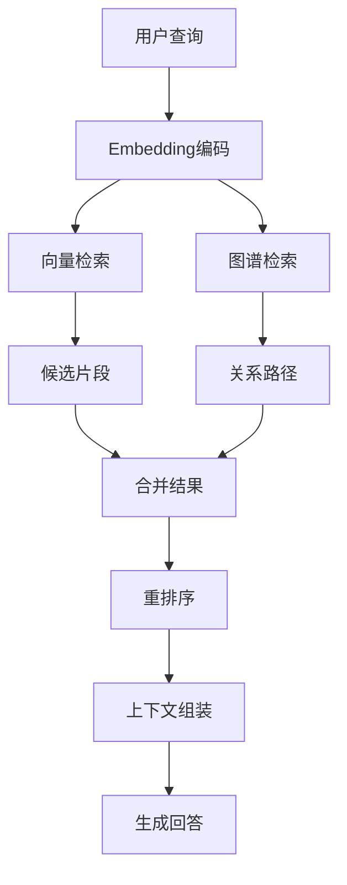
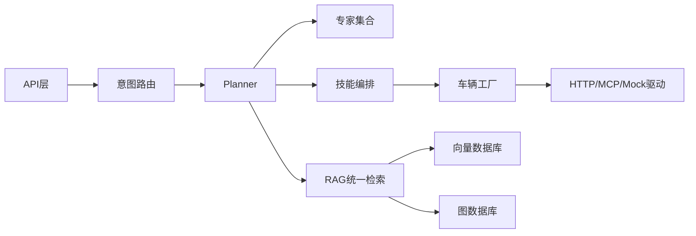

# 核心功能特性

<cite>
**本文引用的文件**   
- [backend_design/nexus/main.py](file://backend_design/nexus/main.py)
- [backend_design/nexus/config.py](file://backend_design/nexus/config.py)
- [backend_design/nexus/agent/planner.py](file://backend_design/nexus/agent/planner.py)
- [backend_design/nexus/agent/responder.py](file://backend_design/nexus/agent/responder.py)
- [backend_design/nexus/agent/reviewer.py](file://backend_design/nexus/agent/reviewer.py)
- [backend_design/nexus/agent/subagent_monitor.py](file://backend_design/nexus/agent/subagent_monitor.py)
- [backend_design/nexus/agent/graph.py](file://backend_design/nexus/agent/graph.py)
- [backend_design/nexus/agent/supervisor_graph.py](file://backend_design/nexus/agent/supervisor_graph.py)
- [backend_design/nexus/agent/experts/base.py](file://backend_design/nexus/agent/experts/base.py)
- [backend_design/nexus/agent/experts/chat_expert.py](file://backend_design/nexus/agent/experts/chat_expert.py)
- [backend_design/nexus/agent/experts/health_expert.py](file://backend_design/nexus/agent/experts/health_expert.py)
- [backend_design/nexus/agent/experts/lifestyle_expert.py](file://backend_design/nexus/agent/experts/lifestyle_expert.py)
- [backend_design/nexus/agent/experts/nav_expert.py](file://backend_design/nexus/agent/experts/nav_expert.py)
- [backend_design/nexus/agent/experts/vehicle_expert.py](file://backend_design/nexus/agent/experts/vehicle_expert.py)
- [backend_design/nexus/api/routes/chat.py](file://backend_design/nexus/api/routes/chat.py)
- [backend_design/nexus/api/routes/cockpit.py](file://backend_design/nexus/api/routes/cockpit.py)
- [backend_design/nexus/api/routes/vehicle.py](file://backend_design/nexus/api/routes/vehicle.py)
- [backend_design/nexus/api/websocket.py](file://backend_design/nexus/api/websocket.py)
- [backend_design/nexus/asr/engine.py](file://backend_design/nexus/asr/engine.py)
- [backend_design/nexus/tts/engine.py](file://backend_design/nexus/tts/engine.py)
- [backend_design/nexus/intent/router.py](file://backend_design/nexus/intent/router.py)
- [backend_design/nexus/intent/heuristic.py](file://backend_design/nexus/intent/heuristic.py)
- [backend_design/nexus/intent/llm_router.py](file://backend_design/nexus/intent/llm_router.py)
- [backend_design/nexus/rag/unified_retriever.py](file://backend_design/nexus/rag/unified_retriever.py)
- [backend_design/nexus/rag/vector_store.py](file://backend_design/nexus/rag/vector_store.py)
- [backend_design/nexus/rag/zilliz_vector_store.py](file://backend_design/nexus/rag/zilliz_vector_store.py)
- [backend_design/nexus/rag/graph_store.py](file://backend_design/nexus/rag/graph_store.py)
- [backend_design/nexus/rag/aura_graph_store.py](file://backend_design/nexus/rag/aura_graph_store.py)
- [backend_design/nexus/rag/embedding.py](file://backend_design/nexus/rag/embedding.py)
- [backend_design/nexus/rag/reranker.py](file://backend_design/nexus/rag/reranker.py)
- [backend_design/nexus/rag/cherry_kb.py](file://backend_design/nexus/rag/cherry_kb.py)
- [backend_design/nexus/skills/orchestrator.py](file://backend_design/nexus/skills/orchestrator.py)
- [backend_design/nexus/skills/registry.py](file://backend_design/nexus/skills/registry.py)
- [backend_design/nexus/skills/vehicle/climate.py](file://backend_design/nexus/skills/vehicle/climate.py)
- [backend_design/nexus/skills/vehicle/navigation.py](file://backend_design/nexus/skills/vehicle/navigation.py)
- [backend_design/nexus/skills/vehicle/media.py](file://backend_design/nexus/skills/vehicle/media.py)
- [backend_design/nexus/skills/vehicle/seat.py](file://backend_design/nexus/skills/vehicle/seat.py)
- [backend_design/nexus/skills/vehicle/window.py](file://backend_design/nexus/skills/vehicle/window.py)
- [backend_design/nexus/vehicle/factory.py](file://backend_design/nexus/vehicle/factory.py)
- [backend_design/nexus/vehicle/http.py](file://backend_design/nexus/vehicle/http.py)
- [backend_design/nexus/vehicle/mcp.py](file://backend_design/nexus/vehicle/mcp.py)
- [backend_design/nexus/vehicle/mock.py](file://backend_design/nexus/vehicle/mock.py)
- [backend_design/nexus/core/cockpit_manager.py](file://backend_design/nexus/core/cockpit_manager.py)
- [backend_design/nexus/memory/manager.py](file://backend_design/nexus/memory/manager.py)
- [backend_design/nexus/models/state.py](file://backend_design/nexus/models/state.py)
- [backend_design/nexus/observability/metrics.py](file://backend_design/nexus/observability/metrics.py)
</cite>

## 目录
1. [简介](#简介)
2. [项目结构](#项目结构)
3. [核心组件](#核心组件)
4. [架构总览](#架构总览)
5. [详细组件分析](#详细组件分析)
6. [依赖关系分析](#依赖关系分析)
7. [性能考量](#性能考量)
8. [故障排查指南](#故障排查指南)
9. [结论](#结论)
10. [附录](#附录)

## 简介
本文件面向NexusCockpit系统的核心功能特性，聚焦以下能力：
- AI Agent多专家协作系统：健康助手、生活方式建议、导航专家、车辆专家等专用Agent的协同机制与编排。
- 语音交互系统：ASR（自动语音识别）与TTS（文本转语音）集成，支持实时对话与自然语言处理。
- 车辆控制：空调、导航、媒体、座椅、车窗等能力的统一调用与执行。
- 知识管理：检索增强生成（RAG），向量数据库与图数据库集成，提升回答准确性与可解释性。
- 使用示例与配置说明：为每个核心功能提供端到端的使用路径与关键配置项指引。

## 项目结构
后端采用分层模块化设计，围绕“API网关 -> 意图路由 -> Agent编排 -> 技能/工具 -> 外部服务”的主线组织代码。前端通过WebSocket与后端进行实时语音/文本交互。

```mermaid
graph TB
subgraph "应用入口"
Main["main.py"]
Config["config.py"]
end
subgraph "API层"
ChatAPI["api/routes/chat.py"]
CockpitAPI["api/routes/cockpit.py"]
VehicleAPI["api/routes/vehicle.py"]
WS["api/websocket.py"]
end
subgraph "意图与编排"
IntentRouter["intent/router.py"]
Heuristic["intent/heuristic.py"]
LLMMapper["intent/llm_router.py"]
Planner["agent/planner.py"]
Responder["agent/responder.py"]
Reviewer["agent/reviewer.py"]
SubMonitor["agent/subagent_monitor.py"]
Graph["agent/graph.py"]
Supervisor["agent/supervisor_graph.py"]
end
subgraph "专家Agent"
BaseExpert["agent/experts/base.py"]
ChatExpert["agent/experts/chat_expert.py"]
HealthExpert["agent/experts/health_expert.py"]
LifestyleExpert["agent/experts/lifestyle_expert.py"]
NavExpert["agent/experts/nav_expert.py"]
VehicleExpert["agent/experts/vehicle_expert.py"]
end
subgraph "知识与检索"
UnifiedRetriever["rag/unified_retriever.py"]
VectorStore["rag/vector_store.py"]
ZillizVS["rag/zilliz_vector_store.py"]
GraphStore["rag/graph_store.py"]
AuraGS["rag/aura_graph_store.py"]
Embedding["rag/embedding.py"]
Reranker["rag/reranker.py"]
CherryKB["rag/cherry_kb.py"]
end
subgraph "技能与车辆"
SkillOrchestrator["skills/orchestrator.py"]
SkillRegistry["skills/registry.py"]
Climate["skills/vehicle/climate.py"]
Navigation["skills/vehicle/navigation.py"]
Media["skills/vehicle/media.py"]
Seat["skills/vehicle/seat.py"]
Window["skills/vehicle/window.py"]
VehicleFactory["vehicle/factory.py"]
VehicleHTTP["vehicle/http.py"]
VehicleMCP["vehicle/mcp.py"]
VehicleMock["vehicle/mock.py"]
end
subgraph "语音"
ASREngine["asr/engine.py"]
TTSEngine["tts/engine.py"]
end
subgraph "核心与记忆"
CockpitMgr["core/cockpit_manager.py"]
MemoryMgr["memory/manager.py"]
StateModel["models/state.py"]
Metrics["observability/metrics.py"]
end
Main --> Config
Main --> ChatAPI
Main --> CockpitAPI
Main --> VehicleAPI
Main --> WS
ChatAPI --> IntentRouter
CockpitAPI --> IntentRouter
VehicleAPI --> IntentRouter
IntentRouter --> Planner
Planner --> Responder
Responder --> Reviewer
Responder --> SubMonitor
Planner --> Graph
Planner --> Supervisor
Planner --> BaseExpert
Planner --> ChatExpert
Planner --> HealthExpert
Planner --> LifestyleExpert
Planner --> NavExpert
Planner --> VehicleExpert
Planner --> UnifiedRetriever
UnifiedRetriever --> VectorStore
VectorStore --> ZillizVS
UnifiedRetriever --> GraphStore
GraphStore --> AuraGS
UnifiedRetriever --> Embedding
UnifiedRetriever --> Reranker
UnifiedRetriever --> CherryKB
Planner --> SkillOrchestrator
SkillOrchestrator --> SkillRegistry
SkillOrchestrator --> Climate
SkillOrchestrator --> Navigation
SkillOrchestrator --> Media
SkillOrchestrator --> Seat
SkillOrchestrator --> Window
SkillOrchestrator --> VehicleFactory
VehicleFactory --> VehicleHTTP
VehicleFactory --> VehicleMCP
VehicleFactory --> VehicleMock
WS --> ASREngine
Responder --> TTSEngine
Planner --> CockpitMgr
Planner --> MemoryMgr
Planner --> StateModel
Planner --> Metrics
```

图表来源
- [backend_design/nexus/main.py](file://backend_design/nexus/main.py)
- [backend_design/nexus/config.py](file://backend_design/nexus/config.py)
- [backend_design/nexus/api/routes/chat.py](file://backend_design/nexus/api/routes/chat.py)
- [backend_design/nexus/api/routes/cockpit.py](file://backend_design/nexus/api/routes/cockpit.py)
- [backend_design/nexus/api/routes/vehicle.py](file://backend_design/nexus/api/routes/vehicle.py)
- [backend_design/nexus/api/websocket.py](file://backend_design/nexus/api/websocket.py)
- [backend_design/nexus/intent/router.py](file://backend_design/nexus/intent/router.py)
- [backend_design/nexus/intent/heuristic.py](file://backend_design/nexus/intent/heuristic.py)
- [backend_design/nexus/intent/llm_router.py](file://backend_design/nexus/intent/llm_router.py)
- [backend_design/nexus/agent/planner.py](file://backend_design/nexus/agent/planner.py)
- [backend_design/nexus/agent/responder.py](file://backend_design/nexus/agent/responder.py)
- [backend_design/nexus/agent/reviewer.py](file://backend_design/nexus/agent/reviewer.py)
- [backend_design/nexus/agent/subagent_monitor.py](file://backend_design/nexus/agent/subagent_monitor.py)
- [backend_design/nexus/agent/graph.py](file://backend_design/nexus/agent/graph.py)
- [backend_design/nexus/agent/supervisor_graph.py](file://backend_design/nexus/agent/supervisor_graph.py)
- [backend_design/nexus/agent/experts/base.py](file://backend_design/nexus/agent/experts/base.py)
- [backend_design/nexus/agent/experts/chat_expert.py](file://backend_design/nexus/agent/experts/chat_expert.py)
- [backend_design/nexus/agent/experts/health_expert.py](file://backend_design/nexus/agent/experts/health_expert.py)
- [backend_design/nexus/agent/experts/lifestyle_expert.py](file://backend_design/nexus/agent/experts/lifestyle_expert.py)
- [backend_design/nexus/agent/experts/nav_expert.py](file://backend_design/nexus/agent/experts/nav_expert.py)
- [backend_design/nexus/agent/experts/vehicle_expert.py](file://backend_design/nexus/agent/experts/vehicle_expert.py)
- [backend_design/nexus/rag/unified_retriever.py](file://backend_design/nexus/rag/unified_retriever.py)
- [backend_design/nexus/rag/vector_store.py](file://backend_design/nexus/rag/vector_store.py)
- [backend_design/nexus/rag/zilliz_vector_store.py](file://backend_design/nexus/rag/zilliz_vector_store.py)
- [backend_design/nexus/rag/graph_store.py](file://backend_design/nexus/rag/graph_store.py)
- [backend_design/nexus/rag/aura_graph_store.py](file://backend_design/nexus/rag/aura_graph_store.py)
- [backend_design/nexus/rag/embedding.py](file://backend_design/nexus/rag/embedding.py)
- [backend_design/nexus/rag/reranker.py](file://backend_design/nexus/rag/reranker.py)
- [backend_design/nexus/rag/cherry_kb.py](file://backend_design/nexus/rag/cherry_kb.py)
- [backend_design/nexus/skills/orchestrator.py](file://backend_design/nexus/skills/orchestrator.py)
- [backend_design/nexus/skills/registry.py](file://backend_design/nexus/skills/registry.py)
- [backend_design/nexus/skills/vehicle/climate.py](file://backend_design/nexus/skills/vehicle/climate.py)
- [backend_design/nexus/skills/vehicle/navigation.py](file://backend_design/nexus/skills/vehicle/navigation.py)
- [backend_design/nexus/skills/vehicle/media.py](file://backend_design/nexus/skills/vehicle/media.py)
- [backend_design/nexus/skills/vehicle/seat.py](file://backend_design/nexus/skills/vehicle/seat.py)
- [backend_design/nexus/skills/vehicle/window.py](file://backend_design/nexus/skills/vehicle/window.py)
- [backend_design/nexus/vehicle/factory.py](file://backend_design/nexus/vehicle/factory.py)
- [backend_design/nexus/vehicle/http.py](file://backend_design/nexus/vehicle/http.py)
- [backend_design/nexus/vehicle/mcp.py](file://backend_design/nexus/vehicle/mcp.py)
- [backend_design/nexus/vehicle/mock.py](file://backend_design/nexus/vehicle/mock.py)
- [backend_design/nexus/asr/engine.py](file://backend_design/nexus/asr/engine.py)
- [backend_design/nexus/tts/engine.py](file://backend_design/nexus/tts/engine.py)
- [backend_design/nexus/core/cockpit_manager.py](file://backend_design/nexus/core/cockpit_manager.py)
- [backend_design/nexus/memory/manager.py](file://backend_design/nexus/memory/manager.py)
- [backend_design/nexus/models/state.py](file://backend_design/nexus/models/state.py)
- [backend_design/nexus/observability/metrics.py](file://backend_design/nexus/observability/metrics.py)

章节来源
- [backend_design/nexus/main.py](file://backend_design/nexus/main.py)
- [backend_design/nexus/config.py](file://backend_design/nexus/config.py)

## 核心组件
- API层：提供聊天、座舱、车辆控制等REST接口，以及WebSocket用于实时语音流式交互。
- 意图路由：基于启发式规则与大模型路由的组合，将用户输入映射到具体领域或专家。
- Agent编排：Planner负责任务分解与调度；Responder负责响应组装；Reviewer负责质量把关；SubagentMonitor监控子任务执行。
- 专家Agent：Chat、Health、Lifestyle、Nav、Vehicle等专用Agent，按职责分工协作。
- 知识检索（RAG）：UnifiedRetriever统一封装向量检索与图谱检索，结合Embedding与Reranker提升相关性。
- 技能与车辆：SkillOrchestrator注册并调度各类车辆技能，通过Vehicle工厂适配HTTP/MCP/Mock等多种后端。
- 语音：ASR引擎将音频转为文本，TTS引擎将文本转为语音，支撑端到端语音对话。
- 核心与记忆：CockpitManager协调会话状态，MemoryManager维护长期记忆，StateModel定义状态结构，Metrics提供观测指标。

章节来源
- [backend_design/nexus/api/routes/chat.py](file://backend_design/nexus/api/routes/chat.py)
- [backend_design/nexus/api/routes/cockpit.py](file://backend_design/nexus/api/routes/cockpit.py)
- [backend_design/nexus/api/routes/vehicle.py](file://backend_design/nexus/api/routes/vehicle.py)
- [backend_design/nexus/api/websocket.py](file://backend_design/nexus/api/websocket.py)
- [backend_design/nexus/intent/router.py](file://backend_design/nexus/intent/router.py)
- [backend_design/nexus/intent/heuristic.py](file://backend_design/nexus/intent/heuristic.py)
- [backend_design/nexus/intent/llm_router.py](file://backend_design/nexus/intent/llm_router.py)
- [backend_design/nexus/agent/planner.py](file://backend_design/nexus/agent/planner.py)
- [backend_design/nexus/agent/responder.py](file://backend_design/nexus/agent/responder.py)
- [backend_design/nexus/agent/reviewer.py](file://backend_design/nexus/agent/reviewer.py)
- [backend_design/nexus/agent/subagent_monitor.py](file://backend_design/nexus/agent/subagent_monitor.py)
- [backend_design/nexus/rag/unified_retriever.py](file://backend_design/nexus/rag/unified_retriever.py)
- [backend_design/nexus/rag/vector_store.py](file://backend_design/nexus/rag/vector_store.py)
- [backend_design/nexus/rag/graph_store.py](file://backend_design/nexus/rag/graph_store.py)
- [backend_design/nexus/skills/orchestrator.py](file://backend_design/nexus/skills/orchestrator.py)
- [backend_design/nexus/skills/registry.py](file://backend_design/nexus/skills/registry.py)
- [backend_design/nexus/vehicle/factory.py](file://backend_design/nexus/vehicle/factory.py)
- [backend_design/nexus/asr/engine.py](file://backend_design/nexus/asr/engine.py)
- [backend_design/nexus/tts/engine.py](file://backend_design/nexus/tts/engine.py)
- [backend_design/nexus/core/cockpit_manager.py](file://backend_design/nexus/core/cockpit_manager.py)
- [backend_design/nexus/memory/manager.py](file://backend_design/nexus/memory/manager.py)
- [backend_design/nexus/models/state.py](file://backend_design/nexus/models/state.py)
- [backend_design/nexus/observability/metrics.py](file://backend_design/nexus/observability/metrics.py)

## 架构总览
下图展示从用户输入到最终输出的完整链路，包括语音、意图、编排、检索、技能与车辆控制的交互。

图表来源
- [backend_design/nexus/api/websocket.py](file://backend_design/nexus/api/websocket.py)
- [backend_design/nexus/asr/engine.py](file://backend_design/nexus/asr/engine.py)
- [backend_design/nexus/api/routes/chat.py](file://backend_design/nexus/api/routes/chat.py)
- [backend_design/nexus/intent/router.py](file://backend_design/nexus/intent/router.py)
- [backend_design/nexus/agent/planner.py](file://backend_design/nexus/agent/planner.py)
- [backend_design/nexus/rag/unified_retriever.py](file://backend_design/nexus/rag/unified_retriever.py)
- [backend_design/nexus/skills/orchestrator.py](file://backend_design/nexus/skills/orchestrator.py)
- [backend_design/nexus/vehicle/factory.py](file://backend_design/nexus/vehicle/factory.py)
- [backend_design/nexus/tts/engine.py](file://backend_design/nexus/tts/engine.py)

## 详细组件分析

### AI Agent多专家协作系统
- 工作原理
  - 意图路由根据输入内容与上下文选择目标专家或组合策略。
  - Planner将复杂任务拆解为子任务，分配给不同专家并行或串行执行。
  - Responder汇总专家输出，构建结构化响应；Reviewer对答案进行校验与修正。
  - SubagentMonitor跟踪子任务执行状态，保障超时与异常恢复。
- 优势
  - 领域隔离：各专家专注特定领域，降低耦合度，提高可维护性与扩展性。
  - 可观测：通过监控与度量，便于定位瓶颈与优化。
  - 可扩展：新增专家只需实现基类接口并注册即可接入。
- 使用示例
  - 健康问答：用户询问健康相关问题，HealthExpert结合RAG检索知识库后给出建议。
  - 生活方式建议：LifestyleExpert根据用户习惯与健康数据生成个性化建议。
  - 导航规划：NavExpert结合地图与交通信息生成路线方案。
  - 车辆控制：VehicleExpert将自然语言指令转换为车辆技能调用。
- 配置说明
  - 在配置中启用相应专家模块，设置专家参数与优先级。
  - 调整Planner的任务拆分策略与并发度。
  - 配置Reviewer的质量阈值与回退策略。

图表来源
- [backend_design/nexus/agent/experts/base.py](file://backend_design/nexus/agent/experts/base.py)
- [backend_design/nexus/agent/experts/chat_expert.py](file://backend_design/nexus/agent/experts/chat_expert.py)
- [backend_design/nexus/agent/experts/health_expert.py](file://backend_design/nexus/agent/experts/health_expert.py)
- [backend_design/nexus/agent/experts/lifestyle_expert.py](file://backend_design/nexus/agent/experts/lifestyle_expert.py)
- [backend_design/nexus/agent/experts/nav_expert.py](file://backend_design/nexus/agent/experts/nav_expert.py)
- [backend_design/nexus/agent/experts/vehicle_expert.py](file://backend_design/nexus/agent/experts/vehicle_expert.py)

章节来源
- [backend_design/nexus/agent/planner.py](file://backend_design/nexus/agent/planner.py)
- [backend_design/nexus/agent/responder.py](file://backend_design/nexus/agent/responder.py)
- [backend_design/nexus/agent/reviewer.py](file://backend_design/nexus/agent/reviewer.py)
- [backend_design/nexus/agent/subagent_monitor.py](file://backend_design/nexus/agent/subagent_monitor.py)
- [backend_design/nexus/agent/graph.py](file://backend_design/nexus/agent/graph.py)
- [backend_design/nexus/agent/supervisor_graph.py](file://backend_design/nexus/agent/supervisor_graph.py)
- [backend_design/nexus/agent/experts/base.py](file://backend_design/nexus/agent/experts/base.py)
- [backend_design/nexus/agent/experts/chat_expert.py](file://backend_design/nexus/agent/experts/chat_expert.py)
- [backend_design/nexus/agent/experts/health_expert.py](file://backend_design/nexus/agent/experts/health_expert.py)
- [backend_design/nexus/agent/experts/lifestyle_expert.py](file://backend_design/nexus/agent/experts/lifestyle_expert.py)
- [backend_design/nexus/agent/experts/nav_expert.py](file://backend_design/nexus/agent/experts/nav_expert.py)
- [backend_design/nexus/agent/experts/vehicle_expert.py](file://backend_design/nexus/agent/experts/vehicle_expert.py)

### 语音交互系统（ASR与TTS）
- 工作原理
  - WebSocket接收音频流，ASR引擎实时转写为文本。
  - 文本进入聊天/座舱API，经意图路由与Agent编排得到回复。
  - TTS引擎将文本回复合成为语音，流式返回客户端。
- 优势
  - 低延迟：流式处理减少等待时间。
  - 高可用：ASR/TTS可独立扩展与替换。
- 使用示例
  - 语音导航：用户说“导航到最近的加油站”，系统完成ASR转写、意图识别、导航专家规划、TTS播报。
  - 语音聊天：用户自由提问，系统以语音形式回答。
- 配置说明
  - 配置ASR模型路径与采样率。
  - 配置TTS音色与语速。
  - 调整WebSocket缓冲区大小与超时时间。

图表来源
- [backend_design/nexus/api/websocket.py](file://backend_design/nexus/api/websocket.py)
- [backend_design/nexus/asr/engine.py](file://backend_design/nexus/asr/engine.py)
- [backend_design/nexus/intent/router.py](file://backend_design/nexus/intent/router.py)
- [backend_design/nexus/agent/planner.py](file://backend_design/nexus/agent/planner.py)
- [backend_design/nexus/tts/engine.py](file://backend_design/nexus/tts/engine.py)

章节来源
- [backend_design/nexus/api/websocket.py](file://backend_design/nexus/api/websocket.py)
- [backend_design/nexus/asr/engine.py](file://backend_design/nexus/asr/engine.py)
- [backend_design/nexus/tts/engine.py](file://backend_design/nexus/tts/engine.py)

### 车辆控制功能
- 能力范围
  - 空调：温度、风量、模式调节。
  - 导航：目的地设置、路线偏好。
  - 媒体：播放、暂停、切歌、音量。
  - 座椅：位置、加热、通风。
  - 车窗：开闭、角度。
- 工作原理
  - 技能编排器根据意图与上下文选择对应技能。
  - 车辆工厂根据配置选择HTTP/MCP/Mock驱动执行。
- 使用示例
  - “把空调调到24度，风量最大。”
  - “播放周杰伦的歌。”
  - “打开主驾车窗一半。”
- 配置说明
  - 在车辆工厂中配置驱动类型与连接参数。
  - 在技能注册表中启用所需技能模块。
  - 设置安全确认策略（如敏感操作需二次确认）。

图表来源
- [backend_design/nexus/api/routes/vehicle.py](file://backend_design/nexus/api/routes/vehicle.py)
- [backend_design/nexus/intent/router.py](file://backend_design/nexus/intent/router.py)
- [backend_design/nexus/agent/planner.py](file://backend_design/nexus/agent/planner.py)
- [backend_design/nexus/skills/orchestrator.py](file://backend_design/nexus/skills/orchestrator.py)
- [backend_design/nexus/vehicle/factory.py](file://backend_design/nexus/vehicle/factory.py)
- [backend_design/nexus/vehicle/http.py](file://backend_design/nexus/vehicle/http.py)
- [backend_design/nexus/vehicle/mcp.py](file://backend_design/nexus/vehicle/mcp.py)
- [backend_design/nexus/vehicle/mock.py](file://backend_design/nexus/vehicle/mock.py)

章节来源
- [backend_design/nexus/api/routes/vehicle.py](file://backend_design/nexus/api/routes/vehicle.py)
- [backend_design/nexus/skills/orchestrator.py](file://backend_design/nexus/skills/orchestrator.py)
- [backend_design/nexus/skills/registry.py](file://backend_design/nexus/skills/registry.py)
- [backend_design/nexus/skills/vehicle/climate.py](file://backend_design/nexus/skills/vehicle/climate.py)
- [backend_design/nexus/skills/vehicle/navigation.py](file://backend_design/nexus/skills/vehicle/navigation.py)
- [backend_design/nexus/skills/vehicle/media.py](file://backend_design/nexus/skills/vehicle/media.py)
- [backend_design/nexus/skills/vehicle/seat.py](file://backend_design/nexus/skills/vehicle/seat.py)
- [backend_design/nexus/skills/vehicle/window.py](file://backend_design/nexus/skills/vehicle/window.py)
- [backend_design/nexus/vehicle/factory.py](file://backend_design/nexus/vehicle/factory.py)
- [backend_design/nexus/vehicle/http.py](file://backend_design/nexus/vehicle/http.py)
- [backend_design/nexus/vehicle/mcp.py](file://backend_design/nexus/vehicle/mcp.py)
- [backend_design/nexus/vehicle/mock.py](file://backend_design/nexus/vehicle/mock.py)

### 知识管理系统（RAG）
- 工作原理
  - UnifiedRetriever统一封装向量检索与图谱检索。
  - Embedding将查询与文档向量化，VectorStore进行相似度搜索。
  - GraphStore/AuraGraphStore进行图谱关系检索，提升可解释性。
  - Reranker对候选结果进行重排序，CherryKB作为知识库源。
- 优势
  - 准确性：结合语义相似与关系推理，提升回答质量。
  - 可解释：图谱路径可作为依据展示。
- 使用示例
  - 健康问答：检索医学文献与个人健康记录，生成个性化建议。
  - 生活方式：检索饮食、运动、睡眠等知识，形成综合建议。
- 配置说明
  - 配置向量库连接（如Zilliz）与索引参数。
  - 配置图谱存储（如Aura）与查询模板。
  - 设置Embedding模型与Reranker权重。

图表来源
- [backend_design/nexus/rag/unified_retriever.py](file://backend_design/nexus/rag/unified_retriever.py)
- [backend_design/nexus/rag/vector_store.py](file://backend_design/nexus/rag/vector_store.py)
- [backend_design/nexus/rag/zilliz_vector_store.py](file://backend_design/nexus/rag/zilliz_vector_store.py)
- [backend_design/nexus/rag/graph_store.py](file://backend_design/nexus/rag/graph_store.py)
- [backend_design/nexus/rag/aura_graph_store.py](file://backend_design/nexus/rag/aura_graph_store.py)
- [backend_design/nexus/rag/embedding.py](file://backend_design/nexus/rag/embedding.py)
- [backend_design/nexus/rag/reranker.py](file://backend_design/nexus/rag/reranker.py)
- [backend_design/nexus/rag/cherry_kb.py](file://backend_design/nexus/rag/cherry_kb.py)

章节来源
- [backend_design/nexus/rag/unified_retriever.py](file://backend_design/nexus/rag/unified_retriever.py)
- [backend_design/nexus/rag/vector_store.py](file://backend_design/nexus/rag/vector_store.py)
- [backend_design/nexus/rag/zilliz_vector_store.py](file://backend_design/nexus/rag/zilliz_vector_store.py)
- [backend_design/nexus/rag/graph_store.py](file://backend_design/nexus/rag/graph_store.py)
- [backend_design/nexus/rag/aura_graph_store.py](file://backend_design/nexus/rag/aura_graph_store.py)
- [backend_design/nexus/rag/embedding.py](file://backend_design/nexus/rag/embedding.py)
- [backend_design/nexus/rag/reranker.py](file://backend_design/nexus/rag/reranker.py)
- [backend_design/nexus/rag/cherry_kb.py](file://backend_design/nexus/rag/cherry_kb.py)

## 依赖关系分析
- 组件耦合
  - API层仅依赖意图路由与编排器，保持轻量。
  - 专家Agent通过基类解耦，易于扩展。
  - 车辆控制通过工厂模式屏蔽底层差异。
- 外部依赖
  - 向量数据库（如Zilliz）、图数据库（如Aura）、ASR/TTS服务。
- 潜在循环依赖
  - 通过分层与接口抽象避免循环引用。
- 接口契约
  - 专家基类定义统一的execute与validate方法。
  - 车辆驱动定义统一的控制接口。

图表来源
- [backend_design/nexus/api/routes/chat.py](file://backend_design/nexus/api/routes/chat.py)
- [backend_design/nexus/intent/router.py](file://backend_design/nexus/intent/router.py)
- [backend_design/nexus/agent/planner.py](file://backend_design/nexus/agent/planner.py)
- [backend_design/nexus/rag/unified_retriever.py](file://backend_design/nexus/rag/unified_retriever.py)
- [backend_design/nexus/skills/orchestrator.py](file://backend_design/nexus/skills/orchestrator.py)
- [backend_design/nexus/vehicle/factory.py](file://backend_design/nexus/vehicle/factory.py)
- [backend_design/nexus/rag/vector_store.py](file://backend_design/nexus/rag/vector_store.py)
- [backend_design/nexus/rag/graph_store.py](file://backend_design/nexus/rag/graph_store.py)

章节来源
- [backend_design/nexus/api/routes/chat.py](file://backend_design/nexus/api/routes/chat.py)
- [backend_design/nexus/intent/router.py](file://backend_design/nexus/intent/router.py)
- [backend_design/nexus/agent/planner.py](file://backend_design/nexus/agent/planner.py)
- [backend_design/nexus/rag/unified_retriever.py](file://backend_design/nexus/rag/unified_retriever.py)
- [backend_design/nexus/skills/orchestrator.py](file://backend_design/nexus/skills/orchestrator.py)
- [backend_design/nexus/vehicle/factory.py](file://backend_design/nexus/vehicle/factory.py)

## 性能考量
- 流式处理：ASR/TTS与WebSocket结合，降低端到端延迟。
- 并发执行：Planner对子任务进行并行调度，缩短整体响应时间。
- 缓存与复用：对高频查询结果进行缓存，减少重复计算。
- 资源隔离：专家与技能模块可独立扩缩容，避免相互影响。
- 观测与限流：通过Metrics与中间件监控与保护系统稳定性。

[本节为通用指导，不直接分析具体文件]

## 故障排查指南
- 常见问题
  - ASR转写失败：检查音频格式与采样率，确认ASR服务可用性。
  - 意图识别错误：调整启发式规则或LLM路由参数。
  - 车辆控制无响应：验证驱动连接与权限，查看执行日志。
  - RAG检索不准确：优化Embedding模型与Reranker权重，检查索引完整性。
- 诊断步骤
  - 查看Metrics与日志，定位瓶颈与异常。
  - 使用Mock驱动进行离线测试，排除外部依赖问题。
  - 逐步关闭专家或技能模块，缩小问题范围。

章节来源
- [backend_design/nexus/observability/metrics.py](file://backend_design/nexus/observability/metrics.py)
- [backend_design/nexus/vehicle/mock.py](file://backend_design/nexus/vehicle/mock.py)

## 结论
NexusCockpit通过多专家协作、语音交互、车辆控制与RAG知识管理四大核心能力，构建了智能座舱的完整闭环。其分层架构与插件化设计确保了系统的高扩展性与可维护性，适合在真实车载环境中持续演进与优化。

[本节为总结性内容，不直接分析具体文件]

## 附录
- 快速上手
  - 启动服务：参考部署文档，初始化向量与图谱数据库。
  - 配置专家与技能：在配置文件中启用所需模块。
  - 测试语音对话：通过WebSocket发送音频流，验证端到端流程。
- 扩展指南
  - 新增专家：实现基类接口并注册至Planner。
  - 新增技能：实现车辆技能接口并注册至SkillRegistry。
  - 替换驱动：实现车辆驱动接口并通过工厂注册。

[本节为概念性内容，不直接分析具体文件]