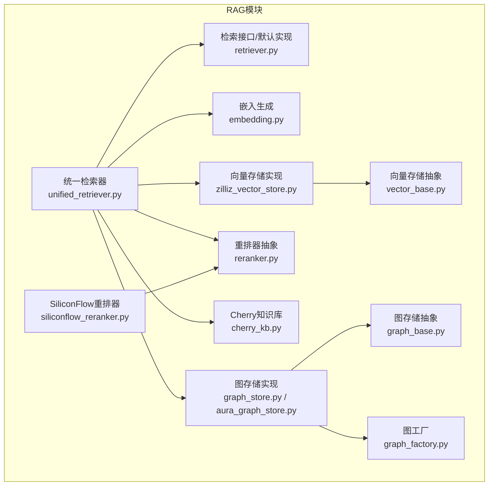
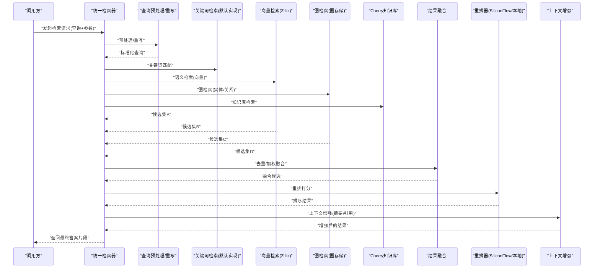
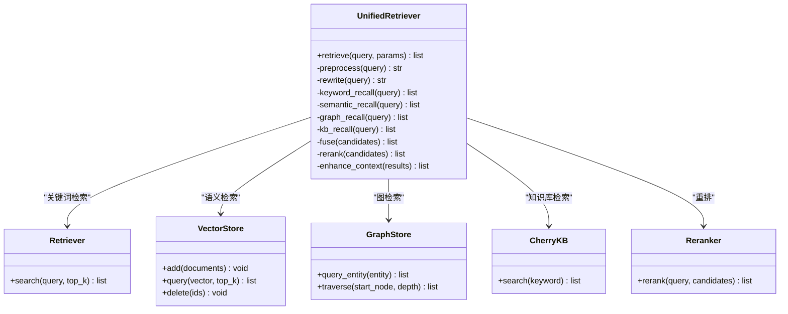
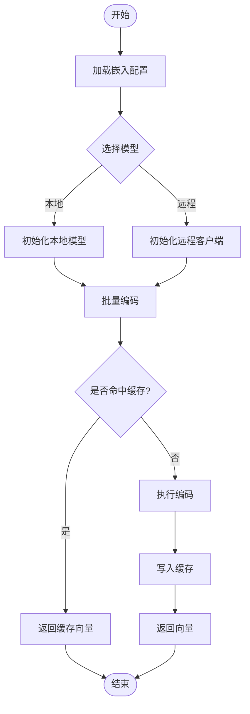
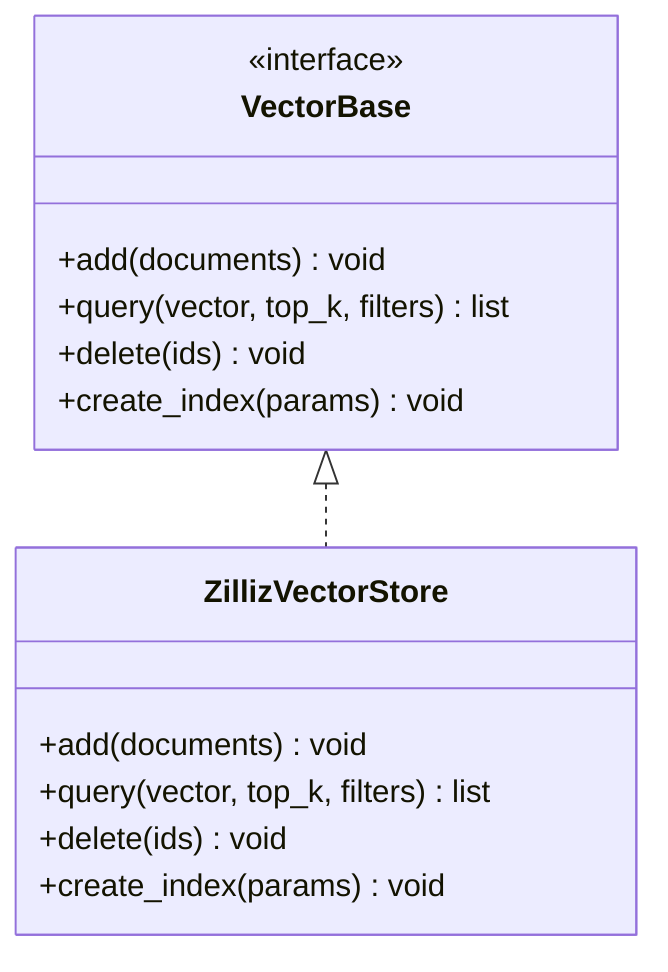
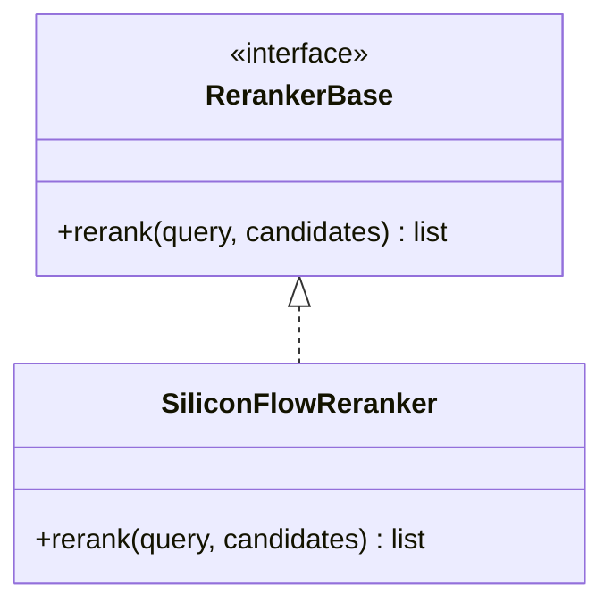
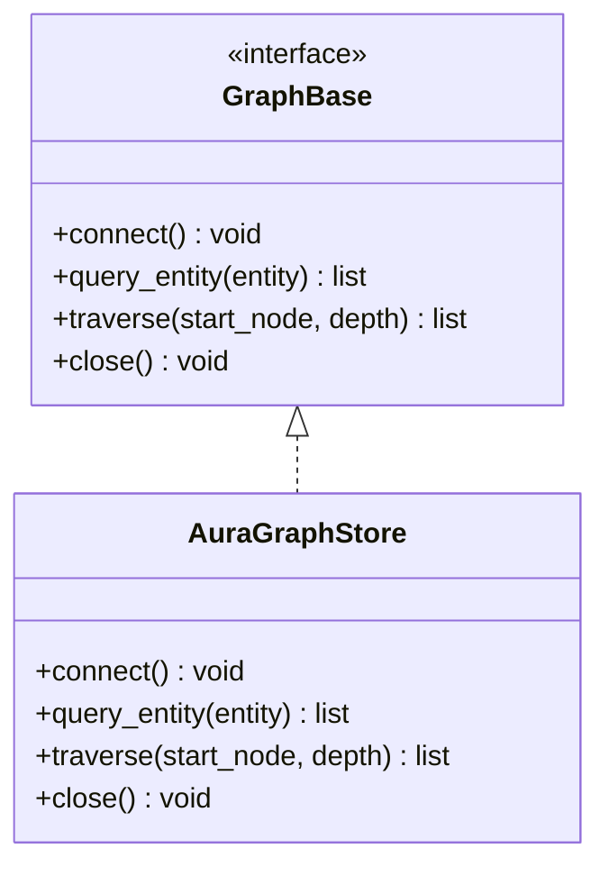
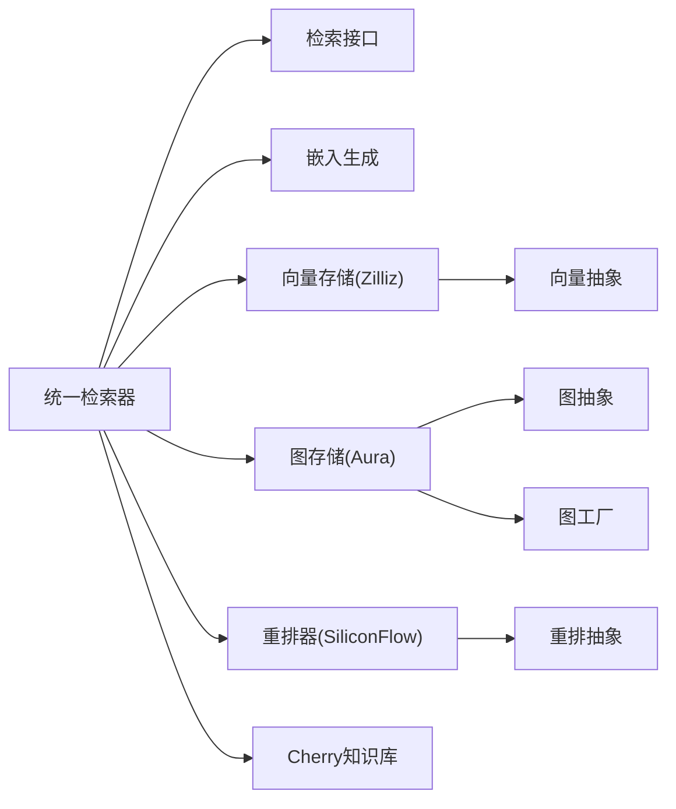

# RAG检索架构

<cite>
**本文引用的文件**   
- [backend_design/nexus/rag/unified_retriever.py](file://backend_design/nexus/rag/unified_retriever.py)
- [backend_design/nexus/rag/retriever.py](file://backend_design/nexus/rag/retriever.py)
- [backend_design/nexus/rag/embedding.py](file://backend_design/nexus/rag/embedding.py)
- [backend_design/nexus/rag/vector_store.py](file://backend_design/nexus/rag/vector_store.py)
- [backend_design/nexus/rag/zilliz_vector_store.py](file://backend_design/nexus/rag/zilliz_vector_store.py)
- [backend_design/nexus/rag/vector_base.py](file://backend_design/nexus/rag/vector_base.py)
- [backend_design/nexus/rag/reranker.py](file://backend_design/nexus/rag/reranker.py)
- [backend_design/nexus/rag/siliconflow_reranker.py](file://backend_design/nexus/rag/siliconflow_reranker.py)
- [backend_design/nexus/rag/cherry_kb.py](file://backend_design/nexus/rag/cherry_kb.py)
- [backend_design/nexus/rag/graph_store.py](file://backend_design/nexus/rag/graph_store.py)
- [backend_design/nexus/rag/aura_graph_store.py](file://backend_design/nexus/rag/aura_graph_store.py)
- [backend_design/nexus/rag/graph_factory.py](file://backend_design/nexus/rag/graph_factory.py)
- [backend_design/nexus/rag/graph_base.py](file://backend_design/nexus/rag/graph_base.py)
- [backend_design/nexus/config.py](file://backend_design/nexus/config.py)
</cite>

## 目录
1. [简介](#简介)
2. [项目结构](#项目结构)
3. [核心组件](#核心组件)
4. [架构总览](#架构总览)
5. [详细组件分析](#详细组件分析)
6. [依赖关系分析](#依赖关系分析)
7. [性能考虑](#性能考虑)
8. [故障排查指南](#故障排查指南)
9. [结论](#结论)
10. [附录：配置与使用示例](#附录配置与使用示例)

## 简介
本文件面向NexusCockpit的RAG（检索增强生成）检索子系统，聚焦统一检索器、混合检索策略、查询重写与上下文增强、向量嵌入生成与多模型支持、以及检索流程优化（预处理、索引构建、结果融合）。文档同时提供可操作的配置与使用指引，帮助读者快速落地关键词匹配、语义搜索与混合检索。

## 项目结构
RAG相关代码集中在 backend_design/nexus/rag 目录下，围绕“统一检索入口 + 多种存储后端 + 重排器 + 图/向量双通道”的组织方式展开：
- 统一检索入口：unified_retriever.py
- 通用检索接口与默认实现：retriever.py
- 嵌入层：embedding.py
- 向量存储抽象与Zilliz实现：vector_base.py, vector_store.py, zilliz_vector_store.py
- 重排器抽象与SiliconFlow实现：reranker.py, siliconflow_reranker.py
- 知识源适配：cherry_kb.py（知识库）、graph_store.py/aura_graph_store.py（图数据库）
- 工厂与基类：graph_factory.py, graph_base.py
- 全局配置：config.py

图表来源
- [backend_design/nexus/rag/unified_retriever.py](file://backend_design/nexus/rag/unified_retriever.py)
- [backend_design/nexus/rag/retriever.py](file://backend_design/nexus/rag/retriever.py)
- [backend_design/nexus/rag/embedding.py](file://backend_design/nexus/rag/embedding.py)
- [backend_design/nexus/rag/vector_base.py](file://backend_design/nexus/rag/vector_base.py)
- [backend_design/nexus/rag/zilliz_vector_store.py](file://backend_design/nexus/rag/zilliz_vector_store.py)
- [backend_design/nexus/rag/reranker.py](file://backend_design/nexus/rag/reranker.py)
- [backend_design/nexus/rag/siliconflow_reranker.py](file://backend_design/nexus/rag/siliconflow_reranker.py)
- [backend_design/nexus/rag/cherry_kb.py](file://backend_design/nexus/rag/cherry_kb.py)
- [backend_design/nexus/rag/graph_store.py](file://backend_design/nexus/rag/graph_store.py)
- [backend_design/nexus/rag/aura_graph_store.py](file://backend_design/nexus/rag/aura_graph_store.py)
- [backend_design/nexus/rag/graph_factory.py](file://backend_design/nexus/rag/graph_factory.py)
- [backend_design/nexus/rag/graph_base.py](file://backend_design/nexus/rag/graph_base.py)

章节来源
- [backend_design/nexus/rag/unified_retriever.py](file://backend_design/nexus/rag/unified_retriever.py)
- [backend_design/nexus/rag/retriever.py](file://backend_design/nexus/rag/retriever.py)
- [backend_design/nexus/rag/embedding.py](file://backend_design/nexus/rag/embedding.py)
- [backend_design/nexus/rag/vector_base.py](file://backend_design/nexus/rag/vector_base.py)
- [backend_design/nexus/rag/zilliz_vector_store.py](file://backend_design/nexus/rag/zilliz_vector_store.py)
- [backend_design/nexus/rag/reranker.py](file://backend_design/nexus/rag/reranker.py)
- [backend_design/nexus/rag/siliconflow_reranker.py](file://backend_design/nexus/rag/siliconflow_reranker.py)
- [backend_design/nexus/rag/cherry_kb.py](file://backend_design/nexus/rag/cherry_kb.py)
- [backend_design/nexus/rag/graph_store.py](file://backend_design/nexus/rag/graph_store.py)
- [backend_design/nexus/rag/aura_graph_store.py](file://backend_design/nexus/rag/aura_graph_store.py)
- [backend_design/nexus/rag/graph_factory.py](file://backend_design/nexus/rag/graph_factory.py)
- [backend_design/nexus/rag/graph_base.py](file://backend_design/nexus/rag/graph_base.py)

## 核心组件
- 统一检索器：对外暴露统一的检索API，内部协调查询预处理、查询重写、多路召回（关键词/语义/图谱）、结果融合与重排，并注入上下文增强信息。
- 嵌入生成：封装多模型嵌入能力，支持本地与远程模型切换、批量向量化与缓存策略。
- 向量存储：抽象向量库操作，当前提供Zilliz实现，负责索引构建、相似性检索与元数据过滤。
- 重排器：对召回候选进行精排，支持外部服务（如SiliconFlow）或本地模型。
- 知识源适配：Cherry知识库与图数据库（Neo4j/Aura等）作为结构化与非结构化知识补充。
- 工厂与基类：为图存储与重排器提供可扩展的创建与抽象。

章节来源
- [backend_design/nexus/rag/unified_retriever.py](file://backend_design/nexus/rag/unified_retriever.py)
- [backend_design/nexus/rag/embedding.py](file://backend_design/nexus/rag/embedding.py)
- [backend_design/nexus/rag/vector_base.py](file://backend_design/nexus/rag/vector_base.py)
- [backend_design/nexus/rag/zilliz_vector_store.py](file://backend_design/nexus/rag/zilliz_vector_store.py)
- [backend_design/nexus/rag/reranker.py](file://backend_design/nexus/rag/reranker.py)
- [backend_design/nexus/rag/siliconflow_reranker.py](file://backend_design/nexus/rag/siliconflow_reranker.py)
- [backend_design/nexus/rag/cherry_kb.py](file://backend_design/nexus/rag/cherry_kb.py)
- [backend_design/nexus/rag/graph_store.py](file://backend_design/nexus/rag/graph_store.py)
- [backend_design/nexus/rag/aura_graph_store.py](file://backend_design/nexus/rag/aura_graph_store.py)
- [backend_design/nexus/rag/graph_factory.py](file://backend_design/nexus/rag/graph_factory.py)
- [backend_design/nexus/rag/graph_base.py](file://backend_design/nexus/rag/graph_base.py)

## 架构总览
下图展示一次典型检索请求在RAG中的端到端流转：从用户查询进入统一检索器，经预处理与重写后并行走多条召回路径，最终融合并重排，返回带上下文的候选片段。

图表来源
- [backend_design/nexus/rag/unified_retriever.py](file://backend_design/nexus/rag/unified_retriever.py)
- [backend_design/nexus/rag/retriever.py](file://backend_design/nexus/rag/retriever.py)
- [backend_design/nexus/rag/zilliz_vector_store.py](file://backend_design/nexus/rag/zilliz_vector_store.py)
- [backend_design/nexus/rag/graph_store.py](file://backend_design/nexus/rag/graph_store.py)
- [backend_design/nexus/rag/aura_graph_store.py](file://backend_design/nexus/rag/aura_graph_store.py)
- [backend_design/nexus/rag/cherry_kb.py](file://backend_design/nexus/rag/cherry_kb.py)
- [backend_design/nexus/rag/reranker.py](file://backend_design/nexus/rag/reranker.py)
- [backend_design/nexus/rag/siliconflow_reranker.py](file://backend_design/nexus/rag/siliconflow_reranker.py)

## 详细组件分析

### 统一检索器（UnifedRetriever）
职责
- 接收查询与检索策略参数，执行查询预处理与重写。
- 根据策略选择单路或多路召回（关键词、语义、图、知识库）。
- 执行结果融合与重排，注入上下文增强信息。
- 输出稳定、可解释的检索结果。

关键流程
- 查询预处理：清洗、分词、同义词扩展、停用词处理。
- 查询重写：基于规则或轻量模型将口语化查询改写为标准表达。
- 多路召回：
  - 关键词匹配：通过倒排或文本匹配获取精确命中。
  - 语义检索：通过向量相似度召回Top-K。
  - 图检索：基于实体/关系抽取与遍历获取关联片段。
  - 知识库检索：从Cherry知识库拉取相关条目。
- 结果融合：去重、跨路权重合并、时间/来源偏好。
- 重排：使用重排器对候选进行细粒度打分排序。
- 上下文增强：附加来源、摘要、引用链接等。

图表来源
- [backend_design/nexus/rag/unified_retriever.py](file://backend_design/nexus/rag/unified_retriever.py)
- [backend_design/nexus/rag/retriever.py](file://backend_design/nexus/rag/retriever.py)
- [backend_design/nexus/rag/vector_base.py](file://backend_design/nexus/rag/vector_base.py)
- [backend_design/nexus/rag/zilliz_vector_store.py](file://backend_design/nexus/rag/zilliz_vector_store.py)
- [backend_design/nexus/rag/graph_store.py](file://backend_design/nexus/rag/graph_store.py)
- [backend_design/nexus/rag/aura_graph_store.py](file://backend_design/nexus/rag/aura_graph_store.py)
- [backend_design/nexus/rag/cherry_kb.py](file://backend_design/nexus/rag/cherry_kb.py)
- [backend_design/nexus/rag/reranker.py](file://backend_design/nexus/rag/reranker.py)

章节来源
- [backend_design/nexus/rag/unified_retriever.py](file://backend_design/nexus/rag/unified_retriever.py)
- [backend_design/nexus/rag/retriever.py](file://backend_design/nexus/rag/retriever.py)

### 嵌入生成（Embedding）
功能
- 封装多模型嵌入能力，支持不同后端（本地/远程），并提供批量向量化与缓存。
- 提供统一的输入输出格式，屏蔽底层差异。

要点
- 模型选择：按配置加载不同模型；支持自定义嵌入策略。
- 批处理：提高吞吐，降低延迟。
- 缓存：对重复查询或固定片段避免重复计算。

图表来源
- [backend_design/nexus/rag/embedding.py](file://backend_design/nexus/rag/embedding.py)

章节来源
- [backend_design/nexus/rag/embedding.py](file://backend_design/nexus/rag/embedding.py)

### 向量存储（Vector Store）
职责
- 抽象向量库操作：添加文档、删除、相似性检索、元数据过滤。
- Zilliz实现：对接Milvus/Zilliz集群，提供高性能向量检索。

关键点
- 索引构建：维度、度量类型、索引类型与参数。
- 检索参数：top_k、距离阈值、过滤条件。
- 元数据：用于领域/来源/时间等维度的筛选。

图表来源
- [backend_design/nexus/rag/vector_base.py](file://backend_design/nexus/rag/vector_base.py)
- [backend_design/nexus/rag/zilliz_vector_store.py](file://backend_design/nexus/rag/zilliz_vector_store.py)

章节来源
- [backend_design/nexus/rag/vector_base.py](file://backend_design/nexus/rag/vector_base.py)
- [backend_design/nexus/rag/zilliz_vector_store.py](file://backend_design/nexus/rag/zilliz_vector_store.py)

### 重排器（Reranker）
职责
- 对召回候选进行细粒度相关性打分与排序。
- 支持外部服务（SiliconFlow）或本地模型。

图表来源
- [backend_design/nexus/rag/reranker.py](file://backend_design/nexus/rag/reranker.py)
- [backend_design/nexus/rag/siliconflow_reranker.py](file://backend_design/nexus/rag/siliconflow_reranker.py)

章节来源
- [backend_design/nexus/rag/reranker.py](file://backend_design/nexus/rag/reranker.py)
- [backend_design/nexus/rag/siliconflow_reranker.py](file://backend_design/nexus/rag/siliconflow_reranker.py)

### 图检索（Graph Store）
职责
- 抽象图数据库操作，支持实体查询与关系遍历。
- Aura/Neo4j实现：连接管理、查询构造、结果映射。

图表来源
- [backend_design/nexus/rag/graph_base.py](file://backend_design/nexus/rag/graph_base.py)
- [backend_design/nexus/rag/aura_graph_store.py](file://backend_design/nexus/rag/aura_graph_store.py)

章节来源
- [backend_design/nexus/rag/graph_base.py](file://backend_design/nexus/rag/graph_base.py)
- [backend_design/nexus/rag/aura_graph_store.py](file://backend_design/nexus/rag/aura_graph_store.py)

### 知识源适配（Cherry KB）
职责
- 对接Cherry知识库，提供关键词检索与条目拉取。
- 与统一检索器协作，作为结构化知识补充。

章节来源
- [backend_design/nexus/rag/cherry_kb.py](file://backend_design/nexus/rag/cherry_kb.py)

## 依赖关系分析
- 统一检索器依赖：
  - 检索接口（关键词匹配）
  - 向量存储（语义检索）
  - 图存储（实体/关系检索）
  - 重排器（精排）
  - 嵌入生成（向量化）
  - 知识库（Cherry）
- 向量存储依赖：
  - 抽象接口（VectorBase）
  - 具体实现（ZillizVectorStore）
- 重排器依赖：
  - 抽象接口（RerankerBase）
  - 具体实现（SiliconFlowReranker）
- 图存储依赖：
  - 抽象接口（GraphBase）
  - 具体实现（AuraGraphStore）
  - 工厂（GraphFactory）

图表来源
- [backend_design/nexus/rag/unified_retriever.py](file://backend_design/nexus/rag/unified_retriever.py)
- [backend_design/nexus/rag/retriever.py](file://backend_design/nexus/rag/retriever.py)
- [backend_design/nexus/rag/embedding.py](file://backend_design/nexus/rag/embedding.py)
- [backend_design/nexus/rag/vector_base.py](file://backend_design/nexus/rag/vector_base.py)
- [backend_design/nexus/rag/zilliz_vector_store.py](file://backend_design/nexus/rag/zilliz_vector_store.py)
- [backend_design/nexus/rag/reranker.py](file://backend_design/nexus/rag/reranker.py)
- [backend_design/nexus/rag/siliconflow_reranker.py](file://backend_design/nexus/rag/siliconflow_reranker.py)
- [backend_design/nexus/rag/graph_base.py](file://backend_design/nexus/rag/graph_base.py)
- [backend_design/nexus/rag/aura_graph_store.py](file://backend_design/nexus/rag/aura_graph_store.py)
- [backend_design/nexus/rag/graph_factory.py](file://backend_design/nexus/rag/graph_factory.py)
- [backend_design/nexus/rag/cherry_kb.py](file://backend_design/nexus/rag/cherry_kb.py)

章节来源
- [backend_design/nexus/rag/unified_retriever.py](file://backend_design/nexus/rag/unified_retriever.py)
- [backend_design/nexus/rag/vector_base.py](file://backend_design/nexus/rag/vector_base.py)
- [backend_design/nexus/rag/reranker.py](file://backend_design/nexus/rag/reranker.py)
- [backend_design/nexus/rag/graph_base.py](file://backend_design/nexus/rag/graph_base.py)

## 性能考虑
- 索引构建
  - 选择合适的度量与索引类型，平衡构建时间与查询延迟。
  - 合理设置分区与副本，提升容灾与吞吐。
- 检索参数
  - top_k与距离阈值需结合业务场景调优，避免过大导致重排压力。
  - 元数据过滤前置，减少无效候选。
- 批处理与缓存
  - 嵌入批量编码，减少模型切换开销。
  - 对热点查询与固定片段启用缓存。
- 融合与重排
  - 融合阶段尽量去重与降维，降低重排候选规模。
  - 重排器按需启用，必要时降级为启发式排序。
- 资源隔离
  - 将向量检索、图检索、重排器异步化，避免阻塞主链路。

[本节为通用指导，不直接分析具体文件]

## 故障排查指南
常见问题与建议
- 向量检索失败
  - 检查向量维度与索引配置是否一致。
  - 确认连接信息与集合名称正确。
- 重排超时
  - 调整重排候选数量与超时时间。
  - 评估外部服务可用性，必要时回退到本地重排。
- 图检索无结果
  - 校验实体名称与关系模式。
  - 检查连接状态与权限。
- 嵌入异常
  - 核对模型版本与输入格式。
  - 检查网络与认证配置。

章节来源
- [backend_design/nexus/rag/zilliz_vector_store.py](file://backend_design/nexus/rag/zilliz_vector_store.py)
- [backend_design/nexus/rag/siliconflow_reranker.py](file://backend_design/nexus/rag/siliconflow_reranker.py)
- [backend_design/nexus/rag/aura_graph_store.py](file://backend_design/nexus/rag/aura_graph_store.py)
- [backend_design/nexus/rag/embedding.py](file://backend_design/nexus/rag/embedding.py)

## 结论
统一检索器通过模块化设计将关键词、语义、图与知识库整合为一致的检索体验，配合嵌入生成与重排器，实现了高可用、可扩展的RAG检索架构。通过合理的索引构建、参数调优与缓存策略，可在保证准确率的同时获得良好的性能表现。

[本节为总结，不直接分析具体文件]

## 附录：配置与使用示例
以下示例以“如何配置和使用不同的检索策略”为目标，给出步骤与要点说明（不包含具体代码内容，仅列出参考路径）。

- 配置嵌入模型
  - 在配置文件中指定模型类型、维度、后端地址与认证信息。
  - 参考路径：[backend_design/nexus/config.py](file://backend_design/nexus/config.py)
- 初始化统一检索器
  - 加载配置，实例化嵌入、向量存储、重排器与图存储。
  - 参考路径：[backend_design/nexus/rag/unified_retriever.py](file://backend_design/nexus/rag/unified_retriever.py)
- 构建向量索引
  - 准备文档与元数据，调用向量存储的添加与索引构建方法。
  - 参考路径：[backend_design/nexus/rag/zilliz_vector_store.py](file://backend_design/nexus/rag/zilliz_vector_store.py)
- 执行关键词检索
  - 使用默认检索实现进行关键词匹配。
  - 参考路径：[backend_design/nexus/rag/retriever.py](file://backend_design/nexus/rag/retriever.py)
- 执行语义检索
  - 通过嵌入生成获取查询向量，调用向量存储进行相似性检索。
  - 参考路径：[backend_design/nexus/rag/embedding.py](file://backend_design/nexus/rag/embedding.py), [backend_design/nexus/rag/zilliz_vector_store.py](file://backend_design/nexus/rag/zilliz_vector_store.py)
- 执行图检索
  - 基于实体/关系进行查询与遍历。
  - 参考路径：[backend_design/nexus/rag/aura_graph_store.py](file://backend_design/nexus/rag/aura_graph_store.py)
- 执行知识库检索
  - 从Cherry知识库拉取相关条目。
  - 参考路径：[backend_design/nexus/rag/cherry_kb.py](file://backend_design/nexus/rag/cherry_kb.py)
- 结果融合与重排
  - 对多路候选进行去重、加权融合，再调用重排器排序。
  - 参考路径：[backend_design/nexus/rag/unified_retriever.py](file://backend_design/nexus/rag/unified_retriever.py), [backend_design/nexus/rag/siliconflow_reranker.py](file://backend_design/nexus/rag/siliconflow_reranker.py)
- 上下文增强
  - 为结果附加来源、摘要与引用信息。
  - 参考路径：[backend_design/nexus/rag/unified_retriever.py](file://backend_design/nexus/rag/unified_retriever.py)

章节来源
- [backend_design/nexus/config.py](file://backend_design/nexus/config.py)
- [backend_design/nexus/rag/unified_retriever.py](file://backend_design/nexus/rag/unified_retriever.py)
- [backend_design/nexus/rag/retriever.py](file://backend_design/nexus/rag/retriever.py)
- [backend_design/nexus/rag/embedding.py](file://backend_design/nexus/rag/embedding.py)
- [backend_design/nexus/rag/zilliz_vector_store.py](file://backend_design/nexus/rag/zilliz_vector_store.py)
- [backend_design/nexus/rag/aura_graph_store.py](file://backend_design/nexus/rag/aura_graph_store.py)
- [backend_design/nexus/rag/cherry_kb.py](file://backend_design/nexus/rag/cherry_kb.py)
- [backend_design/nexus/rag/siliconflow_reranker.py](file://backend_design/nexus/rag/siliconflow_reranker.py)