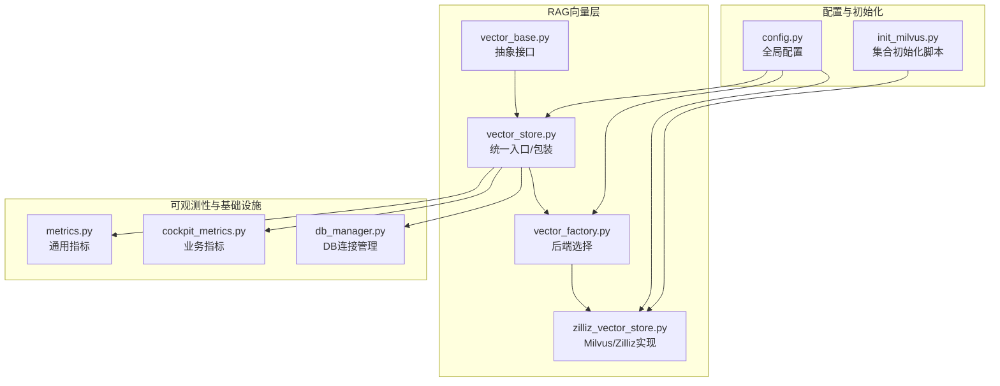
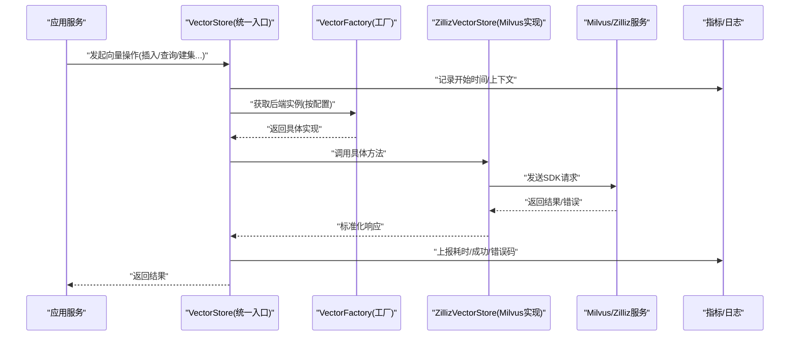
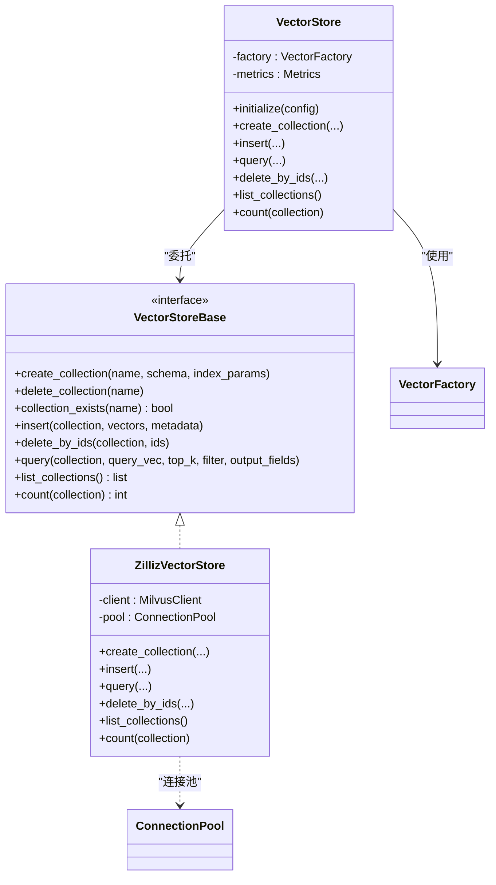
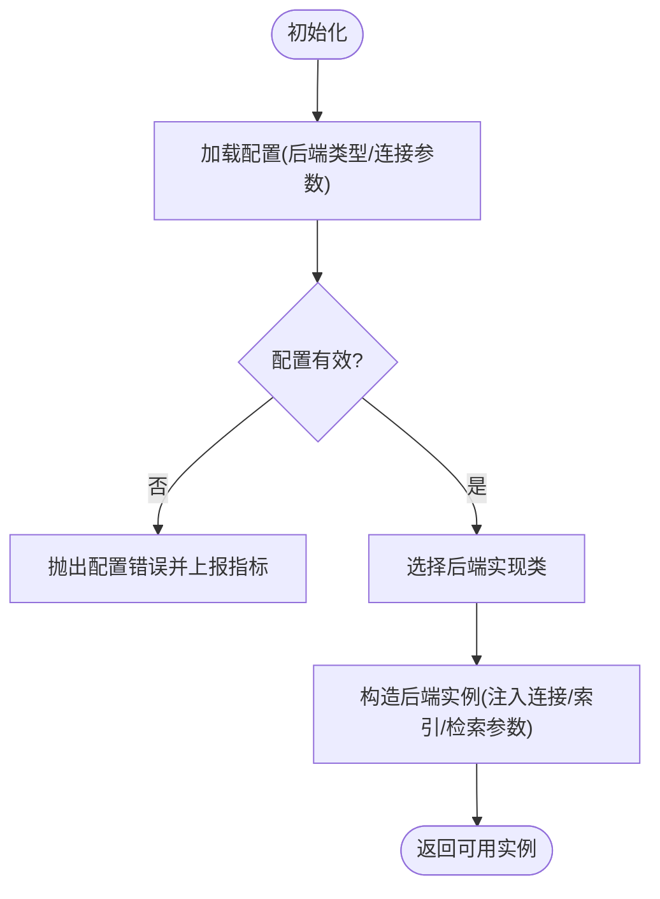
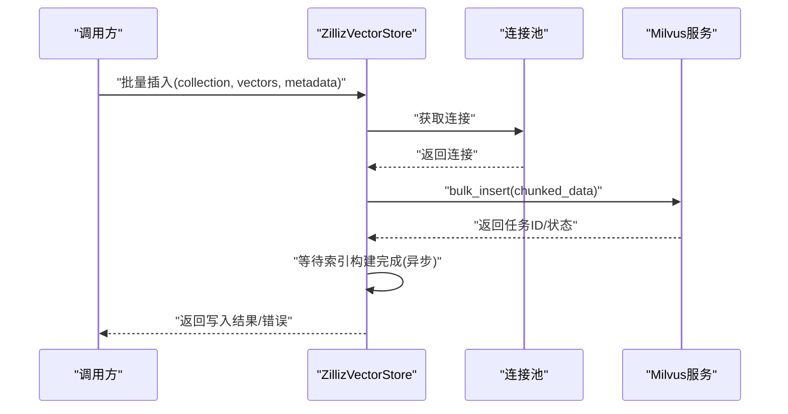
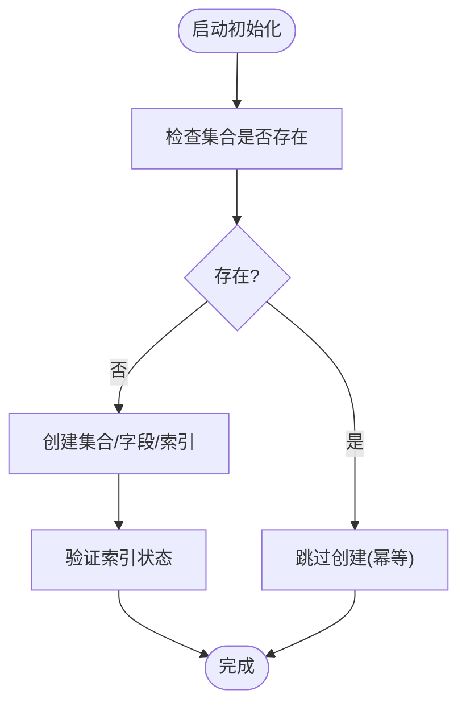
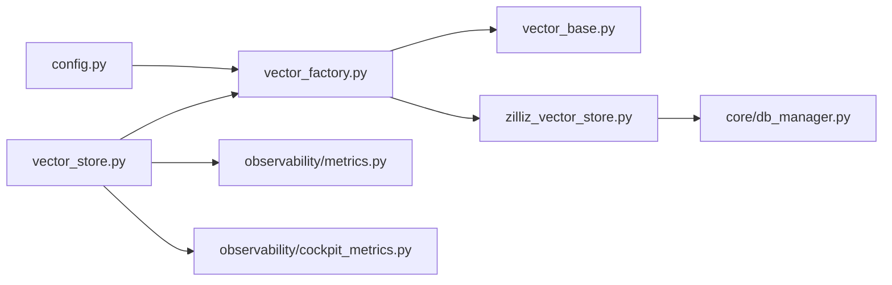

# 向量数据库集成

<cite>
**本文引用的文件**   
- [backend_design/nexus/rag/vector_base.py](file://backend_design/nexus/rag/vector_base.py)
- [backend_design/nexus/rag/vector_store.py](file://backend_design/nexus/rag/vector_store.py)
- [backend_design/nexus/rag/vector_factory.py](file://backend_design/nexus/rag/vector_factory.py)
- [backend_design/nexus/rag/zilliz_vector_store.py](file://backend_design/nexus/rag/zilliz_vector_store.py)
- [backend_design/nexus/config.py](file://backend_design/nexus/config.py)
- [backend_design/scripts/init_milvus.py](file://backend_design/scripts/init_milvus.py)
- [backend_design/nexus/core/db_manager.py](file://backend_design/nexus/core/db_manager.py)
- [backend_design/nexus/observability/metrics.py](file://backend_design/nexus/observability/metrics.py)
- [backend_design/nexus/observability/cockpit_metrics.py](file://backend_design/nexus/observability/cockpit_metrics.py)
</cite>

## 目录
1. [简介](#简介)
2. [项目结构](#项目结构)
3. [核心组件](#核心组件)
4. [架构总览](#架构总览)
5. [详细组件分析](#详细组件分析)
6. [依赖关系分析](#依赖关系分析)
7. [性能与调优](#性能与调优)
8. [故障排查指南](#故障排查指南)
9. [结论](#结论)
10. [附录](#附录)

## 简介
本文件面向NexusCockpit的向量数据库集成，聚焦Milvus作为默认后端的配置、连接管理、集合操作与数据导入导出；同时阐述向量存储抽象层设计，以统一接口支持多种后端。文档还涵盖索引类型选择、相似度计算、批量操作优化、错误处理、连接池管理与监控指标落地实践，并提供可操作的调优建议。

## 项目结构
与向量数据库相关的代码主要位于RAG模块中，采用“抽象接口 + 工厂 + 具体实现”的分层组织方式：
- 抽象接口定义统一的向量存储能力（创建集合、插入/删除、查询、列出集合等）
- 工厂根据配置动态选择具体后端实现
- Milvus/Zilliz的具体实现封装SDK调用、连接与资源生命周期管理
- 初始化脚本提供Milvus集合的预置能力
- 配置中心集中管理连接参数、索引与检索策略
- 可观测性模块暴露关键指标用于监控

图表来源
- [backend_design/nexus/rag/vector_base.py](file://backend_design/nexus/rag/vector_base.py)
- [backend_design/nexus/rag/vector_store.py](file://backend_design/nexus/rag/vector_store.py)
- [backend_design/nexus/rag/vector_factory.py](file://backend_design/nexus/rag/vector_factory.py)
- [backend_design/nexus/rag/zilliz_vector_store.py](file://backend_design/nexus/rag/zilliz_vector_store.py)
- [backend_design/nexus/config.py](file://backend_design/nexus/config.py)
- [backend_design/scripts/init_milvus.py](file://backend_design/scripts/init_milvus.py)
- [backend_design/nexus/observability/metrics.py](file://backend_design/nexus/observability/metrics.py)
- [backend_design/nexus/observability/cockpit_metrics.py](file://backend_design/nexus/observability/cockpit_metrics.py)
- [backend_design/nexus/core/db_manager.py](file://backend_design/nexus/core/db_manager.py)

章节来源
- [backend_design/nexus/rag/vector_base.py](file://backend_design/nexus/rag/vector_base.py)
- [backend_design/nexus/rag/vector_store.py](file://backend_design/nexus/rag/vector_store.py)
- [backend_design/nexus/rag/vector_factory.py](file://backend_design/nexus/rag/vector_factory.py)
- [backend_design/nexus/rag/zilliz_vector_store.py](file://backend_design/nexus/rag/zilliz_vector_store.py)
- [backend_design/nexus/config.py](file://backend_design/nexus/config.py)
- [backend_design/scripts/init_milvus.py](file://backend_design/scripts/init_milvus.py)
- [backend_design/nexus/observability/metrics.py](file://backend_design/nexus/observability/metrics.py)
- [backend_design/nexus/observability/cockpit_metrics.py](file://backend_design/nexus/observability/cockpit_metrics.py)
- [backend_design/nexus/core/db_manager.py](file://backend_design/nexus/core/db_manager.py)

## 核心组件
- 抽象接口（VectorStoreBase）
  - 职责：定义统一的向量存储能力，包括集合生命周期管理、向量的增删改查、元数据过滤、分页与排序、统计信息等。
  - 关键点：所有方法应幂等或具备明确的错误语义；对异常进行规范化封装，便于上层重试与降级。
- 统一入口（VectorStore）
  - 职责：对外暴露一致的API，内部委托给具体后端；负责参数校验、日志埋点、指标上报与超时控制。
  - 关键点：将业务无关的横切关注点（如重试、熔断、指标）集中在该层，保持具体实现简洁。
- 工厂（VectorFactory）
  - 职责：依据配置选择具体后端（例如Milvus/Zilliz），并注入连接参数、索引策略与检索策略。
  - 关键点：支持多后端扩展，新增后端只需实现接口并通过工厂注册即可。
- Milvus/Zilliz实现（ZillizVectorStore）
  - 职责：封装Milvus SDK调用，管理连接、集合、索引、分区与批处理；实现具体的相似度搜索与过滤逻辑。
  - 关键点：连接池与资源回收、批量写入合并、索引构建与重建策略、查询路由与结果映射。
- 配置（Config）
  - 职责：集中管理Milvus连接地址、认证信息、集合命名空间、索引类型与参数、检索TopK、距离度量等。
  - 关键点：区分开发/测试/生产环境；敏感信息通过环境变量注入；提供默认值与校验。
- 初始化脚本（init_milvus.py）
  - 职责：在部署时创建集合、设置字段与索引，确保运行期无需重复建库建表。
  - 关键点：幂等执行、失败回滚、版本兼容与迁移策略。
- 可观测性（metrics.py, cockpit_metrics.py）
  - 职责：暴露请求耗时、成功率、错误码分布、队列长度、内存占用、索引构建进度等指标。
  - 关键点：指标维度包含后端类型、集合名、操作类型；支持Prometheus抓取与Grafana展示。
- DB连接管理（db_manager.py）
  - 职责：统一管理外部系统连接（含向量库连接池），提供健康检查与优雅关闭。
  - 关键点：连接复用、空闲回收、最大并发限制、断线重连与退避策略。

章节来源
- [backend_design/nexus/rag/vector_base.py](file://backend_design/nexus/rag/vector_base.py)
- [backend_design/nexus/rag/vector_store.py](file://backend_design/nexus/rag/vector_store.py)
- [backend_design/nexus/rag/vector_factory.py](file://backend_design/nexus/rag/vector_factory.py)
- [backend_design/nexus/rag/zilliz_vector_store.py](file://backend_design/nexus/rag/zilliz_vector_store.py)
- [backend_design/nexus/config.py](file://backend_design/nexus/config.py)
- [backend_design/scripts/init_milvus.py](file://backend_design/scripts/init_milvus.py)
- [backend_design/nexus/observability/metrics.py](file://backend_design/nexus/observability/metrics.py)
- [backend_design/nexus/observability/cockpit_metrics.py](file://backend_design/nexus/observability/cockpit_metrics.py)
- [backend_design/nexus/core/db_manager.py](file://backend_design/nexus/core/db_manager.py)

## 架构总览
下图展示了从应用侧到Milvus后端的整体流程，以及横切关注点在统一入口层的汇聚。

图表来源
- [backend_design/nexus/rag/vector_store.py](file://backend_design/nexus/rag/vector_store.py)
- [backend_design/nexus/rag/vector_factory.py](file://backend_design/nexus/rag/vector_factory.py)
- [backend_design/nexus/rag/zilliz_vector_store.py](file://backend_design/nexus/rag/zilliz_vector_store.py)
- [backend_design/nexus/observability/metrics.py](file://backend_design/nexus/observability/metrics.py)

## 详细组件分析

### 抽象接口与统一入口
- 抽象接口定义了最小且稳定的能力边界，屏蔽不同后端的差异，保证上层业务稳定。
- 统一入口承担参数校验、重试、熔断、指标上报、超时控制等横切逻辑，降低具体实现的复杂度。
- 典型方法族：
  - 集合管理：创建、删除、存在性检查、列表
  - 数据操作：批量插入、删除、更新元数据
  - 检索：向量相似检索、标量过滤、分页排序、TopK与分数阈值
  - 统计：集合大小、向量数量、元数据聚合

图表来源
- [backend_design/nexus/rag/vector_base.py](file://backend_design/nexus/rag/vector_base.py)
- [backend_design/nexus/rag/vector_store.py](file://backend_design/nexus/rag/vector_store.py)
- [backend_design/nexus/rag/zilliz_vector_store.py](file://backend_design/nexus/rag/zilliz_vector_store.py)

章节来源
- [backend_design/nexus/rag/vector_base.py](file://backend_design/nexus/rag/vector_base.py)
- [backend_design/nexus/rag/vector_store.py](file://backend_design/nexus/rag/vector_store.py)

### 工厂与后端选择
- 工厂根据配置中的后端标识（如milvus/zilliz）选择对应实现类，并注入连接参数、索引策略与检索策略。
- 新增后端仅需实现抽象接口并在工厂注册，即可无缝接入。
- 工厂需具备健壮的错误处理：当后端不可用时快速失败并上报指标，避免级联故障。

图表来源
- [backend_design/nexus/rag/vector_factory.py](file://backend_design/nexus/rag/vector_factory.py)
- [backend_design/nexus/config.py](file://backend_design/nexus/config.py)

章节来源
- [backend_design/nexus/rag/vector_factory.py](file://backend_design/nexus/rag/vector_factory.py)
- [backend_design/nexus/config.py](file://backend_design/nexus/config.py)

### Milvus/Zilliz实现要点
- 连接管理
  - 使用连接池复用TCP连接，避免频繁握手开销；支持最大连接数、空闲回收、心跳检测与断线重连。
  - 连接参数包括地址、端口、用户名/密码或Token、TLS开关、超时与重试次数。
- 集合与索引
  - 集合字段定义包含主键、向量字段、标量字段与文本字段；向量维度由嵌入模型决定。
  - 索引类型可选HNSW、IVF_FLAT、IVF_SQ8、DISKANN等；根据数据规模与延迟要求选择。
  - 相似度度量支持L2、IP、COSINE等，需与索引类型匹配。
- 数据导入导出
  - 批量插入：分片写入、去重、幂等键、失败重试与死信队列。
  - 删除：基于主键批量删除，支持软删除标记。
  - 导出：按条件分页拉取，流式输出至对象存储或本地文件。
- 查询与过滤
  - 向量检索：TopK、距离阈值、输出字段控制。
  - 标量过滤：范围、枚举、前缀匹配；复杂表达式组合。
  - 结果排序：按相关性分数或自定义权重。

图表来源
- [backend_design/nexus/rag/zilliz_vector_store.py](file://backend_design/nexus/rag/zilliz_vector_store.py)
- [backend_design/nexus/core/db_manager.py](file://backend_design/nexus/core/db_manager.py)

章节来源
- [backend_design/nexus/rag/zilliz_vector_store.py](file://backend_design/nexus/rag/zilliz_vector_store.py)
- [backend_design/nexus/core/db_manager.py](file://backend_design/nexus/core/db_manager.py)

### 集合初始化与迁移
- 初始化脚本在部署阶段执行，幂等地创建集合、字段与索引；若集合已存在则跳过。
- 支持版本化迁移：当Schema变更时，通过迁移脚本增量更新，避免破坏现有数据。
- 失败回滚：若部分步骤失败，尽量回滚已创建的资源，保证环境一致性。

图表来源
- [backend_design/scripts/init_milvus.py](file://backend_design/scripts/init_milvus.py)

章节来源
- [backend_design/scripts/init_milvus.py](file://backend_design/scripts/init_milvus.py)

### 配置项与环境变量
- 连接相关：地址、端口、认证、TLS、超时、重试
- 集合相关：命名空间、主键策略、向量维度、字段类型
- 索引相关：索引类型、参数（如M、efConstruction、nlist等）、度量类型
- 检索相关：TopK、距离阈值、输出字段、过滤表达式
- 监控相关：指标标签、采样率、上报目标

章节来源
- [backend_design/nexus/config.py](file://backend_design/nexus/config.py)

## 依赖关系分析
- 耦合度
  - 统一入口与抽象接口低耦合，具体实现通过工厂解耦，新增后端不影响既有调用方。
  - 配置集中管理，避免散落的硬编码。
- 外部依赖
  - Milvus/Zilliz SDK、指标采集器（Prometheus）、日志系统。
- 潜在循环依赖
  - 工厂仅依赖配置与接口，不反向依赖具体实现，避免循环。

图表来源
- [backend_design/nexus/config.py](file://backend_design/nexus/config.py)
- [backend_design/nexus/rag/vector_factory.py](file://backend_design/nexus/rag/vector_factory.py)
- [backend_design/nexus/rag/vector_base.py](file://backend_design/nexus/rag/vector_base.py)
- [backend_design/nexus/rag/zilliz_vector_store.py](file://backend_design/nexus/rag/zilliz_vector_store.py)
- [backend_design/nexus/rag/vector_store.py](file://backend_design/nexus/rag/vector_store.py)
- [backend_design/nexus/observability/metrics.py](file://backend_design/nexus/observability/metrics.py)
- [backend_design/nexus/observability/cockpit_metrics.py](file://backend_design/nexus/observability/cockpit_metrics.py)
- [backend_design/nexus/core/db_manager.py](file://backend_design/nexus/core/db_manager.py)

章节来源
- [backend_design/nexus/rag/vector_factory.py](file://backend_design/nexus/rag/vector_factory.py)
- [backend_design/nexus/rag/vector_store.py](file://backend_design/nexus/rag/vector_store.py)
- [backend_design/nexus/rag/zilliz_vector_store.py](file://backend_design/nexus/rag/zilliz_vector_store.py)
- [backend_design/nexus/config.py](file://backend_design/nexus/config.py)
- [backend_design/nexus/observability/metrics.py](file://backend_design/nexus/observability/metrics.py)
- [backend_design/nexus/observability/cockpit_metrics.py](file://backend_design/nexus/observability/cockpit_metrics.py)
- [backend_design/nexus/core/db_manager.py](file://backend_design/nexus/core/db_manager.py)

## 性能与调优
- 索引类型选择
  - 小规模数据（百万以下）：优先HNSW，低延迟高召回；参数M与efConstruction影响构建时间与查询延迟。
  - 中等规模（百万级）：IVF_FLAT或IVF_SQ8，nlist与nprobe需权衡召回与速度；SQ8适合内存受限场景。
  - 大规模（千万级以上）：DISKANN或HNSW+量化，结合冷热分层与分区裁剪。
- 相似度度量
  - L2适用于欧氏距离场景；IP适用于内积相似度；COSINE常用于归一化向量。
  - 度量必须与索引类型和训练/推理阶段的向量处理方式一致。
- 批量操作优化
  - 插入：合理分片大小（如每批数千条），避免单批过大导致OOM；开启幂等键与去重。
  - 删除：合并多次删除为一次批量操作，减少网络往返。
  - 导出：分页拉取+流式落盘，避免一次性加载全量数据。
- 查询优化
  - TopK与距离阈值配合使用，避免无界扫描；输出字段按需返回，减少序列化开销。
  - 标量过滤前置，缩小候选集后再做向量检索。
- 连接池与内存
  - 调整最大连接数与空闲回收策略，避免连接泄漏；监控堆内存与GC频率。
  - 大向量入库前进行压缩或降维（如PCA/SQ8），平衡精度与体积。
- 监控与告警
  - 指标：请求延迟P95/P99、错误率、连接池活跃/空闲、索引构建进度、磁盘使用率。
  - 告警：错误率突增、延迟飙升、连接池耗尽、磁盘不足。

[本节为通用指导，不涉及具体文件分析]

## 故障排查指南
- 连接问题
  - 现象：初始化失败、查询超时、连接被拒绝。
  - 排查：检查地址/端口/TLS/认证；确认防火墙与安全组；查看连接池状态与重试次数。
- 索引构建失败
  - 现象：写入成功但检索为空或报错。
  - 排查：确认索引类型与度量匹配；检查向量维度与Schema一致性；观察索引构建进度与错误日志。
- 性能退化
  - 现象：查询延迟升高、吞吐下降。
  - 排查：评估TopK与过滤条件；检查分片大小与批量参数；观察CPU/内存/IO瓶颈；必要时重建索引或扩容。
- 数据不一致
  - 现象：插入后无法检索到最新数据。
  - 排查：确认是否等待索引构建完成；检查幂等键与去重策略；核对过滤表达式。
- 指标与日志
  - 利用指标面板定位热点集合与慢查询；结合结构化日志追踪请求链路。

章节来源
- [backend_design/nexus/observability/metrics.py](file://backend_design/nexus/observability/metrics.py)
- [backend_design/nexus/observability/cockpit_metrics.py](file://backend_design/nexus/observability/cockpit_metrics.py)
- [backend_design/nexus/core/db_manager.py](file://backend_design/nexus/core/db_manager.py)

## 结论
通过抽象接口与工厂模式，NexusCockpit实现了向量存储的统一入口与多后端可扩展能力。Milvus/Zilliz作为默认后端，提供了成熟的索引与检索能力。配合合理的索引选型、批量策略、连接池与监控体系，可在不同规模下获得稳定高效的向量检索体验。建议在上线前完成容量规划与压测，持续跟踪指标并根据业务变化迭代参数。

[本节为总结性内容，不涉及具体文件分析]

## 附录
- 常用索引与度量对照
  - HNSW：L2/IP/COSINE，适合低延迟高召回
  - IVF_FLAT：L2/IP/COSINE，适合中等规模
  - IVF_SQ8：L2/IP/COSINE，适合内存受限
  - DISKANN：L2/IP/COSINE，适合大规模
- 推荐初始参数
  - HNSW：M=16~32，efConstruction=200~500
  - IVF：nlist=数据量/1000~数据量/500，nprobe=√nlist
  - SQ8：量化因子与精度需结合业务评测
- 监控看板建议
  - 概览：QPS、P95/P99延迟、错误率
  - 资源：连接池活跃/空闲、CPU/内存/磁盘
  - 业务：TopK命中率、过滤命中率、索引构建进度

[本节为补充信息，不涉及具体文件分析]