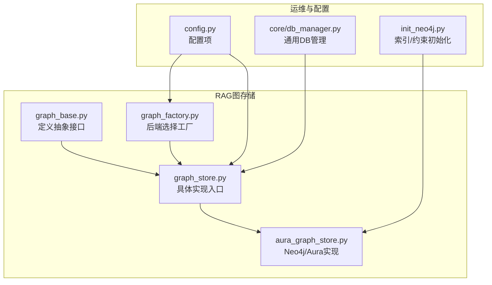
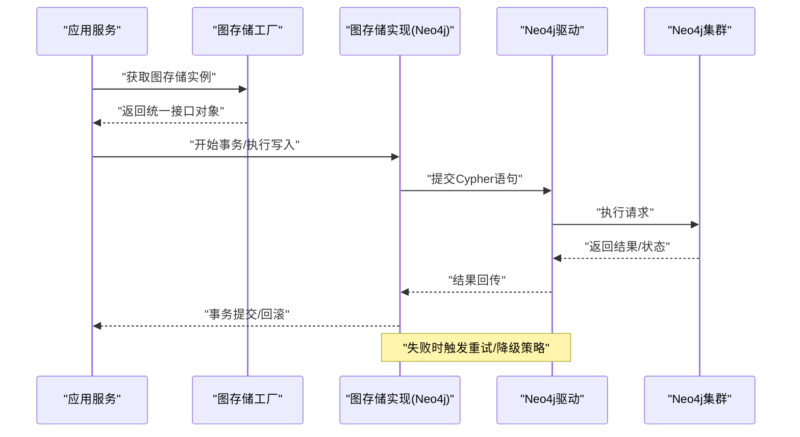
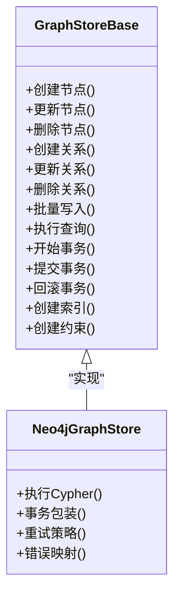
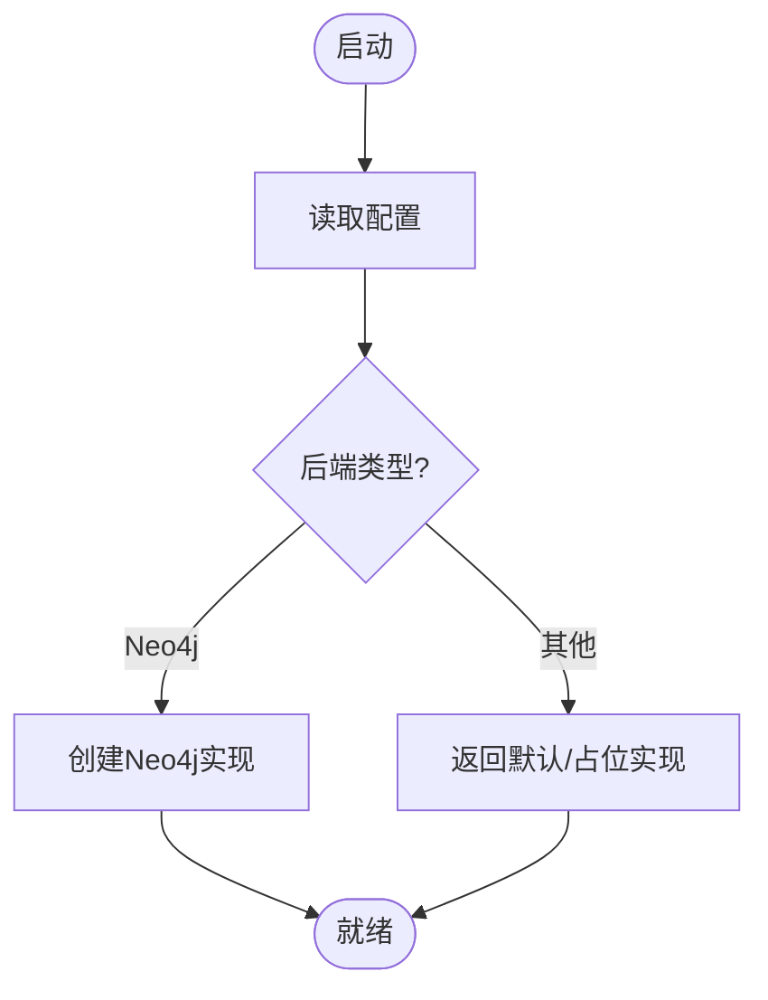
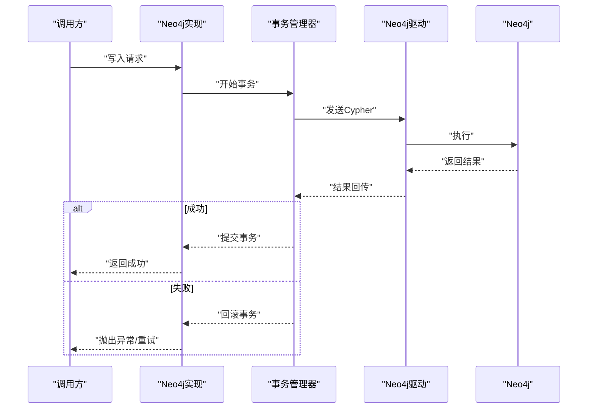
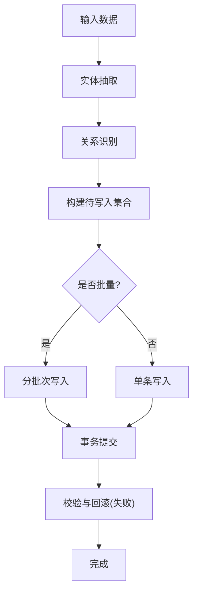
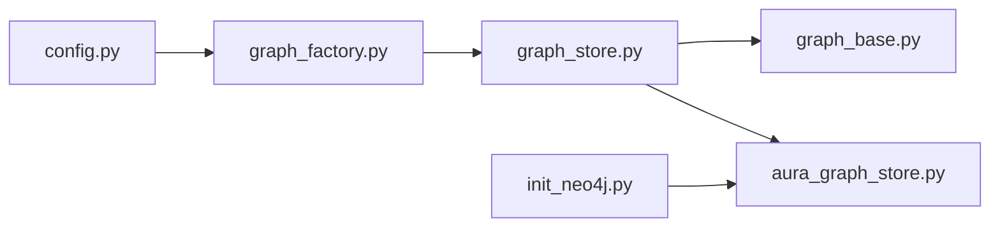

# 图数据库集成

<cite>
**本文引用的文件**   
- [backend_design/nexus/rag/graph_base.py](file://backend_design/nexus/rag/graph_base.py)
- [backend_design/nexus/rag/graph_store.py](file://backend_design/nexus/rag/graph_store.py)
- [backend_design/nexus/rag/graph_factory.py](file://backend_design/nexus/rag/graph_factory.py)
- [backend_design/nexus/rag/aura_graph_store.py](file://backend_design/nexus/rag/aura_graph_store.py)
- [scripts/init_neo4j.py](file://scripts/init_neo4j.py)
- [backend_design/nexus/core/db_manager.py](file://backend_design/nexus/core/db_manager.py)
- [backend_design/nexus/config.py](file://backend_design/nexus/config.py)
</cite>

## 目录
1. [简介](#简介)
2. [项目结构](#项目结构)
3. [核心组件](#核心组件)
4. [架构总览](#架构总览)
5. [详细组件分析](#详细组件分析)
6. [依赖关系分析](#依赖关系分析)
7. [性能与优化](#性能与优化)
8. [故障排查指南](#故障排查指南)
9. [结论](#结论)
10. [附录](#附录)

## 简介
本章节面向NexusCockpit的图数据库集成，聚焦于Neo4j图数据库的接入、知识图谱建模、查询优化与事务管理。文档围绕“图存储抽象层”的设计展开，说明如何通过统一接口屏蔽不同图数据库后端差异，并给出实体抽取、关系识别与图谱更新策略的实践建议，以及索引策略、查询计划分析与性能监控的方法。

## 项目结构
与图数据库相关的代码主要位于RAG模块与初始化脚本中：
- 抽象与工厂：定义统一的图存储接口与后端选择逻辑
- Neo4j实现：提供基于Neo4j的具体实现
- 初始化脚本：用于创建必要的索引与约束
- 配置与通用DB管理：提供连接参数与通用数据库管理能力（为后续扩展预留）

图表来源
- [backend_design/nexus/rag/graph_base.py](file://backend_design/nexus/rag/graph_base.py)
- [backend_design/nexus/rag/graph_store.py](file://backend_design/nexus/rag/graph_store.py)
- [backend_design/nexus/rag/graph_factory.py](file://backend_design/nexus/rag/graph_factory.py)
- [backend_design/nexus/rag/aura_graph_store.py](file://backend_design/nexus/rag/aura_graph_store.py)
- [scripts/init_neo4j.py](file://scripts/init_neo4j.py)
- [backend_design/nexus/config.py](file://backend_design/nexus/config.py)
- [backend_design/nexus/core/db_manager.py](file://backend_design/nexus/core/db_manager.py)

章节来源
- [backend_design/nexus/rag/graph_base.py](file://backend_design/nexus/rag/graph_base.py)
- [backend_design/nexus/rag/graph_store.py](file://backend_design/nexus/rag/graph_store.py)
- [backend_design/nexus/rag/graph_factory.py](file://backend_design/nexus/rag/graph_factory.py)
- [backend_design/nexus/rag/aura_graph_store.py](file://backend_design/nexus/rag/aura_graph_store.py)
- [scripts/init_neo4j.py](file://scripts/init_neo4j.py)
- [backend_design/nexus/config.py](file://backend_design/nexus/config.py)
- [backend_design/nexus/core/db_manager.py](file://backend_design/nexus/core/db_manager.py)

## 核心组件
- 图存储抽象接口：定义统一的节点/边增删改查、批量写入、事务边界、索引与约束管理等能力，屏蔽底层差异。
- 图存储工厂：根据配置动态选择具体后端（如Neo4j），对外暴露一致的构造与使用方式。
- Neo4j实现：封装Neo4j驱动调用，提供Cypher执行、事务控制、错误处理与重试等能力。
- 初始化脚本：在首次部署或升级时创建必要的索引与唯一性约束，保障查询性能与数据一致性。
- 配置与通用DB管理：集中管理连接参数、超时、重试等；通用DB管理为未来多后端扩展提供基础。

章节来源
- [backend_design/nexus/rag/graph_base.py](file://backend_design/nexus/rag/graph_base.py)
- [backend_design/nexus/rag/graph_store.py](file://backend_design/nexus/rag/graph_store.py)
- [backend_design/nexus/rag/graph_factory.py](file://backend_design/nexus/rag/graph_factory.py)
- [backend_design/nexus/rag/aura_graph_store.py](file://backend_design/nexus/rag/aura_graph_store.py)
- [scripts/init_neo4j.py](file://scripts/init_neo4j.py)
- [backend_design/nexus/config.py](file://backend_design/nexus/config.py)
- [backend_design/nexus/core/db_manager.py](file://backend_design/nexus/core/db_manager.py)

## 架构总览
下图展示了从上层业务到图存储后端的整体交互流程，包括工厂选择、事务边界与错误处理路径。

图表来源
- [backend_design/nexus/rag/graph_factory.py](file://backend_design/nexus/rag/graph_factory.py)
- [backend_design/nexus/rag/aura_graph_store.py](file://backend_design/nexus/rag/aura_graph_store.py)

## 详细组件分析

### 图存储抽象层设计
- 目标：通过统一接口屏蔽不同图数据库后端差异，使上层业务无需关心具体实现。
- 关键职责：
  - 节点与关系的CRUD操作
  - 批量写入与幂等更新
  - 事务边界管理与回滚
  - 索引与约束管理
  - 错误分类与重试策略
- 设计要点：
  - 接口方法以领域语义命名，避免暴露底层驱动细节
  - 对批量操作提供原子性保证
  - 对异常进行分层捕获，区分网络、认证、语法与约束冲突等

图表来源
- [backend_design/nexus/rag/graph_base.py](file://backend_design/nexus/rag/graph_base.py)
- [backend_design/nexus/rag/aura_graph_store.py](file://backend_design/nexus/rag/aura_graph_store.py)

章节来源
- [backend_design/nexus/rag/graph_base.py](file://backend_design/nexus/rag/graph_base.py)
- [backend_design/nexus/rag/aura_graph_store.py](file://backend_design/nexus/rag/aura_graph_store.py)

### 图存储工厂与后端选择
- 功能：依据配置选择具体图存储实现，支持未来扩展其他后端。
- 关键点：
  - 配置驱动：通过配置项决定后端类型与连接参数
  - 延迟加载：按需创建连接，减少启动开销
  - 健康检查：可选的连接可用性探测

图表来源
- [backend_design/nexus/rag/graph_factory.py](file://backend_design/nexus/rag/graph_factory.py)
- [backend_design/nexus/config.py](file://backend_design/nexus/config.py)

章节来源
- [backend_design/nexus/rag/graph_factory.py](file://backend_design/nexus/rag/graph_factory.py)
- [backend_design/nexus/config.py](file://backend_design/nexus/config.py)

### Neo4j实现与事务管理
- 事务模型：采用短事务包裹写操作，确保原子性与一致性；读操作可独立执行。
- 错误处理：对网络抖动、认证失败、约束冲突等进行分类处理，必要时触发重试或回退。
- 连接管理：连接池与超时控制，避免资源泄漏。

图表来源
- [backend_design/nexus/rag/aura_graph_store.py](file://backend_design/nexus/rag/aura_graph_store.py)

章节来源
- [backend_design/nexus/rag/aura_graph_store.py](file://backend_design/nexus/rag/aura_graph_store.py)

### 知识图谱构建流程
- 实体抽取：从文本或结构化数据中提取实体，生成节点属性。
- 关系识别：基于规则或模型推断实体间关系，生成有向边及属性。
- 图谱更新策略：
  - 增量更新：仅变更新增/修改/删除的数据
  - 幂等写入：基于唯一键去重，避免重复插入
  - 批量合并：大批量数据分批提交，降低单次事务压力
  - 版本化：为重要实体增加版本字段，便于回溯与对比

[此图为概念流程图，不直接映射具体源码文件]

### 索引与约束策略
- 唯一性约束：为高频查询键（如实体ID、业务主键）建立唯一约束，保障数据一致性与查询性能。
- 普通索引：为常用过滤条件建立索引，提升点查与范围查询效率。
- 复合索引：针对多字段组合查询场景，合理设置复合索引。
- 维护策略：在数据导入或大规模更新前创建索引，完成后评估是否需要重建或调整。

章节来源
- [scripts/init_neo4j.py](file://scripts/init_neo4j.py)

### 复杂图查询案例与最佳实践
- 多跳关系查询：限制遍历深度，避免全图扫描；结合标签与属性过滤缩小搜索空间。
- 聚合统计：尽量在数据库侧完成聚合，减少数据传输。
- 分页与游标：对大结果集采用分页或游标式拉取，避免内存溢出。
- 查询计划分析：利用数据库提供的计划分析工具定位瓶颈，关注I/O与CPU热点。
- 缓存策略：对热点查询结果进行短期缓存，降低数据库压力。

[本节为通用指导，不直接引用具体源码文件]

## 依赖关系分析
- 内部依赖：
  - 图存储实现依赖抽象接口与工厂
  - 工厂依赖配置模块
  - 初始化脚本依赖Neo4j实现的能力（索引/约束）
- 外部依赖：
  - Neo4j驱动与协议
  - 可能的监控与日志系统

图表来源
- [backend_design/nexus/config.py](file://backend_design/nexus/config.py)
- [backend_design/nexus/rag/graph_factory.py](file://backend_design/nexus/rag/graph_factory.py)
- [backend_design/nexus/rag/graph_store.py](file://backend_design/nexus/rag/graph_store.py)
- [backend_design/nexus/rag/graph_base.py](file://backend_design/nexus/rag/graph_base.py)
- [backend_design/nexus/rag/aura_graph_store.py](file://backend_design/nexus/rag/aura_graph_store.py)
- [scripts/init_neo4j.py](file://scripts/init_neo4j.py)

章节来源
- [backend_design/nexus/config.py](file://backend_design/nexus/config.py)
- [backend_design/nexus/rag/graph_factory.py](file://backend_design/nexus/rag/graph_factory.py)
- [backend_design/nexus/rag/graph_store.py](file://backend_design/nexus/rag/graph_store.py)
- [backend_design/nexus/rag/graph_base.py](file://backend_design/nexus/rag/graph_base.py)
- [backend_design/nexus/rag/aura_graph_store.py](file://backend_design/nexus/rag/aura_graph_store.py)
- [scripts/init_neo4j.py](file://scripts/init_neo4j.py)

## 性能与优化
- 索引策略
  - 优先为高频过滤与连接键建立索引
  - 避免过度索引导致写入放大
- 查询优化
  - 明确匹配模式，减少不必要的通配符
  - 使用WITH子句拆分复杂计算，提高可读性与执行效率
- 事务与批处理
  - 小事务频繁提交优于大事务长时持有
  - 批量写入按大小切分，配合幂等键避免重复
- 监控与观测
  - 记录关键指标：QPS、P99延迟、错误率、连接池利用率
  - 结合数据库计划分析定位慢查询
- 容量规划
  - 评估节点与关系规模，合理划分标签与属性
  - 定期清理过期数据，保持图规模可控

[本节为通用指导，不直接引用具体源码文件]

## 故障排查指南
- 常见问题
  - 连接失败：检查认证信息、网络连通性与防火墙策略
  - 约束冲突：确认唯一性约束与幂等写入逻辑
  - 查询超时：分析查询计划，优化索引与匹配模式
  - 事务回滚：检查业务异常与数据库锁等待
- 诊断步骤
  - 启用详细日志，记录关键入参与返回值
  - 使用数据库控制台复现问题，观察执行计划
  - 逐步缩小查询范围，定位热点路径
- 恢复策略
  - 对幂等操作进行重试
  - 对非幂等操作引入补偿机制
  - 必要时回滚事务并告警

章节来源
- [backend_design/nexus/core/db_manager.py](file://backend_design/nexus/core/db_manager.py)

## 结论
通过统一的图存储抽象层与工厂模式，NexusCockpit实现了与Neo4j等图数据库的松耦合集成。结合合理的索引与约束策略、事务管理与批处理机制，可在保证一致性的同时获得良好的查询性能。建议在上线前完成索引初始化与压测验证，并在运行期持续监控与优化。

## 附录
- 术语
  - 节点：图中的实体
  - 关系：节点之间的有向边
  - Cypher：Neo4j的图查询语言
  - 事务：一组操作的原子执行单元
- 参考路径
  - 抽象接口与实现：见“详细组件分析”中的文件路径
  - 初始化脚本：见“索引与约束策略”中的文件路径