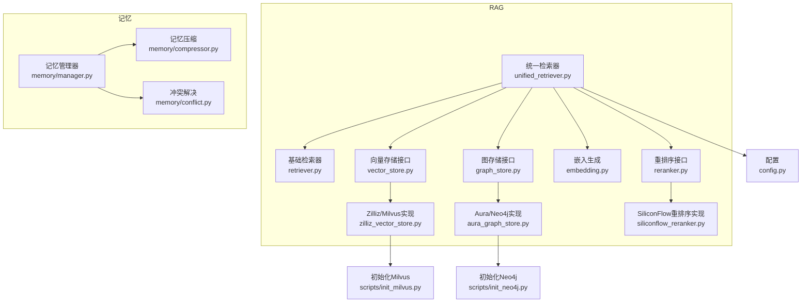
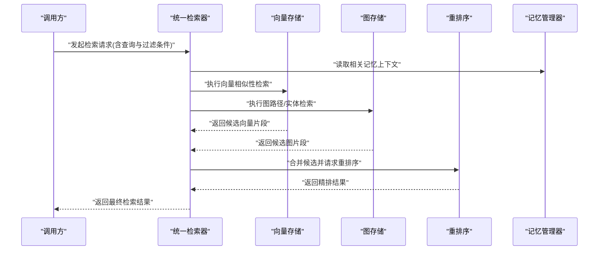
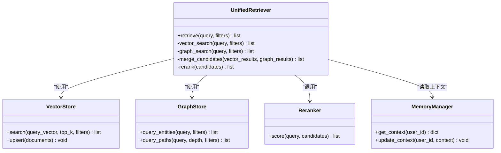
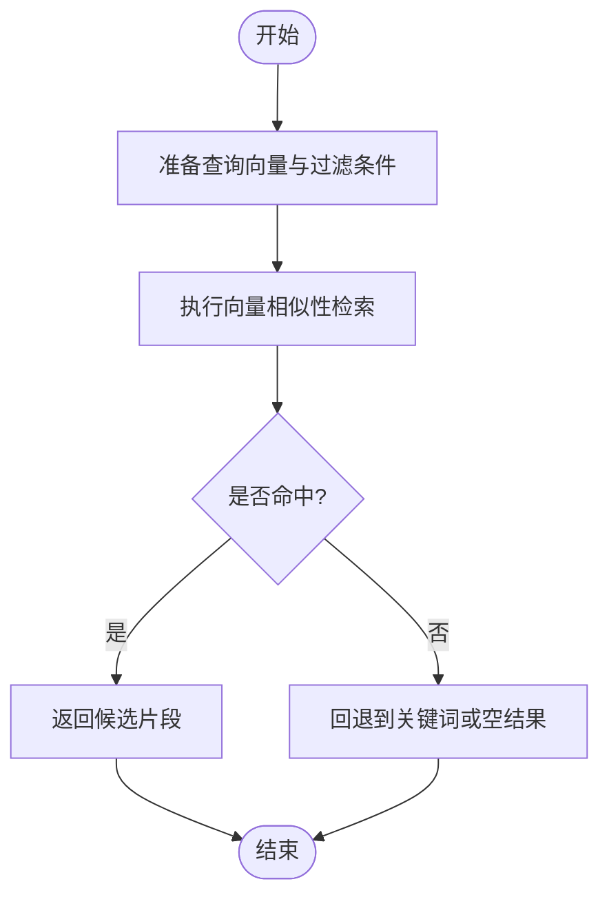
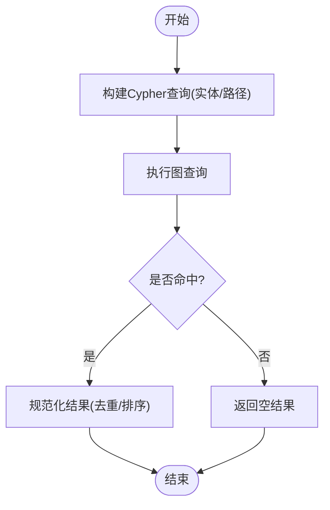
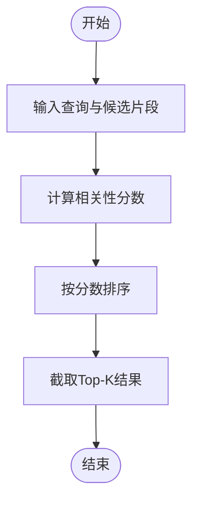
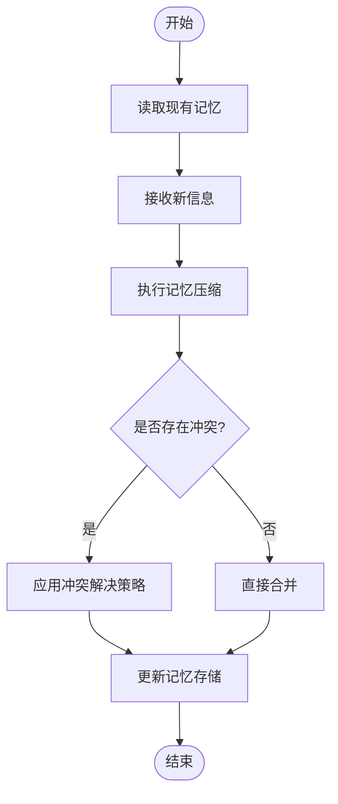
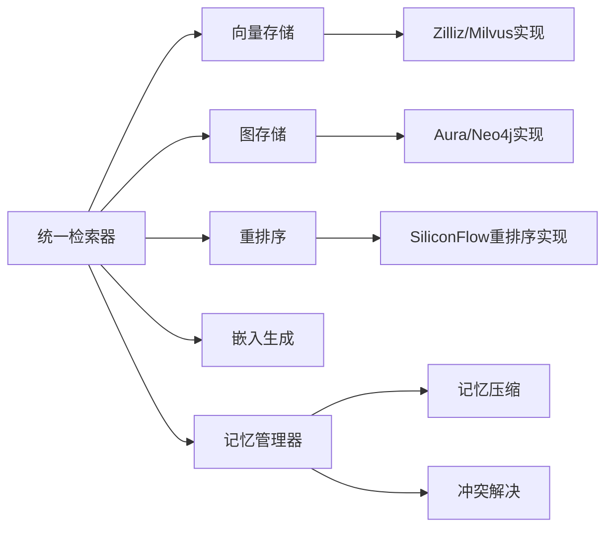

# 知识管理系统

<cite>
**本文引用的文件**   
- [backend_design/nexus/rag/unified_retriever.py](file://backend_design/nexus/rag/unified_retriever.py)
- [backend_design/nexus/rag/retriever.py](file://backend_design/nexus/rag/retriever.py)
- [backend_design/nexus/rag/vector_store.py](file://backend_design/nexus/rag/vector_store.py)
- [backend_design/nexus/rag/zilliz_vector_store.py](file://backend_design/nexus/rag/zilliz_vector_store.py)
- [backend_design/nexus/rag/graph_store.py](file://backend_design/nexus/rag/graph_store.py)
- [backend_design/nexus/rag/aura_graph_store.py](file://backend_design/nexus/rag/aura_graph_store.py)
- [backend_design/nexus/rag/embedding.py](file://backend_design/nexus/rag/embedding.py)
- [backend_design/nexus/rag/reranker.py](file://backend_design/nexus/rag/reranker.py)
- [backend_design/nexus/rag/siliconflow_reranker.py](file://backend_design/nexus/rag/siliconflow_reranker.py)
- [backend_design/nexus/memory/manager.py](file://backend_design/nexus/memory/manager.py)
- [backend_design/nexus/memory/compressor.py](file://backend_design/nexus/memory/compressor.py)
- [backend_design/nexus/memory/conflict.py](file://backend_design/nexus/memory/conflict.py)
- [backend_design/nexus/config.py](file://backend_design/nexus/config.py)
- [backend_design/scripts/init_milvus.py](file://backend_design/scripts/init_milvus.py)
- [backend_design/scripts/init_neo4j.py](file://backend_design/scripts/init_neo4j.py)
</cite>

## 目录
1. [简介](#简介)
2. [项目结构](#项目结构)
3. [核心组件](#核心组件)
4. [架构总览](#架构总览)
5. [详细组件分析](#详细组件分析)
6. [依赖关系分析](#依赖关系分析)
7. [性能考虑](#性能考虑)
8. [故障排查指南](#故障排查指南)
9. [结论](#结论)
10. [附录](#附录)

## 简介
本文件面向NexusCockpit的知识管理系统，聚焦RAG（检索增强生成）架构与记忆管理。系统通过向量数据库（Milvus）与图数据库（Neo4j）的协同工作，提供混合检索策略与结果重排序能力；同时构建长期记忆、记忆压缩与冲突解决机制，支撑高质量问答与个性化服务。文档涵盖统一检索器、嵌入生成、知识图谱构建、索引策略、数据导入导出、查询优化与性能调优等关键主题，并提供可视化架构图与流程图帮助理解。

## 项目结构
知识管理相关代码主要位于后端模块的以下子系统中：
- RAG子系统：统一检索器、向量存储、图存储、嵌入与重排序
- 记忆子系统：记忆管理器、压缩器、冲突解决
- 配置与初始化脚本：系统参数与外部数据库初始化

图表来源
- [backend_design/nexus/rag/unified_retriever.py](file://backend_design/nexus/rag/unified_retriever.py)
- [backend_design/nexus/rag/retriever.py](file://backend_design/nexus/rag/retriever.py)
- [backend_design/nexus/rag/vector_store.py](file://backend_design/nexus/rag/vector_store.py)
- [backend_design/nexus/rag/zilliz_vector_store.py](file://backend_design/nexus/rag/zilliz_vector_store.py)
- [backend_design/nexus/rag/graph_store.py](file://backend_design/nexus/rag/graph_store.py)
- [backend_design/nexus/rag/aura_graph_store.py](file://backend_design/nexus/rag/aura_graph_store.py)
- [backend_design/nexus/rag/embedding.py](file://backend_design/nexus/rag/embedding.py)
- [backend_design/nexus/rag/reranker.py](file://backend_design/nexus/rag/reranker.py)
- [backend_design/nexus/rag/siliconflow_reranker.py](file://backend_design/nexus/rag/siliconflow_reranker.py)
- [backend_design/nexus/memory/manager.py](file://backend_design/nexus/memory/manager.py)
- [backend_design/nexus/memory/compressor.py](file://backend_design/nexus/memory/compressor.py)
- [backend_design/nexus/memory/conflict.py](file://backend_design/nexus/memory/conflict.py)
- [backend_design/nexus/config.py](file://backend_design/nexus/config.py)
- [backend_design/scripts/init_milvus.py](file://backend_design/scripts/init_milvus.py)
- [backend_design/scripts/init_neo4j.py](file://backend_design/scripts/init_neo4j.py)

章节来源
- [backend_design/nexus/rag/unified_retriever.py](file://backend_design/nexus/rag/unified_retriever.py)
- [backend_design/nexus/rag/retriever.py](file://backend_design/nexus/rag/retriever.py)
- [backend_design/nexus/rag/vector_store.py](file://backend_design/nexus/rag/vector_store.py)
- [backend_design/nexus/rag/zilliz_vector_store.py](file://backend_design/nexus/rag/zilliz_vector_store.py)
- [backend_design/nexus/rag/graph_store.py](file://backend_design/nexus/rag/graph_store.py)
- [backend_design/nexus/rag/aura_graph_store.py](file://backend_design/nexus/rag/aura_graph_store.py)
- [backend_design/nexus/rag/embedding.py](file://backend_design/nexus/rag/embedding.py)
- [backend_design/nexus/rag/reranker.py](file://backend_design/nexus/rag/reranker.py)
- [backend_design/nexus/rag/siliconflow_reranker.py](file://backend_design/nexus/rag/siliconflow_reranker.py)
- [backend_design/nexus/memory/manager.py](file://backend_design/nexus/memory/manager.py)
- [backend_design/nexus/memory/compressor.py](file://backend_design/nexus/memory/compressor.py)
- [backend_design/nexus/memory/conflict.py](file://backend_design/nexus/memory/conflict.py)
- [backend_design/nexus/config.py](file://backend_design/nexus/config.py)
- [backend_design/scripts/init_milvus.py](file://backend_design/scripts/init_milvus.py)
- [backend_design/scripts/init_neo4j.py](file://backend_design/scripts/init_neo4j.py)

## 核心组件
- 统一检索器：协调向量检索与图检索，支持混合策略与重排序，输出最终候选集供上层使用。
- 向量存储层：抽象向量库操作，当前提供基于Milvus/Zilliz的实现，负责向量化数据的写入、相似性检索与元数据过滤。
- 图存储层：抽象图数据库操作，当前提供基于Neo4j/Aura的实现，负责节点与关系的增删改查及路径检索。
- 嵌入生成：将文本内容转换为向量表示，供向量检索使用。
- 重排序：对初步检索结果进行精细化打分与排序，提升相关性。
- 记忆管理：维护用户或会话的长期记忆，包含压缩与冲突解决策略，确保记忆一致性与可解释性。

章节来源
- [backend_design/nexus/rag/unified_retriever.py](file://backend_design/nexus/rag/unified_retriever.py)
- [backend_design/nexus/rag/vector_store.py](file://backend_design/nexus/rag/vector_store.py)
- [backend_design/nexus/rag/zilliz_vector_store.py](file://backend_design/nexus/rag/zilliz_vector_store.py)
- [backend_design/nexus/rag/graph_store.py](file://backend_design/nexus/rag/graph_store.py)
- [backend_design/nexus/rag/aura_graph_store.py](file://backend_design/nexus/rag/aura_graph_store.py)
- [backend_design/nexus/rag/embedding.py](file://backend_design/nexus/rag/embedding.py)
- [backend_design/nexus/rag/reranker.py](file://backend_design/nexus/rag/reranker.py)
- [backend_design/nexus/rag/siliconflow_reranker.py](file://backend_design/nexus/rag/siliconflow_reranker.py)
- [backend_design/nexus/memory/manager.py](file://backend_design/nexus/memory/manager.py)
- [backend_design/nexus/memory/compressor.py](file://backend_design/nexus/memory/compressor.py)
- [backend_design/nexus/memory/conflict.py](file://backend_design/nexus/memory/conflict.py)

## 架构总览
下图展示RAG与记忆系统的整体交互流程：用户输入经统一检索器分发至向量与图检索，得到候选片段后由重排序模型精排，最终结合记忆上下文生成回答。

图表来源
- [backend_design/nexus/rag/unified_retriever.py](file://backend_design/nexus/rag/unified_retriever.py)
- [backend_design/nexus/rag/vector_store.py](file://backend_design/nexus/rag/vector_store.py)
- [backend_design/nexus/rag/zilliz_vector_store.py](file://backend_design/nexus/rag/zilliz_vector_store.py)
- [backend_design/nexus/rag/graph_store.py](file://backend_design/nexus/rag/graph_store.py)
- [backend_design/nexus/rag/aura_graph_store.py](file://backend_design/nexus/rag/aura_graph_store.py)
- [backend_design/nexus/rag/reranker.py](file://backend_design/nexus/rag/reranker.py)
- [backend_design/nexus/rag/siliconflow_reranker.py](file://backend_design/nexus/rag/siliconflow_reranker.py)
- [backend_design/nexus/memory/manager.py](file://backend_design/nexus/memory/manager.py)

## 详细组件分析

### 统一检索器（混合检索与重排序）
统一检索器是RAG的核心编排者，负责：
- 解析查询意图与过滤条件
- 并行触发向量检索与图检索
- 合并候选集并进行去重与归一化
- 调用重排序模型进行精排
- 结合记忆上下文形成最终结果

图表来源
- [backend_design/nexus/rag/unified_retriever.py](file://backend_design/nexus/rag/unified_retriever.py)
- [backend_design/nexus/rag/vector_store.py](file://backend_design/nexus/rag/vector_store.py)
- [backend_design/nexus/rag/graph_store.py](file://backend_design/nexus/rag/graph_store.py)
- [backend_design/nexus/rag/reranker.py](file://backend_design/nexus/rag/reranker.py)
- [backend_design/nexus/memory/manager.py](file://backend_design/nexus/memory/manager.py)

章节来源
- [backend_design/nexus/rag/unified_retriever.py](file://backend_design/nexus/rag/unified_retriever.py)

### 向量存储（Milvus/Zilliz）
向量存储层提供统一的向量操作接口，当前实现基于Milvus/Zilliz，支持：
- 文档向量化与批量插入
- 相似度检索与元数据过滤
- 集合/索引管理与生命周期控制

图表来源
- [backend_design/nexus/rag/vector_store.py](file://backend_design/nexus/rag/vector_store.py)
- [backend_design/nexus/rag/zilliz_vector_store.py](file://backend_design/nexus/rag/zilliz_vector_store.py)

章节来源
- [backend_design/nexus/rag/vector_store.py](file://backend_design/nexus/rag/vector_store.py)
- [backend_design/nexus/rag/zilliz_vector_store.py](file://backend_design/nexus/rag/zilliz_vector_store.py)

### 图存储（Neo4j/Aura）
图存储层提供图数据库的统一操作接口，当前实现基于Neo4j/Aura，支持：
- 实体与关系的增删改查
- 多跳路径检索与深度限制
- 标签与属性过滤

图表来源
- [backend_design/nexus/rag/graph_store.py](file://backend_design/nexus/rag/graph_store.py)
- [backend_design/nexus/rag/aura_graph_store.py](file://backend_design/nexus/rag/aura_graph_store.py)

章节来源
- [backend_design/nexus/rag/graph_store.py](file://backend_design/nexus/rag/graph_store.py)
- [backend_design/nexus/rag/aura_graph_store.py](file://backend_design/nexus/rag/aura_graph_store.py)

### 嵌入生成
嵌入生成模块负责将文本内容转换为固定维度的向量表示，供向量检索使用。通常包括：
- 文本预处理（清洗、分块）
- 选择嵌入模型与维度配置
- 批量生成与缓存策略

章节来源
- [backend_design/nexus/rag/embedding.py](file://backend_design/nexus/rag/embedding.py)

### 重排序（SiliconFlow）
重排序模块对初步检索结果进行精细化打分，以提升最终答案的相关性与准确性。典型流程：
- 接收查询与候选片段
- 计算相关性分数
- 按分数降序排列并截断

图表来源
- [backend_design/nexus/rag/reranker.py](file://backend_design/nexus/rag/reranker.py)
- [backend_design/nexus/rag/siliconflow_reranker.py](file://backend_design/nexus/rag/siliconflow_reranker.py)

章节来源
- [backend_design/nexus/rag/reranker.py](file://backend_design/nexus/rag/reranker.py)
- [backend_design/nexus/rag/siliconflow_reranker.py](file://backend_design/nexus/rag/siliconflow_reranker.py)

### 记忆管理（长期记忆、压缩与冲突解决）
记忆管理器维护用户或会话的长期记忆，包含：
- 长期记忆存储：持久化用户偏好、历史对话摘要、领域知识
- 记忆压缩算法：对冗长记忆进行摘要与合并，降低存储与检索成本
- 冲突解决机制：当新信息与旧记忆不一致时，采用优先级、时间衰减或一致性校验策略进行融合

图表来源
- [backend_design/nexus/memory/manager.py](file://backend_design/nexus/memory/manager.py)
- [backend_design/nexus/memory/compressor.py](file://backend_design/nexus/memory/compressor.py)
- [backend_design/nexus/memory/conflict.py](file://backend_design/nexus/memory/conflict.py)

章节来源
- [backend_design/nexus/memory/manager.py](file://backend_design/nexus/memory/manager.py)
- [backend_design/nexus/memory/compressor.py](file://backend_design/nexus/memory/compressor.py)
- [backend_design/nexus/memory/conflict.py](file://backend_design/nexus/memory/conflict.py)

## 依赖关系分析
RAG与记忆子系统之间的依赖关系如下：

图表来源
- [backend_design/nexus/rag/unified_retriever.py](file://backend_design/nexus/rag/unified_retriever.py)
- [backend_design/nexus/rag/vector_store.py](file://backend_design/nexus/rag/vector_store.py)
- [backend_design/nexus/rag/zilliz_vector_store.py](file://backend_design/nexus/rag/zilliz_vector_store.py)
- [backend_design/nexus/rag/graph_store.py](file://backend_design/nexus/rag/graph_store.py)
- [backend_design/nexus/rag/aura_graph_store.py](file://backend_design/nexus/rag/aura_graph_store.py)
- [backend_design/nexus/rag/reranker.py](file://backend_design/nexus/rag/reranker.py)
- [backend_design/nexus/rag/siliconflow_reranker.py](file://backend_design/nexus/rag/siliconflow_reranker.py)
- [backend_design/nexus/rag/embedding.py](file://backend_design/nexus/rag/embedding.py)
- [backend_design/nexus/memory/manager.py](file://backend_design/nexus/memory/manager.py)
- [backend_design/nexus/memory/compressor.py](file://backend_design/nexus/memory/compressor.py)
- [backend_design/nexus/memory/conflict.py](file://backend_design/nexus/memory/conflict.py)

章节来源
- [backend_design/nexus/rag/unified_retriever.py](file://backend_design/nexus/rag/unified_retriever.py)
- [backend_design/nexus/rag/vector_store.py](file://backend_design/nexus/rag/vector_store.py)
- [backend_design/nexus/rag/zilliz_vector_store.py](file://backend_design/nexus/rag/zilliz_vector_store.py)
- [backend_design/nexus/rag/graph_store.py](file://backend_design/nexus/rag/graph_store.py)
- [backend_design/nexus/rag/aura_graph_store.py](file://backend_design/nexus/rag/aura_graph_store.py)
- [backend_design/nexus/rag/reranker.py](file://backend_design/nexus/rag/reranker.py)
- [backend_design/nexus/rag/siliconflow_reranker.py](file://backend_design/nexus/rag/siliconflow_reranker.py)
- [backend_design/nexus/rag/embedding.py](file://backend_design/nexus/rag/embedding.py)
- [backend_design/nexus/memory/manager.py](file://backend_design/nexus/memory/manager.py)
- [backend_design/nexus/memory/compressor.py](file://backend_design/nexus/memory/compressor.py)
- [backend_design/nexus/memory/conflict.py](file://backend_design/nexus/memory/conflict.py)

## 性能考虑
- 向量检索优化
  - 合理设置top_k与过滤条件，减少不必要的扫描
  - 使用合适的索引类型与度量方式，平衡召回率与延迟
  - 批量插入与异步写入，避免阻塞主流程
- 图检索优化
  - 限制查询深度与分支数量，避免全图遍历
  - 利用标签与属性索引加速匹配
  - 预编译常用Cypher模板，减少解析开销
- 重排序优化
  - 控制候选规模，避免过大输入导致重排序耗时过长
  - 使用轻量级模型或批处理推理，提高吞吐
- 记忆管理优化
  - 定期压缩与归档低价值记忆，保持记忆库精简
  - 冲突解决采用增量更新与版本化，避免全量重写
- 配置与资源
  - 根据负载调整并发度与超时阈值
  - 监控向量与图数据库的连接池与内存占用

[本节为通用指导，不直接分析具体文件]

## 故障排查指南
- 向量检索失败
  - 检查Milvus/Zilliz连接与集合状态
  - 确认向量维度与索引配置一致
  - 查看日志中的错误码与堆栈信息
- 图检索失败
  - 验证Neo4j/Aura连接与认证信息
  - 检查Cypher语法与权限
  - 观察慢查询与锁等待
- 重排序异常
  - 确认模型权重与输入格式
  - 检查网络与API限流
- 记忆冲突
  - 审查冲突解决策略与优先级规则
  - 核对时间戳与版本号，确保一致性

章节来源
- [backend_design/nexus/rag/zilliz_vector_store.py](file://backend_design/nexus/rag/zilliz_vector_store.py)
- [backend_design/nexus/rag/aura_graph_store.py](file://backend_design/nexus/rag/aura_graph_store.py)
- [backend_design/nexus/rag/siliconflow_reranker.py](file://backend_design/nexus/rag/siliconflow_reranker.py)
- [backend_design/nexus/memory/conflict.py](file://backend_design/nexus/memory/conflict.py)

## 结论
NexusCockpit的知识管理系统以统一检索器为核心，整合向量与图检索能力，并通过重排序与记忆管理提升问答质量与个性化体验。通过合理的索引策略、查询优化与资源调优，可在大规模数据场景下保持稳定性能与高可用性。建议在生产环境持续监控关键指标，并根据业务需求迭代检索策略与记忆策略。

[本节为总结性内容，不直接分析具体文件]

## 附录

### 数据导入与导出
- 向量数据导入
  - 使用初始化脚本创建集合与索引
  - 批量插入文档与元数据
- 图数据导入
  - 使用初始化脚本建立节点与关系
  - 导入标签与属性映射
- 导出策略
  - 向量数据：按集合导出为离线备份
  - 图数据：导出为CSV或GEXF用于分析

章节来源
- [backend_design/scripts/init_milvus.py](file://backend_design/scripts/init_milvus.py)
- [backend_design/scripts/init_neo4j.py](file://backend_design/scripts/init_neo4j.py)

### 查询优化与性能调优案例
- 混合检索策略
  - 先向量粗筛，再图细化，最后重排序精排
  - 动态调整各阶段top_k，平衡召回与延迟
- 记忆压缩与冲突解决
  - 周期性压缩低活跃度记忆
  - 冲突时采用“最近优先+证据强度”融合策略
- 监控与告警
  - 记录检索耗时、命中率与重排序得分分布
  - 设置阈值告警，及时定位瓶颈

章节来源
- [backend_design/nexus/rag/unified_retriever.py](file://backend_design/nexus/rag/unified_retriever.py)
- [backend_design/nexus/memory/compressor.py](file://backend_design/nexus/memory/compressor.py)
- [backend_design/nexus/memory/conflict.py](file://backend_design/nexus/memory/conflict.py)