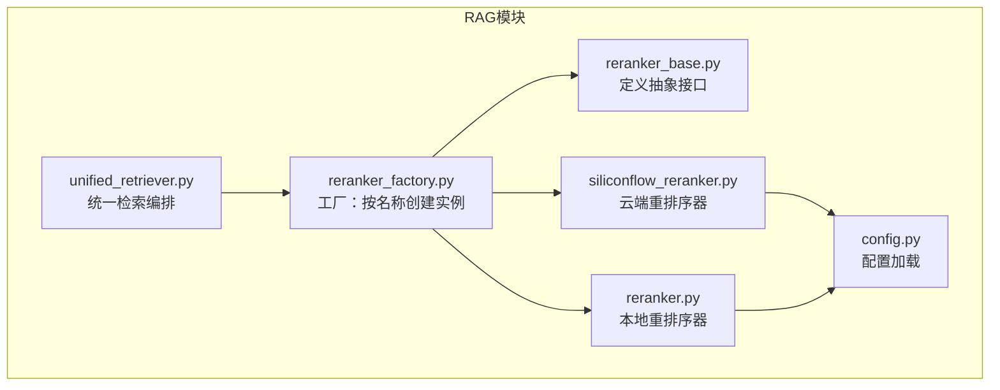
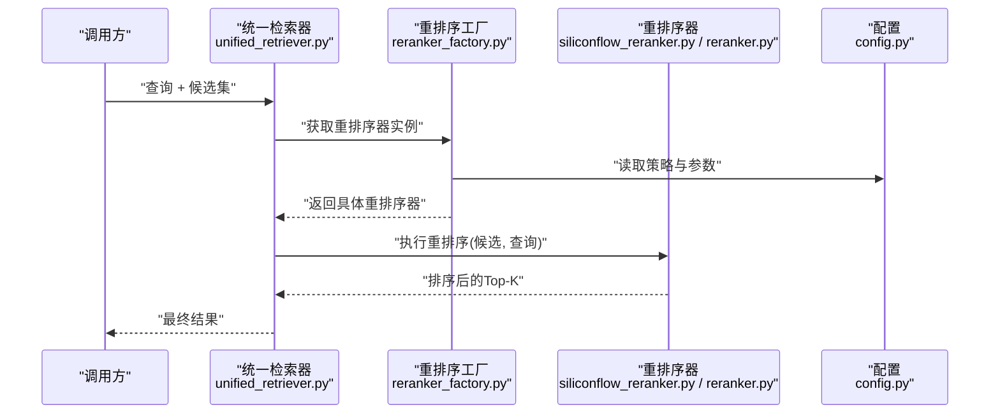
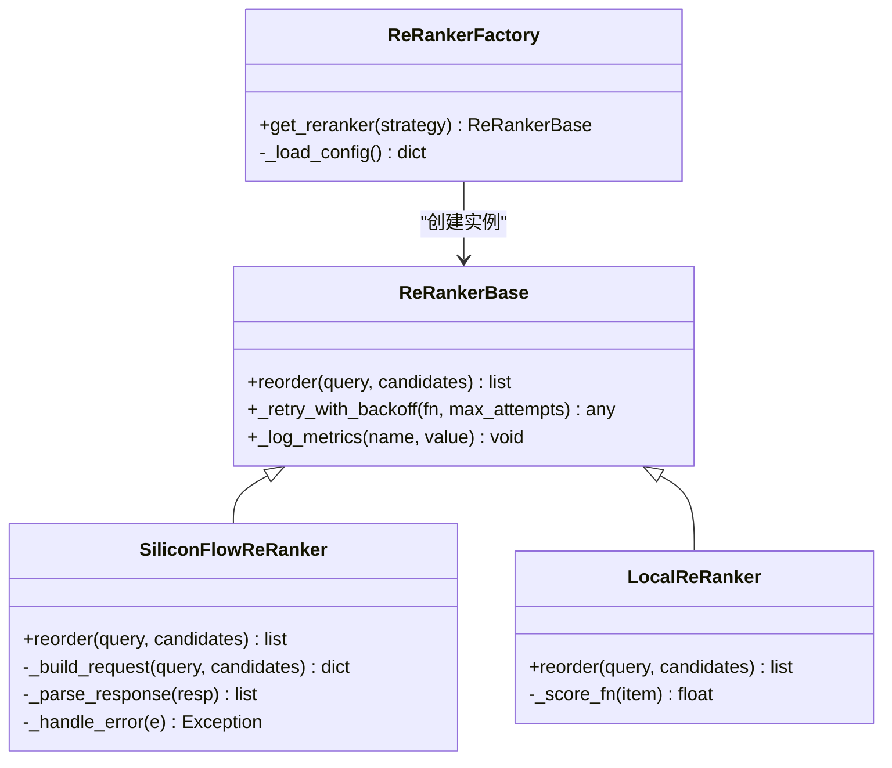
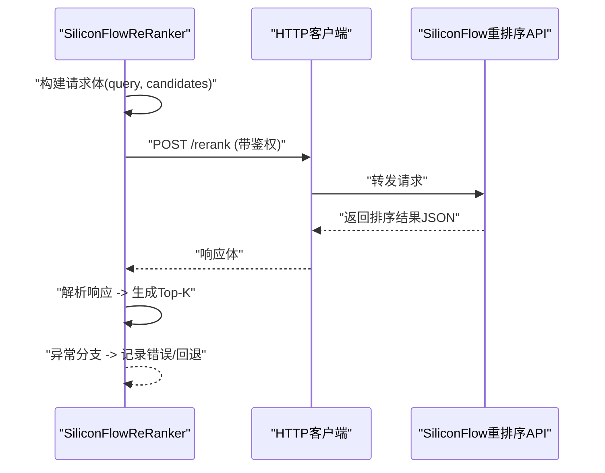
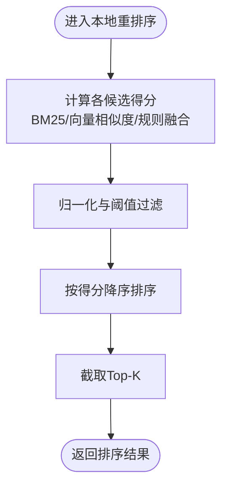
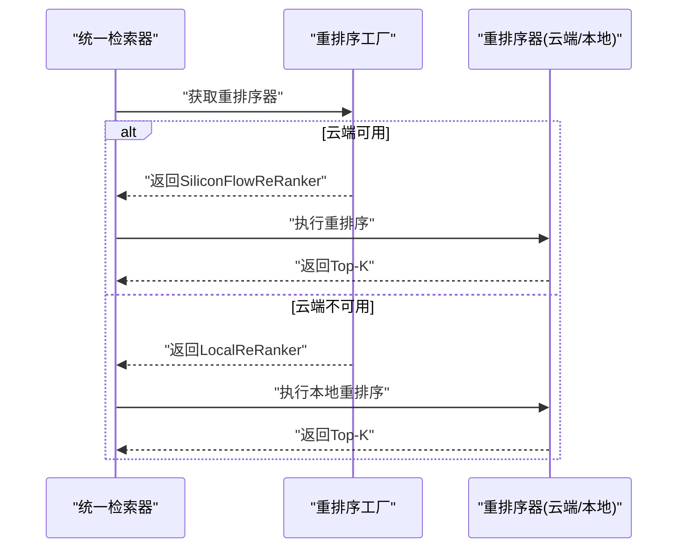
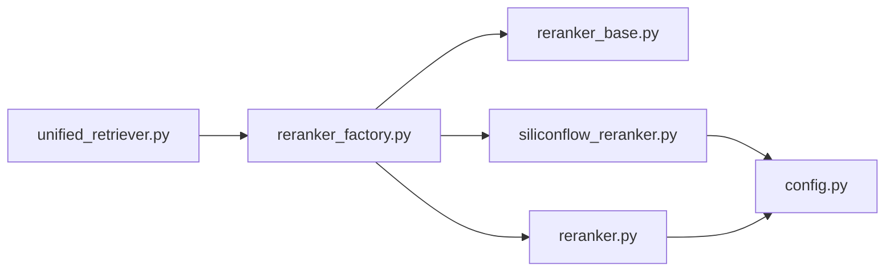

# 结果重排序系统

<cite>
**本文引用的文件**   
- [reranker_base.py](file://backend_design/nexus/rag/reranker_base.py)
- [reranker_factory.py](file://backend_design/nexus/rag/reranker_factory.py)
- [siliconflow_reranker.py](file://backend_design/nexus/rag/siliconflow_reranker.py)
- [reranker.py](file://backend_design/nexus/rag/reranker.py)
- [unified_retriever.py](file://backend_design/nexus/rag/unified_retriever.py)
- [config.py](file://backend_design/nexus/config.py)
</cite>

## 目录
1. [简介](#简介)
2. [项目结构](#项目结构)
3. [核心组件](#核心组件)
4. [架构总览](#架构总览)
5. [详细组件分析](#详细组件分析)
6. [依赖关系分析](#依赖关系分析)
7. [性能考虑](#性能考虑)
8. [故障排查指南](#故障排查指南)
9. [结论](#结论)
10. [附录](#附录)

## 简介
本文件面向NexusCockpit的“结果重排序系统”，聚焦RAG链路中的重排序环节，覆盖以下目标：
- 重排序算法原理：基于LLM的重排序与传统相关性评分方法
- SiliconFlow重排序器的集成使用：API调用、参数配置与结果解析
- 工厂模式设计：动态切换不同重排序策略
- 效果评估与A/B测试框架：指标、实验设计与落地建议
- 性能优化技巧：缓存、批量处理与异步处理的实践

## 项目结构
重排序相关代码位于后端RAG模块中，关键文件如下：
- reranker_base.py：定义重排序器抽象基类与通用接口
- reranker_factory.py：实现重排序器工厂，支持按配置动态创建具体重排序器
- siliconflow_reranker.py：SiliconFlow云端重排序器实现（HTTP API）
- reranker.py：本地重排序器实现（如传统相关性评分或本地模型）
- unified_retriever.py：统一检索入口，串联召回与重排序流程
- config.py：全局配置加载与默认值管理

图表来源
- [reranker_base.py](file://backend_design/nexus/rag/reranker_base.py)
- [reranker_factory.py](file://backend_design/nexus/rag/reranker_factory.py)
- [siliconflow_reranker.py](file://backend_design/nexus/rag/siliconflow_reranker.py)
- [reranker.py](file://backend_design/nexus/rag/reranker.py)
- [unified_retriever.py](file://backend_design/nexus/rag/unified_retriever.py)
- [config.py](file://backend_design/nexus/config.py)

章节来源
- [reranker_base.py](file://backend_design/nexus/rag/reranker_base.py)
- [reranker_factory.py](file://backend_design/nexus/rag/reranker_factory.py)
- [siliconflow_reranker.py](file://backend_design/nexus/rag/siliconflow_reranker.py)
- [reranker.py](file://backend_design/nexus/rag/reranker.py)
- [unified_retriever.py](file://backend_design/nexus/rag/unified_retriever.py)
- [config.py](file://backend_design/nexus/config.py)

## 核心组件
- 抽象基类（reranker_base.py）
  - 定义统一的reorder接口契约，包括输入输出规范、错误约定与扩展点
  - 提供通用工具方法（如日志、度量埋点、重试与超时封装等）
- 工厂（reranker_factory.py）
  - 根据配置项选择并实例化具体重排序器（如SiliconFlow或本地实现）
  - 负责参数校验、依赖注入与生命周期管理
- SiliconFlow重排序器（siliconflow_reranker.py）
  - 通过HTTP调用云端重排序服务，支持请求体构造、响应解析与异常处理
  - 可配置端点、鉴权、超时、重试与回退策略
- 本地重排序器（reranker.py）
  - 实现传统相关性评分（如BM25、向量相似度加权）或本地模型推理
  - 适合低延迟、离线场景与成本敏感型任务
- 统一检索编排（unified_retriever.py）
  - 将召回结果交给重排序器进行精排，形成最终Top-K
  - 协调缓存、降级与监控上报

章节来源
- [reranker_base.py](file://backend_design/nexus/rag/reranker_base.py)
- [reranker_factory.py](file://backend_design/nexus/rag/reranker_factory.py)
- [siliconflow_reranker.py](file://backend_design/nexus/rag/siliconflow_reranker.py)
- [reranker.py](file://backend_design/nexus/rag/reranker.py)
- [unified_retriever.py](file://backend_design/nexus/rag/unified_retriever.py)

## 架构总览
下图展示从统一检索到重排序的整体数据流与控制流。

图表来源
- [unified_retriever.py](file://backend_design/nexus/rag/unified_retriever.py)
- [reranker_factory.py](file://backend_design/nexus/rag/reranker_factory.py)
- [siliconflow_reranker.py](file://backend_design/nexus/rag/siliconflow_reranker.py)
- [reranker.py](file://backend_design/nexus/rag/reranker.py)
- [config.py](file://backend_design/nexus/config.py)

## 详细组件分析

### 抽象基类与工厂模式
- 抽象基类职责
  - 定义reorder方法的签名与返回值结构
  - 提供通用能力：重试、超时、指标采集、错误分类
- 工厂职责
  - 依据配置键名创建对应实现
  - 对缺失配置给出明确错误提示
  - 支持热切换（在运行时根据配置重建实例）

图表来源
- [reranker_base.py](file://backend_design/nexus/rag/reranker_base.py)
- [siliconflow_reranker.py](file://backend_design/nexus/rag/siliconflow_reranker.py)
- [reranker.py](file://backend_design/nexus/rag/reranker.py)
- [reranker_factory.py](file://backend_design/nexus/rag/reranker_factory.py)

章节来源
- [reranker_base.py](file://backend_design/nexus/rag/reranker_base.py)
- [reranker_factory.py](file://backend_design/nexus/rag/reranker_factory.py)

### SiliconFlow重排序器集成
- 调用流程
  - 构建请求体：包含query与candidates列表
  - 发送HTTP请求：携带鉴权头、超时与重试策略
  - 解析响应：提取排序分数与顺序，映射为内部结构
  - 异常处理：网络错误、服务端错误、格式错误的分级处理与回退
- 参数配置
  - 端点URL、鉴权Token、超时时间、最大重试次数、回退策略开关
  - 可选：top_k、temperature（若适用）、自定义字段映射
- 结果解析
  - 将云端返回的排序结果转换为统一的数据结构，便于下游消费

图表来源
- [siliconflow_reranker.py](file://backend_design/nexus/rag/siliconflow_reranker.py)
- [config.py](file://backend_design/nexus/config.py)

章节来源
- [siliconflow_reranker.py](file://backend_design/nexus/rag/siliconflow_reranker.py)
- [config.py](file://backend_design/nexus/config.py)

### 本地重排序器（传统相关性评分）
- 常见策略
  - BM25关键词匹配
  - 向量相似度加权（结合召回阶段得分）
  - 规则融合（标题匹配、命中领域词、去重与多样性惩罚）
- 适用场景
  - 低延迟、离线推理、成本敏感
  - 作为云端重排序失败时的回退方案
- 可扩展性
  - 通过策略注册表或配置项动态启用多种打分函数

图表来源
- [reranker.py](file://backend_design/nexus/rag/reranker.py)

章节来源
- [reranker.py](file://backend_design/nexus/rag/reranker.py)

### 统一检索编排与重排序接入
- 编排职责
  - 接收召回阶段的候选集
  - 根据配置选择重排序器
  - 执行重排序并合并指标与日志
- 降级与容错
  - 当云端重排序不可用时，自动切换到本地重排序
  - 记录失败原因与耗时，用于后续分析与告警

图表来源
- [unified_retriever.py](file://backend_design/nexus/rag/unified_retriever.py)
- [reranker_factory.py](file://backend_design/nexus/rag/reranker_factory.py)
- [siliconflow_reranker.py](file://backend_design/nexus/rag/siliconflow_reranker.py)
- [reranker.py](file://backend_design/nexus/rag/reranker.py)

章节来源
- [unified_retriever.py](file://backend_design/nexus/rag/unified_retriever.py)
- [reranker_factory.py](file://backend_design/nexus/rag/reranker_factory.py)

## 依赖关系分析
- 组件耦合
  - 统一检索器依赖工厂；工厂依赖配置；具体重排序器依赖各自的外部资源（HTTP或本地模型）
- 外部依赖
  - SiliconFlow重排序器依赖HTTP客户端与鉴权配置
  - 本地重排序器可能依赖第三方库（如BM25、向量计算库）
- 潜在循环依赖
  - 通过抽象基类与工厂解耦，避免直接相互引用

图表来源
- [unified_retriever.py](file://backend_design/nexus/rag/unified_retriever.py)
- [reranker_factory.py](file://backend_design/nexus/rag/reranker_factory.py)
- [reranker_base.py](file://backend_design/nexus/rag/reranker_base.py)
- [siliconflow_reranker.py](file://backend_design/nexus/rag/siliconflow_reranker.py)
- [reranker.py](file://backend_design/nexus/rag/reranker.py)
- [config.py](file://backend_design/nexus/config.py)

章节来源
- [unified_retriever.py](file://backend_design/nexus/rag/unified_retriever.py)
- [reranker_factory.py](file://backend_design/nexus/rag/reranker_factory.py)
- [reranker_base.py](file://backend_design/nexus/rag/reranker_base.py)
- [siliconflow_reranker.py](file://backend_design/nexus/rag/siliconflow_reranker.py)
- [reranker.py](file://backend_design/nexus/rag/reranker.py)
- [config.py](file://backend_design/nexus/config.py)

## 性能考虑
- 缓存策略
  - 对相同query+候选集的排序结果进行短期缓存，减少重复计算
  - 针对高频热点查询设置更长TTL，注意数据一致性权衡
- 批量处理
  - 对多个候选进行批量打分，降低HTTP往返与模型推理开销
  - 合理设置批次大小以平衡吞吐与延迟
- 异步处理
  - 使用异步IO并发发起重排序请求，提升整体吞吐
  - 控制并发度与限流，避免压垮上游服务
- 降级与回退
  - 云端失败时快速切换到本地重排序，保障可用性
  - 记录失败率与P99延迟，持续优化阈值与策略

[本节为通用指导，不直接分析具体文件]

## 故障排查指南
- 常见问题定位
  - 配置缺失或错误：检查重排序策略、端点、鉴权与超时参数
  - 网络异常：确认DNS、代理、防火墙与证书配置
  - 响应格式不一致：核对云端返回结构与解析逻辑
- 诊断手段
  - 开启详细日志：记录请求体、响应体、耗时与错误堆栈
  - 指标上报：成功率、延迟分位、错误类型分布
  - 灰度与回滚：快速切回上一稳定版本或策略
- 恢复策略
  - 自动重试与指数退避
  - 熔断与短路，防止雪崩
  - 降级到本地重排序

章节来源
- [siliconflow_reranker.py](file://backend_design/nexus/rag/siliconflow_reranker.py)
- [reranker_factory.py](file://backend_design/nexus/rag/reranker_factory.py)
- [config.py](file://backend_design/nexus/config.py)

## 结论
本系统通过抽象基类与工厂模式实现了重排序策略的可插拔与动态切换，结合SiliconFlow云端重排序与本地重排序双路径，兼顾效果与稳定性。配合缓存、批量与异步优化，可在高并发场景下保持良好吞吐与低延迟。建议持续完善评估体系与A/B实验框架，以数据驱动迭代重排序策略。

[本节为总结性内容，不直接分析具体文件]

## 附录

### 重排序效果评估方法与A/B测试框架
- 评估指标
  - 精度类：MRR、NDCG@K、命中率
  - 效率类：P95/P99延迟、QPS、错误率
  - 业务类：点击率、转化率、停留时长
- 实验设计
  - 随机分流：按用户或会话维度分配至不同策略组
  - 样本分层：按查询难度、领域、历史行为分层保证均衡
  - 显著性检验：统计检验确保差异非随机波动
- 实施步骤
  - 在工厂层注入策略标识，统一收集指标
  - 建立看板与告警，实时监控关键指标
  - 定期复盘，沉淀最佳实践与回归检测

[本节为概念性内容，不直接分析具体文件]