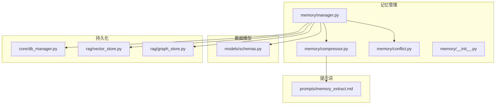
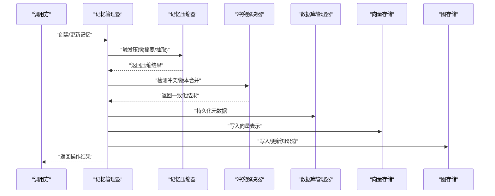
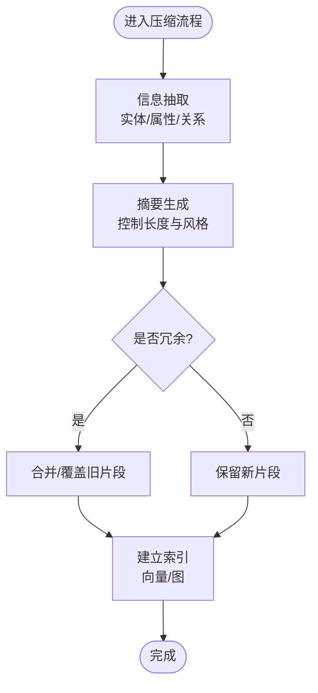
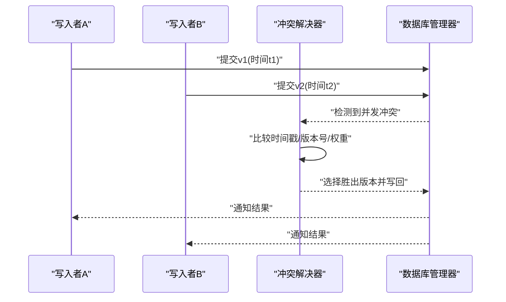
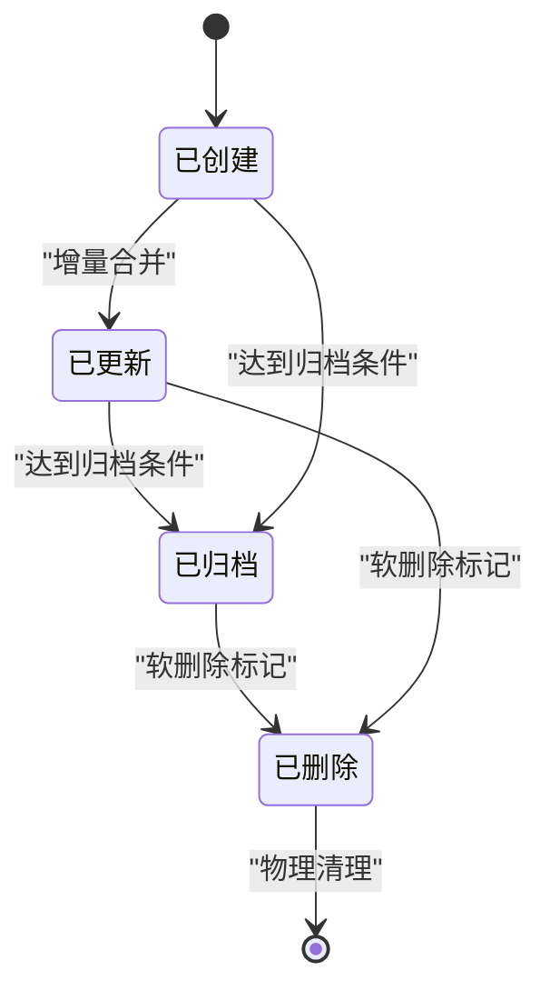
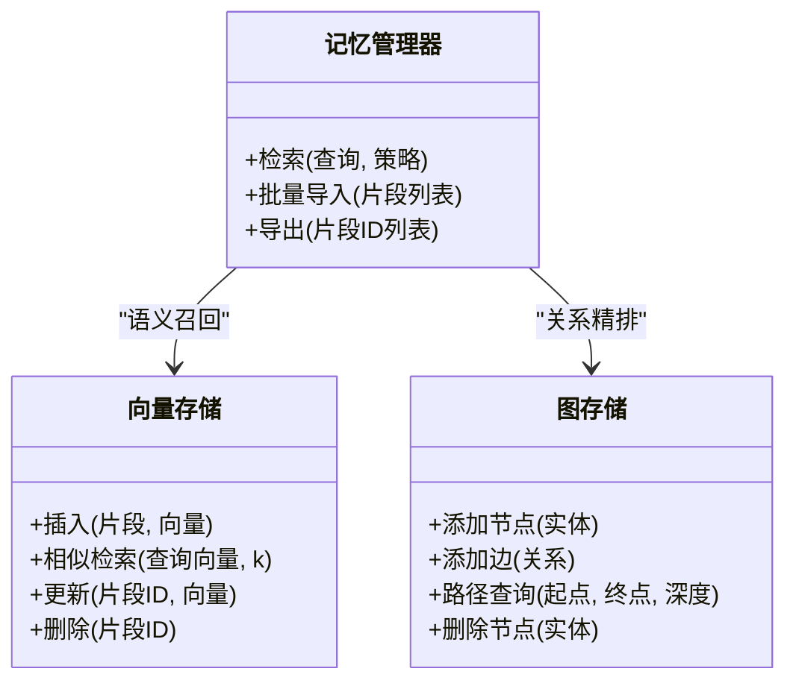
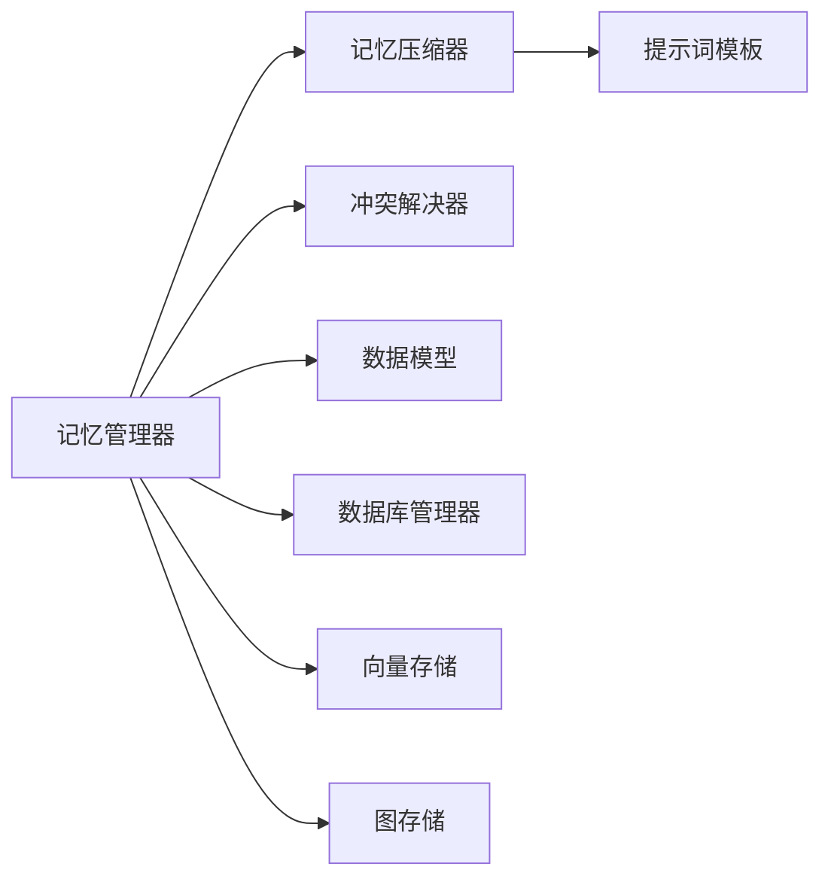

# 记忆管理系统

<cite>
**本文引用的文件**   
- [backend_design/nexus/memory/manager.py](file://backend_design/nexus/memory/manager.py)
- [backend_design/nexus/memory/compressor.py](file://backend_design/nexus/memory/compressor.py)
- [backend_design/nexus/memory/conflict.py](file://backend_design/nexus/memory/conflict.py)
- [backend_design/nexus/memory/__init__.py](file://backend_design/nexus/memory/__init__.py)
- [backend_design/nexus/models/schemas.py](file://backend_design/nexus/models/schemas.py)
- [backend_design/nexus/core/db_manager.py](file://backend_design/nexus/core/db_manager.py)
- [backend_design/nexus/rag/vector_store.py](file://backend_design/nexus/rag/vector_store.py)
- [backend_design/nexus/rag/graph_store.py](file://backend_design/nexus/rag/graph_store.py)
- [backend_design/nexus/prompts/memory_extract.md](file://backend_design/nexus/prompts/memory_extract.md)
</cite>

## 目录
1. [简介](#简介)
2. [项目结构](#项目结构)
3. [核心组件](#核心组件)
4. [架构总览](#架构总览)
5. [详细组件分析](#详细组件分析)
6. [依赖关系分析](#依赖关系分析)
7. [性能考虑](#性能考虑)
8. [故障排查指南](#故障排查指南)
9. [结论](#结论)
10. [附录](#附录)

## 简介
本文件面向NexusCockpit的记忆管理系统，系统性阐述长期记忆的存储架构、条目结构、存储策略与检索机制；深入解析记忆压缩算法（摘要生成、信息提取、冗余消除）；说明冲突解决机制（时间戳管理、版本控制、一致性保证）；覆盖记忆生命周期（创建、更新、删除、归档）；并提供质量评估方法与性能优化实践案例。文档力求在技术深度与可读性之间取得平衡，帮助开发者快速理解并高效扩展记忆系统。

## 项目结构
记忆管理子系统位于后端模块的 memory 目录，围绕“管理器-压缩器-冲突解决”三件套组织，并与模型定义、数据库访问、RAG向量/图存储以及提示词模板协同工作。

图示来源
- [backend_design/nexus/memory/manager.py](file://backend_design/nexus/memory/manager.py)
- [backend_design/nexus/memory/compressor.py](file://backend_design/nexus/memory/compressor.py)
- [backend_design/nexus/memory/conflict.py](file://backend_design/nexus/memory/conflict.py)
- [backend_design/nexus/memory/__init__.py](file://backend_design/nexus/memory/__init__.py)
- [backend_design/nexus/models/schemas.py](file://backend_design/nexus/models/schemas.py)
- [backend_design/nexus/core/db_manager.py](file://backend_design/nexus/core/db_manager.py)
- [backend_design/nexus/rag/vector_store.py](file://backend_design/nexus/rag/vector_store.py)
- [backend_design/nexus/rag/graph_store.py](file://backend_design/nexus/rag/graph_store.py)
- [backend_design/nexus/prompts/memory_extract.md](file://backend_design/nexus/prompts/memory_extract.md)

章节来源
- [backend_design/nexus/memory/manager.py](file://backend_design/nexus/memory/manager.py)
- [backend_design/nexus/memory/compressor.py](file://backend_design/nexus/memory/compressor.py)
- [backend_design/nexus/memory/conflict.py](file://backend_design/nexus/memory/conflict.py)
- [backend_design/nexus/memory/__init__.py](file://backend_design/nexus/memory/__init__.py)
- [backend_design/nexus/models/schemas.py](file://backend_design/nexus/models/schemas.py)
- [backend_design/nexus/core/db_manager.py](file://backend_design/nexus/core/db_manager.py)
- [backend_design/nexus/rag/vector_store.py](file://backend_design/nexus/rag/vector_store.py)
- [backend_design/nexus/rag/graph_store.py](file://backend_design/nexus/rag/graph_store.py)
- [backend_design/nexus/prompts/memory_extract.md](file://backend_design/nexus/prompts/memory_extract.md)

## 核心组件
- 记忆管理器：负责记忆条目的全生命周期编排，协调压缩与冲突解决，统一对外暴露增删改查、检索与归档接口。
- 记忆压缩器：基于提示词进行摘要与信息抽取，执行去重与合并，输出更紧凑且可检索的记忆片段。
- 冲突解决器：处理并发写入、时间戳排序、版本演进与一致性校验，确保多源输入下的最终一致。
- 数据模型：以结构化Schema描述记忆条目字段、索引与约束，支撑上层逻辑与持久化层。
- 持久化与检索：通过数据库管理器对接关系型存储，结合向量/图存储实现语义检索与知识图谱关联。
- 提示词模板：为压缩阶段提供稳定的LLM调用上下文，保障摘要与抽取质量的可控性。

章节来源
- [backend_design/nexus/memory/manager.py](file://backend_design/nexus/memory/manager.py)
- [backend_design/nexus/memory/compressor.py](file://backend_design/nexus/memory/compressor.py)
- [backend_design/nexus/memory/conflict.py](file://backend_design/nexus/memory/conflict.py)
- [backend_design/nexus/models/schemas.py](file://backend_design/nexus/models/schemas.py)
- [backend_design/nexus/core/db_manager.py](file://backend_design/nexus/core/db_manager.py)
- [backend_design/nexus/rag/vector_store.py](file://backend_design/nexus/rag/vector_store.py)
- [backend_design/nexus/rag/graph_store.py](file://backend_design/nexus/rag/graph_store.py)
- [backend_design/nexus/prompts/memory_extract.md](file://backend_design/nexus/prompts/memory_extract.md)

## 架构总览
记忆系统采用“分层+插件化”的设计：管理器作为编排中心，压缩与冲突解决作为能力插件，底层由DB与RAG存储共同承担持久化与检索职责。

图示来源
- [backend_design/nexus/memory/manager.py](file://backend_design/nexus/memory/manager.py)
- [backend_design/nexus/memory/compressor.py](file://backend_design/nexus/memory/compressor.py)
- [backend_design/nexus/memory/conflict.py](file://backend_design/nexus/memory/conflict.py)
- [backend_design/nexus/core/db_manager.py](file://backend_design/nexus/core/db_manager.py)
- [backend_design/nexus/rag/vector_store.py](file://backend_design/nexus/rag/vector_store.py)
- [backend_design/nexus/rag/graph_store.py](file://backend_design/nexus/rag/graph_store.py)

## 详细组件分析

### 记忆条目结构与存储策略
- 条目结构
  - 标识与归属：唯一ID、租户/会话上下文、来源类型、标签体系。
  - 内容维度：原始片段、摘要、关键实体/关系、置信度、权重。
  - 时序与版本：创建时间、更新时间、版本号、状态（活跃/归档/废弃）。
  - 索引与定位：向量ID、图节点/边ID、外部引用。
- 存储策略
  - 结构化元数据落库，便于过滤、统计与审计。
  - 向量表征用于语义相似度检索，支持Top-K召回。
  - 图结构承载实体关系，支持路径查询与推理。
  - 冷热分层：热数据常驻内存/缓存，冷数据归档至低成本存储。

章节来源
- [backend_design/nexus/models/schemas.py](file://backend_design/nexus/models/schemas.py)
- [backend_design/nexus/core/db_manager.py](file://backend_design/nexus/core/db_manager.py)
- [backend_design/nexus/rag/vector_store.py](file://backend_design/nexus/rag/vector_store.py)
- [backend_design/nexus/rag/graph_store.py](file://backend_design/nexus/rag/graph_store.py)

### 记忆压缩算法：摘要生成、信息提取与冗余消除
- 摘要生成
  - 基于提示词模板驱动LLM对长片段进行精炼，保留关键事实与意图。
  - 控制输出长度与风格，适配下游检索与展示需求。
- 信息提取
  - 从对话或事件流中抽取实体、属性与关系，形成结构化片段。
  - 将抽取结果映射到图节点/边，增强可检索性与可解释性。
- 冗余消除
  - 基于相似度阈值与时间衰减进行去重合并。
  - 对重复信息进行幂等更新，避免膨胀。

图示来源
- [backend_design/nexus/memory/compressor.py](file://backend_design/nexus/memory/compressor.py)
- [backend_design/nexus/prompts/memory_extract.md](file://backend_design/nexus/prompts/memory_extract.md)

章节来源
- [backend_design/nexus/memory/compressor.py](file://backend_design/nexus/memory/compressor.py)
- [backend_design/nexus/prompts/memory_extract.md](file://backend_design/nexus/prompts/memory_extract.md)

### 冲突解决机制：时间戳、版本控制与一致性
- 时间戳管理
  - 使用单调递增的时间戳与序列号，避免时钟漂移导致的乱序。
  - 支持跨进程/跨实例的分布式时间源。
- 版本控制
  - 每次变更递增版本号，记录差异快照，支持回溯与对比。
  - 合并策略：按时间优先、权重优先或业务规则决定胜出版本。
- 一致性保证
  - 读写路径引入乐观锁或CAS，失败重试与退避。
  - 事务边界内完成DB与RAG的原子提交，异常回滚。

图示来源
- [backend_design/nexus/memory/conflict.py](file://backend_design/nexus/memory/conflict.py)
- [backend_design/nexus/core/db_manager.py](file://backend_design/nexus/core/db_manager.py)

章节来源
- [backend_design/nexus/memory/conflict.py](file://backend_design/nexus/memory/conflict.py)
- [backend_design/nexus/core/db_manager.py](file://backend_design/nexus/core/db_manager.py)

### 记忆生命周期管理：创建、更新、删除与归档
- 创建
  - 接收原始输入，触发压缩与冲突检测，落库并建立索引。
- 更新
  - 增量合并，保持版本链完整，必要时触发二次压缩。
- 删除
  - 软删除标记，延迟清理，保证审计与回放能力。
- 归档
  - 基于时间/热度阈值迁移至冷存储，释放热资源。

图示来源
- [backend_design/nexus/memory/manager.py](file://backend_design/nexus/memory/manager.py)
- [backend_design/nexus/core/db_manager.py](file://backend_design/nexus/core/db_manager.py)

章节来源
- [backend_design/nexus/memory/manager.py](file://backend_design/nexus/memory/manager.py)
- [backend_design/nexus/core/db_manager.py](file://backend_design/nexus/core/db_manager.py)

### 检索机制：向量与图协同
- 向量检索
  - 基于嵌入相似度召回候选集，结合时间衰减与权重排序。
- 图检索
  - 通过实体/关系进行多跳查询，提升可解释性与精准度。
- 混合检索
  - 向量召回后利用图结构做二次精排，提高命中率与相关性。

图示来源
- [backend_design/nexus/rag/vector_store.py](file://backend_design/nexus/rag/vector_store.py)
- [backend_design/nexus/rag/graph_store.py](file://backend_design/nexus/rag/graph_store.py)
- [backend_design/nexus/memory/manager.py](file://backend_design/nexus/memory/manager.py)

章节来源
- [backend_design/nexus/rag/vector_store.py](file://backend_design/nexus/rag/vector_store.py)
- [backend_design/nexus/rag/graph_store.py](file://backend_design/nexus/rag/graph_store.py)
- [backend_design/nexus/memory/manager.py](file://backend_design/nexus/memory/manager.py)

## 依赖关系分析
- 内部依赖
  - 管理器依赖压缩器与冲突解决器，二者无直接耦合，便于独立替换与测试。
  - 管理器与数据模型强相关，所有持久化与检索均遵循Schema契约。
- 外部依赖
  - 数据库管理器封装SQL/连接池/事务细节。
  - RAG层抽象向量与图存储，屏蔽具体实现差异。
- 潜在循环依赖
  - 当前设计通过接口解耦，未见循环导入风险。

图示来源
- [backend_design/nexus/memory/manager.py](file://backend_design/nexus/memory/manager.py)
- [backend_design/nexus/memory/compressor.py](file://backend_design/nexus/memory/compressor.py)
- [backend_design/nexus/memory/conflict.py](file://backend_design/nexus/memory/conflict.py)
- [backend_design/nexus/models/schemas.py](file://backend_design/nexus/models/schemas.py)
- [backend_design/nexus/core/db_manager.py](file://backend_design/nexus/core/db_manager.py)
- [backend_design/nexus/rag/vector_store.py](file://backend_design/nexus/rag/vector_store.py)
- [backend_design/nexus/rag/graph_store.py](file://backend_design/nexus/rag/graph_store.py)
- [backend_design/nexus/prompts/memory_extract.md](file://backend_design/nexus/prompts/memory_extract.md)

章节来源
- [backend_design/nexus/memory/manager.py](file://backend_design/nexus/memory/manager.py)
- [backend_design/nexus/memory/compressor.py](file://backend_design/nexus/memory/compressor.py)
- [backend_design/nexus/memory/conflict.py](file://backend_design/nexus/memory/conflict.py)
- [backend_design/nexus/models/schemas.py](file://backend_design/nexus/models/schemas.py)
- [backend_design/nexus/core/db_manager.py](file://backend_design/nexus/core/db_manager.py)
- [backend_design/nexus/rag/vector_store.py](file://backend_design/nexus/rag/vector_store.py)
- [backend_design/nexus/rag/graph_store.py](file://backend_design/nexus/rag/graph_store.py)
- [backend_design/nexus/prompts/memory_extract.md](file://backend_design/nexus/prompts/memory_extract.md)

## 性能考虑
- 压缩阶段
  - 批处理与异步流水线，降低LLM调用延迟。
  - 相似度阈值与窗口滑动减少重复计算。
- 冲突解决
  - 乐观锁+指数退避，避免热点行竞争。
  - 时间戳分片与分区表，分散写入压力。
- 检索阶段
  - 向量索引近似最近邻搜索，设置合理k值与召回上限。
  - 图查询限制深度与分支因子，防止爆炸式遍历。
- 存储分层
  - 热数据缓存，冷数据归档，按需加载。
  - 定期重建索引与碎片整理，维持查询稳定。

[本节为通用性能建议，不直接分析具体文件]

## 故障排查指南
- 常见问题
  - 压缩失败：检查提示词模板与LLM可用性，确认输入长度与格式。
  - 冲突频繁：审查时间源与并发写入路径，调整锁粒度与重试策略。
  - 检索不准：校准相似度阈值、权重与时间衰减参数，补充图关系。
- 诊断要点
  - 查看版本链与时间戳，确认是否存在乱序或回退。
  - 核对向量与图索引的一致性，必要时重建索引。
  - 监控DB与RAG层的错误码与耗时，定位瓶颈。

章节来源
- [backend_design/nexus/memory/compressor.py](file://backend_design/nexus/memory/compressor.py)
- [backend_design/nexus/memory/conflict.py](file://backend_design/nexus/memory/conflict.py)
- [backend_design/nexus/core/db_manager.py](file://backend_design/nexus/core/db_manager.py)
- [backend_design/nexus/rag/vector_store.py](file://backend_design/nexus/rag/vector_store.py)
- [backend_design/nexus/rag/graph_store.py](file://backend_design/nexus/rag/graph_store.py)

## 结论
记忆管理系统以管理器为核心，结合压缩与冲突解决两大能力，配合结构化存储与RAG检索，实现了高可用、可扩展的长期记忆方案。通过明确的生命周期管理与质量评估手段，系统在准确性、时效性与成本之间达成良好平衡。后续可在压缩提示词工程、冲突合并策略与检索融合方面持续优化。

[本节为总结性内容，不直接分析具体文件]

## 附录
- 最佳实践
  - 为不同领域定制提示词模板，提升抽取与摘要质量。
  - 建立指标看板：压缩成功率、冲突率、检索准确率、索引大小与延迟。
  - 灰度发布与回滚：新版本先小流量验证，再逐步放量。
- 参考实现路径
  - 记忆管理器入口与编排逻辑
  - 压缩器与提示词模板
  - 冲突解决与版本控制
  - 向量与图存储接口

章节来源
- [backend_design/nexus/memory/manager.py](file://backend_design/nexus/memory/manager.py)
- [backend_design/nexus/memory/compressor.py](file://backend_design/nexus/memory/compressor.py)
- [backend_design/nexus/memory/conflict.py](file://backend_design/nexus/memory/conflict.py)
- [backend_design/nexus/prompts/memory_extract.md](file://backend_design/nexus/prompts/memory_extract.md)
- [backend_design/nexus/rag/vector_store.py](file://backend_design/nexus/rag/vector_store.py)
- [backend_design/nexus/rag/graph_store.py](file://backend_design/nexus/rag/graph_store.py)