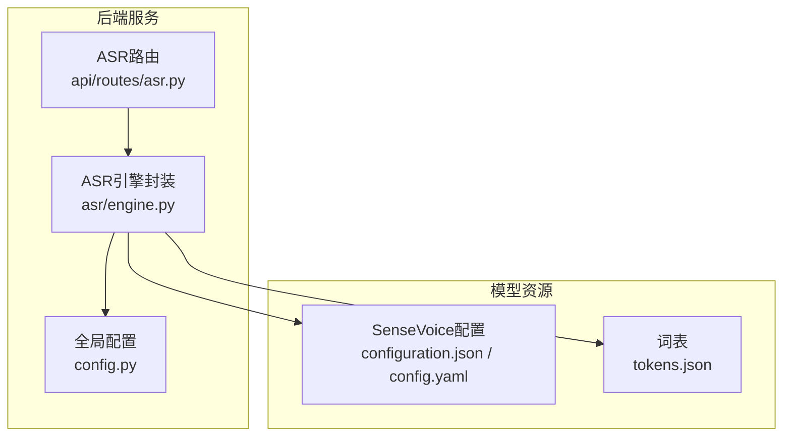
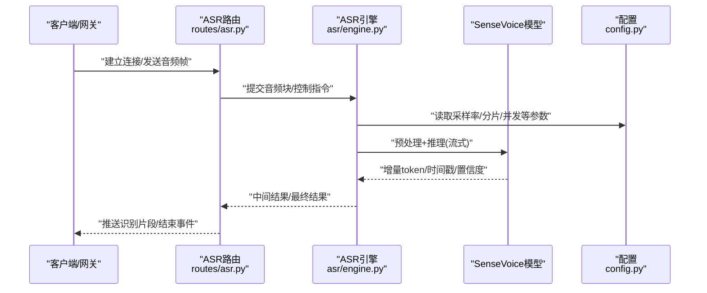
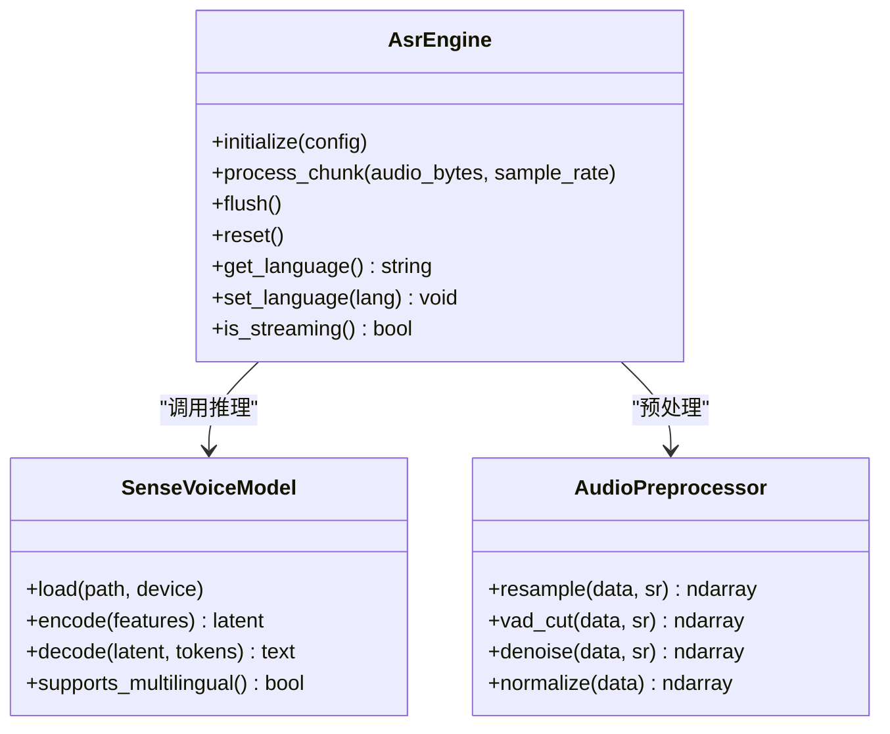
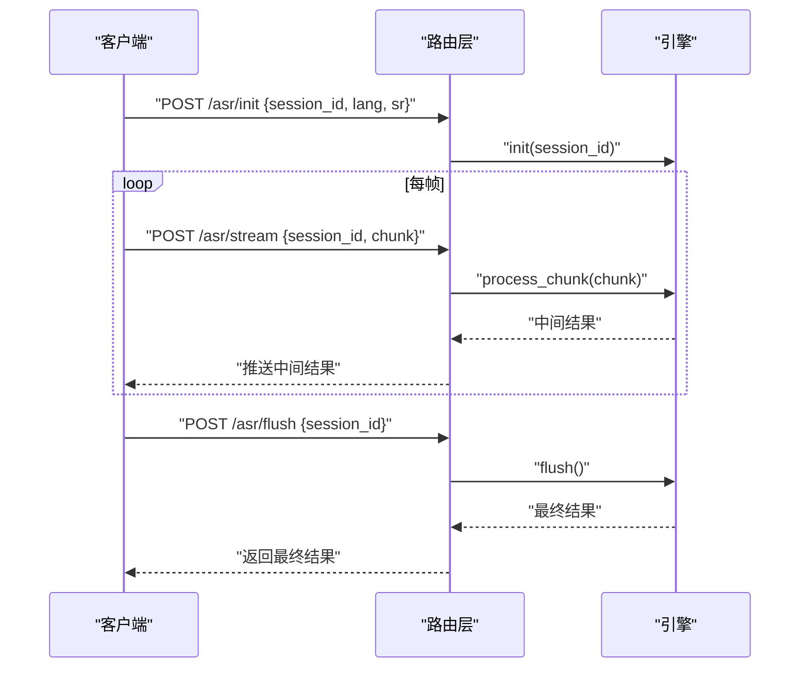
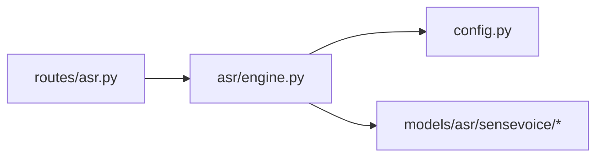
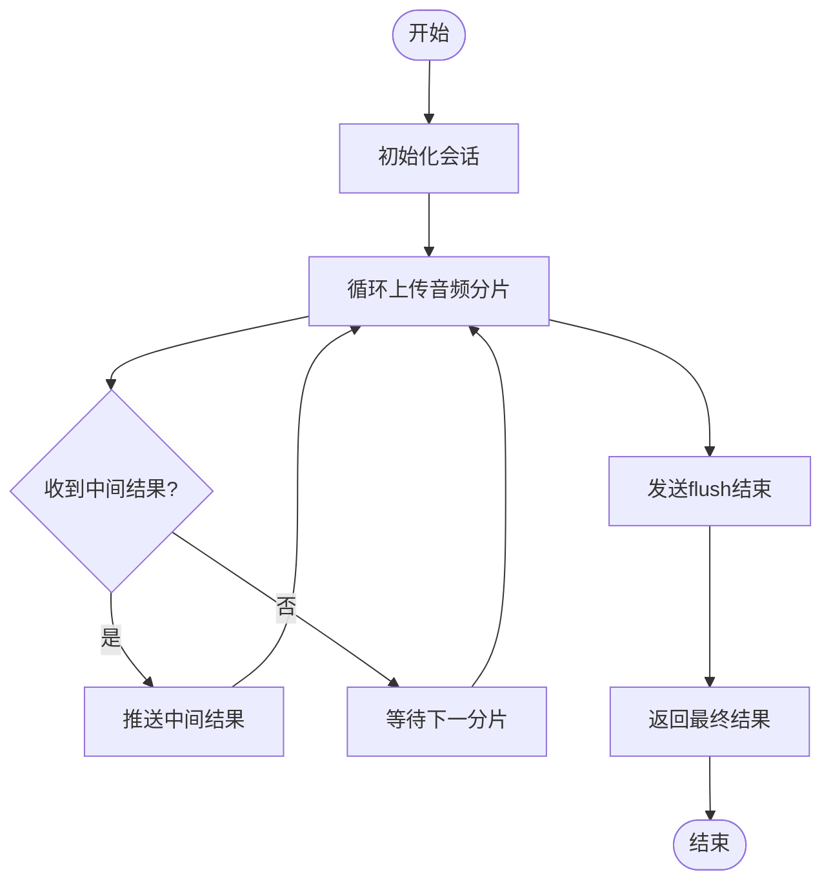

# ASR语音识别引擎

<cite>
**本文引用的文件**   
- [backend_design/nexus/asr/engine.py](file://backend_design/nexus/asr/engine.py)
- [backend_design/nexus/api/routes/asr.py](file://backend_design/nexus/api/routes/asr.py)
- [backend_design/nexus/config.py](file://backend_design/nexus/config.py)
- [models/asr/sensevoice/configuration.json](file://models/asr/sensevoice/configuration.json)
- [models/asr/sensevoice/tokens.json](file://models/asr/sensevoice/tokens.json)
- [models/asr/sensevoice/config.yaml](file://models/asr/sensevoice/config.yaml)
</cite>

## 目录
1. [简介](#简介)
2. [项目结构](#项目结构)
3. [核心组件](#核心组件)
4. [架构总览](#架构总览)
5. [详细组件分析](#详细组件分析)
6. [依赖分析](#依赖分析)
7. [性能考虑](#性能考虑)
8. [故障排查指南](#故障排查指南)
9. [结论](#结论)
10. [附录](#附录)

## 简介
本文件面向NexusCockpit的ASR语音识别子系统，聚焦SenseVoice模型的集成实现与工程化落地。文档覆盖音频预处理、实时流式识别、多语言支持与噪声处理机制；给出配置参数说明（采样率、音频格式、模型路径、性能调优）；提供API调用示例（初始化、音频流处理、结果获取）；并包含错误处理策略、性能优化建议与常见问题解决方案。

## 项目结构
ASR相关代码主要位于后端nexus模块中：
- asr子模块负责推理引擎封装与生命周期管理
- api.routes.asr暴露HTTP/WebSocket接口供前端或网关调用
- models/asr/sensevoice存放SenseVoice模型配置文件与词表等静态资源

图表来源
- [backend_design/nexus/api/routes/asr.py](file://backend_design/nexus/api/routes/asr.py)
- [backend_design/nexus/asr/engine.py](file://backend_design/nexus/asr/engine.py)
- [backend_design/nexus/config.py](file://backend_design/nexus/config.py)
- [models/asr/sensevoice/configuration.json](file://models/asr/sensevoice/configuration.json)
- [models/asr/sensevoice/config.yaml](file://models/asr/sensevoice/config.yaml)
- [models/asr/sensevoice/tokens.json](file://models/asr/sensevoice/tokens.json)

章节来源
- [backend_design/nexus/asr/engine.py](file://backend_design/nexus/asr/engine.py)
- [backend_design/nexus/api/routes/asr.py](file://backend_design/nexus/api/routes/asr.py)
- [backend_design/nexus/config.py](file://backend_design/nexus/config.py)
- [models/asr/sensevoice/configuration.json](file://models/asr/sensevoice/configuration.json)
- [models/asr/sensevoice/config.yaml](file://models/asr/sensevoice/config.yaml)
- [models/asr/sensevoice/tokens.json](file://models/asr/sensevoice/tokens.json)

## 核心组件
- ASR引擎封装（engine.py）
  - 职责：加载SenseVoice模型与词表、维护会话状态、执行音频预处理与推理、输出结构化识别结果
  - 关键能力：流式增量识别、多语言/语种自适应、静音/端点检测、降噪与重采样
- ASR HTTP/WebSocket路由（routes/asr.py）
  - 职责：接收客户端音频帧、转发至引擎、聚合中间/最终结果、返回统一响应格式
- 配置中心（config.py）
  - 职责：集中管理ASR相关配置项（采样率、通道数、分片大小、并发、超时、模型路径等）
- SenseVoice模型资源
  - configuration.json / config.yaml：模型结构与运行参数
  - tokens.json：词表与特殊标记映射

章节来源
- [backend_design/nexus/asr/engine.py](file://backend_design/nexus/asr/engine.py)
- [backend_design/nexus/api/routes/asr.py](file://backend_design/nexus/api/routes/asr.py)
- [backend_design/nexus/config.py](file://backend_design/nexus/config.py)
- [models/asr/sensevoice/configuration.json](file://models/asr/sensevoice/configuration.json)
- [models/asr/sensevoice/config.yaml](file://models/asr/sensevoice/config.yaml)
- [models/asr/sensevoice/tokens.json](file://models/asr/sensevoice/tokens.json)

## 架构总览
整体数据流从客户端到引擎再到模型资源，支持流式增量返回与最终结果落盘/回传。

图表来源
- [backend_design/nexus/api/routes/asr.py](file://backend_design/nexus/api/routes/asr.py)
- [backend_design/nexus/asr/engine.py](file://backend_design/nexus/asr/engine.py)
- [backend_design/nexus/config.py](file://backend_design/nexus/config.py)

## 详细组件分析

### ASR引擎（SenseVoice集成）
- 初始化与加载
  - 从配置读取模型路径、设备、精度、线程/进程池大小
  - 加载SenseVoice权重与tokens.json，构建编码器/解码器上下文
- 音频预处理
  - 重采样至目标采样率（如16k/24k），单声道转换，归一化幅度
  - 可选VAD/静音裁剪、预加重、分帧加窗、特征提取（依据SenseVoice要求）
- 流式识别
  - 按固定时长切片累积，增量解码，合并重复与标点恢复
  - 支持多语言/语种自适应，自动选择最佳语言分支
- 噪声处理
  - 频域降噪/谱减法、增益控制、动态范围压缩
  - 结合VAD抑制非语音段，降低误触发
- 结果输出
  - 中间结果：文本片段、起止时间戳、置信度、语言标签
  - 最终结果：完整文本、分段对齐、备选候选

图表来源
- [backend_design/nexus/asr/engine.py](file://backend_design/nexus/asr/engine.py)
- [models/asr/sensevoice/configuration.json](file://models/asr/sensevoice/configuration.json)
- [models/asr/sensevoice/tokens.json](file://models/asr/sensevoice/tokens.json)

章节来源
- [backend_design/nexus/asr/engine.py](file://backend_design/nexus/asr/engine.py)
- [models/asr/sensevoice/configuration.json](file://models/asr/sensevoice/configuration.json)
- [models/asr/sensevoice/tokens.json](file://models/asr/sensevoice/tokens.json)

### ASR路由（HTTP/WebSocket）
- 接口设计
  - 初始化：创建/复用引擎实例，绑定会话ID
  - 流式上传：客户端持续发送PCM/WAV分片，服务端累积并触发增量识别
  - 结束：发送结束标志，触发flush，返回最终结果
- 协议要点
  - 请求头：内容类型、采样率、语言偏好、是否开启降噪
  - 响应体：中间结果（增量文本）、最终结果（完整文本+时间戳）
- 错误与重试
  - 网络异常、模型加载失败、音频格式不合法、超时等统一错误码
  - 支持断线重连与会话恢复

图表来源
- [backend_design/nexus/api/routes/asr.py](file://backend_design/nexus/api/routes/asr.py)
- [backend_design/nexus/asr/engine.py](file://backend_design/nexus/asr/engine.py)

章节来源
- [backend_design/nexus/api/routes/asr.py](file://backend_design/nexus/api/routes/asr.py)
- [backend_design/nexus/asr/engine.py](file://backend_design/nexus/asr/engine.py)

### 配置与模型资源
- 配置项（来自config.py与模型配置）
  - 采样率：16000/24000（需与SenseVoice训练一致）
  - 通道数：1（单声道）
  - 分片时长：毫秒级（影响延迟与吞吐）
  - 并发：线程/进程池大小
  - 模型路径：指向models/asr/sensevoice
  - 语言：auto/zh/en/ja/ko等
  - 降噪开关与强度
  - 超时：单次推理/会话超时
- 模型资源
  - configuration.json / config.yaml：模型结构、注意力头数、层数、量化选项
  - tokens.json：词表、特殊标记（开始/结束/未知/语言标记）

章节来源
- [backend_design/nexus/config.py](file://backend_design/nexus/config.py)
- [models/asr/sensevoice/configuration.json](file://models/asr/sensevoice/configuration.json)
- [models/asr/sensevoice/config.yaml](file://models/asr/sensevoice/config.yaml)
- [models/asr/sensevoice/tokens.json](file://models/asr/sensevoice/tokens.json)

## 依赖分析
- 内部依赖
  - routes/asr.py 依赖 asr/engine.py 提供的引擎接口
  - engine.py 依赖 config.py 的配置与 models/asr/sensevoice 的资源
- 外部依赖
  - 音频编解码库（用于WAV/PCM解析）
  - 数值计算与张量库（根据SenseVoice实现）
  - 可选：CUDA/cuDNN加速、ONNX Runtime/TensorRT（若启用）

图表来源
- [backend_design/nexus/api/routes/asr.py](file://backend_design/nexus/api/routes/asr.py)
- [backend_design/nexus/asr/engine.py](file://backend_design/nexus/asr/engine.py)
- [backend_design/nexus/config.py](file://backend_design/nexus/config.py)
- [models/asr/sensevoice/configuration.json](file://models/asr/sensevoice/configuration.json)
- [models/asr/sensevoice/config.yaml](file://models/asr/sensevoice/config.yaml)
- [models/asr/sensevoice/tokens.json](file://models/asr/sensevoice/tokens.json)

章节来源
- [backend_design/nexus/api/routes/asr.py](file://backend_design/nexus/api/routes/asr.py)
- [backend_design/nexus/asr/engine.py](file://backend_design/nexus/asr/engine.py)
- [backend_design/nexus/config.py](file://backend_design/nexus/config.py)
- [models/asr/sensevoice/configuration.json](file://models/asr/sensevoice/configuration.json)
- [models/asr/sensevoice/config.yaml](file://models/asr/sensevoice/config.yaml)
- [models/asr/sensevoice/tokens.json](file://models/asr/sensevoice/tokens.json)

## 性能考虑
- 采样率与分片
  - 推荐16kHz，分片时长在200~500ms间平衡延迟与稳定性
- 并发与批处理
  - 合理设置线程/进程池大小，避免CPU/GPU争用
- 内存与缓存
  - 重用模型上下文，避免频繁加载
  - 对高频短语进行轻量缓存（注意一致性）
- I/O与序列化
  - 使用零拷贝或共享内存传输大数组
  - 减少JSON序列化开销，必要时采用二进制协议
- 硬件加速
  - 启用GPU/专用推理后端，量化与剪枝按需开启

[本节为通用指导，无需特定文件引用]

## 故障排查指南
- 常见错误
  - 模型路径不存在或权限不足：检查配置中的模型路径与挂载卷
  - 采样率不匹配：确认客户端与配置一致，必要时在服务端重采样
  - 音频格式不支持：仅接受PCM/WAV，其他格式先转码
  - 超时/卡顿：增大分片时长或提升并发，检查CPU/GPU占用
- 定位方法
  - 查看路由层日志与引擎层日志，核对输入chunk长度与sr
  - 打印tokens.json长度与特殊标记，确保词表加载成功
  - 使用最小可复现音频样本验证端到端链路

章节来源
- [backend_design/nexus/api/routes/asr.py](file://backend_design/nexus/api/routes/asr.py)
- [backend_design/nexus/asr/engine.py](file://backend_design/nexus/asr/engine.py)
- [models/asr/sensevoice/tokens.json](file://models/asr/sensevoice/tokens.json)

## 结论
本ASR引擎以SenseVoice为核心，通过统一的引擎封装与路由层，实现了低延迟、可扩展的流式语音识别能力。配合合理的配置与优化策略，可在多语言与噪声环境下稳定工作。建议在生产环境完善监控与告警，持续跟踪延迟与准确率指标。

[本节为总结性内容，无需特定文件引用]

## 附录

### API调用示例（概念流程）
- 初始化
  - 请求：POST /asr/init，携带session_id、lang、sr
  - 响应：{status: ok, session_id}
- 流式上传
  - 请求：POST /asr/stream，携带session_id、audio_chunk
  - 响应：{type: interim, text, start_ms, end_ms, confidence}
- 结束与最终结果
  - 请求：POST /asr/flush，携带session_id
  - 响应：{type: final, text, segments, language}

[此图为概念流程示意，无需特定文件引用]