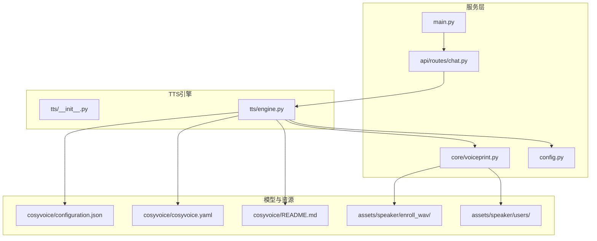
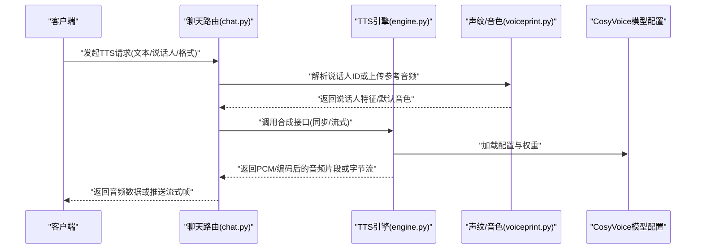
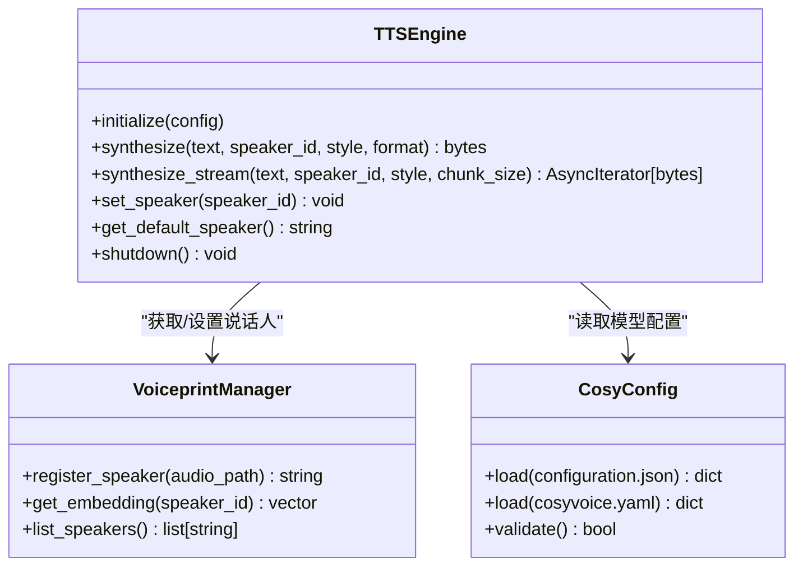
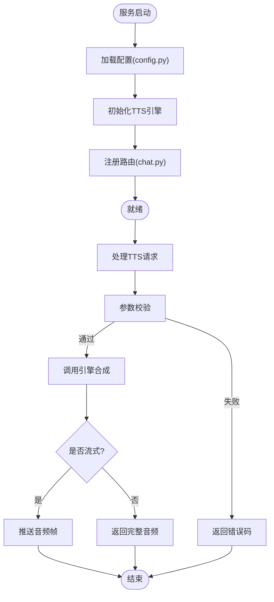
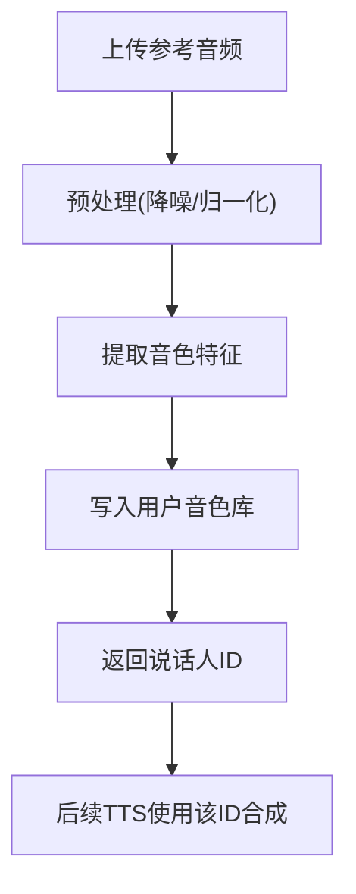
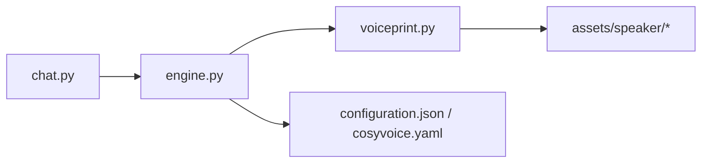

# TTS语音合成引擎

<cite>
**本文引用的文件**   
- [backend_design/nexus/tts/engine.py](file://backend_design/nexus/tts/engine.py)
- [backend_design/nexus/tts/__init__.py](file://backend_design/nexus/tts/__init__.py)
- [backend_design/nexus/api/routes/chat.py](file://backend_design/nexus/api/routes/chat.py)
- [models/tts/cosyvoice/configuration.json](file://models/tts/cosyvoice/configuration.json)
- [models/tts/cosyvoice/cosyvoice.yaml](file://models/tts/cosyvoice/cosyvoice.yaml)
- [models/tts/cosyvoice/README.md](file://models/tts/cosyvoice/README.md)
- [assets/speaker/enroll_wav/README.md](file://assets/speaker/enroll_wav/README.md)
- [assets/speaker/users/README.md](file://assets/speaker/users/README.md)
- [backend_design/nexus/core/voiceprint.py](file://backend_design/nexus/core/voiceprint.py)
- [backend_design/nexus/config.py](file://backend_design/nexus/config.py)
- [backend_design/nexus/main.py](file://backend_design/nexus/main.py)
</cite>

## 目录
1. [简介](#简介)
2. [项目结构](#项目结构)
3. [核心组件](#核心组件)
4. [架构总览](#架构总览)
5. [详细组件分析](#详细组件分析)
6. [依赖关系分析](#依赖关系分析)
7. [性能与延迟优化](#性能与延迟优化)
8. [API使用示例](#api使用示例)
9. [故障排查指南](#故障排查指南)
10. [结论](#结论)
11. [附录](#附录)

## 简介
本文件面向NexusCockpit的TTS语音合成子系统，聚焦于CosyVoice模型的集成与工程化落地。文档覆盖以下方面：
- 高质量语音合成、情感表达与多说话人切换能力
- 音频生成流程、音质配置参数（采样率、比特率、格式）
- 延迟优化技术（流式合成、预取、缓存）
- API使用示例（文本转语音、流式合成、个性化声音定制）
- 性能调优、内存管理与并发处理最佳实践

## 项目结构
TTS相关代码位于后端Python服务中，模型与资源分别存放于独立目录：
- 引擎实现：backend_design/nexus/tts
- 模型配置与说明：models/tts/cosyvoice
- 音色注册与用户音色库：assets/speaker
- 声纹与音色管理：backend_design/nexus/core/voiceprint.py
- 路由与服务入口：backend_design/nexus/api/routes/chat.py, backend_design/nexus/main.py

图表来源
- [backend_design/nexus/tts/engine.py](file://backend_design/nexus/tts/engine.py)
- [backend_design/nexus/tts/__init__.py](file://backend_design/nexus/tts/__init__.py)
- [models/tts/cosyvoice/configuration.json](file://models/tts/cosyvoice/configuration.json)
- [models/tts/cosyvoice/cosyvoice.yaml](file://models/tts/cosyvoice/cosyvoice.yaml)
- [models/tts/cosyvoice/README.md](file://models/tts/cosyvoice/README.md)
- [assets/speaker/enroll_wav/README.md](file://assets/speaker/enroll_wav/README.md)
- [assets/speaker/users/README.md](file://assets/speaker/users/README.md)
- [backend_design/nexus/core/voiceprint.py](file://backend_design/nexus/core/voiceprint.py)
- [backend_design/nexus/config.py](file://backend_design/nexus/config.py)
- [backend_design/nexus/main.py](file://backend_design/nexus/main.py)

章节来源
- [backend_design/nexus/tts/engine.py](file://backend_design/nexus/tts/engine.py)
- [backend_design/nexus/tts/__init__.py](file://backend_design/nexus/tts/__init__.py)
- [backend_design/nexus/api/routes/chat.py](file://backend_design/nexus/api/routes/chat.py)
- [backend_design/nexus/main.py](file://backend_design/nexus/main.py)
- [backend_design/nexus/config.py](file://backend_design/nexus/config.py)
- [models/tts/cosyvoice/configuration.json](file://models/tts/cosyvoice/configuration.json)
- [models/tts/cosyvoice/cosyvoice.yaml](file://models/tts/cosyvoice/cosyvoice.yaml)
- [models/tts/cosyvoice/README.md](file://models/tts/cosyvoice/README.md)
- [assets/speaker/enroll_wav/README.md](file://assets/speaker/enroll_wav/README.md)
- [assets/speaker/users/README.md](file://assets/speaker/users/README.md)
- [backend_design/nexus/core/voiceprint.py](file://backend_design/nexus/core/voiceprint.py)

## 核心组件
- TTS引擎模块
  - 负责加载CosyVoice模型与配置，提供文本到音频的同步/异步接口，支持流式输出与说话人选择。
  - 关键职责：模型初始化、推理调度、音频后处理（重采样/编码）、错误与异常处理、资源清理。
- 音色与声纹管理
  - 提供说话人注册、音色特征提取与检索，支撑多说话人与个性化声音定制。
- 路由与服务
  - 暴露HTTP/WebSocket接口，将上层请求转发至TTS引擎，并处理流式响应与鉴权等横切关注点。
- 配置与启动
  - 集中管理TTS相关配置项（设备、线程池、模型路径、音频参数），在应用启动时注入到引擎。

章节来源
- [backend_design/nexus/tts/engine.py](file://backend_design/nexus/tts/engine.py)
- [backend_design/nexus/tts/__init__.py](file://backend_design/nexus/tts/__init__.py)
- [backend_design/nexus/core/voiceprint.py](file://backend_design/nexus/core/voiceprint.py)
- [backend_design/nexus/api/routes/chat.py](file://backend_design/nexus/api/routes/chat.py)
- [backend_design/nexus/config.py](file://backend_design/nexus/config.py)
- [backend_design/nexus/main.py](file://backend_design/nexus/main.py)

## 架构总览
下图展示了从请求进入服务到音频输出的端到端流程，包括流式与非流式两种路径。

图表来源
- [backend_design/nexus/api/routes/chat.py](file://backend_design/nexus/api/routes/chat.py)
- [backend_design/nexus/tts/engine.py](file://backend_design/nexus/tts/engine.py)
- [backend_design/nexus/core/voiceprint.py](file://backend_design/nexus/core/voiceprint.py)
- [models/tts/cosyvoice/configuration.json](file://models/tts/cosyvoice/configuration.json)
- [models/tts/cosyvoice/cosyvoice.yaml](file://models/tts/cosyvoice/cosyvoice.yaml)

## 详细组件分析

### TTS引擎（engine.py）
- 功能要点
  - 模型加载：根据configuration.json与cosyvoice.yaml初始化CosyVoice推理上下文。
  - 合成接口：提供同步与流式两种模式；支持指定说话人、情感风格与音频格式。
  - 音频后处理：按配置进行重采样、位深转换与封装（如PCM/WAV）。
  - 资源管理：线程/进程隔离、显存占用控制、超时与取消机制。
- 关键设计
  - 单例/懒加载：避免重复加载模型，降低冷启动开销。
  - 可插拔编码器：通过配置切换不同音频格式与质量。
  - 错误边界：对输入校验、模型异常、IO异常进行分类处理与重试策略。

图表来源
- [backend_design/nexus/tts/engine.py](file://backend_design/nexus/tts/engine.py)
- [backend_design/nexus/core/voiceprint.py](file://backend_design/nexus/core/voiceprint.py)
- [models/tts/cosyvoice/configuration.json](file://models/tts/cosyvoice/configuration.json)
- [models/tts/cosyvoice/cosyvoice.yaml](file://models/tts/cosyvoice/cosyvoice.yaml)

章节来源
- [backend_design/nexus/tts/engine.py](file://backend_design/nexus/tts/engine.py)
- [backend_design/nexus/core/voiceprint.py](file://backend_design/nexus/core/voiceprint.py)
- [models/tts/cosyvoice/configuration.json](file://models/tts/cosyvoice/configuration.json)
- [models/tts/cosyvoice/cosyvoice.yaml](file://models/tts/cosyvoice/cosyvoice.yaml)

### 路由与服务（chat.py / main.py）
- 路由职责
  - 接收前端请求，校验参数（文本长度、说话人ID、目标格式）。
  - 调用TTS引擎执行合成，返回二进制音频或流式帧。
  - 处理鉴权、限流、日志与指标上报。
- 启动流程
  - 应用启动时加载全局配置，初始化TTS引擎与声纹管理器。
  - 注册路由与中间件，准备WebSocket通道用于流式传输。

图表来源
- [backend_design/nexus/api/routes/chat.py](file://backend_design/nexus/api/routes/chat.py)
- [backend_design/nexus/main.py](file://backend_design/nexus/main.py)
- [backend_design/nexus/config.py](file://backend_design/nexus/config.py)

章节来源
- [backend_design/nexus/api/routes/chat.py](file://backend_design/nexus/api/routes/chat.py)
- [backend_design/nexus/main.py](file://backend_design/nexus/main.py)
- [backend_design/nexus/config.py](file://backend_design/nexus/config.py)

### 音色与声纹（voiceprint.py）
- 功能要点
  - 说话人注册：上传参考音频，提取音色特征并持久化。
  - 音色检索：根据ID或相似度匹配返回对应说话人特征。
  - 多说话人管理：维护本地音色库，支持动态切换。
- 存储位置
  - 参考音频与用户音色文件位于assets/speaker目录。

图表来源
- [backend_design/nexus/core/voiceprint.py](file://backend_design/nexus/core/voiceprint.py)
- [assets/speaker/enroll_wav/README.md](file://assets/speaker/enroll_wav/README.md)
- [assets/speaker/users/README.md](file://assets/speaker/users/README.md)

章节来源
- [backend_design/nexus/core/voiceprint.py](file://backend_design/nexus/core/voiceprint.py)
- [assets/speaker/enroll_wav/README.md](file://assets/speaker/enroll_wav/README.md)
- [assets/speaker/users/README.md](file://assets/speaker/users/README.md)

### CosyVoice模型配置（configuration.json / cosyvoice.yaml / README.md）
- 作用
  - 定义模型权重路径、推理参数、音频采样率、量化与加速选项。
  - 提供模型使用说明与注意事项。
- 关键项
  - 采样率、比特深度、编码格式、分块大小、最大并发、显存阈值等。

章节来源
- [models/tts/cosyvoice/configuration.json](file://models/tts/cosyvoice/configuration.json)
- [models/tts/cosyvoice/cosyvoice.yaml](file://models/tts/cosyvoice/cosyvoice.yaml)
- [models/tts/cosyvoice/README.md](file://models/tts/cosyvoice/README.md)

## 依赖关系分析
- 内部依赖
  - 路由层依赖TTS引擎与声纹管理。
  - TTS引擎依赖模型配置与音频后处理工具。
  - 声纹管理依赖本地音色库与可选的外部嵌入模型。
- 外部依赖
  - CosyVoice推理框架与依赖库（由模型配置与README指引）。
  - 音频编解码库（由配置决定具体格式）。

图表来源
- [backend_design/nexus/api/routes/chat.py](file://backend_design/nexus/api/routes/chat.py)
- [backend_design/nexus/tts/engine.py](file://backend_design/nexus/tts/engine.py)
- [backend_design/nexus/core/voiceprint.py](file://backend_design/nexus/core/voiceprint.py)
- [models/tts/cosyvoice/configuration.json](file://models/tts/cosyvoice/configuration.json)
- [models/tts/cosyvoice/cosyvoice.yaml](file://models/tts/cosyvoice/cosyvoice.yaml)

章节来源
- [backend_design/nexus/api/routes/chat.py](file://backend_design/nexus/api/routes/chat.py)
- [backend_design/nexus/tts/engine.py](file://backend_design/nexus/tts/engine.py)
- [backend_design/nexus/core/voiceprint.py](file://backend_design/nexus/core/voiceprint.py)
- [models/tts/cosyvoice/configuration.json](file://models/tts/cosyvoice/configuration.json)
- [models/tts/cosyvoice/cosyvoice.yaml](file://models/tts/cosyvoice/cosyvoice.yaml)

## 性能与延迟优化
- 模型与推理
  - 启用量化与图优化（依据模型README与配置项）。
  - 预热模型与缓存常用说话人特征，减少首次请求延迟。
- 流式合成
  - 采用分块生成与边推边播，降低首包延迟。
  - 合理设置chunk_size以平衡吞吐与时延。
- 并发与资源
  - 限制并发推理数，避免显存溢出。
  - 使用连接池与对象复用，减少GC压力。
- 音频后处理
  - 按需重采样与编码，避免不必要的格式转换。
  - 使用零拷贝或内存映射提升I/O效率。
- 监控与回退
  - 记录关键指标（TTFT、PPS、GPU利用率）。
  - 当负载过高时降级为低质量模式或排队等待。

[本节为通用指导，不直接分析具体文件]

## API使用示例
以下为常见用法的路径指引与参数说明，实际字段以路由与引擎实现为准：
- 文本转语音（同步）
  - 请求：包含文本、说话人ID、目标格式（如wav/mp3）、采样率。
  - 响应：二进制音频数据。
  - 参考路径：[backend_design/nexus/api/routes/chat.py](file://backend_design/nexus/api/routes/chat.py)
- 流式合成（WebSocket或Server-Sent Events）
  - 请求：建立长连接，发送文本与说话人信息。
  - 响应：按chunk推送音频帧，直到完成。
  - 参考路径：[backend_design/nexus/api/routes/chat.py](file://backend_design/nexus/api/routes/chat.py)
- 个性化声音定制
  - 步骤：上传参考音频 -> 注册说话人 -> 获取说话人ID -> 使用该ID进行合成。
  - 参考路径：
    - [backend_design/nexus/core/voiceprint.py](file://backend_design/nexus/core/voiceprint.py)
    - [assets/speaker/enroll_wav/README.md](file://assets/speaker/enroll_wav/README.md)
    - [assets/speaker/users/README.md](file://assets/speaker/users/README.md)
- 音质配置
  - 调整采样率、比特率、格式与分块大小。
  - 参考路径：
    - [models/tts/cosyvoice/configuration.json](file://models/tts/cosyvoice/configuration.json)
    - [models/tts/cosyvoice/cosyvoice.yaml](file://models/tts/cosyvoice/cosyvoice.yaml)
    - [models/tts/cosyvoice/README.md](file://models/tts/cosyvoice/README.md)

章节来源
- [backend_design/nexus/api/routes/chat.py](file://backend_design/nexus/api/routes/chat.py)
- [backend_design/nexus/core/voiceprint.py](file://backend_design/nexus/core/voiceprint.py)
- [models/tts/cosyvoice/configuration.json](file://models/tts/cosyvoice/configuration.json)
- [models/tts/cosyvoice/cosyvoice.yaml](file://models/tts/cosyvoice/cosyvoice.yaml)
- [models/tts/cosyvoice/README.md](file://models/tts/cosyvoice/README.md)
- [assets/speaker/enroll_wav/README.md](file://assets/speaker/enroll_wav/README.md)
- [assets/speaker/users/README.md](file://assets/speaker/users/README.md)

## 故障排查指南
- 常见问题
  - 模型加载失败：检查模型路径与配置文件完整性。
  - 显存不足：降低并发、减小batch或启用量化。
  - 音频播放异常：确认采样率与格式一致，避免重采样错误。
  - 流式卡顿：增大chunk_size或优化网络缓冲。
- 定位方法
  - 查看路由与引擎日志，定位异常堆栈。
  - 监控GPU/CPU与内存指标，识别瓶颈。
  - 使用最小复现用例验证问题范围。
- 恢复策略
  - 自动重试与熔断，避免雪崩。
  - 快速回退到低质量模式或队列等待。

章节来源
- [backend_design/nexus/api/routes/chat.py](file://backend_design/nexus/api/routes/chat.py)
- [backend_design/nexus/tts/engine.py](file://backend_design/nexus/tts/engine.py)
- [backend_design/nexus/config.py](file://backend_design/nexus/config.py)

## 结论
本引擎基于CosyVoice实现了高质量的中文语音合成，支持情感表达与多说话人切换。通过流式合成、并发控制与音频后处理优化，可在保证音质的同时显著降低延迟。建议在生产环境结合监控与熔断策略，持续优化性能与稳定性。

[本节为总结性内容，不直接分析具体文件]

## 附录
- 术语
  - TTFT：首Token时间（此处为首帧音频到达时间）
  - PPS：每秒生成样本数
  - Chunk：流式合成的音频分块
- 最佳实践清单
  - 预热模型与说话人特征
  - 合理设置并发与chunk_size
  - 统一音频格式与采样率
  - 完善日志与指标采集
  - 定期评估模型更新与量化收益

[本节为补充信息，不直接分析具体文件]