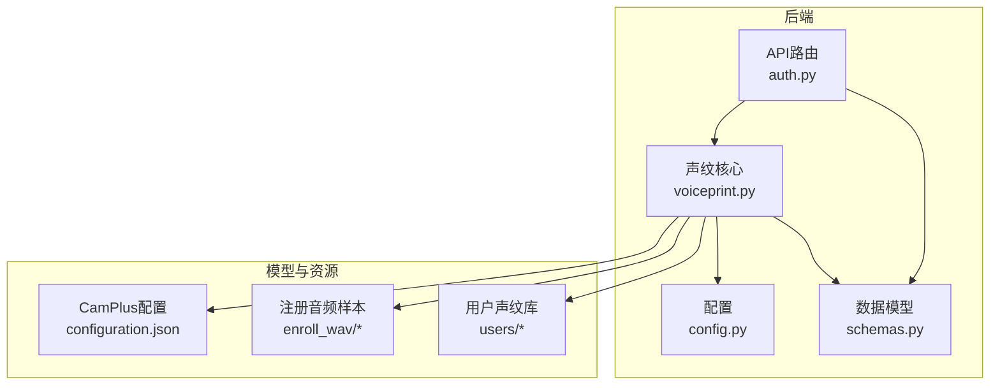
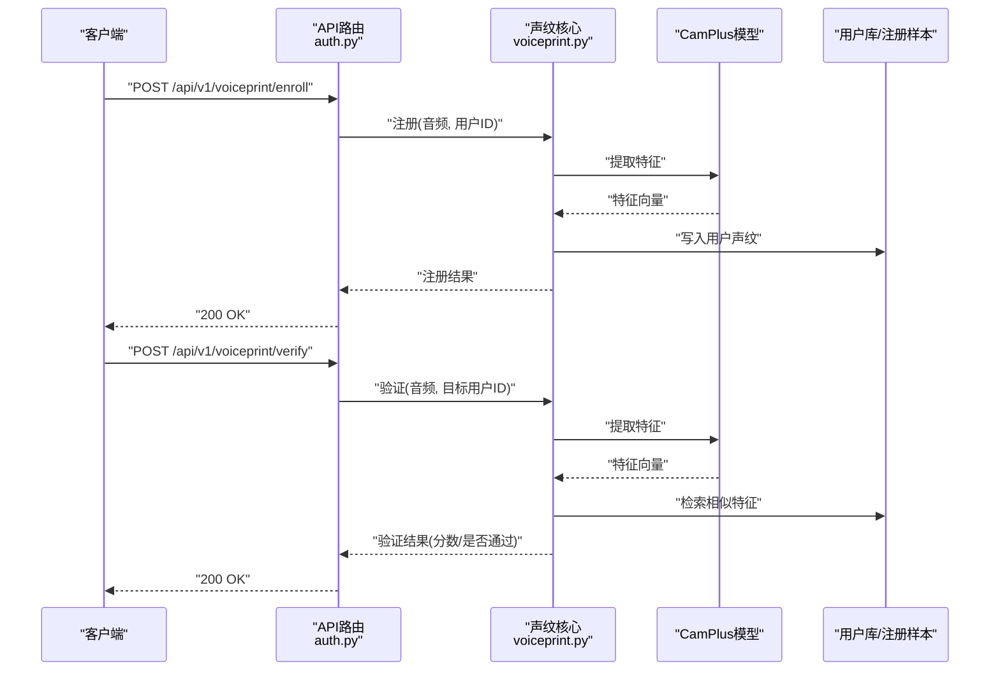
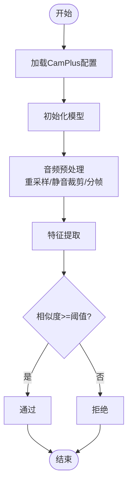
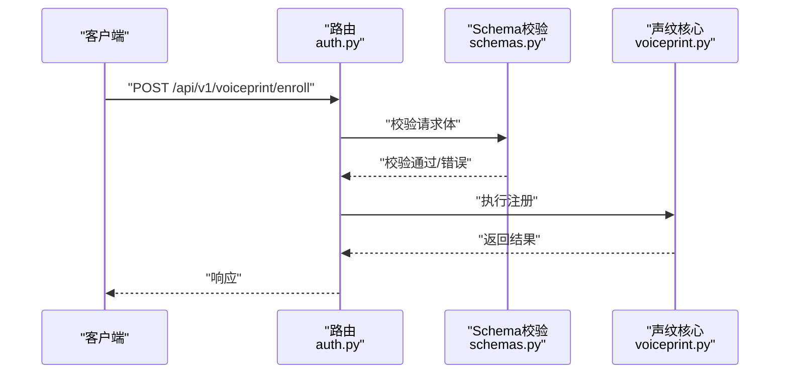
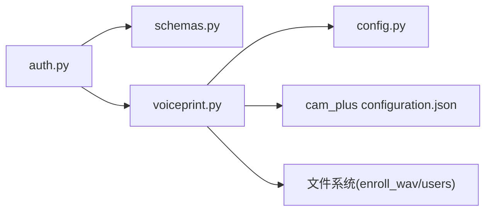

# 声纹识别系统

<cite>
**本文引用的文件**   
- [backend_design/nexus/core/voiceprint.py](file://backend_design/nexus/core/voiceprint.py)
- [backend_design/nexus/api/routes/auth.py](file://backend_design/nexus/api/routes/auth.py)
- [backend_design/nexus/models/schemas.py](file://backend_design/nexus/models/schemas.py)
- [backend_design/nexus/config.py](file://backend_design/nexus/config.py)
- [models/sv/cam_plus/configuration.json](file://models/sv/cam_plus/configuration.json)
- [assets/speaker/enroll_wav/README.md](file://assets/speaker/enroll_wav/README.md)
- [assets/speaker/users/README.md](file://assets/speaker/users/README.md)
</cite>

## 目录
1. [简介](#简介)
2. [项目结构](#项目结构)
3. [核心组件](#核心组件)
4. [架构总览](#架构总览)
5. [详细组件分析](#详细组件分析)
6. [依赖关系分析](#依赖关系分析)
7. [性能考虑](#性能考虑)
8. [故障排查指南](#故障排查指南)
9. [结论](#结论)
10. [附录](#附录)

## 简介
本文件面向NexusCockpit的声纹识别子系统，聚焦于CamPlus声纹识别模型的集成实现。文档覆盖用户声纹注册、身份验证与个性化服务匹配流程；阐述特征提取算法、相似度计算与阈值配置；提供完整的API接口说明（含请求/响应示例路径）；并给出安全与隐私保护建议以及性能优化策略。

## 项目结构
与声纹识别相关的代码与资源主要分布在以下位置：
- 后端核心逻辑：backend_design/nexus/core/voiceprint.py
- API路由与鉴权：backend_design/nexus/api/routes/auth.py
- 数据模型与Schema：backend_design/nexus/models/schemas.py
- 全局配置：backend_design/nexus/config.py
- CamPlus模型配置：models/sv/cam_plus/configuration.json
- 声纹样本与用户库资源：assets/speaker/enroll_wav/, assets/speaker/users/

图示来源
- [backend_design/nexus/api/routes/auth.py](file://backend_design/nexus/api/routes/auth.py)
- [backend_design/nexus/core/voiceprint.py](file://backend_design/nexus/core/voiceprint.py)
- [backend_design/nexus/config.py](file://backend_design/nexus/config.py)
- [backend_design/nexus/models/schemas.py](file://backend_design/nexus/models/schemas.py)
- [models/sv/cam_plus/configuration.json](file://models/sv/cam_plus/configuration.json)
- [assets/speaker/enroll_wav/README.md](file://assets/speaker/enroll_wav/README.md)
- [assets/speaker/users/README.md](file://assets/speaker/users/README.md)

章节来源
- [backend_design/nexus/core/voiceprint.py](file://backend_design/nexus/core/voiceprint.py)
- [backend_design/nexus/api/routes/auth.py](file://backend_design/nexus/api/routes/auth.py)
- [backend_design/nexus/models/schemas.py](file://backend_design/nexus/models/schemas.py)
- [backend_design/nexus/config.py](file://backend_design/nexus/config.py)
- [models/sv/cam_plus/configuration.json](file://models/sv/cam_plus/configuration.json)
- [assets/speaker/enroll_wav/README.md](file://assets/speaker/enroll_wav/README.md)
- [assets/speaker/users/README.md](file://assets/speaker/users/README.md)

## 核心组件
- 声纹核心模块（voiceprint.py）
  - 负责加载CamPlus模型、提取声纹特征、计算相似度、管理用户声纹库与注册流程。
  - 关键职责包括：模型初始化、音频预处理、特征向量生成、相似度度量、阈值判定、持久化存储。
- API路由（auth.py）
  - 暴露声纹相关HTTP接口：注册、验证、查询等；负责参数校验、调用核心模块、返回统一响应。
- 数据模型（schemas.py）
  - 定义请求/响应体结构、错误码与字段约束，确保前后端契约一致。
- 配置（config.py）
  - 集中管理CamPlus模型路径、采样率、窗口长度、相似度阈值、I/O路径等。
- CamPlus模型配置（configuration.json）
  - 描述模型权重、输入输出维度、归一化方式等元信息。
- 资源目录
  - enroll_wav：存放用于注册的原始音频样本。
  - users：存放已注册用户及其声纹特征或索引。

章节来源
- [backend_design/nexus/core/voiceprint.py](file://backend_design/nexus/core/voiceprint.py)
- [backend_design/nexus/api/routes/auth.py](file://backend_design/nexus/api/routes/auth.py)
- [backend_design/nexus/models/schemas.py](file://backend_design/nexus/models/schemas.py)
- [backend_design/nexus/config.py](file://backend_design/nexus/config.py)
- [models/sv/cam_plus/configuration.json](file://models/sv/cam_plus/configuration.json)
- [assets/speaker/enroll_wav/README.md](file://assets/speaker/enroll_wav/README.md)
- [assets/speaker/users/README.md](file://assets/speaker/users/README.md)

## 架构总览
整体流程由API层驱动，核心业务在声纹模块中完成，模型与资源通过配置与文件系统访问。

图示来源
- [backend_design/nexus/api/routes/auth.py](file://backend_design/nexus/api/routes/auth.py)
- [backend_design/nexus/core/voiceprint.py](file://backend_design/nexus/core/voiceprint.py)
- [models/sv/cam_plus/configuration.json](file://models/sv/cam_plus/configuration.json)
- [assets/speaker/enroll_wav/README.md](file://assets/speaker/enroll_wav/README.md)
- [assets/speaker/users/README.md](file://assets/speaker/users/README.md)

## 详细组件分析

### 声纹核心模块（CamPlus集成）
- 功能要点
  - 模型加载：依据CamPlus配置初始化推理引擎。
  - 特征提取：对输入音频进行预处理（重采样、静音裁剪、分帧），得到固定维度的声纹向量。
  - 相似度计算：采用余弦相似度或其他内积度量，结合阈值判定是否通过。
  - 用户库管理：支持新增、更新、删除用户声纹；支持批量检索与排序。
  - 注册流程：接收音频样本，提取特征后落盘或入库。
  - 验证流程：实时提取待测音频特征，与目标用户库比对，返回相似度与判定结果。
- 复杂度与性能
  - 特征提取时间复杂度与音频时长线性相关；可通过批处理与缓存优化吞吐。
  - 相似度计算为O(N*D)，N为用户数，D为特征维度；可引入近似最近邻（ANN）加速检索。
- 错误处理
  - 非法音频格式、过短/过长音频、模型加载失败、IO异常等均有明确分支与日志记录。

图示来源
- [backend_design/nexus/core/voiceprint.py](file://backend_design/nexus/core/voiceprint.py)
- [models/sv/cam_plus/configuration.json](file://models/sv/cam_plus/configuration.json)

章节来源
- [backend_design/nexus/core/voiceprint.py](file://backend_design/nexus/core/voiceprint.py)
- [models/sv/cam_plus/configuration.json](file://models/sv/cam_plus/configuration.json)

### API路由与鉴权（注册/验证）
- 接口设计
  - 注册：POST /api/v1/voiceprint/enroll
    - 请求体包含用户标识与音频数据（文件或Base64）。
    - 响应包含注册状态、用户ID与可选的特征摘要。
  - 验证：POST /api/v1/voiceprint/verify
    - 请求体包含待测音频与目标用户ID。
    - 响应包含相似度分数、是否通过及可选的诊断信息。
- 参数校验与错误码
  - 使用schemas.py定义的请求/响应结构进行强类型校验。
  - 常见错误：参数缺失、音频格式不支持、用户不存在、阈值未配置等。
- 鉴权与安全
  - 路由受全局鉴权中间件保护；敏感操作需具备管理员权限。
  - 传输层强制HTTPS；请求体大小限制与超时控制。

图示来源
- [backend_design/nexus/api/routes/auth.py](file://backend_design/nexus/api/routes/auth.py)
- [backend_design/nexus/models/schemas.py](file://backend_design/nexus/models/schemas.py)
- [backend_design/nexus/core/voiceprint.py](file://backend_design/nexus/core/voiceprint.py)

章节来源
- [backend_design/nexus/api/routes/auth.py](file://backend_design/nexus/api/routes/auth.py)
- [backend_design/nexus/models/schemas.py](file://backend_design/nexus/models/schemas.py)
- [backend_design/nexus/core/voiceprint.py](file://backend_design/nexus/core/voiceprint.py)

### 数据模型与Schema
- 作用
  - 统一定义请求/响应字段、必填项、取值范围与错误码。
  - 便于前后端联调与自动化测试。
- 关键字段
  - 用户标识、音频数据载体、相似度分数、判定结果、诊断信息。

章节来源
- [backend_design/nexus/models/schemas.py](file://backend_design/nexus/models/schemas.py)

### 配置管理
- 关键配置项
  - CamPlus模型路径、输入采样率、窗口长度、特征维度。
  - 相似度阈值、最大音频时长、I/O根路径。
- 动态调整
  - 支持热重载或重启生效；生产环境建议通过配置中心下发。

章节来源
- [backend_design/nexus/config.py](file://backend_design/nexus/config.py)
- [models/sv/cam_plus/configuration.json](file://models/sv/cam_plus/configuration.json)

### 资源与数据持久化
- 注册样本（enroll_wav）
  - 存放用于训练或评估的原始音频样本，便于回溯与审计。
- 用户库（users）
  - 存储用户声纹特征或索引，支持按用户ID组织与快速检索。

章节来源
- [assets/speaker/enroll_wav/README.md](file://assets/speaker/enroll_wav/README.md)
- [assets/speaker/users/README.md](file://assets/speaker/users/README.md)

## 依赖关系分析
- 模块耦合
  - API路由依赖Schema与声纹核心；声纹核心依赖配置与模型配置；资源读写依赖文件系统。
- 外部依赖
  - CamPlus推理引擎、可能的向量检索库（如ANN）、对象存储（可选）。

图示来源
- [backend_design/nexus/api/routes/auth.py](file://backend_design/nexus/api/routes/auth.py)
- [backend_design/nexus/models/schemas.py](file://backend_design/nexus/models/schemas.py)
- [backend_design/nexus/core/voiceprint.py](file://backend_design/nexus/core/voiceprint.py)
- [backend_design/nexus/config.py](file://backend_design/nexus/config.py)
- [models/sv/cam_plus/configuration.json](file://models/sv/cam_plus/configuration.json)
- [assets/speaker/enroll_wav/README.md](file://assets/speaker/enroll_wav/README.md)
- [assets/speaker/users/README.md](file://assets/speaker/users/README.md)

章节来源
- [backend_design/nexus/api/routes/auth.py](file://backend_design/nexus/api/routes/auth.py)
- [backend_design/nexus/core/voiceprint.py](file://backend_design/nexus/core/voiceprint.py)
- [backend_design/nexus/config.py](file://backend_design/nexus/config.py)
- [models/sv/cam_plus/configuration.json](file://models/sv/cam_plus/configuration.json)
- [assets/speaker/enroll_wav/README.md](file://assets/speaker/enroll_wav/README.md)
- [assets/speaker/users/README.md](file://assets/speaker/users/README.md)

## 性能考虑
- 特征提取
  - 批处理与异步队列提升吞吐；合理设置音频分段与并行度。
- 相似度检索
  - 大规模用户场景引入ANN索引（如Faiss/Milvus）降低O(N)扫描成本。
- 缓存与预热
  - 热点用户特征常驻内存；模型权重预加载减少冷启动延迟。
- I/O优化
  - 使用高效序列化格式（如二进制向量）；对象存储直读避免本地瓶颈。
- 监控与限流
  - 指标上报（QPS、P99延迟、误识率/拒识率）；接口级限流与熔断。

[本节为通用指导，不直接分析具体文件]

## 故障排查指南
- 常见问题
  - 模型加载失败：检查CamPlus配置路径与权重完整性。
  - 音频格式不支持：确认采样率、编码格式与时长范围。
  - 阈值不合理：根据业务场景调整阈值，观察ROC曲线与EER。
  - 用户库损坏：校验用户索引一致性，必要时重建索引。
- 定位方法
  - 查看API层日志与错误码；核对Schema校验失败原因。
  - 检查I/O权限与磁盘空间；验证网络与TLS证书。
- 恢复建议
  - 回滚到上一稳定版本；清理临时文件与缓存；重建索引。

章节来源
- [backend_design/nexus/api/routes/auth.py](file://backend_design/nexus/api/routes/auth.py)
- [backend_design/nexus/models/schemas.py](file://backend_design/nexus/models/schemas.py)
- [backend_design/nexus/core/voiceprint.py](file://backend_design/nexus/core/voiceprint.py)
- [backend_design/nexus/config.py](file://backend_design/nexus/config.py)

## 结论
本系统以CamPlus为核心，围绕注册、验证与个性化服务匹配形成闭环。通过清晰的API契约、严格的Schema校验与完善的配置管理，实现了可扩展、可观测的声纹识别能力。在生产环境中，建议结合ANN检索、缓存预热与监控告警，持续提升稳定性与性能。

[本节为总结性内容，不直接分析具体文件]

## 附录

### API接口清单与示例路径
- 注册
  - 方法：POST
  - 路径：/api/v1/voiceprint/enroll
  - 请求体：用户ID、音频数据（文件/Base64）
  - 响应：注册状态、用户ID、可选特征摘要
  - 示例路径参考：[backend_design/nexus/api/routes/auth.py](file://backend_design/nexus/api/routes/auth.py)
- 验证
  - 方法：POST
  - 路径：/api/v1/voiceprint/verify
  - 请求体：目标用户ID、待测音频
  - 响应：相似度分数、是否通过、诊断信息
  - 示例路径参考：[backend_design/nexus/api/routes/auth.py](file://backend_design/nexus/api/routes/auth.py)
- 查询用户声纹
  - 方法：GET
  - 路径：/api/v1/voiceprint/users/{user_id}
  - 响应：用户基本信息、特征统计、更新时间
  - 示例路径参考：[backend_design/nexus/api/routes/auth.py](file://backend_design/nexus/api/routes/auth.py)

章节来源
- [backend_design/nexus/api/routes/auth.py](file://backend_design/nexus/api/routes/auth.py)
- [backend_design/nexus/models/schemas.py](file://backend_design/nexus/models/schemas.py)

### 安全与隐私保护
- 传输安全：强制HTTPS，启用HSTS与证书自动续期。
- 数据存储：声纹特征加密存储，最小权限访问控制。
- 生命周期管理：用户注销时同步删除特征与关联日志。
- 合规要求：遵循个人信息保护法规，提供知情同意与撤回机制。
- 防攻击：抗重放、频率限制、异常检测与审计日志。

[本节为通用指导，不直接分析具体文件]

### 阈值与评估建议
- 阈值选择：基于业务风险偏好，平衡FAR/FRR；定期评估并动态调整。
- 评估指标：EER、ROC/AUC、TPR@FPR=1%等。
- 数据多样性：覆盖不同性别、年龄、方言与环境噪声，提升鲁棒性。

[本节为通用指导，不直接分析具体文件]