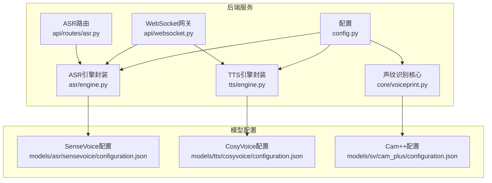
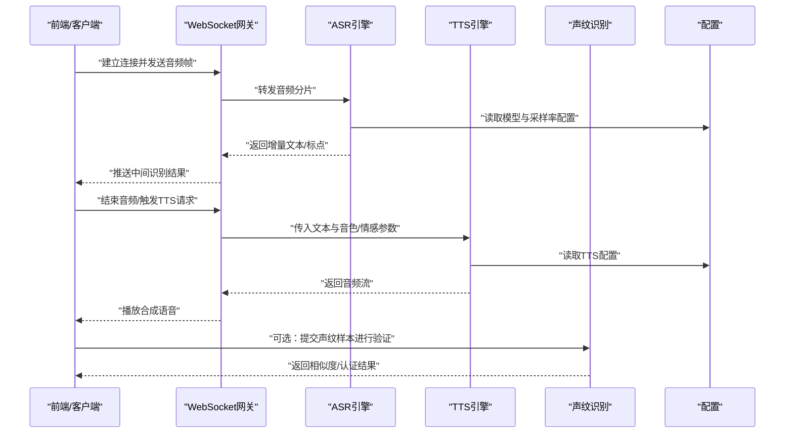
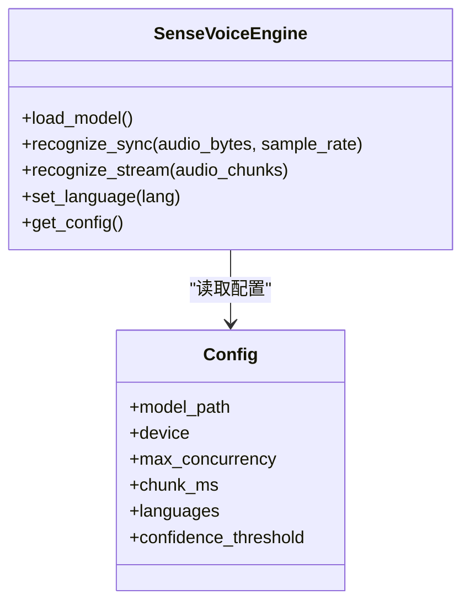
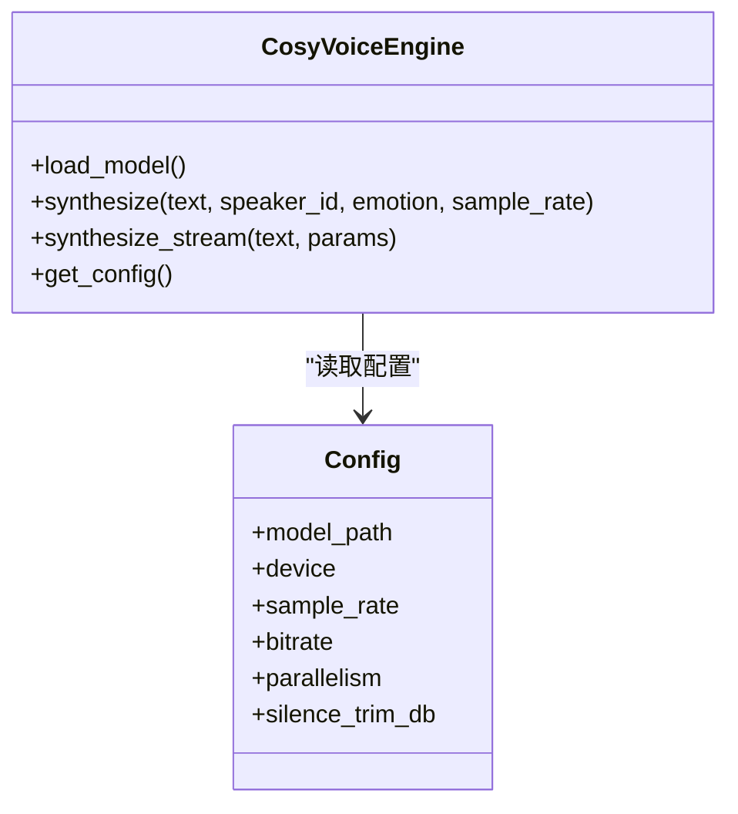
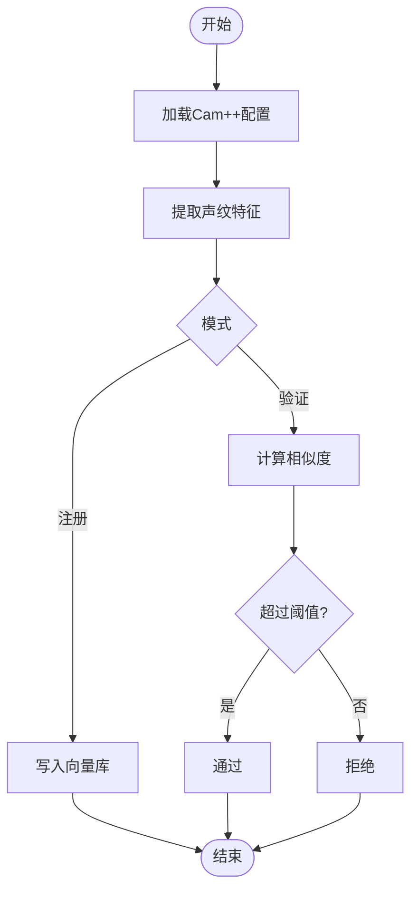
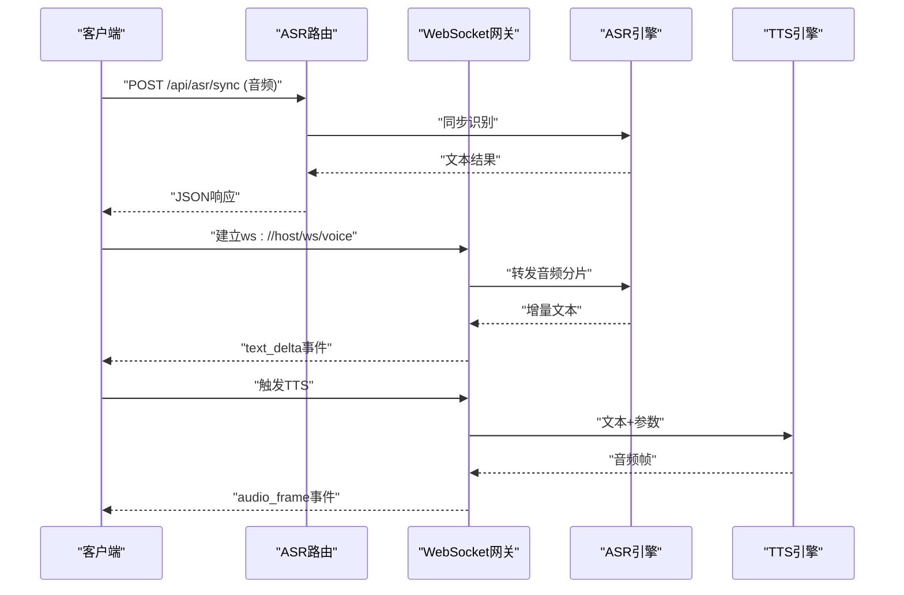
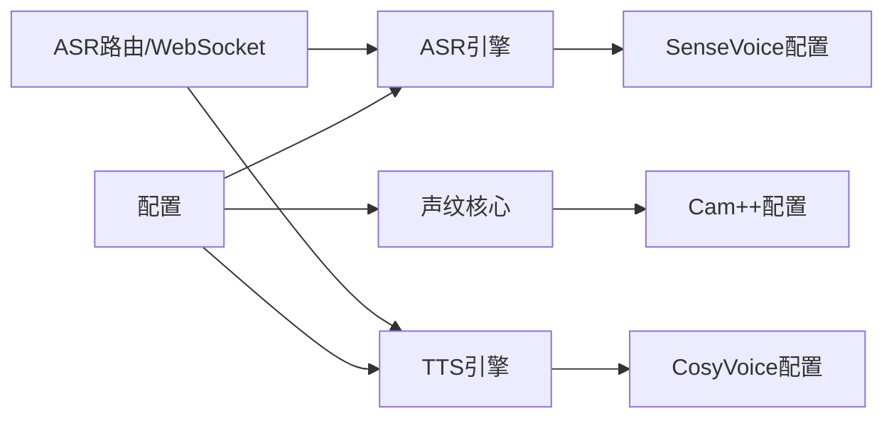

# 语音交互系统

<cite>
**本文引用的文件**   
- [backend_design/nexus/asr/engine.py](file://backend_design/nexus/asr/engine.py)
- [backend_design/nexus/tts/engine.py](file://backend_design/nexus/tts/engine.py)
- [backend_design/nexus/core/voiceprint.py](file://backend_design/nexus/core/voiceprint.py)
- [backend_design/nexus/api/routes/asr.py](file://backend_design/nexus/api/routes/asr.py)
- [backend_design/nexus/api/websocket.py](file://backend_design/nexus/api/websocket.py)
- [backend_design/nexus/config.py](file://backend_design/nexus/config.py)
- [models/asr/sensevoice/configuration.json](file://models/asr/sensevoice/configuration.json)
- [models/tts/cosyvoice/configuration.json](file://models/tts/cosyvoice/configuration.json)
- [models/sv/cam_plus/configuration.json](file://models/sv/cam_plus/configuration.json)
</cite>

## 目录
1. [简介](#简介)
2. [项目结构](#项目结构)
3. [核心组件](#核心组件)
4. [架构总览](#架构总览)
5. [详细组件分析](#详细组件分析)
6. [依赖关系分析](#依赖关系分析)
7. [性能考虑](#性能考虑)
8. [故障排查指南](#故障排查指南)
9. [结论](#结论)
10. [附录](#附录)

## 简介
本文件面向NexusCockpit的语音交互子系统，系统性说明ASR（自动语音识别）、TTS（语音合成）与声纹识别三大能力的集成方案、数据流、配置项与优化策略。重点包括：
- ASR引擎集成SenseVoice模型，支持实时语音转文字与多语言识别
- TTS引擎使用CosyVoice模型，实现高质量语音合成与情感表达
- 声纹识别用于用户身份验证与个性化服务
- 音频格式、采样率、噪声处理与延迟优化的技术细节
- API调用示例与性能调优建议

## 项目结构
语音交互相关代码主要位于后端Python模块中，包含ASR/TTS引擎封装、API路由、WebSocket流式接口以及声纹识别核心逻辑；模型配置文件集中于models目录。

图表来源
- [backend_design/nexus/config.py](file://backend_design/nexus/config.py)
- [backend_design/nexus/api/routes/asr.py](file://backend_design/nexus/api/routes/asr.py)
- [backend_design/nexus/api/websocket.py](file://backend_design/nexus/api/websocket.py)
- [backend_design/nexus/asr/engine.py](file://backend_design/nexus/asr/engine.py)
- [backend_design/nexus/tts/engine.py](file://backend_design/nexus/tts/engine.py)
- [backend_design/nexus/core/voiceprint.py](file://backend_design/nexus/core/voiceprint.py)
- [models/asr/sensevoice/configuration.json](file://models/asr/sensevoice/configuration.json)
- [models/tts/cosyvoice/configuration.json](file://models/tts/cosyvoice/configuration.json)
- [models/sv/cam_plus/configuration.json](file://models/sv/cam_plus/configuration.json)

章节来源
- [backend_design/nexus/config.py](file://backend_design/nexus/config.py)
- [backend_design/nexus/asr/engine.py](file://backend_design/nexus/asr/engine.py)
- [backend_design/nexus/tts/engine.py](file://backend_design/nexus/tts/engine.py)
- [backend_design/nexus/core/voiceprint.py](file://backend_design/nexus/core/voiceprint.py)
- [backend_design/nexus/api/routes/asr.py](file://backend_design/nexus/api/routes/asr.py)
- [backend_design/nexus/api/websocket.py](file://backend_design/nexus/api/websocket.py)
- [models/asr/sensevoice/configuration.json](file://models/asr/sensevoice/configuration.json)
- [models/tts/cosyvoice/configuration.json](file://models/tts/cosyvoice/configuration.json)
- [models/sv/cam_plus/configuration.json](file://models/sv/cam_plus/configuration.json)

## 核心组件
- ASR引擎封装：负责加载SenseVoice模型与配置，提供同步/异步推理接口，支持流式分片输入与增量结果输出。
- TTS引擎封装：负责加载CosyVoice模型与配置，提供文本到语音的合成接口，支持音色/情感参数控制。
- 声纹识别核心：基于Cam++模型进行特征提取与比对，提供注册、验证与相似度评分能力。
- API层：REST与WebSocket双通道暴露ASR/TTS能力，便于前端或外部系统接入。
- 配置中心：集中管理模型路径、设备选择、采样率、并发等关键参数。

章节来源
- [backend_design/nexus/asr/engine.py](file://backend_design/nexus/asr/engine.py)
- [backend_design/nexus/tts/engine.py](file://backend_design/nexus/tts/engine.py)
- [backend_design/nexus/core/voiceprint.py](file://backend_design/nexus/core/voiceprint.py)
- [backend_design/nexus/api/routes/asr.py](file://backend_design/nexus/api/routes/asr.py)
- [backend_design/nexus/api/websocket.py](file://backend_design/nexus/api/websocket.py)
- [backend_design/nexus/config.py](file://backend_design/nexus/config.py)

## 架构总览
整体流程分为“录音采集—传输—识别/合成—返回”的闭环。ASR通过WebSocket接收PCM/Opus片段并流式返回中间文本；TTS根据业务指令生成音频片段并回传；声纹识别在会话建立或敏感操作前完成身份核验。

图表来源
- [backend_design/nexus/api/websocket.py](file://backend_design/nexus/api/websocket.py)
- [backend_design/nexus/asr/engine.py](file://backend_design/nexus/asr/engine.py)
- [backend_design/nexus/tts/engine.py](file://backend_design/nexus/tts/engine.py)
- [backend_design/nexus/core/voiceprint.py](file://backend_design/nexus/core/voiceprint.py)
- [backend_design/nexus/config.py](file://backend_design/nexus/config.py)

## 详细组件分析

### ASR引擎（SenseVoice）
- 功能要点
  - 加载SenseVoice模型与tokens配置，初始化编码器/解码器
  - 支持流式分片输入，维护上下文窗口与时间戳对齐
  - 多语言识别与说话人分离（依据模型能力）
  - 错误重试与超时保护
- 关键接口
  - 同步识别：一次性音频文件/字节流
  - 流式识别：按固定时长切片推进，返回增量文本
- 配置项
  - 模型路径、设备类型、最大并发、分片时长、语言开关、置信度阈值
- 性能优化
  - 批处理与缓存中间状态
  - GPU内存管理与模型预热
  - 自适应分片长度以平衡延迟与准确率

图表来源
- [backend_design/nexus/asr/engine.py](file://backend_design/nexus/asr/engine.py)
- [backend_design/nexus/config.py](file://backend_design/nexus/config.py)
- [models/asr/sensevoice/configuration.json](file://models/asr/sensevoice/configuration.json)

章节来源
- [backend_design/nexus/asr/engine.py](file://backend_design/nexus/asr/engine.py)
- [backend_design/nexus/config.py](file://backend_design/nexus/config.py)
- [models/asr/sensevoice/configuration.json](file://models/asr/sensevoice/configuration.json)

### TTS引擎（CosyVoice）
- 功能要点
  - 加载CosyVoice模型与配置，支持多种音色与情感风格
  - 文本预处理（分词、韵律标记）与声学/声码器解码
  - 流式音频输出，低延迟拼接播放
- 关键接口
  - 文本合成：传入文本与音色/情感参数，返回PCM/Opus流
  - 批量合成：提高吞吐
- 配置项
  - 模型路径、设备类型、采样率、目标比特率、并行度、静音裁剪阈值
- 性能优化
  - 预计算音素/韵律特征
  - 动态批处理与GPU显存池
  - 流式编码减少首包延迟

图表来源
- [backend_design/nexus/tts/engine.py](file://backend_design/nexus/tts/engine.py)
- [backend_design/nexus/config.py](file://backend_design/nexus/config.py)
- [models/tts/cosyvoice/configuration.json](file://models/tts/cosyvoice/configuration.json)

章节来源
- [backend_design/nexus/tts/engine.py](file://backend_design/nexus/tts/engine.py)
- [backend_design/nexus/config.py](file://backend_design/nexus/config.py)
- [models/tts/cosyvoice/configuration.json](file://models/tts/cosyvoice/configuration.json)

### 声纹识别（Cam++）
- 功能要点
  - 从语音片段中提取固定维度声纹向量
  - 注册：将新用户声纹向量持久化
  - 验证：对比当前样本与已注册向量的相似度
- 关键接口
  - enroll(音频片段) -> 向量ID
  - verify(音频片段, 向量ID) -> 相似度/是否通过
- 配置项
  - 模型路径、设备类型、特征维度、阈值、存储位置
- 安全与隐私
  - 向量加密存储、最小权限访问、审计日志

图表来源
- [backend_design/nexus/core/voiceprint.py](file://backend_design/nexus/core/voiceprint.py)
- [models/sv/cam_plus/configuration.json](file://models/sv/cam_plus/configuration.json)

章节来源
- [backend_design/nexus/core/voiceprint.py](file://backend_design/nexus/core/voiceprint.py)
- [models/sv/cam_plus/configuration.json](file://models/sv/cam_plus/configuration.json)

### API与WebSocket
- REST接口（示例路径）
  - POST /api/asr/sync：上传音频，返回文本
  - POST /api/tts/synthesize：提交文本，返回音频流
- WebSocket接口
  - ws://host/ws/voice：双向流式ASR/TTS
  - 事件：audio_chunk、text_delta、audio_frame、end_session
- 鉴权与会话
  - 可结合JWT与租户上下文，限制资源与配额

图表来源
- [backend_design/nexus/api/routes/asr.py](file://backend_design/nexus/api/routes/asr.py)
- [backend_design/nexus/api/websocket.py](file://backend_design/nexus/api/websocket.py)
- [backend_design/nexus/asr/engine.py](file://backend_design/nexus/asr/engine.py)
- [backend_design/nexus/tts/engine.py](file://backend_design/nexus/tts/engine.py)

章节来源
- [backend_design/nexus/api/routes/asr.py](file://backend_design/nexus/api/routes/asr.py)
- [backend_design/nexus/api/websocket.py](file://backend_design/nexus/api/websocket.py)

## 依赖关系分析
- 模块耦合
  - ASR/TTS引擎强依赖配置中心与对应模型配置
  - API层弱耦合于引擎，通过接口抽象切换实现
  - 声纹识别独立于ASR/TTS，可在任意阶段插入
- 外部依赖
  - 硬件加速（CUDA/CPU）
  - 音频编解码库（如libopus）
  - 向量存储（本地文件或数据库）

图表来源
- [backend_design/nexus/config.py](file://backend_design/nexus/config.py)
- [backend_design/nexus/asr/engine.py](file://backend_design/nexus/asr/engine.py)
- [backend_design/nexus/tts/engine.py](file://backend_design/nexus/tts/engine.py)
- [backend_design/nexus/core/voiceprint.py](file://backend_design/nexus/core/voiceprint.py)
- [backend_design/nexus/api/routes/asr.py](file://backend_design/nexus/api/routes/asr.py)
- [backend_design/nexus/api/websocket.py](file://backend_design/nexus/api/websocket.py)
- [models/asr/sensevoice/configuration.json](file://models/asr/sensevoice/configuration.json)
- [models/tts/cosyvoice/configuration.json](file://models/tts/cosyvoice/configuration.json)
- [models/sv/cam_plus/configuration.json](file://models/sv/cam_plus/configuration.json)

章节来源
- [backend_design/nexus/config.py](file://backend_design/nexus/config.py)
- [backend_design/nexus/asr/engine.py](file://backend_design/nexus/asr/engine.py)
- [backend_design/nexus/tts/engine.py](file://backend_design/nexus/tts/engine.py)
- [backend_design/nexus/core/voiceprint.py](file://backend_design/nexus/core/voiceprint.py)
- [backend_design/nexus/api/routes/asr.py](file://backend_design/nexus/api/routes/asr.py)
- [backend_design/nexus/api/websocket.py](file://backend_design/nexus/api/websocket.py)
- [models/asr/sensevoice/configuration.json](file://models/asr/sensevoice/configuration.json)
- [models/tts/cosyvoice/configuration.json](file://models/tts/cosyvoice/configuration.json)
- [models/sv/cam_plus/configuration.json](file://models/sv/cam_plus/configuration.json)

## 性能考虑
- 采样率与格式
  - 推荐采样率：16kHz（ASR），24kHz（TTS高保真）
  - 编码：上行优先使用Opus以降低带宽，下行PCM/Opus均可
- 噪声处理
  - 前端降噪与VAD（语音活动检测）减少无效片段
  - 后端增益归一化与去混响
- 延迟优化
  - ASR分片时长：200–400ms，结合增量输出
  - TTS首包延迟：启用流式合成与预取
- 并发与资源
  - 合理设置max_concurrency与GPU批大小
  - 模型预热与显存复用
- 监控与指标
  - 记录端到端时延、P95/P99、丢包率、CPU/GPU占用

[本节为通用指导，不直接分析具体文件]

## 故障排查指南
- 常见问题
  - 模型加载失败：检查模型路径与权限
  - 采样率不匹配：确认前后端一致
  - 流式中断：检查网络稳定性与心跳机制
  - 声纹误拒/误收：调整阈值与样本质量
- 定位方法
  - 开启详细日志，记录输入摘要与耗时
  - 回放测试用例，隔离问题域
  - 压测观察资源瓶颈

章节来源
- [backend_design/nexus/asr/engine.py](file://backend_design/nexus/asr/engine.py)
- [backend_design/nexus/tts/engine.py](file://backend_design/nexus/tts/engine.py)
- [backend_design/nexus/core/voiceprint.py](file://backend_design/nexus/core/voiceprint.py)

## 结论
本语音交互系统以SenseVoice与CosyVoice为核心，结合Cam++声纹识别，形成“听—说—认”一体化能力。通过流式API与WebSocket，兼顾低延迟与高可用。合理的配置与优化策略可显著提升用户体验与系统吞吐。

[本节为总结性内容，不直接分析具体文件]

## 附录

### API调用示例（路径参考）
- 同步ASR
  - 方法：POST
  - 路径：/api/asr/sync
  - 请求体：音频二进制或Base64，附带采样率与语言
  - 响应：文本、时间戳、置信度
- 流式ASR
  - 协议：WebSocket
  - 路径：/ws/voice
  - 事件：audio_chunk、text_delta、end_session
- TTS合成
  - 方法：POST
  - 路径：/api/tts/synthesize
  - 请求体：文本、音色ID、情感标签、采样率
  - 响应：音频流（PCM/Opus）

章节来源
- [backend_design/nexus/api/routes/asr.py](file://backend_design/nexus/api/routes/asr.py)
- [backend_design/nexus/api/websocket.py](file://backend_design/nexus/api/websocket.py)

### 配置项速查
- ASR（SenseVoice）
  - model_path、device、max_concurrency、chunk_ms、languages、confidence_threshold
- TTS（CosyVoice）
  - model_path、device、sample_rate、bitrate、parallelism、silence_trim_db
- 声纹（Cam++）
  - model_path、device、feature_dim、threshold、storage_path

章节来源
- [backend_design/nexus/config.py](file://backend_design/nexus/config.py)
- [models/asr/sensevoice/configuration.json](file://models/asr/sensevoice/configuration.json)
- [models/tts/cosyvoice/configuration.json](file://models/tts/cosyvoice/configuration.json)
- [models/sv/cam_plus/configuration.json](file://models/sv/cam_plus/configuration.json)