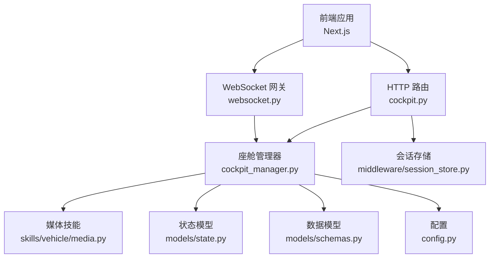
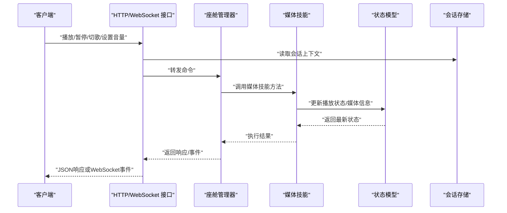
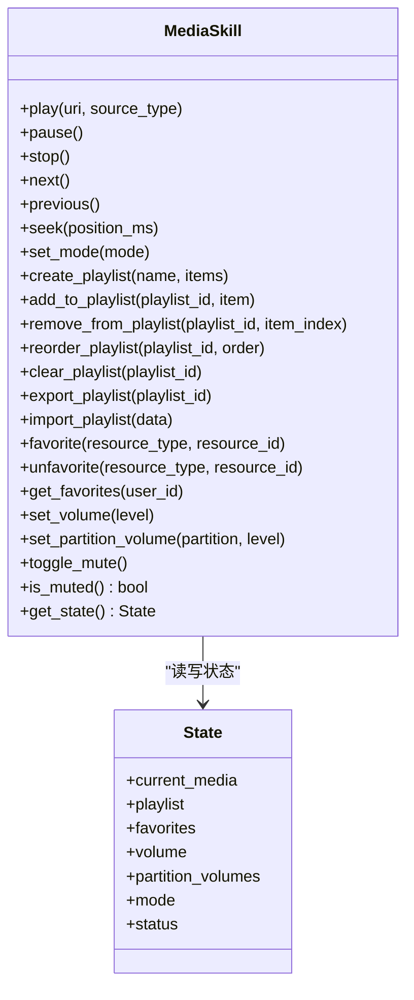
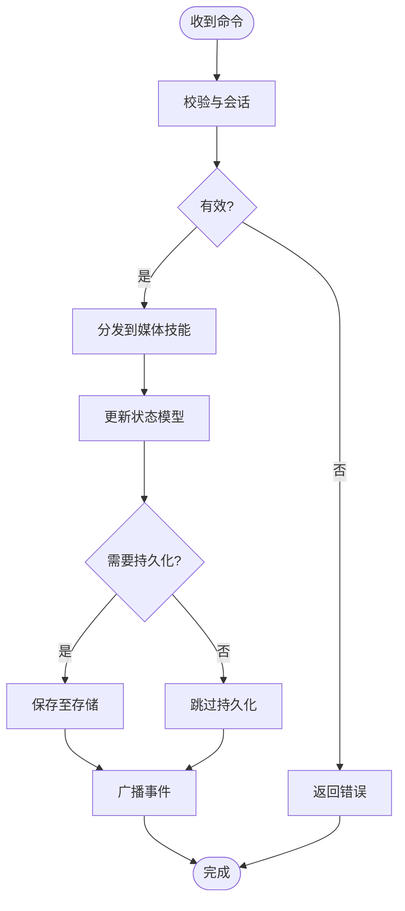
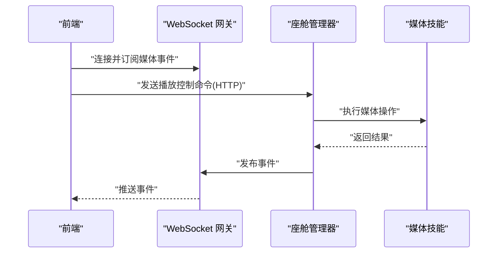
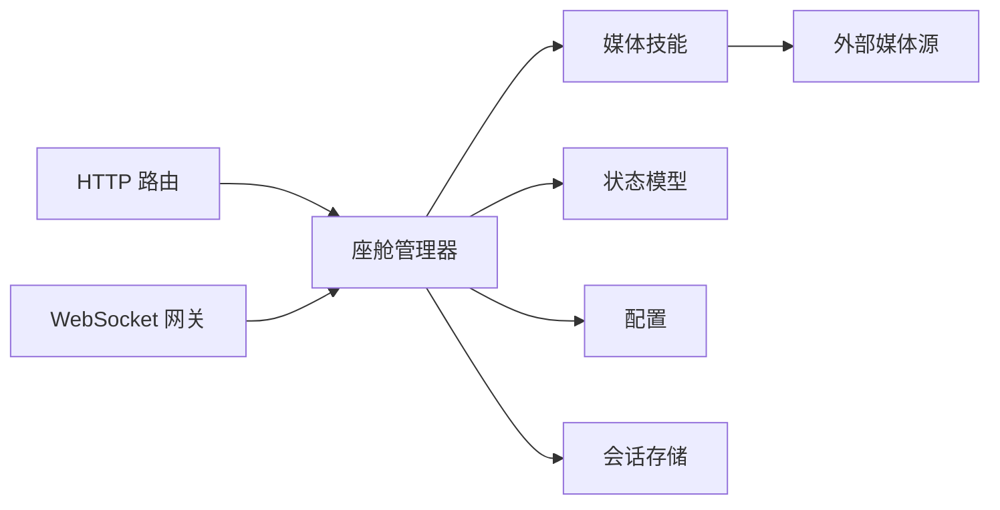

# 媒体播放控制

<cite>
**本文引用的文件**   
- [backend_design/nexus/skills/vehicle/media.py](file://backend_design/nexus/skills/vehicle/media.py)
- [backend_design/nexus/api/routes/cockpit.py](file://backend_design/nexus/api/routes/cockpit.py)
- [backend_design/nexus/core/cockpit_manager.py](file://backend_design/nexus/core/cockpit_manager.py)
- [backend_design/nexus/models/state.py](file://backend_design/nexus/models/state.py)
- [backend_design/nexus/models/schemas.py](file://backend_design/nexus/models/schemas.py)
- [backend_design/nexus/api/websocket.py](file://backend_design/nexus/api/websocket.py)
- [backend_design/nexus/middleware/session_store.py](file://backend_design/nexus/middleware/session_store.py)
- [backend_design/nexus/config.py](file://backend_design/nexus/config.py)
- [backend_design/nexus/main.py](file://backend_design/nexus/main.py)
- [frontend_design/src/lib/vehicle-events.ts](file://frontend_design/src/lib/vehicle-events.ts)
</cite>

## 目录
1. [简介](#简介)
2. [项目结构](#项目结构)
3. [核心组件](#核心组件)
4. [架构总览](#架构总览)
5. [详细组件分析](#详细组件分析)
6. [依赖关系分析](#依赖关系分析)
7. [性能考虑](#性能考虑)
8. [故障排查指南](#故障排查指南)
9. [结论](#结论)
10. [附录：API参考](#附录api参考)

## 简介
本文件面向NexusCockpit的“媒体播放控制”子系统，覆盖以下能力与边界：
- 音乐播放：本地音乐、在线流媒体、播放列表管理（创建/编辑/删除/排序/收藏）
- 电台控制：FM/AM调频、网络电台（URL/EPG/元数据）
- 音量控制：主音量、分区音量、静音模式
- 媒体源管理：来源注册、切换、状态同步
- 播放状态同步：实时事件推送（播放/暂停/切歌/进度/音量等）
- 用户收藏管理：收藏歌曲/专辑/电台/播放列表
- API接口：播放控制指令、媒体信息查询、播放列表操作
- 第三方服务集成示例：对接主流在线音乐平台（以插件化方式接入）

## 项目结构
媒体播放相关代码主要位于后端Python模块中，前端通过WebSocket接收媒体事件。关键路径如下：
- 技能层：车辆技能中的媒体能力定义与编排
- 路由层：HTTP/WebSocket接口暴露
- 核心层：座舱管理器协调各子系统
- 模型层：状态与Schema定义
- 中间件：会话存储用于跨请求上下文
- 配置：全局配置项（如默认音源、音量上限等）
- 前端：事件订阅与UI联动

图表来源
- [backend_design/nexus/api/websocket.py](file://backend_design/nexus/api/websocket.py)
- [backend_design/nexus/api/routes/cockpit.py](file://backend_design/nexus/api/routes/cockpit.py)
- [backend_design/nexus/core/cockpit_manager.py](file://backend_design/nexus/core/cockpit_manager.py)
- [backend_design/nexus/skills/vehicle/media.py](file://backend_design/nexus/skills/vehicle/media.py)
- [backend_design/nexus/models/state.py](file://backend_design/nexus/models/state.py)
- [backend_design/nexus/models/schemas.py](file://backend_design/nexus/models/schemas.py)
- [backend_design/nexus/middleware/session_store.py](file://backend_design/nexus/middleware/session_store.py)
- [backend_design/nexus/config.py](file://backend_design/nexus/config.py)

章节来源
- [backend_design/nexus/skills/vehicle/media.py](file://backend_design/nexus/skills/vehicle/media.py)
- [backend_design/nexus/api/routes/cockpit.py](file://backend_design/nexus/api/routes/cockpit.py)
- [backend_design/nexus/core/cockpit_manager.py](file://backend_design/nexus/core/cockpit_manager.py)
- [backend_design/nexus/models/state.py](file://backend_design/nexus/models/state.py)
- [backend_design/nexus/models/schemas.py](file://backend_design/nexus/models/schemas.py)
- [backend_design/nexus/api/websocket.py](file://backend_design/nexus/api/websocket.py)
- [backend_design/nexus/middleware/session_store.py](file://backend_design/nexus/middleware/session_store.py)
- [backend_design/nexus/config.py](file://backend_design/nexus/config.py)

## 核心组件
- 媒体技能（Media Skill）
  - 职责：封装媒体播放、电台控制、音量调节、播放列表与收藏等业务逻辑；对外暴露统一方法供座舱管理器调用。
  - 关键点：支持多源（本地/在线/电台）、播放状态机、分区音量策略、静音模式。
- 座舱管理器（Cockpit Manager）
  - 职责：作为控制器，协调媒体技能、状态模型、配置与会话；负责命令分发与结果回传。
- 状态模型（State Model）
  - 职责：维护当前播放状态、媒体信息、音量、分区、收藏索引等。
- 数据模型（Schemas）
  - 职责：定义请求/响应结构体，确保前后端契约一致。
- WebSocket网关
  - 职责：向客户端推送媒体事件（播放/暂停/切歌/进度/音量变化/错误）。
- 会话存储（Session Store）
  - 职责：在请求间保持上下文（如当前用户、设备分区、权限）。
- 配置（Config）
  - 职责：集中管理媒体相关参数（默认源、最大音量、缓存策略等）。

章节来源
- [backend_design/nexus/skills/vehicle/media.py](file://backend_design/nexus/skills/vehicle/media.py)
- [backend_design/nexus/core/cockpit_manager.py](file://backend_design/nexus/core/cockpit_manager.py)
- [backend_design/nexus/models/state.py](file://backend_design/nexus/models/state.py)
- [backend_design/nexus/models/schemas.py](file://backend_design/nexus/models/schemas.py)
- [backend_design/nexus/api/websocket.py](file://backend_design/nexus/api/websocket.py)
- [backend_design/nexus/middleware/session_store.py](file://backend_design/nexus/middleware/session_store.py)
- [backend_design/nexus/config.py](file://backend_design/nexus/config.py)

## 架构总览
媒体播放控制采用“技能+管理器+状态”的分层设计：
- 上层：HTTP/WebSocket接口暴露给前端或外部系统
- 中层：座舱管理器进行命令解析、权限校验、调度
- 下层：媒体技能实现具体业务逻辑，读写状态模型并触发事件

图表来源
- [backend_design/nexus/api/routes/cockpit.py](file://backend_design/nexus/api/routes/cockpit.py)
- [backend_design/nexus/api/websocket.py](file://backend_design/nexus/api/websocket.py)
- [backend_design/nexus/core/cockpit_manager.py](file://backend_design/nexus/core/cockpit_manager.py)
- [backend_design/nexus/skills/vehicle/media.py](file://backend_design/nexus/skills/vehicle/media.py)
- [backend_design/nexus/models/state.py](file://backend_design/nexus/models/state.py)
- [backend_design/nexus/middleware/session_store.py](file://backend_design/nexus/middleware/session_store.py)

## 详细组件分析

### 媒体技能（Media Skill）
- 功能范围
  - 播放控制：播放、暂停、停止、上一首、下一首、跳转、循环/随机模式
  - 媒体源：本地文件、在线流媒体、电台（FM/AM/网络）
  - 播放列表：创建、添加、移除、重排、清空、导入导出
  - 收藏管理：收藏/取消收藏歌曲、专辑、电台、播放列表
  - 音量控制：主音量、分区音量、静音模式
- 关键数据结构
  - 媒体项：标识、标题、时长、封面、来源类型、URI
  - 播放列表：ID、名称、条目集合、顺序、是否循环
  - 收藏索引：用户ID到资源ID映射
  - 音量：主音量、分区音量表、静音标志
- 复杂度与优化
  - 播放列表操作建议O(1)插入/删除（链表或双端队列），查询O(n)
  - 大列表分页加载与懒加载
  - 在线流媒体预缓冲与断线重试
- 错误处理
  - 网络异常、解码失败、权限不足、非法URI、配额限制
  - 统一错误码与可恢复策略（重试/降级）

图表来源
- [backend_design/nexus/skills/vehicle/media.py](file://backend_design/nexus/skills/vehicle/media.py)
- [backend_design/nexus/models/state.py](file://backend_design/nexus/models/state.py)

章节来源
- [backend_design/nexus/skills/vehicle/media.py](file://backend_design/nexus/skills/vehicle/media.py)
- [backend_design/nexus/models/state.py](file://backend_design/nexus/models/state.py)

### 座舱管理器（Cockpit Manager）
- 职责
  - 解析命令、鉴权与会话绑定
  - 调用媒体技能并聚合结果
  - 触发WebSocket事件广播
- 关键流程
  - 播放控制：验证输入→更新状态→持久化（可选）→广播事件
  - 播放列表：校验权限→修改列表→同步状态→广播变更
  - 收藏：校验用户→更新索引→广播收藏变更
  - 音量：校验范围→更新分区/主音量→广播音量事件

图表来源
- [backend_design/nexus/core/cockpit_manager.py](file://backend_design/nexus/core/cockpit_manager.py)
- [backend_design/nexus/models/state.py](file://backend_design/nexus/models/state.py)
- [backend_design/nexus/api/websocket.py](file://backend_design/nexus/api/websocket.py)

章节来源
- [backend_design/nexus/core/cockpit_manager.py](file://backend_design/nexus/core/cockpit_manager.py)

### 数据模型（Schemas）
- 作用
  - 定义HTTP/WebSocket请求/响应结构
  - 保证前后端一致性
- 典型字段
  - 播放控制：动作、目标媒体、位置、模式
  - 播放列表：ID、名称、条目数组、顺序
  - 收藏：资源类型、资源ID、用户ID
  - 音量：主音量、分区映射、静音标志

章节来源
- [backend_design/nexus/models/schemas.py](file://backend_design/nexus/models/schemas.py)

### WebSocket事件与前端集成
- 事件类型
  - 播放状态：playing/paused/stopped/ended
  - 媒体信息：title/artist/cover/duration/current_time
  - 播放列表：added/removed/reordered/cleared
  - 收藏：favorited/unfavorited
  - 音量：volume_changed/mute_toggled
- 前端订阅
  - 使用事件总线订阅媒体事件，驱动UI更新
  - 错误事件提示与重试机制

图表来源
- [backend_design/nexus/api/websocket.py](file://backend_design/nexus/api/websocket.py)
- [frontend_design/src/lib/vehicle-events.ts](file://frontend_design/src/lib/vehicle-events.ts)

章节来源
- [backend_design/nexus/api/websocket.py](file://backend_design/nexus/api/websocket.py)
- [frontend_design/src/lib/vehicle-events.ts](file://frontend_design/src/lib/vehicle-events.ts)

### 会话存储与会话上下文
- 用途
  - 跨请求携带用户ID、设备分区、权限等信息
- 关键点
  - 安全隔离（租户/用户维度）
  - 过期清理与并发访问保护

章节来源
- [backend_design/nexus/middleware/session_store.py](file://backend_design/nexus/middleware/session_store.py)

### 配置项
- 常见项
  - 默认媒体源、最大音量、分区数量、缓存策略、第三方服务开关
- 影响面
  - 行为策略、性能与稳定性

章节来源
- [backend_design/nexus/config.py](file://backend_design/nexus/config.py)

## 依赖关系分析
- 组件耦合
  - 座舱管理器依赖媒体技能、状态模型、配置与会话存储
  - 媒体技能依赖状态模型与外部媒体源（本地/在线/电台）
  - 路由层依赖管理器与会话存储
  - WebSocket依赖管理器进行事件发布
- 外部依赖
  - 音频播放器/编解码库
  - 网络流媒体客户端
  - 文件系统/对象存储（本地音乐）
  - 第三方音乐服务API（可选）

图表来源
- [backend_design/nexus/api/routes/cockpit.py](file://backend_design/nexus/api/routes/cockpit.py)
- [backend_design/nexus/api/websocket.py](file://backend_design/nexus/api/websocket.py)
- [backend_design/nexus/core/cockpit_manager.py](file://backend_design/nexus/core/cockpit_manager.py)
- [backend_design/nexus/skills/vehicle/media.py](file://backend_design/nexus/skills/vehicle/media.py)
- [backend_design/nexus/models/state.py](file://backend_design/nexus/models/state.py)
- [backend_design/nexus/config.py](file://backend_design/nexus/config.py)
- [backend_design/nexus/middleware/session_store.py](file://backend_design/nexus/middleware/session_store.py)

章节来源
- [backend_design/nexus/api/routes/cockpit.py](file://backend_design/nexus/api/routes/cockpit.py)
- [backend_design/nexus/api/websocket.py](file://backend_design/nexus/api/websocket.py)
- [backend_design/nexus/core/cockpit_manager.py](file://backend_design/nexus/core/cockpit_manager.py)
- [backend_design/nexus/skills/vehicle/media.py](file://backend_design/nexus/skills/vehicle/media.py)
- [backend_design/nexus/models/state.py](file://backend_design/nexus/models/state.py)
- [backend_design/nexus/config.py](file://backend_design/nexus/config.py)
- [backend_design/nexus/middleware/session_store.py](file://backend_design/nexus/middleware/session_store.py)

## 性能考虑
- 播放列表
  - 大列表分页与懒加载，避免一次性加载
  - 批量操作合并为单次事务
- 在线流媒体
  - 预缓冲与自适应码率
  - 断线自动重连与降级策略
- 状态同步
  - 事件去抖与批处理，减少频繁推送
  - 增量更新而非全量刷新
- 音量控制
  - 分区音量合并计算，避免重复渲染
- 存储与缓存
  - 常用媒体元数据缓存
  - 收藏索引快速查找（哈希/索引）

[本节为通用指导，不直接分析具体文件]

## 故障排查指南
- 常见问题
  - 无法播放：检查URI有效性、权限、网络连通性、解码器可用性
  - 音量无变化：确认分区选择、静音模式、音量范围校验
  - 播放列表不同步：检查事件订阅、幂等处理、状态一致性
  - 收藏失败：确认用户上下文、资源存在性、唯一约束
- 定位步骤
  - 查看WebSocket事件日志，确认事件是否发出与到达
  - 检查会话上下文是否正确传递
  - 核对状态模型快照，确认最终一致性
  - 启用调试日志，追踪媒体技能内部错误

章节来源
- [backend_design/nexus/api/websocket.py](file://backend_design/nexus/api/websocket.py)
- [backend_design/nexus/core/cockpit_manager.py](file://backend_design/nexus/core/cockpit_manager.py)
- [backend_design/nexus/models/state.py](file://backend_design/nexus/models/state.py)

## 结论
媒体播放控制系统通过清晰的技能化设计与统一的座舱管理器，实现了多源播放、精细化的音量控制、完整的播放列表与收藏管理，并通过WebSocket提供实时状态同步。配合合理的性能优化与完善的错误处理，可满足车载场景下的高可用与用户体验要求。

[本节为总结，不直接分析具体文件]

## 附录：API参考

说明
- 以下为媒体播放控制的API参考，涵盖播放控制、媒体信息查询、播放列表与收藏操作、音量控制以及第三方服务集成示例。
- 所有接口均基于HTTP与WebSocket，请求/响应结构遵循数据模型定义。

### 播放控制
- 播放
  - 方法：POST /api/media/play
  - 请求体：媒体URI、来源类型、可选起始位置
  - 响应：播放任务ID、当前状态
- 暂停
  - 方法：POST /api/media/pause
  - 响应：当前状态
- 停止
  - 方法：POST /api/media/stop
  - 响应：当前状态
- 上一首/下一首
  - 方法：POST /api/media/prev | POST /api/media/next
  - 响应：当前媒体信息与状态
- 跳转
  - 方法：POST /api/media/seek
  - 请求体：时间戳（毫秒）
  - 响应：当前状态

章节来源
- [backend_design/nexus/api/routes/cockpit.py](file://backend_design/nexus/api/routes/cockpit.py)
- [backend_design/nexus/models/schemas.py](file://backend_design/nexus/models/schemas.py)

### 媒体信息查询
- 获取当前媒体信息
  - 方法：GET /api/media/current
  - 响应：媒体元数据、进度、模式
- 获取播放列表详情
  - 方法：GET /api/media/playlist/{id}
  - 响应：列表信息、条目分页
- 获取收藏列表
  - 方法：GET /api/media/favorites?type={type}&user_id={uid}
  - 响应：收藏资源集合

章节来源
- [backend_design/nexus/api/routes/cockpit.py](file://backend_design/nexus/api/routes/cockpit.py)
- [backend_design/nexus/models/schemas.py](file://backend_design/nexus/models/schemas.py)

### 播放列表操作
- 创建播放列表
  - 方法：POST /api/media/playlist
  - 请求体：名称、初始条目
  - 响应：列表ID
- 添加到播放列表
  - 方法：POST /api/media/playlist/{id}/items
  - 请求体：条目集合
  - 响应：新增条目索引
- 从播放列表移除
  - 方法：DELETE /api/media/playlist/{id}/items/{index}
  - 响应：更新后的列表
- 重排播放列表
  - 方法：PUT /api/media/playlist/{id}/order
  - 请求体：新顺序
  - 响应：成功状态
- 清空播放列表
  - 方法：DELETE /api/media/playlist/{id}
  - 响应：成功状态
- 导入/导出播放列表
  - 方法：POST /api/media/playlist/import | GET /api/media/playlist/export/{id}
  - 请求/响应：结构化数据

章节来源
- [backend_design/nexus/api/routes/cockpit.py](file://backend_design/nexus/api/routes/cockpit.py)
- [backend_design/nexus/models/schemas.py](file://backend_design/nexus/models/schemas.py)

### 收藏管理
- 收藏资源
  - 方法：POST /api/media/favorite
  - 请求体：资源类型、资源ID、用户ID
  - 响应：收藏状态
- 取消收藏
  - 方法：DELETE /api/media/favorite
  - 请求体：资源类型、资源ID、用户ID
  - 响应：收藏状态

章节来源
- [backend_design/nexus/api/routes/cockpit.py](file://backend_design/nexus/api/routes/cockpit.py)
- [backend_design/nexus/models/schemas.py](file://backend_design/nexus/models/schemas.py)

### 音量控制
- 设置主音量
  - 方法：PUT /api/media/volume
  - 请求体：音量值（百分比）
  - 响应：当前音量
- 设置分区音量
  - 方法：PUT /api/media/volume/partition
  - 请求体：分区ID、音量值
  - 响应：分区音量
- 静音模式
  - 方法：POST /api/media/volume/mute
  - 请求体：开关
  - 响应：静音状态

章节来源
- [backend_design/nexus/api/routes/cockpit.py](file://backend_design/nexus/api/routes/cockpit.py)
- [backend_design/nexus/models/schemas.py](file://backend_design/nexus/models/schemas.py)

### 电台控制
- 切换电台
  - 方法：POST /api/media/radio/tune
  - 请求体：频率（FM/AM）或网络电台URI
  - 响应：电台信息与状态
- 获取电台元数据
  - 方法：GET /api/media/radio/info
  - 响应：节目名、主持人、EPG信息

章节来源
- [backend_design/nexus/api/routes/cockpit.py](file://backend_design/nexus/api/routes/cockpit.py)
- [backend_design/nexus/models/schemas.py](file://backend_design/nexus/models/schemas.py)

### 第三方音乐服务集成示例
- 接入流程
  - 注册第三方服务凭据（OAuth/密钥）
  - 配置服务开关与代理
  - 实现媒体源适配器（URI转换、鉴权、拉流）
  - 将适配器注册到媒体技能
- 示例接口
  - 搜索与推荐：GET /api/media/search?q=...
  - 登录授权：POST /api/media/auth/{service}
  - 拉取播放列表：GET /api/media/library/{service}/playlists
  - 播放在线曲目：POST /api/media/play?source={service}&uri=...

章节来源
- [backend_design/nexus/skills/vehicle/media.py](file://backend_design/nexus/skills/vehicle/media.py)
- [backend_design/nexus/config.py](file://backend_design/nexus/config.py)
- [backend_design/nexus/api/routes/cockpit.py](file://backend_design/nexus/api/routes/cockpit.py)

### 启动与入口
- 应用入口
  - 主程序初始化与路由挂载
- 注意
  - 确保媒体技能已正确注册
  - 配置必要的第三方服务参数

章节来源
- [backend_design/nexus/main.py](file://backend_design/nexus/main.py)