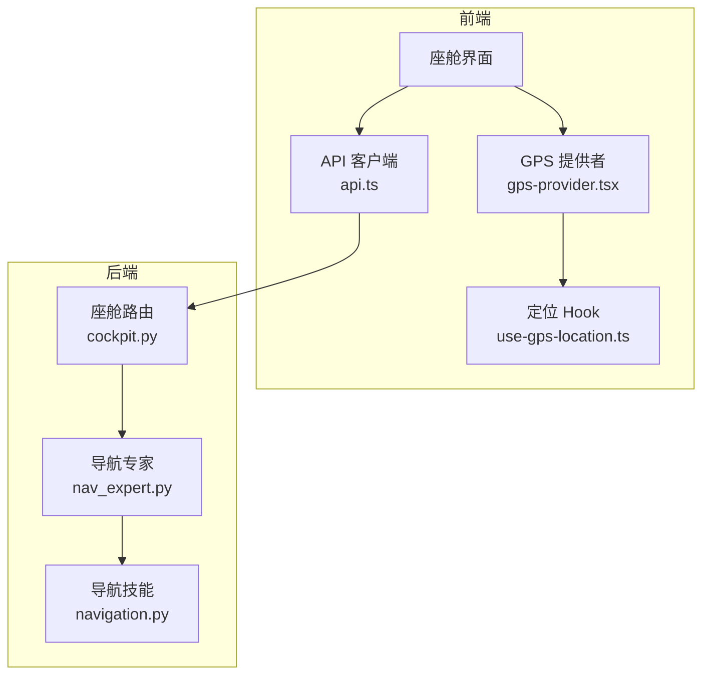
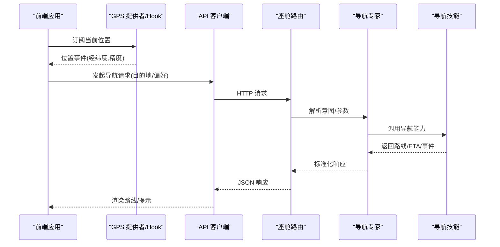
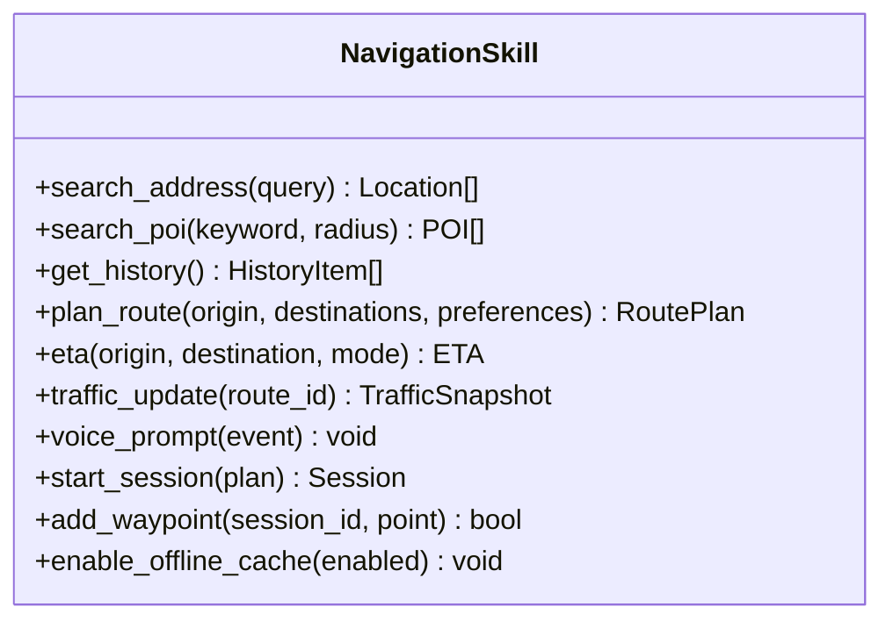
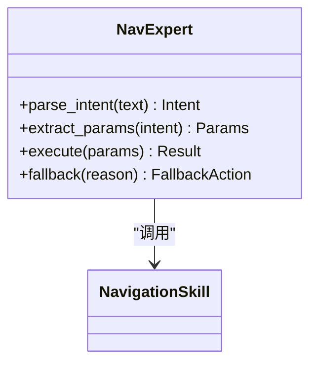
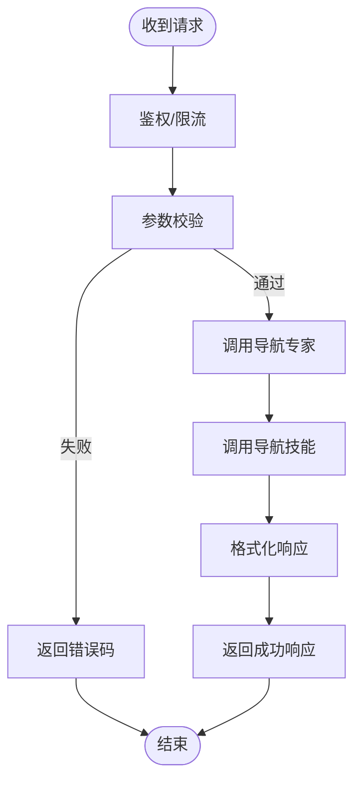
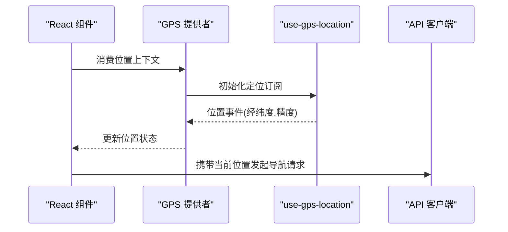
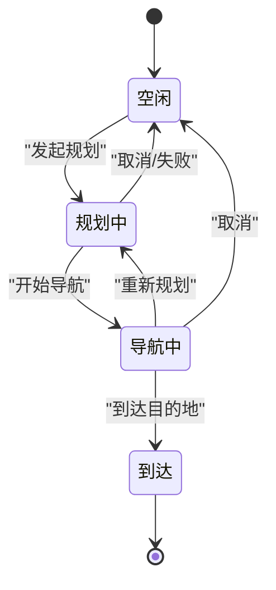
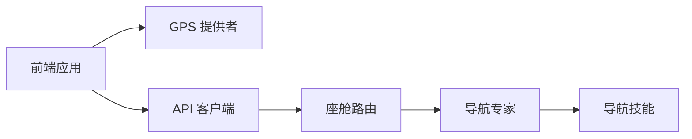

# 导航管理系统

<cite>
**本文引用的文件**   
- [backend_design/nexus/skills/vehicle/navigation.py](file://backend_design/nexus/skills/vehicle/navigation.py)
- [backend_design/nexus/agent/experts/nav_expert.py](file://backend_design/nexus/agent/experts/nav_expert.py)
- [backend_design/nexus/api/routes/cockpit.py](file://backend_design/nexus/api/routes/cockpit.py)
- [frontend_design/src/components/layout/gps-provider.tsx](file://frontend_design/src/components/layout/gps-provider.tsx)
- [frontend_design/src/hooks/use-gps-location.ts](file://frontend_design/src/hooks/use-gps-location.ts)
- [frontend_design/src/lib/api.ts](file://frontend_design/src/lib/api.ts)
</cite>

## 目录
1. [简介](#简介)
2. [项目结构](#项目结构)
3. [核心组件](#核心组件)
4. [架构总览](#架构总览)
5. [详细组件分析](#详细组件分析)
6. [依赖关系分析](#依赖关系分析)
7. [性能考虑](#性能考虑)
8. [故障排查指南](#故障排查指南)
9. [结论](#结论)
10. [附录：API 参考与使用示例](#附录api-参考与使用示例)

## 简介
本文件面向 NexusCockpit 的导航管理系统，聚焦以下能力：
- 目的地设置：地址搜索、POI 查找、历史地点
- 路线规划算法：最短路径、避开拥堵、自定义偏好
- 实时导航信息：ETA 计算、路况更新、语音提示
- 导航状态管理、多点导航支持、离线地图缓存机制
- API 接口参考与使用示例（地理编码、逆地理编码、路径查询）

说明：本文档基于仓库中现有代码进行梳理与归纳。若某些功能在代码中尚未实现或仅以占位形式存在，将在相应章节明确标注“未实现/待扩展”。

## 项目结构
与导航相关的后端与前端关键位置如下：
- 后端技能层：车辆技能中的导航模块
- Agent 专家层：导航专家用于意图识别与任务编排
- API 路由层：座舱相关接口（可能包含导航入口）
- 前端定位能力：GPS 提供者与定位 Hook
- 前端 API 客户端：统一调用后端接口

图表来源
- [backend_design/nexus/skills/vehicle/navigation.py](file://backend_design/nexus/skills/vehicle/navigation.py)
- [backend_design/nexus/agent/experts/nav_expert.py](file://backend_design/nexus/agent/experts/nav_expert.py)
- [backend_design/nexus/api/routes/cockpit.py](file://backend_design/nexus/api/routes/cockpit.py)
- [frontend_design/src/components/layout/gps-provider.tsx](file://frontend_design/src/components/layout/gps-provider.tsx)
- [frontend_design/src/hooks/use-gps-location.ts](file://frontend_design/src/hooks/use-gps-location.ts)
- [frontend_design/src/lib/api.ts](file://frontend_design/src/lib/api.ts)

章节来源
- [backend_design/nexus/skills/vehicle/navigation.py](file://backend_design/nexus/skills/vehicle/navigation.py)
- [backend_design/nexus/agent/experts/nav_expert.py](file://backend_design/nexus/agent/experts/nav_expert.py)
- [backend_design/nexus/api/routes/cockpit.py](file://backend_design/nexus/api/routes/cockpit.py)
- [frontend_design/src/components/layout/gps-provider.tsx](file://frontend_design/src/components/layout/gps-provider.tsx)
- [frontend_design/src/hooks/use-gps-location.ts](file://frontend_design/src/hooks/use-gps-location.ts)
- [frontend_design/src/lib/api.ts](file://frontend_design/src/lib/api.ts)

## 核心组件
- 导航技能（Navigation Skill）
  - 职责：封装导航领域能力，如目的地解析、路线规划、ETA 估算、导航事件等。
  - 设计要点：对外暴露清晰的方法契约；内部可组合外部服务（地图/路径/交通）。
- 导航专家（Nav Expert）
  - 职责：在 Agent 图中负责导航意图识别、参数抽取、与技能协作执行。
  - 设计要点：与通用专家保持一致的输入输出协议，便于编排与复用。
- 座舱 API 路由（Cockpit Routes）
  - 职责：提供 HTTP/WebSocket 接口，供前端发起导航相关请求。
  - 设计要点：鉴权、限流、错误码规范、日志埋点。
- 前端定位能力
  - GPS 提供者：为应用注入当前设备位置。
  - 定位 Hook：封装浏览器/系统定位 API，提供稳定数据源。
- 前端 API 客户端
  - 职责：统一封装对后端的 REST/WS 调用，处理重试、超时、错误提示。

章节来源
- [backend_design/nexus/skills/vehicle/navigation.py](file://backend_design/nexus/skills/vehicle/navigation.py)
- [backend_design/nexus/agent/experts/nav_expert.py](file://backend_design/nexus/agent/experts/nav_expert.py)
- [backend_design/nexus/api/routes/cockpit.py](file://backend_design/nexus/api/routes/cockpit.py)
- [frontend_design/src/components/layout/gps-provider.tsx](file://frontend_design/src/components/layout/gps-provider.tsx)
- [frontend_design/src/hooks/use-gps-location.ts](file://frontend_design/src/hooks/use-gps-location.ts)
- [frontend_design/src/lib/api.ts](file://frontend_design/src/lib/api.ts)

## 架构总览
导航子系统采用“前端定位 + 后端技能 + Agent 编排”的分层架构：
- 前端通过 GPS 提供者获取当前位置，并通过 API 客户端向后端发起导航请求。
- 后端座舱路由接收请求，交由导航专家进行意图解析与参数校验。
- 导航专家调用导航技能完成具体业务逻辑（如地理编码、路径规划、ETA 计算）。
- 结果返回前端，用于渲染路线、播报语音提示等。

图表来源
- [backend_design/nexus/skills/vehicle/navigation.py](file://backend_design/nexus/skills/vehicle/navigation.py)
- [backend_design/nexus/agent/experts/nav_expert.py](file://backend_design/nexus/agent/experts/nav_expert.py)
- [backend_design/nexus/api/routes/cockpit.py](file://backend_design/nexus/api/routes/cockpit.py)
- [frontend_design/src/components/layout/gps-provider.tsx](file://frontend_design/src/components/layout/gps-provider.tsx)
- [frontend_design/src/hooks/use-gps-location.ts](file://frontend_design/src/hooks/use-gps-location.ts)
- [frontend_design/src/lib/api.ts](file://frontend_design/src/lib/api.ts)

## 详细组件分析

### 导航技能（Navigation Skill）
- 目标
  - 提供统一的导航能力抽象，屏蔽底层地图/路径服务的差异。
- 主要职责
  - 目的地设置：地址搜索、POI 检索、历史地点加载
  - 路线规划：最短路径、避开拥堵、自定义偏好（时间/距离/费用等）
  - 实时导航：ETA 计算、路况更新、语音提示触发
  - 状态管理：导航会话、多途经点、离线缓存
- 设计建议
  - 将外部依赖（地理编码、路径服务、交通数据）抽象为接口，便于替换与测试。
  - 对耗时操作（路径计算、ETA 更新）采用异步与缓存策略。
  - 定义清晰的错误码与降级策略（如离线模式回退到最近可用缓存）。

图表来源
- [backend_design/nexus/skills/vehicle/navigation.py](file://backend_design/nexus/skills/vehicle/navigation.py)

章节来源
- [backend_design/nexus/skills/vehicle/navigation.py](file://backend_design/nexus/skills/vehicle/navigation.py)

### 导航专家（Nav Expert）
- 目标
  - 在 Agent 图中承担导航意图识别、参数抽取、流程编排。
- 主要职责
  - 从用户输入中提取目的地、偏好、是否开启避堵等参数。
  - 协调导航技能完成端到端任务（如先地理编码再规划路线）。
  - 将技能返回的结构化结果转换为前端友好的格式。
- 交互关系
  - 被座舱路由调用，作为导航任务的执行者。
  - 与导航技能紧密耦合，但保持松散的接口契约。

图表来源
- [backend_design/nexus/agent/experts/nav_expert.py](file://backend_design/nexus/agent/experts/nav_expert.py)
- [backend_design/nexus/skills/vehicle/navigation.py](file://backend_design/nexus/skills/vehicle/navigation.py)

章节来源
- [backend_design/nexus/agent/experts/nav_expert.py](file://backend_design/nexus/agent/experts/nav_expert.py)
- [backend_design/nexus/skills/vehicle/navigation.py](file://backend_design/nexus/skills/vehicle/navigation.py)

### 座舱 API 路由（Cockpit Routes）
- 目标
  - 暴露导航相关 HTTP/WebSocket 接口，供前端调用。
- 主要职责
  - 鉴权与会话管理
  - 请求校验与参数规范化
  - 错误码统一与日志记录
  - 转发至导航专家/技能
- 典型接口
  - 地理编码/逆地理编码
  - 路径查询与规划
  - 实时导航事件推送（可选 WebSocket）

图表来源
- [backend_design/nexus/api/routes/cockpit.py](file://backend_design/nexus/api/routes/cockpit.py)
- [backend_design/nexus/agent/experts/nav_expert.py](file://backend_design/nexus/agent/experts/nav_expert.py)
- [backend_design/nexus/skills/vehicle/navigation.py](file://backend_design/nexus/skills/vehicle/navigation.py)

章节来源
- [backend_design/nexus/api/routes/cockpit.py](file://backend_design/nexus/api/routes/cockpit.py)
- [backend_design/nexus/agent/experts/nav_expert.py](file://backend_design/nexus/agent/experts/nav_expert.py)
- [backend_design/nexus/skills/vehicle/navigation.py](file://backend_design/nexus/skills/vehicle/navigation.py)

### 前端定位能力（GPS Provider & Hook）
- 目标
  - 为前端提供稳定的设备位置数据源。
- 主要职责
  - GPS 提供者：在 React 上下文中注入位置状态与监听器。
  - 定位 Hook：封装原生定位 API，提供订阅式位置更新。
- 使用方式
  - 在页面或组件中订阅位置变化，结合导航 API 发起路径规划。

图表来源
- [frontend_design/src/components/layout/gps-provider.tsx](file://frontend_design/src/components/layout/gps-provider.tsx)
- [frontend_design/src/hooks/use-gps-location.ts](file://frontend_design/src/hooks/use-gps-location.ts)
- [frontend_design/src/lib/api.ts](file://frontend_design/src/lib/api.ts)

章节来源
- [frontend_design/src/components/layout/gps-provider.tsx](file://frontend_design/src/components/layout/gps-provider.tsx)
- [frontend_design/src/hooks/use-gps-location.ts](file://frontend_design/src/hooks/use-gps-location.ts)
- [frontend_design/src/lib/api.ts](file://frontend_design/src/lib/api.ts)

### 概念性概览（非代码映射）
- 导航状态机（概念）
  - 空闲 -> 规划中 -> 导航中 -> 到达/取消
  - 支持中途暂停、恢复、切换路线
- 多点导航（概念）
  - 起点 + 多个途经点 + 终点
  - 动态增删途经点并重新规划
- 离线缓存（概念）
  - 缓存常用 POI、热门路线片段、基础路网
  - 网络不可用时回退到缓存数据

[此图为概念图，不直接对应具体源码文件]

## 依赖关系分析
- 组件耦合
  - 座舱路由依赖导航专家；导航专家依赖导航技能。
  - 前端依赖 GPS 提供者与 API 客户端。
- 外部依赖
  - 地理编码/路径/交通服务（由导航技能抽象）
  - 前端定位 API（浏览器/系统）
- 潜在循环依赖
  - 应避免专家与技能之间互相直接引用，通过接口解耦。

图表来源
- [backend_design/nexus/api/routes/cockpit.py](file://backend_design/nexus/api/routes/cockpit.py)
- [backend_design/nexus/agent/experts/nav_expert.py](file://backend_design/nexus/agent/experts/nav_expert.py)
- [backend_design/nexus/skills/vehicle/navigation.py](file://backend_design/nexus/skills/vehicle/navigation.py)
- [frontend_design/src/components/layout/gps-provider.tsx](file://frontend_design/src/components/layout/gps-provider.tsx)
- [frontend_design/src/lib/api.ts](file://frontend_design/src/lib/api.ts)

章节来源
- [backend_design/nexus/api/routes/cockpit.py](file://backend_design/nexus/api/routes/cockpit.py)
- [backend_design/nexus/agent/experts/nav_expert.py](file://backend_design/nexus/agent/experts/nav_expert.py)
- [backend_design/nexus/skills/vehicle/navigation.py](file://backend_design/nexus/skills/vehicle/navigation.py)
- [frontend_design/src/components/layout/gps-provider.tsx](file://frontend_design/src/components/layout/gps-provider.tsx)
- [frontend_design/src/lib/api.ts](file://frontend_design/src/lib/api.ts)

## 性能考虑
- 缓存策略
  - 对热点 POI、常用路线片段进行缓存，减少重复计算。
  - 使用本地存储与内存缓存结合，区分冷热数据。
- 并发与异步
  - 路径规划与 ETA 计算采用异步执行，避免阻塞主线程。
  - 前端对定位事件做节流与去抖，降低频繁重算。
- 降级与容错
  - 网络异常时回退到离线缓存；部分字段缺失时使用默认值。
  - 对第三方服务增加熔断与重试策略。
- 资源优化
  - 按需加载地图瓦片与矢量数据。
  - 合并多次小请求为大批量请求，减少往返次数。

[本节为通用指导，无需源码引用]

## 故障排查指南
- 常见问题
  - 定位失败：检查权限、GPS 信号、浏览器兼容性。
  - 路径规划超时：检查网络、第三方服务可用性、参数合法性。
  - ETA 偏差大：确认交通数据时效性与模型参数。
- 日志与监控
  - 在后端关键节点添加结构化日志（请求 ID、耗时、错误码）。
  - 在前端捕获并上报异常堆栈与上下文。
- 快速定位
  - 通过请求链路追踪（前端 API 客户端 -> 座舱路由 -> 导航专家 -> 导航技能）逐步缩小范围。
  - 对高频失败接口进行专项压测与回归。

章节来源
- [backend_design/nexus/api/routes/cockpit.py](file://backend_design/nexus/api/routes/cockpit.py)
- [backend_design/nexus/agent/experts/nav_expert.py](file://backend_design/nexus/agent/experts/nav_expert.py)
- [backend_design/nexus/skills/vehicle/navigation.py](file://backend_design/nexus/skills/vehicle/navigation.py)
- [frontend_design/src/lib/api.ts](file://frontend_design/src/lib/api.ts)

## 结论
NexusCockpit 的导航管理系统以“技能+专家+路由”的分层架构为核心，前端提供定位能力与统一 API 客户端，后端通过导航专家编排导航技能完成端到端任务。建议在后续迭代中完善地理编码、路径规划、ETA 与语音提示的具体实现，并加强缓存、容错与可观测性建设。

[本节为总结，无需源码引用]

## 附录：API 参考与使用示例

### 接口总览（概念）
- 地理编码
  - 方法：POST /api/cockpit/geocode
  - 入参：address（字符串）、region（可选）
  - 出参：location（经纬度）、confidence（置信度）
- 逆地理编码
  - 方法：POST /api/cockpit/reverse_geocode
  - 入参：lat、lng
  - 出参：formatted_address、place_type、metadata
- 路径查询与规划
  - 方法：POST /api/cockpit/route_plan
  - 入参：origin、destinations[]、preferences{avoid_traffic, shortest, custom}
  - 出参：route_id、segments[]、eta、distance、polyline
- 实时导航事件（可选 WebSocket）
  - 通道：ws://.../cockpit/nav/events
  - 事件：eta_update、traffic_alert、voice_prompt、waypoint_arrival

注意：以上为概念性接口定义，实际字段与行为需以后端实现为准。

### 使用示例（前端）
- 获取当前位置
  - 通过 GPS 提供者或 use-gps-location Hook 订阅位置事件。
- 发起路径规划
  - 调用 API 客户端发送 POST /api/cockpit/route_plan，携带 origin、destinations、preferences。
- 展示路线与 ETA
  - 根据返回的 segments、polyline 渲染地图，并在导航中持续拉取/订阅 eta_update。

章节来源
- [frontend_design/src/components/layout/gps-provider.tsx](file://frontend_design/src/components/layout/gps-provider.tsx)
- [frontend_design/src/hooks/use-gps-location.ts](file://frontend_design/src/hooks/use-gps-location.ts)
- [frontend_design/src/lib/api.ts](file://frontend_design/src/lib/api.ts)
- [backend_design/nexus/api/routes/cockpit.py](file://backend_design/nexus/api/routes/cockpit.py)
- [backend_design/nexus/agent/experts/nav_expert.py](file://backend_design/nexus/agent/experts/nav_expert.py)
- [backend_design/nexus/skills/vehicle/navigation.py](file://backend_design/nexus/skills/vehicle/navigation.py)