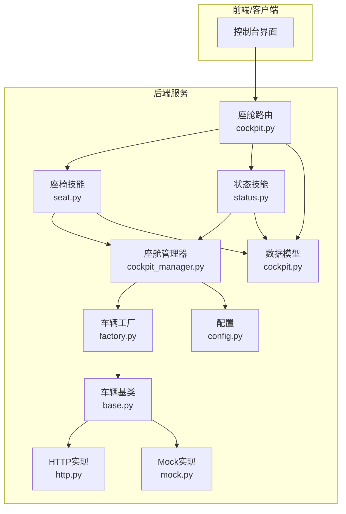
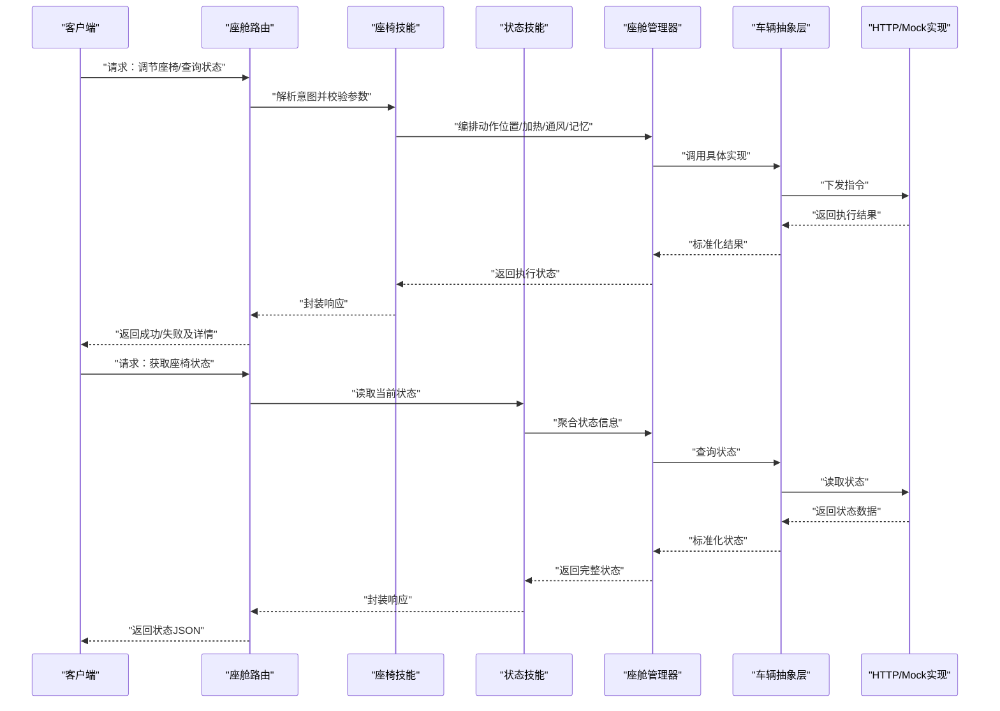
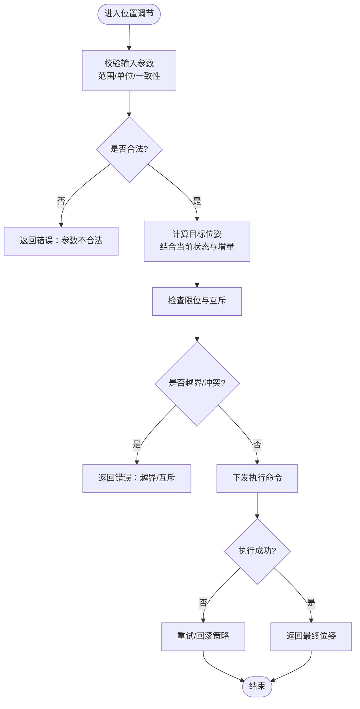
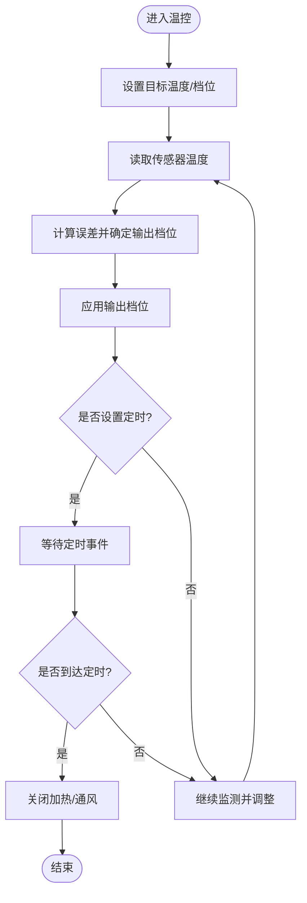
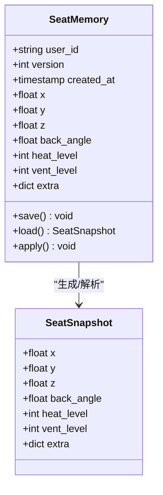
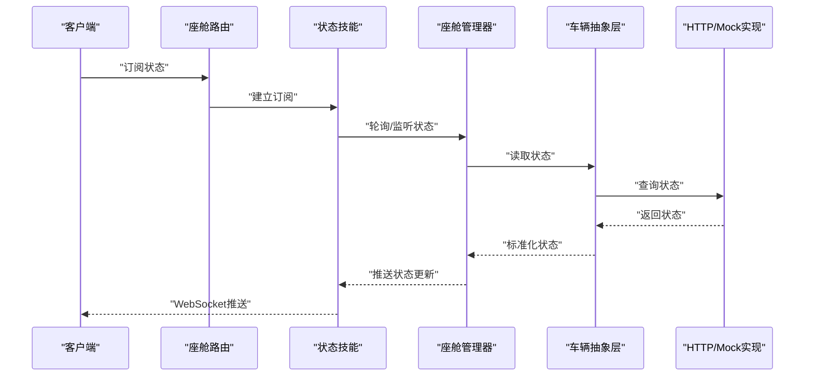
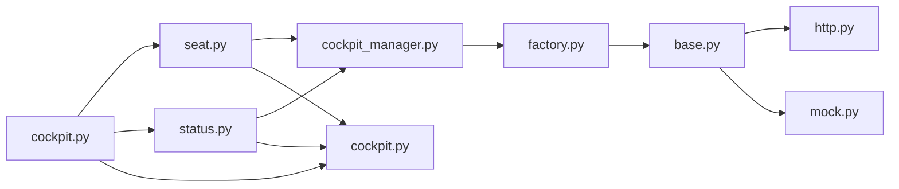

# 座椅调节系统

<cite>
**本文引用的文件**   
- [backend_design/nexus/skills/vehicle/seat.py](file://backend_design/nexus/skills/vehicle/seat.py)
- [backend_design/nexus/skills/vehicle/status.py](file://backend_design/nexus/skills/vehicle/status.py)
- [backend_design/nexus/api/routes/cockpit.py](file://backend_design/nexus/api/routes/cockpit.py)
- [backend_design/nexus/models/cockpit.py](file://backend_design/nexus/models/cockpit.py)
- [backend_design/nexus/core/cockpit_manager.py](file://backend_design/nexus/core/cockpit_manager.py)
- [backend_design/nexus/vehicle/factory.py](file://backend_design/nexus/vehicle/factory.py)
- [backend_design/nexus/vehicle/base.py](file://backend_design/nexus/vehicle/base.py)
- [backend_design/nexus/vehicle/http.py](file://backend_design/nexus/vehicle/http.py)
- [backend_design/nexus/vehicle/mock.py](file://backend_design/nexus/vehicle/mock.py)
- [backend_design/nexus/config.py](file://backend_design/nexus/config.py)
</cite>

## 目录
1. [简介](#简介)
2. [项目结构](#项目结构)
3. [核心组件](#核心组件)
4. [架构总览](#架构总览)
5. [详细组件分析](#详细组件分析)
6. [依赖关系分析](#依赖关系分析)
7. [性能考虑](#性能考虑)
8. [故障排查指南](#故障排查指南)
9. [结论](#结论)
10. [附录：API参考与使用示例](#附录api参考与使用示例)

## 简介
本文件为NexusCockpit的“座椅调节系统”提供系统化、可落地的技术文档。内容覆盖：
- 位置调节：前后移动、靠背角度、高度调节
- 加热与通风：温度控制、强度调节、定时关闭
- 记忆功能：位置保存、一键恢复、多用户配置
- 状态监控与安全保护：实时状态上报、越界保护、互斥与超时
- 舒适模式预设：常用场景的一键化组合
- API接口参考与调用示例：包括坐标系统与温度控制逻辑说明

## 项目结构
与座椅相关的代码主要分布在以下模块：
- 技能层（Skill）：对外暴露语义能力，如“调座位”、“开加热”等
- 模型层（Models）：定义请求/响应数据模型
- 路由层（API Routes）：将HTTP请求映射到具体处理逻辑
- 座舱管理器（Cockpit Manager）：协调各子系统、编排流程
- 车辆抽象层（Vehicle Abstraction）：统一不同后端实现（HTTP/Mock）
- 配置（Config）：系统级参数与默认值

图表来源
- [backend_design/nexus/api/routes/cockpit.py](file://backend_design/nexus/api/routes/cockpit.py)
- [backend_design/nexus/skills/vehicle/seat.py](file://backend_design/nexus/skills/vehicle/seat.py)
- [backend_design/nexus/skills/vehicle/status.py](file://backend_design/nexus/skills/vehicle/status.py)
- [backend_design/nexus/core/cockpit_manager.py](file://backend_design/nexus/core/cockpit_manager.py)
- [backend_design/nexus/models/cockpit.py](file://backend_design/nexus/models/cockpit.py)
- [backend_design/nexus/vehicle/factory.py](file://backend_design/nexus/vehicle/factory.py)
- [backend_design/nexus/vehicle/base.py](file://backend_design/nexus/vehicle/base.py)
- [backend_design/nexus/vehicle/http.py](file://backend_design/nexus/vehicle/http.py)
- [backend_design/nexus/vehicle/mock.py](file://backend_design/nexus/vehicle/mock.py)
- [backend_design/nexus/config.py](file://backend_design/nexus/config.py)

章节来源
- [backend_design/nexus/api/routes/cockpit.py](file://backend_design/nexus/api/routes/cockpit.py)
- [backend_design/nexus/skills/vehicle/seat.py](file://backend_design/nexus/skills/vehicle/seat.py)
- [backend_design/nexus/skills/vehicle/status.py](file://backend_design/nexus/skills/vehicle/status.py)
- [backend_design/nexus/core/cockpit_manager.py](file://backend_design/nexus/core/cockpit_manager.py)
- [backend_design/nexus/models/cockpit.py](file://backend_design/nexus/models/cockpit.py)
- [backend_design/nexus/vehicle/factory.py](file://backend_design/nexus/vehicle/factory.py)
- [backend_design/nexus/vehicle/base.py](file://backend_design/nexus/vehicle/base.py)
- [backend_design/nexus/vehicle/http.py](file://backend_design/nexus/vehicle/http.py)
- [backend_design/nexus/vehicle/mock.py](file://backend_design/nexus/vehicle/mock.py)
- [backend_design/nexus/config.py](file://backend_design/nexus/config.py)

## 核心组件
- 座椅技能（Seat Skill）
  - 负责解析用户意图并执行位置调节、加热/通风控制、记忆存取等操作
  - 对输入进行校验、边界检查、并发与互斥控制
- 状态技能（Status Skill）
  - 负责读取当前座椅状态（位置、角度、高度、加热/通风档位、定时器剩余时间等）
- 座舱管理器（Cockpit Manager）
  - 编排跨子系统的动作序列，维护会话上下文，协调车辆抽象层
- 车辆抽象层（Vehicle Abstraction）
  - 通过工厂选择具体实现（HTTP或Mock），屏蔽底层差异
- 数据模型（Models）
  - 统一的请求/响应结构，确保前后端契约稳定

章节来源
- [backend_design/nexus/skills/vehicle/seat.py](file://backend_design/nexus/skills/vehicle/seat.py)
- [backend_design/nexus/skills/vehicle/status.py](file://backend_design/nexus/skills/vehicle/status.py)
- [backend_design/nexus/core/cockpit_manager.py](file://backend_design/nexus/core/cockpit_manager.py)
- [backend_design/nexus/vehicle/factory.py](file://backend_design/nexus/vehicle/factory.py)
- [backend_design/nexus/vehicle/base.py](file://backend_design/nexus/vehicle/base.py)
- [backend_design/nexus/models/cockpit.py](file://backend_design/nexus/models/cockpit.py)

## 架构总览
整体采用分层架构：前端通过HTTP/WebSocket与座舱路由交互；路由分发至对应技能；技能调用座舱管理器；管理器通过车辆抽象层驱动硬件或模拟设备。

图表来源
- [backend_design/nexus/api/routes/cockpit.py](file://backend_design/nexus/api/routes/cockpit.py)
- [backend_design/nexus/skills/vehicle/seat.py](file://backend_design/nexus/skills/vehicle/seat.py)
- [backend_design/nexus/skills/vehicle/status.py](file://backend_design/nexus/skills/vehicle/status.py)
- [backend_design/nexus/core/cockpit_manager.py](file://backend_design/nexus/core/cockpit_manager.py)
- [backend_design/nexus/vehicle/factory.py](file://backend_design/nexus/vehicle/factory.py)
- [backend_design/nexus/vehicle/base.py](file://backend_design/nexus/vehicle/base.py)
- [backend_design/nexus/vehicle/http.py](file://backend_design/nexus/vehicle/http.py)
- [backend_design/nexus/vehicle/mock.py](file://backend_design/nexus/vehicle/mock.py)

## 详细组件分析

### 位置调节（前后移动、靠背角度、高度调节）
- 功能要点
  - 支持相对位移与绝对定位两种方式
  - 坐标系统：以驾驶员视角为基准，X轴表示前后方向，Y轴表示左右方向，Z轴表示上下方向（高度）
  - 角度单位：度（°），范围受硬件限制
  - 安全约束：最小/最大限位、步进精度、相邻动作互斥（例如在调节过程中禁止同时改变多个自由度）
- 处理流程
  - 参数校验（范围、单位、一致性）
  - 计算目标位姿（结合当前状态与增量）
  - 下发执行命令（通过车辆抽象层）
  - 返回执行结果与最终位姿
- 错误处理
  - 越界：拒绝并返回错误码
  - 超时：重试策略与回滚提示
  - 互斥冲突：排队或取消前序动作

图表来源
- [backend_design/nexus/skills/vehicle/seat.py](file://backend_design/nexus/skills/vehicle/seat.py)
- [backend_design/nexus/core/cockpit_manager.py](file://backend_design/nexus/core/cockpit_manager.py)
- [backend_design/nexus/vehicle/base.py](file://backend_design/nexus/vehicle/base.py)

章节来源
- [backend_design/nexus/skills/vehicle/seat.py](file://backend_design/nexus/skills/vehicle/seat.py)
- [backend_design/nexus/core/cockpit_manager.py](file://backend_design/nexus/core/cockpit_manager.py)
- [backend_design/nexus/vehicle/base.py](file://backend_design/nexus/vehicle/base.py)

### 加热与通风（温度控制、强度调节、定时关闭）
- 功能要点
  - 加热：设定目标温度或档位，支持升温速率限制
  - 通风：设定风量档位，支持循环模式
  - 定时：设置持续时间或截止时间，到期自动关闭
- 控制逻辑
  - 温度控制：闭环控制（目标温度 vs 实际温度），根据误差调整输出档位
  - 强度调节：离散档位映射到功率区间
  - 定时关闭：基于任务调度器或定时器回调
- 安全约束
  - 最高温度上限、最低温度下限
  - 连续高功率运行时长限制，防止过热
  - 与位置调节互斥（避免同时大动作导致能耗峰值）

图表来源
- [backend_design/nexus/skills/vehicle/seat.py](file://backend_design/nexus/skills/vehicle/seat.py)
- [backend_design/nexus/core/cockpit_manager.py](file://backend_design/nexus/core/cockpit_manager.py)

章节来源
- [backend_design/nexus/skills/vehicle/seat.py](file://backend_design/nexus/skills/vehicle/seat.py)
- [backend_design/nexus/core/cockpit_manager.py](file://backend_design/nexus/core/cockpit_manager.py)

### 记忆功能（位置保存、一键恢复、多用户配置）
- 功能要点
  - 保存：将当前位姿与温控偏好打包为配置快照
  - 恢复：按用户ID加载对应配置并执行
  - 多用户：支持多个用户配置并存，切换时合并或覆盖策略可配置
- 处理流程
  - 保存：读取当前状态 -> 生成快照 -> 持久化存储
  - 恢复：读取快照 -> 校验 -> 执行位置与温控动作
- 数据模型
  - 用户标识、配置版本、时间戳、位姿字段、温控字段、扩展字段

图表来源
- [backend_design/nexus/models/cockpit.py](file://backend_design/nexus/models/cockpit.py)
- [backend_design/nexus/skills/vehicle/seat.py](file://backend_design/nexus/skills/vehicle/seat.py)

章节来源
- [backend_design/nexus/models/cockpit.py](file://backend_design/nexus/models/cockpit.py)
- [backend_design/nexus/skills/vehicle/seat.py](file://backend_design/nexus/skills/vehicle/seat.py)

### 状态监控与安全保护机制
- 状态监控
  - 实时上报：位置、角度、高度、加热/通风档位、定时器剩余时间
  - 变更订阅：WebSocket推送状态变化
- 安全保护
  - 限位保护：超出硬件范围立即中止
  - 互斥保护：同一时刻仅允许单一自由度调节
  - 超时保护：长时间无响应触发回退
  - 热保护：温度过高自动降档或关闭

图表来源
- [backend_design/nexus/skills/vehicle/status.py](file://backend_design/nexus/skills/vehicle/status.py)
- [backend_design/nexus/core/cockpit_manager.py](file://backend_design/nexus/core/cockpit_manager.py)
- [backend_design/nexus/vehicle/factory.py](file://backend_design/nexus/vehicle/factory.py)
- [backend_design/nexus/vehicle/base.py](file://backend_design/nexus/vehicle/base.py)
- [backend_design/nexus/vehicle/http.py](file://backend_design/nexus/vehicle/http.py)
- [backend_design/nexus/vehicle/mock.py](file://backend_design/nexus/vehicle/mock.py)

章节来源
- [backend_design/nexus/skills/vehicle/status.py](file://backend_design/nexus/skills/vehicle/status.py)
- [backend_design/nexus/core/cockpit_manager.py](file://backend_design/nexus/core/cockpit_manager.py)
- [backend_design/nexus/vehicle/factory.py](file://backend_design/nexus/vehicle/factory.py)
- [backend_design/nexus/vehicle/base.py](file://backend_design/nexus/vehicle/base.py)
- [backend_design/nexus/vehicle/http.py](file://backend_design/nexus/vehicle/http.py)
- [backend_design/nexus/vehicle/mock.py](file://backend_design/nexus/vehicle/mock.py)

### 舒适模式预设
- 常见预设
  - 驾驶模式：适合长途驾驶的坐姿与温控组合
  - 休息模式：半躺姿态、低风弱暖
  - 运动模式：直立坐姿、强通风
- 实现方式
  - 将预设映射为一组动作序列（位置+温控）
  - 支持用户自定义预设并保存

章节来源
- [backend_design/nexus/skills/vehicle/seat.py](file://backend_design/nexus/skills/vehicle/seat.py)
- [backend_design/nexus/models/cockpit.py](file://backend_design/nexus/models/cockpit.py)

## 依赖关系分析
- 组件耦合
  - 路由层依赖技能层，技能层依赖管理器，管理器依赖车辆抽象层
  - 模型层被路由与技能共同消费，保证契约一致
- 外部依赖
  - HTTP实现依赖网络通信库
  - Mock实现用于开发与测试
- 潜在循环依赖
  - 通过工厂与基类解耦，避免直接循环引用

图表来源
- [backend_design/nexus/api/routes/cockpit.py](file://backend_design/nexus/api/routes/cockpit.py)
- [backend_design/nexus/skills/vehicle/seat.py](file://backend_design/nexus/skills/vehicle/seat.py)
- [backend_design/nexus/skills/vehicle/status.py](file://backend_design/nexus/skills/vehicle/status.py)
- [backend_design/nexus/core/cockpit_manager.py](file://backend_design/nexus/core/cockpit_manager.py)
- [backend_design/nexus/vehicle/factory.py](file://backend_design/nexus/vehicle/factory.py)
- [backend_design/nexus/vehicle/base.py](file://backend_design/nexus/vehicle/base.py)
- [backend_design/nexus/vehicle/http.py](file://backend_design/nexus/vehicle/http.py)
- [backend_design/nexus/vehicle/mock.py](file://backend_design/nexus/vehicle/mock.py)
- [backend_design/nexus/models/cockpit.py](file://backend_design/nexus/models/cockpit.py)

章节来源
- [backend_design/nexus/api/routes/cockpit.py](file://backend_design/nexus/api/routes/cockpit.py)
- [backend_design/nexus/skills/vehicle/seat.py](file://backend_design/nexus/skills/vehicle/seat.py)
- [backend_design/nexus/skills/vehicle/status.py](file://backend_design/nexus/skills/vehicle/status.py)
- [backend_design/nexus/core/cockpit_manager.py](file://backend_design/nexus/core/cockpit_manager.py)
- [backend_design/nexus/vehicle/factory.py](file://backend_design/nexus/vehicle/factory.py)
- [backend_design/nexus/vehicle/base.py](file://backend_design/nexus/vehicle/base.py)
- [backend_design/nexus/vehicle/http.py](file://backend_design/nexus/vehicle/http.py)
- [backend_design/nexus/vehicle/mock.py](file://backend_design/nexus/vehicle/mock.py)
- [backend_design/nexus/models/cockpit.py](file://backend_design/nexus/models/cockpit.py)

## 性能考虑
- 批量操作：合并多次调节为一次执行，减少往返开销
- 异步执行：长耗时动作（如大范围移动）采用异步任务，及时返回中间状态
- 缓存与去抖：高频状态查询采用本地缓存与去抖策略
- 限流与熔断：对频繁调节进行限流，异常时快速失败并降级
- 资源占用：温控与位置调节共享功率预算，避免峰值过载

[本节为通用指导，无需特定文件来源]

## 故障排查指南
- 常见问题
  - 参数越界：检查输入范围与单位，确认硬件限位
  - 执行超时：查看网络连通性与设备响应时间
  - 互斥冲突：确认同一时刻仅有一个自由度在调节
  - 温度异常：检查传感器读数与温控策略
- 诊断步骤
  - 启用调试日志，记录请求与响应
  - 使用Mock实现验证逻辑正确性
  - 逐步缩小问题域（路由->技能->管理器->车辆实现）

章节来源
- [backend_design/nexus/core/cockpit_manager.py](file://backend_design/nexus/core/cockpit_manager.py)
- [backend_design/nexus/vehicle/mock.py](file://backend_design/nexus/vehicle/mock.py)

## 结论
座椅调节系统通过清晰的分层与抽象，实现了位置调节、温控、记忆与状态监控等功能。借助工厂与基类解耦，系统具备良好的可扩展性与可测试性。建议在生产环境完善限流、熔断与监控指标，以提升稳定性与可观测性。

[本节为总结，无需特定文件来源]

## 附录：API参考与使用示例

### 坐标系统与单位约定
- 坐标系
  - X：前后方向（正值为向前）
  - Y：左右方向（正值为向右）
  - Z：上下方向（正值为向上）
- 角度
  - 靠背角度：度（°），范围由硬件决定
- 温度
  - 摄氏度（℃），范围由硬件决定
- 档位
  - 加热/通风：整数档位，从低到高

章节来源
- [backend_design/nexus/models/cockpit.py](file://backend_design/nexus/models/cockpit.py)
- [backend_design/nexus/skills/vehicle/seat.py](file://backend_design/nexus/skills/vehicle/seat.py)

### 接口清单（概念性）
- 位置调节
  - 方法：POST /cockpit/seat/move
  - 主体：包含x/y/z增量或绝对值、back_angle、unit等
  - 返回：执行结果与最终位姿
- 温控控制
  - 方法：POST /cockpit/seat/climate
  - 主体：heat_level、vent_level、target_temp、duration等
  - 返回：执行结果与当前档位
- 记忆管理
  - 方法：POST /cockpit/seat/memory/save
  - 主体：user_id、snapshot
  - 方法：POST /cockpit/seat/memory/restore
  - 主体：user_id
  - 返回：执行结果
- 状态查询
  - 方法：GET /cockpit/seat/status
  - 返回：当前位姿、档位、定时器剩余时间等

章节来源
- [backend_design/nexus/api/routes/cockpit.py](file://backend_design/nexus/api/routes/cockpit.py)
- [backend_design/nexus/models/cockpit.py](file://backend_design/nexus/models/cockpit.py)

### 使用示例（概念性）
- 示例一：将座椅向前移动并降低靠背角度
  - 请求体包含x增量与back_angle增量
  - 服务端校验后下发执行，返回最终位姿
- 示例二：开启加热至中档并设置30分钟定时关闭
  - 请求体包含heat_level与duration
  - 服务端启动定时器，到期自动关闭
- 示例三：保存当前配置为用户A的记忆
  - 请求体包含user_id与snapshot
  - 服务端持久化配置
- 示例四：恢复用户B的配置
  - 请求体包含user_id
  - 服务端加载并执行相应动作

章节来源
- [backend_design/nexus/api/routes/cockpit.py](file://backend_design/nexus/api/routes/cockpit.py)
- [backend_design/nexus/skills/vehicle/seat.py](file://backend_design/nexus/skills/vehicle/seat.py)
- [backend_design/nexus/models/cockpit.py](file://backend_design/nexus/models/cockpit.py)