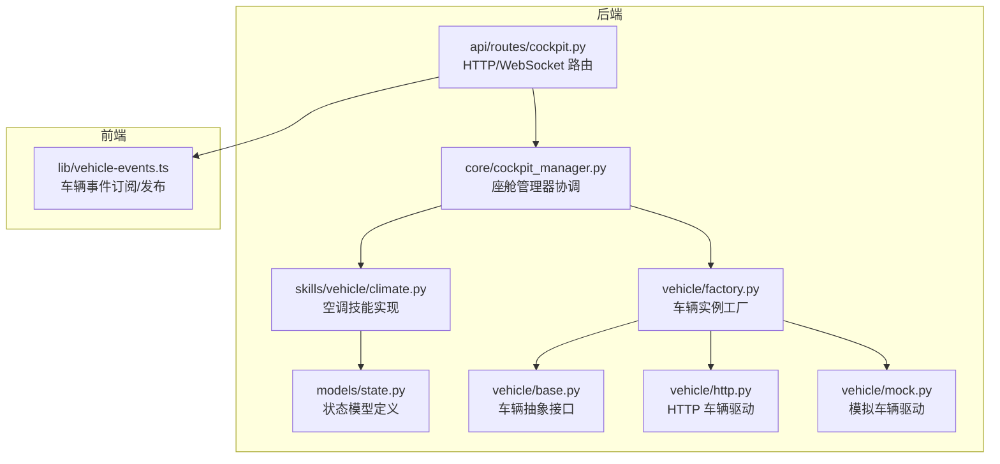
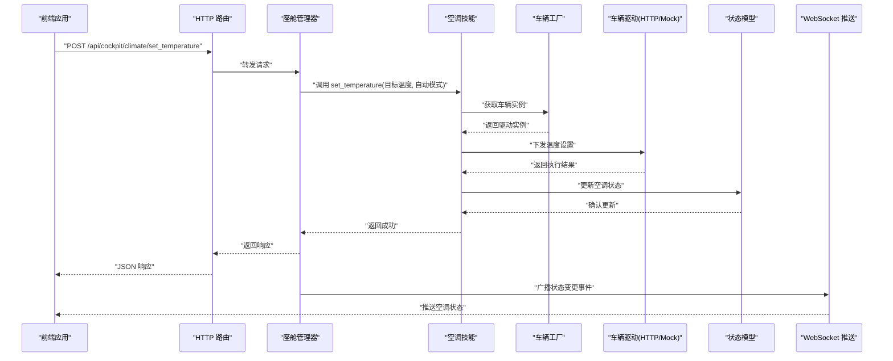
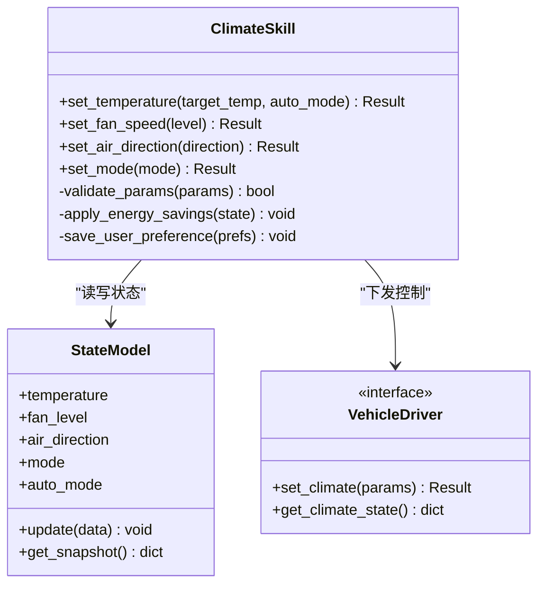
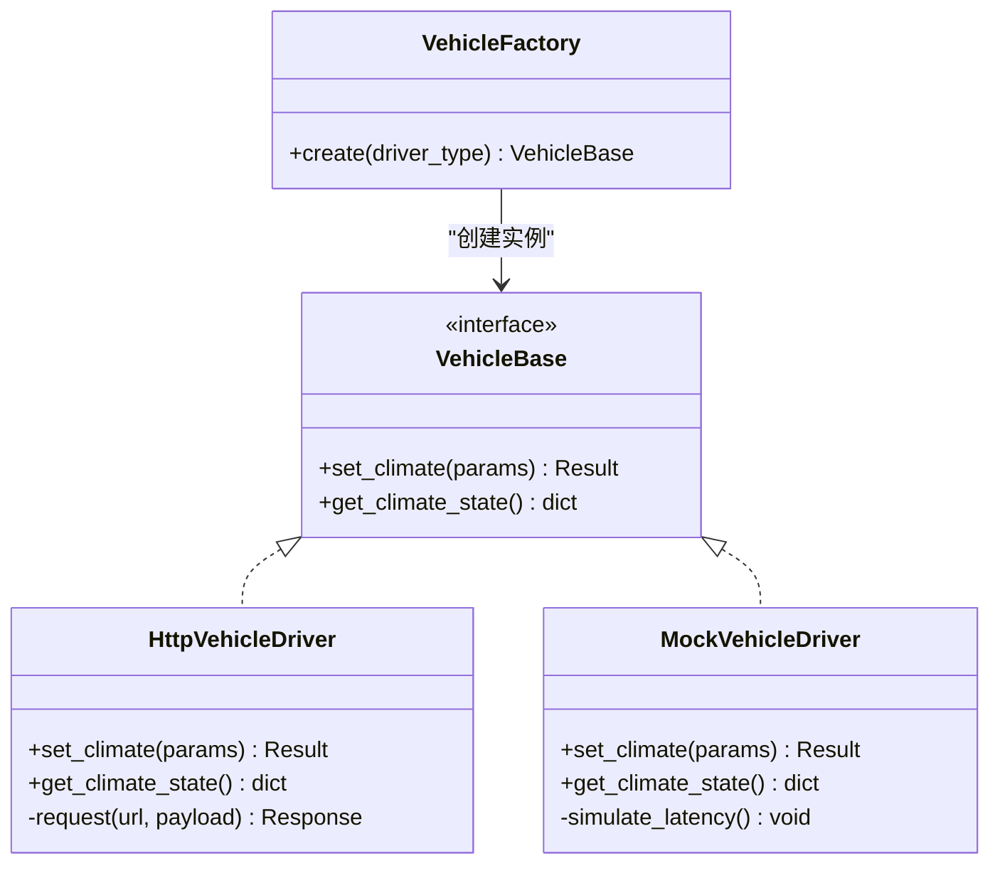
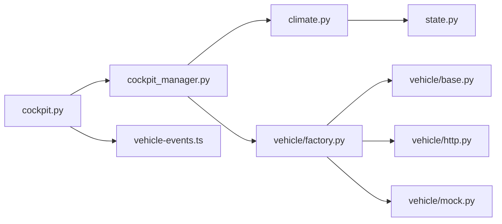

# 空调控制系统

<cite>
**本文引用的文件**   
- [backend_design/nexus/skills/vehicle/climate.py](file://backend_design/nexus/skills/vehicle/climate.py)
- [backend_design/nexus/models/state.py](file://backend_design/nexus/models/state.py)
- [backend_design/nexus/api/routes/cockpit.py](file://backend_design/nexus/api/routes/cockpit.py)
- [backend_design/nexus/core/cockpit_manager.py](file://backend_design/nexus/core/cockpit_manager.py)
- [backend_design/nexus/vehicle/base.py](file://backend_design/nexus/vehicle/base.py)
- [backend_design/nexus/vehicle/factory.py](file://backend_design/nexus/vehicle/factory.py)
- [backend_design/nexus/vehicle/http.py](file://backend_design/nexus/vehicle/http.py)
- [backend_design/nexus/vehicle/mock.py](file://backend_design/nexus/vehicle/mock.py)
- [frontend_design/src/lib/vehicle-events.ts](file://frontend_design/src/lib/vehicle-events.ts)
</cite>

## 目录
1. [简介](#简介)
2. [项目结构](#项目结构)
3. [核心组件](#核心组件)
4. [架构总览](#架构总览)
5. [详细组件分析](#详细组件分析)
6. [依赖关系分析](#依赖关系分析)
7. [性能考虑](#性能考虑)
8. [故障排查指南](#故障排查指南)
9. [结论](#结论)
10. [附录：API 参考](#附录api-参考)

## 简介
本文件面向 NexusCockpit 的“空调控制系统”，聚焦以下能力与机制：
- 温度调节：设定温度、自动模式
- 风量控制：风速档位、风向调节
- 模式切换：制冷、制热、除雾、自动
- 状态同步：车端状态到前端的实时推送
- 节能优化：在满足舒适性的前提下降低能耗
- 用户偏好记忆：记住常用设置并快速恢复
- API 接口：请求参数、响应格式、错误码说明
- 使用示例与常见问题排查

## 项目结构
围绕空调控制的代码主要分布在后端技能层、模型层、车辆抽象层以及前端事件总线中。下图给出与空调相关的关键文件与职责概览。

图表来源
- [backend_design/nexus/skills/vehicle/climate.py](file://backend_design/nexus/skills/vehicle/climate.py)
- [backend_design/nexus/models/state.py](file://backend_design/nexus/models/state.py)
- [backend_design/nexus/core/cockpit_manager.py](file://backend_design/nexus/core/cockpit_manager.py)
- [backend_design/nexus/api/routes/cockpit.py](file://backend_design/nexus/api/routes/cockpit.py)
- [backend_design/nexus/vehicle/base.py](file://backend_design/nexus/vehicle/base.py)
- [backend_design/nexus/vehicle/factory.py](file://backend_design/nexus/vehicle/factory.py)
- [backend_design/nexus/vehicle/http.py](file://backend_design/nexus/vehicle/http.py)
- [backend_design/nexus/vehicle/mock.py](file://backend_design/nexus/vehicle/mock.py)
- [frontend_design/src/lib/vehicle-events.ts](file://frontend_design/src/lib/vehicle-events.ts)

章节来源
- [backend_design/nexus/skills/vehicle/climate.py](file://backend_design/nexus/skills/vehicle/climate.py)
- [backend_design/nexus/models/state.py](file://backend_design/nexus/models/state.py)
- [backend_design/nexus/core/cockpit_manager.py](file://backend_design/nexus/core/cockpit_manager.py)
- [backend_design/nexus/api/routes/cockpit.py](file://backend_design/nexus/api/routes/cockpit.py)
- [backend_design/nexus/vehicle/base.py](file://backend_design/nexus/vehicle/base.py)
- [backend_design/nexus/vehicle/factory.py](file://backend_design/nexus/vehicle/factory.py)
- [backend_design/nexus/vehicle/http.py](file://backend_design/nexus/vehicle/http.py)
- [backend_design/nexus/vehicle/mock.py](file://backend_design/nexus/vehicle/mock.py)
- [frontend_design/src/lib/vehicle-events.ts](file://frontend_design/src/lib/vehicle-events.ts)

## 核心组件
- 空调技能（Climate Skill）
  - 负责解析用户意图或上层指令，调用车辆抽象接口完成温度、风量、风向、模式的设置，并将结果写入状态模型。
- 状态模型（State Model）
  - 定义空调相关的状态字段与约束，作为系统内唯一可信源。
- 座舱管理器（Cockpit Manager）
  - 协调各技能与车辆驱动，统一入口处理空调控制请求，触发状态变更与事件广播。
- 车辆抽象与驱动
  - 通过 base 定义统一接口，factory 选择具体实现（http/mock），屏蔽底层差异。
- 前端事件总线
  - 订阅车辆事件，将空调状态变化实时渲染到界面。

章节来源
- [backend_design/nexus/skills/vehicle/climate.py](file://backend_design/nexus/skills/vehicle/climate.py)
- [backend_design/nexus/models/state.py](file://backend_design/nexus/models/state.py)
- [backend_design/nexus/core/cockpit_manager.py](file://backend_design/nexus/core/cockpit_manager.py)
- [backend_design/nexus/vehicle/base.py](file://backend_design/nexus/vehicle/base.py)
- [backend_design/nexus/vehicle/factory.py](file://backend_design/nexus/vehicle/factory.py)
- [backend_design/nexus/vehicle/http.py](file://backend_design/nexus/vehicle/http.py)
- [backend_design/nexus/vehicle/mock.py](file://backend_design/nexus/vehicle/mock.py)
- [frontend_design/src/lib/vehicle-events.ts](file://frontend_design/src/lib/vehicle-events.ts)

## 架构总览
下图展示一次典型的“设定温度”端到端流程：前端发起 HTTP 请求，后端路由进入座舱管理器，调度空调技能执行，经车辆驱动下发至车端，随后更新状态并推送 WebSocket 事件给前端。

图表来源
- [backend_design/nexus/api/routes/cockpit.py](file://backend_design/nexus/api/routes/cockpit.py)
- [backend_design/nexus/core/cockpit_manager.py](file://backend_design/nexus/core/cockpit_manager.py)
- [backend_design/nexus/skills/vehicle/climate.py](file://backend_design/nexus/skills/vehicle/climate.py)
- [backend_design/nexus/vehicle/factory.py](file://backend_design/nexus/vehicle/factory.py)
- [backend_design/nexus/vehicle/http.py](file://backend_design/nexus/vehicle/http.py)
- [backend_design/nexus/vehicle/mock.py](file://backend_design/nexus/vehicle/mock.py)
- [backend_design/nexus/models/state.py](file://backend_design/nexus/models/state.py)

## 详细组件分析

### 空调技能（Climate Skill）
- 功能要点
  - 温度调节：支持设定目标温度与自动模式开关；自动模式下根据环境反馈动态调整。
  - 风量控制：支持风速档位与风向调节；档位与风向需符合车辆能力集。
  - 模式切换：支持制冷、制热、除雾、自动等模式；模式间互斥逻辑由技能内部校验。
  - 节能优化：在自动模式下结合当前负载与能耗策略进行平滑调节。
  - 用户偏好记忆：记录最近使用的温度、风量、模式组合，便于快速恢复。
- 关键交互
  - 读取/写入状态模型，确保状态一致性。
  - 通过车辆抽象接口下发控制指令。
  - 触发状态变更事件，供前端实时更新。

图表来源
- [backend_design/nexus/skills/vehicle/climate.py](file://backend_design/nexus/skills/vehicle/climate.py)
- [backend_design/nexus/models/state.py](file://backend_design/nexus/models/state.py)
- [backend_design/nexus/vehicle/base.py](file://backend_design/nexus/vehicle/base.py)

章节来源
- [backend_design/nexus/skills/vehicle/climate.py](file://backend_design/nexus/skills/vehicle/climate.py)
- [backend_design/nexus/models/state.py](file://backend_design/nexus/models/state.py)
- [backend_design/nexus/vehicle/base.py](file://backend_design/nexus/vehicle/base.py)

### 状态模型（State Model）
- 设计要点
  - 单一可信源：所有空调状态变更均通过该模型持久化与广播。
  - 字段约束：温度范围、风量档位枚举、风向方向集合、模式枚举、自动模式布尔位。
  - 快照与增量：提供完整快照用于前端渲染，同时支持增量更新减少带宽。
- 复杂度
  - 更新操作为 O(1)，快照生成通常为 O(n)（n 为字段数）。

章节来源
- [backend_design/nexus/models/state.py](file://backend_design/nexus/models/state.py)

### 座舱管理器（Cockpit Manager）
- 职责
  - 统一入口：接收来自路由层的空调控制请求。
  - 编排：调度空调技能执行，管理事务边界与异常回滚。
  - 事件：在状态变更后触发事件广播。
- 错误处理
  - 对车辆驱动不可用、参数非法、执行超时等情况进行分类处理，返回明确错误码。

章节来源
- [backend_design/nexus/core/cockpit_manager.py](file://backend_design/nexus/core/cockpit_manager.py)

### 车辆抽象与驱动（Base/Factor/HTTP/Mock）
- 抽象接口
  - 定义统一的 set_climate/get_climate_state 方法，屏蔽不同车端协议差异。
- 工厂模式
  - 根据配置选择 http 或 mock 驱动，便于开发与联调。
- HTTP 驱动
  - 通过 REST 调用车端服务，处理鉴权、重试与超时。
- Mock 驱动
  - 提供本地仿真能力，便于前端与集成测试。

图表来源
- [backend_design/nexus/vehicle/base.py](file://backend_design/nexus/vehicle/base.py)
- [backend_design/nexus/vehicle/factory.py](file://backend_design/nexus/vehicle/factory.py)
- [backend_design/nexus/vehicle/http.py](file://backend_design/nexus/vehicle/http.py)
- [backend_design/nexus/vehicle/mock.py](file://backend_design/nexus/vehicle/mock.py)

章节来源
- [backend_design/nexus/vehicle/base.py](file://backend_design/nexus/vehicle/base.py)
- [backend_design/nexus/vehicle/factory.py](file://backend_design/nexus/vehicle/factory.py)
- [backend_design/nexus/vehicle/http.py](file://backend_design/nexus/vehicle/http.py)
- [backend_design/nexus/vehicle/mock.py](file://backend_design/nexus/vehicle/mock.py)

### 前端事件总线（Vehicle Events）
- 功能
  - 订阅空调状态变更事件，实时更新 UI。
  - 重连与去抖：在网络波动时保持连接稳定，避免频繁刷新。
- 典型事件
  - climate.state.update：包含最新空调状态快照。
  - climate.command.result：控制命令执行结果。

章节来源
- [frontend_design/src/lib/vehicle-events.ts](file://frontend_design/src/lib/vehicle-events.ts)

## 依赖关系分析
- 耦合与内聚
  - 空调技能与状态模型强内聚，通过清晰接口访问，降低外部耦合。
  - 座舱管理器作为编排层，聚合多技能与驱动，提升整体可维护性。
- 直接/间接依赖
  - 路由层依赖座舱管理器；座舱管理器依赖空调技能与车辆工厂；工厂依赖具体驱动。
- 外部依赖
  - HTTP 驱动依赖车端服务；Mock 驱动仅依赖本地仿真逻辑。
- 循环依赖
  - 通过分层与接口隔离避免循环依赖。

图表来源
- [backend_design/nexus/api/routes/cockpit.py](file://backend_design/nexus/api/routes/cockpit.py)
- [backend_design/nexus/core/cockpit_manager.py](file://backend_design/nexus/core/cockpit_manager.py)
- [backend_design/nexus/skills/vehicle/climate.py](file://backend_design/nexus/skills/vehicle/climate.py)
- [backend_design/nexus/models/state.py](file://backend_design/nexus/models/state.py)
- [backend_design/nexus/vehicle/factory.py](file://backend_design/nexus/vehicle/factory.py)
- [backend_design/nexus/vehicle/base.py](file://backend_design/nexus/vehicle/base.py)
- [backend_design/nexus/vehicle/http.py](file://backend_design/nexus/vehicle/http.py)
- [backend_design/nexus/vehicle/mock.py](file://backend_design/nexus/vehicle/mock.py)
- [frontend_design/src/lib/vehicle-events.ts](file://frontend_design/src/lib/vehicle-events.ts)

章节来源
- [backend_design/nexus/api/routes/cockpit.py](file://backend_design/nexus/api/routes/cockpit.py)
- [backend_design/nexus/core/cockpit_manager.py](file://backend_design/nexus/core/cockpit_manager.py)
- [backend_design/nexus/skills/vehicle/climate.py](file://backend_design/nexus/skills/vehicle/climate.py)
- [backend_design/nexus/models/state.py](file://backend_design/nexus/models/state.py)
- [backend_design/nexus/vehicle/factory.py](file://backend_design/nexus/vehicle/factory.py)
- [backend_design/nexus/vehicle/base.py](file://backend_design/nexus/vehicle/base.py)
- [backend_design/nexus/vehicle/http.py](file://backend_design/nexus/vehicle/http.py)
- [backend_design/nexus/vehicle/mock.py](file://backend_design/nexus/vehicle/mock.py)
- [frontend_design/src/lib/vehicle-events.ts](file://frontend_design/src/lib/vehicle-events.ts)

## 性能考虑
- 批量更新与节流
  - 对高频状态变更采用节流与合并策略，减少网络与渲染开销。
- 缓存与幂等
  - 对只读状态查询引入短期缓存；控制命令具备幂等性，避免重复下发。
- 超时与重试
  - 对车端 HTTP 调用设置合理超时与退避重试，保障稳定性。
- 资源占用
  - 状态快照按需生成，避免大对象频繁序列化。

[本节为通用指导，不直接分析具体文件]

## 故障排查指南
- 症状：前端未收到空调状态更新
  - 检查 WebSocket 连接是否建立与心跳是否正常
  - 查看服务端事件广播日志
  - 确认状态模型更新是否成功
- 症状：设定温度失败
  - 验证请求参数是否在合法范围
  - 检查车辆驱动是否可用（HTTP 可达性、鉴权）
  - 查看错误码定位问题类别
- 症状：自动模式不生效
  - 确认自动模式开关已启用
  - 检查环境反馈数据是否上报
  - 观察节能策略是否限制输出

章节来源
- [backend_design/nexus/core/cockpit_manager.py](file://backend_design/nexus/core/cockpit_manager.py)
- [backend_design/nexus/vehicle/http.py](file://backend_design/nexus/vehicle/http.py)
- [backend_design/nexus/vehicle/mock.py](file://backend_design/nexus/vehicle/mock.py)
- [frontend_design/src/lib/vehicle-events.ts](file://frontend_design/src/lib/vehicle-events.ts)

## 结论
本空调控制系统以清晰的技能-状态-驱动分层为核心，通过座舱管理器统一编排，实现了温度、风量、风向与模式的可靠控制，并提供实时状态同步、节能优化与用户偏好记忆能力。配合完善的 API 与事件机制，前后端协作顺畅，易于扩展与维护。

[本节为总结性内容，不直接分析具体文件]

## 附录：API 参考

### 通用约定
- 基础路径：/api/cockpit
- 认证：按平台统一鉴权方案
- 响应体：统一 JSON，包含 code、message、data 字段
- 错误码：
  - 200：成功
  - 400：参数错误
  - 401：未授权
  - 403：无权限
  - 404：资源不存在
  - 422：业务校验失败
  - 500：服务器内部错误
  - 503：服务不可用（如车端不可达）

### 温度控制
- 接口：POST /api/cockpit/climate/set_temperature
- 请求参数
  - target_temperature：数值，单位摄氏度
  - auto_mode：布尔，是否启用自动模式
- 响应 data
  - temperature：当前目标温度
  - auto_mode：当前自动模式状态
- 错误码
  - 400：target_temperature 超出允许范围
  - 503：车端不可达

章节来源
- [backend_design/nexus/api/routes/cockpit.py](file://backend_design/nexus/api/routes/cockpit.py)
- [backend_design/nexus/skills/vehicle/climate.py](file://backend_design/nexus/skills/vehicle/climate.py)
- [backend_design/nexus/models/state.py](file://backend_design/nexus/models/state.py)

### 风量控制
- 接口：POST /api/cockpit/climate/set_fan_speed
- 请求参数
  - level：整数，风速档位（例如 1~5）
- 响应 data
  - fan_level：当前风速档位
- 错误码
  - 400：level 不在有效范围内

章节来源
- [backend_design/nexus/api/routes/cockpit.py](file://backend_design/nexus/api/routes/cockpit.py)
- [backend_design/nexus/skills/vehicle/climate.py](file://backend_design/nexus/skills/vehicle/climate.py)
- [backend_design/nexus/models/state.py](file://backend_design/nexus/models/state.py)

### 风向控制
- 接口：POST /api/cockpit/climate/set_air_direction
- 请求参数
  - direction：字符串，风向（如 front、defrost、floor 等）
- 响应 data
  - air_direction：当前风向
- 错误码
  - 400：direction 不在支持集合中

章节来源
- [backend_design/nexus/api/routes/cockpit.py](file://backend_design/nexus/api/routes/cockpit.py)
- [backend_design/nexus/skills/vehicle/climate.py](file://backend_design/nexus/skills/vehicle/climate.py)
- [backend_design/nexus/models/state.py](file://backend_design/nexus/models/state.py)

### 模式切换
- 接口：POST /api/cockpit/climate/set_mode
- 请求参数
  - mode：字符串，模式（cool、heat、defog、auto）
- 响应 data
  - mode：当前模式
- 错误码
  - 400：mode 不在支持集合中

章节来源
- [backend_design/nexus/api/routes/cockpit.py](file://backend_design/nexus/api/routes/cockpit.py)
- [backend_design/nexus/skills/vehicle/climate.py](file://backend_design/nexus/skills/vehicle/climate.py)
- [backend_design/nexus/models/state.py](file://backend_design/nexus/models/state.py)

### 获取空调状态
- 接口：GET /api/cockpit/climate/state
- 响应 data
  - temperature：目标温度
  - fan_level：风速档位
  - air_direction：风向
  - mode：模式
  - auto_mode：自动模式开关
- 错误码
  - 503：状态不可用（车端离线）

章节来源
- [backend_design/nexus/api/routes/cockpit.py](file://backend_design/nexus/api/routes/cockpit.py)
- [backend_design/nexus/models/state.py](file://backend_design/nexus/models/state.py)

### 用户偏好
- 接口：POST /api/cockpit/climate/save_preference
- 请求参数
  - preferences：对象，包含 temperature、fan_level、mode 等
- 响应 data
  - saved：布尔，是否保存成功
- 错误码
  - 400：preferences 字段缺失或类型错误

章节来源
- [backend_design/nexus/api/routes/cockpit.py](file://backend_design/nexus/api/routes/cockpit.py)
- [backend_design/nexus/skills/vehicle/climate.py](file://backend_design/nexus/skills/vehicle/climate.py)

### 实际使用示例
- 设定温度为 22℃ 并开启自动模式
  - 请求：POST /api/cockpit/climate/set_temperature
  - 参数：{ "target_temperature": 22, "auto_mode": true }
  - 预期：返回 data.temperature=22，data.auto_mode=true
- 设置风速为 3 档
  - 请求：POST /api/cockpit/climate/set_fan_speed
  - 参数：{ "level": 3 }
  - 预期：返回 data.fan_level=3
- 切换到除雾模式
  - 请求：POST /api/cockpit/climate/set_mode
  - 参数：{ "mode": "defog" }
  - 预期：返回 data.mode="defog"

章节来源
- [backend_design/nexus/api/routes/cockpit.py](file://backend_design/nexus/api/routes/cockpit.py)
- [backend_design/nexus/skills/vehicle/climate.py](file://backend_design/nexus/skills/vehicle/climate.py)
- [backend_design/nexus/models/state.py](file://backend_design/nexus/models/state.py)

### 状态同步机制（WebSocket）
- 事件名：climate.state.update
- 载荷：包含最新空调状态快照
- 行为：前端接收到事件后更新 UI，无需轮询

章节来源
- [frontend_design/src/lib/vehicle-events.ts](file://frontend_design/src/lib/vehicle-events.ts)
- [backend_design/nexus/core/cockpit_manager.py](file://backend_design/nexus/core/cockpit_manager.py)

### 节能模式优化
- 自动模式下的节能策略
  - 依据当前负载与环境反馈平滑调节温度与风量
  - 避免频繁大幅跳变，降低能耗
- 用户偏好影响
  - 优先尊重用户历史偏好，在舒适性与能耗之间平衡

章节来源
- [backend_design/nexus/skills/vehicle/climate.py](file://backend_design/nexus/skills/vehicle/climate.py)
- [backend_design/nexus/models/state.py](file://backend_design/nexus/models/state.py)