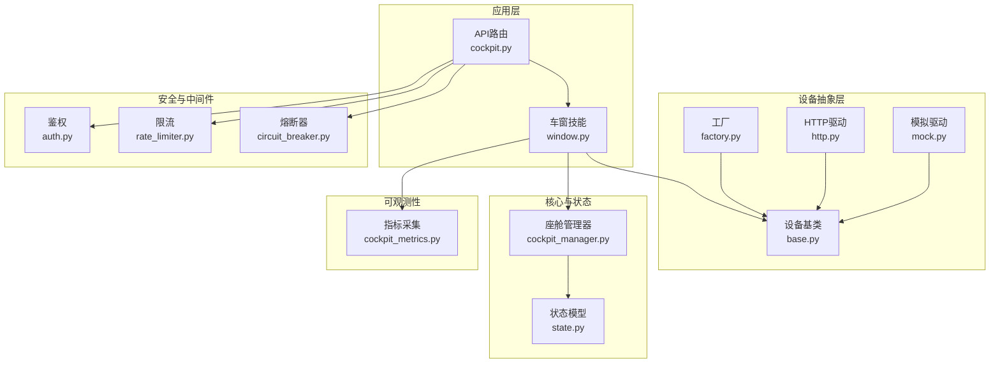
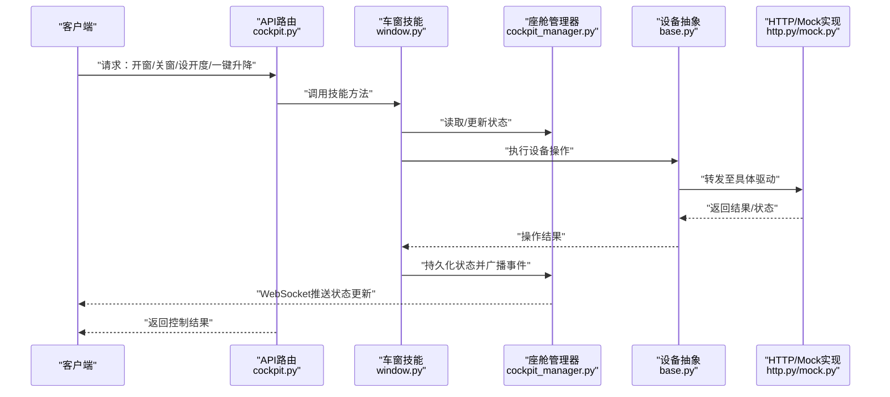
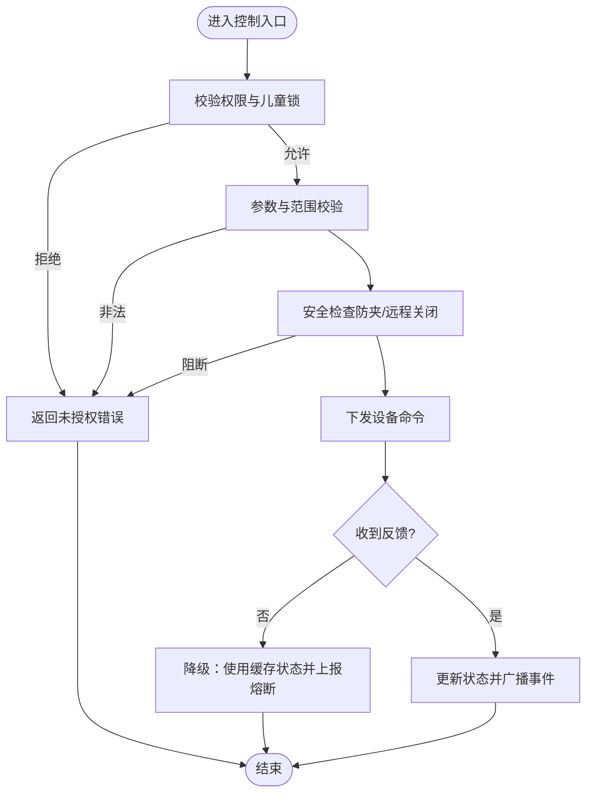
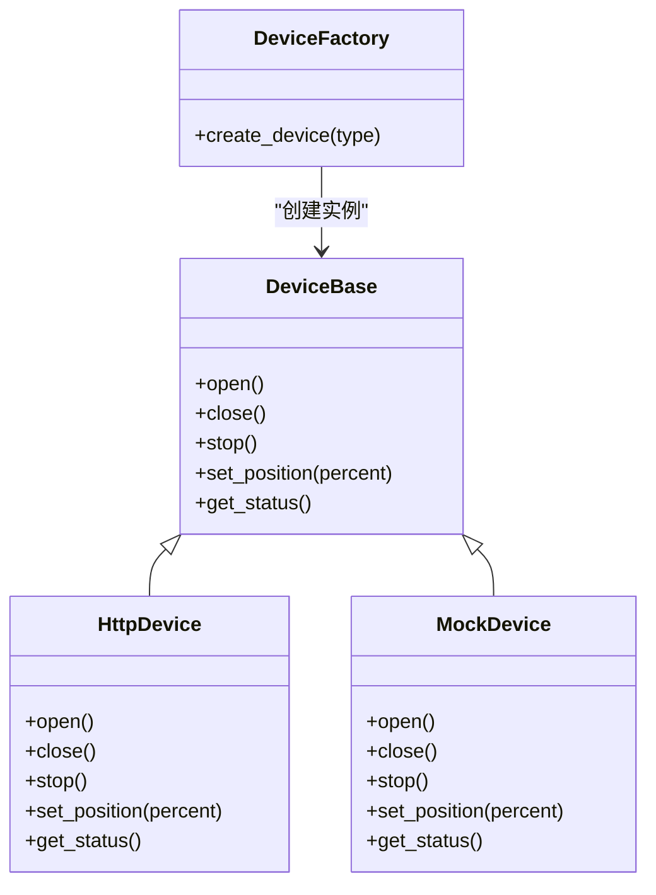
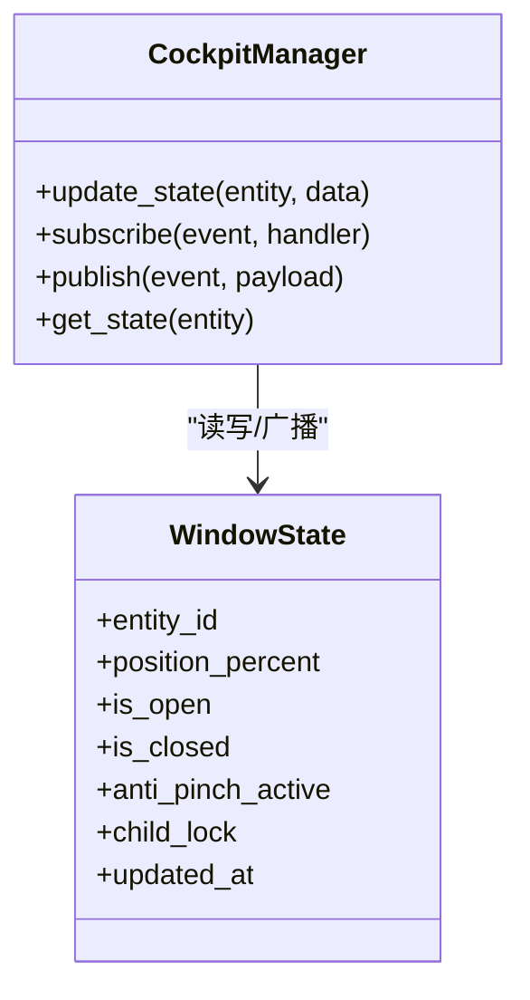
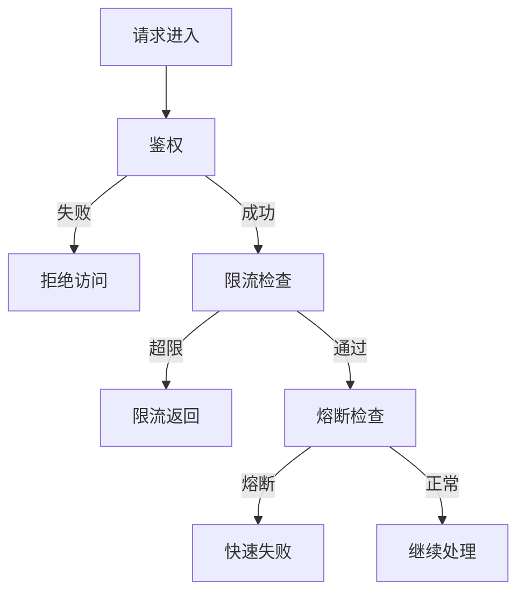
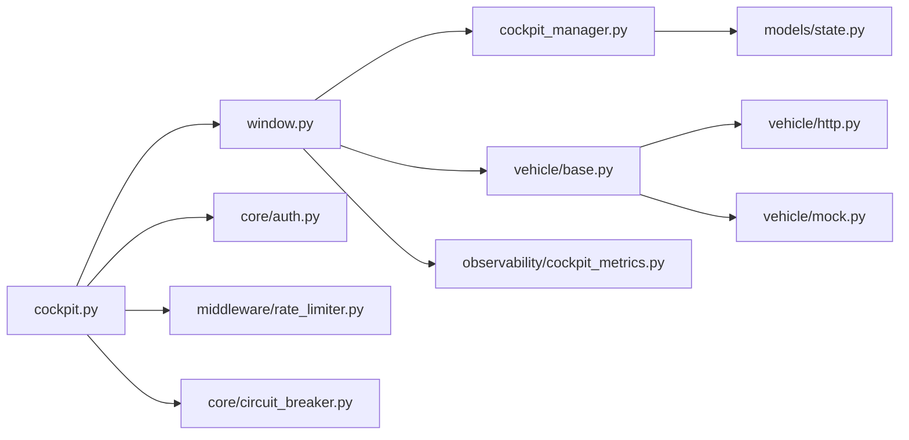

# 车窗控制系统

<cite>
**本文引用的文件**   
- [backend_design/nexus/skills/vehicle/window.py](file://backend_design/nexus/skills/vehicle/window.py)
- [backend_design/nexus/api/routes/cockpit.py](file://backend_design/nexus/api/routes/cockpit.py)
- [backend_design/nexus/core/cockpit_manager.py](file://backend_design/nexus/core/cockpit_manager.py)
- [backend_design/nexus/models/state.py](file://backend_design/nexus/models/state.py)
- [backend_design/nexus/vehicle/base.py](file://backend_design/nexus/vehicle/base.py)
- [backend_design/nexus/vehicle/factory.py](file://backend_design/nexus/vehicle/factory.py)
- [backend_design/nexus/vehicle/http.py](file://backend_design/nexus/vehicle/http.py)
- [backend_design/nexus/vehicle/mock.py](file://backend_design/nexus/vehicle/mock.py)
- [backend_design/nexus/core/auth.py](file://backend_design/nexus/core/auth.py)
- [backend_design/nexus/core/circuit_breaker.py](file://backend_design/nexus/core/circuit_breaker.py)
- [backend_design/nexus/middleware/rate_limiter.py](file://backend_design/nexus/middleware/rate_limiter.py)
- [backend_design/nexus/observability/cockpit_metrics.py](file://backend_design/nexus/observability/cockpit_metrics.py)
</cite>

## 目录
1. [简介](#简介)
2. [项目结构](#项目结构)
3. [核心组件](#核心组件)
4. [架构总览](#架构总览)
5. [详细组件分析](#详细组件分析)
6. [依赖关系分析](#依赖关系分析)
7. [性能考虑](#性能考虑)
8. [故障排查指南](#故障排查指南)
9. [结论](#结论)
10. [附录：API参考与安全规范](#附录api参考与安全规范)

## 简介
本文件面向NexusCockpit的车窗控制系统，覆盖以下能力与主题：
- 开合控制：前/后车窗、天窗、遮阳帘的开/关/停
- 开度调节：百分比控制、一键升降（全开/全关）
- 安全防护：防夹保护、儿童锁、远程关闭
- 状态同步与环境联动：实时状态推送、雨天自动关闭、高温通风
- 用户权限管理：基于角色的访问控制与鉴权
- API接口参考与安全规范：请求/响应模型、错误码、限流熔断、可观测性

## 项目结构
车窗控制相关代码主要位于后端设计目录的skills/vehicle与vehicle子系统中，并通过API路由暴露给前端或外部系统。关键路径如下：
- 技能层：window.py 定义车窗领域逻辑与对外能力
- 设备抽象层：vehicle/base.py、factory.py、http.py、mock.py 提供统一设备接入与模拟实现
- 编排与状态：core/cockpit_manager.py、models/state.py 负责会话级编排与状态管理
- 安全与中间件：core/auth.py、middleware/rate_limiter.py、core/circuit_breaker.py
- 可观测性：observability/cockpit_metrics.py

图表来源
- [backend_design/nexus/api/routes/cockpit.py](file://backend_design/nexus/api/routes/cockpit.py)
- [backend_design/nexus/skills/vehicle/window.py](file://backend_design/nexus/skills/vehicle/window.py)
- [backend_design/nexus/core/cockpit_manager.py](file://backend_design/nexus/core/cockpit_manager.py)
- [backend_design/nexus/models/state.py](file://backend_design/nexus/models/state.py)
- [backend_design/nexus/vehicle/base.py](file://backend_design/nexus/vehicle/base.py)
- [backend_design/nexus/vehicle/factory.py](file://backend_design/nexus/vehicle/factory.py)
- [backend_design/nexus/vehicle/http.py](file://backend_design/nexus/vehicle/http.py)
- [backend_design/nexus/vehicle/mock.py](file://backend_design/nexus/vehicle/mock.py)
- [backend_design/nexus/core/auth.py](file://backend_design/nexus/core/auth.py)
- [backend_design/nexus/middleware/rate_limiter.py](file://backend_design/nexus/middleware/rate_limiter.py)
- [backend_design/nexus/core/circuit_breaker.py](file://backend_design/nexus/core/circuit_breaker.py)
- [backend_design/nexus/observability/cockpit_metrics.py](file://backend_design/nexus/observability/cockpit_metrics.py)

章节来源
- [backend_design/nexus/skills/vehicle/window.py](file://backend_design/nexus/skills/vehicle/window.py)
- [backend_design/nexus/api/routes/cockpit.py](file://backend_design/nexus/api/routes/cockpit.py)
- [backend_design/nexus/core/cockpit_manager.py](file://backend_design/nexus/core/cockpit_manager.py)
- [backend_design/nexus/models/state.py](file://backend_design/nexus/models/state.py)
- [backend_design/nexus/vehicle/base.py](file://backend_design/nexus/vehicle/base.py)
- [backend_design/nexus/vehicle/factory.py](file://backend_design/nexus/vehicle/factory.py)
- [backend_design/nexus/vehicle/http.py](file://backend_design/nexus/vehicle/http.py)
- [backend_design/nexus/vehicle/mock.py](file://backend_design/nexus/vehicle/mock.py)
- [backend_design/nexus/core/auth.py](file://backend_design/nexus/core/auth.py)
- [backend_design/nexus/middleware/rate_limiter.py](file://backend_design/nexus/middleware/rate_limiter.py)
- [backend_design/nexus/core/circuit_breaker.py](file://backend_design/nexus/core/circuit_breaker.py)
- [backend_design/nexus/observability/cockpit_metrics.py](file://backend_design/nexus/observability/cockpit_metrics.py)

## 核心组件
- 车窗技能（window.py）
  - 职责：封装车窗开合、开度调节、一键升降、防夹策略、儿童锁校验、环境联动触发等上层业务逻辑；协调座舱管理器进行状态同步与事件广播。
  - 关键点：对设备抽象层的调用通过统一接口完成，屏蔽底层HTTP/Mock差异；在关键路径上记录指标与日志。
- 设备抽象层（base.py, factory.py, http.py, mock.py）
  - 职责：定义统一的设备操作契约（打开/关闭/停止/设置开度/查询状态），并提供HTTP与Mock两种实现；工厂根据配置选择具体驱动。
  - 关键点：失败重试、超时与熔断集成；Mock用于开发与联调。
- 座舱管理器（cockpit_manager.py）
  - 职责：维护会话上下文、订阅/发布状态变更、协调多技能协作；为车窗技能提供状态读写与事件通道。
- 状态模型（state.py）
  - 职责：定义车窗实体、位置、开关状态、安全标志（防夹、儿童锁）、时间戳等数据结构。
- 安全与中间件（auth.py, rate_limiter.py, circuit_breaker.py）
  - 职责：鉴权、限流、熔断；保障接口可用性与安全性。
- 可观测性（cockpit_metrics.py）
  - 职责：采集车窗控制相关指标（成功率、耗时、异常计数）。

章节来源
- [backend_design/nexus/skills/vehicle/window.py](file://backend_design/nexus/skills/vehicle/window.py)
- [backend_design/nexus/vehicle/base.py](file://backend_design/nexus/vehicle/base.py)
- [backend_design/nexus/vehicle/factory.py](file://backend_design/nexus/vehicle/factory.py)
- [backend_design/nexus/vehicle/http.py](file://backend_design/nexus/vehicle/http.py)
- [backend_design/nexus/vehicle/mock.py](file://backend_design/nexus/vehicle/mock.py)
- [backend_design/nexus/core/cockpit_manager.py](file://backend_design/nexus/core/cockpit_manager.py)
- [backend_design/nexus/models/state.py](file://backend_design/nexus/models/state.py)
- [backend_design/nexus/core/auth.py](file://backend_design/nexus/core/auth.py)
- [backend_design/nexus/middleware/rate_limiter.py](file://backend_design/nexus/middleware/rate_limiter.py)
- [backend_design/nexus/core/circuit_breaker.py](file://backend_design/nexus/core/circuit_breaker.py)
- [backend_design/nexus/observability/cockpit_metrics.py](file://backend_design/nexus/observability/cockpit_metrics.py)

## 架构总览
车窗控制采用“技能+设备抽象”的分层架构：API路由接收请求，交由车窗技能处理业务规则，再通过设备抽象层下发到真实或模拟设备；状态变更经座舱管理器同步并广播，供前端与其他子系统消费。

图表来源
- [backend_design/nexus/api/routes/cockpit.py](file://backend_design/nexus/api/routes/cockpit.py)
- [backend_design/nexus/skills/vehicle/window.py](file://backend_design/nexus/skills/vehicle/window.py)
- [backend_design/nexus/core/cockpit_manager.py](file://backend_design/nexus/core/cockpit_manager.py)
- [backend_design/nexus/vehicle/base.py](file://backend_design/nexus/vehicle/base.py)
- [backend_design/nexus/vehicle/http.py](file://backend_design/nexus/vehicle/http.py)
- [backend_design/nexus/vehicle/mock.py](file://backend_design/nexus/vehicle/mock.py)

## 详细组件分析

### 车窗技能（window.py）
- 功能要点
  - 开合控制：支持前/后车窗、天窗、遮阳帘的打开/关闭/停止
  - 开度调节：按百分比设置目标开度，边界值映射到全开/全关
  - 一键升降：全开/全关快捷指令
  - 安全防护：防夹检测（遇阻回退）、儿童锁（禁止非授权操作）、远程关闭（高优先级）
  - 环境联动：雨天自动关闭、高温通风（结合温度阈值）
- 交互流程
  - 接收API调用 -> 校验权限与参数 -> 检查安全标志 -> 下发设备命令 -> 监听反馈 -> 更新状态 -> 广播事件
- 异常处理
  - 设备不可用/超时：降级为本地缓存状态并上报熔断
  - 防夹触发：立即停止并回退，记录告警
  - 并发冲突：以最新指令为准，避免重复下发

图表来源
- [backend_design/nexus/skills/vehicle/window.py](file://backend_design/nexus/skills/vehicle/window.py)
- [backend_design/nexus/core/cockpit_manager.py](file://backend_design/nexus/core/cockpit_manager.py)
- [backend_design/nexus/core/circuit_breaker.py](file://backend_design/nexus/core/circuit_breaker.py)

章节来源
- [backend_design/nexus/skills/vehicle/window.py](file://backend_design/nexus/skills/vehicle/window.py)
- [backend_design/nexus/core/cockpit_manager.py](file://backend_design/nexus/core/cockpit_manager.py)
- [backend_design/nexus/core/circuit_breaker.py](file://backend_design/nexus/core/circuit_breaker.py)

### 设备抽象层（base.py, factory.py, http.py, mock.py）
- 统一接口
  - 打开/关闭/停止/设置开度/查询状态
  - 错误码与异常类型标准化
- 工厂模式
  - 根据配置选择HTTP或Mock驱动
- HTTP驱动
  - 与车端服务通信，包含重试、超时、熔断
- Mock驱动
  - 开发联调时返回确定性结果，便于测试

图表来源
- [backend_design/nexus/vehicle/base.py](file://backend_design/nexus/vehicle/base.py)
- [backend_design/nexus/vehicle/http.py](file://backend_design/nexus/vehicle/http.py)
- [backend_design/nexus/vehicle/mock.py](file://backend_design/nexus/vehicle/mock.py)
- [backend_design/nexus/vehicle/factory.py](file://backend_design/nexus/vehicle/factory.py)

章节来源
- [backend_design/nexus/vehicle/base.py](file://backend_design/nexus/vehicle/base.py)
- [backend_design/nexus/vehicle/factory.py](file://backend_design/nexus/vehicle/factory.py)
- [backend_design/nexus/vehicle/http.py](file://backend_design/nexus/vehicle/http.py)
- [backend_design/nexus/vehicle/mock.py](file://backend_design/nexus/vehicle/mock.py)

### 座舱管理器与状态（cockpit_manager.py, state.py）
- 座舱管理器
  - 维护会话上下文、订阅/发布状态变更、协调多技能
- 状态模型
  - 定义车窗实体、位置、开关状态、安全标志、时间戳等

图表来源
- [backend_design/nexus/core/cockpit_manager.py](file://backend_design/nexus/core/cockpit_manager.py)
- [backend_design/nexus/models/state.py](file://backend_design/nexus/models/state.py)

章节来源
- [backend_design/nexus/core/cockpit_manager.py](file://backend_design/nexus/core/cockpit_manager.py)
- [backend_design/nexus/models/state.py](file://backend_design/nexus/models/state.py)

### 安全与中间件（auth.py, rate_limiter.py, circuit_breaker.py）
- 鉴权
  - 基于令牌的角色校验，确保仅授权用户可操作车窗
- 限流
  - 防止恶意或突发流量导致设备过载
- 熔断
  - 设备侧异常时快速失败，避免雪崩

图表来源
- [backend_design/nexus/core/auth.py](file://backend_design/nexus/core/auth.py)
- [backend_design/nexus/middleware/rate_limiter.py](file://backend_design/nexus/middleware/rate_limiter.py)
- [backend_design/nexus/core/circuit_breaker.py](file://backend_design/nexus/core/circuit_breaker.py)

章节来源
- [backend_design/nexus/core/auth.py](file://backend_design/nexus/core/auth.py)
- [backend_design/nexus/middleware/rate_limiter.py](file://backend_design/nexus/middleware/rate_limiter.py)
- [backend_design/nexus/core/circuit_breaker.py](file://backend_design/nexus/core/circuit_breaker.py)

### 可观测性（cockpit_metrics.py）
- 指标维度
  - 控制成功率、平均耗时、异常计数、设备不可用次数
- 用途
  - 监控面板展示、告警阈值、容量规划

章节来源
- [backend_design/nexus/observability/cockpit_metrics.py](file://backend_design/nexus/observability/cockpit_metrics.py)

## 依赖关系分析
- 耦合与内聚
  - 车窗技能对内聚合业务规则，对外依赖设备抽象，降低与具体实现的耦合
  - 座舱管理器作为状态中枢，提升模块间协作的内聚性
- 外部依赖
  - HTTP驱动依赖车端服务；Mock驱动用于本地验证
- 潜在循环依赖
  - 通过分层与接口隔离避免循环引用

图表来源
- [backend_design/nexus/api/routes/cockpit.py](file://backend_design/nexus/api/routes/cockpit.py)
- [backend_design/nexus/skills/vehicle/window.py](file://backend_design/nexus/skills/vehicle/window.py)
- [backend_design/nexus/core/cockpit_manager.py](file://backend_design/nexus/core/cockpit_manager.py)
- [backend_design/nexus/models/state.py](file://backend_design/nexus/models/state.py)
- [backend_design/nexus/vehicle/base.py](file://backend_design/nexus/vehicle/base.py)
- [backend_design/nexus/vehicle/http.py](file://backend_design/nexus/vehicle/http.py)
- [backend_design/nexus/vehicle/mock.py](file://backend_design/nexus/vehicle/mock.py)
- [backend_design/nexus/core/auth.py](file://backend_design/nexus/core/auth.py)
- [backend_design/nexus/middleware/rate_limiter.py](file://backend_design/nexus/middleware/rate_limiter.py)
- [backend_design/nexus/core/circuit_breaker.py](file://backend_design/nexus/core/circuit_breaker.py)
- [backend_design/nexus/observability/cockpit_metrics.py](file://backend_design/nexus/observability/cockpit_metrics.py)

章节来源
- [backend_design/nexus/api/routes/cockpit.py](file://backend_design/nexus/api/routes/cockpit.py)
- [backend_design/nexus/skills/vehicle/window.py](file://backend_design/nexus/skills/vehicle/window.py)
- [backend_design/nexus/core/cockpit_manager.py](file://backend_design/nexus/core/cockpit_manager.py)
- [backend_design/nexus/models/state.py](file://backend_design/nexus/models/state.py)
- [backend_design/nexus/vehicle/base.py](file://backend_design/nexus/vehicle/base.py)
- [backend_design/nexus/vehicle/http.py](file://backend_design/nexus/vehicle/http.py)
- [backend_design/nexus/vehicle/mock.py](file://backend_design/nexus/vehicle/mock.py)
- [backend_design/nexus/core/auth.py](file://backend_design/nexus/core/auth.py)
- [backend_design/nexus/middleware/rate_limiter.py](file://backend_design/nexus/middleware/rate_limiter.py)
- [backend_design/nexus/core/circuit_breaker.py](file://backend_design/nexus/core/circuit_breaker.py)
- [backend_design/nexus/observability/cockpit_metrics.py](file://backend_design/nexus/observability/cockpit_metrics.py)

## 性能考虑
- 批量操作与合并：对同一实体的多次开度调整建议合并为一次下发，减少总线负载
- 异步与背压：设备反馈延迟时采用队列与超时控制，避免阻塞主线程
- 缓存与去抖：高频状态查询使用本地缓存与去抖策略
- 熔断与降级：设备不可用时快速失败，优先保证系统可用性

[本节为通用指导，不直接分析具体文件]

## 故障排查指南
- 常见问题
  - 设备无响应：检查HTTP驱动连通性、超时与重试配置、熔断状态
  - 防夹误触发：查看防夹标志位与最近操作日志，确认机械阻力与传感器状态
  - 权限不足：核对令牌角色与儿童锁设置
  - 限流触发：评估请求频率与配额，必要时扩容或优化调用策略
- 定位手段
  - 查看可观测性指标与日志
  - 使用Mock驱动复现问题
  - 通过座舱管理器获取历史状态与事件

章节来源
- [backend_design/nexus/observability/cockpit_metrics.py](file://backend_design/nexus/observability/cockpit_metrics.py)
- [backend_design/nexus/vehicle/http.py](file://backend_design/nexus/vehicle/http.py)
- [backend_design/nexus/vehicle/mock.py](file://backend_design/nexus/vehicle/mock.py)
- [backend_design/nexus/core/circuit_breaker.py](file://backend_design/nexus/core/circuit_breaker.py)
- [backend_design/nexus/core/auth.py](file://backend_design/nexus/core/auth.py)
- [backend_design/nexus/middleware/rate_limiter.py](file://backend_design/nexus/middleware/rate_limiter.py)

## 结论
车窗控制系统通过清晰的分层与抽象，实现了开合控制、开度调节、安全防护与环境联动的完整闭环。借助鉴权、限流与熔断机制，系统在安全性与可用性方面具备良好保障。配合可观测性指标与状态同步，便于运维监控与问题定位。

[本节为总结，不直接分析具体文件]

## 附录：API参考与安全规范

### API概览
- 控制接口
  - 打开/关闭/停止：针对指定车窗实体执行对应动作
  - 设置开度：按百分比设定目标位置，边界值映射为全开/全关
  - 一键升降：全开/全关快捷指令
- 查询接口
  - 获取当前状态：返回各车窗实体的位置、开关状态与安全标志
- 事件推送
  - WebSocket推送状态变更与告警事件

章节来源
- [backend_design/nexus/api/routes/cockpit.py](file://backend_design/nexus/api/routes/cockpit.py)
- [backend_design/nexus/models/state.py](file://backend_design/nexus/models/state.py)

### 请求/响应模型
- 请求字段
  - 实体标识、动作类型、目标开度（可选）、附加参数（如是否忽略儿童锁）
- 响应字段
  - 操作结果、当前状态快照、错误码与消息
- 错误码
  - 未授权、参数非法、设备不可用、熔断中、限流中

章节来源
- [backend_design/nexus/api/routes/cockpit.py](file://backend_design/nexus/api/routes/cockpit.py)
- [backend_design/nexus/core/auth.py](file://backend_design/nexus/core/auth.py)
- [backend_design/nexus/middleware/rate_limiter.py](file://backend_design/nexus/middleware/rate_limiter.py)
- [backend_design/nexus/core/circuit_breaker.py](file://backend_design/nexus/core/circuit_breaker.py)

### 安全规范
- 鉴权与授权
  - 所有控制接口需携带有效令牌，并具备相应角色
- 儿童锁
  - 非授权用户无法执行开合操作
- 防夹保护
  - 遇阻立即停止并回退，记录告警
- 远程关闭
  - 高优先级指令可中断正在进行的开合动作
- 限流与熔断
  - 限制单位时间内请求数；设备异常时快速失败，避免雪崩

章节来源
- [backend_design/nexus/core/auth.py](file://backend_design/nexus/core/auth.py)
- [backend_design/nexus/skills/vehicle/window.py](file://backend_design/nexus/skills/vehicle/window.py)
- [backend_design/nexus/middleware/rate_limiter.py](file://backend_design/nexus/middleware/rate_limiter.py)
- [backend_design/nexus/core/circuit_breaker.py](file://backend_design/nexus/core/circuit_breaker.py)