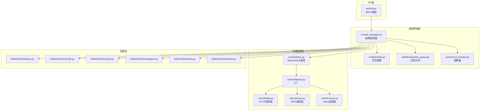
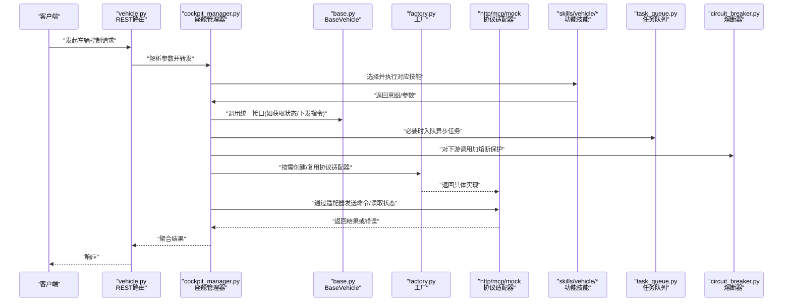
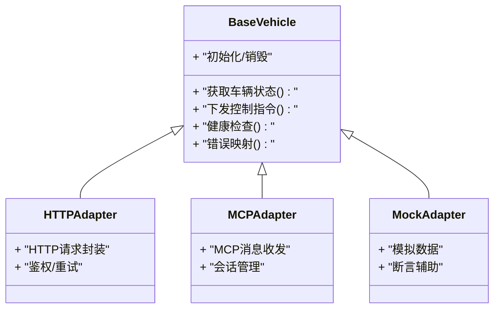
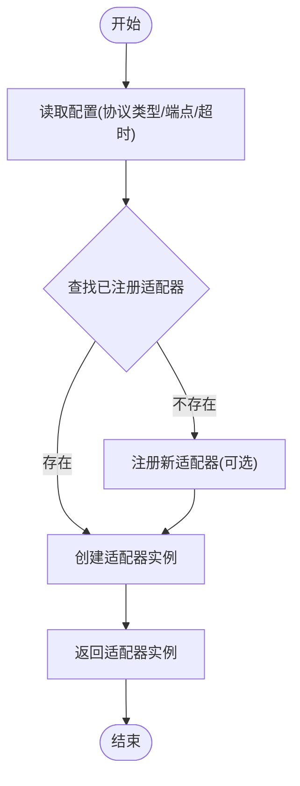
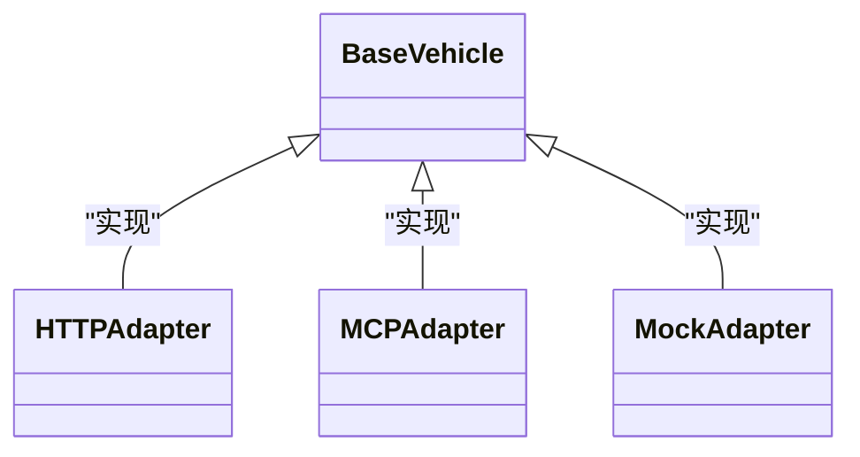
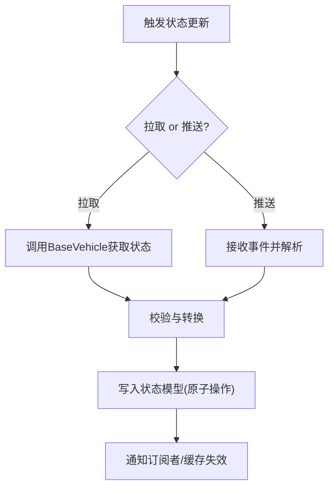
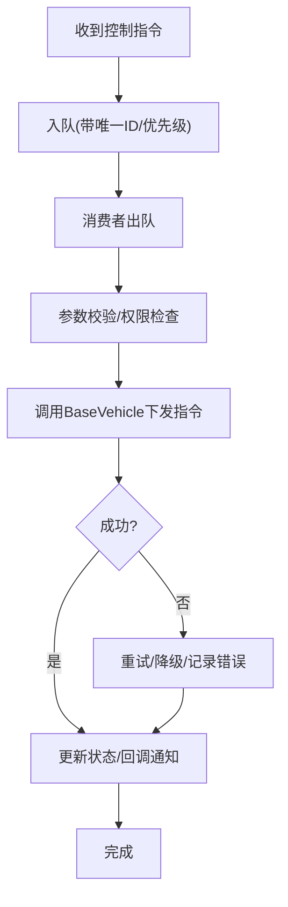
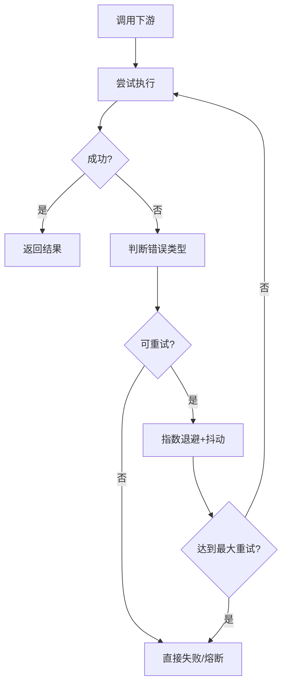
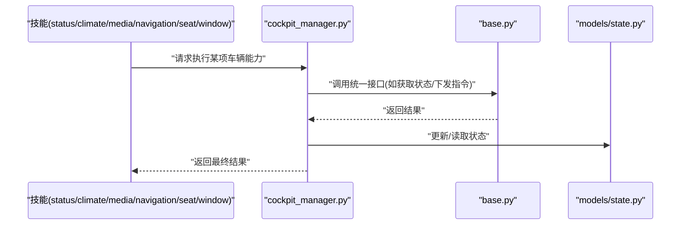
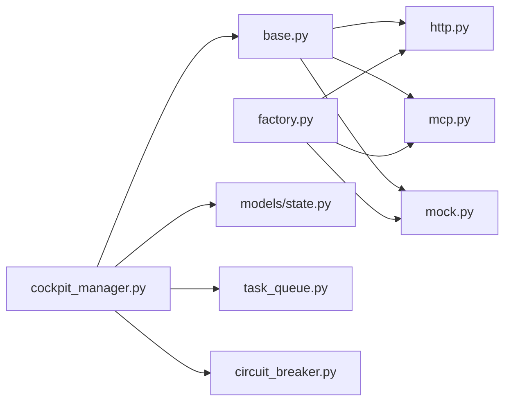

# 车辆控制架构设计

<cite>
**本文引用的文件**   
- [backend_design/nexus/vehicle/base.py](file://backend_design/nexus/vehicle/base.py)
- [backend_design/nexus/vehicle/factory.py](file://backend_design/nexus/vehicle/factory.py)
- [backend_design/nexus/vehicle/http.py](file://backend_design/nexus/vehicle/http.py)
- [backend_design/nexus/vehicle/mcp.py](file://backend_design/nexus/vehicle/mcp.py)
- [backend_design/nexus/vehicle/mock.py](file://backend_design/nexus/vehicle/mock.py)
- [backend_design/nexus/api/routes/vehicle.py](file://backend_design/nexus/api/routes/vehicle.py)
- [backend_design/nexus/core/cockpit_manager.py](file://backend_design/nexus/core/cockpit_manager.py)
- [backend_design/nexus/models/state.py](file://backend_design/nexus/models/state.py)
- [backend_design/nexus/skills/vehicle/status.py](file://backend_design/nexus/skills/vehicle/status.py)
- [backend_design/nexus/skills/vehicle/climate.py](file://backend_design/nexus/skills/vehicle/climate.py)
- [backend_design/nexus/skills/vehicle/media.py](file://backend_design/nexus/skills/vehicle/media.py)
- [backend_design/nexus/skills/vehicle/navigation.py](file://backend_design/nexus/skills/vehicle/navigation.py)
- [backend_design/nexus/skills/vehicle/seat.py](file://backend_design/nexus/skills/vehicle/seat.py)
- [backend_design/nexus/skills/vehicle/window.py](file://backend_design/nexus/skills/vehicle/window.py)
- [backend_design/nexus/middleware/task_queue.py](file://backend_design/nexus/middleware/task_queue.py)
- [backend_design/nexus/core/circuit_breaker.py](file://backend_design/nexus/core/circuit_breaker.py)
- [backend_design/nexus/config.py](file://backend_design/nexus/config.py)
</cite>

## 目录
1. [简介](#简介)
2. [项目结构](#项目结构)
3. [核心组件](#核心组件)
4. [架构总览](#架构总览)
5. [详细组件分析](#详细组件分析)
6. [依赖关系分析](#依赖关系分析)
7. [性能考虑](#性能考虑)
8. [故障排查指南](#故障排查指南)
9. [结论](#结论)
10. [附录：扩展新协议开发指南](#附录扩展新协议开发指南)

## 简介
本文件面向NexusCockpit的车辆控制子系统，聚焦于“车辆API抽象层”的设计与实现。文档围绕以下目标展开：
- BaseVehicle基类的核心接口定义与职责边界
- Factory工厂模式的动态创建机制
- 多协议统一抽象（HTTP、MCP、Mock）及适配器模式
- 车辆状态管理、命令队列系统、错误处理与重试策略
- 架构图与交互流程图，说明模块依赖与数据流向
- 扩展新车辆协议的完整开发指南

## 项目结构
与车辆控制相关的代码主要位于 backend_design/nexus 下，关键目录与文件如下：
- vehicle：车辆协议抽象与具体实现（BaseVehicle、Factory、HTTP/MCP/Mock）
- api/routes/vehicle.py：对外暴露的车辆控制REST API路由
- core/cockpit_manager.py：座舱级管理器，协调技能与车辆能力
- models/state.py：车辆状态模型
- skills/vehicle/*：按功能域划分的车辆技能（空调、媒体、导航、座椅、车窗等）
- middleware/task_queue.py：任务队列中间件
- core/circuit_breaker.py：熔断器，用于外部调用保护
- config.py：配置项（包含车辆相关配置）

图表来源
- [backend_design/nexus/api/routes/vehicle.py](file://backend_design/nexus/api/routes/vehicle.py)
- [backend_design/nexus/core/cockpit_manager.py](file://backend_design/nexus/core/cockpit_manager.py)
- [backend_design/nexus/models/state.py](file://backend_design/nexus/models/state.py)
- [backend_design/nexus/middleware/task_queue.py](file://backend_design/nexus/middleware/task_queue.py)
- [backend_design/nexus/core/circuit_breaker.py](file://backend_design/nexus/core/circuit_breaker.py)
- [backend_design/nexus/vehicle/base.py](file://backend_design/nexus/vehicle/base.py)
- [backend_design/nexus/vehicle/factory.py](file://backend_design/nexus/vehicle/factory.py)
- [backend_design/nexus/vehicle/http.py](file://backend_design/nexus/vehicle/http.py)
- [backend_design/nexus/vehicle/mcp.py](file://backend_design/nexus/vehicle/mcp.py)
- [backend_design/nexus/vehicle/mock.py](file://backend_design/nexus/vehicle/mock.py)
- [backend_design/nexus/skills/vehicle/status.py](file://backend_design/nexus/skills/vehicle/status.py)
- [backend_design/nexus/skills/vehicle/climate.py](file://backend_design/nexus/skills/vehicle/climate.py)
- [backend_design/nexus/skills/vehicle/media.py](file://backend_design/nexus/skills/vehicle/media.py)
- [backend_design/nexus/skills/vehicle/navigation.py](file://backend_design/nexus/skills/vehicle/navigation.py)
- [backend_design/nexus/skills/vehicle/seat.py](file://backend_design/nexus/skills/vehicle/seat.py)
- [backend_design/nexus/skills/vehicle/window.py](file://backend_design/nexus/skills/vehicle/window.py)

章节来源
- [backend_design/nexus/vehicle/base.py](file://backend_design/nexus/vehicle/base.py)
- [backend_design/nexus/vehicle/factory.py](file://backend_design/nexus/vehicle/factory.py)
- [backend_design/nexus/vehicle/http.py](file://backend_design/nexus/vehicle/http.py)
- [backend_design/nexus/vehicle/mcp.py](file://backend_design/nexus/vehicle/mcp.py)
- [backend_design/nexus/vehicle/mock.py](file://backend_design/nexus/vehicle/mock.py)
- [backend_design/nexus/api/routes/vehicle.py](file://backend_design/nexus/api/routes/vehicle.py)
- [backend_design/nexus/core/cockpit_manager.py](file://backend_design/nexus/core/cockpit_manager.py)
- [backend_design/nexus/models/state.py](file://backend_design/nexus/models/state.py)
- [backend_design/nexus/skills/vehicle/status.py](file://backend_design/nexus/skills/vehicle/status.py)
- [backend_design/nexus/skills/vehicle/climate.py](file://backend_design/nexus/skills/vehicle/climate.py)
- [backend_design/nexus/skills/vehicle/media.py](file://backend_design/nexus/skills/vehicle/media.py)
- [backend_design/nexus/skills/vehicle/navigation.py](file://backend_design/nexus/skills/vehicle/navigation.py)
- [backend_design/nexus/skills/vehicle/seat.py](file://backend_design/nexus/skills/vehicle/seat.py)
- [backend_design/nexus/skills/vehicle/window.py](file://backend_design/nexus/skills/vehicle/window.py)
- [backend_design/nexus/middleware/task_queue.py](file://backend_design/nexus/middleware/task_queue.py)
- [backend_design/nexus/core/circuit_breaker.py](file://backend_design/nexus/core/circuit_breaker.py)
- [backend_design/nexus/config.py](file://backend_design/nexus/config.py)

## 核心组件
本节聚焦车辆API抽象层的关键构件及其职责：
- BaseVehicle：定义统一的车辆能力接口（如查询状态、下发控制指令），屏蔽底层协议差异
- Factory：根据配置或运行时参数动态选择并实例化具体协议适配器（HTTP/MCP/Mock）
- 协议适配器：HTTP、MCP、Mock分别实现与不同后端系统的通信方式
- 座舱管理器：协调上层技能与车辆抽象层，负责编排调用、状态同步与异常处理
- 状态模型：集中描述车辆当前状态的结构化表示
- 任务队列：将耗时或需要背压的命令入队，保障稳定性与可观测性
- 熔断器：对下游不稳定服务进行快速失败与退避，避免雪崩

章节来源
- [backend_design/nexus/vehicle/base.py](file://backend_design/nexus/vehicle/base.py)
- [backend_design/nexus/vehicle/factory.py](file://backend_design/nexus/vehicle/factory.py)
- [backend_design/nexus/vehicle/http.py](file://backend_design/nexus/vehicle/http.py)
- [backend_design/nexus/vehicle/mcp.py](file://backend_design/nexus/vehicle/mcp.py)
- [backend_design/nexus/vehicle/mock.py](file://backend_design/nexus/vehicle/mock.py)
- [backend_design/nexus/core/cockpit_manager.py](file://backend_design/nexus/core/cockpit_manager.py)
- [backend_design/nexus/models/state.py](file://backend_design/nexus/models/state.py)
- [backend_design/nexus/middleware/task_queue.py](file://backend_design/nexus/middleware/task_queue.py)
- [backend_design/nexus/core/circuit_breaker.py](file://backend_design/nexus/core/circuit_breaker.py)

## 架构总览
下图展示了从API到车辆后端的整体调用链路，以及各组件间的依赖关系。

图表来源
- [backend_design/nexus/api/routes/vehicle.py](file://backend_design/nexus/api/routes/vehicle.py)
- [backend_design/nexus/core/cockpit_manager.py](file://backend_design/nexus/core/cockpit_manager.py)
- [backend_design/nexus/vehicle/base.py](file://backend_design/nexus/vehicle/base.py)
- [backend_design/nexus/vehicle/factory.py](file://backend_design/nexus/vehicle/factory.py)
- [backend_design/nexus/vehicle/http.py](file://backend_design/nexus/vehicle/http.py)
- [backend_design/nexus/vehicle/mcp.py](file://backend_design/nexus/vehicle/mcp.py)
- [backend_design/nexus/vehicle/mock.py](file://backend_design/nexus/vehicle/mock.py)
- [backend_design/nexus/skills/vehicle/status.py](file://backend_design/nexus/skills/vehicle/status.py)
- [backend_design/nexus/skills/vehicle/climate.py](file://backend_design/nexus/skills/vehicle/climate.py)
- [backend_design/nexus/skills/vehicle/media.py](file://backend_design/nexus/skills/vehicle/media.py)
- [backend_design/nexus/skills/vehicle/navigation.py](file://backend_design/nexus/skills/vehicle/navigation.py)
- [backend_design/nexus/skills/vehicle/seat.py](file://backend_design/nexus/skills/vehicle/seat.py)
- [backend_design/nexus/skills/vehicle/window.py](file://backend_design/nexus/skills/vehicle/window.py)
- [backend_design/nexus/middleware/task_queue.py](file://backend_design/nexus/middleware/task_queue.py)
- [backend_design/nexus/core/circuit_breaker.py](file://backend_design/nexus/core/circuit_breaker.py)

## 详细组件分析

### BaseVehicle基类与统一接口
- 设计目标：为所有协议适配器提供一致的抽象，使上层无需关心底层是HTTP、MCP还是Mock
- 典型职责：
  - 定义通用方法：如获取车辆状态、下发控制指令、健康检查等
  - 提供生命周期钩子：初始化、连接建立、资源释放
  - 统一错误映射：将底层异常转换为内部一致的错误类型
- 复杂度与可扩展性：新增协议只需实现相同接口，不影响上层逻辑

图表来源
- [backend_design/nexus/vehicle/base.py](file://backend_design/nexus/vehicle/base.py)
- [backend_design/nexus/vehicle/http.py](file://backend_design/nexus/vehicle/http.py)
- [backend_design/nexus/vehicle/mcp.py](file://backend_design/nexus/vehicle/mcp.py)
- [backend_design/nexus/vehicle/mock.py](file://backend_design/nexus/vehicle/mock.py)

章节来源
- [backend_design/nexus/vehicle/base.py](file://backend_design/nexus/vehicle/base.py)
- [backend_design/nexus/vehicle/http.py](file://backend_design/nexus/vehicle/http.py)
- [backend_design/nexus/vehicle/mcp.py](file://backend_design/nexus/vehicle/mcp.py)
- [backend_design/nexus/vehicle/mock.py](file://backend_design/nexus/vehicle/mock.py)

### Factory工厂模式与动态创建
- 设计目标：根据配置或上下文动态选择并创建具体协议适配器，支持热切换与测试隔离
- 关键特性：
  - 注册表/映射：维护协议名称到实现的映射
  - 创建策略：依据配置项（如协议类型、端点、超时）构造实例
  - 生命周期管理：单例或池化复用，避免频繁创建开销
- 适用场景：在部署环境切换（生产/预发/本地）、灰度发布时灵活选择后端

图表来源
- [backend_design/nexus/vehicle/factory.py](file://backend_design/nexus/vehicle/factory.py)
- [backend_design/nexus/vehicle/http.py](file://backend_design/nexus/vehicle/http.py)
- [backend_design/nexus/vehicle/mcp.py](file://backend_design/nexus/vehicle/mcp.py)
- [backend_design/nexus/vehicle/mock.py](file://backend_design/nexus/vehicle/mock.py)

章节来源
- [backend_design/nexus/vehicle/factory.py](file://backend_design/nexus/vehicle/factory.py)

### 多协议统一抽象与适配器模式
- 统一抽象：所有适配器均继承自BaseVehicle，对外暴露一致的方法签名
- 适配差异：
  - HTTP适配器：封装HTTP请求、鉴权、序列化/反序列化、重试与熔断
  - MCP适配器：基于消息通道进行双向通信，管理会话与消息路由
  - Mock适配器：返回预设数据，便于联调与自动化测试
- 扩展性：新增协议仅需实现BaseVehicle接口并通过Factory注册

图表来源
- [backend_design/nexus/vehicle/base.py](file://backend_design/nexus/vehicle/base.py)
- [backend_design/nexus/vehicle/http.py](file://backend_design/nexus/vehicle/http.py)
- [backend_design/nexus/vehicle/mcp.py](file://backend_design/nexus/vehicle/mcp.py)
- [backend_design/nexus/vehicle/mock.py](file://backend_design/nexus/vehicle/mock.py)

章节来源
- [backend_design/nexus/vehicle/base.py](file://backend_design/nexus/vehicle/base.py)
- [backend_design/nexus/vehicle/http.py](file://backend_design/nexus/vehicle/http.py)
- [backend_design/nexus/vehicle/mcp.py](file://backend_design/nexus/vehicle/mcp.py)
- [backend_design/nexus/vehicle/mock.py](file://backend_design/nexus/vehicle/mock.py)

### 车辆状态管理机制
- 状态模型：集中定义车辆状态的字段与约束，确保跨模块一致性
- 更新路径：
  - 主动拉取：通过BaseVehicle接口定时或按需拉取最新状态
  - 事件推送：由后端通过MCP或其他通道推送状态变更
  - 缓存与去抖：结合内存缓存与防抖策略降低抖动与重复计算
- 一致性：在并发场景下采用锁或不可变快照保证读一致性

图表来源
- [backend_design/nexus/models/state.py](file://backend_design/nexus/models/state.py)
- [backend_design/nexus/vehicle/base.py](file://backend_design/nexus/vehicle/base.py)

章节来源
- [backend_design/nexus/models/state.py](file://backend_design/nexus/models/state.py)
- [backend_design/nexus/vehicle/base.py](file://backend_design/nexus/vehicle/base.py)

### 命令队列系统与执行流程
- 目的：对耗时或高并发命令进行排队与限流，提升系统稳定性
- 关键流程：
  - 入队：将控制指令包装为任务对象，加入队列
  - 调度：后台消费者按优先级/速率限制执行
  - 幂等与去重：基于指令ID去重，避免重复下发
  - 完成回调：执行完成后更新状态并通知上层

图表来源
- [backend_design/nexus/middleware/task_queue.py](file://backend_design/nexus/middleware/task_queue.py)
- [backend_design/nexus/vehicle/base.py](file://backend_design/nexus/vehicle/base.py)

章节来源
- [backend_design/nexus/middleware/task_queue.py](file://backend_design/nexus/middleware/task_queue.py)
- [backend_design/nexus/vehicle/base.py](file://backend_design/nexus/vehicle/base.py)

### 错误处理与重试策略
- 错误分类：网络错误、业务错误、超时、熔断触发等
- 重试策略：
  - 指数退避与抖动：避免瞬时拥塞导致的再次失败
  - 最大重试次数与超时控制：防止无限重试
  - 幂等性保障：确保重试不会导致副作用
- 熔断器：当错误率超过阈值时快速失败，等待恢复后再试探性恢复流量

图表来源
- [backend_design/nexus/core/circuit_breaker.py](file://backend_design/nexus/core/circuit_breaker.py)
- [backend_design/nexus/vehicle/http.py](file://backend_design/nexus/vehicle/http.py)

章节来源
- [backend_design/nexus/core/circuit_breaker.py](file://backend_design/nexus/core/circuit_breaker.py)
- [backend_design/nexus/vehicle/http.py](file://backend_design/nexus/vehicle/http.py)

### 座舱管理器与技能编排
- 角色定位：作为上层技能与车辆抽象层的协调者，负责：
  - 技能选择与参数组装
  - 调用BaseVehicle统一接口
  - 状态同步与结果聚合
  - 异常捕获与上报
- 与状态模型协作：在技能执行前后读写状态，保证视图与后端一致

图表来源
- [backend_design/nexus/core/cockpit_manager.py](file://backend_design/nexus/core/cockpit_manager.py)
- [backend_design/nexus/vehicle/base.py](file://backend_design/nexus/vehicle/base.py)
- [backend_design/nexus/models/state.py](file://backend_design/nexus/models/state.py)
- [backend_design/nexus/skills/vehicle/status.py](file://backend_design/nexus/skills/vehicle/status.py)
- [backend_design/nexus/skills/vehicle/climate.py](file://backend_design/nexus/skills/vehicle/climate.py)
- [backend_design/nexus/skills/vehicle/media.py](file://backend_design/nexus/skills/vehicle/media.py)
- [backend_design/nexus/skills/vehicle/navigation.py](file://backend_design/nexus/skills/vehicle/navigation.py)
- [backend_design/nexus/skills/vehicle/seat.py](file://backend_design/nexus/skills/vehicle/seat.py)
- [backend_design/nexus/skills/vehicle/window.py](file://backend_design/nexus/skills/vehicle/window.py)

章节来源
- [backend_design/nexus/core/cockpit_manager.py](file://backend_design/nexus/core/cockpit_manager.py)
- [backend_design/nexus/models/state.py](file://backend_design/nexus/models/state.py)
- [backend_design/nexus/skills/vehicle/status.py](file://backend_design/nexus/skills/vehicle/status.py)
- [backend_design/nexus/skills/vehicle/climate.py](file://backend_design/nexus/skills/vehicle/climate.py)
- [backend_design/nexus/skills/vehicle/media.py](file://backend_design/nexus/skills/vehicle/media.py)
- [backend_design/nexus/skills/vehicle/navigation.py](file://backend_design/nexus/skills/vehicle/navigation.py)
- [backend_design/nexus/skills/vehicle/seat.py](file://backend_design/nexus/skills/vehicle/seat.py)
- [backend_design/nexus/skills/vehicle/window.py](file://backend_design/nexus/skills/vehicle/window.py)

## 依赖关系分析
- 耦合与内聚：
  - BaseVehicle与适配器之间松耦合，通过接口解耦
  - Factory集中管理协议选择，降低散落的条件分支
  - 座舱管理器聚合技能与车辆能力，保持单一职责
- 外部依赖：
  - HTTP适配器依赖网络库
  - MCP适配器依赖消息通道
  - 任务队列与熔断器为横切关注点，被多处复用

图表来源
- [backend_design/nexus/vehicle/base.py](file://backend_design/nexus/vehicle/base.py)
- [backend_design/nexus/vehicle/factory.py](file://backend_design/nexus/vehicle/factory.py)
- [backend_design/nexus/vehicle/http.py](file://backend_design/nexus/vehicle/http.py)
- [backend_design/nexus/vehicle/mcp.py](file://backend_design/nexus/vehicle/mcp.py)
- [backend_design/nexus/vehicle/mock.py](file://backend_design/nexus/vehicle/mock.py)
- [backend_design/nexus/core/cockpit_manager.py](file://backend_design/nexus/core/cockpit_manager.py)
- [backend_design/nexus/models/state.py](file://backend_design/nexus/models/state.py)
- [backend_design/nexus/middleware/task_queue.py](file://backend_design/nexus/middleware/task_queue.py)
- [backend_design/nexus/core/circuit_breaker.py](file://backend_design/nexus/core/circuit_breaker.py)

章节来源
- [backend_design/nexus/vehicle/base.py](file://backend_design/nexus/vehicle/base.py)
- [backend_design/nexus/vehicle/factory.py](file://backend_design/nexus/vehicle/factory.py)
- [backend_design/nexus/vehicle/http.py](file://backend_design/nexus/vehicle/http.py)
- [backend_design/nexus/vehicle/mcp.py](file://backend_design/nexus/vehicle/mcp.py)
- [backend_design/nexus/vehicle/mock.py](file://backend_design/nexus/vehicle/mock.py)
- [backend_design/nexus/core/cockpit_manager.py](file://backend_design/nexus/core/cockpit_manager.py)
- [backend_design/nexus/models/state.py](file://backend_design/nexus/models/state.py)
- [backend_design/nexus/middleware/task_queue.py](file://backend_design/nexus/middleware/task_queue.py)
- [backend_design/nexus/core/circuit_breaker.py](file://backend_design/nexus/core/circuit_breaker.py)

## 性能考虑
- 连接复用与池化：对HTTP/MCP连接进行池化管理，减少握手开销
- 批量与合并：对高频状态拉取进行批量化与合并，降低带宽与CPU占用
- 缓存与去抖：热点状态使用短TTL缓存，配合去抖避免风暴
- 背压与限流：任务队列结合令牌桶/漏桶限流，保护下游
- 熔断与快速失败：在高错误率时快速失败，避免级联故障
- 监控与指标：记录延迟、吞吐、错误率、熔断状态等关键指标

[本节为通用指导，不直接分析具体文件]

## 故障排查指南
- 常见问题定位：
  - 协议不通：检查Factory配置与适配器初始化日志
  - 状态不一致：核对状态更新路径与缓存失效策略
  - 指令未生效：查看任务队列消费情况与重试记录
  - 熔断触发：观察错误率与恢复时间，调整阈值
- 建议的排障步骤：
  - 启用详细日志与追踪ID，串联请求链路
  - 使用Mock适配器验证上层逻辑正确性
  - 逐步放开流量，观察指标变化
  - 对关键路径增加告警与自动回滚

章节来源
- [backend_design/nexus/core/circuit_breaker.py](file://backend_design/nexus/core/circuit_breaker.py)
- [backend_design/nexus/middleware/task_queue.py](file://backend_design/nexus/middleware/task_queue.py)
- [backend_design/nexus/vehicle/factory.py](file://backend_design/nexus/vehicle/factory.py)

## 结论
本架构通过BaseVehicle统一抽象与Factory动态创建，实现了HTTP、MCP、Mock等多协议的无缝切换；借助座舱管理器、状态模型、任务队列与熔断器，构建了稳定、可扩展且可观测的车辆控制体系。该设计既满足当前多协议需求，也为未来扩展更多协议与能力预留了良好空间。

[本节为总结，不直接分析具体文件]

## 附录：扩展新协议开发指南
- 步骤概览：
  1. 新建适配器文件（例如 new_protocol.py），继承BaseVehicle并实现必要方法
  2. 在Factory中注册新协议名称到实现的映射
  3. 在配置文件中添加新协议相关参数（如端点、鉴权信息、超时）
  4. 编写单元测试，优先使用Mock适配器验证上层逻辑
  5. 集成测试：在预发环境验证端到端流程
  6. 上线灰度：逐步放量并监控关键指标
- 注意事项：
  - 严格遵循BaseVehicle接口契约，避免破坏兼容性
  - 实现幂等与重试策略，确保可靠性
  - 做好错误映射与日志埋点，便于问题定位
  - 对敏感信息进行加密与最小权限访问

章节来源
- [backend_design/nexus/vehicle/base.py](file://backend_design/nexus/vehicle/base.py)
- [backend_design/nexus/vehicle/factory.py](file://backend_design/nexus/vehicle/factory.py)
- [backend_design/nexus/config.py](file://backend_design/nexus/config.py)