# 车辆控制系统

<cite>
**本文引用的文件**   
- [backend_design/nexus/vehicle/base.py](file://backend_design/nexus/vehicle/base.py)
- [backend_design/nexus/vehicle/factory.py](file://backend_design/nexus/vehicle/factory.py)
- [backend_design/nexus/vehicle/http.py](file://backend_design/nexus/vehicle/http.py)
- [backend_design/nexus/vehicle/mcp.py](file://backend_design/nexus/vehicle/mcp.py)
- [backend_design/nexus/vehicle/mock.py](file://backend_design/nexus/vehicle/mock.py)
- [backend_design/nexus/skills/vehicle/climate.py](file://backend_design/nexus/skills/vehicle/climate.py)
- [backend_design/nexus/skills/vehicle/navigation.py](file://backend_design/nexus/skills/vehicle/navigation.py)
- [backend_design/nexus/skills/vehicle/media.py](file://backend_design/nexus/skills/vehicle/media.py)
- [backend_design/nexus/skills/vehicle/seat.py](file://backend_design/nexus/skills/vehicle/seat.py)
- [backend_design/nexus/skills/vehicle/window.py](file://backend_design/nexus/skills/vehicle/window.py)
- [backend_design/nexus/skills/vehicle/status.py](file://backend_design/nexus/skills/vehicle/status.py)
- [backend_design/nexus/api/routes/vehicle.py](file://backend_design/nexus/api/routes/vehicle.py)
- [backend_design/nexus/core/circuit_breaker.py](file://backend_design/nexus/core/circuit_breaker.py)
- [backend_design/nexus/middleware/task_queue.py](file://backend_design/nexus/middleware/task_queue.py)
- [backend_design/nexus/models/state.py](file://backend_design/nexus/models/state.py)
- [backend_design/nexus/models/schemas.py](file://backend_design/nexus/models/schemas.py)
</cite>

## 目录
1. [简介](#简介)
2. [项目结构](#项目结构)
3. [核心组件](#核心组件)
4. [架构总览](#架构总览)
5. [详细组件分析](#详细组件分析)
6. [依赖关系分析](#依赖关系分析)
7. [性能考虑](#性能考虑)
8. [故障排查指南](#故障排查指南)
9. [结论](#结论)
10. [附录：API参考与示例](#附录api参考与示例)

## 简介
本文件为 NexusCockpit 车辆控制系统的技术文档，聚焦于“车辆 API 抽象层”的设计与实现，以及上层技能（空调、导航、媒体、座椅、车窗）的调用方式。系统支持 HTTP、MCP 等多种通信协议，提供统一接口以屏蔽底层差异；同时包含状态同步机制、命令队列管理与错误重试策略，确保在复杂车载环境中稳定运行。

## 项目结构
围绕车辆控制的核心代码位于 backend_design/nexus 下，主要划分为：
- 车辆抽象层与工厂：定义统一接口、协议适配与实例化策略
- 技能层：面向业务能力的封装（空调、导航、媒体、座椅、车窗、状态）
- API 路由：对外暴露 HTTP 接口，供前端或第三方调用
- 中间件与核心能力：任务队列、熔断器、状态模型等

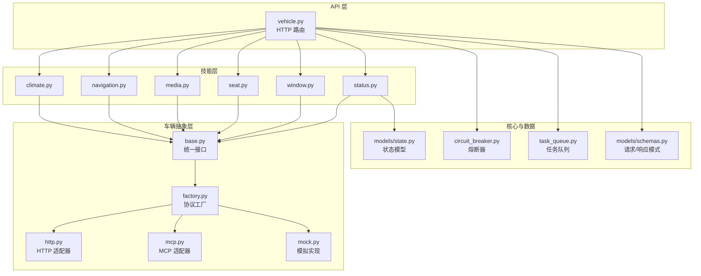

图表来源
- [backend_design/nexus/api/routes/vehicle.py](file://backend_design/nexus/api/routes/vehicle.py)
- [backend_design/nexus/skills/vehicle/climate.py](file://backend_design/nexus/skills/vehicle/climate.py)
- [backend_design/nexus/skills/vehicle/navigation.py](file://backend_design/nexus/skills/vehicle/navigation.py)
- [backend_design/nexus/skills/vehicle/media.py](file://backend_design/nexus/skills/vehicle/media.py)
- [backend_design/nexus/skills/vehicle/seat.py](file://backend_design/nexus/skills/vehicle/seat.py)
- [backend_design/nexus/skills/vehicle/window.py](file://backend_design/nexus/skills/vehicle/window.py)
- [backend_design/nexus/skills/vehicle/status.py](file://backend_design/nexus/skills/vehicle/status.py)
- [backend_design/nexus/vehicle/base.py](file://backend_design/nexus/vehicle/base.py)
- [backend_design/nexus/vehicle/factory.py](file://backend_design/nexus/vehicle/factory.py)
- [backend_design/nexus/vehicle/http.py](file://backend_design/nexus/vehicle/http.py)
- [backend_design/nexus/vehicle/mcp.py](file://backend_design/nexus/vehicle/mcp.py)
- [backend_design/nexus/vehicle/mock.py](file://backend_design/nexus/vehicle/mock.py)
- [backend_design/nexus/core/circuit_breaker.py](file://backend_design/nexus/core/circuit_breaker.py)
- [backend_design/nexus/middleware/task_queue.py](file://backend_design/nexus/middleware/task_queue.py)
- [backend_design/nexus/models/state.py](file://backend_design/nexus/models/state.py)
- [backend_design/nexus/models/schemas.py](file://backend_design/nexus/models/schemas.py)

章节来源
- [backend_design/nexus/vehicle/base.py](file://backend_design/nexus/vehicle/base.py)
- [backend_design/nexus/vehicle/factory.py](file://backend_design/nexus/vehicle/factory.py)
- [backend_design/nexus/vehicle/http.py](file://backend_design/nexus/vehicle/http.py)
- [backend_design/nexus/vehicle/mcp.py](file://backend_design/nexus/vehicle/mcp.py)
- [backend_design/nexus/vehicle/mock.py](file://backend_design/nexus/vehicle/mock.py)
- [backend_design/nexus/skills/vehicle/climate.py](file://backend_design/nexus/skills/vehicle/climate.py)
- [backend_design/nexus/skills/vehicle/navigation.py](file://backend_design/nexus/skills/vehicle/navigation.py)
- [backend_design/nexus/skills/vehicle/media.py](file://backend_design/nexus/skills/vehicle/media.py)
- [backend_design/nexus/skills/vehicle/seat.py](file://backend_design/nexus/skills/vehicle/seat.py)
- [backend_design/nexus/skills/vehicle/window.py](file://backend_design/nexus/skills/vehicle/window.py)
- [backend_design/nexus/skills/vehicle/status.py](file://backend_design/nexus/skills/vehicle/status.py)
- [backend_design/nexus/api/routes/vehicle.py](file://backend_design/nexus/api/routes/vehicle.py)
- [backend_design/nexus/core/circuit_breaker.py](file://backend_design/nexus/core/circuit_breaker.py)
- [backend_design/nexus/middleware/task_queue.py](file://backend_design/nexus/middleware/task_queue.py)
- [backend_design/nexus/models/state.py](file://backend_design/nexus/models/state.py)
- [backend_design/nexus/models/schemas.py](file://backend_design/nexus/models/schemas.py)

## 核心组件
- 车辆抽象接口与工厂
  - 统一接口：定义获取状态、下发控制指令、订阅事件等通用方法，屏蔽不同协议细节
  - 工厂：根据配置选择具体协议实现（HTTP/MCP/Mock），便于扩展新协议
- 协议适配器
  - HTTP 适配器：基于 RESTful 风格与后端服务交互
  - MCP 适配器：通过消息通道进行异步/双向通信
  - Mock 适配器：用于开发与测试环境
- 技能层
  - 将业务语义映射到统一的车辆接口，如温度设置、目的地设置、音量调节等
- API 路由
  - 暴露 HTTP 接口，接收并校验请求，编排技能调用，返回标准化结果
- 核心支撑
  - 熔断器：保护下游不稳定服务，避免雪崩
  - 任务队列：对耗时或幂等性要求高的控制命令进行排队与重试
  - 状态模型：定义车辆状态的统一数据结构

章节来源
- [backend_design/nexus/vehicle/base.py](file://backend_design/nexus/vehicle/base.py)
- [backend_design/nexus/vehicle/factory.py](file://backend_design/nexus/vehicle/factory.py)
- [backend_design/nexus/vehicle/http.py](file://backend_design/nexus/vehicle/http.py)
- [backend_design/nexus/vehicle/mcp.py](file://backend_design/nexus/vehicle/mcp.py)
- [backend_design/nexus/vehicle/mock.py](file://backend_design/nexus/vehicle/mock.py)
- [backend_design/nexus/core/circuit_breaker.py](file://backend_design/nexus/core/circuit_breaker.py)
- [backend_design/nexus/middleware/task_queue.py](file://backend_design/nexus/middleware/task_queue.py)
- [backend_design/nexus/models/state.py](file://backend_design/nexus/models/state.py)
- [backend_design/nexus/models/schemas.py](file://backend_design/nexus/models/schemas.py)

## 架构总览
下图展示了从 HTTP 请求到具体协议的端到端流程，包括参数校验、熔断与队列处理、技能编排与协议适配。

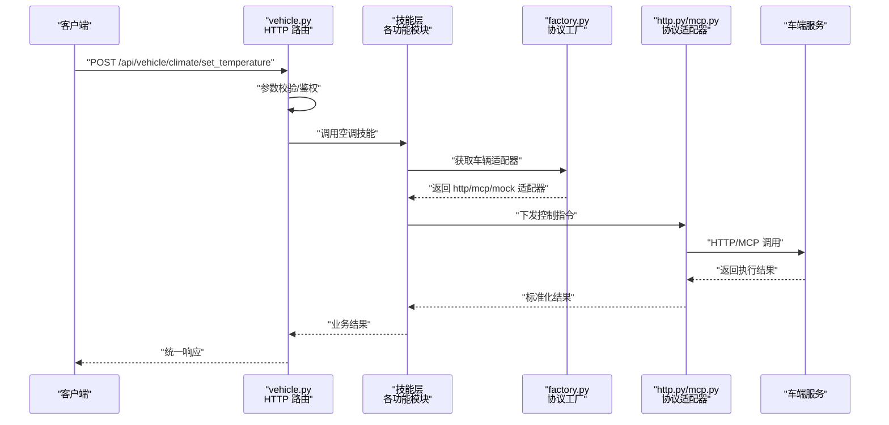

图表来源
- [backend_design/nexus/api/routes/vehicle.py](file://backend_design/nexus/api/routes/vehicle.py)
- [backend_design/nexus/skills/vehicle/climate.py](file://backend_design/nexus/skills/vehicle/climate.py)
- [backend_design/nexus/vehicle/factory.py](file://backend_design/nexus/vehicle/factory.py)
- [backend_design/nexus/vehicle/http.py](file://backend_design/nexus/vehicle/http.py)
- [backend_design/nexus/vehicle/mcp.py](file://backend_design/nexus/vehicle/mcp.py)

## 详细组件分析

### 车辆抽象层与协议适配
- 统一接口设计
  - 定义获取状态、设置属性、订阅事件等方法，保证上层技能无需关心协议差异
- 工厂模式
  - 依据配置动态创建 HTTP/MCP/Mock 适配器，支持运行时切换与灰度发布
- 协议适配器
  - HTTP：REST 风格，适合简单请求/响应场景
  - MCP：消息通道，适合长连接、事件推送与批量操作
  - Mock：固定返回值，便于联调与自动化测试

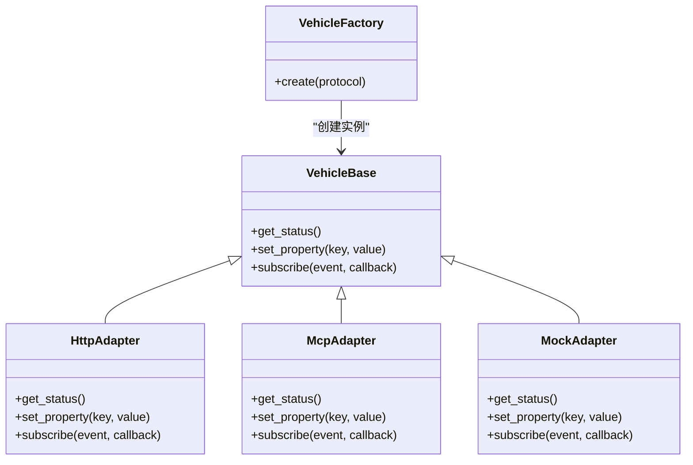

图表来源
- [backend_design/nexus/vehicle/base.py](file://backend_design/nexus/vehicle/base.py)
- [backend_design/nexus/vehicle/factory.py](file://backend_design/nexus/vehicle/factory.py)
- [backend_design/nexus/vehicle/http.py](file://backend_design/nexus/vehicle/http.py)
- [backend_design/nexus/vehicle/mcp.py](file://backend_design/nexus/vehicle/mcp.py)
- [backend_design/nexus/vehicle/mock.py](file://backend_design/nexus/vehicle/mock.py)

章节来源
- [backend_design/nexus/vehicle/base.py](file://backend_design/nexus/vehicle/base.py)
- [backend_design/nexus/vehicle/factory.py](file://backend_design/nexus/vehicle/factory.py)
- [backend_design/nexus/vehicle/http.py](file://backend_design/nexus/vehicle/http.py)
- [backend_design/nexus/vehicle/mcp.py](file://backend_design/nexus/vehicle/mcp.py)
- [backend_design/nexus/vehicle/mock.py](file://backend_design/nexus/vehicle/mock.py)

### 空调控制（温度、风量、模式）
- 功能要点
  - 设置目标温度、风量档位、出风模式（内循环/外循环/自动）
  - 读取当前空调状态（温度、风量、模式、开关）
- 典型流程
  - 校验参数范围与互斥关系
  - 通过车辆抽象层下发指令
  - 返回执行结果与最终生效状态

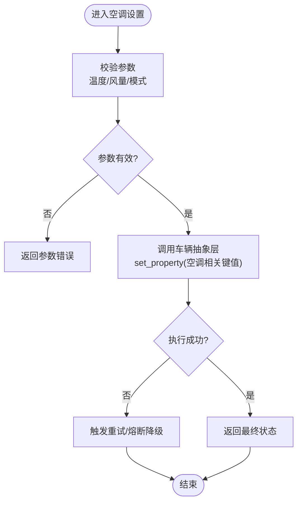

图表来源
- [backend_design/nexus/skills/vehicle/climate.py](file://backend_design/nexus/skills/vehicle/climate.py)
- [backend_design/nexus/vehicle/base.py](file://backend_design/nexus/vehicle/base.py)
- [backend_design/nexus/core/circuit_breaker.py](file://backend_design/nexus/core/circuit_breaker.py)

章节来源
- [backend_design/nexus/skills/vehicle/climate.py](file://backend_design/nexus/skills/vehicle/climate.py)

### 导航管理（目的地设置、路线规划）
- 功能要点
  - 设置目的地坐标或地址
  - 查询/更新路线信息（预计到达时间、剩余里程）
- 典型流程
  - 解析输入位置，转换为标准格式
  - 调用导航技能，持久化目的地与路线
  - 返回导航状态与关键指标

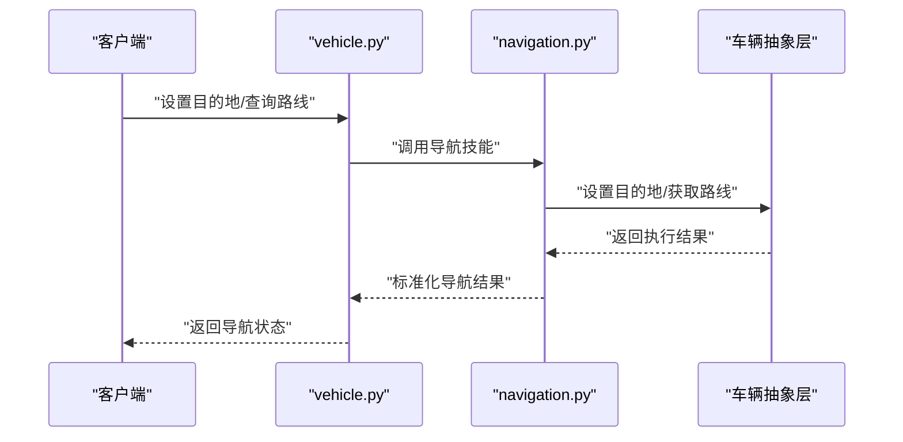

图表来源
- [backend_design/nexus/skills/vehicle/navigation.py](file://backend_design/nexus/skills/vehicle/navigation.py)
- [backend_design/nexus/api/routes/vehicle.py](file://backend_design/nexus/api/routes/vehicle.py)
- [backend_design/nexus/vehicle/base.py](file://backend_design/nexus/vehicle/base.py)

章节来源
- [backend_design/nexus/skills/vehicle/navigation.py](file://backend_design/nexus/skills/vehicle/navigation.py)

### 媒体播放（音乐、电台、音量控制）
- 功能要点
  - 播放/暂停、切歌、选择音源（音乐/电台）
  - 音量调节、静音切换
- 典型流程
  - 校验音源类型与音量范围
  - 调用媒体技能，驱动播放器状态机
  - 返回当前播放信息与音量状态

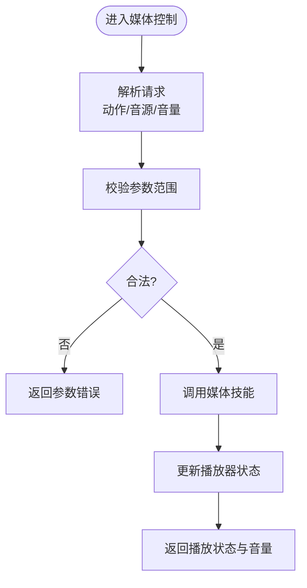

图表来源
- [backend_design/nexus/skills/vehicle/media.py](file://backend_design/nexus/skills/vehicle/media.py)

章节来源
- [backend_design/nexus/skills/vehicle/media.py](file://backend_design/nexus/skills/vehicle/media.py)

### 座椅调节（位置、加热、通风）
- 功能要点
  - 前后/靠背角度调节
  - 加热/通风档位控制
- 典型流程
  - 校验目标位置与档位
  - 调用座椅技能，下发控制指令
  - 返回当前座椅状态

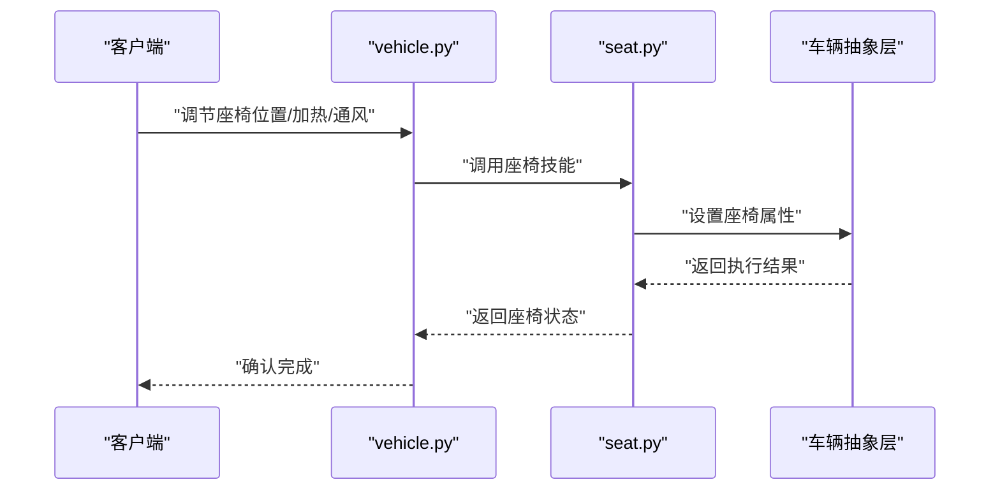

图表来源
- [backend_design/nexus/skills/vehicle/seat.py](file://backend_design/nexus/skills/vehicle/seat.py)
- [backend_design/nexus/api/routes/vehicle.py](file://backend_design/nexus/api/routes/vehicle.py)
- [backend_design/nexus/vehicle/base.py](file://backend_design/nexus/vehicle/base.py)

章节来源
- [backend_design/nexus/skills/vehicle/seat.py](file://backend_design/nexus/skills/vehicle/seat.py)

### 车窗控制（开合、遮阳）
- 功能要点
  - 车窗开合百分比控制
  - 遮阳帘开合控制
- 典型流程
  - 校验开合比例与安全约束（如车速限制）
  - 调用车窗技能，下发指令
  - 返回当前车窗与遮阳状态

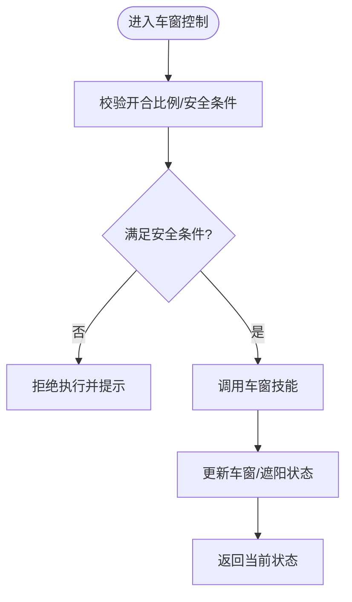

图表来源
- [backend_design/nexus/skills/vehicle/window.py](file://backend_design/nexus/skills/vehicle/window.py)

章节来源
- [backend_design/nexus/skills/vehicle/window.py](file://backend_design/nexus/skills/vehicle/window.py)

### 车辆状态同步机制
- 状态模型
  - 使用统一的状态模型描述车辆各子系统状态，便于跨模块共享
- 同步策略
  - 主动拉取：定时或按需从车辆抽象层获取最新状态
  - 事件推送：通过 MCP 订阅事件，实时刷新 UI 或缓存
- 一致性保障
  - 合并冲突：当多源状态不一致时，采用优先级规则合并
  - 版本控制：为状态快照增加版本号，避免脏写

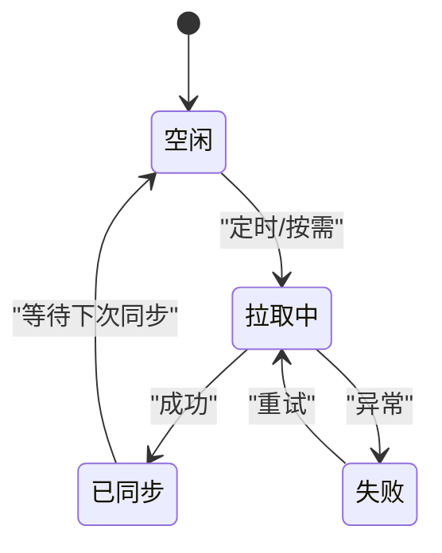

图表来源
- [backend_design/nexus/models/state.py](file://backend_design/nexus/models/state.py)
- [backend_design/nexus/skills/vehicle/status.py](file://backend_design/nexus/skills/vehicle/status.py)
- [backend_design/nexus/vehicle/mcp.py](file://backend_design/nexus/vehicle/mcp.py)

章节来源
- [backend_design/nexus/models/state.py](file://backend_design/nexus/models/state.py)
- [backend_design/nexus/skills/vehicle/status.py](file://backend_design/nexus/skills/vehicle/status.py)

### 命令队列管理与错误重试策略
- 命令队列
  - 对耗时或需要顺序执行的指令入队，保证一致性与可观测性
  - 支持幂等键，防止重复提交导致副作用
- 重试与退避
  - 指数退避与抖动，降低瞬时拥塞
  - 最大重试次数与超时控制，避免无限重试
- 熔断与降级
  - 熔断器检测下游健康度，快速失败与恢复
  - 降级策略：返回缓存状态或默认值，提升可用性

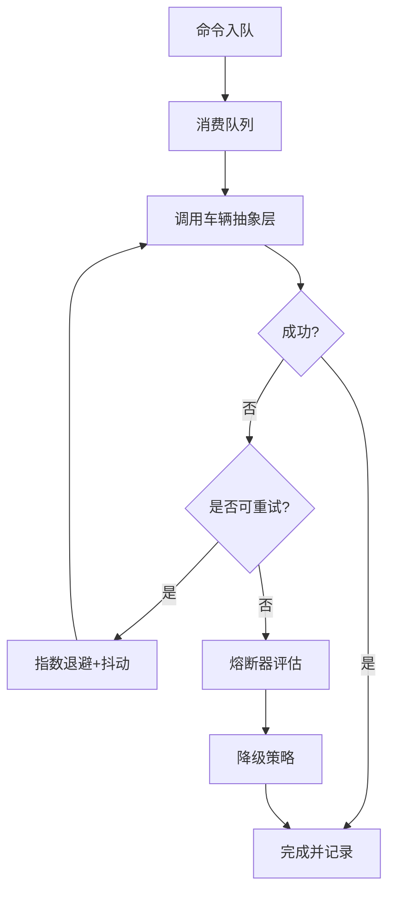

图表来源
- [backend_design/nexus/middleware/task_queue.py](file://backend_design/nexus/middleware/task_queue.py)
- [backend_design/nexus/core/circuit_breaker.py](file://backend_design/nexus/core/circuit_breaker.py)
- [backend_design/nexus/vehicle/base.py](file://backend_design/nexus/vehicle/base.py)

章节来源
- [backend_design/nexus/middleware/task_queue.py](file://backend_design/nexus/middleware/task_queue.py)
- [backend_design/nexus/core/circuit_breaker.py](file://backend_design/nexus/core/circuit_breaker.py)

## 依赖关系分析
- 耦合与内聚
  - 技能层仅依赖车辆抽象接口，不感知协议细节，内聚度高
  - 工厂集中管理协议实现，新增协议只需扩展工厂与适配器
- 外部依赖
  - HTTP 适配器依赖网络库
  - MCP 适配器依赖消息通道
  - 任务队列与熔断器依赖中间件与监控设施
- 潜在循环依赖
  - 通过分层与接口隔离避免循环引用

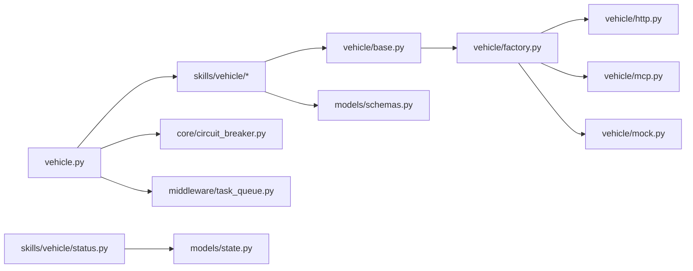

图表来源
- [backend_design/nexus/api/routes/vehicle.py](file://backend_design/nexus/api/routes/vehicle.py)
- [backend_design/nexus/skills/vehicle/climate.py](file://backend_design/nexus/skills/vehicle/climate.py)
- [backend_design/nexus/skills/vehicle/navigation.py](file://backend_design/nexus/skills/vehicle/navigation.py)
- [backend_design/nexus/skills/vehicle/media.py](file://backend_design/nexus/skills/vehicle/media.py)
- [backend_design/nexus/skills/vehicle/seat.py](file://backend_design/nexus/skills/vehicle/seat.py)
- [backend_design/nexus/skills/vehicle/window.py](file://backend_design/nexus/skills/vehicle/window.py)
- [backend_design/nexus/skills/vehicle/status.py](file://backend_design/nexus/skills/vehicle/status.py)
- [backend_design/nexus/vehicle/base.py](file://backend_design/nexus/vehicle/base.py)
- [backend_design/nexus/vehicle/factory.py](file://backend_design/nexus/vehicle/factory.py)
- [backend_design/nexus/vehicle/http.py](file://backend_design/nexus/vehicle/http.py)
- [backend_design/nexus/vehicle/mcp.py](file://backend_design/nexus/vehicle/mcp.py)
- [backend_design/nexus/vehicle/mock.py](file://backend_design/nexus/vehicle/mock.py)
- [backend_design/nexus/core/circuit_breaker.py](file://backend_design/nexus/core/circuit_breaker.py)
- [backend_design/nexus/middleware/task_queue.py](file://backend_design/nexus/middleware/task_queue.py)
- [backend_design/nexus/models/schemas.py](file://backend_design/nexus/models/schemas.py)
- [backend_design/nexus/models/state.py](file://backend_design/nexus/models/state.py)

章节来源
- [backend_design/nexus/api/routes/vehicle.py](file://backend_design/nexus/api/routes/vehicle.py)
- [backend_design/nexus/vehicle/base.py](file://backend_design/nexus/vehicle/base.py)
- [backend_design/nexus/vehicle/factory.py](file://backend_design/nexus/vehicle/factory.py)
- [backend_design/nexus/vehicle/http.py](file://backend_design/nexus/vehicle/http.py)
- [backend_design/nexus/vehicle/mcp.py](file://backend_design/nexus/vehicle/mcp.py)
- [backend_design/nexus/vehicle/mock.py](file://backend_design/nexus/vehicle/mock.py)
- [backend_design/nexus/core/circuit_breaker.py](file://backend_design/nexus/core/circuit_breaker.py)
- [backend_design/nexus/middleware/task_queue.py](file://backend_design/nexus/middleware/task_queue.py)
- [backend_design/nexus/models/schemas.py](file://backend_design/nexus/models/schemas.py)
- [backend_design/nexus/models/state.py](file://backend_design/nexus/models/state.py)

## 性能考虑
- 并发与批处理
  - 对批量控制指令进行批处理，减少网络往返
  - 使用连接池与复用通道，降低握手开销
- 缓存与去抖
  - 对频繁读取的状态进行短期缓存
  - 对高频设置指令进行去抖，避免抖动式控制
- 资源限流
  - 结合熔断器与队列长度限制，防止过载
- 可观测性
  - 记录关键路径耗时与错误率，辅助容量规划

[本节为通用指导，不涉及具体文件分析]

## 故障排查指南
- 常见问题定位
  - 参数校验失败：检查请求体是否符合 schemas 定义
  - 协议不可达：查看 HTTP/MCP 适配器日志与熔断器状态
  - 队列积压：检查任务队列消费者健康度与重试策略
- 诊断步骤
  - 启用调试日志，追踪请求链路
  - 观察熔断器状态与降级行为
  - 核对状态模型版本，避免旧数据覆盖
- 恢复建议
  - 临时切换到 Mock 适配器验证逻辑
  - 调整重试退避参数与最大重试次数
  - 扩容消费者或优化下游服务

章节来源
- [backend_design/nexus/core/circuit_breaker.py](file://backend_design/nexus/core/circuit_breaker.py)
- [backend_design/nexus/middleware/task_queue.py](file://backend_design/nexus/middleware/task_queue.py)
- [backend_design/nexus/models/schemas.py](file://backend_design/nexus/models/schemas.py)
- [backend_design/nexus/models/state.py](file://backend_design/nexus/models/state.py)

## 结论
本系统通过统一的车辆抽象层与工厂模式，实现了 HTTP/MCP 等多协议接入；技能层按功能域划分，职责清晰；配合熔断器与任务队列，提升了稳定性与可扩展性。建议在后续迭代中完善可观测性指标与自动化测试用例，进一步提升可靠性与交付效率。

[本节为总结，不涉及具体文件分析]

## 附录：API参考与示例
- 空调控制
  - 设置温度：POST /api/vehicle/climate/set_temperature
  - 设置风量：POST /api/vehicle/climate/set_fan_speed
  - 设置模式：POST /api/vehicle/climate/set_mode
  - 查询状态：GET /api/vehicle/climate/status
- 导航管理
  - 设置目的地：POST /api/vehicle/navigation/set_destination
  - 查询路线：GET /api/vehicle/navigation/route
- 媒体播放
  - 播放控制：POST /api/vehicle/media/play
  - 停止播放：POST /api/vehicle/media/stop
  - 设置音量：POST /api/vehicle/media/set_volume
- 座椅调节
  - 设置位置：POST /api/vehicle/seat/set_position
  - 设置加热：POST /api/vehicle/seat/set_heating
  - 设置通风：POST /api/vehicle/seat/set_ventilation
- 车窗控制
  - 设置开合：POST /api/vehicle/window/set_opening
  - 设置遮阳：POST /api/vehicle/window/set_sunshade
- 状态同步
  - 全量状态：GET /api/vehicle/status
  - 事件订阅：WS /api/vehicle/events（通过 MCP 通道）

实际使用示例（概念性说明）
- 设置空调温度
  - 请求体包含目标温度与生效范围
  - 服务端校验后调用空调技能，经车辆抽象层下发至 HTTP/MCP 适配器
  - 返回最终生效状态与时间戳
- 设置导航目的地
  - 请求体包含地址或坐标
  - 导航技能解析并持久化，返回预计到达时间与剩余里程
- 调节音量
  - 请求体包含音量等级与单位
  - 媒体技能更新播放器状态，返回当前播放信息与音量

章节来源
- [backend_design/nexus/api/routes/vehicle.py](file://backend_design/nexus/api/routes/vehicle.py)
- [backend_design/nexus/skills/vehicle/climate.py](file://backend_design/nexus/skills/vehicle/climate.py)
- [backend_design/nexus/skills/vehicle/navigation.py](file://backend_design/nexus/skills/vehicle/navigation.py)
- [backend_design/nexus/skills/vehicle/media.py](file://backend_design/nexus/skills/vehicle/media.py)
- [backend_design/nexus/skills/vehicle/seat.py](file://backend_design/nexus/skills/vehicle/seat.py)
- [backend_design/nexus/skills/vehicle/window.py](file://backend_design/nexus/skills/vehicle/window.py)
- [backend_design/nexus/skills/vehicle/status.py](file://backend_design/nexus/skills/vehicle/status.py)
- [backend_design/nexus/models/schemas.py](file://backend_design/nexus/models/schemas.py)