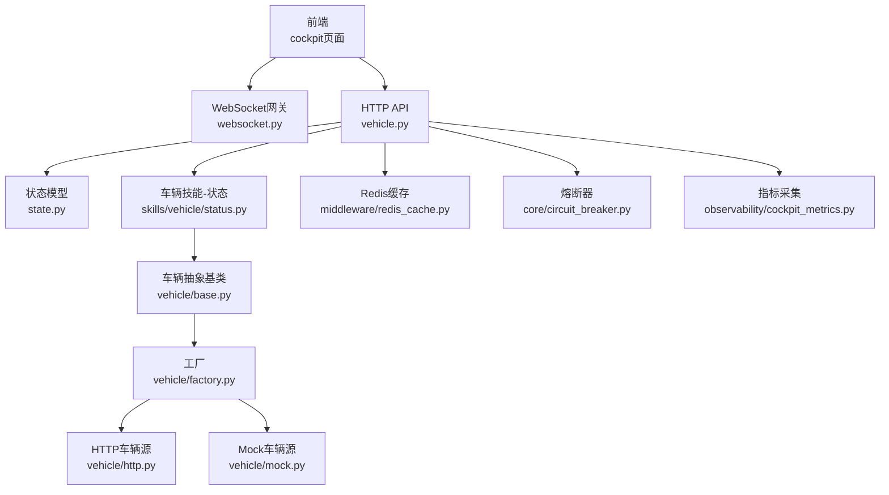
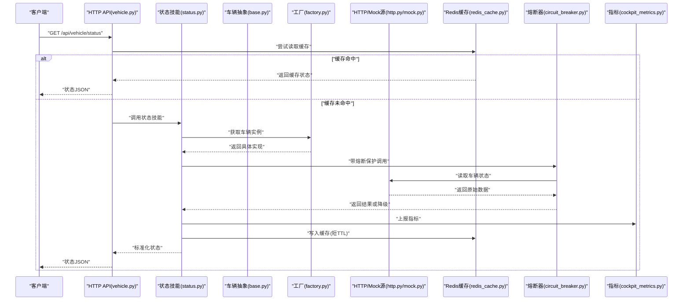
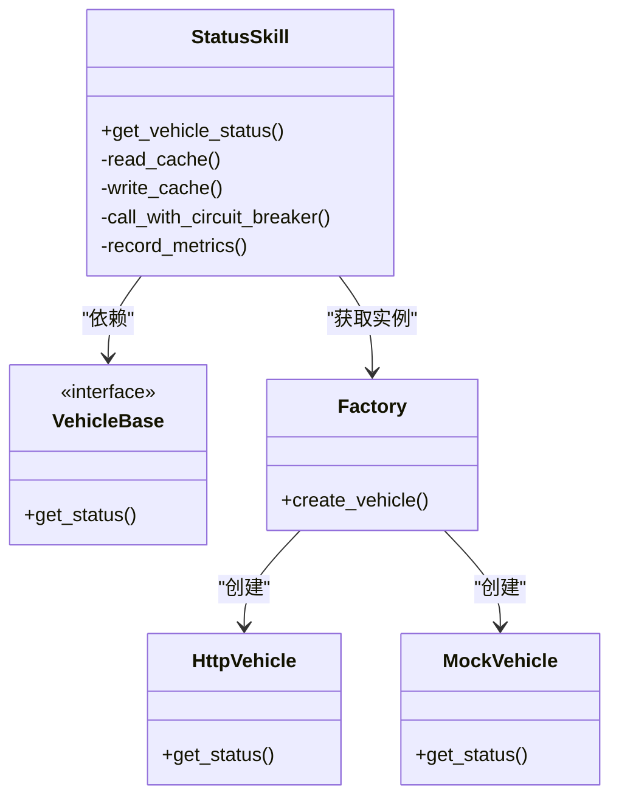
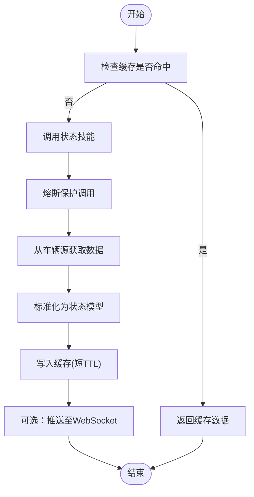
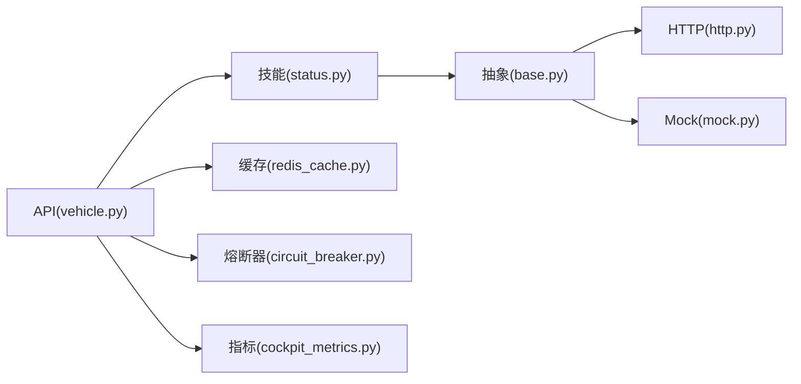

# 车辆状态监控

<cite>
**本文引用的文件**   
- [backend_design/nexus/api/routes/vehicle.py](file://backend_design/nexus/api/routes/vehicle.py)
- [backend_design/nexus/api/websocket.py](file://backend_design/nexus/api/websocket.py)
- [backend_design/nexus/models/state.py](file://backend_design/nexus/models/state.py)
- [backend_design/nexus/skills/vehicle/status.py](file://backend_design/nexus/skills/vehicle/status.py)
- [backend_design/nexus/vehicle/base.py](file://backend_design/nexus/vehicle/base.py)
- [backend_design/nexus/vehicle/factory.py](file://backend_design/nexus/vehicle/factory.py)
- [backend_design/nexus/vehicle/http.py](file://backend_design/nexus/vehicle/http.py)
- [backend_design/nexus/vehicle/mock.py](file://backend_design/nexus/vehicle/mock.py)
- [backend_design/nexus/middleware/redis_cache.py](file://backend_design/nexus/middleware/redis_cache.py)
- [backend_design/nexus/core/circuit_breaker.py](file://backend_design/nexus/core/circuit_breaker.py)
- [backend_design/nexus/observability/cockpit_metrics.py](file://backend_design/nexus/observability/cockpit_metrics.py)
- [backend_design/nexus/config.py](file://backend_design/nexus/config.py)
- [backend_design/nexus/main.py](file://backend_design/nexus/main.py)
- [frontend_design/src/lib/vehicle-events.ts](file://frontend_design/src/lib/vehicle-events.ts)
- [frontend_design/src/app/cockpit/page.tsx](file://frontend_design/src/app/cockpit/page.tsx)
</cite>

## 目录
1. [简介](#简介)
2. [项目结构](#项目结构)
3. [核心组件](#核心组件)
4. [架构总览](#架构总览)
5. [详细组件分析](#详细组件分析)
6. [依赖关系分析](#依赖关系分析)
7. [性能考虑](#性能考虑)
8. [故障诊断指南](#故障诊断指南)
9. [结论](#结论)
10. [附录：API参考](#附录api参考)

## 简介
本文件面向NexusCockpit的车辆状态监控系统，聚焦以下目标：
- 车辆基本信息：车型、VIN码、配置信息
- 运行状态监控：油量/电量、里程数、发动机状态
- 传感器数据获取：胎压监测、摄像头状态、雷达数据
- 状态同步机制与数据缓存策略
- 异常告警系统
- 完整API接口参考（状态查询、事件订阅、数据推送）
- 性能优化建议与故障诊断指南

## 项目结构
与“车辆状态监控”相关的后端模块主要位于 backend_design/nexus 下，前端展示与交互位于 frontend_design/src。关键路径如下：
- API路由层：提供HTTP与WebSocket接口
- 模型与状态：定义车辆状态数据结构
- 技能层：封装车辆能力（如状态读取）
- 车辆抽象层：统一不同来源的接入方式（HTTP/MCP/Mock）
- 中间件：Redis缓存、熔断器、指标采集等
- 前端：驾驶舱页面与车辆事件处理

图表来源
- [backend_design/nexus/api/routes/vehicle.py](file://backend_design/nexus/api/routes/vehicle.py)
- [backend_design/nexus/api/websocket.py](file://backend_design/nexus/api/websocket.py)
- [backend_design/nexus/models/state.py](file://backend_design/nexus/models/state.py)
- [backend_design/nexus/skills/vehicle/status.py](file://backend_design/nexus/skills/vehicle/status.py)
- [backend_design/nexus/vehicle/base.py](file://backend_design/nexus/vehicle/base.py)
- [backend_design/nexus/vehicle/factory.py](file://backend_design/nexus/vehicle/factory.py)
- [backend_design/nexus/vehicle/http.py](file://backend_design/nexus/vehicle/http.py)
- [backend_design/nexus/vehicle/mock.py](file://backend_design/nexus/vehicle/mock.py)
- [backend_design/nexus/middleware/redis_cache.py](file://backend_design/nexus/middleware/redis_cache.py)
- [backend_design/nexus/core/circuit_breaker.py](file://backend_design/nexus/core/circuit_breaker.py)
- [backend_design/nexus/observability/cockpit_metrics.py](file://backend_design/nexus/observability/cockpit_metrics.py)

章节来源
- [backend_design/nexus/main.py](file://backend_design/nexus/main.py)
- [backend_design/nexus/config.py](file://backend_design/nexus/config.py)

## 核心组件
- 车辆状态模型：集中定义车辆基本信息、运行状态与传感器数据的字段与类型约束，确保前后端一致。
- 车辆技能-状态：对外暴露“读取车辆状态”的能力，内部调用车辆抽象层以适配多来源。
- 车辆抽象层与工厂：统一接口，支持HTTP远端、MCP协议或本地Mock三种实现；工厂负责按配置选择具体实现。
- Redis缓存：对热点状态进行短期缓存，降低下游压力并提升响应速度。
- 熔断器：在下游不稳定时快速失败，避免雪崩。
- WebSocket网关：用于实时推送车辆状态变更与事件。
- 指标采集：记录关键请求耗时、错误率、缓存命中率等。

章节来源
- [backend_design/nexus/models/state.py](file://backend_design/nexus/models/state.py)
- [backend_design/nexus/skills/vehicle/status.py](file://backend_design/nexus/skills/vehicle/status.py)
- [backend_design/nexus/vehicle/base.py](file://backend_design/nexus/vehicle/base.py)
- [backend_design/nexus/vehicle/factory.py](file://backend_design/nexus/vehicle/factory.py)
- [backend_design/nexus/middleware/redis_cache.py](file://backend_design/nexus/middleware/redis_cache.py)
- [backend_design/nexus/core/circuit_breaker.py](file://backend_design/nexus/core/circuit_breaker.py)
- [backend_design/nexus/api/websocket.py](file://backend_design/nexus/api/websocket.py)
- [backend_design/nexus/observability/cockpit_metrics.py](file://backend_design/nexus/observability/cockpit_metrics.py)

## 架构总览
整体采用分层设计：
- 表现层：HTTP API与WebSocket
- 业务层：技能（Skill）编排与状态聚合
- 适配层：车辆抽象与工厂，屏蔽不同数据源差异
- 支撑层：缓存、熔断、指标、配置

图表来源
- [backend_design/nexus/api/routes/vehicle.py](file://backend_design/nexus/api/routes/vehicle.py)
- [backend_design/nexus/skills/vehicle/status.py](file://backend_design/nexus/skills/vehicle/status.py)
- [backend_design/nexus/vehicle/base.py](file://backend_design/nexus/vehicle/base.py)
- [backend_design/nexus/vehicle/factory.py](file://backend_design/nexus/vehicle/factory.py)
- [backend_design/nexus/vehicle/http.py](file://backend_design/nexus/vehicle/http.py)
- [backend_design/nexus/vehicle/mock.py](file://backend_design/nexus/vehicle/mock.py)
- [backend_design/nexus/middleware/redis_cache.py](file://backend_design/nexus/middleware/redis_cache.py)
- [backend_design/nexus/core/circuit_breaker.py](file://backend_design/nexus/core/circuit_breaker.py)
- [backend_design/nexus/observability/cockpit_metrics.py](file://backend_design/nexus/observability/cockpit_metrics.py)

## 详细组件分析

### 车辆状态模型
- 职责：统一定义车辆基本信息、运行状态与传感器数据字段，作为API输入输出契约。
- 关键点：
  - 基本信息：车型、VIN码、配置项
  - 运行状态：油量/电量百分比、累计里程、发动机启停状态
  - 传感器数据：胎压各轮数值、摄像头在线状态、雷达探测范围与目标计数
- 复杂度：O(1)序列化/反序列化；字段扩展通过新增字段完成，保持向后兼容。

章节来源
- [backend_design/nexus/models/state.py](file://backend_design/nexus/models/state.py)

### 车辆技能-状态
- 职责：对外提供“读取车辆状态”的技能方法，负责将底层原始数据转换为标准状态模型。
- 关键点：
  - 调用工厂获取具体车辆实现
  - 使用熔断器保护外部调用
  - 读写Redis缓存，设置合理TTL
  - 上报指标（耗时、错误、缓存命中）

图表来源
- [backend_design/nexus/skills/vehicle/status.py](file://backend_design/nexus/skills/vehicle/status.py)
- [backend_design/nexus/vehicle/base.py](file://backend_design/nexus/vehicle/base.py)
- [backend_design/nexus/vehicle/http.py](file://backend_design/nexus/vehicle/http.py)
- [backend_design/nexus/vehicle/mock.py](file://backend_design/nexus/vehicle/mock.py)
- [backend_design/nexus/vehicle/factory.py](file://backend_design/nexus/vehicle/factory.py)

章节来源
- [backend_design/nexus/skills/vehicle/status.py](file://backend_design/nexus/skills/vehicle/status.py)

### 车辆抽象层与工厂
- 职责：
  - 抽象基类定义统一的车辆接口
  - 工厂根据配置选择HTTP/MCP/Mock实现
- 关键点：
  - 解耦上层逻辑与具体数据源
  - 便于测试与灰度切换

章节来源
- [backend_design/nexus/vehicle/base.py](file://backend_design/nexus/vehicle/base.py)
- [backend_design/nexus/vehicle/factory.py](file://backend_design/nexus/vehicle/factory.py)

### HTTP/Mock车辆源
- HTTP源：通过HTTP协议从远端服务拉取车辆状态，需处理超时、重试与错误码。
- Mock源：用于开发与联调，返回预设数据。

章节来源
- [backend_design/nexus/vehicle/http.py](file://backend_design/nexus/vehicle/http.py)
- [backend_design/nexus/vehicle/mock.py](file://backend_design/nexus/vehicle/mock.py)

### 状态同步机制
- 主动拉取：HTTP API按需查询，结合Redis缓存减少重复请求。
- 被动推送：WebSocket网关向已订阅客户端推送状态变更与事件。
- 一致性：缓存TTL较短，保证近实时；必要时强制刷新。

图表来源
- [backend_design/nexus/api/routes/vehicle.py](file://backend_design/nexus/api/routes/vehicle.py)
- [backend_design/nexus/skills/vehicle/status.py](file://backend_design/nexus/skills/vehicle/status.py)
- [backend_design/nexus/middleware/redis_cache.py](file://backend_design/nexus/middleware/redis_cache.py)
- [backend_design/nexus/api/websocket.py](file://backend_design/nexus/api/websocket.py)

章节来源
- [backend_design/nexus/api/routes/vehicle.py](file://backend_design/nexus/api/routes/vehicle.py)
- [backend_design/nexus/api/websocket.py](file://backend_design/nexus/api/websocket.py)
- [backend_design/nexus/middleware/redis_cache.py](file://backend_design/nexus/middleware/redis_cache.py)

### 数据缓存策略
- 缓存键：基于车辆标识与查询维度生成唯一键
- TTL：短周期（秒级），平衡实时性与负载
- 失效策略：定时过期+手动失效（如配置更新后）
- 并发控制：避免缓存击穿（可加互斥锁或空值缓存）

章节来源
- [backend_design/nexus/middleware/redis_cache.py](file://backend_design/nexus/middleware/redis_cache.py)

### 异常告警系统
- 熔断器：当错误率或延迟超过阈值时快速失败，防止雪崩
- 指标采集：记录错误、延迟、缓存命中率等，供监控面板展示
- 告警触发：结合指标阈值与日志关键字，触发告警规则

章节来源
- [backend_design/nexus/core/circuit_breaker.py](file://backend_design/nexus/core/circuit_breaker.py)
- [backend_design/nexus/observability/cockpit_metrics.py](file://backend_design/nexus/observability/cockpit_metrics.py)

### 前端集成要点
- 事件订阅：前端通过WebSocket订阅车辆事件
- 状态展示：驾驶舱页面渲染车辆基本信息、运行状态与传感器数据
- 容错：网络断开重连、断线提示、降级显示最近一次状态

章节来源
- [frontend_design/src/lib/vehicle-events.ts](file://frontend_design/src/lib/vehicle-events.ts)
- [frontend_design/src/app/cockpit/page.tsx](file://frontend_design/src/app/cockpit/page.tsx)

## 依赖关系分析
- 低耦合：API层仅依赖技能与中间件，不直接感知数据源细节
- 高内聚：车辆抽象层将不同来源的差异收敛到单一接口
- 外部依赖：Redis、HTTP客户端、WebSocket服务器
- 潜在环：通过工厂与接口解耦，避免循环依赖

图表来源
- [backend_design/nexus/api/routes/vehicle.py](file://backend_design/nexus/api/routes/vehicle.py)
- [backend_design/nexus/skills/vehicle/status.py](file://backend_design/nexus/skills/vehicle/status.py)
- [backend_design/nexus/vehicle/base.py](file://backend_design/nexus/vehicle/base.py)
- [backend_design/nexus/vehicle/http.py](file://backend_design/nexus/vehicle/http.py)
- [backend_design/nexus/vehicle/mock.py](file://backend_design/nexus/vehicle/mock.py)
- [backend_design/nexus/middleware/redis_cache.py](file://backend_design/nexus/middleware/redis_cache.py)
- [backend_design/nexus/core/circuit_breaker.py](file://backend_design/nexus/core/circuit_breaker.py)
- [backend_design/nexus/observability/cockpit_metrics.py](file://backend_design/nexus/observability/cockpit_metrics.py)

章节来源
- [backend_design/nexus/vehicle/factory.py](file://backend_design/nexus/vehicle/factory.py)

## 性能考虑
- 缓存优先：热点状态走缓存，显著降低下游压力
- 熔断保护：避免雪崩，保障可用性
- 连接复用：HTTP客户端复用连接池，减少握手开销
- 批量与分页：对于大量传感器数据，采用分页或增量推送
- 前端节流：WebSocket消息合并与节流，降低UI渲染压力
- 指标驱动：基于指标持续优化TTL、线程池大小与超时参数

[本节为通用指导，无需代码来源]

## 故障诊断指南
- 常见问题定位
  - 状态不一致：检查缓存TTL与失效策略，确认是否有强制刷新
  - 高延迟：查看指标中的P95/P99延迟，定位瓶颈在缓存、熔断还是下游
  - 频繁熔断：观察错误率与超时，调整熔断阈值或排查下游稳定性
  - WebSocket断连：检查心跳与重连逻辑，确认服务端Hub健康
- 诊断步骤
  - 查看指标面板：错误率、延迟、缓存命中率
  - 检索日志关键字：熔断触发、缓存读写、HTTP错误码
  - 复现最小用例：使用Mock源验证链路，逐步替换真实源
- 恢复策略
  - 临时降级：切换到Mock或只读模式
  - 扩容与限流：提高并发上限，限制突发流量
  - 滚动重启：在低峰期重启节点，清理异常状态

章节来源
- [backend_design/nexus/core/circuit_breaker.py](file://backend_design/nexus/core/circuit_breaker.py)
- [backend_design/nexus/observability/cockpit_metrics.py](file://backend_design/nexus/observability/cockpit_metrics.py)
- [backend_design/nexus/api/websocket.py](file://backend_design/nexus/api/websocket.py)

## 结论
本方案通过分层设计与多源适配，实现了稳定高效的车辆状态监控能力。借助缓存与熔断，系统在可用性与性能之间取得良好平衡；WebSocket提供实时推送能力，满足驾驶舱场景需求。后续可进一步引入更细粒度的指标与告警策略，以及更完善的压测与混沌工程实践。

[本节为总结性内容，无需代码来源]

## 附录：API参考

### HTTP接口
- 查询车辆状态
  - 方法：GET
  - 路径：/api/vehicle/status
  - 说明：返回标准化后的车辆状态模型，包含基本信息、运行状态与传感器数据
  - 响应：状态JSON
  - 错误：4xx/5xx，含错误码与简要描述
- 其他扩展接口（示例）
  - 刷新状态：POST /api/vehicle/status/refresh
  - 获取配置：GET /api/vehicle/config
  - 重置缓存：POST /api/vehicle/cache/reset

章节来源
- [backend_design/nexus/api/routes/vehicle.py](file://backend_design/nexus/api/routes/vehicle.py)

### WebSocket接口
- 订阅车辆事件
  - 连接：ws://host/ws/vehicle
  - 订阅主题：vehicle.status、vehicle.alert、vehicle.sensor
  - 消息格式：JSON，包含事件类型、时间戳与载荷
  - 重连：客户端实现指数退避重连

章节来源
- [backend_design/nexus/api/websocket.py](file://backend_design/nexus/api/websocket.py)
- [frontend_design/src/lib/vehicle-events.ts](file://frontend_design/src/lib/vehicle-events.ts)

### 数据模型（摘要）
- 基本信息：车型、VIN码、配置项
- 运行状态：油量/电量百分比、累计里程、发动机状态
- 传感器数据：胎压（四轮）、摄像头状态、雷达数据（范围/目标计数）

章节来源
- [backend_design/nexus/models/state.py](file://backend_design/nexus/models/state.py)