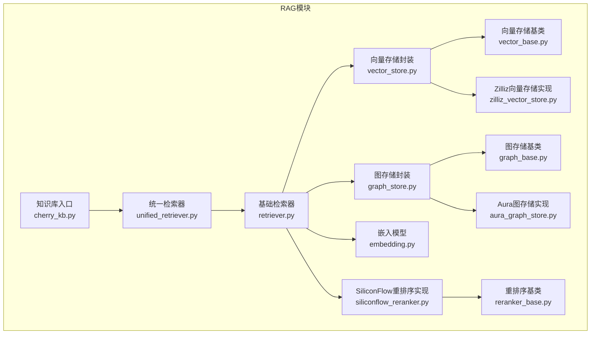
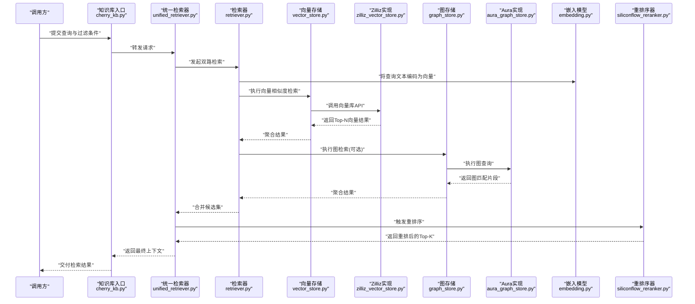
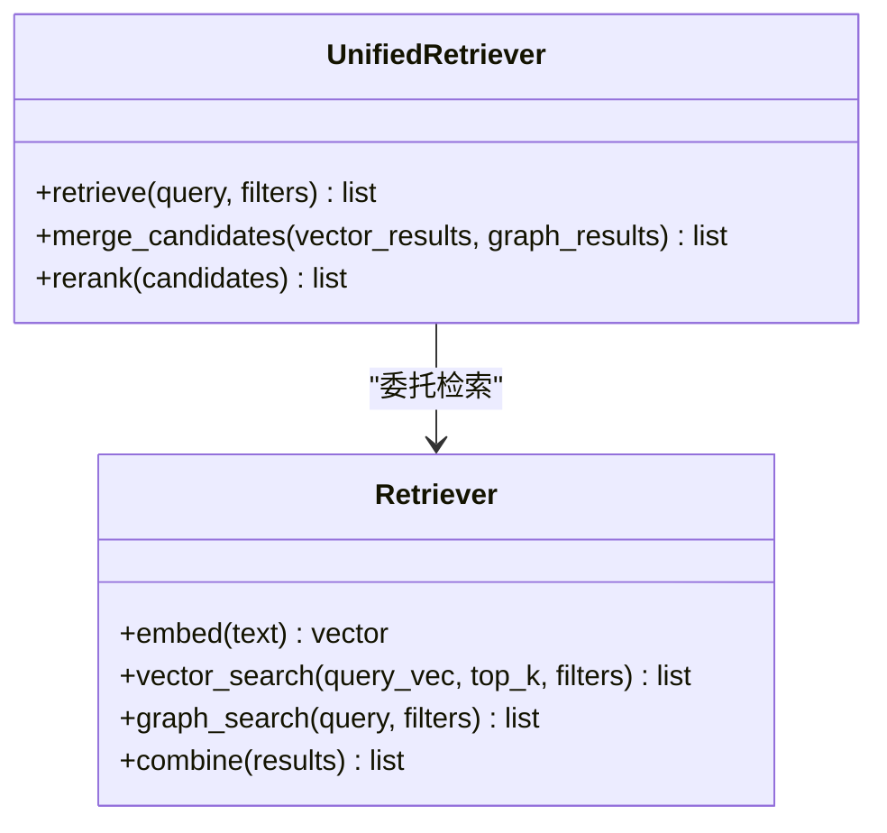
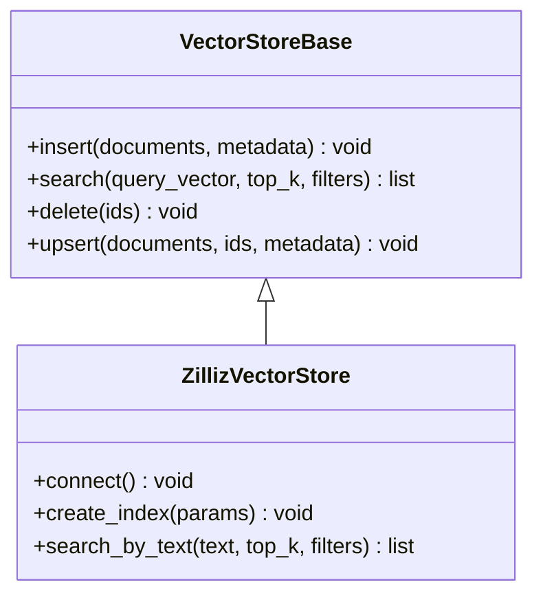
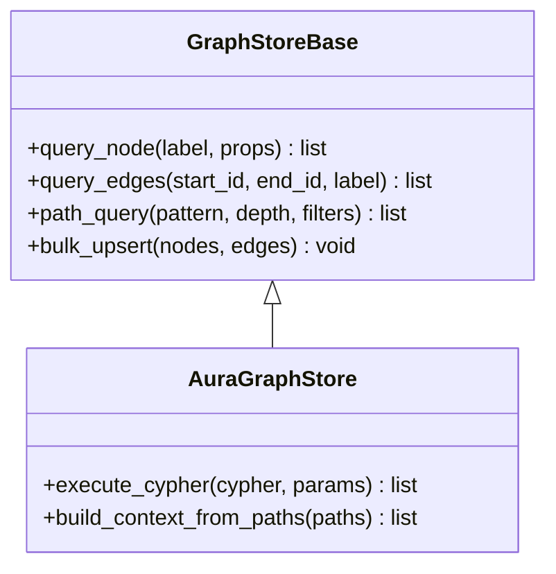
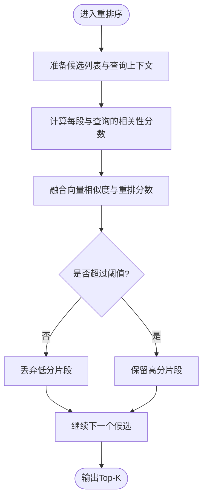
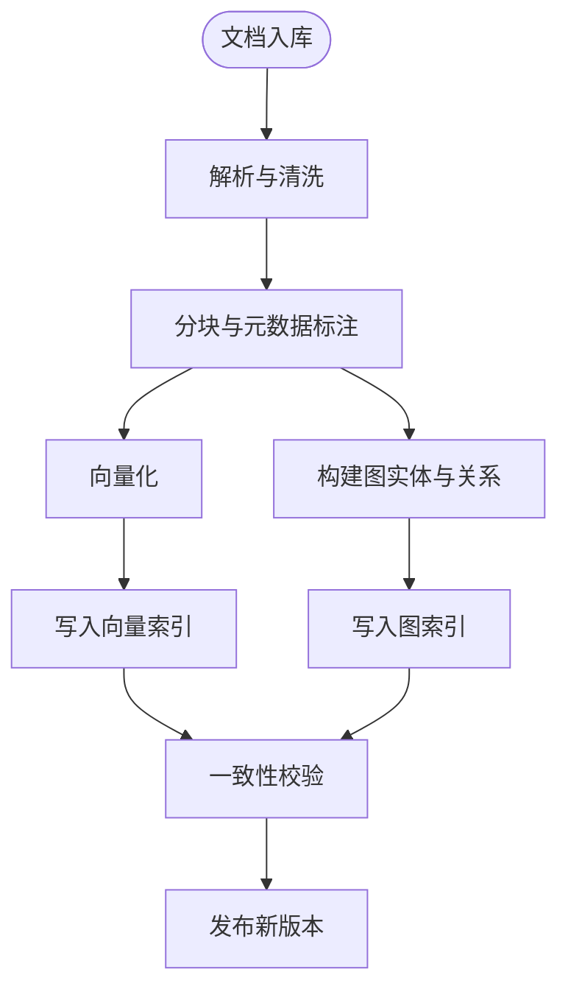
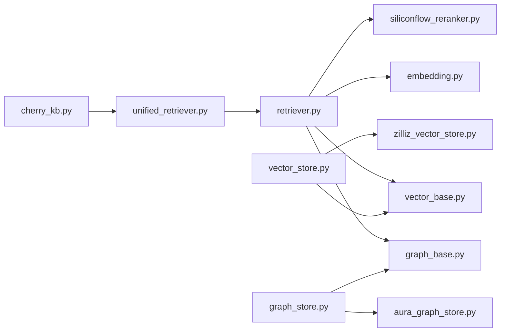

# RAG检索增强生成

<cite>
**本文引用的文件**   
- [backend_design/nexus/rag/__init__.py](file://backend_design/nexus/rag/__init__.py)
- [backend_design/nexus/rag/unified_retriever.py](file://backend_design/nexus/rag/unified_retriever.py)
- [backend_design/nexus/rag/retriever.py](file://backend_design/nexus/rag/retriever.py)
- [backend_design/nexus/rag/vector_base.py](file://backend_design/nexus/rag/vector_base.py)
- [backend_design/nexus/rag/vector_store.py](file://backend_design/nexus/rag/vector_store.py)
- [backend_design/nexus/rag/zilliz_vector_store.py](file://backend_design/nexus/rag/zilliz_vector_store.py)
- [backend_design/nexus/rag/graph_base.py](file://backend_design/nexus/rag/graph_base.py)
- [backend_design/nexus/rag/graph_store.py](file://backend_design/nexus/rag/graph_store.py)
- [backend_design/nexus/rag/aura_graph_store.py](file://backend_design/nexus/rag/aura_graph_store.py)
- [backend_design/nexus/rag/embedding.py](file://backend_design/nexus/rag/embedding.py)
- [backend_design/nexus/rag/reranker_base.py](file://backend_design/nexus/rag/reranker_base.py)
- [backend_design/nexus/rag/siliconflow_reranker.py](file://backend_design/nexus/rag/siliconflow_reranker.py)
- [backend_design/nexus/rag/cherry_kb.py](file://backend_design/nexus/rag/cherry_kb.py)
- [backend_design/nexus/config.py](file://backend_design/nexus/config.py)
- [backend_design/scripts/init_milvus.py](file://backend_design/scripts/init_milvus.py)
- [backend_design/scripts/init_neo4j.py](file://backend_design/scripts/init_neo4j.py)
</cite>

## 目录
1. [简介](#简介)
2. [项目结构](#项目结构)
3. [核心组件](#核心组件)
4. [架构总览](#架构总览)
5. [详细组件分析](#详细组件分析)
6. [依赖关系分析](#依赖关系分析)
7. [性能考虑](#性能考虑)
8. [故障排查指南](#故障排查指南)
9. [结论](#结论)
10. [附录](#附录)

## 简介
本技术文档面向NexusCockpit的RAG（检索增强生成）子系统，聚焦“向量数据库 + 图数据库”的双重检索机制：语义搜索与知识图谱查询并重。文档覆盖嵌入模型选择与优化、重排序算法、知识库构建与维护流程、检索结果与大语言模型的融合策略、性能调优与监控指标，以及知识库更新与版本管理方案。目标是帮助读者快速理解系统设计与落地实践，并在生产环境中进行高效运维与持续优化。

## 项目结构
RAG相关代码集中在 backend_design/nexus/rag 目录下，采用分层与工厂模式组织：
- 抽象接口层：定义向量存储、图存储、重排序等统一接口
- 具体实现层：Zilliz向量库、Aura图存储、SiliconFlow重排序等
- 编排层：统一检索器负责组合多路召回与重排
- 配置与脚本：集中配置项与初始化脚本

图表来源
- [backend_design/nexus/rag/unified_retriever.py](file://backend_design/nexus/rag/unified_retriever.py)
- [backend_design/nexus/rag/retriever.py](file://backend_design/nexus/rag/retriever.py)
- [backend_design/nexus/rag/vector_base.py](file://backend_design/nexus/rag/vector_base.py)
- [backend_design/nexus/rag/vector_store.py](file://backend_design/nexus/rag/vector_store.py)
- [backend_design/nexus/rag/zilliz_vector_store.py](file://backend_design/nexus/rag/zilliz_vector_store.py)
- [backend_design/nexus/rag/graph_base.py](file://backend_design/nexus/rag/graph_base.py)
- [backend_design/nexus/rag/graph_store.py](file://backend_design/nexus/rag/graph_store.py)
- [backend_design/nexus/rag/aura_graph_store.py](file://backend_design/nexus/rag/aura_graph_store.py)
- [backend_design/nexus/rag/embedding.py](file://backend_design/nexus/rag/embedding.py)
- [backend_design/nexus/rag/reranker_base.py](file://backend_design/nexus/rag/reranker_base.py)
- [backend_design/nexus/rag/siliconflow_reranker.py](file://backend_design/nexus/rag/siliconflow_reranker.py)
- [backend_design/nexus/rag/cherry_kb.py](file://backend_design/nexus/rag/cherry_kb.py)

章节来源
- [backend_design/nexus/rag/__init__.py](file://backend_design/nexus/rag/__init__.py)
- [backend_design/nexus/rag/unified_retriever.py](file://backend_design/nexus/rag/unified_retriever.py)
- [backend_design/nexus/rag/retriever.py](file://backend_design/nexus/rag/retriever.py)
- [backend_design/nexus/rag/vector_base.py](file://backend_design/nexus/rag/vector_base.py)
- [backend_design/nexus/rag/vector_store.py](file://backend_design/nexus/rag/vector_store.py)
- [backend_design/nexus/rag/zilliz_vector_store.py](file://backend_design/nexus/rag/zilliz_vector_store.py)
- [backend_design/nexus/rag/graph_base.py](file://backend_design/nexus/rag/graph_base.py)
- [backend_design/nexus/rag/graph_store.py](file://backend_design/nexus/rag/graph_store.py)
- [backend_design/nexus/rag/aura_graph_store.py](file://backend_design/nexus/rag/aura_graph_store.py)
- [backend_design/nexus/rag/embedding.py](file://backend_design/nexus/rag/embedding.py)
- [backend_design/nexus/rag/reranker_base.py](file://backend_design/nexus/rag/reranker_base.py)
- [backend_design/nexus/rag/siliconflow_reranker.py](file://backend_design/nexus/rag/siliconflow_reranker.py)
- [backend_design/nexus/rag/cherry_kb.py](file://backend_design/nexus/rag/cherry_kb.py)

## 核心组件
- 统一检索器：协调向量检索与图检索，合并候选集并触发重排序，输出最终上下文片段供LLM使用
- 向量存储抽象与实现：提供文本向量化、相似度检索、元数据过滤等能力；默认对接Zilliz向量库
- 图存储抽象与实现：提供节点/边查询、路径检索、属性过滤等能力；默认对接Aura图数据库
- 嵌入模型：负责将文本转换为高维向量，支持多语言与领域适配
- 重排序器：对初筛候选进行精细打分，提升Top-K相关性
- 知识库入口：对外暴露索引、更新、查询等能力，屏蔽底层细节

章节来源
- [backend_design/nexus/rag/unified_retriever.py](file://backend_design/nexus/rag/unified_retriever.py)
- [backend_design/nexus/rag/vector_base.py](file://backend_design/nexus/rag/vector_base.py)
- [backend_design/nexus/rag/zilliz_vector_store.py](file://backend_design/nexus/rag/zilliz_vector_store.py)
- [backend_design/nexus/rag/graph_base.py](file://backend_design/nexus/rag/graph_base.py)
- [backend_design/nexus/rag/aura_graph_store.py](file://backend_design/nexus/rag/aura_graph_store.py)
- [backend_design/nexus/rag/embedding.py](file://backend_design/nexus/rag/embedding.py)
- [backend_design/nexus/rag/reranker_base.py](file://backend_design/nexus/rag/reranker_base.py)
- [backend_design/nexus/rag/siliconflow_reranker.py](file://backend_design/nexus/rag/siliconflow_reranker.py)
- [backend_design/nexus/rag/cherry_kb.py](file://backend_design/nexus/rag/cherry_kb.py)

## 架构总览
下图展示从用户查询到最终返回给LLM的完整流程，包括双路召回与重排序阶段。

图表来源
- [backend_design/nexus/rag/cherry_kb.py](file://backend_design/nexus/rag/cherry_kb.py)
- [backend_design/nexus/rag/unified_retriever.py](file://backend_design/nexus/rag/unified_retriever.py)
- [backend_design/nexus/rag/retriever.py](file://backend_design/nexus/rag/retriever.py)
- [backend_design/nexus/rag/vector_store.py](file://backend_design/nexus/rag/vector_store.py)
- [backend_design/nexus/rag/zilliz_vector_store.py](file://backend_design/nexus/rag/zilliz_vector_store.py)
- [backend_design/nexus/rag/graph_store.py](file://backend_design/nexus/rag/graph_store.py)
- [backend_design/nexus/rag/aura_graph_store.py](file://backend_design/nexus/rag/aura_graph_store.py)
- [backend_design/nexus/rag/embedding.py](file://backend_design/nexus/rag/embedding.py)
- [backend_design/nexus/rag/siliconflow_reranker.py](file://backend_design/nexus/rag/siliconflow_reranker.py)

## 详细组件分析

### 统一检索器与检索器
- 职责
  - 统一检索器：协调向量与图两路召回，合并候选并按策略去重与截断，触发重排序
  - 检索器：封装嵌入、向量检索、图检索的具体流程，维护参数与缓存
- 关键流程
  - 查询预处理与分块策略（由上层或知识库入口决定）
  - 并行或串行执行向量与图检索
  - 合并候选集，基于分数或元数据进行二次筛选
  - 调用重排序器得到最终Top-K
- 扩展点
  - 可插拔的向量/图存储后端
  - 可插拔的重排序器

图表来源
- [backend_design/nexus/rag/unified_retriever.py](file://backend_design/nexus/rag/unified_retriever.py)
- [backend_design/nexus/rag/retriever.py](file://backend_design/nexus/rag/retriever.py)

章节来源
- [backend_design/nexus/rag/unified_retriever.py](file://backend_design/nexus/rag/unified_retriever.py)
- [backend_design/nexus/rag/retriever.py](file://backend_design/nexus/rag/retriever.py)

### 向量存储抽象与Zilliz实现
- 抽象接口
  - 文本向量化、批量插入、相似度检索、元数据过滤、集合/命名空间管理
- Zilliz实现要点
  - 连接与认证、索引类型与参数、分区/标签过滤、分页与游标
  - 性能参数：top_k、距离度量、预取与并发控制
- 错误处理
  - 网络异常重试、超时降级、空结果回退

图表来源
- [backend_design/nexus/rag/vector_base.py](file://backend_design/nexus/rag/vector_base.py)
- [backend_design/nexus/rag/zilliz_vector_store.py](file://backend_design/nexus/rag/zilliz_vector_store.py)

章节来源
- [backend_design/nexus/rag/vector_base.py](file://backend_design/nexus/rag/vector_base.py)
- [backend_design/nexus/rag/vector_store.py](file://backend_design/nexus/rag/vector_store.py)
- [backend_design/nexus/rag/zilliz_vector_store.py](file://backend_design/nexus/rag/zilliz_vector_store.py)

### 图存储抽象与Aura实现
- 抽象接口
  - 节点/边增删改查、属性过滤、路径检索、子图提取
- Aura实现要点
  - 连接与事务、Cypher查询封装、结果映射为结构化片段
  - 查询优化：限制深度、选择性投影字段、索引建议
- 错误处理
  - 查询超时、权限不足、图不可达时的降级策略

图表来源
- [backend_design/nexus/rag/graph_base.py](file://backend_design/nexus/rag/graph_base.py)
- [backend_design/nexus/rag/aura_graph_store.py](file://backend_design/nexus/rag/aura_graph_store.py)

章节来源
- [backend_design/nexus/rag/graph_base.py](file://backend_design/nexus/rag/graph_base.py)
- [backend_design/nexus/rag/graph_store.py](file://backend_design/nexus/rag/graph_store.py)
- [backend_design/nexus/rag/aura_graph_store.py](file://backend_design/nexus/rag/aura_graph_store.py)

### 嵌入模型与多语言/领域适配
- 角色
  - 将自然语言查询与文档片段映射为同一向量空间
- 多语言支持
  - 选择具备多语言能力的模型，确保跨语种检索一致性
- 领域适配
  - 在垂直语料上进行微调或继续预训练，提升领域术语与概念表征
- 工程优化
  - 批量化编码、缓存热点查询向量、动态精度与维度裁剪

章节来源
- [backend_design/nexus/rag/embedding.py](file://backend_design/nexus/rag/embedding.py)

### 重排序器与SiliconFlow实现
- 目标
  - 在粗召回基础上进行细粒度相关性打分，提升Top-K质量
- 策略
  - 基于交叉编码器或轻量级排序模型，结合查询-段落联合表示
  - 可引入规则加权（如元数据命中、时间衰减、来源可信度）
- SiliconFlow实现
  - 远程服务调用、超时与重试、结果归一化与阈值过滤

图表来源
- [backend_design/nexus/rag/reranker_base.py](file://backend_design/nexus/rag/reranker_base.py)
- [backend_design/nexus/rag/siliconflow_reranker.py](file://backend_design/nexus/rag/siliconflow_reranker.py)

章节来源
- [backend_design/nexus/rag/reranker_base.py](file://backend_design/nexus/rag/reranker_base.py)
- [backend_design/nexus/rag/siliconflow_reranker.py](file://backend_design/nexus/rag/siliconflow_reranker.py)

### 知识库入口与构建维护流程
- 入口
  - cherry_kb.py对外暴露索引、更新、查询接口，屏蔽底层差异
- 构建流程
  - 文档解析：支持多种格式，抽取正文与元数据
  - 分块策略：按语义边界或固定长度切分，保留上下文窗口
  - 索引优化：向量索引类型选择、图索引与约束、冷热数据分层
- 维护流程
  - 增量更新、冲突解决、版本标记与回滚
  - 定期健康检查与一致性校验

图表来源
- [backend_design/nexus/rag/cherry_kb.py](file://backend_design/nexus/rag/cherry_kb.py)

章节来源
- [backend_design/nexus/rag/cherry_kb.py](file://backend_design/nexus/rag/cherry_kb.py)

## 依赖关系分析
- 耦合与内聚
  - 检索器与存储抽象解耦，便于替换后端
  - 重排序器独立于召回链路，可按需启用
- 外部依赖
  - 向量库：Zilliz
  - 图数据库：Aura
  - 重排序服务：SiliconFlow
- 潜在循环依赖
  - 通过接口层隔离，避免直接循环引用

图表来源
- [backend_design/nexus/rag/retriever.py](file://backend_design/nexus/rag/retriever.py)
- [backend_design/nexus/rag/vector_base.py](file://backend_design/nexus/rag/vector_base.py)
- [backend_design/nexus/rag/graph_base.py](file://backend_design/nexus/rag/graph_base.py)
- [backend_design/nexus/rag/embedding.py](file://backend_design/nexus/rag/embedding.py)
- [backend_design/nexus/rag/siliconflow_reranker.py](file://backend_design/nexus/rag/siliconflow_reranker.py)
- [backend_design/nexus/rag/vector_store.py](file://backend_design/nexus/rag/vector_store.py)
- [backend_design/nexus/rag/zilliz_vector_store.py](file://backend_design/nexus/rag/zilliz_vector_store.py)
- [backend_design/nexus/rag/graph_store.py](file://backend_design/nexus/rag/graph_store.py)
- [backend_design/nexus/rag/aura_graph_store.py](file://backend_design/nexus/rag/aura_graph_store.py)
- [backend_design/nexus/rag/unified_retriever.py](file://backend_design/nexus/rag/unified_retriever.py)
- [backend_design/nexus/rag/cherry_kb.py](file://backend_design/nexus/rag/cherry_kb.py)

章节来源
- [backend_design/nexus/rag/unified_retriever.py](file://backend_design/nexus/rag/unified_retriever.py)
- [backend_design/nexus/rag/retriever.py](file://backend_design/nexus/rag/retriever.py)
- [backend_design/nexus/rag/vector_base.py](file://backend_design/nexus/rag/vector_base.py)
- [backend_design/nexus/rag/vector_store.py](file://backend_design/nexus/rag/vector_store.py)
- [backend_design/nexus/rag/zilliz_vector_store.py](file://backend_design/nexus/rag/zilliz_vector_store.py)
- [backend_design/nexus/rag/graph_base.py](file://backend_design/nexus/rag/graph_base.py)
- [backend_design/nexus/rag/graph_store.py](file://backend_design/nexus/rag/graph_store.py)
- [backend_design/nexus/rag/aura_graph_store.py](file://backend_design/nexus/rag/aura_graph_store.py)
- [backend_design/nexus/rag/embedding.py](file://backend_design/nexus/rag/embedding.py)
- [backend_design/nexus/rag/reranker_base.py](file://backend_design/nexus/rag/reranker_base.py)
- [backend_design/nexus/rag/siliconflow_reranker.py](file://backend_design/nexus/rag/siliconflow_reranker.py)
- [backend_design/nexus/rag/cherry_kb.py](file://backend_design/nexus/rag/cherry_kb.py)

## 性能考虑
- 向量检索
  - 选择合适的距离度量与索引类型；合理设置top_k与预取大小
  - 利用元数据过滤减少扫描范围；对热点查询做向量缓存
- 图检索
  - 限制查询深度与投影字段；为常用属性建立索引
  - 批量操作与事务合并，降低往返开销
- 重排序
  - 仅在Top-M候选上运行重排序，平衡延迟与质量
  - 对重排序服务进行超时与熔断保护
- 端到端
  - 并行执行向量与图检索；失败分支快速降级
  - 监控P95/P99延迟、吞吐、错误率与资源占用

[本节为通用性能指导，不直接分析具体文件]

## 故障排查指南
- 常见问题
  - 向量库连接失败：检查认证、网络连通性与端口
  - 图查询超时：简化Cypher、增加索引、限制返回规模
  - 重排序服务不可用：启用降级策略，退回仅向量/图结果
- 定位手段
  - 查看各组件日志与指标；核对配置项
  - 使用初始化脚本验证环境连通性

章节来源
- [backend_design/nexus/config.py](file://backend_design/nexus/config.py)
- [backend_design/scripts/init_milvus.py](file://backend_design/scripts/init_milvus.py)
- [backend_design/scripts/init_neo4j.py](file://backend_design/scripts/init_neo4j.py)

## 结论
本RAG系统通过“向量+图”的双路检索与重排序，兼顾语义泛化与结构化推理能力。借助清晰的抽象与工厂模式，系统具备良好的可扩展性与可替换性。在生产环境中，应重点关注嵌入模型的多语言与领域适配、重排序的质量与延迟权衡、以及知识库的版本管理与健康巡检。

[本节为总结性内容，不直接分析具体文件]

## 附录
- 知识库更新与版本管理建议
  - 增量索引与快照备份
  - 变更审计与回滚策略
  - 灰度发布与A/B评估
- 监控指标建议
  - 检索延迟分布、召回覆盖率、重排序通过率、错误率与资源利用率

[本节为补充说明，不直接分析具体文件]