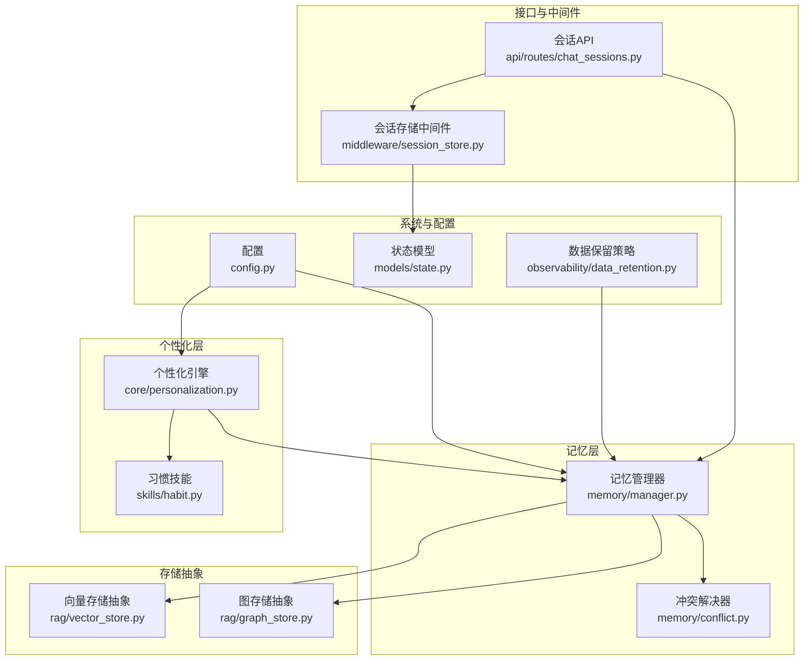
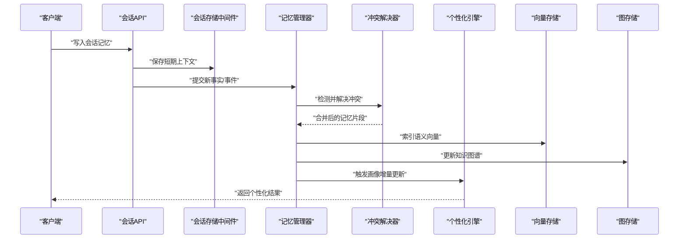
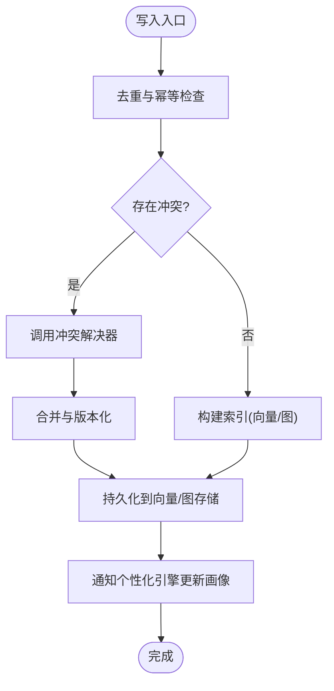
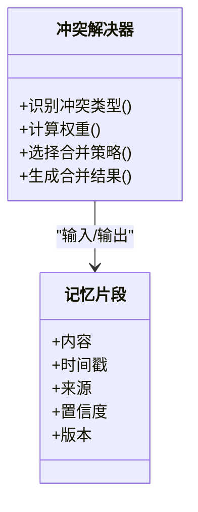
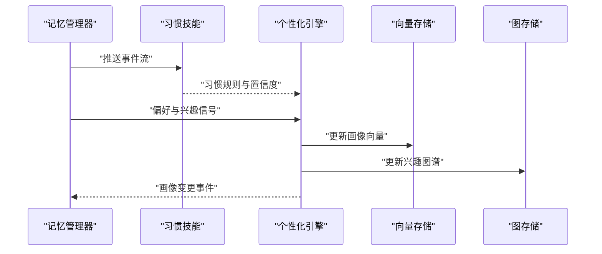
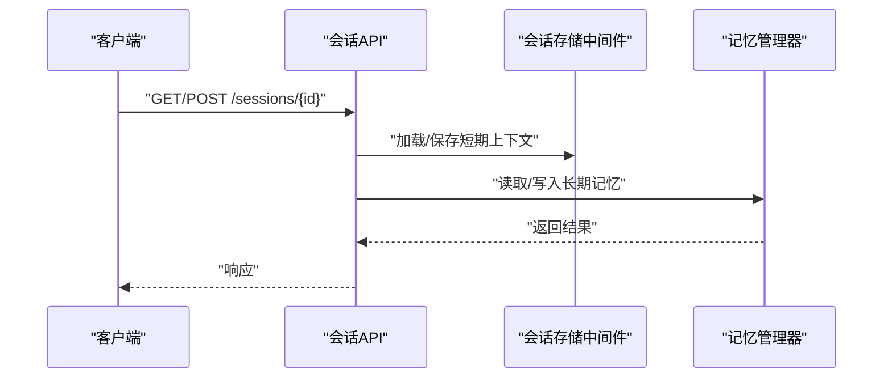
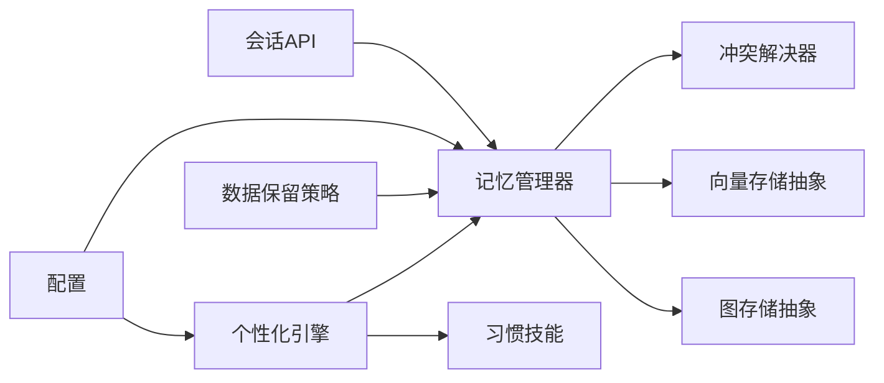
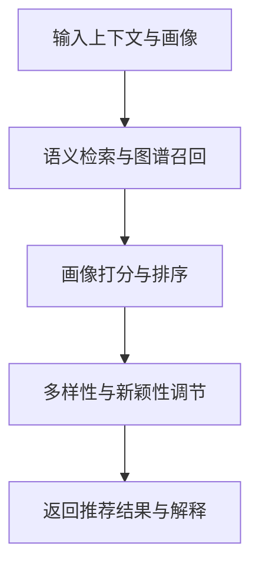

# 个性化记忆系统

<cite>
**本文引用的文件**   
- [backend_design/nexus/memory/manager.py](file://backend_design/nexus/memory/manager.py)
- [backend_design/nexus/memory/conflict.py](file://backend_design/nexus/memory/conflict.py)
- [backend_design/nexus/core/personalization.py](file://backend_design/nexus/core/personalization.py)
- [backend_design/nexus/skills/habit.py](file://backend_design/nexus/skills/habit.py)
- [backend_design/nexus/api/routes/chat_sessions.py](file://backend_design/nexus/api/routes/chat_sessions.py)
- [backend_design/nexus/middleware/session_store.py](file://backend_design/nexus/middleware/session_store.py)
- [backend_design/nexus/observability/data_retention.py](file://backend_design/nexus/observability/data_retention.py)
- [backend_design/nexus/rag/vector_store.py](file://backend_design/nexus/rag/vector_store.py)
- [backend_design/nexus/rag/graph_store.py](file://backend_design/nexus/rag/graph_store.py)
- [backend_design/nexus/models/state.py](file://backend_design/nexus/models/state.py)
- [backend_design/nexus/config.py](file://backend_design/nexus/config.py)
</cite>

## 目录
1. [简介](#简介)
2. [项目结构](#项目结构)
3. [核心组件](#核心组件)
4. [架构总览](#架构总览)
5. [详细组件分析](#详细组件分析)
6. [依赖关系分析](#依赖关系分析)
7. [性能考虑](#性能考虑)
8. [故障排查指南](#故障排查指南)
9. [结论](#结论)
10. [附录](#附录)

## 简介
本文件面向NexusCockpit的“个性化记忆系统”，系统性阐述长期记忆与短期会话记忆的数据结构设计与管理机制，用户画像构建算法（偏好学习、习惯分析与兴趣建模），记忆冲突解决与更新策略，隐私保护与数据安全，基于历史记忆的个性化推荐流程，以及记忆数据的导入导出与迁移方案。同时给出性能优化策略与存储容量管理建议，帮助读者从概念到实现全面理解该子系统。

## 项目结构
记忆系统相关代码主要分布在以下模块：
- memory：记忆生命周期管理与冲突处理
- core/personalization：用户画像与个性化能力
- skills/habit：习惯技能与行为模式抽取
- api/routes/chat_sessions：会话级记忆读写接口
- middleware/session_store：会话状态持久化中间件
- observability/data_retention：数据保留与清理策略
- rag/vector_store, graph_store：向量与图存储抽象
- models/state：通用状态模型
- config：配置项

图表来源
- [backend_design/nexus/memory/manager.py](file://backend_design/nexus/memory/manager.py)
- [backend_design/nexus/memory/conflict.py](file://backend_design/nexus/memory/conflict.py)
- [backend_design/nexus/core/personalization.py](file://backend_design/nexus/core/personalization.py)
- [backend_design/nexus/skills/habit.py](file://backend_design/nexus/skills/habit.py)
- [backend_design/nexus/api/routes/chat_sessions.py](file://backend_design/nexus/api/routes/chat_sessions.py)
- [backend_design/nexus/middleware/session_store.py](file://backend_design/nexus/middleware/session_store.py)
- [backend_design/nexus/observability/data_retention.py](file://backend_design/nexus/observability/data_retention.py)
- [backend_design/nexus/rag/vector_store.py](file://backend_design/nexus/rag/vector_store.py)
- [backend_design/nexus/rag/graph_store.py](file://backend_design/nexus/rag/graph_store.py)
- [backend_design/nexus/models/state.py](file://backend_design/nexus/models/state.py)
- [backend_design/nexus/config.py](file://backend_design/nexus/config.py)

章节来源
- [backend_design/nexus/memory/manager.py](file://backend_design/nexus/memory/manager.py)
- [backend_design/nexus/memory/conflict.py](file://backend_design/nexus/memory/conflict.py)
- [backend_design/nexus/core/personalization.py](file://backend_design/nexus/core/personalization.py)
- [backend_design/nexus/skills/habit.py](file://backend_design/nexus/skills/habit.py)
- [backend_design/nexus/api/routes/chat_sessions.py](file://backend_design/nexus/api/routes/chat_sessions.py)
- [backend_design/nexus/middleware/session_store.py](file://backend_design/nexus/middleware/session_store.py)
- [backend_design/nexus/observability/data_retention.py](file://backend_design/nexus/observability/data_retention.py)
- [backend_design/nexus/rag/vector_store.py](file://backend_design/nexus/rag/vector_store.py)
- [backend_design/nexus/rag/graph_store.py](file://backend_design/nexus/rag/graph_store.py)
- [backend_design/nexus/models/state.py](file://backend_design/nexus/models/state.py)
- [backend_design/nexus/config.py](file://backend_design/nexus/config.py)

## 核心组件
- 记忆管理器：负责短期会话记忆与长期记忆的读写、合并、检索与归档；协调冲突解决器进行一致性维护。
- 冲突解决器：对矛盾信息执行消解策略，包括时间衰减、置信度加权、来源可信度与上下文一致性校验。
- 个性化引擎：聚合偏好学习、习惯分析与兴趣建模结果，生成可查询的用户画像与特征向量。
- 习惯技能：从交互序列中抽取周期性或条件触发的行为模式，沉淀为可复用的习惯规则。
- 会话API：提供会话级记忆写入、读取与清理接口，支撑对话式个性化体验。
- 会话存储中间件：在请求链路中注入/恢复会话上下文，保证短期记忆的低延迟访问。
- 存储抽象：统一封装向量与图存储后端，屏蔽底层差异，便于扩展与替换。
- 数据保留策略：定义记忆数据的生命周期、冷热分层与清理任务。
- 状态模型：定义跨模块共享的状态结构与约束。
- 配置：集中管理记忆系统的阈值、窗口大小、权重与后端连接参数。

章节来源
- [backend_design/nexus/memory/manager.py](file://backend_design/nexus/memory/manager.py)
- [backend_design/nexus/memory/conflict.py](file://backend_design/nexus/memory/conflict.py)
- [backend_design/nexus/core/personalization.py](file://backend_design/nexus/core/personalization.py)
- [backend_design/nexus/skills/habit.py](file://backend_design/nexus/skills/habit.py)
- [backend_design/nexus/api/routes/chat_sessions.py](file://backend_design/nexus/api/routes/chat_sessions.py)
- [backend_design/nexus/middleware/session_store.py](file://backend_design/nexus/middleware/session_store.py)
- [backend_design/nexus/observability/data_retention.py](file://backend_design/nexus/observability/data_retention.py)
- [backend_design/nexus/rag/vector_store.py](file://backend_design/nexus/rag/vector_store.py)
- [backend_design/nexus/rag/graph_store.py](file://backend_design/nexus/rag/graph_store.py)
- [backend_design/nexus/models/state.py](file://backend_design/nexus/models/state.py)
- [backend_design/nexus/config.py](file://backend_design/nexus/config.py)

## 架构总览
记忆系统采用“短-长双轨”设计：短期会话记忆用于低延迟的即时上下文，长期记忆用于跨会话的知识沉淀与推理。两者通过记忆管理器协同工作，并由个性化引擎驱动画像更新与推荐。

图表来源
- [backend_design/nexus/api/routes/chat_sessions.py](file://backend_design/nexus/api/routes/chat_sessions.py)
- [backend_design/nexus/middleware/session_store.py](file://backend_design/nexus/middleware/session_store.py)
- [backend_design/nexus/memory/manager.py](file://backend_design/nexus/memory/manager.py)
- [backend_design/nexus/memory/conflict.py](file://backend_design/nexus/memory/conflict.py)
- [backend_design/nexus/core/personalization.py](file://backend_design/nexus/core/personalization.py)
- [backend_design/nexus/rag/vector_store.py](file://backend_design/nexus/rag/vector_store.py)
- [backend_design/nexus/rag/graph_store.py](file://backend_design/nexus/rag/graph_store.py)

## 详细组件分析

### 记忆管理器（短期与长期）
- 职责
  - 短期会话记忆：按会话维度组织，支持快速追加、滑动窗口裁剪与过期清理。
  - 长期记忆：跨会话聚合，支持语义检索、图谱关联与画像联动。
  - 合并与归档：将高频稳定的短期记忆提升为长期记忆，降低噪声。
- 关键流程
  - 写入：接收事件→去重→冲突检测→落盘（向量+图）→更新索引。
  - 读取：按会话ID/用户ID/语义关键词检索→排序→返回上下文切片。
  - 清理：依据保留策略与容量水位触发冷数据压缩与删除。
- 复杂度与优化
  - 写入路径以幂等键避免重复；批量写入减少IO；惰性索引更新降低峰值延迟。
  - 读取路径使用缓存与预取，结合向量相似度与图谱跳数限制控制召回范围。

图表来源
- [backend_design/nexus/memory/manager.py](file://backend_design/nexus/memory/manager.py)
- [backend_design/nexus/memory/conflict.py](file://backend_design/nexus/memory/conflict.py)
- [backend_design/nexus/rag/vector_store.py](file://backend_design/nexus/rag/vector_store.py)
- [backend_design/nexus/rag/graph_store.py](file://backend_design/nexus/rag/graph_store.py)

章节来源
- [backend_design/nexus/memory/manager.py](file://backend_design/nexus/memory/manager.py)
- [backend_design/nexus/memory/conflict.py](file://backend_design/nexus/memory/conflict.py)
- [backend_design/nexus/rag/vector_store.py](file://backend_design/nexus/rag/vector_store.py)
- [backend_design/nexus/rag/graph_store.py](file://backend_design/nexus/rag/graph_store.py)

### 冲突解决器
- 目标：在多源、多时序的记忆片段间达成一致，避免画像漂移与推荐偏差。
- 策略要点
  - 时间衰减：越新的证据权重越高，但需防止频繁反转。
  - 置信度加权：结合来源可信度、上下文一致性与验证信号。
  - 冲突类型识别：属性覆盖、互斥事实、时序不一致。
  - 合并策略：软覆盖（带版本）、硬覆盖（强约束）、协商（需要外部确认）。
- 输出：带版本与溯源信息的合并结果，供后续检索与审计。

图表来源
- [backend_design/nexus/memory/conflict.py](file://backend_design/nexus/memory/conflict.py)

章节来源
- [backend_design/nexus/memory/conflict.py](file://backend_design/nexus/memory/conflict.py)

### 个性化引擎（偏好学习、习惯分析、兴趣建模）
- 偏好学习
  - 从显式反馈（评分、收藏）与隐式反馈（点击、停留时长）中学习偏好分布。
  - 使用滑动窗口统计与指数平滑更新权重，抑制异常波动。
- 习惯分析
  - 基于周期性与条件触发的事件序列，抽取规则型习惯（如“工作日早高峰导航至公司”）。
  - 习惯具备生效时段、前置条件与置信度，支持自动启用与人工干预。
- 兴趣建模
  - 将主题词、实体与行为聚类形成兴趣簇，结合图谱关系增强可解释性。
  - 兴趣随时间演化，支持热点发现与长尾收敛。
- 画像表示
  - 结构化字段（偏好、习惯、兴趣）与向量嵌入并存，兼顾精确匹配与语义泛化。

图表来源
- [backend_design/nexus/core/personalization.py](file://backend_design/nexus/core/personalization.py)
- [backend_design/nexus/skills/habit.py](file://backend_design/nexus/skills/habit.py)
- [backend_design/nexus/rag/vector_store.py](file://backend_design/nexus/rag/vector_store.py)
- [backend_design/nexus/rag/graph_store.py](file://backend_design/nexus/rag/graph_store.py)

章节来源
- [backend_design/nexus/core/personalization.py](file://backend_design/nexus/core/personalization.py)
- [backend_design/nexus/skills/habit.py](file://backend_design/nexus/skills/habit.py)

### 会话API与会话存储中间件
- 会话API
  - 提供会话记忆的写入、读取、分页与清理接口。
  - 支持按会话ID、时间窗与语义检索过滤。
- 会话存储中间件
  - 在请求进入时加载短期上下文，响应后异步持久化。
  - 提供上下文隔离与并发安全，保障低延迟访问。

图表来源
- [backend_design/nexus/api/routes/chat_sessions.py](file://backend_design/nexus/api/routes/chat_sessions.py)
- [backend_design/nexus/middleware/session_store.py](file://backend_design/nexus/middleware/session_store.py)
- [backend_design/nexus/memory/manager.py](file://backend_design/nexus/memory/manager.py)

章节来源
- [backend_design/nexus/api/routes/chat_sessions.py](file://backend_design/nexus/api/routes/chat_sessions.py)
- [backend_design/nexus/middleware/session_store.py](file://backend_design/nexus/middleware/session_store.py)

### 数据保留与生命周期管理
- 策略维度
  - 时间窗口：短期记忆TTL、长期记忆归档周期。
  - 容量水位：当存储超过阈值时触发压缩、降采样与冷数据迁移。
  - 合规要求：敏感字段脱敏、最小化保留与可删除权。
- 执行方式
  - 定时任务扫描过期记录，分批清理并回收空间。
  - 与观测指标联动，动态调整保留策略。

章节来源
- [backend_design/nexus/observability/data_retention.py](file://backend_design/nexus/observability/data_retention.py)

### 状态模型与配置
- 状态模型
  - 定义跨模块共享的结构体与约束，确保序列化与一致性。
- 配置
  - 记忆窗口大小、冲突权重、向量维度、图谱边权重、保留策略开关等。

章节来源
- [backend_design/nexus/models/state.py](file://backend_design/nexus/models/state.py)
- [backend_design/nexus/config.py](file://backend_design/nexus/config.py)

## 依赖关系分析
记忆系统对外暴露清晰的接口契约，内部通过抽象层屏蔽存储差异，降低耦合度。

图表来源
- [backend_design/nexus/api/routes/chat_sessions.py](file://backend_design/nexus/api/routes/chat_sessions.py)
- [backend_design/nexus/memory/manager.py](file://backend_design/nexus/memory/manager.py)
- [backend_design/nexus/memory/conflict.py](file://backend_design/nexus/memory/conflict.py)
- [backend_design/nexus/core/personalization.py](file://backend_design/nexus/core/personalization.py)
- [backend_design/nexus/skills/habit.py](file://backend_design/nexus/skills/habit.py)
- [backend_design/nexus/observability/data_retention.py](file://backend_design/nexus/observability/data_retention.py)
- [backend_design/nexus/rag/vector_store.py](file://backend_design/nexus/rag/vector_store.py)
- [backend_design/nexus/rag/graph_store.py](file://backend_design/nexus/rag/graph_store.py)
- [backend_design/nexus/config.py](file://backend_design/nexus/config.py)

章节来源
- [backend_design/nexus/memory/manager.py](file://backend_design/nexus/memory/manager.py)
- [backend_design/nexus/memory/conflict.py](file://backend_design/nexus/memory/conflict.py)
- [backend_design/nexus/core/personalization.py](file://backend_design/nexus/core/personalization.py)
- [backend_design/nexus/skills/habit.py](file://backend_design/nexus/skills/habit.py)
- [backend_design/nexus/api/routes/chat_sessions.py](file://backend_design/nexus/api/routes/chat_sessions.py)
- [backend_design/nexus/observability/data_retention.py](file://backend_design/nexus/observability/data_retention.py)
- [backend_design/nexus/rag/vector_store.py](file://backend_design/nexus/rag/vector_store.py)
- [backend_design/nexus/rag/graph_store.py](file://backend_design/nexus/rag/graph_store.py)
- [backend_design/nexus/config.py](file://backend_design/nexus/config.py)

## 性能考虑
- 写入路径
  - 批量写入与异步索引更新，降低主路径延迟。
  - 幂等键与去重缓存，避免重复计算与存储膨胀。
- 读取路径
  - 多级缓存（本地内存+分布式缓存）与预取，缩短首字节时间。
  - 向量检索限制Top-K与跳数上限，平衡召回质量与耗时。
- 存储与容量
  - 冷热分层：热数据驻留内存/近线存储，冷数据归档至低成本介质。
  - 定期压缩与降采样，释放空间并维持查询精度。
- 可扩展性
  - 水平扩展：会话分片与向量/图分片，避免单点瓶颈。
  - 弹性扩容：根据QPS与延迟指标动态扩缩容。

[本节为通用性能指导，不直接分析具体文件]

## 故障排查指南
- 常见问题定位
  - 写入失败：检查幂等键冲突、去重缓存命中与存储后端连通性。
  - 读取超时：查看缓存命中率、向量检索Top-K设置与下游服务延迟。
  - 画像漂移：审查冲突解决权重与时间衰减参数，核对来源可信度。
  - 容量告警：评估保留策略与压缩任务执行情况，必要时调小窗口或提高清理频率。
- 诊断手段
  - 开启关键路径日志与指标上报，关注错误码与耗时分布。
  - 使用观测面板追踪会话上下文加载/保存成功率与P99延迟。
  - 对异常样本进行回溯，验证冲突解决与合并逻辑是否符合预期。

章节来源
- [backend_design/nexus/observability/data_retention.py](file://backend_design/nexus/observability/data_retention.py)
- [backend_design/nexus/memory/manager.py](file://backend_design/nexus/memory/manager.py)
- [backend_design/nexus/memory/conflict.py](file://backend_design/nexus/memory/conflict.py)

## 结论
个性化记忆系统通过“短-长双轨”设计与统一的冲突解决策略，实现了稳定、可解释且可扩展的用户画像与推荐能力。借助向量与图存储抽象，系统在语义检索与关系推理方面具备良好表现。配合数据保留策略与性能优化手段，可在大规模场景下保持高可用与低成本运行。

[本节为总结性内容，不直接分析具体文件]

## 附录

### 隐私保护与数据安全
- 最小化采集：仅收集必要字段，默认关闭非必要遥测。
- 脱敏与匿名化：对姓名、联系方式等敏感信息进行哈希或掩码处理。
- 访问控制：基于租户与角色的细粒度权限，审计所有访问操作。
- 加密与传输安全：静态数据加密、传输通道TLS，密钥轮换与托管。
- 合规与可删除：支持一键删除与导出，满足数据主体权利。

[本节为通用安全指导，不直接分析具体文件]

### 个性化推荐流程
- 输入：短期会话上下文、长期记忆片段、用户画像（偏好/习惯/兴趣）。
- 过程：语义检索候选集→图谱关系增强→画像打分与排序→多样性与新颖性调节。
- 输出：定制化推荐列表与可解释理由（来源片段、习惯触发、兴趣匹配）。

[此图为概念流程图，无需图表来源]

### 记忆数据导入导出与迁移
- 导入
  - 格式：JSON/CSV批次文件，包含会话ID、时间戳、内容、来源与置信度。
  - 校验：字段完整性、时间顺序、幂等键唯一性。
  - 回滚：事务边界与快照机制，失败可回退。
- 导出
  - 按用户/会话/时间窗导出，支持脱敏选项与签名下载。
- 迁移
  - 版本兼容：向后兼容旧版schema，提供转换脚本。
  - 灰度发布：新旧存储并行运行，逐步切流，监控误差率。
  - 回滚预案：保留旧副本，支持快速回切。

[本节为通用方案说明，不直接分析具体文件]