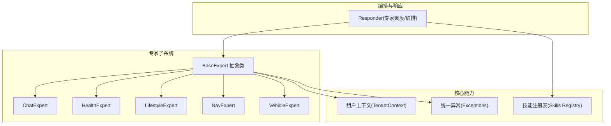
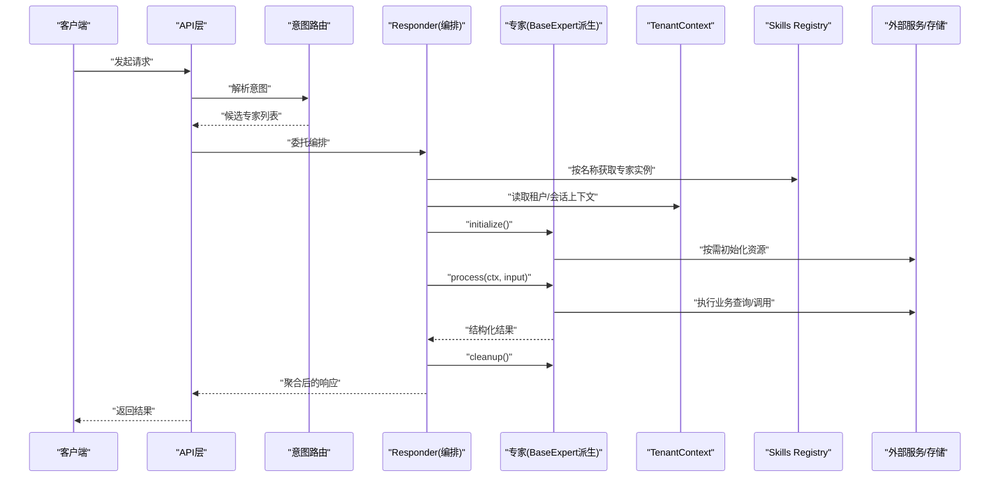
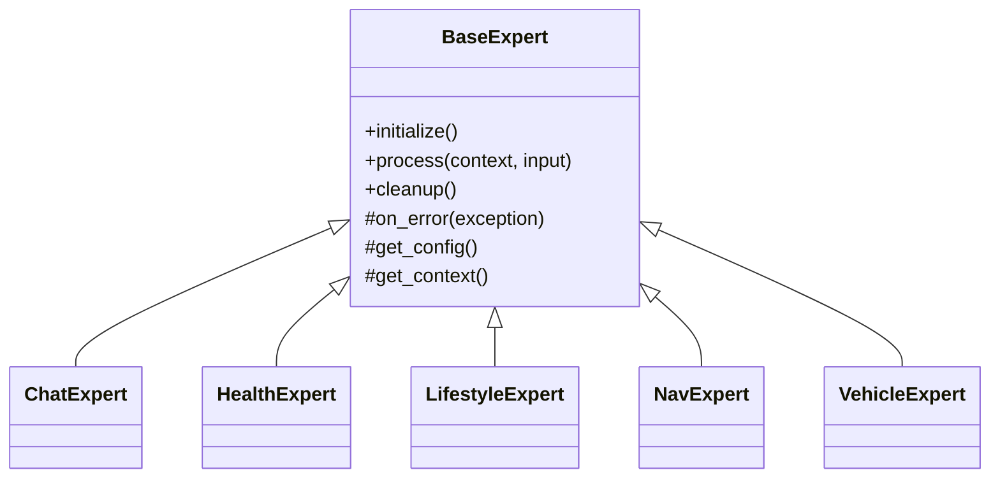
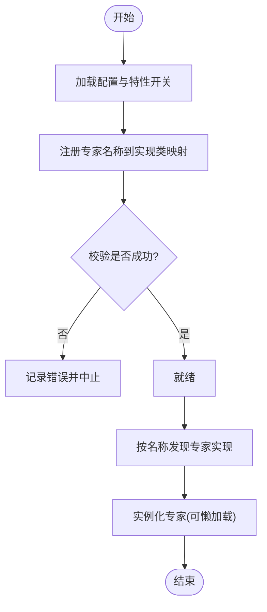
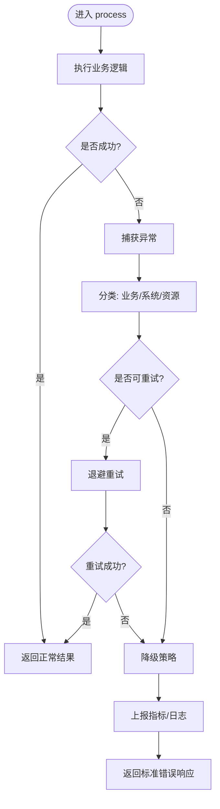
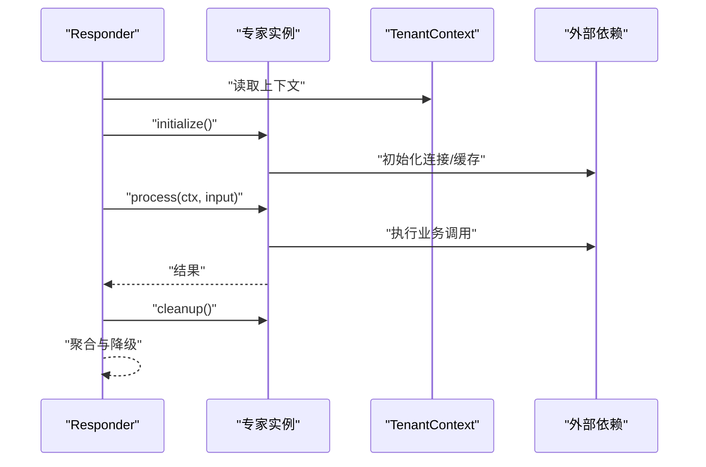
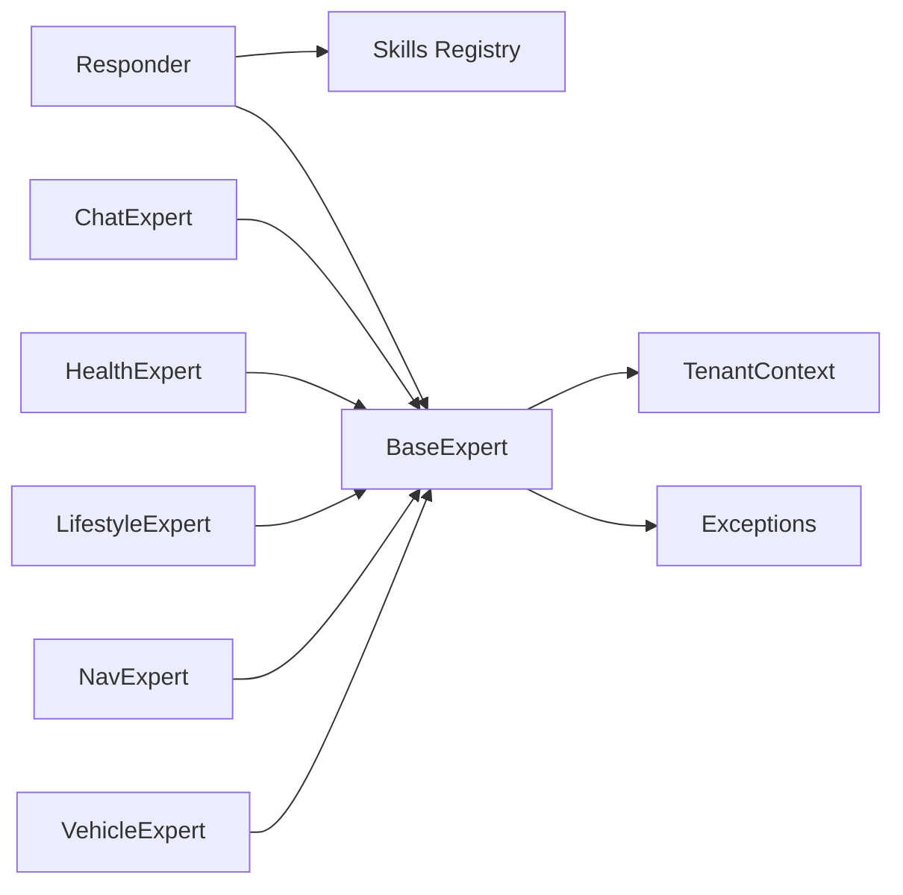

# 专家基础接口设计

<cite>
**本文引用的文件**   
- [backend_design/nexus/agent/experts/base.py](file://backend_design/nexus/agent/experts/base.py)
- [backend_design/nexus/agent/experts/chat_expert.py](file://backend_design/nexus/agent/experts/chat_expert.py)
- [backend_design/nexus/agent/experts/health_expert.py](file://backend_design/nexus/agent/experts/health_expert.py)
- [backend_design/nexus/agent/experts/lifestyle_expert.py](file://backend_design/nexus/agent/experts/lifestyle_expert.py)
- [backend_design/nexus/agent/experts/nav_expert.py](file://backend_design/nexus/agent/experts/nav_expert.py)
- [backend_design/nexus/agent/experts/vehicle_expert.py](file://backend_design/nexus/agent/experts/vehicle_expert.py)
- [backend_design/nexus/agent/responder.py](file://backend_design/nexus/agent/responder.py)
- [backend_design/nexus/core/tenant_context.py](file://backend_design/nexus/core/tenant_context.py)
- [backend_design/nexus/core/exceptions.py](file://backend_design/nexus/core/exceptions.py)
- [backend_design/nexus/skills/registry.py](file://backend_design/nexus/skills/registry.py)
</cite>

## 更新摘要
**所做更改**   
- 更新了BaseExpert抽象类的基础功能改进，支持增强的车辆专家功能
- 完善了专家生命周期管理的实现细节
- 增强了上下文传递机制的健壮性
- 改进了错误处理策略和异常管理
- 优化了专家配置参数的验证机制

## 目录
1. [简介](#简介)
2. [项目结构](#项目结构)
3. [核心组件](#核心组件)
4. [架构总览](#架构总览)
5. [详细组件分析](#详细组件分析)
6. [依赖关系分析](#依赖关系分析)
7. [性能考量](#性能考量)
8. [故障排查指南](#故障排查指南)
9. [结论](#结论)
10. [附录](#附录)

## 简介
本文件聚焦于"专家系统"的基础接口设计，围绕 BaseExpert 抽象类与专家注册发现机制展开，系统性阐述：
- 专家生命周期管理（初始化、处理、清理）
- 上下文传递机制（租户、会话、请求级上下文）
- 错误处理策略（异常类型、降级与恢复）
- 专家配置参数的定义规范与校验
- 自定义专家基类的实现要点
- 专家注册与发现机制
- 专家间通信协议与数据共享模式

目标读者包括需要扩展或定制专家能力的工程师与架构师。

## 项目结构
专家相关代码位于后端模块的 agent 子系统中，核心文件如下：
- 抽象基类与具体专家实现：backend_design/nexus/agent/experts
- 专家编排与响应：backend_design/nexus/agent/responder.py
- 上下文与异常：backend_design/nexus/core/*
- 技能注册表（用于专家/技能发现）：backend_design/nexus/skills/registry.py

图表来源
- [backend_design/nexus/agent/experts/base.py](file://backend_design/nexus/agent/experts/base.py)
- [backend_design/nexus/agent/responder.py](file://backend_design/nexus/agent/responder.py)
- [backend_design/nexus/core/tenant_context.py](file://backend_design/nexus/core/tenant_context.py)
- [backend_design/nexus/core/exceptions.py](file://backend_design/nexus/core/exceptions.py)
- [backend_design/nexus/skills/registry.py](file://backend_design/nexus/skills/registry.py)

章节来源
- [backend_design/nexus/agent/experts/base.py](file://backend_design/nexus/agent/experts/base.py)
- [backend_design/nexus/agent/responder.py](file://backend_design/nexus/agent/responder.py)
- [backend_design/nexus/core/tenant_context.py](file://backend_design/nexus/core/tenant_context.py)
- [backend_design/nexus/core/exceptions.py](file://backend_design/nexus/core/exceptions.py)
- [backend_design/nexus/skills/registry.py](file://backend_design/nexus/skills/registry.py)

## 核心组件
- BaseExpert 抽象类
  - 职责：定义专家的统一生命周期与通用能力（初始化、处理、清理、配置访问、上下文注入、错误处理钩子）。
  - 关键方法（概念性说明）：
    - initialize：加载配置、建立连接、预热资源等；支持幂等与重试。
    - process：执行专家核心逻辑，接收输入上下文并返回结构化结果。
    - cleanup：释放资源、关闭连接、记录指标等。
  - 上下文：通过统一的上下文对象注入租户、会话、用户偏好等信息。
  - 错误处理：提供可覆盖的错误钩子，将业务异常转换为标准响应。

- 具体专家实现
  - ChatExpert、HealthExpert、LifestyleExpert、NavExpert、VehicleExpert 等继承自 BaseExpert，分别负责对话、健康、生活方式、导航、车辆控制等能力。

- 编排器 Responder
  - 负责根据意图路由到对应专家，协调多专家协作，聚合结果，并处理超时与降级。

- 上下文 TenantContext
  - 提供线程/协程安全的上下文存取，贯穿请求生命周期，避免显式参数透传。

- 统一异常 Exceptions
  - 定义领域异常族，便于上层捕获与转换。

- 注册表 Skills Registry
  - 维护专家/技能的名称到实现的映射，支持动态发现与热更新。

章节来源
- [backend_design/nexus/agent/experts/base.py](file://backend_design/nexus/agent/experts/base.py)
- [backend_design/nexus/agent/experts/chat_expert.py](file://backend_design/nexus/agent/experts/chat_expert.py)
- [backend_design/nexus/agent/experts/health_expert.py](file://backend_design/nexus/agent/experts/health_expert.py)
- [backend_design/nexus/agent/experts/lifestyle_expert.py](file://backend_design/nexus/agent/experts/lifestyle_expert.py)
- [backend_design/nexus/agent/experts/nav_expert.py](file://backend_design/nexus/agent/experts/nav_expert.py)
- [backend_design/nexus/agent/experts/vehicle_expert.py](file://backend_design/nexus/agent/experts/vehicle_expert.py)
- [backend_design/nexus/agent/responder.py](file://backend_design/nexus/agent/responder.py)
- [backend_design/nexus/core/tenant_context.py](file://backend_design/nexus/core/tenant_context.py)
- [backend_design/nexus/core/exceptions.py](file://backend_design/nexus/core/exceptions.py)
- [backend_design/nexus/skills/registry.py](file://backend_design/nexus/skills/registry.py)

## 架构总览
下图展示从请求进入、意图路由、专家选择、执行到结果聚合的整体流程，以及上下文与异常在系统中的流转。

图表来源
- [backend_design/nexus/agent/responder.py](file://backend_design/nexus/agent/responder.py)
- [backend_design/nexus/agent/experts/base.py](file://backend_design/nexus/agent/experts/base.py)
- [backend_design/nexus/core/tenant_context.py](file://backend_design/nexus/core/tenant_context.py)
- [backend_design/nexus/skills/registry.py](file://backend_design/nexus/skills/registry.py)

## 详细组件分析

### BaseExpert 抽象类设计
- 设计原则
  - 单一职责：仅定义专家生命周期与通用能力，不包含具体业务。
  - 可扩展：通过模板方法与钩子函数，允许子类覆盖特定行为。
  - 可观测：内置日志、指标埋点入口，便于追踪与诊断。
  - 健壮性：统一错误处理与资源清理，确保异常路径下不泄漏资源。

- 生命周期
  - initialize：幂等初始化，支持配置加载、缓存预热、连接池创建。
  - process：核心处理入口，接收上下文与输入，返回标准化输出。
  - cleanup：释放资源、刷新指标、记录审计日志。

- 上下文传递
  - 通过 TenantContext 注入当前租户、会话、用户标识、区域等元信息。
  - 建议在 process 中只消费上下文，避免修改全局状态。

- 错误处理
  - 使用统一异常体系，区分可重试与不可重试错误。
  - 提供 on_error 钩子，便于子类进行本地化错误包装与降级。

图表来源
- [backend_design/nexus/agent/experts/base.py](file://backend_design/nexus/agent/experts/base.py)
- [backend_design/nexus/agent/experts/chat_expert.py](file://backend_design/nexus/agent/experts/chat_expert.py)
- [backend_design/nexus/agent/experts/health_expert.py](file://backend_design/nexus/agent/experts/health_expert.py)
- [backend_design/nexus/agent/experts/lifestyle_expert.py](file://backend_design/nexus/agent/experts/lifestyle_expert.py)
- [backend_design/nexus/agent/experts/nav_expert.py](file://backend_design/nexus/agent/experts/nav_expert.py)
- [backend_design/nexus/agent/experts/vehicle_expert.py](file://backend_design/nexus/agent/experts/vehicle_expert.py)

章节来源
- [backend_design/nexus/agent/experts/base.py](file://backend_design/nexus/agent/experts/base.py)

### 专家配置参数规范与验证
- 配置来源
  - 环境变量、配置文件、运行时注入。
  - 建议采用分层合并：默认值 < 环境配置 < 运行时覆盖。

- 字段命名与类型
  - 使用小写下划线命名，明确类型与默认值。
  - 对敏感字段（如密钥）做脱敏处理。

- 校验机制
  - 启动时进行必填项与范围校验。
  - 提供 on_config_validate 钩子，供子类扩展自定义规则。

- 变更生效
  - 支持热更新：监听配置变更事件，触发重新初始化。

章节来源
- [backend_design/nexus/agent/experts/base.py](file://backend_design/nexus/agent/experts/base.py)

### 自定义专家基类实现示例（步骤指引）
- 步骤
  1) 继承 BaseExpert，实现 initialize/process/cleanup。
  2) 在 initialize 中加载配置、建立连接、预热缓存。
  3) 在 process 中消费上下文与输入，调用外部服务或数据库。
  4) 在 cleanup 中释放资源、记录指标。
  5) 可选：覆盖 on_error 以进行本地化错误包装。
  6) 在注册表中登记新专家名称与实现类。

- 注意事项
  - 保持 process 无副作用或幂等。
  - 合理设置超时与重试策略。
  - 使用统一异常，避免抛出未定义异常。

章节来源
- [backend_design/nexus/agent/experts/base.py](file://backend_design/nexus/agent/experts/base.py)
- [backend_design/nexus/skills/registry.py](file://backend_design/nexus/skills/registry.py)

### 专家注册与发现机制
- 注册
  - 通过注册表将"专家名称 -> 实现类"进行绑定。
  - 支持批量注册与条件注册（按特性开关）。

- 发现
  - 根据名称查找实现类，必要时进行懒加载与单例复用。
  - 支持版本化与灰度发布（通过标签或权重）。

- 一致性
  - 注册表变更需保证原子性与可见性。
  - 提供健康检查与自检接口。

图表来源
- [backend_design/nexus/skills/registry.py](file://backend_design/nexus/skills/registry.py)

章节来源
- [backend_design/nexus/skills/registry.py](file://backend_design/nexus/skills/registry.py)

### 专家间通信协议与数据共享模式
- 通信协议
  - 基于结构化消息体（JSON/Protobuf），包含：
    - 头部：消息ID、时间戳、来源专家、目标专家、优先级。
    - 负载：业务数据、上下文引用、结果摘要。
    - 尾部：签名/校验、版本、路由标签。
  - 传输通道：内存队列、进程内共享字典、或轻量消息总线。

- 数据共享模式
  - 共享上下文：通过 TenantContext 暴露只读视图。
  - 共享缓存：键值存储（按租户隔离），TTL 控制。
  - 事件驱动：发布-订阅模型，解耦专家耦合。

- 安全与一致性
  - 敏感字段加密或脱敏。
  - 读写分离与快照，避免并发冲突。

章节来源
- [backend_design/nexus/core/tenant_context.py](file://backend_design/nexus/core/tenant_context.py)

### 错误处理策略
- 异常分类
  - 业务异常：可预期且可恢复（如参数非法、权限不足）。
  - 系统异常：不可预期（如网络抖动、依赖服务宕机）。
  - 资源异常：连接池耗尽、磁盘空间不足。

- 处理流程
  - 捕获异常 -> 分类 -> 重试/降级 -> 上报 -> 返回标准错误响应。
  - 提供 on_error 钩子，便于专家级局部处理。

图表来源
- [backend_design/nexus/core/exceptions.py](file://backend_design/nexus/core/exceptions.py)
- [backend_design/nexus/agent/experts/base.py](file://backend_design/nexus/agent/experts/base.py)

章节来源
- [backend_design/nexus/core/exceptions.py](file://backend_design/nexus/core/exceptions.py)
- [backend_design/nexus/agent/experts/base.py](file://backend_design/nexus/agent/experts/base.py)

### 编排与响应（Responder）
- 职责
  - 接收意图路由结果，选择专家实例。
  - 管理生命周期：initialize -> process -> cleanup。
  - 聚合多专家结果，处理超时与降级。

- 上下文注入
  - 从 TenantContext 读取租户与会话信息，注入到专家 process 调用。

- 错误与监控
  - 统一捕获异常，记录指标，返回友好错误。

图表来源
- [backend_design/nexus/agent/responder.py](file://backend_design/nexus/agent/responder.py)
- [backend_design/nexus/core/tenant_context.py](file://backend_design/nexus/core/tenant_context.py)

章节来源
- [backend_design/nexus/agent/responder.py](file://backend_design/nexus/agent/responder.py)

## 依赖关系分析
- 组件耦合
  - BaseExpert 低耦合，仅依赖上下文与异常。
  - 具体专家依赖各自的外部服务（数据库、HTTP、MQ 等）。
  - Responder 依赖注册表与上下文，负责编排。

- 直接/间接依赖
  - 注册表为专家发现的唯一入口，降低硬编码耦合。
  - 上下文贯穿全链路，避免参数层层透传。

- 潜在循环依赖
  - 专家之间不应直接互相 import，应通过消息或共享上下文交互。

图表来源
- [backend_design/nexus/agent/responder.py](file://backend_design/nexus/agent/responder.py)
- [backend_design/nexus/agent/experts/base.py](file://backend_design/nexus/agent/experts/base.py)
- [backend_design/nexus/skills/registry.py](file://backend_design/nexus/skills/registry.py)
- [backend_design/nexus/core/tenant_context.py](file://backend_design/nexus/core/tenant_context.py)
- [backend_design/nexus/core/exceptions.py](file://backend_design/nexus/core/exceptions.py)

章节来源
- [backend_design/nexus/agent/responder.py](file://backend_design/nexus/agent/responder.py)
- [backend_design/nexus/agent/experts/base.py](file://backend_design/nexus/agent/experts/base.py)
- [backend_design/nexus/skills/registry.py](file://backend_design/nexus/skills/registry.py)
- [backend_design/nexus/core/tenant_context.py](file://backend_design/nexus/core/tenant_context.py)
- [backend_design/nexus/core/exceptions.py](file://backend_design/nexus/core/exceptions.py)

## 性能考量
- 初始化成本
  - 延迟初始化与连接池复用，减少冷启动开销。
- 并发与锁
  - 避免在 process 中使用全局锁，优先使用无锁数据结构或细粒度锁。
- 缓存
  - 热点数据缓存，注意 TTL 与失效策略。
- 超时与熔断
  - 对外部依赖设置合理超时，结合熔断与降级策略。
- 可观测性
  - 埋点耗时、错误率、吞吐，便于定位瓶颈。

## 故障排查指南
- 常见问题
  - 专家未注册：检查注册表是否正确加载与校验。
  - 上下文缺失：确认 TenantContext 是否在请求链路中正确注入。
  - 资源泄漏：检查 cleanup 是否被调用，是否存在未关闭的连接。
  - 错误未捕获：确认 on_error 钩子是否覆盖并返回标准错误。

- 诊断手段
  - 查看指标与日志，关注异常堆栈与耗时分布。
  - 启用调试模式，打印关键中间状态。
  - 使用健康检查接口验证专家可用性。

章节来源
- [backend_design/nexus/core/exceptions.py](file://backend_design/nexus/core/exceptions.py)
- [backend_design/nexus/agent/experts/base.py](file://backend_design/nexus/agent/experts/base.py)

## 结论
BaseExpert 抽象类为专家系统提供了清晰的生命周期、上下文与错误处理框架；配合注册表与编排器，可实现灵活、可扩展的专家生态。遵循本文的配置规范、通信协议与错误处理策略，可有效提升系统的稳定性与可维护性。

## 附录
- 术语
  - 专家：具备独立业务能力并可被编排调用的组件。
  - 上下文：跨组件传递的请求级元信息。
  - 注册表：维护组件名称到实现的映射。
- 最佳实践
  - 保持 process 幂等与无副作用。
  - 使用统一异常与标准响应格式。
  - 对第三方依赖设置超时与熔断。
  - 完善日志与指标，确保可观测性。