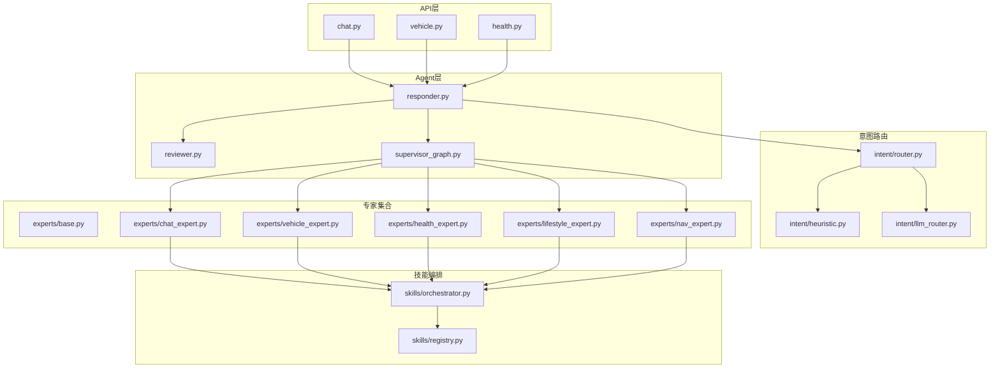
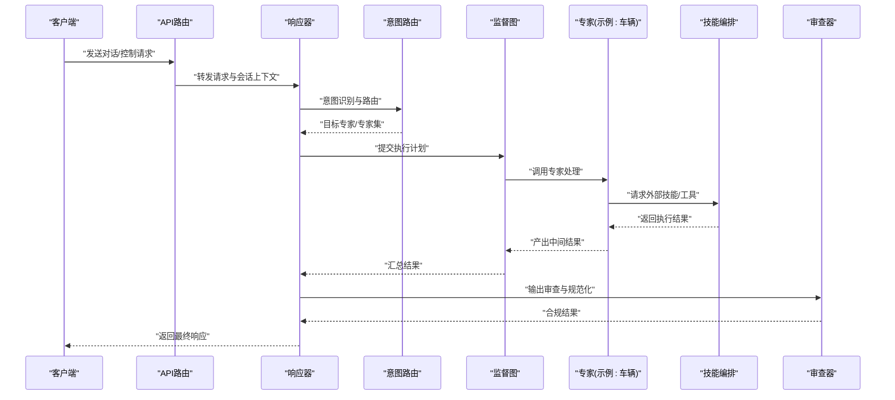
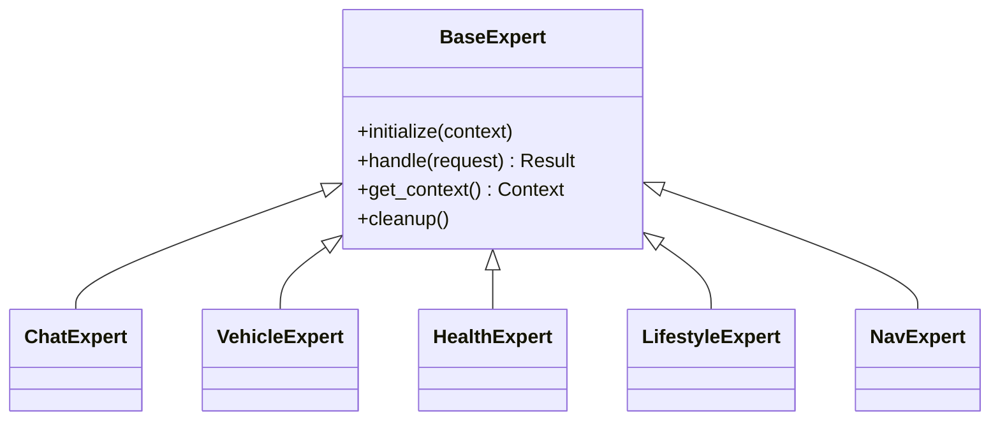
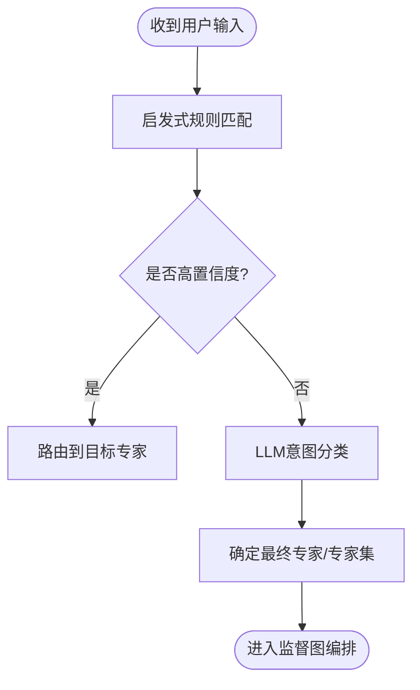
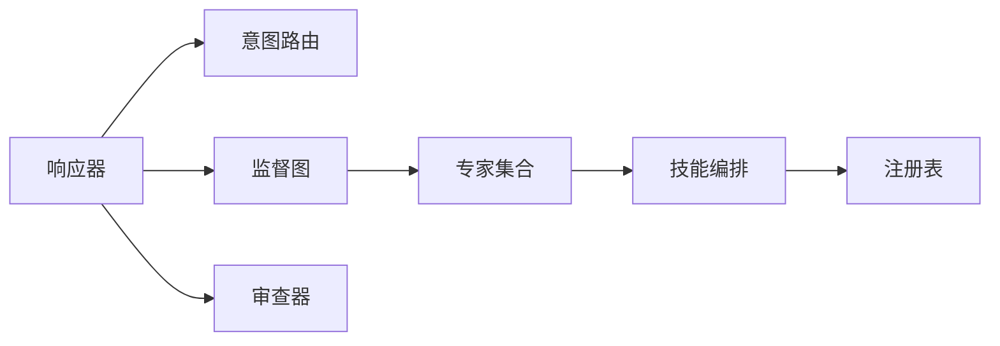

# 专家系统架构

<cite>
**本文引用的文件**   
- [backend_design/nexus/agent/experts/base.py](file://backend_design/nexus/agent/experts/base.py)
- [backend_design/nexus/agent/experts/chat_expert.py](file://backend_design/nexus/agent/experts/chat_expert.py)
- [backend_design/nexus/agent/experts/vehicle_expert.py](file://backend_design/nexus/agent/experts/vehicle_expert.py)
- [backend_design/nexus/agent/experts/health_expert.py](file://backend_design/nexus/agent/experts/health_expert.py)
- [backend_design/nexus/agent/experts/lifestyle_expert.py](file://backend_design/nexus/agent/experts/lifestyle_expert.py)
- [backend_design/nexus/agent/experts/nav_expert.py](file://backend_design/nexus/agent/experts/nav_expert.py)
- [backend_design/nexus/agent/responder.py](file://backend_design/nexus/agent/responder.py)
- [backend_design/nexus/agent/reviewer.py](file://backend_design/nexus/agent/reviewer.py)
- [backend_design/nexus/agent/supervisor_graph.py](file://backend_design/nexus/agent/supervisor_graph.py)
- [backend_design/nexus/intent/router.py](file://backend_design/nexus/intent/router.py)
- [backend_design/nexus/intent/heuristic.py](file://backend_design/nexus/intent/heuristic.py)
- [backend_design/nexus/intent/llm_router.py](file://backend_design/nexus/intent/llm_router.py)
- [backend_design/nexus/skills/orchestrator.py](file://backend_design/nexus/skills/orchestrator.py)
- [backend_design/nexus/skills/registry.py](file://backend_design/nexus/skills/registry.py)
- [backend_design/nexus/core/circuit_breaker.py](file://backend_design/nexus/core/circuit熔断器.py)
- [backend_design/nexus/observability/metrics.py](file://backend_design/nexus/observability/metrics.py)
- [backend_design/nexus/observability/cockpit_metrics.py](file://backend_design/nexus/observability/cockpit_metrics.py)
- [backend_design/nexus/api/routes/chat.py](file://backend_design/nexus/api/routes/chat.py)
- [backend_design/nexus/api/routes/vehicle.py](file://backend_design/nexus/api/routes/vehicle.py)
- [backend_design/nexus/api/routes/health.py](file://backend_design/nexus/api/routes/health.py)
- [backend_design/nexus/config.py](file://backend_design/nexus/config.py)
</cite>

## 目录
1. [简介](#简介)
2. [项目结构](#项目结构)
3. [核心组件](#核心组件)
4. [架构总览](#架构总览)
5. [详细组件分析](#详细组件分析)
6. [依赖关系分析](#依赖关系分析)
7. [性能与可观测性](#性能与可观测性)
8. [故障隔离与容错](#故障隔离与容错)
9. [自定义专家开发指南](#自定义专家开发指南)
10. [配置管理与参数传递](#配置管理与参数传递)
11. [常见问题排查](#常见问题排查)
12. [结论](#结论)

## 简介
本文件面向NexusCockpit的“专家系统”模块，系统性阐述专家模式的设计原理、注册与生命周期管理、内置专家的职责分工、专家间协作与知识共享机制、监控与故障隔离策略，并提供可扩展的自定义专家开发指引。文档以代码级视角展开，辅以架构图与时序图，帮助读者快速理解并高效扩展专家能力。

## 项目结构
专家系统位于后端设计目录下的 agent 子系统中，围绕“意图路由—专家执行—结果审查—响应组装”的主流程组织。关键目录与职责如下：
- agent/experts：基础专家接口与各内置专家实现（聊天、车辆、健康、生活方式、导航）
- agent：协调器（Responder）、审查器（Reviewer）、监督图（Supervisor Graph）
- intent：意图识别与路由（启发式、LLM路由）
- skills：技能编排与注册中心（为专家提供工具调用与外部能力）
- core：通用基础设施（熔断器、日志、异常等）
- observability：指标采集与可视化
- api：HTTP/WebSocket入口，将请求分发到专家系统

图表来源
- [backend_design/nexus/api/routes/chat.py](file://backend_design/nexus/api/routes/chat.py)
- [backend_design/nexus/api/routes/vehicle.py](file://backend_design/nexus/api/routes/vehicle.py)
- [backend_design/nexus/api/routes/health.py](file://backend_design/nexus/api/routes/health.py)
- [backend_design/nexus/agent/responder.py](file://backend_design/nexus/agent/responder.py)
- [backend_design/nexus/agent/reviewer.py](file://backend_design/nexus/agent/reviewer.py)
- [backend_design/nexus/agent/supervisor_graph.py](file://backend_design/nexus/agent/supervisor_graph.py)
- [backend_design/nexus/intent/router.py](file://backend_design/nexus/intent/router.py)
- [backend_design/nexus/intent/heuristic.py](file://backend_design/nexus/intent/heuristic.py)
- [backend_design/nexus/intent/llm_router.py](file://backend_design/nexus/intent/llm_router.py)
- [backend_design/nexus/agent/experts/base.py](file://backend_design/nexus/agent/experts/base.py)
- [backend_design/nexus/agent/experts/chat_expert.py](file://backend_design/nexus/agent/experts/chat_expert.py)
- [backend_design/nexus/agent/experts/vehicle_expert.py](file://backend_design/nexus/agent/experts/vehicle_expert.py)
- [backend_design/nexus/agent/experts/health_expert.py](file://backend_design/nexus/agent/experts/health_expert.py)
- [backend_design/nexus/agent/experts/lifestyle_expert.py](file://backend_design/nexus/agent/experts/lifestyle_expert.py)
- [backend_design/nexus/agent/experts/nav_expert.py](file://backend_design/nexus/agent/experts/nav_expert.py)
- [backend_design/nexus/skills/orchestrator.py](file://backend_design/nexus/skills/orchestrator.py)
- [backend_design/nexus/skills/registry.py](file://backend_design/nexus/skills/registry.py)

章节来源
- [backend_design/nexus/agent/responder.py](file://backend_design/nexus/agent/responder.py)
- [backend_design/nexus/agent/supervisor_graph.py](file://backend_design/nexus/agent/supervisor_graph.py)
- [backend_design/nexus/intent/router.py](file://backend_design/nexus/intent/router.py)
- [backend_design/nexus/skills/orchestrator.py](file://backend_design/nexus/skills/orchestrator.py)
- [backend_design/nexus/skills/registry.py](file://backend_design/nexus/skills/registry.py)

## 核心组件
- 基础专家接口：定义统一的专家抽象，包括初始化、处理请求、上下文访问、资源清理等生命周期钩子。
- 专家注册机制：通过注册表集中管理专家实例，支持动态发现、按名称或类型解析、版本兼容检查。
- 监督图（Supervisor Graph）：编排多专家协作的执行流，决定并行/串行、条件分支与回退路径。
- 意图路由：结合启发式规则与大模型路由，将用户输入映射到目标专家或专家组合。
- 审查器（Reviewer）：对专家输出进行质量校验、安全过滤与格式规范化。
- 响应器（Responder）：统一入口，负责会话上下文装配、路由调度、结果聚合与返回。

章节来源
- [backend_design/nexus/agent/experts/base.py](file://backend_design/nexus/agent/experts/base.py)
- [backend_design/nexus/agent/supervisor_graph.py](file://backend_design/nexus/agent/supervisor_graph.py)
- [backend_design/nexus/intent/router.py](file://backend_design/nexus/intent/router.py)
- [backend_design/nexus/agent/reviewer.py](file://backend_design/nexus/agent/reviewer.py)
- [backend_design/nexus/agent/responder.py](file://backend_design/nexus/agent/responder.py)

## 架构总览
专家系统采用“分层+编排”的架构：API层接收请求，交由响应器装配上下文；意图路由选择目标专家；监督图编排执行；各专家通过技能编排访问外部能力；审查器保障输出质量；指标与熔断器提供可观测性与稳定性保障。

图表来源
- [backend_design/nexus/api/routes/chat.py](file://backend_design/nexus/api/routes/chat.py)
- [backend_design/nexus/agent/responder.py](file://backend_design/nexus/agent/responder.py)
- [backend_design/nexus/intent/router.py](file://backend_design/nexus/intent/router.py)
- [backend_design/nexus/agent/supervisor_graph.py](file://backend_design/nexus/agent/supervisor_graph.py)
- [backend_design/nexus/agent/experts/vehicle_expert.py](file://backend_design/nexus/agent/experts/vehicle_expert.py)
- [backend_design/nexus/skills/orchestrator.py](file://backend_design/nexus/skills/orchestrator.py)
- [backend_design/nexus/agent/reviewer.py](file://backend_design/nexus/agent/reviewer.py)

## 详细组件分析

### 基础专家接口与生命周期
- 设计要点
  - 统一抽象：所有专家需实现基础接口，确保一致的初始化、处理、上下文访问与销毁流程。
  - 生命周期钩子：支持按需重载构造、启动、处理、关闭等方法，便于资源管理与状态恢复。
  - 上下文注入：通过上下文对象获取会话历史、用户偏好、设备状态等。
  - 错误契约：明确异常类型与返回码，便于上层统一处理与降级。
- 复杂度与扩展性
  - 新增专家仅需实现接口并注册，不影响既有流程。
  - 通过上下文与技能编排解耦领域逻辑与外部依赖。

章节来源
- [backend_design/nexus/agent/experts/base.py](file://backend_design/nexus/agent/experts/base.py)

#### 类关系图（专家体系）

图表来源
- [backend_design/nexus/agent/experts/base.py](file://backend_design/nexus/agent/experts/base.py)
- [backend_design/nexus/agent/experts/chat_expert.py](file://backend_design/nexus/agent/experts/chat_expert.py)
- [backend_design/nexus/agent/experts/vehicle_expert.py](file://backend_design/nexus/agent/experts/vehicle_expert.py)
- [backend_design/nexus/agent/experts/health_expert.py](file://backend_design/nexus/agent/experts/health_expert.py)
- [backend_design/nexus/agent/experts/lifestyle_expert.py](file://backend_design/nexus/agent/experts/lifestyle_expert.py)
- [backend_design/nexus/agent/experts/nav_expert.py](file://backend_design/nexus/agent/experts/nav_expert.py)

### 专家注册机制
- 注册表职责
  - 维护专家名称到实现的映射，支持按名称解析与批量查询。
  - 提供版本兼容性校验与冲突检测。
  - 暴露热插拔接口，允许运行时添加/移除专家。
- 使用方式
  - 在专家模块中声明注册装饰器或显式调用注册函数。
  - 在应用启动时加载所有已注册的专家。

章节来源
- [backend_design/nexus/skills/registry.py](file://backend_design/nexus/skills/registry.py)

### 监督图与协作编排
- 编排策略
  - 顺序执行：适用于有强前后依赖的专家链。
  - 并行执行：适用于无副作用且独立的专家任务，提升吞吐。
  - 条件分支：根据意图置信度或上下文动态选择分支。
  - 回退路径：当某专家失败时，自动切换到备用专家或默认策略。
- 知识共享
  - 通过共享上下文与中间结果缓存，避免重复计算。
  - 利用技能编排提供的统一数据通道进行跨专家通信。

章节来源
- [backend_design/nexus/agent/supervisor_graph.py](file://backend_design/nexus/agent/supervisor_graph.py)
- [backend_design/nexus/skills/orchestrator.py](file://backend_design/nexus/skills/orchestrator.py)

### 内置专家职责分工
- 聊天专家
  - 职责：通用对话、闲聊、澄清问题、引导下一步操作。
  - 特点：高复用、低耦合，常作为兜底或前置澄清环节。
- 车辆专家
  - 职责：车辆控制指令解析与执行（如空调、座椅、车窗、媒体）。
  - 特点：强依赖车辆技能编排与底层车控接口，需严格权限与安全校验。
- 健康专家
  - 职责：健康咨询、体检报告解读、运动建议、用药提醒。
  - 特点：需要引用知识库与个性化健康档案，强调准确性与风险提示。
- 生活方式专家
  - 职责：生活习惯管理、日程规划、习惯追踪与反馈。
  - 特点：与记忆与偏好系统深度集成，注重长期行为建模。
- 导航专家
  - 职责：路线规划、目的地推荐、实时路况与到达预估。
  - 特点：依赖地图服务与位置信息，关注时效性与精度。

章节来源
- [backend_design/nexus/agent/experts/chat_expert.py](file://backend_design/nexus/agent/experts/chat_expert.py)
- [backend_design/nexus/agent/experts/vehicle_expert.py](file://backend_design/nexus/agent/experts/vehicle_expert.py)
- [backend_design/nexus/agent/experts/health_expert.py](file://backend_design/nexus/agent/experts/health_expert.py)
- [backend_design/nexus/agent/experts/lifestyle_expert.py](file://backend_design/nexus/agent/experts/lifestyle_expert.py)
- [backend_design/nexus/agent/experts/nav_expert.py](file://backend_design/nexus/agent/experts/nav_expert.py)

### 意图识别与路由
- 启发式路由：基于关键词、正则、规则树快速匹配，适合高频稳定场景。
- LLM路由：借助大模型进行语义理解与意图分类，适合复杂长尾场景。
- 混合策略：先启发式后LLM，或按置信度阈值切换，兼顾性能与准确率。

图表来源
- [backend_design/nexus/intent/heuristic.py](file://backend_design/nexus/intent/heuristic.py)
- [backend_design/nexus/intent/llm_router.py](file://backend_design/nexus/intent/llm_router.py)
- [backend_design/nexus/intent/router.py](file://backend_design/nexus/intent/router.py)

章节来源
- [backend_design/nexus/intent/router.py](file://backend_design/nexus/intent/router.py)
- [backend_design/nexus/intent/heuristic.py](file://backend_design/nexus/intent/heuristic.py)
- [backend_design/nexus/intent/llm_router.py](file://backend_design/nexus/intent/llm_router.py)

### 审查器与响应器
- 审查器
  - 功能：内容安全过滤、敏感词检测、格式校验、合规性检查。
  - 输出：标准化响应结构，附带元数据（耗时、来源专家、置信度）。
- 响应器
  - 功能：会话上下文装配、路由调度、结果聚合、错误归一化。
  - 特性：支持流式返回与增量更新，适配前端交互体验。

章节来源
- [backend_design/nexus/agent/reviewer.py](file://backend_design/nexus/agent/reviewer.py)
- [backend_design/nexus/agent/responder.py](file://backend_design/nexus/agent/responder.py)

## 依赖关系分析
- 组件耦合
  - 响应器与路由、监督图强耦合；专家与技能编排弱耦合（通过接口与上下文）。
  - 审查器独立于具体专家，便于横向增强。
- 外部依赖
  - 车辆控制、地图服务、健康数据库等通过技能编排接入，降低直接依赖。
- 潜在循环
  - 通过注册表与编排层解耦，避免专家之间直接互相调用导致的循环依赖。

图表来源
- [backend_design/nexus/agent/responder.py](file://backend_design/nexus/agent/responder.py)
- [backend_design/nexus/agent/supervisor_graph.py](file://backend_design/nexus/agent/supervisor_graph.py)
- [backend_design/nexus/skills/orchestrator.py](file://backend_design/nexus/skills/orchestrator.py)
- [backend_design/nexus/skills/registry.py](file://backend_design/nexus/skills/registry.py)
- [backend_design/nexus/agent/reviewer.py](file://backend_design/nexus/agent/reviewer.py)

章节来源
- [backend_design/nexus/agent/responder.py](file://backend_design/nexus/agent/responder.py)
- [backend_design/nexus/agent/supervisor_graph.py](file://backend_design/nexus/agent/supervisor_graph.py)
- [backend_design/nexus/skills/orchestrator.py](file://backend_design/nexus/skills/orchestrator.py)
- [backend_design/nexus/skills/registry.py](file://backend_design/nexus/skills/registry.py)

## 性能与可观测性
- 指标采集
  - 专家维度：QPS、延迟分布、错误率、超时次数。
  - 系统维度：内存占用、线程池利用率、外部依赖调用成功率。
- 可视化
  - 仪表盘展示关键指标趋势与告警阈值。
- 优化建议
  - 热点专家启用缓存与批处理。
  - 非关键路径异步化，减少主流程阻塞。
  - 合理设置并发度与超时时间，避免雪崩。

章节来源
- [backend_design/nexus/observability/metrics.py](file://backend_design/nexus/observability/metrics.py)
- [backend_design/nexus/observability/cockpit_metrics.py](file://backend_design/nexus/observability/cockpit_metrics.py)

## 故障隔离与容错
- 熔断器
  - 针对外部依赖（车控、地图、健康库）实施熔断，防止级联失败。
  - 支持半开探测与自适应恢复。
- 降级策略
  - 专家不可用时回退到默认专家或本地缓存结果。
  - 部分字段缺失时提供占位与提示。
- 重试与幂等
  - 对可重试操作设置指数退避与最大重试次数。
  - 对外部写操作保证幂等，避免重复执行。

章节来源
- [backend_design/nexus/core/circuit熔断器.py](file://backend_design/nexus/core/circuit熔断器.py)

## 自定义专家开发指南
- 步骤概览
  1. 继承基础专家接口，实现必要方法。
  2. 在专家模块中完成注册（名称、版本、描述）。
  3. 在监督图中注册该专家的节点与边。
  4. 编写单元测试覆盖正常与异常路径。
- 最佳实践
  - 保持专家单一职责，避免跨领域耦合。
  - 通过上下文与技能编排访问外部能力，不直接依赖第三方SDK。
  - 明确错误契约，返回结构化错误以便上层处理。
- 参考路径
  - 基础接口与生命周期：[base.py](file://backend_design/nexus/agent/experts/base.py)
  - 注册表用法：[registry.py](file://backend_design/nexus/skills/registry.py)
  - 编排接入点：[supervisor_graph.py](file://backend_design/nexus/agent/supervisor_graph.py)
  - 示例专家：[chat_expert.py](file://backend_design/nexus/agent/experts/chat_expert.py)、[vehicle_expert.py](file://backend_design/nexus/agent/experts/vehicle_expert.py)

章节来源
- [backend_design/nexus/agent/experts/base.py](file://backend_design/nexus/agent/experts/base.py)
- [backend_design/nexus/skills/registry.py](file://backend_design/nexus/skills/registry.py)
- [backend_design/nexus/agent/supervisor_graph.py](file://backend_design/nexus/agent/supervisor_graph.py)
- [backend_design/nexus/agent/experts/chat_expert.py](file://backend_design/nexus/agent/experts/chat_expert.py)
- [backend_design/nexus/agent/experts/vehicle_expert.py](file://backend_design/nexus/agent/experts/vehicle_expert.py)

## 配置管理与参数传递
- 配置来源
  - 环境变量、配置文件、运行时参数。
  - 专家级配置与全局配置分离，支持覆盖与合并。
- 参数传递
  - 通过上下文对象注入会话、用户、设备信息。
  - 专家间共享数据通过监督图的中间结果与缓存。
- 安全与审计
  - 敏感配置加密存储与最小权限访问。
  - 关键参数变更记录审计日志。

章节来源
- [backend_design/nexus/config.py](file://backend_design/nexus/config.py)
- [backend_design/nexus/agent/responder.py](file://backend_design/nexus/agent/responder.py)
- [backend_design/nexus/agent/supervisor_graph.py](file://backend_design/nexus/agent/supervisor_graph.py)

## 常见问题排查
- 症状：专家无响应或超时
  - 检查熔断器状态与外部依赖健康度。
  - 查看指标面板中的延迟与错误率。
- 症状：意图识别不准确
  - 调整启发式规则权重或LLM路由阈值。
  - 补充训练样本与规则库。
- 症状：专家间数据不一致
  - 确认共享上下文写入时机与一致性策略。
  - 增加幂等与冲突解决逻辑。
- 症状：输出被审查器拦截
  - 检查安全策略与白名单配置。
  - 调整审查阈值与模板。

章节来源
- [backend_design/nexus/observability/metrics.py](file://backend_design/nexus/observability/metrics.py)
- [backend_design/nexus/observability/cockpit_metrics.py](file://backend_design/nexus/observability/cockpit_metrics.py)
- [backend_design/nexus/core/circuit熔断器.py](file://backend_design/nexus/core/circuit熔断器.py)
- [backend_design/nexus/agent/reviewer.py](file://backend_design/nexus/agent/reviewer.py)

## 结论
NexusCockpit的专家系统通过清晰的接口抽象、灵活的注册与编排机制、稳健的意图路由与审查流程，实现了高内聚、低耦合的可扩展架构。配合完善的可观测性与容错策略，能够在复杂车载场景中提供稳定、智能的服务体验。开发者可基于本文档快速定位关键组件、理解协作模式，并按指南扩展新的专家能力。