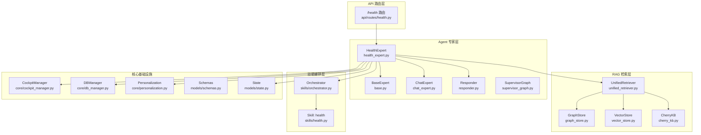
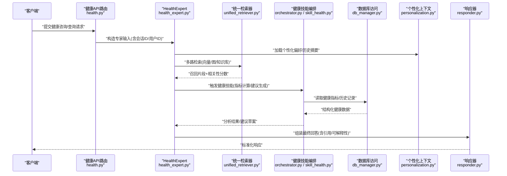
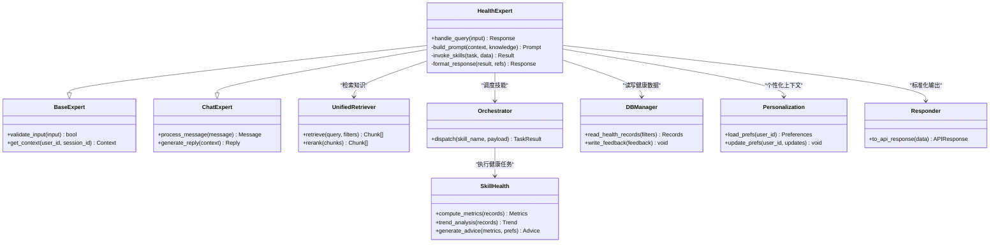
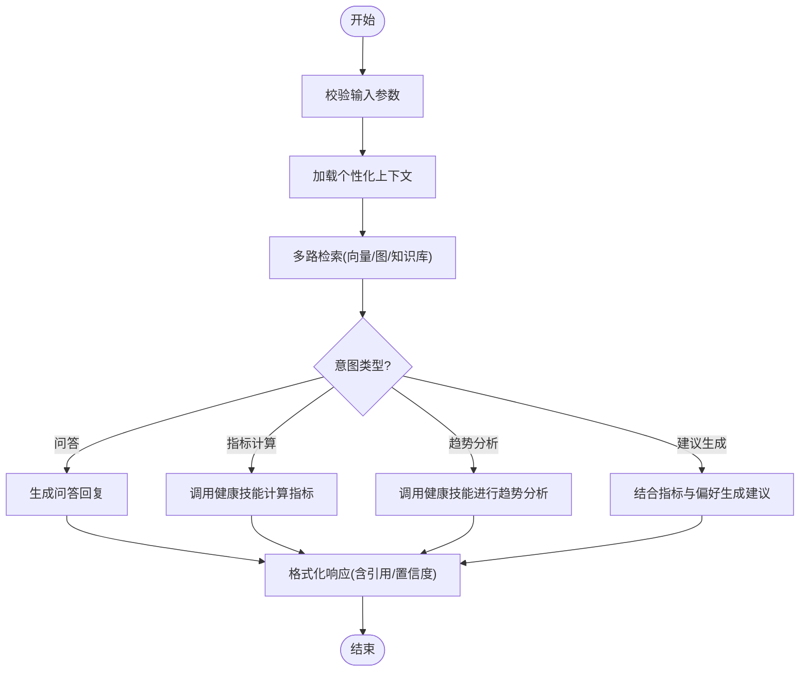
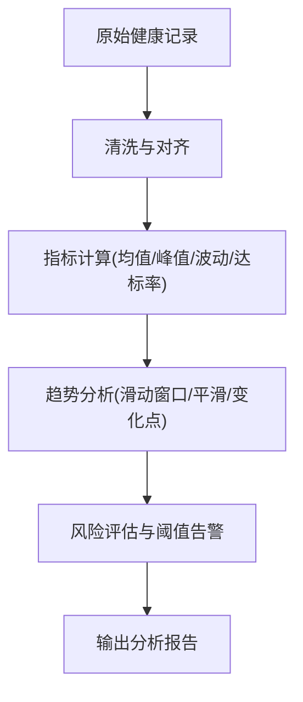
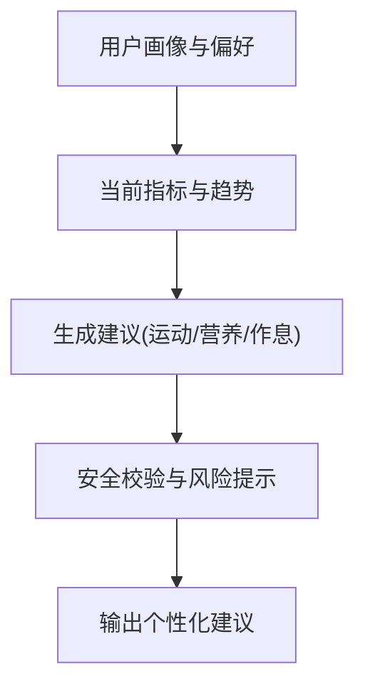
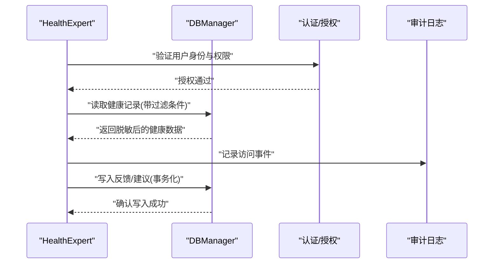
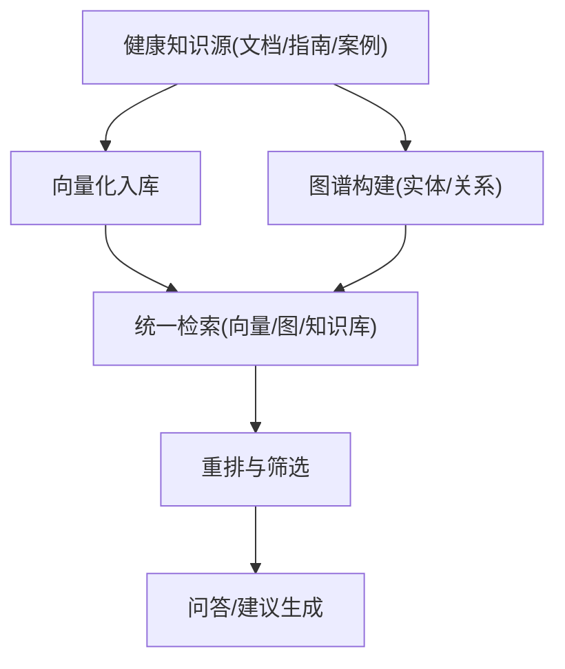
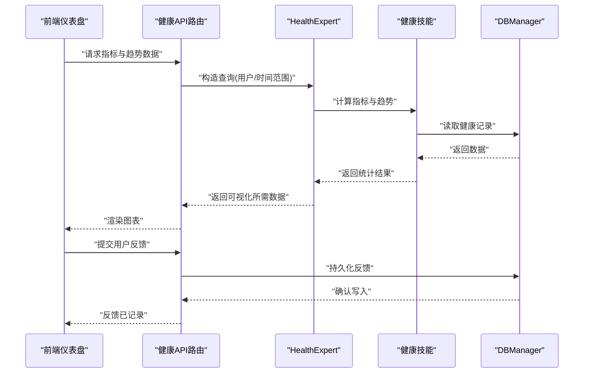
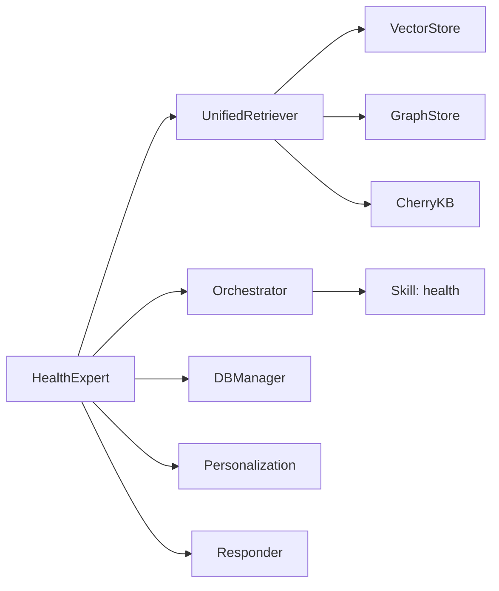

# 健康专家实现

<cite>
**本文引用的文件**   
- [health_expert.py](file://backend_design/nexus/agent/experts/health_expert.py)
- [base.py](file://backend_design/nexus/agent/experts/base.py)
- [chat_expert.py](file://backend_design/nexus/agent/experts/chat_expert.py)
- [responder.py](file://backend_design/nexus/agent/responder.py)
- [supervisor_graph.py](file://backend_design/nexus/agent/supervisor_graph.py)
- [health.py](file://backend_design/nexus/api/routes/health.py)
- [cockpit_manager.py](file://backend_design/nexus/core/cockpit_manager.py)
- [db_manager.py](file://backend_design/nexus/core/db_manager.py)
- [personalization.py](file://backend_design/nexus/core/personalization.py)
- [schemas.py](file://backend_design/nexus/models/schemas.py)
- [state.py](file://backend_design/nexus/models/state.py)
- [unified_retriever.py](file://backend_design/nexus/rag/unified_retriever.py)
- [graph_store.py](file://backend_design/nexus/rag/graph_store.py)
- [vector_store.py](file://backend_design/nexus/rag/vector_store.py)
- [cherry_kb.py](file://backend_design/nexus/rag/cherry_kb.py)
- [orchestrator.py](file://backend_design/nexus/skills/orchestrator.py)
- [skill_health.py](file://backend_design/nexus/skills/health.py)
</cite>

## 目录
1. [简介](#简介)
2. [项目结构](#项目结构)
3. [核心组件](#核心组件)
4. [架构总览](#架构总览)
5. [详细组件分析](#详细组件分析)
6. [依赖关系分析](#依赖关系分析)
7. [性能考虑](#性能考虑)
8. [故障排查指南](#故障排查指南)
9. [结论](#结论)
10. [附录](#附录)

## 简介
本文件面向“健康专家模块”，围绕 HealthExpert 类的实现原理与工程落地进行系统化说明。内容覆盖：
- 健康咨询问答、健康数据分析与个人健康建议生成
- 健康数据采集与处理流程、指标计算与趋势分析
- 与健康数据库的集成方式与数据隐私保护机制
- 健康咨询处理流程与个性化建议生成的代码级示例路径
- 健康数据的可视化展示与用户反馈收集机制
- 健康知识的更新与维护策略

## 项目结构
健康专家相关能力分布在 Agent 专家层、API 路由层、RAG 检索层、技能编排层以及核心基础设施（数据库、个性化、状态管理）等位置。下图给出与“健康专家”相关的模块组织概览。

图表来源
- [health_expert.py](file://backend_design/nexus/agent/experts/health_expert.py)
- [base.py](file://backend_design/nexus/agent/experts/base.py)
- [chat_expert.py](file://backend_design/nexus/agent/experts/chat_expert.py)
- [responder.py](file://backend_design/nexus/agent/responder.py)
- [supervisor_graph.py](file://backend_design/nexus/agent/supervisor_graph.py)
- [health.py](file://backend_design/nexus/api/routes/health.py)
- [unified_retriever.py](file://backend_design/nexus/rag/unified_retriever.py)
- [graph_store.py](file://backend_design/nexus/rag/graph_store.py)
- [vector_store.py](file://backend_design/nexus/rag/vector_store.py)
- [cherry_kb.py](file://backend_design/nexus/rag/cherry_kb.py)
- [orchestrator.py](file://backend_design/nexus/skills/orchestrator.py)
- [skill_health.py](file://backend_design/nexus/skills/health.py)
- [cockpit_manager.py](file://backend_design/nexus/core/cockpit_manager.py)
- [db_manager.py](file://backend_design/nexus/core/db_manager.py)
- [personalization.py](file://backend_design/nexus/core/personalization.py)
- [schemas.py](file://backend_design/nexus/models/schemas.py)
- [state.py](file://backend_design/nexus/models/state.py)

章节来源
- [health_expert.py](file://backend_design/nexus/agent/experts/health_expert.py)
- [health.py](file://backend_design/nexus/api/routes/health.py)
- [unified_retriever.py](file://backend_design/nexus/rag/unified_retriever.py)
- [orchestrator.py](file://backend_design/nexus/skills/orchestrator.py)
- [skill_health.py](file://backend_design/nexus/skills/health.py)
- [db_manager.py](file://backend_design/nexus/core/db_manager.py)
- [personalization.py](file://backend_design/nexus/core/personalization.py)
- [schemas.py](file://backend_design/nexus/models/schemas.py)
- [state.py](file://backend_design/nexus/models/state.py)

## 核心组件
- HealthExpert：健康领域专家，负责健康咨询问答、健康数据分析与建议生成；协调 RAG 检索、技能编排、个性化上下文与数据库访问。
- BaseExpert / ChatExpert：专家基类与通用对话专家，提供统一的输入输出规范、消息处理与响应封装。
- Responder：统一响应器，负责将专家结果转换为标准格式并返回给上层。
- UnifiedRetriever：统一检索器，聚合向量库、图数据库与知识库（如 CherryKB）进行多路召回与重排。
- Orchestrator + Skill: health：技能编排与具体健康技能，用于执行结构化任务（如指标计算、建议生成）。
- CockpitManager / DBManager / Personalization / State / Schemas：会话与状态管理、数据库访问、个性化配置与数据模型定义。

章节来源
- [health_expert.py](file://backend_design/nexus/agent/experts/health_expert.py)
- [base.py](file://backend_design/nexus/agent/experts/base.py)
- [chat_expert.py](file://backend_design/nexus/agent/experts/chat_expert.py)
- [responder.py](file://backend_design/nexus/agent/responder.py)
- [unified_retriever.py](file://backend_design/nexus/rag/unified_retriever.py)
- [orchestrator.py](file://backend_design/nexus/skills/orchestrator.py)
- [skill_health.py](file://backend_design/nexus/skills/health.py)
- [cockpit_manager.py](file://backend_design/nexus/core/cockpit_manager.py)
- [db_manager.py](file://backend_design/nexus/core/db_manager.py)
- [personalization.py](file://backend_design/nexus/core/personalization.py)
- [schemas.py](file://backend_design/nexus/models/schemas.py)
- [state.py](file://backend_design/nexus/models/state.py)

## 架构总览
健康专家的整体调用链路从 API 路由进入，经专家层解析意图、检索知识、调用技能与数据库，最终通过响应器返回。

图表来源
- [health.py](file://backend_design/nexus/api/routes/health.py)
- [health_expert.py](file://backend_design/nexus/agent/experts/health_expert.py)
- [unified_retriever.py](file://backend_design/nexus/rag/unified_retriever.py)
- [orchestrator.py](file://backend_design/nexus/skills/orchestrator.py)
- [skill_health.py](file://backend_design/nexus/skills/health.py)
- [db_manager.py](file://backend_design/nexus/core/db_manager.py)
- [personalization.py](file://backend_design/nexus/core/personalization.py)
- [responder.py](file://backend_design/nexus/agent/responder.py)

## 详细组件分析

### HealthExpert 类分析
HealthExpert 作为健康领域的专业代理，承担以下职责：
- 接收并校验健康咨询输入（问题、上下文、用户标识、时间范围等）
- 基于个性化上下文与历史摘要，构建检索提示词
- 调用统一检索器获取相关知识片段（医学常识、指南、用户健康记录等）
- 根据意图选择健康技能（如指标计算、趋势分析、建议生成）
- 结合数据库中的健康指标与历史记录，完成分析与建议生成
- 通过响应器输出结构化答案，包含参考来源、置信度与可解释信息

图表来源
- [health_expert.py](file://backend_design/nexus/agent/experts/health_expert.py)
- [base.py](file://backend_design/nexus/agent/experts/base.py)
- [chat_expert.py](file://backend_design/nexus/agent/experts/chat_expert.py)
- [unified_retriever.py](file://backend_design/nexus/rag/unified_retriever.py)
- [orchestrator.py](file://backend_design/nexus/skills/orchestrator.py)
- [skill_health.py](file://backend_design/nexus/skills/health.py)
- [db_manager.py](file://backend_design/nexus/core/db_manager.py)
- [personalization.py](file://backend_design/nexus/core/personalization.py)
- [responder.py](file://backend_design/nexus/agent/responder.py)

章节来源
- [health_expert.py](file://backend_design/nexus/agent/experts/health_expert.py)
- [base.py](file://backend_design/nexus/agent/experts/base.py)
- [chat_expert.py](file://backend_design/nexus/agent/experts/chat_expert.py)
- [unified_retriever.py](file://backend_design/nexus/rag/unified_retriever.py)
- [orchestrator.py](file://backend_design/nexus/skills/orchestrator.py)
- [skill_health.py](file://backend_design/nexus/skills/health.py)
- [db_manager.py](file://backend_design/nexus/core/db_manager.py)
- [personalization.py](file://backend_design/nexus/core/personalization.py)
- [responder.py](file://backend_design/nexus/agent/responder.py)

### 健康咨询问答流程
健康咨询问答的关键步骤包括：
- 输入校验与上下文装配（会话、用户、时间窗口）
- 个性化偏好加载（年龄、性别、既往史、目标等）
- 多路检索（向量相似度、图谱关联、知识库规则）
- 意图识别与任务分发（问答、指标计算、趋势分析、建议生成）
- 结果整合与可解释性增强（引用来源、置信度、风险提示）

图表来源
- [health_expert.py](file://backend_design/nexus/agent/experts/health_expert.py)
- [unified_retriever.py](file://backend_design/nexus/rag/unified_retriever.py)
- [orchestrator.py](file://backend_design/nexus/skills/orchestrator.py)
- [skill_health.py](file://backend_design/nexus/skills/health.py)
- [personalization.py](file://backend_design/nexus/core/personalization.py)
- [responder.py](file://backend_design/nexus/agent/responder.py)

章节来源
- [health_expert.py](file://backend_design/nexus/agent/experts/health_expert.py)
- [unified_retriever.py](file://backend_design/nexus/rag/unified_retriever.py)
- [orchestrator.py](file://backend_design/nexus/skills/orchestrator.py)
- [skill_health.py](file://backend_design/nexus/skills/health.py)
- [personalization.py](file://backend_design/nexus/core/personalization.py)
- [responder.py](file://backend_design/nexus/agent/responder.py)

### 健康数据分析与指标计算
健康数据分析涉及：
- 指标采集：来自设备或手动录入的心率、血压、血氧、体重、睡眠时长等
- 数据处理：去噪、缺失值插补、异常值检测、时间对齐
- 指标计算：均值、峰值、波动幅度、达标率、风险评分
- 趋势分析：滑动窗口、指数平滑、变化点检测、周期性与季节性分解

图表来源
- [skill_health.py](file://backend_design/nexus/skills/health.py)
- [db_manager.py](file://backend_design/nexus/core/db_manager.py)
- [schemas.py](file://backend_design/nexus/models/schemas.py)

章节来源
- [skill_health.py](file://backend_design/nexus/skills/health.py)
- [db_manager.py](file://backend_design/nexus/core/db_manager.py)
- [schemas.py](file://backend_design/nexus/models/schemas.py)

### 个性化健康建议生成
个性化建议生成遵循：
- 依据用户画像与偏好（年龄、性别、既往病史、运动习惯、饮食偏好）
- 结合当前指标与趋势（是否超标、改善方向）
- 使用健康技能生成建议（运动处方、营养建议、作息调整）
- 加入安全边界与风险提示（禁忌症、就医建议）

图表来源
- [skill_health.py](file://backend_design/nexus/skills/health.py)
- [personalization.py](file://backend_design/nexus/core/personalization.py)
- [schemas.py](file://backend_design/nexus/models/schemas.py)

章节来源
- [skill_health.py](file://backend_design/nexus/skills/health.py)
- [personalization.py](file://backend_design/nexus/core/personalization.py)
- [schemas.py](file://backend_design/nexus/models/schemas.py)

### 与健康数据库的集成与数据隐私保护
- 集成方式：通过数据库管理器统一访问健康记录、用户偏好与反馈数据；支持按用户与时间范围过滤；事务化写入确保一致性。
- 数据隐私：最小化数据原则、字段级脱敏、访问审计日志、权限控制（租户隔离）、敏感数据加密存储与传输。

图表来源
- [db_manager.py](file://backend_design/nexus/core/db_manager.py)
- [health_expert.py](file://backend_design/nexus/agent/experts/health_expert.py)

章节来源
- [db_manager.py](file://backend_design/nexus/core/db_manager.py)
- [health_expert.py](file://backend_design/nexus/agent/experts/health_expert.py)

### 健康知识的检索与更新维护
- 检索：统一检索器聚合向量库、图数据库与知识库（CherryKB），进行召回与重排，提升准确性与可解释性。
- 更新维护：版本化管理、增量索引、质量评估（人工抽检+自动指标）、回滚策略、灰度发布。

图表来源
- [unified_retriever.py](file://backend_design/nexus/rag/unified_retriever.py)
- [graph_store.py](file://backend_design/nexus/rag/graph_store.py)
- [vector_store.py](file://backend_design/nexus/rag/vector_store.py)
- [cherry_kb.py](file://backend_design/nexus/rag/cherry_kb.py)

章节来源
- [unified_retriever.py](file://backend_design/nexus/rag/unified_retriever.py)
- [graph_store.py](file://backend_design/nexus/rag/graph_store.py)
- [vector_store.py](file://backend_design/nexus/rag/vector_store.py)
- [cherry_kb.py](file://backend_design/nexus/rag/cherry_kb.py)

### 可视化展示与用户反馈收集
- 可视化：前端仪表盘展示指标曲线、趋势图、雷达图与风险热力图；后端提供聚合接口与统计摘要。
- 反馈收集：用户对建议的可操作性、满意度与副作用反馈；反馈数据用于模型优化与策略调优。

图表来源
- [health.py](file://backend_design/nexus/api/routes/health.py)
- [health_expert.py](file://backend_design/nexus/agent/experts/health_expert.py)
- [skill_health.py](file://backend_design/nexus/skills/health.py)
- [db_manager.py](file://backend_design/nexus/core/db_manager.py)

章节来源
- [health.py](file://backend_design/nexus/api/routes/health.py)
- [health_expert.py](file://backend_design/nexus/agent/experts/health_expert.py)
- [skill_health.py](file://backend_design/nexus/skills/health.py)
- [db_manager.py](file://backend_design/nexus/core/db_manager.py)

### 代码示例路径（不直接展示代码）
- 健康咨询处理流程入口与专家调用：[health.py](file://backend_design/nexus/api/routes/health.py)、[health_expert.py](file://backend_design/nexus/agent/experts/health_expert.py)
- 个性化上下文加载与偏好更新：[personalization.py](file://backend_design/nexus/core/personalization.py)
- 健康指标计算与趋势分析：[skill_health.py](file://backend_design/nexus/skills/health.py)
- 健康数据读写与反馈持久化：[db_manager.py](file://backend_design/nexus/core/db_manager.py)
- 统一检索与重排：[unified_retriever.py](file://backend_design/nexus/rag/unified_retriever.py)
- 响应标准化与错误包装：[responder.py](file://backend_design/nexus/agent/responder.py)

章节来源
- [health.py](file://backend_design/nexus/api/routes/health.py)
- [health_expert.py](file://backend_design/nexus/agent/experts/health_expert.py)
- [personalization.py](file://backend_design/nexus/core/personalization.py)
- [skill_health.py](file://backend_design/nexus/skills/health.py)
- [db_manager.py](file://backend_design/nexus/core/db_manager.py)
- [unified_retriever.py](file://backend_design/nexus/rag/unified_retriever.py)
- [responder.py](file://backend_design/nexus/agent/responder.py)

## 依赖关系分析
健康专家模块的依赖关系如下：
- 外部依赖：数据库（关系型/时序/图）、向量数据库、知识库（CherryKB）
- 内部依赖：统一检索器、技能编排、个性化上下文、状态与模式定义、响应器

图表来源
- [health_expert.py](file://backend_design/nexus/agent/experts/health_expert.py)
- [unified_retriever.py](file://backend_design/nexus/rag/unified_retriever.py)
- [orchestrator.py](file://backend_design/nexus/skills/orchestrator.py)
- [skill_health.py](file://backend_design/nexus/skills/health.py)
- [db_manager.py](file://backend_design/nexus/core/db_manager.py)
- [personalization.py](file://backend_design/nexus/core/personalization.py)
- [responder.py](file://backend_design/nexus/agent/responder.py)
- [vector_store.py](file://backend_design/nexus/rag/vector_store.py)
- [graph_store.py](file://backend_design/nexus/rag/graph_store.py)
- [cherry_kb.py](file://backend_design/nexus/rag/cherry_kb.py)

章节来源
- [health_expert.py](file://backend_design/nexus/agent/experts/health_expert.py)
- [unified_retriever.py](file://backend_design/nexus/rag/unified_retriever.py)
- [orchestrator.py](file://backend_design/nexus/skills/orchestrator.py)
- [skill_health.py](file://backend_design/nexus/skills/health.py)
- [db_manager.py](file://backend_design/nexus/core/db_manager.py)
- [personalization.py](file://backend_design/nexus/core/personalization.py)
- [responder.py](file://backend_design/nexus/agent/responder.py)
- [vector_store.py](file://backend_design/nexus/rag/vector_store.py)
- [graph_store.py](file://backend_design/nexus/rag/graph_store.py)
- [cherry_kb.py](file://backend_design/nexus/rag/cherry_kb.py)

## 性能考虑
- 检索优化：缓存热门查询、批量检索与并行召回、重排降序剪枝
- 指标计算：流式聚合、增量更新、窗口化计算避免全量扫描
- 数据库访问：连接池、读写分离、索引优化、分页与投影裁剪
- 个性化上下文：懒加载与按需刷新、本地缓存与失效策略
- 响应延迟：异步任务队列、超时与熔断、降级策略（仅问答/仅指标）

## 故障排查指南
- 常见问题
  - 检索不到相关知识：检查向量/图/知识库索引是否完整、查询关键词与过滤器是否正确
  - 指标计算异常：核对数据清洗与对齐逻辑、阈值与单位换算
  - 个性化建议不准确：确认用户画像与偏好是否最新、建议模板与安全边界是否生效
  - 数据库写入失败：检查事务与权限、字段约束与唯一性
- 定位方法
  - 查看审计日志与访问事件
  - 启用调试模式，打印中间结果（检索片段、重排分数、技能输出）
  - 对关键路径添加埋点与度量指标（耗时、成功率、错误码分布）

章节来源
- [responder.py](file://backend_design/nexus/agent/responder.py)
- [db_manager.py](file://backend_design/nexus/core/db_manager.py)
- [health_expert.py](file://backend_design/nexus/agent/experts/health_expert.py)

## 结论
健康专家模块以 HealthExpert 为核心，结合统一检索、技能编排与个性化上下文，形成从咨询问答到数据分析与建议生成的闭环。通过规范的数据库集成与隐私保护机制，保障数据安全与合规；借助可视化与反馈收集，持续优化建议质量与用户体验。未来可在趋势分析算法、知识更新流水线与性能优化方面进一步演进。

## 附录
- 术语表
  - 统一检索器：聚合多种数据源的检索与重排组件
  - 健康技能：执行健康领域任务的模块化能力（指标计算、趋势分析、建议生成）
  - 个性化上下文：用户画像、偏好与历史摘要的组合
- 参考文件
  - 专家与响应：[health_expert.py](file://backend_design/nexus/agent/experts/health_expert.py)、[responder.py](file://backend_design/nexus/agent/responder.py)
  - 检索与知识：[unified_retriever.py](file://backend_design/nexus/rag/unified_retriever.py)、[cherry_kb.py](file://backend_design/nexus/rag/cherry_kb.py)
  - 技能与编排：[orchestrator.py](file://backend_design/nexus/skills/orchestrator.py)、[skill_health.py](file://backend_design/nexus/skills/health.py)
  - 数据与模型：[db_manager.py](file://backend_design/nexus/core/db_manager.py)、[schemas.py](file://backend_design/nexus/models/schemas.py)、[state.py](file://backend_design/nexus/models/state.py)
  - 个性化与会话：[personalization.py](file://backend_design/nexus/core/personalization.py)、[cockpit_manager.py](file://backend_design/nexus/core/cockpit_manager.py)