# 导航专家实现

<cite>
**本文引用的文件**   
- [nav_expert.py](file://backend_design/nexus/agent/experts/nav_expert.py)
- [navigation.py](file://backend_design/nexus/skills/vehicle/navigation.py)
- [base.py](file://backend_design/nexus/agent/experts/base.py)
- [responder.py](file://backend_design/nexus/agent/responder.py)
- [supervisor_graph.py](file://backend_design/nexus/agent/supervisor_graph.py)
- [cockpit_manager.py](file://backend_design/nexus/core/cockpit_manager.py)
- [redis_cache.py](file://backend_design/nexus/middleware/redis_cache.py)
- [session_store.py](file://backend_design/nexus/middleware/session_store.py)
- [task_queue.py](file://backend_design/nexus/middleware/task_queue.py)
- [websocket.py](file://backend_design/nexus/api/websocket.py)
- [chat.py](file://backend_design/nexus/api/routes/chat.py)
- [schemas.py](file://backend_design/nexus/models/schemas.py)
- [state.py](file://backend_design/nexus/models/state.py)
</cite>

## 目录
1. [简介](#简介)
2. [项目结构](#项目结构)
3. [核心组件](#核心组件)
4. [架构总览](#架构总览)
5. [详细组件分析](#详细组件分析)
6. [依赖分析](#依赖分析)
7. [性能考虑](#性能考虑)
8. [故障排查指南](#故障排查指南)
9. [结论](#结论)
10. [附录](#附录)

## 简介
本文件围绕“导航专家模块”进行系统化文档化，重点解析 NavExpert 类的实现原理与协作关系，涵盖路线规划、实时交通信息集成、导航指令生成、地图数据处理、路径优化与避障策略、外部导航服务集成与数据同步、状态实时更新与用户交互反馈、缓存策略与离线支持等关键主题。文档以代码级视角展开，辅以架构图、时序图与流程图，帮助读者快速理解并扩展导航能力。

## 项目结构
导航相关能力分布在以下层次：
- Agent 层：专家路由与编排（SupervisorGraph、Responder）
- Expert 层：导航专家（NavExpert）
- Skill 层：车辆技能（NavigationSkill）
- Core 层：座舱管理器（CockpitManager）
- Middleware 层：缓存与会话、任务队列
- API 层：WebSocket 与聊天接口
- Models 层：数据模型与状态定义

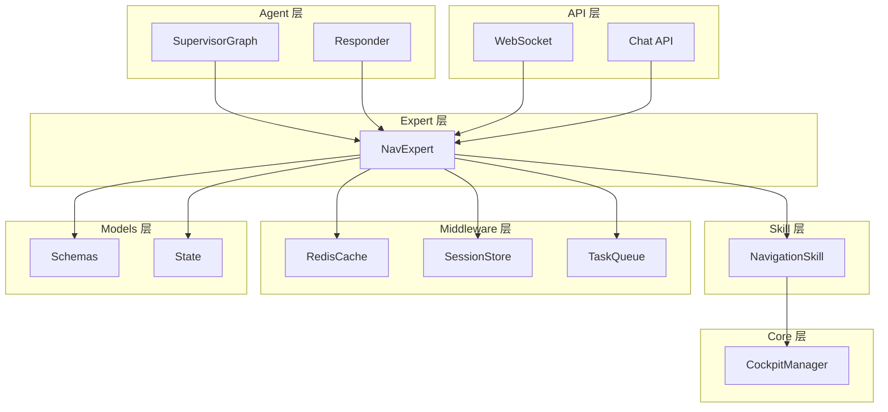

图表来源
- [supervisor_graph.py](file://backend_design/nexus/agent/supervisor_graph.py)
- [responder.py](file://backend_design/nexus/agent/responder.py)
- [nav_expert.py](file://backend_design/nexus/agent/experts/nav_expert.py)
- [navigation.py](file://backend_design/nexus/skills/vehicle/navigation.py)
- [cockpit_manager.py](file://backend_design/nexus/core/cockpit_manager.py)
- [redis_cache.py](file://backend_design/nexus/middleware/redis_cache.py)
- [session_store.py](file://backend_design/nexus/middleware/session_store.py)
- [task_queue.py](file://backend_design/nexus/middleware/task_queue.py)
- [websocket.py](file://backend_design/nexus/api/websocket.py)
- [chat.py](file://backend_design/nexus/api/routes/chat.py)
- [schemas.py](file://backend_design/nexus/models/schemas.py)
- [state.py](file://backend_design/nexus/models/state.py)

章节来源
- [nav_expert.py](file://backend_design/nexus/agent/experts/nav_expert.py)
- [navigation.py](file://backend_design/nexus/skills/vehicle/navigation.py)
- [base.py](file://backend_design/nexus/agent/experts/base.py)
- [responder.py](file://backend_design/nexus/agent/responder.py)
- [supervisor_graph.py](file://backend_design/nexus/agent/supervisor_graph.py)
- [cockpit_manager.py](file://backend_design/nexus/core/cockpit_manager.py)
- [redis_cache.py](file://backend_design/nexus/middleware/redis_cache.py)
- [session_store.py](file://backend_design/nexus/middleware/session_store.py)
- [task_queue.py](file://backend_design/nexus/middleware/task_queue.py)
- [websocket.py](file://backend_design/nexus/api/websocket.py)
- [chat.py](file://backend_design/nexus/api/routes/chat.py)
- [schemas.py](file://backend_design/nexus/models/schemas.py)
- [state.py](file://backend_design/nexus/models/state.py)

## 核心组件
- NavExpert：导航领域专家，负责接收导航意图、调用导航技能、处理结果、生成导航指令、管理缓存与会话、推送实时状态。
- NavigationSkill：封装对底层导航服务的调用（如路线计算、路况、重算、POI 搜索），提供统一接口给专家使用。
- BaseExpert：专家基类，定义通用生命周期与上下文管理。
- SupervisorGraph / Responder：编排与响应器，将用户请求路由到具体专家。
- CockpitManager：座舱侧状态管理与设备交互。
- RedisCache / SessionStore / TaskQueue：缓存、会话与异步任务基础设施。
- WebSocket / Chat API：前端交互入口。
- Schemas / State：数据结构与状态机定义。

章节来源
- [nav_expert.py](file://backend_design/nexus/agent/experts/nav_expert.py)
- [navigation.py](file://backend_design/nexus/skills/vehicle/navigation.py)
- [base.py](file://backend_design/nexus/agent/experts/base.py)
- [responder.py](file://backend_design/nexus/agent/responder.py)
- [supervisor_graph.py](file://backend_design/nexus/agent/supervisor_graph.py)
- [cockpit_manager.py](file://backend_design/nexus/core/cockpit_manager.py)
- [redis_cache.py](file://backend_design/nexus/middleware/redis_cache.py)
- [session_store.py](file://backend_design/nexus/middleware/session_store.py)
- [task_queue.py](file://backend_design/nexus/middleware/task_queue.py)
- [websocket.py](file://backend_design/nexus/api/websocket.py)
- [chat.py](file://backend_design/nexus/api/routes/chat.py)
- [schemas.py](file://backend_design/nexus/models/schemas.py)
- [state.py](file://backend_design/nexus/models/state.py)

## 架构总览
导航专家在整体系统中的位置与职责如下：
- 入口：WebSocket 或聊天接口接收导航请求
- 路由：SupervisorGraph/Responder 识别为导航意图后委派给 NavExpert
- 执行：NavExpert 调用 NavigationSkill 完成路线计算、路况获取、指令生成
- 持久化与缓存：通过 RedisCache 缓存热点路线与指令；SessionStore 维护会话上下文
- 异步：TaskQueue 处理耗时任务（如大规模重算、批量更新）
- 推送：WebSocket 向客户端推送导航状态与指令
- 座舱：CockpitManager 驱动车载显示与语音播报

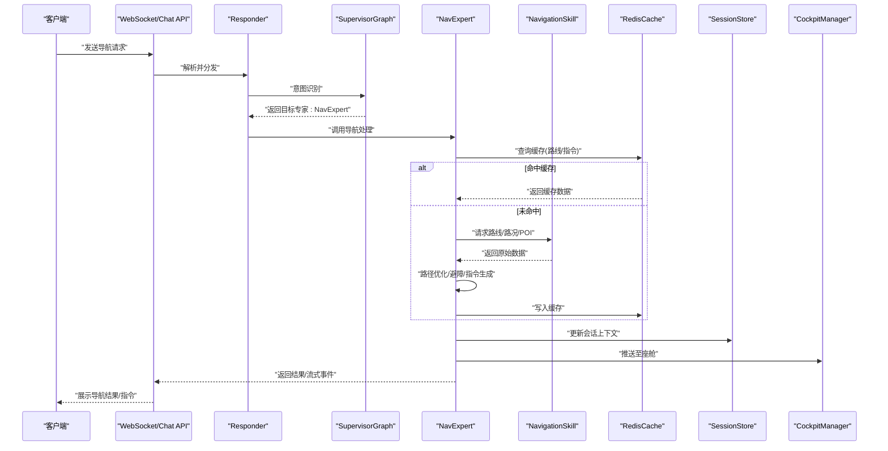

图表来源
- [websocket.py](file://backend_design/nexus/api/websocket.py)
- [chat.py](file://backend_design/nexus/api/routes/chat.py)
- [responder.py](file://backend_design/nexus/agent/responder.py)
- [supervisor_graph.py](file://backend_design/nexus/agent/supervisor_graph.py)
- [nav_expert.py](file://backend_design/nexus/agent/experts/nav_expert.py)
- [navigation.py](file://backend_design/nexus/skills/vehicle/navigation.py)
- [redis_cache.py](file://backend_design/nexus/middleware/redis_cache.py)
- [session_store.py](file://backend_design/nexus/middleware/session_store.py)
- [cockpit_manager.py](file://backend_design/nexus/core/cockpit_manager.py)

## 详细组件分析

### NavExpert 类分析
NavExpert 作为导航领域的专家，承担以下职责：
- 输入校验与意图澄清：基于 Schemas 验证请求参数，必要时发起澄清
- 缓存优先：先查 Redis 缓存，命中则直接返回，减少外部调用
- 调用导航技能：通过 NavigationSkill 获取路线、路况、POI 等信息
- 路径优化与避障：结合实时路况与历史偏好，选择更优路径并规避障碍
- 指令生成：将路线段转换为可执行的导航指令（转向、限速、车道建议等）
- 状态同步：更新会话上下文，推送至座舱与前端
- 异常与降级：捕获外部错误，回退到缓存或默认策略，保证可用性

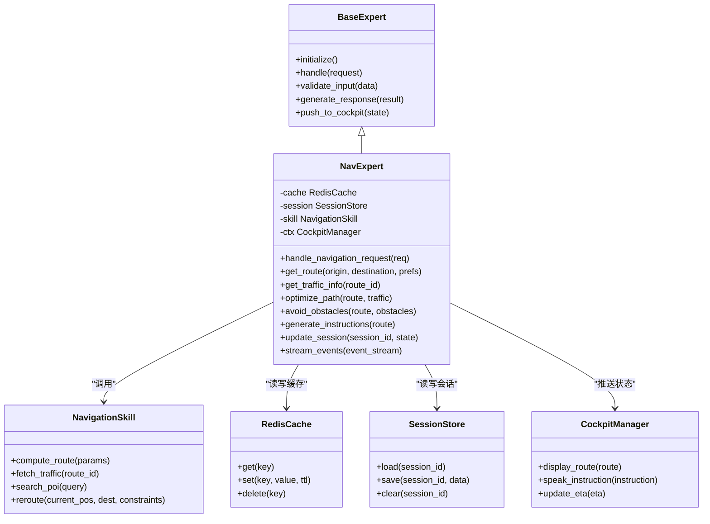

图表来源
- [base.py](file://backend_design/nexus/agent/experts/base.py)
- [nav_expert.py](file://backend_design/nexus/agent/experts/nav_expert.py)
- [navigation.py](file://backend_design/nexus/skills/vehicle/navigation.py)
- [redis_cache.py](file://backend_design/nexus/middleware/redis_cache.py)
- [session_store.py](file://backend_design/nexus/middleware/session_store.py)
- [cockpit_manager.py](file://backend_design/nexus/core/cockpit_manager.py)

章节来源
- [nav_expert.py](file://backend_design/nexus/agent/experts/nav_expert.py)
- [base.py](file://backend_design/nexus/agent/experts/base.py)
- [navigation.py](file://backend_design/nexus/skills/vehicle/navigation.py)
- [redis_cache.py](file://backend_design/nexus/middleware/redis_cache.py)
- [session_store.py](file://backend_design/nexus/middleware/session_store.py)
- [cockpit_manager.py](file://backend_design/nexus/core/cockpit_manager.py)

#### 导航请求处理流程（时序）
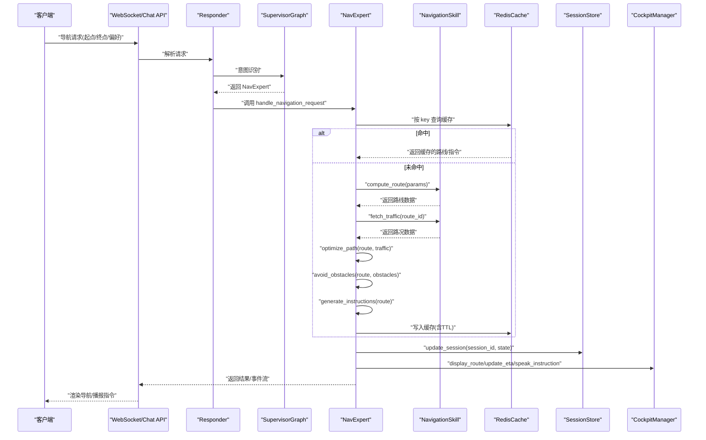

图表来源
- [websocket.py](file://backend_design/nexus/api/websocket.py)
- [chat.py](file://backend_design/nexus/api/routes/chat.py)
- [responder.py](file://backend_design/nexus/agent/responder.py)
- [supervisor_graph.py](file://backend_design/nexus/agent/supervisor_graph.py)
- [nav_expert.py](file://backend_design/nexus/agent/experts/nav_expert.py)
- [navigation.py](file://backend_design/nexus/skills/vehicle/navigation.py)
- [redis_cache.py](file://backend_design/nexus/middleware/redis_cache.py)
- [session_store.py](file://backend_design/nexus/middleware/session_store.py)
- [cockpit_manager.py](file://backend_design/nexus/core/cockpit_manager.py)

#### 路径优化与避障算法（流程图）
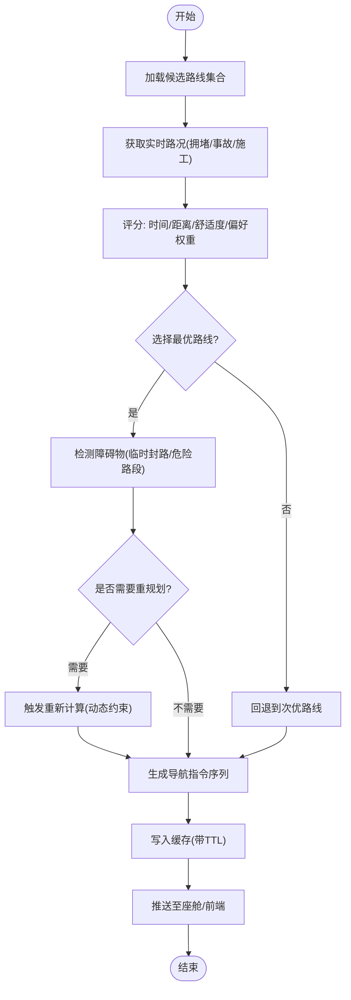

图表来源
- [nav_expert.py](file://backend_design/nexus/agent/experts/nav_expert.py)
- [navigation.py](file://backend_design/nexus/skills/vehicle/navigation.py)
- [redis_cache.py](file://backend_design/nexus/middleware/redis_cache.py)
- [cockpit_manager.py](file://backend_design/nexus/core/cockpit_manager.py)

章节来源
- [nav_expert.py](file://backend_design/nexus/agent/experts/nav_expert.py)
- [navigation.py](file://backend_design/nexus/skills/vehicle/navigation.py)
- [redis_cache.py](file://backend_design/nexus/middleware/redis_cache.py)
- [cockpit_manager.py](file://backend_design/nexus/core/cockpit_manager.py)

### 导航技能（NavigationSkill）分析
NavigationSkill 对外暴露统一的导航接口，屏蔽底层服务差异：
- compute_route：根据起点、终点与偏好计算路线
- fetch_traffic：获取指定路线的路况信息
- search_poi：按关键词搜索兴趣点
- reroute：在行驶中根据当前位置与约束进行动态重规划

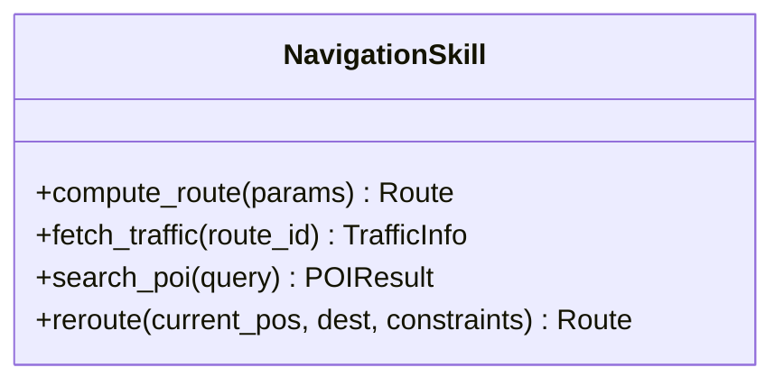

图表来源
- [navigation.py](file://backend_design/nexus/skills/vehicle/navigation.py)

章节来源
- [navigation.py](file://backend_design/nexus/skills/vehicle/navigation.py)

### 数据模型与状态
- Schemas：定义导航请求与响应的结构化字段（起点、终点、偏好、路线片段、指令等）
- State：定义导航状态机（空闲、规划中、导航中、暂停、完成、异常）

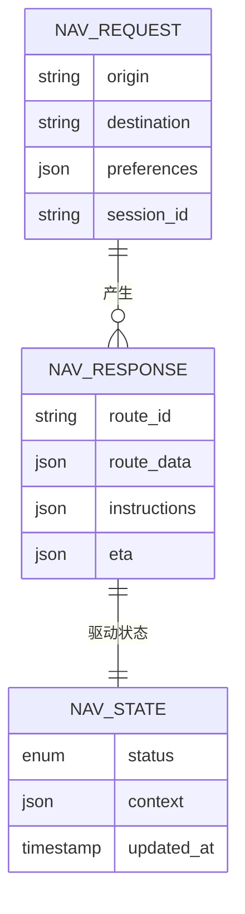

图表来源
- [schemas.py](file://backend_design/nexus/models/schemas.py)
- [state.py](file://backend_design/nexus/models/state.py)

章节来源
- [schemas.py](file://backend_design/nexus/models/schemas.py)
- [state.py](file://backend_design/nexus/models/state.py)

### 外部导航服务集成与数据同步
- 集成方式：通过 NavigationSkill 抽象层对接外部导航服务（HTTP/gRPC/MCP 等），由 Skill 内部处理鉴权、重试与超时
- 数据同步：
  - 实时路况：定时拉取或事件订阅，合并到缓存
  - 会话上下文：每次导航操作后更新 SessionStore，确保跨端一致性
  - 座舱推送：通过 CockpitManager 将最新状态与指令推送到车载终端

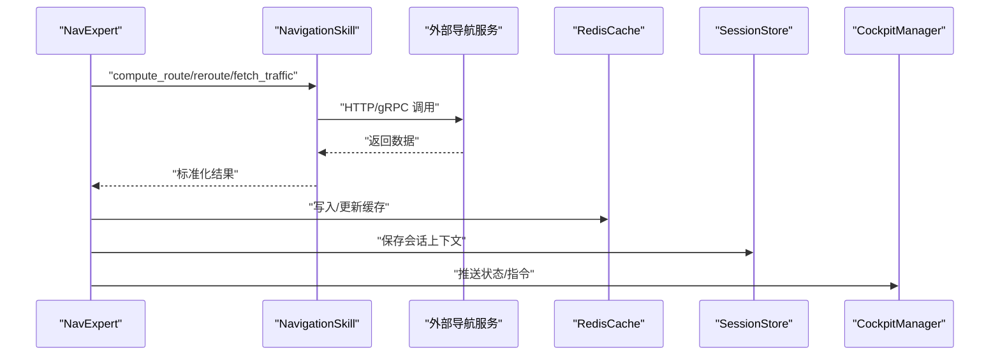

图表来源
- [nav_expert.py](file://backend_design/nexus/agent/experts/nav_expert.py)
- [navigation.py](file://backend_design/nexus/skills/vehicle/navigation.py)
- [redis_cache.py](file://backend_design/nexus/middleware/redis_cache.py)
- [session_store.py](file://backend_design/nexus/middleware/session_store.py)
- [cockpit_manager.py](file://backend_design/nexus/core/cockpit_manager.py)

章节来源
- [nav_expert.py](file://backend_design/nexus/agent/experts/nav_expert.py)
- [navigation.py](file://backend_design/nexus/skills/vehicle/navigation.py)
- [redis_cache.py](file://backend_design/nexus/middleware/redis_cache.py)
- [session_store.py](file://backend_design/nexus/middleware/session_store.py)
- [cockpit_manager.py](file://backend_design/nexus/core/cockpit_manager.py)

### 导航状态实时更新与用户交互反馈
- 实时更新：通过 WebSocket 推送导航事件（ETA 变化、下一指令、偏航提醒、到达提示）
- 用户交互：前端渲染路线与指令，支持手动确认/取消/切换路线；座舱端同步显示与语音播报

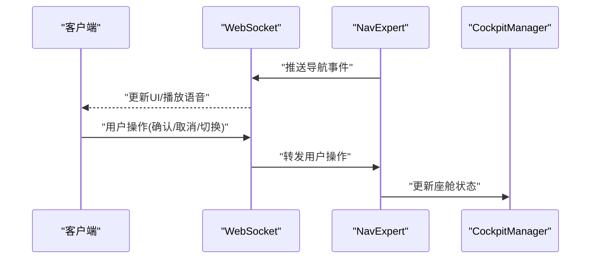

图表来源
- [websocket.py](file://backend_design/nexus/api/websocket.py)
- [nav_expert.py](file://backend_design/nexus/agent/experts/nav_expert.py)
- [cockpit_manager.py](file://backend_design/nexus/core/cockpit_manager.py)

章节来源
- [websocket.py](file://backend_design/nexus/api/websocket.py)
- [nav_expert.py](file://backend_design/nexus/agent/experts/nav_expert.py)
- [cockpit_manager.py](file://backend_design/nexus/core/cockpit_manager.py)

### 缓存策略与离线导航支持
- 缓存策略：
  - 热点路线与指令按会话与时间窗口缓存（TTL）
  - 路况数据独立缓存，定期刷新
  - 缓存键包含起点、终点、偏好与时间戳，避免脏读
- 离线支持：
  - 本地预置基础路网与常用路线
  - 无网络时回退到离线模式，仅能使用静态信息与最近一次成功计算的路线
  - 恢复在线后增量同步更新

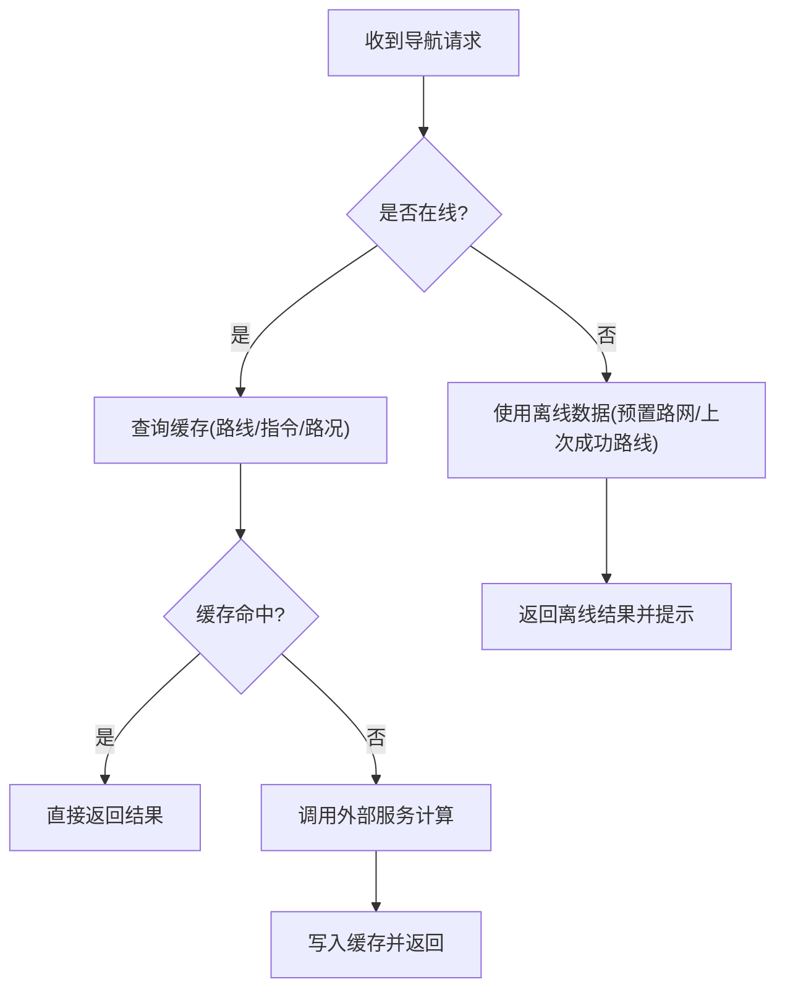

图表来源
- [redis_cache.py](file://backend_design/nexus/middleware/redis_cache.py)
- [nav_expert.py](file://backend_design/nexus/agent/experts/nav_expert.py)

章节来源
- [redis_cache.py](file://backend_design/nexus/middleware/redis_cache.py)
- [nav_expert.py](file://backend_design/nexus/agent/experts/nav_expert.py)

## 依赖分析
导航专家模块的依赖关系如下：
- 直接依赖：BaseExpert、NavigationSkill、RedisCache、SessionStore、CockpitManager、Schemas、State
- 间接依赖：Responder、SupervisorGraph、WebSocket、Chat API、TaskQueue

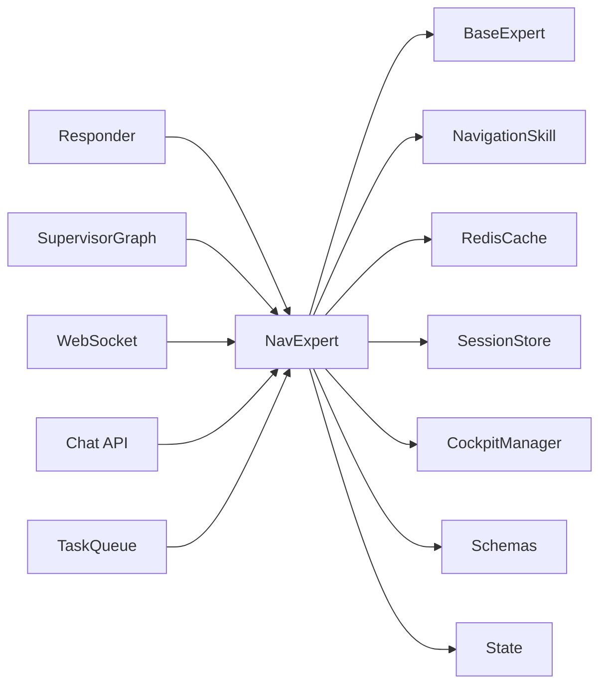

图表来源
- [nav_expert.py](file://backend_design/nexus/agent/experts/nav_expert.py)
- [base.py](file://backend_design/nexus/agent/experts/base.py)
- [navigation.py](file://backend_design/nexus/skills/vehicle/navigation.py)
- [redis_cache.py](file://backend_design/nexus/middleware/redis_cache.py)
- [session_store.py](file://backend_design/nexus/middleware/session_store.py)
- [cockpit_manager.py](file://backend_design/nexus/core/cockpit_manager.py)
- [responder.py](file://backend_design/nexus/agent/responder.py)
- [supervisor_graph.py](file://backend_design/nexus/agent/supervisor_graph.py)
- [websocket.py](file://backend_design/nexus/api/websocket.py)
- [chat.py](file://backend_design/nexus/api/routes/chat.py)
- [task_queue.py](file://backend_design/nexus/middleware/task_queue.py)
- [schemas.py](file://backend_design/nexus/models/schemas.py)
- [state.py](file://backend_design/nexus/models/state.py)

章节来源
- [nav_expert.py](file://backend_design/nexus/agent/experts/nav_expert.py)
- [base.py](file://backend_design/nexus/agent/experts/base.py)
- [navigation.py](file://backend_design/nexus/skills/vehicle/navigation.py)
- [redis_cache.py](file://backend_design/nexus/middleware/redis_cache.py)
- [session_store.py](file://backend_design/nexus/middleware/session_store.py)
- [cockpit_manager.py](file://backend_design/nexus/core/cockpit_manager.py)
- [responder.py](file://backend_design/nexus/agent/responder.py)
- [supervisor_graph.py](file://backend_design/nexus/agent/supervisor_graph.py)
- [websocket.py](file://backend_design/nexus/api/websocket.py)
- [chat.py](file://backend_design/nexus/api/routes/chat.py)
- [task_queue.py](file://backend_design/nexus/middleware/task_queue.py)
- [schemas.py](file://backend_design/nexus/models/schemas.py)
- [state.py](file://backend_design/nexus/models/state.py)

## 性能考虑
- 缓存命中率：合理设置 TTL 与键粒度，避免频繁外部调用
- 并发控制：对热点路线计算采用去重与限流，防止雪崩
- 异步处理：耗时任务入队（TaskQueue），非阻塞返回
- 增量更新：路况与 ETA 增量推送，降低带宽与渲染压力
- 降级策略：外部服务不可用时回退到缓存或离线数据

[本节为通用指导，不直接分析具体文件]

## 故障排查指南
- 常见问题定位：
  - 外部服务超时/失败：检查 NavigationSkill 的超时与重试配置
  - 缓存不一致：核对缓存键与 TTL，确保会话隔离
  - 状态不同步：检查 SessionStore 与 CockpitManager 的推送链路
  - WebSocket 断连：确认心跳与重连机制
- 日志与观测：
  - 记录关键步骤（请求进入、缓存命中/未命中、外部调用、指令生成、推送）
  - 指标上报（延迟、错误率、缓存命中率）

章节来源
- [nav_expert.py](file://backend_design/nexus/agent/experts/nav_expert.py)
- [navigation.py](file://backend_design/nexus/skills/vehicle/navigation.py)
- [redis_cache.py](file://backend_design/nexus/middleware/redis_cache.py)
- [session_store.py](file://backend_design/nexus/middleware/session_store.py)
- [websocket.py](file://backend_design/nexus/api/websocket.py)
- [cockpit_manager.py](file://backend_design/nexus/core/cockpit_manager.py)

## 结论
NavExpert 通过清晰的分层与职责划分，实现了从请求接入、意图识别、路线计算、路径优化、指令生成到状态推送的完整闭环。借助缓存与会话管理，系统在性能与一致性之间取得平衡；通过 WebSocket 与座舱联动，提供实时且友好的用户体验。未来可在多源融合、个性化偏好与更细粒度的避障策略上持续演进。

[本节为总结性内容，不直接分析具体文件]

## 附录
- 术语说明：
  - 路线：由若干路段组成的几何与语义信息集合
  - 指令：面向用户的导航动作提示（转向、限速、变道等）
  - 会话：与用户相关的上下文与偏好存储
  - 座舱：车载终端与交互界面

[本节为概念性内容，不直接分析具体文件]