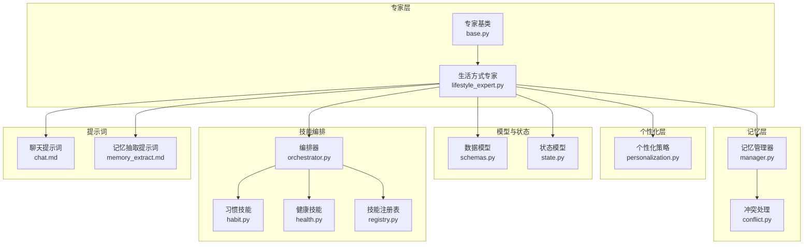
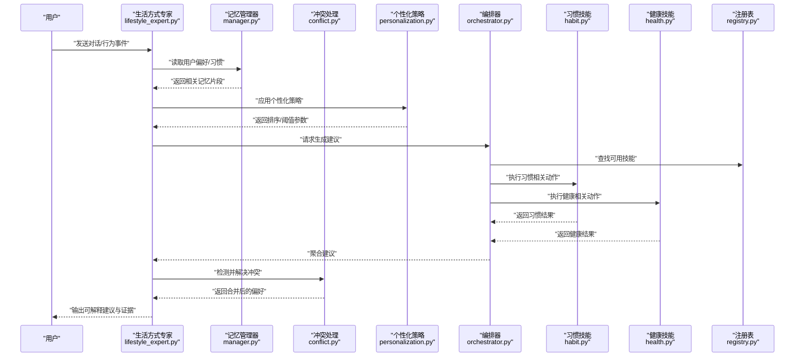
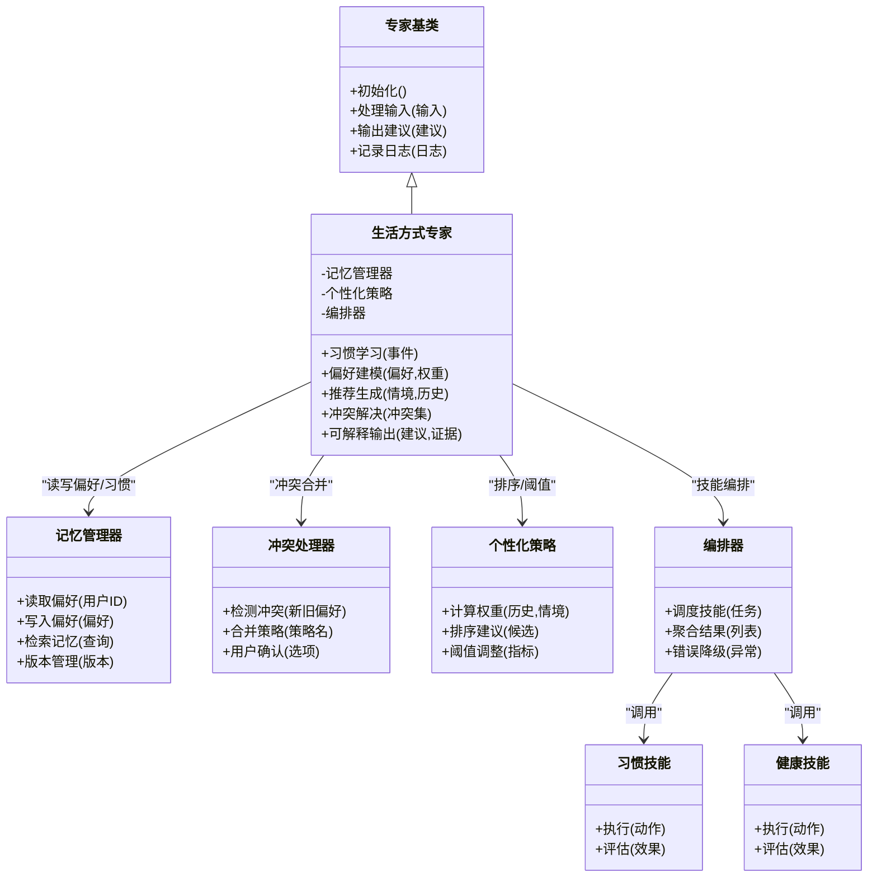
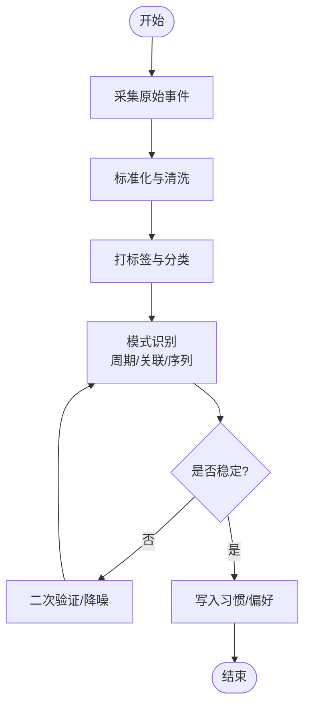
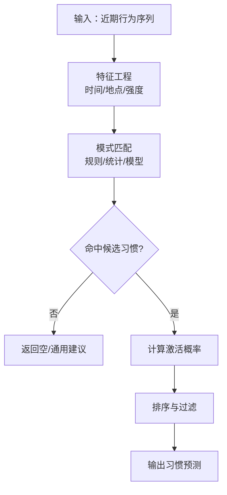
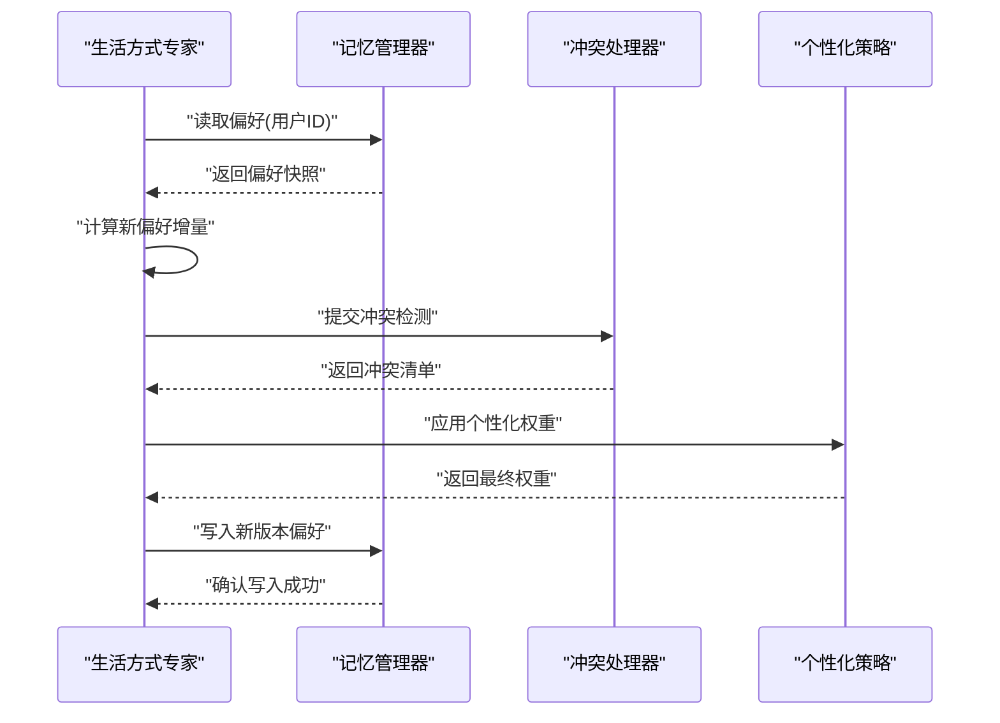
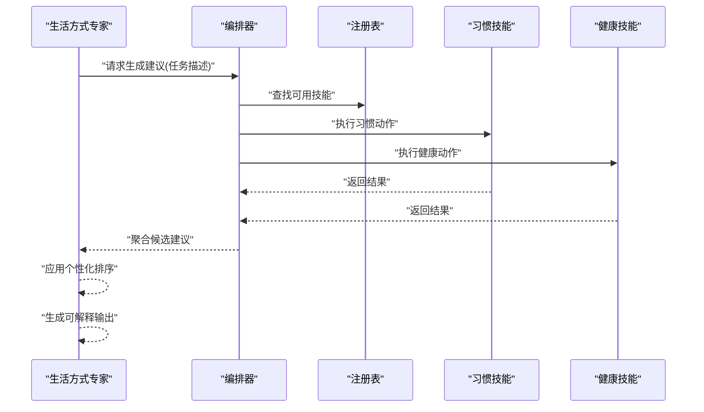
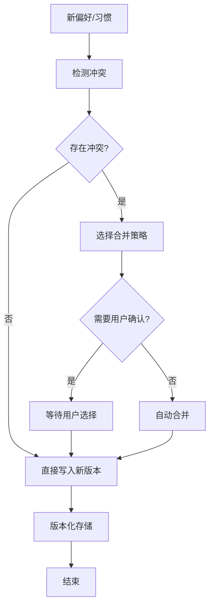
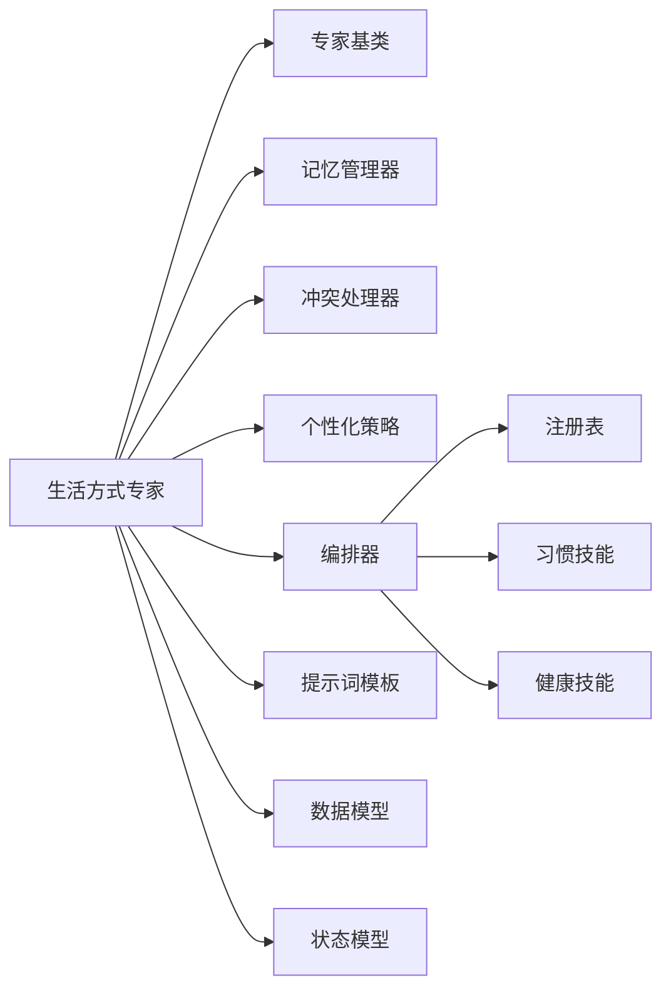

# 生活方式专家实现

<cite>
**本文引用的文件**   
- [lifestyle_expert.py](file://backend_design/nexus/agent/experts/lifestyle_expert.py)
- [base.py](file://backend_design/nexus/agent/experts/base.py)
- [manager.py](file://backend_design/nexus/memory/manager.py)
- [conflict.py](file://backend_design/nexus/memory/conflict.py)
- [personalization.py](file://backend_design/nexus/core/personalization.py)
- [schemas.py](file://backend_design/nexus/models/schemas.py)
- [state.py](file://backend_design/nexus/models/state.py)
- [orchestrator.py](file://backend_design/nexus/skills/orchestrator.py)
- [habit.py](file://backend_design/nexus/skills/habit.py)
- [health.py](file://backend_design/nexus/skills/health.py)
- [registry.py](file://backend_design/nexus/skills/registry.py)
- [chat.md](file://backend_design/nexus/prompts/chat.md)
- [memory_extract.md](file://backend_design/nexus/prompts/memory_extract.md)
</cite>

## 目录
1. [简介](#简介)
2. [项目结构](#项目结构)
3. [核心组件](#核心组件)
4. [架构总览](#架构总览)
5. [详细组件分析](#详细组件分析)
6. [依赖分析](#依赖分析)
7. [性能考虑](#性能考虑)
8. [故障排查指南](#故障排查指南)
9. [结论](#结论)
10. [附录](#附录)

## 简介
本文件聚焦“生活方式专家模块”的实现与使用，围绕 LifestyleExpert 类展开，系统阐述以下能力：
- 生活习惯学习：从对话与行为数据中抽取习惯、偏好与约束。
- 偏好建模：将用户长期偏好结构化存储，支持时间衰减与权重更新。
- 个性化推荐算法：基于记忆检索、技能编排与规则/模型融合生成建议。
- 行为数据采集与分析：定义输入事件、标签化与模式识别流程。
- 与记忆管理系统的集成：通过统一接口读写长期记忆，处理冲突与一致性。
- 动态更新与冲突解决：增量更新、版本化与冲突合并策略。
- 可解释性与用户控制：提供推荐理由、证据链与用户干预入口。

## 项目结构
生活方式专家位于 agent/experts 子系统中，作为专家网络的一员，负责生活场景的意图理解、习惯学习与个性化建议输出。其关键位置如下：
- 专家基类与职责边界：[base.py](file://backend_design/nexus/agent/experts/base.py)
- 生活方式专家实现：[lifestyle_expert.py](file://backend_design/nexus/agent/experts/lifestyle_expert.py)
- 记忆管理与冲突处理：[manager.py](file://backend_design/nexus/memory/manager.py)、[conflict.py](file://backend_design/nexus/memory/conflict.py)
- 个性化配置与策略：[personalization.py](file://backend_design/nexus/core/personalization.py)
- 数据模型与状态：[schemas.py](file://backend_design/nexus/models/schemas.py)、[state.py](file://backend_design/nexus/models/state.py)
- 技能编排与领域技能：[orchestrator.py](file://backend_design/nexus/skills/orchestrator.py)、[habit.py](file://backend_design/nexus/skills/habit.py)、[health.py](file://backend_design/nexus/skills/health.py)、[registry.py](file://backend_design/nexus/skills/registry.py)
- 提示词模板（用于抽取与推理）：[chat.md](file://backend_design/nexus/prompts/chat.md)、[memory_extract.md](file://backend_design/nexus/prompts/memory_extract.md)

图表来源
- [base.py](file://backend_design/nexus/agent/experts/base.py)
- [lifestyle_expert.py](file://backend_design/nexus/agent/experts/lifestyle_expert.py)
- [manager.py](file://backend_design/nexus/memory/manager.py)
- [conflict.py](file://backend_design/nexus/memory/conflict.py)
- [personalization.py](file://backend_design/nexus/core/personalization.py)
- [schemas.py](file://backend_design/nexus/models/schemas.py)
- [state.py](file://backend_design/nexus/models/state.py)
- [orchestrator.py](file://backend_design/nexus/skills/orchestrator.py)
- [habit.py](file://backend_design/nexus/skills/habit.py)
- [health.py](file://backend_design/nexus/skills/health.py)
- [registry.py](file://backend_design/nexus/skills/registry.py)
- [chat.md](file://backend_design/nexus/prompts/chat.md)
- [memory_extract.md](file://backend_design/nexus/prompts/memory_extract.md)

章节来源
- [lifestyle_expert.py](file://backend_design/nexus/agent/experts/lifestyle_expert.py)
- [base.py](file://backend_design/nexus/agent/experts/base.py)
- [manager.py](file://backend_design/nexus/memory/manager.py)
- [conflict.py](file://backend_design/nexus/memory/conflict.py)
- [personalization.py](file://backend_design/nexus/core/personalization.py)
- [schemas.py](file://backend_design/nexus/models/schemas.py)
- [state.py](file://backend_design/nexus/models/state.py)
- [orchestrator.py](file://backend_design/nexus/skills/orchestrator.py)
- [habit.py](file://backend_design/nexus/skills/habit.py)
- [health.py](file://backend_design/nexus/skills/health.py)
- [registry.py](file://backend_design/nexus/skills/registry.py)
- [chat.md](file://backend_design/nexus/prompts/chat.md)
- [memory_extract.md](file://backend_design/nexus/prompts/memory_extract.md)

## 核心组件
- 生活方式专家（LifestyleExpert）
  - 职责：接收用户交互与上下文，调用记忆系统进行偏好查询与写入；结合个性化策略与技能编排，生成可解释的生活建议。
  - 关键方法（概念性说明）：
    - 初始化与配置加载
    - 习惯学习：从对话/行为事件中提取习惯片段并持久化
    - 偏好建模：维护偏好向量/权重，支持时间衰减与置信度更新
    - 推荐生成：检索相关记忆、组合技能结果、应用个性化策略
    - 可解释输出：返回理由、证据与可选的用户反馈通道
- 记忆管理器（MemoryManager）
  - 职责：统一的长期记忆读写接口，包含索引、检索、版本与冲突合并。
- 冲突处理器（ConflictResolver）
  - 职责：检测偏好/习惯冲突，执行合并策略（如最新优先、加权投票、用户确认）。
- 个性化策略（Personalization）
  - 职责：根据用户画像、情境与历史表现调整推荐排序与阈值。
- 技能编排（Orchestrator）
  - 职责：按任务类型调度 habit、health 等技能，聚合结果并回写。
- 数据与状态模型（Schemas/State）
  - 职责：定义偏好、习惯、事件、会话与状态的结构与校验。

章节来源
- [lifestyle_expert.py](file://backend_design/nexus/agent/experts/lifestyle_expert.py)
- [manager.py](file://backend_design/nexus/memory/manager.py)
- [conflict.py](file://backend_design/nexus/memory/conflict.py)
- [personalization.py](file://backend_design/nexus/core/personalization.py)
- [schemas.py](file://backend_design/nexus/models/schemas.py)
- [state.py](file://backend_design/nexus/models/state.py)
- [orchestrator.py](file://backend_design/nexus/skills/orchestrator.py)
- [habit.py](file://backend_design/nexus/skills/habit.py)
- [health.py](file://backend_design/nexus/skills/health.py)
- [registry.py](file://backend_design/nexus/skills/registry.py)

## 架构总览
下图展示生活方式专家在整体系统中的协作关系与数据流。

图表来源
- [lifestyle_expert.py](file://backend_design/nexus/agent/experts/lifestyle_expert.py)
- [manager.py](file://backend_design/nexus/memory/manager.py)
- [conflict.py](file://backend_design/nexus/memory/conflict.py)
- [personalization.py](file://backend_design/nexus/core/personalization.py)
- [orchestrator.py](file://backend_design/nexus/skills/orchestrator.py)
- [habit.py](file://backend_design/nexus/skills/habit.py)
- [health.py](file://backend_design/nexus/skills/health.py)
- [registry.py](file://backend_design/nexus/skills/registry.py)

## 详细组件分析

### 生活方式专家（LifestyleExpert）
- 设计要点
  - 继承自专家基类，遵循统一的输入/输出契约与生命周期钩子。
  - 以“事件驱动+记忆增强”的方式工作：每次交互触发习惯学习与偏好更新。
  - 推荐过程为“检索→编排→策略→冲突→解释”的流水线。
- 关键流程
  - 习惯学习：解析输入事件，提取习惯要素（时间、地点、对象、强度），写入短期缓存后批量落盘。
  - 偏好建模：维护偏好键值对与权重，采用时间衰减与置信度累积；当新证据与旧偏好不一致时进入冲突处理。
  - 个性化推荐：基于当前情境（时间、位置、设备状态）与历史表现，选择候选建议并排序。
  - 可解释性：附带理由、证据片段与置信度，并提供用户反馈（采纳/拒绝/修正）接口。
- 代码示例路径（不展示具体代码内容）
  - 初始化与配置加载：[lifestyle_expert.py](file://backend_design/nexus/agent/experts/lifestyle_expert.py)
  - 习惯学习入口与数据抽取：[lifestyle_expert.py](file://backend_design/nexus/agent/experts/lifestyle_expert.py)
  - 偏好更新与冲突检测：[lifestyle_expert.py](file://backend_design/nexus/agent/experts/lifestyle_expert.py)
  - 推荐生成与编排调用：[lifestyle_expert.py](file://backend_design/nexus/agent/experts/lifestyle_expert.py)
  - 可解释输出构造：[lifestyle_expert.py](file://backend_design/nexus/agent/experts/lifestyle_expert.py)

图表来源
- [base.py](file://backend_design/nexus/agent/experts/base.py)
- [lifestyle_expert.py](file://backend_design/nexus/agent/experts/lifestyle_expert.py)
- [manager.py](file://backend_design/nexus/memory/manager.py)
- [conflict.py](file://backend_design/nexus/memory/conflict.py)
- [personalization.py](file://backend_design/nexus/core/personalization.py)
- [orchestrator.py](file://backend_design/nexus/skills/orchestrator.py)
- [habit.py](file://backend_design/nexus/skills/habit.py)
- [health.py](file://backend_design/nexus/skills/health.py)

章节来源
- [lifestyle_expert.py](file://backend_design/nexus/agent/experts/lifestyle_expert.py)
- [base.py](file://backend_design/nexus/agent/experts/base.py)
- [manager.py](file://backend_design/nexus/memory/manager.py)
- [conflict.py](file://backend_design/nexus/memory/conflict.py)
- [personalization.py](file://backend_design/nexus/core/personalization.py)
- [orchestrator.py](file://backend_design/nexus/skills/orchestrator.py)
- [habit.py](file://backend_design/nexus/skills/habit.py)
- [health.py](file://backend_design/nexus/skills/health.py)

### 用户行为数据的收集与分析
- 数据来源
  - 对话文本、语音转写、设备事件（位置、时间、车辆状态）、显式反馈（点赞/忽略/纠正）。
- 采集与标注
  - 事件标准化：统一时间戳、用户标识、来源渠道与上下文。
  - 标签体系：习惯类别（饮食、运动、作息、出行）、强度、频率、环境条件。
- 模式识别
  - 周期性检测：滑动窗口统计与周期发现。
  - 关联规则：共现分析与因果启发式筛选。
  - 序列模式：前序行为到目标行为的概率提升。
- 代码示例路径
  - 事件结构与校验：[schemas.py](file://backend_design/nexus/models/schemas.py)
  - 会话与状态流转：[state.py](file://backend_design/nexus/models/state.py)
  - 记忆抽取提示词（用于LLM辅助抽取）：[memory_extract.md](file://backend_design/nexus/prompts/memory_extract.md)

图表来源
- [schemas.py](file://backend_design/nexus/models/schemas.py)
- [state.py](file://backend_design/nexus/models/state.py)
- [memory_extract.md](file://backend_design/nexus/prompts/memory_extract.md)

章节来源
- [schemas.py](file://backend_design/nexus/models/schemas.py)
- [state.py](file://backend_design/nexus/models/state.py)
- [memory_extract.md](file://backend_design/nexus/prompts/memory_extract.md)

### 习惯模式的识别与预测模型
- 识别方法
  - 规则+统计：阈值、频次、时间窗、地理围栏。
  - 轻量模型：时序聚类、隐马尔可夫或简单序列模型（视部署资源而定）。
- 预测逻辑
  - 基于最近N次行为与当前情境，计算各候选习惯的激活概率。
  - 引入衰减因子与置信度，避免过拟合短期噪声。
- 代码示例路径
  - 习惯技能实现与评估：[habit.py](file://backend_design/nexus/skills/habit.py)
  - 健康相关习惯扩展：[health.py](file://backend_design/nexus/skills/health.py)
  - 编排器调度与聚合：[orchestrator.py](file://backend_design/nexus/skills/orchestrator.py)

图表来源
- [habit.py](file://backend_design/nexus/skills/habit.py)
- [health.py](file://backend_design/nexus/skills/health.py)
- [orchestrator.py](file://backend_design/nexus/skills/orchestrator.py)

章节来源
- [habit.py](file://backend_design/nexus/skills/habit.py)
- [health.py](file://backend_design/nexus/skills/health.py)
- [orchestrator.py](file://backend_design/nexus/skills/orchestrator.py)

### 与记忆管理系统的集成与长期偏好存储
- 集成方式
  - 通过记忆管理器统一读写偏好与习惯，确保跨会话一致性与版本化。
  - 冲突处理器在写入前进行冲突检测与合并，必要时发起用户确认。
- 存储机制
  - 偏好键空间：维度包括领域（饮食/运动/作息/出行）、时间粒度（日/周/月）、强度与置信度。
  - 版本化：每次更新生成新版本，支持回滚与审计。
- 代码示例路径
  - 记忆读写与检索：[manager.py](file://backend_design/nexus/memory/manager.py)
  - 冲突检测与合并策略：[conflict.py](file://backend_design/nexus/memory/conflict.py)
  - 个性化策略参数注入：[personalization.py](file://backend_design/nexus/core/personalization.py)

图表来源
- [manager.py](file://backend_design/nexus/memory/manager.py)
- [conflict.py](file://backend_design/nexus/memory/conflict.py)
- [personalization.py](file://backend_design/nexus/core/personalization.py)
- [lifestyle_expert.py](file://backend_design/nexus/agent/experts/lifestyle_expert.py)

章节来源
- [manager.py](file://backend_design/nexus/memory/manager.py)
- [conflict.py](file://backend_design/nexus/memory/conflict.py)
- [personalization.py](file://backend_design/nexus/core/personalization.py)
- [lifestyle_expert.py](file://backend_design/nexus/agent/experts/lifestyle_expert.py)

### 推荐算法与编排流程
- 推荐流程
  - 检索：基于用户ID与情境关键词检索相关记忆。
  - 组合：由编排器调用习惯与健康技能，生成候选建议集合。
  - 排序：个性化策略依据历史表现与当前情境调整排序。
  - 解释：附加理由、证据与置信度，便于用户理解与干预。
- 代码示例路径
  - 编排器与技能注册：[orchestrator.py](file://backend_design/nexus/skills/orchestrator.py)、[registry.py](file://backend_design/nexus/skills/registry.py)
  - 习惯与健康技能：[habit.py](file://backend_design/nexus/skills/habit.py)、[health.py](file://backend_design/nexus/skills/health.py)
  - 聊天提示词（用于生成自然语言解释）：[chat.md](file://backend_design/nexus/prompts/chat.md)

图表来源
- [orchestrator.py](file://backend_design/nexus/skills/orchestrator.py)
- [registry.py](file://backend_design/nexus/skills/registry.py)
- [habit.py](file://backend_design/nexus/skills/habit.py)
- [health.py](file://backend_design/nexus/skills/health.py)
- [lifestyle_expert.py](file://backend_design/nexus/agent/experts/lifestyle_expert.py)
- [chat.md](file://backend_design/nexus/prompts/chat.md)

章节来源
- [orchestrator.py](file://backend_design/nexus/skills/orchestrator.py)
- [registry.py](file://backend_design/nexus/skills/registry.py)
- [habit.py](file://backend_design/nexus/skills/habit.py)
- [health.py](file://backend_design/nexus/skills/health.py)
- [lifestyle_expert.py](file://backend_design/nexus/agent/experts/lifestyle_expert.py)
- [chat.md](file://backend_design/nexus/prompts/chat.md)

### 动态更新与冲突解决策略
- 动态更新
  - 增量更新：仅写入差异部分，保留版本历史。
  - 时间衰减：旧证据权重随时间降低，新证据快速生效。
  - 置信度累积：多次一致行为提升置信度，减少误判。
- 冲突解决
  - 策略库：最新优先、加权投票、用户确认、领域优先级。
  - 自动/半自动：默认自动合并，高风险冲突触发用户确认。
- 代码示例路径
  - 冲突处理实现：[conflict.py](file://backend_design/nexus/memory/conflict.py)
  - 个性化策略参数：[personalization.py](file://backend_design/nexus/core/personalization.py)
  - 记忆管理器版本化：[manager.py](file://backend_design/nexus/memory/manager.py)

图表来源
- [conflict.py](file://backend_design/nexus/memory/conflict.py)
- [personalization.py](file://backend_design/nexus/core/personalization.py)
- [manager.py](file://backend_design/nexus/memory/manager.py)

章节来源
- [conflict.py](file://backend_design/nexus/memory/conflict.py)
- [personalization.py](file://backend_design/nexus/core/personalization.py)
- [manager.py](file://backend_design/nexus/memory/manager.py)

### 可解释性与用户控制机制
- 可解释性
  - 理由：基于证据片段与规则/模型输出的自然语言解释。
  - 证据：关联的记忆条目、行为序列与情境信息。
  - 置信度：量化建议的可信程度，帮助用户决策。
- 用户控制
  - 反馈通道：采纳/拒绝/修正偏好，影响后续权重与策略。
  - 干预入口：手动覆盖建议、设置约束与例外。
- 代码示例路径
  - 聊天提示词（生成解释）：[chat.md](file://backend_design/nexus/prompts/chat.md)
  - 记忆抽取提示词（辅助理解）：[memory_extract.md](file://backend_design/nexus/prompts/memory_extract.md)
  - 生活方式专家输出构造：[lifestyle_expert.py](file://backend_design/nexus/agent/experts/lifestyle_expert.py)

章节来源
- [chat.md](file://backend_design/nexus/prompts/chat.md)
- [memory_extract.md](file://backend_design/nexus/prompts/memory_extract.md)
- [lifestyle_expert.py](file://backend_design/nexus/agent/experts/lifestyle_expert.py)

## 依赖分析
- 内部依赖
  - 生活方式专家依赖专家基类、记忆管理器、冲突处理器、个性化策略与编排器。
  - 编排器依赖技能注册表与具体技能（习惯、健康）。
- 外部依赖
  - 提示词模板用于生成自然语言解释与辅助抽取。
  - 数据模型与状态用于输入输出校验与流转。
- 潜在耦合点
  - 记忆管理器与冲突处理器的接口变更会影响专家写入流程。
  - 个性化策略的参数变化会直接影响推荐排序。

图表来源
- [lifestyle_expert.py](file://backend_design/nexus/agent/experts/lifestyle_expert.py)
- [base.py](file://backend_design/nexus/agent/experts/base.py)
- [manager.py](file://backend_design/nexus/memory/manager.py)
- [conflict.py](file://backend_design/nexus/memory/conflict.py)
- [personalization.py](file://backend_design/nexus/core/personalization.py)
- [orchestrator.py](file://backend_design/nexus/skills/orchestrator.py)
- [registry.py](file://backend_design/nexus/skills/registry.py)
- [habit.py](file://backend_design/nexus/skills/habit.py)
- [health.py](file://backend_design/nexus/skills/health.py)
- [chat.md](file://backend_design/nexus/prompts/chat.md)
- [memory_extract.md](file://backend_design/nexus/prompts/memory_extract.md)
- [schemas.py](file://backend_design/nexus/models/schemas.py)
- [state.py](file://backend_design/nexus/models/state.py)

章节来源
- [lifestyle_expert.py](file://backend_design/nexus/agent/experts/lifestyle_expert.py)
- [base.py](file://backend_design/nexus/agent/experts/base.py)
- [manager.py](file://backend_design/nexus/memory/manager.py)
- [conflict.py](file://backend_design/nexus/memory/conflict.py)
- [personalization.py](file://backend_design/nexus/core/personalization.py)
- [orchestrator.py](file://backend_design/nexus/skills/orchestrator.py)
- [registry.py](file://backend_design/nexus/skills/registry.py)
- [habit.py](file://backend_design/nexus/skills/habit.py)
- [health.py](file://backend_design/nexus/skills/health.py)
- [chat.md](file://backend_design/nexus/prompts/chat.md)
- [memory_extract.md](file://backend_design/nexus/prompts/memory_extract.md)
- [schemas.py](file://backend_design/nexus/models/schemas.py)
- [state.py](file://backend_design/nexus/models/state.py)

## 性能考虑
- 批处理与异步
  - 习惯学习建议批处理写入，减少频繁I/O。
  - 推荐生成可采用异步编排，提高吞吐。
- 缓存与索引
  - 对高频偏好与习惯建立缓存，缩短检索延迟。
  - 使用语义索引加速记忆检索。
- 模型与规则平衡
  - 在资源受限环境下优先使用规则与统计方法，复杂模型按需启用。
- 监控与降级
  - 关键路径埋点与指标上报，异常时降级为通用建议。

## 故障排查指南
- 常见问题
  - 偏好未更新：检查记忆管理器写入与版本化是否正确。
  - 冲突未解决：确认冲突处理器策略与用户确认流程。
  - 推荐不准确：核查个性化策略参数与证据质量。
  - 解释不可读：检查提示词模板与输出构造逻辑。
- 定位步骤
  - 查看事件与状态模型校验是否通过。
  - 追踪编排器日志，确认技能执行结果。
  - 对比冲突前后偏好版本，定位合并策略问题。
- 代码示例路径
  - 数据模型与状态：[schemas.py](file://backend_design/nexus/models/schemas.py)、[state.py](file://backend_design/nexus/models/state.py)
  - 编排器与技能：[orchestrator.py](file://backend_design/nexus/skills/orchestrator.py)、[habit.py](file://backend_design/nexus/skills/habit.py)、[health.py](file://backend_design/nexus/skills/health.py)
  - 记忆与冲突：[manager.py](file://backend_design/nexus/memory/manager.py)、[conflict.py](file://backend_design/nexus/memory/conflict.py)
  - 提示词模板：[chat.md](file://backend_design/nexus/prompts/chat.md)、[memory_extract.md](file://backend_design/nexus/prompts/memory_extract.md)

章节来源
- [schemas.py](file://backend_design/nexus/models/schemas.py)
- [state.py](file://backend_design/nexus/models/state.py)
- [orchestrator.py](file://backend_design/nexus/skills/orchestrator.py)
- [habit.py](file://backend_design/nexus/skills/habit.py)
- [health.py](file://backend_design/nexus/skills/health.py)
- [manager.py](file://backend_design/nexus/memory/manager.py)
- [conflict.py](file://backend_design/nexus/memory/conflict.py)
- [chat.md](file://backend_design/nexus/prompts/chat.md)
- [memory_extract.md](file://backend_design/nexus/prompts/memory_extract.md)

## 结论
生活方式专家通过“事件驱动+记忆增强+技能编排”的架构，实现了从行为采集、习惯学习到个性化推荐的完整闭环。借助记忆管理器的版本化与冲突处理，系统在动态更新中保持偏好一致性与可追溯性。可解释输出与用户控制机制提升了透明度与可控性，使建议更贴近用户真实需求。

## 附录
- 术语
  - 偏好：用户对某类行为的倾向与强度。
  - 习惯：重复出现的行为模式，具有时间与情境特征。
  - 编排：按任务类型调度多个技能并聚合结果的过程。
- 参考路径
  - 专家基类与契约：[base.py](file://backend_design/nexus/agent/experts/base.py)
  - 生活方式专家实现：[lifestyle_expert.py](file://backend_design/nexus/agent/experts/lifestyle_expert.py)
  - 记忆与冲突：[manager.py](file://backend_design/nexus/memory/manager.py)、[conflict.py](file://backend_design/nexus/memory/conflict.py)
  - 个性化与编排：[personalization.py](file://backend_design/nexus/core/personalization.py)、[orchestrator.py](file://backend_design/nexus/skills/orchestrator.py)
  - 技能与注册：[habit.py](file://backend_design/nexus/skills/habit.py)、[health.py](file://backend_design/nexus/skills/health.py)、[registry.py](file://backend_design/nexus/skills/registry.py)
  - 提示词模板：[chat.md](file://backend_design/nexus/prompts/chat.md)、[memory_extract.md](file://backend_design/nexus/prompts/memory_extract.md)
  - 数据与状态：[schemas.py](file://backend_design/nexus/models/schemas.py)、[state.py](file://backend_design/nexus/models/state.py)