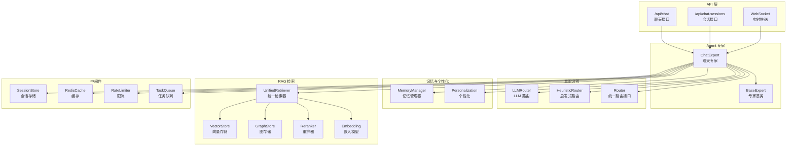
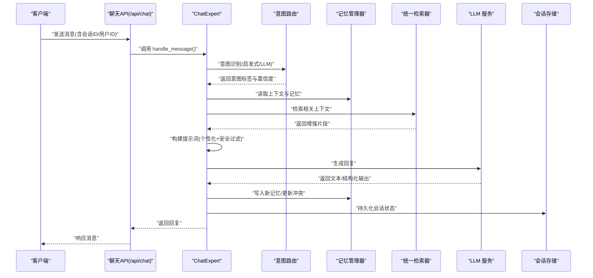
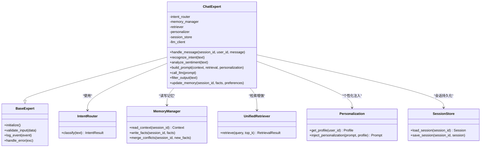
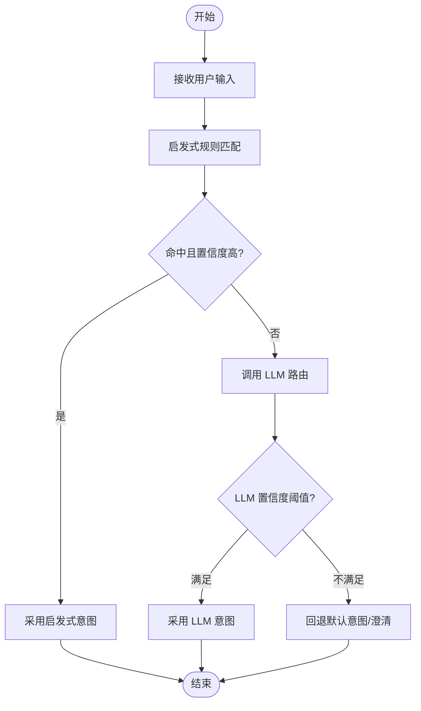
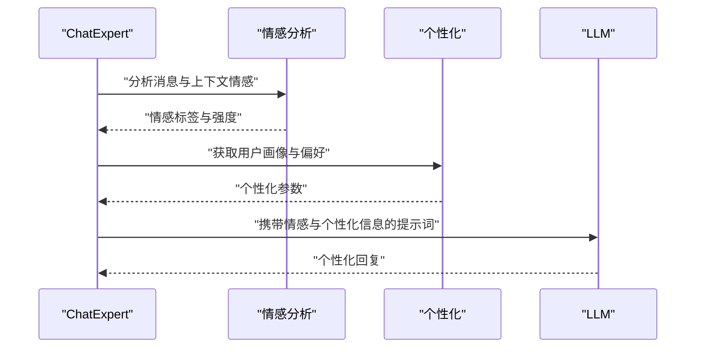
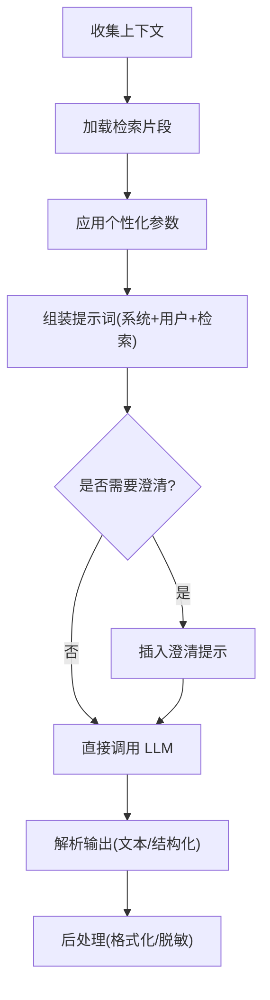
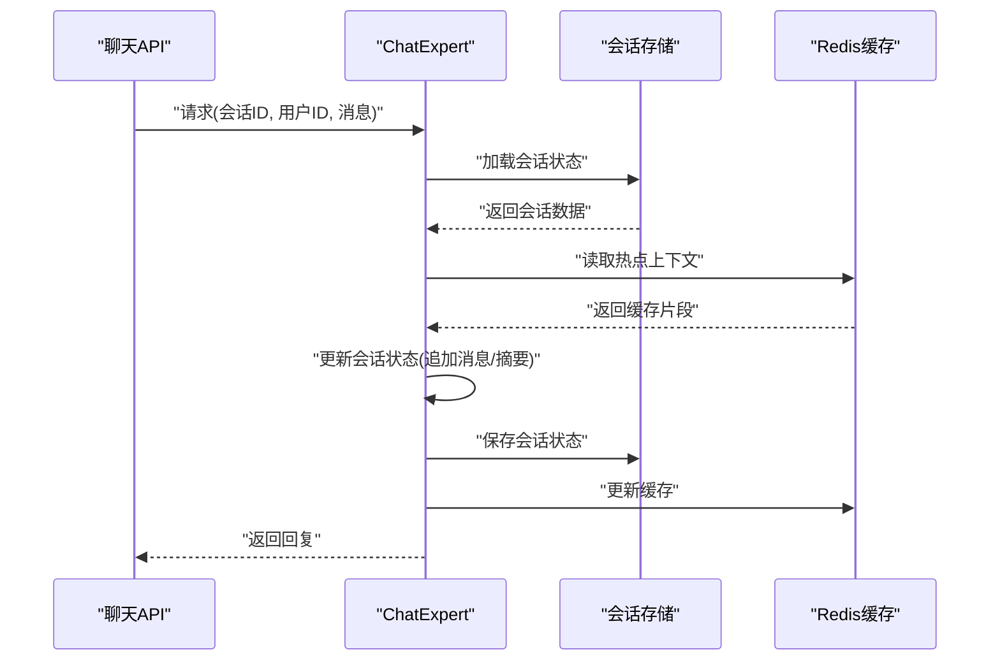
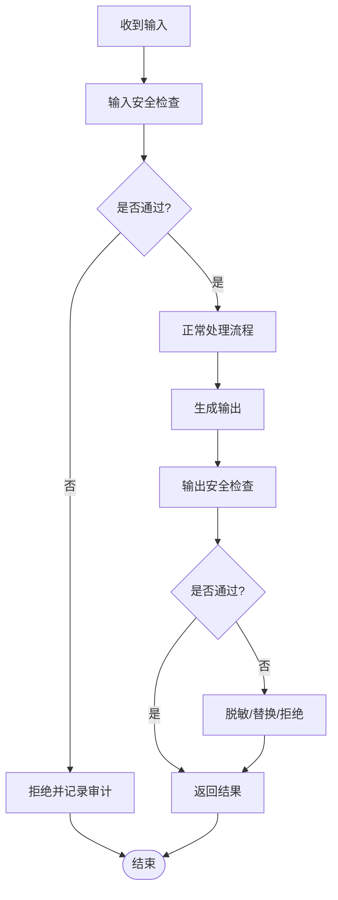
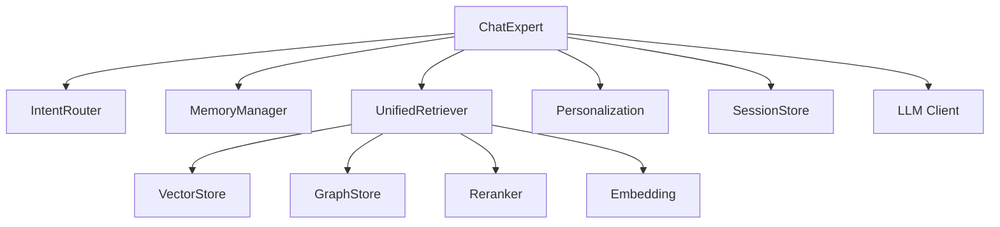

# 聊天专家实现

<cite>
**本文引用的文件**   
- [chat_expert.py](file://backend_design/nexus/agent/experts/chat_expert.py)
- [base.py](file://backend_design/nexus/agent/experts/base.py)
- [responder.py](file://backend_design/nexus/agent/responder.py)
- [supervisor_graph.py](file://backend_design/nexus/agent/supervisor_graph.py)
- [llm_router.py](file://backend_design/nexus/intent/llm_router.py)
- [router.py](file://backend_design/nexus/intent/router.py)
- [heuristic.py](file://backend_design/nexus/intent/heuristic.py)
- [manager.py](file://backend_design/nexus/memory/manager.py)
- [conflict.py](file://backend_design/nexus/memory/conflict.py)
- [personalization.py](file://backend_design/nexus/core/personalization.py)
- [chat.md](file://backend_design/nexus/prompts/chat.md)
- [clarification.md](file://backend_design/nexus/prompts/clarification.md)
- [memory_extract.md](file://backend_design/nexus/prompts/memory_extract.md)
- [vehicle.md](file://backend_design/nexus/prompts/vehicle.md)
- [unified_retriever.py](file://backend_design/nexus/rag/unified_retriever.py)
- [vector_store.py](file://backend_design/nexus/rag/vector_store.py)
- [graph_store.py](file://backend_design/nexus/rag/graph_store.py)
- [reranker.py](file://backend_design/nexus/rag/reranker.py)
- [embedding.py](file://backend_design/nexus/rag/embedding.py)
- [session_store.py](file://backend_design/nexus/middleware/session_store.py)
- [redis_cache.py](file://backend_design/nexus/middleware/redis_cache.py)
- [rate_limiter.py](file://backend_design/nexus/middleware/rate_limiter.py)
- [task_queue.py](file://backend_design/nexus/middleware/task_queue.py)
- [schemas.py](file://backend_design/nexus/models/schemas.py)
- [state.py](file://backend_design/nexus/models/state.py)
- [auth.py](file://backend_design/nexus/api/routes/auth.py)
- [chat.py](file://backend_design/nexus/api/routes/chat.py)
- [chat_sessions.py](file://backend_design/nexus/api/routes/chat_sessions.py)
- [websocket.py](file://backend_design/nexus/api/websocket.py)
- [config.py](file://backend_design/nexus/config.py)
- [exceptions.py](file://backend_design/nexus/core/exceptions.py)
- [logger.py](file://backend_design/nexus/core/logger.py)
</cite>

## 目录
1. [简介](#简介)
2. [项目结构](#项目结构)
3. [核心组件](#核心组件)
4. [架构总览](#架构总览)
5. [详细组件分析](#详细组件分析)
6. [依赖分析](#依赖分析)
7. [性能考虑](#性能考虑)
8. [故障排查指南](#故障排查指南)
9. [结论](#结论)
10. [附录](#附录)

## 简介
本文件面向“聊天专家模块”，围绕 ChatExpert 类展开，系统阐述其通用对话处理能力、上下文记忆集成与多轮对话管理；深入说明意图识别机制、情感分析与个性化回复生成；解释与 LLM 模型的交互方式与提示词工程策略；提供配置与使用示例路径；并覆盖聊天历史管理、会话状态持久化、安全过滤与敏感信息处理等关键主题。文档力求在保持技术深度的同时，对非专业读者友好。

## 项目结构
聊天专家位于 agent 子系统中，属于专家（expert）体系的一部分，并与意图路由、记忆管理、RAG 检索、中间件与会话存储、API 层紧密协作。

图表来源
- [chat_expert.py:1-200](file://backend_design/nexus/agent/experts/chat_expert.py#L1-L200)
- [base.py:1-120](file://backend_design/nexus/agent/experts/base.py#L1-L120)
- [llm_router.py:1-150](file://backend_design/nexus/intent/llm_router.py#L1-L150)
- [heuristic.py:1-120](file://backend_design/nexus/intent/heuristic.py#L1-L120)
- [router.py:1-80](file://backend_design/nexus/intent/router.py#L1-L80)
- [manager.py:1-200](file://backend_design/nexus/memory/manager.py#L1-L200)
- [personalization.py:1-150](file://backend_design/nexus/core/personalization.py#L1-L150)
- [unified_retriever.py:1-200](file://backend_design/nexus/rag/unified_retriever.py#L1-L200)
- [vector_store.py:1-150](file://backend_design/nexus/rag/vector_store.py#L1-L150)
- [graph_store.py:1-150](file://backend_design/nexus/rag/graph_store.py#L1-L150)
- [reranker.py:1-120](file://backend_design/nexus/rag/reranker.py#L1-L120)
- [embedding.py:1-120](file://backend_design/nexus/rag/embedding.py#L1-L120)
- [session_store.py:1-150](file://backend_design/nexus/middleware/session_store.py#L1-L150)
- [redis_cache.py:1-120](file://backend_design/nexus/middleware/redis_cache.py#L1-L120)
- [rate_limiter.py:1-120](file://backend_design/nexus/middleware/rate_limiter.py#L1-L120)
- [task_queue.py:1-150](file://backend_design/nexus/middleware/task_queue.py#L1-L150)
- [chat.py:1-200](file://backend_design/nexus/api/routes/chat.py#L1-L200)
- [chat_sessions.py:1-200](file://backend_design/nexus/api/routes/chat_sessions.py#L1-L200)
- [websocket.py:1-200](file://backend_design/nexus/api/websocket.py#L1-L200)

章节来源
- [chat_expert.py:1-200](file://backend_design/nexus/agent/experts/chat_expert.py#L1-L200)
- [base.py:1-120](file://backend_design/nexus/agent/experts/base.py#L1-L120)
- [llm_router.py:1-150](file://backend_design/nexus/intent/llm_router.py#L1-L150)
- [heuristic.py:1-120](file://backend_design/nexus/intent/heuristic.py#L1-L120)
- [router.py:1-80](file://backend_design/nexus/intent/router.py#L1-L80)
- [manager.py:1-200](file://backend_design/nexus/memory/manager.py#L1-L200)
- [personalization.py:1-150](file://backend_design/nexus/core/personalization.py#L1-L150)
- [unified_retriever.py:1-200](file://backend_design/nexus/rag/unified_retriever.py#L1-L200)
- [vector_store.py:1-150](file://backend_design/nexus/rag/vector_store.py#L1-L150)
- [graph_store.py:1-150](file://backend_design/nexus/rag/graph_store.py#L1-L150)
- [reranker.py:1-120](file://backend_design/nexus/rag/reranker.py#L1-L120)
- [embedding.py:1-120](file://backend_design/nexus/rag/embedding.py#L1-L120)
- [session_store.py:1-150](file://backend_design/nexus/middleware/session_store.py#L1-L150)
- [redis_cache.py:1-120](file://backend_design/nexus/middleware/redis_cache.py#L1-L120)
- [rate_limiter.py:1-120](file://backend_design/nexus/middleware/rate_limiter.py#L1-L120)
- [task_queue.py:1-150](file://backend_design/nexus/middleware/task_queue.py#L1-L150)
- [chat.py:1-200](file://backend_design/nexus/api/routes/chat.py#L1-L200)
- [chat_sessions.py:1-200](file://backend_design/nexus/api/routes/chat_sessions.py#L1-L200)
- [websocket.py:1-200](file://backend_design/nexus/api/websocket.py#L1-L200)

## 核心组件
- ChatExpert：聊天专家主类，封装通用对话能力、意图识别、记忆读写、RAG 检索、个性化注入、安全过滤与 LLM 调用编排。
- BaseExpert：专家基类，定义统一的专家生命周期、参数校验、日志与错误处理模板方法。
- Intent Router：意图路由层，包含 LLM 路由与启发式规则路由，负责将用户输入分类到具体专家或动作。
- Memory Manager：记忆管理器，维护长期/短期记忆、冲突合并与更新策略。
- Personalization：个性化服务，基于用户画像与偏好动态调整提示词与回复风格。
- Unified Retriever：统一检索器，聚合向量与图检索并重排结果，为 LLM 提供增强上下文。
- Session Store / Redis Cache：会话存储与缓存，支撑多轮对话状态与热点数据快速访问。
- API 层：REST 与 WebSocket 接口，暴露聊天与会话管理能力。

章节来源
- [chat_expert.py:1-200](file://backend_design/nexus/agent/experts/chat_expert.py#L1-L200)
- [base.py:1-120](file://backend_design/nexus/agent/experts/base.py#L1-L120)
- [llm_router.py:1-150](file://backend_design/nexus/intent/llm_router.py#L1-L150)
- [heuristic.py:1-120](file://backend_design/nexus/intent/heuristic.py#L1-L120)
- [router.py:1-80](file://backend_design/nexus/intent/router.py#L1-L80)
- [manager.py:1-200](file://backend_design/nexus/memory/manager.py#L1-L200)
- [personalization.py:1-150](file://backend_design/nexus/core/personalization.py#L1-L150)
- [unified_retriever.py:1-200](file://backend_design/nexus/rag/unified_retriever.py#L1-L200)
- [vector_store.py:1-150](file://backend_design/nexus/rag/vector_store.py#L1-L150)
- [graph_store.py:1-150](file://backend_design/nexus/rag/graph_store.py#L1-L150)
- [reranker.py:1-120](file://backend_design/nexus/rag/reranker.py#L1-L120)
- [embedding.py:1-120](file://backend_design/nexus/rag/embedding.py#L1-L120)
- [session_store.py:1-150](file://backend_design/nexus/middleware/session_store.py#L1-L150)
- [redis_cache.py:1-120](file://backend_design/nexus/middleware/redis_cache.py#L1-L120)
- [chat.py:1-200](file://backend_design/nexus/api/routes/chat.py#L1-L200)
- [chat_sessions.py:1-200](file://backend_design/nexus/api/routes/chat_sessions.py#L1-L200)
- [websocket.py:1-200](file://backend_design/nexus/api/websocket.py#L1-L200)

## 架构总览
聊天专家处于 Agent 层的核心位置，向上承接 API 请求，向下协调意图路由、记忆、RAG 与 LLM 调用，并通过中间件完成限流、缓存与异步任务。

图表来源
- [chat.py:1-200](file://backend_design/nexus/api/routes/chat.py#L1-L200)
- [chat_expert.py:1-200](file://backend_design/nexus/agent/experts/chat_expert.py#L1-L200)
- [llm_router.py:1-150](file://backend_design/nexus/intent/llm_router.py#L1-L150)
- [heuristic.py:1-120](file://backend_design/nexus/intent/heuristic.py#L1-L120)
- [manager.py:1-200](file://backend_design/nexus/memory/manager.py#L1-L200)
- [unified_retriever.py:1-200](file://backend_design/nexus/rag/unified_retriever.py#L1-L200)
- [session_store.py:1-150](file://backend_design/nexus/middleware/session_store.py#L1-L150)

## 详细组件分析

### ChatExpert 类设计
ChatExpert 作为聊天专家的实现，承担以下职责：
- 通用对话处理：标准化输入、构造提示词、调用 LLM、解析输出。
- 上下文记忆集成：读取历史摘要、事实记忆与偏好，写入增量记忆。
- 多轮对话管理：维护会话窗口、上下文裁剪与滚动摘要。
- 意图识别：结合启发式规则与 LLM 路由进行意图分类。
- 情感分析：从上下文中提取情绪信号，用于语气与风格调整。
- 个性化回复：依据用户画像与偏好定制提示词与回复策略。
- 安全过滤：输入/输出过滤、敏感信息脱敏与合规检查。
- 与 LLM 的交互：支持多种后端、重试与降级策略。
- 提示词工程：组合系统提示、用户上下文、检索增强与澄清问题。

图表来源
- [base.py:1-120](file://backend_design/nexus/agent/experts/base.py#L1-L120)
- [chat_expert.py:1-200](file://backend_design/nexus/agent/experts/chat_expert.py#L1-L200)
- [llm_router.py:1-150](file://backend_design/nexus/intent/llm_router.py#L1-L150)
- [heuristic.py:1-120](file://backend_design/nexus/intent/heuristic.py#L1-L120)
- [manager.py:1-200](file://backend_design/nexus/memory/manager.py#L1-L200)
- [unified_retriever.py:1-200](file://backend_design/nexus/rag/unified_retriever.py#L1-L200)
- [personalization.py:1-150](file://backend_design/nexus/core/personalization.py#L1-L150)
- [session_store.py:1-150](file://backend_design/nexus/middleware/session_store.py#L1-L150)

章节来源
- [chat_expert.py:1-200](file://backend_design/nexus/agent/experts/chat_expert.py#L1-L200)
- [base.py:1-120](file://backend_design/nexus/agent/experts/base.py#L1-L120)

### 意图识别机制
意图识别采用双通道策略：
- 启发式路由：基于关键词、正则与规则树进行快速分类，适合高确定性场景。
- LLM 路由：通过轻量提示词让 LLM 判断意图类别与置信度，适合复杂语义。
- 统一路由接口：对外暴露 classify 方法，内部根据配置选择启发式或 LLM 路由，并可融合两者结果。

图表来源
- [heuristic.py:1-120](file://backend_design/nexus/intent/heuristic.py#L1-L120)
- [llm_router.py:1-150](file://backend_design/nexus/intent/llm_router.py#L1-L150)
- [router.py:1-80](file://backend_design/nexus/intent/router.py#L1-L80)

章节来源
- [heuristic.py:1-120](file://backend_design/nexus/intent/heuristic.py#L1-L120)
- [llm_router.py:1-150](file://backend_design/nexus/intent/llm_router.py#L1-L150)
- [router.py:1-80](file://backend_design/nexus/intent/router.py#L1-L80)

### 情感分析与个性化回复
- 情感分析：从当前消息与近期上下文抽取情绪特征（如积极/消极/中性），用于调整语气、措辞与推荐策略。
- 个性化：加载用户画像与偏好（语言风格、兴趣领域、禁忌话题），注入提示词与后处理逻辑，使回复更贴合用户。

图表来源
- [chat_expert.py:1-200](file://backend_design/nexus/agent/experts/chat_expert.py#L1-L200)
- [personalization.py:1-150](file://backend_design/nexus/core/personalization.py#L1-L150)

章节来源
- [chat_expert.py:1-200](file://backend_design/nexus/agent/experts/chat_expert.py#L1-L200)
- [personalization.py:1-150](file://backend_design/nexus/core/personalization.py#L1-L150)

### 与 LLM 的交互与提示词工程
- 交互方式：统一封装 LLM 客户端，支持多后端、超时控制、重试与降级；可切换流式与非流式模式。
- 提示词工程：
  - 系统提示：角色设定、行为约束与安全策略。
  - 用户上下文：会话历史摘要、最近 N 条消息、记忆要点。
  - 检索增强：来自向量与图的片段，经重排器排序后拼接。
  - 澄清问题：当意图模糊时，插入澄清提示以引导用户补充信息。
  - 个性化注入：根据用户画像调整语气、术语与推荐范围。
- 提示词模板：
  - 聊天主提示词模板：[chat.md](file://backend_design/nexus/prompts/chat.md)
  - 澄清问题模板：[clarification.md](file://backend_design/nexus/prompts/clarification.md)
  - 记忆提取模板：[memory_extract.md](file://backend_design/nexus/prompts/memory_extract.md)
  - 车辆相关提示词：[vehicle.md](file://backend_design/nexus/prompts/vehicle.md)

图表来源
- [chat_expert.py:1-200](file://backend_design/nexus/agent/experts/chat_expert.py#L1-L200)
- [chat.md:1-200](file://backend_design/nexus/prompts/chat.md#L1-L200)
- [clarification.md:1-200](file://backend_design/nexus/prompts/clarification.md#L1-L200)
- [memory_extract.md:1-200](file://backend_design/nexus/prompts/memory_extract.md#L1-L200)
- [vehicle.md:1-200](file://backend_design/nexus/prompts/vehicle.md#L1-L200)

章节来源
- [chat.md:1-200](file://backend_design/nexus/prompts/chat.md#L1-L200)
- [clarification.md:1-200](file://backend_design/nexus/prompts/clarification.md#L1-L200)
- [memory_extract.md:1-200](file://backend_design/nexus/prompts/memory_extract.md#L1-L200)
- [vehicle.md:1-200](file://backend_design/nexus/prompts/vehicle.md#L1-L200)

### 聊天历史管理与会话状态持久化
- 聊天历史：按会话 ID 维护消息序列，支持滑动窗口与摘要压缩，避免上下文过长。
- 会话状态：包括用户 ID、会话元数据、最近意图、情感快照、未决澄清问题等。
- 持久化：通过会话存储与缓存协同，保证热路径低延迟与冷路径可恢复。

图表来源
- [chat.py:1-200](file://backend_design/nexus/api/routes/chat.py#L1-L200)
- [chat_expert.py:1-200](file://backend_design/nexus/agent/experts/chat_expert.py#L1-L200)
- [session_store.py:1-150](file://backend_design/nexus/middleware/session_store.py#L1-L150)
- [redis_cache.py:1-120](file://backend_design/nexus/middleware/redis_cache.py#L1-L120)

章节来源
- [chat.py:1-200](file://backend_design/nexus/api/routes/chat.py#L1-L200)
- [chat_sessions.py:1-200](file://backend_design/nexus/api/routes/chat_sessions.py#L1-L200)
- [session_store.py:1-150](file://backend_design/nexus/middleware/session_store.py#L1-L150)
- [redis_cache.py:1-120](file://backend_design/nexus/middleware/redis_cache.py#L1-L120)

### 安全过滤与敏感信息处理
- 输入过滤：检测并屏蔽敏感信息（如手机号、身份证、银行卡号）、恶意注入与越权指令。
- 输出过滤：对 LLM 返回内容进行二次校验，去除潜在泄露与不当内容。
- 脱敏策略：对必要字段进行掩码或哈希化处理，确保日志与存储安全。
- 审计与告警：记录可疑请求与拦截事件，便于追踪与复盘。

图表来源
- [chat_expert.py:1-200](file://backend_design/nexus/agent/experts/chat_expert.py#L1-L200)
- [logger.py:1-200](file://backend_design/nexus/core/logger.py#L1-L200)

章节来源
- [chat_expert.py:1-200](file://backend_design/nexus/agent/experts/chat_expert.py#L1-L200)
- [logger.py:1-200](file://backend_design/nexus/core/logger.py#L1-L200)

### 配置与使用示例
- 配置项建议：
  - LLM 后端与密钥、超时与重试次数。
  - 意图路由策略（启发式权重、LLM 阈值）。
  - 记忆窗口大小与摘要频率。
  - RAG 检索 top_k、重排策略与相似度阈值。
  - 会话存储与缓存 TTL。
  - 安全过滤规则与审计开关。
- 使用步骤：
  - 初始化 ChatExpert 实例，传入配置与依赖（意图路由、记忆、检索、个性化、会话存储、LLM 客户端）。
  - 调用 handle_message 处理单轮对话。
  - 通过 /api/chat 与 /api/chat-sessions 接口进行集成。
  - 可选：使用 WebSocket 进行实时推送。

章节来源
- [config.py:1-200](file://backend_design/nexus/config.py#L1-L200)
- [chat.py:1-200](file://backend_design/nexus/api/routes/chat.py#L1-L200)
- [chat_sessions.py:1-200](file://backend_design/nexus/api/routes/chat_sessions.py#L1-L200)
- [websocket.py:1-200](file://backend_design/nexus/api/websocket.py#L1-L200)

## 依赖分析
聊天专家依赖多个子系统，耦合关系如下：
- 强依赖：意图路由、记忆管理、RAG 检索、会话存储、LLM 客户端。
- 弱依赖：个性化、缓存、限流、任务队列。
- 外部依赖：向量数据库、图数据库、LLM 服务。

图表来源
- [chat_expert.py:1-200](file://backend_design/nexus/agent/experts/chat_expert.py#L1-L200)
- [llm_router.py:1-150](file://backend_design/nexus/intent/llm_router.py#L1-L150)
- [manager.py:1-200](file://backend_design/nexus/memory/manager.py#L1-L200)
- [unified_retriever.py:1-200](file://backend_design/nexus/rag/unified_retriever.py#L1-L200)
- [vector_store.py:1-150](file://backend_design/nexus/rag/vector_store.py#L1-L150)
- [graph_store.py:1-150](file://backend_design/nexus/rag/graph_store.py#L1-L150)
- [reranker.py:1-120](file://backend_design/nexus/rag/reranker.py#L1-L120)
- [embedding.py:1-120](file://backend_design/nexus/rag/embedding.py#L1-L120)

章节来源
- [chat_expert.py:1-200](file://backend_design/nexus/agent/experts/chat_expert.py#L1-L200)
- [unified_retriever.py:1-200](file://backend_design/nexus/rag/unified_retriever.py#L1-L200)

## 性能考虑
- 上下文裁剪：限制消息窗口长度，定期生成摘要，降低 LLM 输入成本。
- 检索优化：合理设置 top_k 与相似度阈值，减少无关片段引入。
- 缓存策略：热点会话与检索结果缓存，缩短响应时间。
- 异步任务：长耗时操作（如记忆合并、批量更新）放入任务队列。
- 限流保护：防止突发流量导致 LLM 过载。

章节来源
- [redis_cache.py:1-120](file://backend_design/nexus/middleware/redis_cache.py#L1-L120)
- [rate_limiter.py:1-120](file://backend_design/nexus/middleware/rate_limiter.py#L1-L120)
- [task_queue.py:1-150](file://backend_design/nexus/middleware/task_queue.py#L1-L150)

## 故障排查指南
- 常见问题定位：
  - 意图识别失败：检查启发式规则与 LLM 路由阈值，查看日志中的意图分类结果。
  - 记忆冲突：查看冲突合并策略与更新顺序，确认事实一致性。
  - 检索质量差：调整 top_k、相似度阈值与重排器参数。
  - LLM 超时/失败：检查后端健康状态、重试与降级策略。
  - 会话丢失：确认会话存储与缓存 TTL 配置，核对持久化流程。
- 调试工具：
  - 启用详细日志与审计记录。
  - 使用异常类型与错误码定位问题。
  - 监控指标：请求量、延迟、错误率、缓存命中率。

章节来源
- [exceptions.py:1-200](file://backend_design/nexus/core/exceptions.py#L1-L200)
- [logger.py:1-200](file://backend_design/nexus/core/logger.py#L1-L200)

## 结论
ChatExpert 通过整合意图识别、记忆管理、RAG 检索、个性化注入与安全过滤，构建了稳健的多轮对话能力。配合会话持久化与中间件保障，系统在可用性、性能与安全性方面具备良好平衡。建议在生产环境持续优化提示词与检索策略，完善监控与审计，确保用户体验与数据安全。

## 附录
- 数据模型参考：
  - 会话与消息结构：[schemas.py](file://backend_design/nexus/models/schemas.py)
  - 状态定义：[state.py](file://backend_design/nexus/models/state.py)
- 认证与鉴权：
  - 认证接口：[auth.py](file://backend_design/nexus/api/routes/auth.py)

章节来源
- [schemas.py:1-200](file://backend_design/nexus/models/schemas.py#L1-L200)
- [state.py:1-200](file://backend_design/nexus/models/state.py#L1-L200)
- [auth.py:1-200](file://backend_design/nexus/api/routes/auth.py#L1-L200)