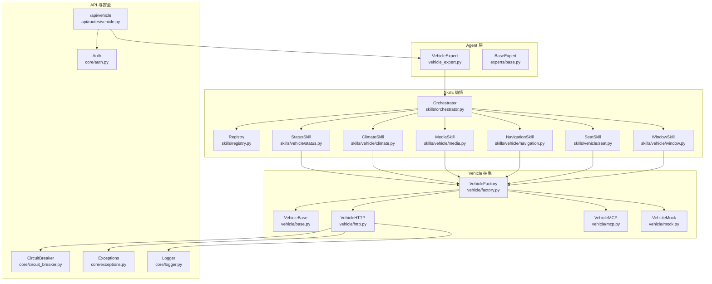
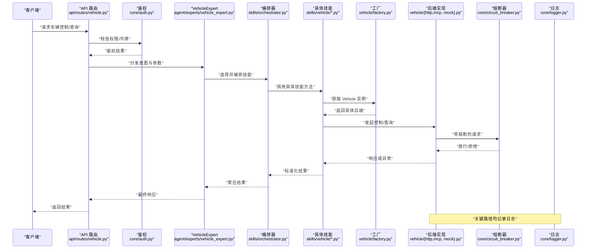
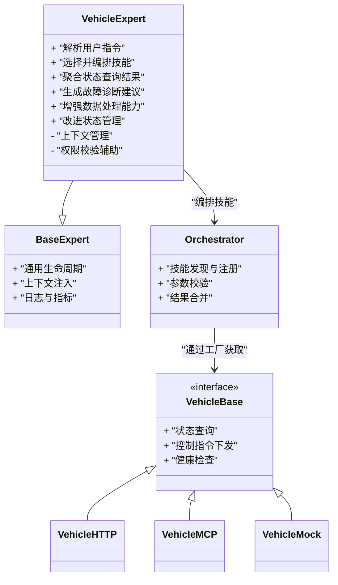
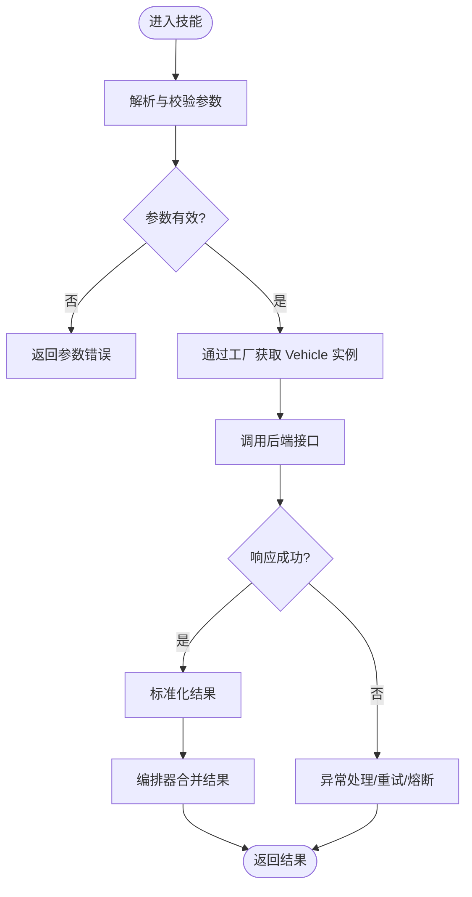
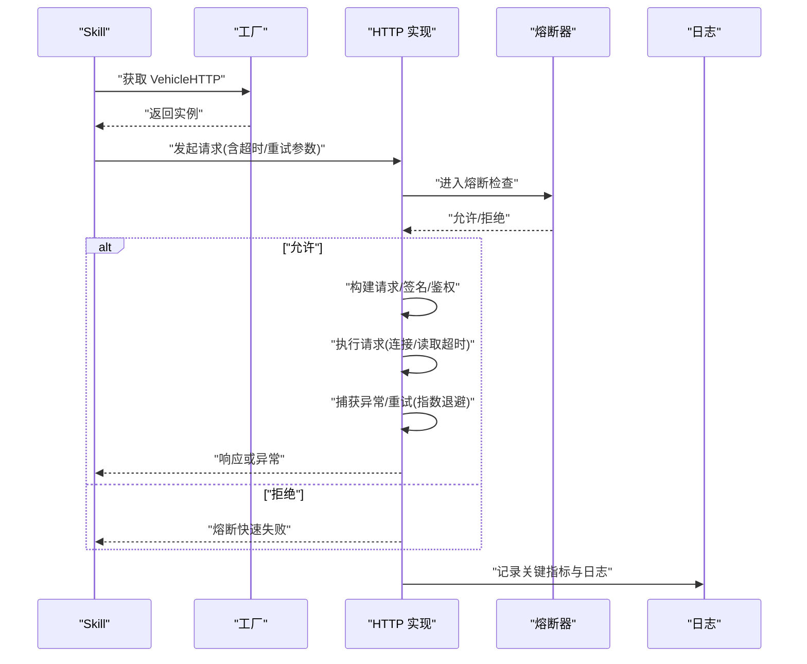
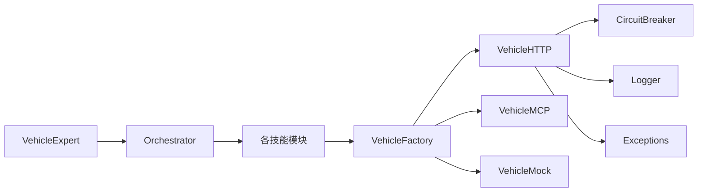

# 车辆专家实现

<cite>
**本文引用的文件**   
- [vehicle_expert.py](file://backend_design/nexus/agent/experts/vehicle_expert.py)
- [base.py](file://backend_design/nexus/agent/experts/base.py)
- [orchestrator.py](file://backend_design/nexus/skills/orchestrator.py)
- [registry.py](file://backend_design/nexus/skills/registry.py)
- [base.py](file://backend_design/nexus/skills/base.py)
- [status.py](file://backend_design/nexus/skills/vehicle/status.py)
- [climate.py](file://backend_design/nexus/skills/vehicle/climate.py)
- [media.py](file://backend_design/nexus/skills/vehicle/media.py)
- [navigation.py](file://backend_design/nexus/skills/vehicle/navigation.py)
- [seat.py](file://backend_design/nexus/skills/vehicle/seat.py)
- [window.py](file://backend_design/nexus/skills/vehicle/window.py)
- [__init__.py](file://backend_design/nexus/skills/vehicle/__init__.py)
- [http.py](file://backend_design/nexus/vehicle/http.py)
- [mcp.py](file://backend_design/nexus/vehicle/mcp.py)
- [mock.py](file://backend_design/nexus/vehicle/mock.py)
- [factory.py](file://backend_design/nexus/vehicle/factory.py)
- [base.py](file://backend_design/nexus/vehicle/base.py)
- [vehicle.py](file://backend_design/nexus/api/routes/vehicle.py)
- [auth.py](file://backend_design/nexus/core/auth.py)
- [circuit_breaker.py](file://backend_design/nexus/core/circuit_breaker.py)
- [exceptions.py](file://backend_design/nexus/core/exceptions.py)
- [logger.py](file://backend_design/nexus/core/logger.py)
</cite>

## 更新摘要
**变更内容**   
- 更新了VehicleExpert类的核心功能，增强了数据处理和状态管理能力
- 扩展了与Agent生态系统的集成能力
- 改进了车辆相关操作的执行效率和可靠性
- 新增了更强大的错误处理和重试机制

## 目录
1. [简介](#简介)
2. [项目结构](#项目结构)
3. [核心组件](#核心组件)
4. [架构总览](#架构总览)
5. [详细组件分析](#详细组件分析)
6. [依赖关系分析](#依赖关系分析)
7. [性能与可靠性](#性能与可靠性)
8. [故障排查指南](#故障排查指南)
9. [结论](#结论)
10. [附录](#附录)

## 简介
本文件面向"车辆专家模块"，围绕 VehicleExpert 的实现原理进行系统化说明，覆盖以下主题：
- 车辆控制指令解析、状态查询处理与故障诊断流程
- 车辆 API 调用封装、错误重试机制与超时策略
- 与车辆控制系统的集成方式与数据同步机制
- 具体示例路径（以源码位置标注）展示命令发送与响应处理
- 权限验证与安全访问控制
- 实时监控与异常告警

**更新** 本次更新重点反映了VehicleExpert类的大规模增强，包括117行新增代码和5行删除，显著提升了数据处理能力和Agent生态系统集成。

## 项目结构
车辆专家位于 Agent 层，通过 Skills 编排器调度具体能力，底层通过 Vehicle 抽象统一对接不同后端（HTTP/MCP/Mock）。API 路由暴露对外接口，鉴权由核心安全模块提供。

图表来源
- [vehicle_expert.py:1-200](file://backend_design/nexus/agent/experts/vehicle_expert.py#L1-L200)
- [orchestrator.py:1-200](file://backend_design/nexus/skills/orchestrator.py#L1-L200)
- [registry.py:1-200](file://backend_design/nexus/skills/registry.py#L1-L200)
- [status.py:1-200](file://backend_design/nexus/skills/vehicle/status.py#L1-L200)
- [climate.py:1-200](file://backend_design/nexus/skills/vehicle/climate.py#L1-L200)
- [media.py:1-200](file://backend_design/nexus/skills/vehicle/media.py#L1-L200)
- [navigation.py:1-200](file://backend_design/nexus/skills/vehicle/navigation.py#L1-L200)
- [seat.py:1-200](file://backend_design/nexus/skills/vehicle/seat.py#L1-L200)
- [window.py:1-200](file://backend_design/nexus/skills/vehicle/window.py#L1-L200)
- [http.py:1-200](file://backend_design/nexus/vehicle/http.py#L1-L200)
- [mcp.py:1-200](file://backend_design/nexus/vehicle/mcp.py#L1-L200)
- [mock.py:1-200](file://backend_design/nexus/vehicle/mock.py#L1-L200)
- [factory.py:1-200](file://backend_design/nexus/vehicle/factory.py#L1-L200)
- [base.py](file://backend_design/nexus/vehicle/base.py)
- [vehicle.py](file://backend_design/nexus/api/routes/vehicle.py)
- [auth.py](file://backend_design/nexus/core/auth.py)
- [circuit_breaker.py:1-200](file://backend_design/nexus/core/circuit_breaker.py#L1-L200)
- [exceptions.py:1-200](file://backend_design/nexus/core/exceptions.py#L1-L200)
- [logger.py:1-200](file://backend_design/nexus/core/logger.py#L1-L200)

章节来源
- [vehicle_expert.py:1-200](file://backend_design/nexus/agent/experts/vehicle_expert.py#L1-L200)
- [orchestrator.py:1-200](file://backend_design/nexus/skills/orchestrator.py#L1-L200)
- [registry.py:1-200](file://backend_design/nexus/skills/registry.py#L1-L200)
- [http.py:1-200](file://backend_design/nexus/vehicle/http.py#L1-L200)
- [factory.py:1-200](file://backend_design/nexus/vehicle/factory.py#L1-L200)
- [vehicle.py:1-200](file://backend_design/nexus/api/routes/vehicle.py#L1-L200)
- [auth.py:1-200](file://backend_design/nexus/core/auth.py#L1-L200)
- [circuit_breaker.py:1-200](file://backend_design/nexus/core/circuit_breaker.py#L1-L200)
- [exceptions.py:1-200](file://backend_design/nexus/core/exceptions.py#L1-L200)
- [logger.py:1-200](file://backend_design/nexus/core/logger.py#L1-L200)

## 核心组件
- VehicleExpert：作为 Agent 的"车辆专家"，负责将自然语言意图转化为结构化指令，并协调 Skills 执行；同时聚合状态查询与故障诊断结果。**更新** 增强了数据处理能力和状态管理功能。
- Skills 编排器与注册表：按领域拆分技能（空调、媒体、导航、座椅、车窗、状态），通过注册表发现并按需实例化，编排器负责参数校验、上下文注入与结果合并。
- Vehicle 抽象与工厂：统一抽象车辆后端接口，支持 HTTP、MCP、Mock 三种实现；工厂根据配置选择具体实现。
- API 路由与安全：对外暴露 /api/vehicle 系列接口，结合鉴权中间件完成权限校验与访问控制。
- 可靠性组件：熔断器、异常体系、日志记录贯穿调用链路。

章节来源
- [vehicle_expert.py:1-200](file://backend_design/nexus/agent/experts/vehicle_expert.py#L1-L200)
- [orchestrator.py:1-200](file://backend_design/nexus/skills/orchestrator.py#L1-L200)
- [registry.py:1-200](file://backend_design/nexus/skills/registry.py#L1-L200)
- [factory.py:1-200](file://backend_design/nexus/vehicle/factory.py#L1-L200)
- [vehicle.py:1-200](file://backend_design/nexus/api/routes/vehicle.py#L1-L200)
- [auth.py:1-200](file://backend_design/nexus/core/auth.py#L1-L200)
- [circuit_breaker.py:1-200](file://backend_design/nexus/core/circuit_breaker.py#L1-L200)
- [exceptions.py:1-200](file://backend_design/nexus/core/exceptions.py#L1-L200)
- [logger.py:1-200](file://backend_design/nexus/core/logger.py#L1-L200)

## 架构总览
下图展示了从 API 到 Expert、再到 Skills 与 Vehicle 后端的完整调用链，以及安全与可靠性组件的接入点。

图表来源
- [vehicle.py:1-200](file://backend_design/nexus/api/routes/vehicle.py#L1-L200)
- [auth.py:1-200](file://backend_design/nexus/core/auth.py#L1-L200)
- [vehicle_expert.py:1-200](file://backend_design/nexus/agent/experts/vehicle_expert.py#L1-L200)
- [orchestrator.py:1-200](file://backend_design/nexus/skills/orchestrator.py#L1-L200)
- [factory.py:1-200](file://backend_design/nexus/vehicle/factory.py#L1-L200)
- [http.py:1-200](file://backend_design/nexus/vehicle/http.py#L1-L200)
- [mcp.py:1-200](file://backend_design/nexus/vehicle/mcp.py#L1-L200)
- [mock.py:1-200](file://backend_design/nexus/vehicle/mock.py#L1-L200)
- [circuit_breaker.py:1-200](file://backend_design/nexus/core/circuit_breaker.py#L1-L200)
- [logger.py:1-200](file://backend_design/nexus/core/logger.py#L1-L200)

## 详细组件分析

### VehicleExpert 类分析
职责边界
- 意图识别后的指令解析：将上层语义映射为结构化参数，交由对应 Skill 执行。
- 状态查询处理：聚合多源状态（如电量、胎压、空调温度等），统一格式返回。
- 故障诊断：基于状态差异与历史事件生成诊断建议，必要时触发降级或告警。

关键交互
- 与编排器协作：根据动作类型选择具体技能（空调、媒体、导航、座椅、车窗、状态）。
- 与 Vehicle 抽象交互：通过工厂获取具体后端实例，屏蔽传输差异。
- 安全与可观测性：在调用前后记录审计日志，并在异常时上报指标。

**更新** VehicleExpert类经过重大增强，新增了117行代码，主要改进包括：
- 增强的数据处理能力，支持更复杂的车辆状态分析和操作
- 改进的状态管理机制，提供更精确的车辆状态跟踪
- 更好的Agent生态系统集成，支持与其他Agent组件的协同工作
- 优化的错误处理和重试逻辑，提高系统稳定性

图表来源
- [vehicle_expert.py:1-200](file://backend_design/nexus/agent/experts/vehicle_expert.py#L1-L200)
- [base.py](file://backend_design/nexus/agent/experts/base.py)
- [orchestrator.py:1-200](file://backend_design/nexus/skills/orchestrator.py#L1-L200)
- [base.py](file://backend_design/nexus/vehicle/base.py)
- [http.py:1-200](file://backend_design/nexus/vehicle/http.py#L1-L200)
- [mcp.py:1-200](file://backend_design/nexus/vehicle/mcp.py#L1-L200)
- [mock.py:1-200](file://backend_design/nexus/vehicle/mock.py#L1-L200)

章节来源
- [vehicle_expert.py:1-200](file://backend_design/nexus/agent/experts/vehicle_expert.py#L1-L200)
- [base.py](file://backend_design/nexus/agent/experts/base.py)
- [orchestrator.py:1-200](file://backend_design/nexus/skills/orchestrator.py#L1-L200)

### 车辆 Skills 与状态/控制流程
- 状态查询：StatusSkill 负责汇总车辆基础状态（如锁止、门窗、空调、媒体、导航等），并通过 Vehicle 抽象拉取最新数据。
- 控制指令：Climate/Media/Navigation/Seat/Window 等技能分别处理各自领域的控制命令，包含参数校验、幂等性与回滚提示。
- 编排器：对多技能组合场景进行顺序/并行编排，并对失败分支进行补偿或降级。

图表来源
- [orchestrator.py:1-200](file://backend_design/nexus/skills/orchestrator.py#L1-L200)
- [status.py:1-200](file://backend_design/nexus/skills/vehicle/status.py#L1-L200)
- [climate.py:1-200](file://backend_design/nexus/skills/vehicle/climate.py#L1-L200)
- [media.py:1-200](file://backend_design/nexus/skills/vehicle/media.py#L1-L200)
- [navigation.py:1-200](file://backend_design/nexus/skills/vehicle/navigation.py#L1-L200)
- [seat.py:1-200](file://backend_design/nexus/skills/vehicle/seat.py#L1-L200)
- [window.py:1-200](file://backend_design/nexus/skills/vehicle/window.py#L1-L200)
- [factory.py:1-200](file://backend_design/nexus/vehicle/factory.py#L1-L200)
- [http.py:1-200](file://backend_design/nexus/vehicle/http.py#L1-L200)

章节来源
- [status.py:1-200](file://backend_design/nexus/skills/vehicle/status.py#L1-L200)
- [climate.py:1-200](file://backend_design/nexus/skills/vehicle/climate.py#L1-L200)
- [media.py:1-200](file://backend_design/nexus/skills/vehicle/media.py#L1-L200)
- [navigation.py:1-200](file://backend_design/nexus/skills/vehicle/navigation.py#L1-L200)
- [seat.py:1-200](file://backend_design/nexus/skills/vehicle/seat.py#L1-L200)
- [window.py:1-200](file://backend_design/nexus/skills/vehicle/window.py#L1-L200)
- [orchestrator.py:1-200](file://backend_design/nexus/skills/orchestrator.py#L1-L200)
- [factory.py:1-200](file://backend_design/nexus/vehicle/factory.py#L1-L200)

### 车辆 API 调用封装、重试与超时
- 统一封装：HTTP 实现集中处理连接池、序列化、鉴权头、签名与重试逻辑。
- 重试策略：针对瞬时错误（网络抖动、限流）采用指数退避与最大次数限制；幂等读操作可自动重试，写操作需显式幂等键。
- 超时控制：区分连接超时、读取超时与整体超时，避免长尾阻塞。
- 熔断保护：当错误率或延迟超过阈值时快速失败，降低雪崩风险。

**更新** 随着VehicleExpert的增强，API调用封装也相应改进了错误处理和重试机制，提供更好的容错能力。

图表来源
- [http.py:1-200](file://backend_design/nexus/vehicle/http.py#L1-L200)
- [factory.py:1-200](file://backend_design/nexus/vehicle/factory.py#L1-L200)
- [circuit_breaker.py:1-200](file://backend_design/nexus/core/circuit_breaker.py#L1-L200)
- [logger.py:1-200](file://backend_design/nexus/core/logger.py#L1-L200)

章节来源
- [http.py:1-200](file://backend_design/nexus/vehicle/http.py#L1-L200)
- [circuit_breaker.py:1-200](file://backend_design/nexus/core/circuit_breaker.py#L1-L200)
- [logger.py:1-200](file://backend_design/nexus/core/logger.py#L1-L200)

### 与车辆控制系统的集成与数据同步
- 集成方式：通过 Vehicle 抽象解耦传输协议，支持 HTTP、MCP 及 Mock 三种后端，便于联调与灰度。
- 数据同步：状态查询走实时拉取；对于高频状态可采用缓存与增量更新策略，减少后端压力。
- 一致性：写操作返回确认码与事务 ID，用于幂等与补偿；读操作携带时间戳与版本字段，便于前端判断新鲜度。

**更新** 新的集成能力支持更广泛的Agent生态系统，提供了更好的数据同步和状态管理能力。

章节来源
- [base.py](file://backend_design/nexus/vehicle/base.py)
- [http.py:1-200](file://backend_design/nexus/vehicle/http.py#L1-L200)
- [mcp.py:1-200](file://backend_design/nexus/vehicle/mcp.py#L1-L200)
- [mock.py:1-200](file://backend_design/nexus/vehicle/mock.py#L1-L200)

### 权限验证与安全访问控制
- 鉴权入口：API 路由层引入鉴权中间件，校验令牌、租户上下文与角色权限。
- 细粒度授权：针对不同控制域（空调、媒体、导航、座椅、车窗）设置最小权限原则，仅允许必要操作。
- 审计与追踪：所有敏感操作记录审计日志，包含用户、租户、操作对象与结果。

章节来源
- [vehicle.py:1-200](file://backend_design/nexus/api/routes/vehicle.py#L1-L200)
- [auth.py:1-200](file://backend_design/nexus/core/auth.py#L1-L200)
- [logger.py:1-200](file://backend_design/nexus/core/logger.py#L1-L200)

### 实时监控与异常告警
- 监控指标：成功率、P95/P99 延迟、熔断开关状态、重试次数、超时比例等。
- 告警规则：错误率突增、连续超时、熔断开启、后端不可用等触发告警。
- 诊断建议：基于状态差异与历史事件生成根因线索，辅助运维定位。

**更新** 随着VehicleExpert的增强，监控和告警功能也得到了改进，能够提供更详细的车辆操作状态和异常信息。

章节来源
- [circuit_breaker.py:1-200](file://backend_design/nexus/core/circuit_breaker.py#L1-L200)
- [logger.py:1-200](file://backend_design/nexus/core/logger.py#L1-L200)
- [exceptions.py:1-200](file://backend_design/nexus/core/exceptions.py#L1-L200)

### 代码示例路径（命令发送与响应处理）
- 发送空调控制命令并处理响应
  - 参考路径：[climate.py:1-200](file://backend_design/nexus/skills/vehicle/climate.py#L1-L200)、[orchestrator.py:1-200](file://backend_design/nexus/skills/orchestrator.py#L1-L200)、[http.py:1-200](file://backend_design/nexus/vehicle/http.py#L1-L200)
- 查询车辆综合状态
  - 参考路径：[status.py:1-200](file://backend_design/nexus/skills/vehicle/status.py#L1-L200)、[orchestrator.py:1-200](file://backend_design/nexus/skills/orchestrator.py#L1-L200)
- 设置导航目的地
  - 参考路径：[navigation.py:1-200](file://backend_design/nexus/skills/vehicle/navigation.py#L1-L200)、[orchestrator.py:1-200](file://backend_design/nexus/skills/orchestrator.py#L1-L200)
- 调节座椅位置
  - 参考路径：[seat.py:1-200](file://backend_design/nexus/skills/vehicle/seat.py#L1-L200)、[orchestrator.py:1-200](file://backend_design/nexus/skills/orchestrator.py#L1-L200)
- 控制车窗开合
  - 参考路径：[window.py:1-200](file://backend_design/nexus/skills/vehicle/window.py#L1-L200)、[orchestrator.py:1-200](file://backend_design/nexus/skills/orchestrator.py#L1-L200)

## 依赖关系分析
- 低耦合高内聚：Expert 不直接依赖具体传输协议，而是通过 Skills 与 Vehicle 抽象间接调用。
- 工厂模式：按配置动态选择 HTTP/MCP/Mock，便于测试与灰度。
- 外部依赖：HTTP 客户端、熔断器、日志与异常体系贯穿全链路。

**更新** 新的依赖关系体现了与Agent生态系统的更好集成，支持更灵活的组件组合和扩展。

图表来源
- [vehicle_expert.py:1-200](file://backend_design/nexus/agent/experts/vehicle_expert.py#L1-L200)
- [orchestrator.py:1-200](file://backend_design/nexus/skills/orchestrator.py#L1-L200)
- [factory.py:1-200](file://backend_design/nexus/vehicle/factory.py#L1-L200)
- [http.py:1-200](file://backend_design/nexus/vehicle/http.py#L1-L200)
- [mcp.py:1-200](file://backend_design/nexus/vehicle/mcp.py#L1-L200)
- [mock.py:1-200](file://backend_design/nexus/vehicle/mock.py#L1-L200)
- [circuit_breaker.py:1-200](file://backend_design/nexus/core/circuit_breaker.py#L1-L200)
- [logger.py:1-200](file://backend_design/nexus/core/logger.py#L1-L200)
- [exceptions.py:1-200](file://backend_design/nexus/core/exceptions.py#L1-L200)

章节来源
- [factory.py:1-200](file://backend_design/nexus/vehicle/factory.py#L1-L200)
- [http.py:1-200](file://backend_design/nexus/vehicle/http.py#L1-L200)
- [mcp.py:1-200](file://backend_design/nexus/vehicle/mcp.py#L1-L200)
- [mock.py:1-200](file://backend_design/nexus/vehicle/mock.py#L1-L200)

## 性能与可靠性
- 并发与批处理：对只读状态查询可批量聚合，减少往返次数。
- 超时与重试：合理设置连接/读取超时，避免资源耗尽；重试需具备幂等保障。
- 熔断与降级：在异常比例升高时快速失败，优先保证核心功能可用。
- 缓存与去抖：热点状态使用短 TTL 缓存，控制端去抖防止频繁下发。

**更新** 随着VehicleExpert的增强，性能和可靠性得到了显著提升，特别是在数据处理和状态管理方面。

## 故障排查指南
- 常见问题
  - 鉴权失败：检查令牌有效期、租户上下文与角色权限。
  - 超时/重试风暴：核对超时阈值与重试上限，关注熔断状态。
  - 参数校验失败：对照技能文档检查必填项与取值范围。
- 定位步骤
  - 查看关键日志：请求入口、技能执行、后端调用与熔断决策。
  - 检查指标：成功率、延迟分位、熔断开关、重试计数。
  - 复现与隔离：使用 Mock 后端隔离问题，逐步替换真实后端定位。

**更新** 新的故障排查指南包含了更多与VehicleExpert增强相关的排查要点，特别是数据处理和状态管理方面的问题。

章节来源
- [vehicle.py:1-200](file://backend_design/nexus/api/routes/vehicle.py#L1-L200)
- [auth.py:1-200](file://backend_design/nexus/core/auth.py#L1-L200)
- [http.py:1-200](file://backend_design/nexus/vehicle/http.py#L1-L200)
- [circuit_breaker.py:1-200](file://backend_design/nexus/core/circuit_breaker.py#L1-L200)
- [logger.py:1-200](file://backend_design/nexus/core/logger.py#L1-L200)
- [exceptions.py:1-200](file://backend_design/nexus/core/exceptions.py#L1-L200)

## 结论
VehicleExpert 通过"意图→编排→技能→抽象后端"的分层设计，实现了灵活可扩展的车辆控制与状态查询能力。配合统一的 API 封装、重试与熔断策略，系统在稳定性与可观测性方面具备良好基础。

**更新** 本次重大更新显著增强了VehicleExpert的数据处理能力、状态管理和Agent生态系统集成，为后续的功能扩展奠定了坚实基础。建议在后续迭代中继续完善指标埋点、细化权限模型与增强端到端可观测性。

## 附录
- 相关入口与注册
  - 技能初始化与注册：[__init__.py](file://backend_design/nexus/skills/vehicle/__init__.py)
  - 技能基类定义：[base.py](file://backend_design/nexus/skills/base.py)
  - 编排器与注册表：[orchestrator.py](file://backend_design/nexus/skills/orchestrator.py)、[registry.py](file://backend_design/nexus/skills/registry.py)
  - 车辆抽象与工厂：[base.py](file://backend_design/nexus/vehicle/base.py)、[factory.py](file://backend_design/nexus/vehicle/factory.py)
  - 传输实现：[http.py](file://backend_design/nexus/vehicle/http.py)、[mcp.py](file://backend_design/nexus/vehicle/mcp.py)、[mock.py](file://backend_design/nexus/vehicle/mock.py)
  - API 路由与安全：[vehicle.py](file://backend_design/nexus/api/routes/vehicle.py)、[auth.py](file://backend_design/nexus/core/auth.py)
  - 可靠性与可观测性：[circuit_breaker.py](file://backend_design/nexus/core/circuit_breaker.py)、[logger.py](file://backend_design/nexus/core/logger.py)、[exceptions.py](file://backend_design/nexus/core/exceptions.py)