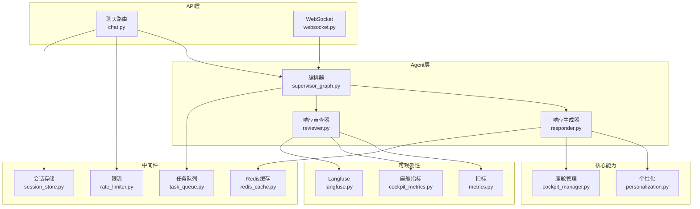
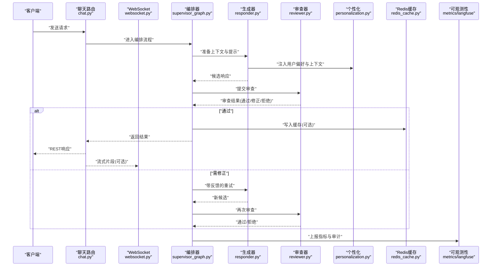
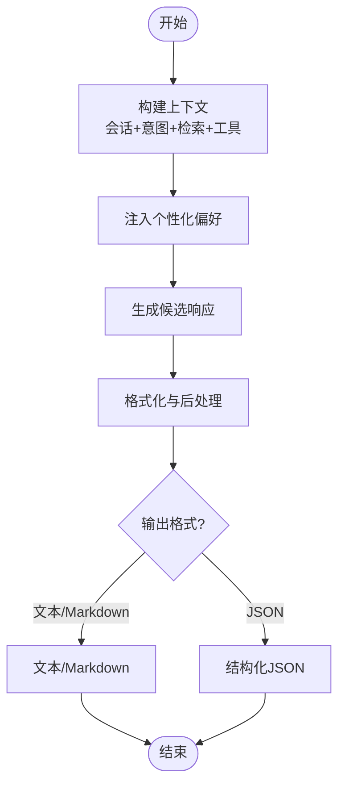
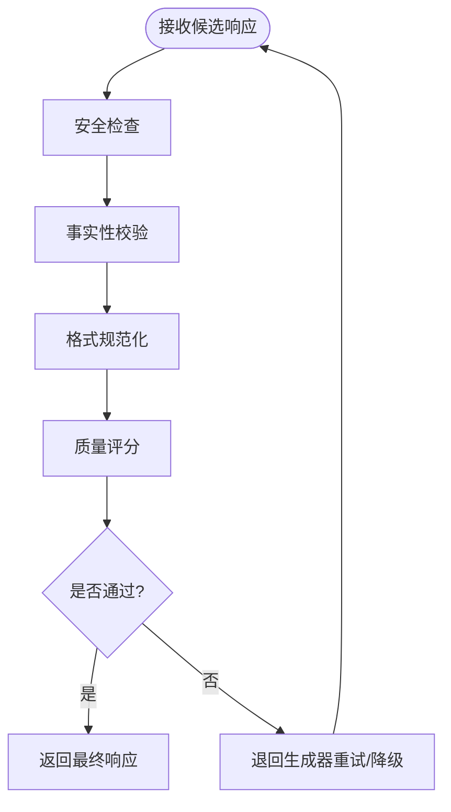
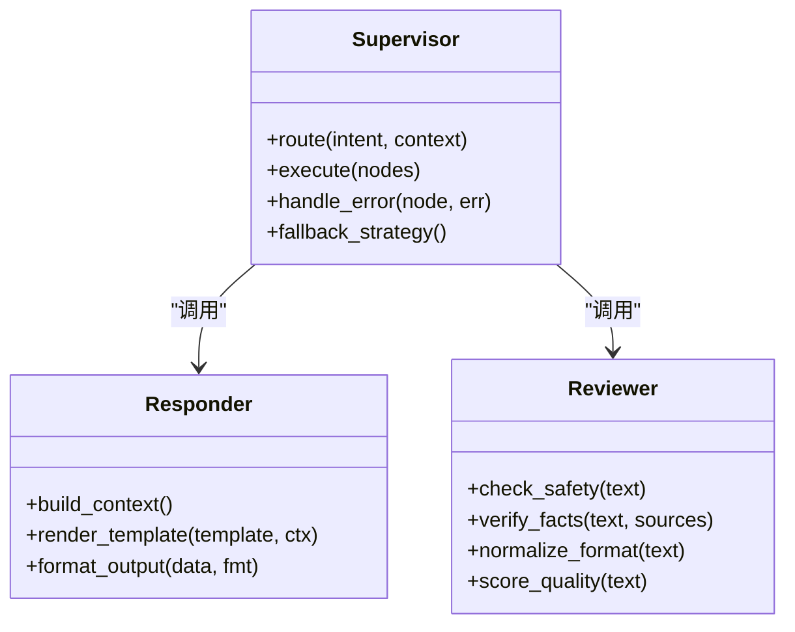
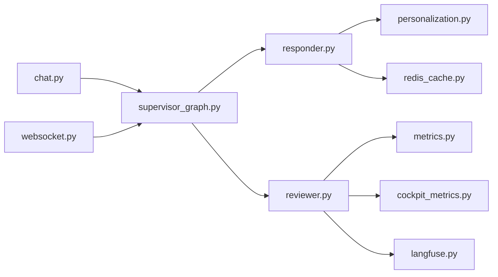

# 响应生成与审查

<cite>
**本文引用的文件**   
- [responder.py](file://backend_design/nexus/agent/responder.py)
- [reviewer.py](file://backend_design/nexus/agent/reviewer.py)
- [supervisor_graph.py](file://backend_design/nexus/agent/supervisor_graph.py)
- [personalization.py](file://backend_design/nexus/core/personalization.py)
- [cockpit_manager.py](file://backend_design/nexus/core/cockpit_manager.py)
- [redis_cache.py](file://backend_design/nexus/middleware/redis_cache.py)
- [chat.py](file://backend_design/nexus/api/routes/chat.py)
- [websocket.py](file://backend_design/nexus/api/websocket.py)
- [schemas.py](file://backend_design/nexus/models/schemas.py)
- [state.py](file://backend_design/nexus/models/state.py)
- [metrics.py](file://backend_design/nexus/observability/metrics.py)
- [cockpit_metrics.py](file://backend_design/nexus/observability/cockpit_metrics.py)
- [langfuse.py](file://backend_design/nexus/observability/langfuse.py)
- [rate_limiter.py](file://backend_design/nexus/middleware/rate_limiter.py)
- [session_store.py](file://backend_design/nexus/middleware/session_store.py)
- [task_queue.py](file://backend_design/nexus/middleware/task_queue.py)
- [config.py](file://backend_design/nexus/config.py)
- [main.py](file://backend_design/nexus/main.py)
</cite>

## 目录
1. [简介](#简介)
2. [项目结构](#项目结构)
3. [核心组件](#核心组件)
4. [架构总览](#架构总览)
5. [详细组件分析](#详细组件分析)
6. [依赖关系分析](#依赖关系分析)
7. [性能考虑](#性能考虑)
8. [故障排查指南](#故障排查指南)
9. [结论](#结论)
10. [附录](#附录)

## 简介
本文件聚焦于 NexusCockpit 的“响应生成与审查”机制，围绕以下目标展开：
- 解释响应生成器的设计原理：模板渲染、动态内容组装、多格式输出支持。
- 说明响应审查器的质量保障机制：内容安全检查、事实性验证、格式规范化。
- 阐述如何结合上下文信息与用户偏好生成个性化回答。
- 提供自定义响应模板与审查规则的可操作指引（以代码片段路径形式）。
- 说明响应缓存策略与流式生成优化。
- 给出响应质量评估指标与 A/B 测试框架建议。

## 项目结构
与响应生成与审查相关的核心模块分布在 agent、core、middleware、models、observability 等子系统中：
- agent：响应生成器 responder、审查器 reviewer、编排 supervisor_graph。
- core：个性化 personalization、会话与状态 cockpit_manager。
- middleware：Redis 缓存 redis_cache、限流 rate_limiter、会话存储 session_store、任务队列 task_queue。
- models：请求/响应数据模型 schemas、状态 state。
- observability：指标 metrics、仪表盘指标 cockpit_metrics、Langfuse 观测 langfuse。
- api：聊天路由 chat、WebSocket 推送 websocket。
- config/main：配置与入口。

图表来源
- [chat.py](file://backend_design/nexus/api/routes/chat.py)
- [websocket.py](file://backend_design/nexus/api/websocket.py)
- [supervisor_graph.py](file://backend_design/nexus/agent/supervisor_graph.py)
- [responder.py](file://backend_design/nexus/agent/responder.py)
- [reviewer.py](file://backend_design/nexus/agent/reviewer.py)
- [personalization.py](file://backend_design/nexus/core/personalization.py)
- [cockpit_manager.py](file://backend_design/nexus/core/cockpit_manager.py)
- [redis_cache.py](file://backend_design/nexus/middleware/redis_cache.py)
- [rate_limiter.py](file://backend_design/nexus/middleware/rate_limiter.py)
- [session_store.py](file://backend_design/nexus/middleware/session_store.py)
- [task_queue.py](file://backend_design/nexus/middleware/task_queue.py)
- [metrics.py](file://backend_design/nexus/observability/metrics.py)
- [cockpit_metrics.py](file://backend_design/nexus/observability/cockpit_metrics.py)
- [langfuse.py](file://backend_design/nexus/observability/langfuse.py)

章节来源
- [main.py](file://backend_design/nexus/main.py)
- [config.py](file://backend_design/nexus/config.py)

## 核心组件
- 响应生成器（responder）：负责将意图、检索结果、工具调用结果与用户上下文组合为最终文本/结构化内容；支持多种输出格式（如纯文本、Markdown、JSON 等），并可根据用户偏好进行风格化调整。
- 响应审查器（reviewer）：对生成内容进行安全合规检查、事实一致性校验、格式规范化与长度控制，必要时触发重写或降级策略。
- 编排器（supervisor_graph）：协调意图识别、检索、工具执行、生成与审查的全流程，决定是否需要重试、回退或并行处理。
- 个性化（personalization）：读取用户画像、历史交互与设备上下文，注入到提示词或后处理阶段，实现个性化回答。
- 缓存（redis_cache）：基于请求指纹与上下文哈希命中缓存，减少重复计算与 LLM 调用成本。
- 可观测性（metrics, cockpit_metrics, langfuse）：记录延迟、吞吐、错误率、质量评分与审计轨迹，支撑 A/B 实验与持续改进。

章节来源
- [responder.py](file://backend_design/nexus/agent/responder.py)
- [reviewer.py](file://backend_design/nexus/agent/reviewer.py)
- [supervisor_graph.py](file://backend_design/nexus/agent/supervisor_graph.py)
- [personalization.py](file://backend_design/nexus/core/personalization.py)
- [redis_cache.py](file://backend_design/nexus/middleware/redis_cache.py)
- [metrics.py](file://backend_design/nexus/observability/metrics.py)
- [cockpit_metrics.py](file://backend_design/nexus/observability/cockpit_metrics.py)
- [langfuse.py](file://backend_design/nexus/observability/langfuse.py)

## 架构总览
端到端响应生成与审查的关键路径如下：
- 客户端通过 REST 或 WebSocket 发起请求。
- 路由层进行鉴权、限流与会话加载。
- 编排器调度检索、工具与生成节点。
- 生成器产出候选响应，审查器进行多维校验。
- 通过后写入缓存、返回结果，并通过 WebSocket 推送增量片段（若启用流式）。
- 全链路埋点上报指标与审计日志。

图表来源
- [chat.py](file://backend_design/nexus/api/routes/chat.py)
- [websocket.py](file://backend_design/nexus/api/websocket.py)
- [supervisor_graph.py](file://backend_design/nexus/agent/supervisor_graph.py)
- [responder.py](file://backend_design/nexus/agent/responder.py)
- [reviewer.py](file://backend_design/nexus/agent/reviewer.py)
- [personalization.py](file://backend_design/nexus/core/personalization.py)
- [redis_cache.py](file://backend_design/nexus/middleware/redis_cache.py)
- [metrics.py](file://backend_design/nexus/observability/metrics.py)
- [langfuse.py](file://backend_design/nexus/observability/langfuse.py)

## 详细组件分析

### 响应生成器（responder）
- 设计要点
  - 模板渲染：根据场景选择模板（如对话、导航、健康建议），将检索到的知识、工具输出与系统提示组合成统一输入。
  - 动态内容组装：按用户偏好（语言、语气、长度、是否包含表格/列表）动态拼装段落与结构。
  - 多格式输出：支持文本、Markdown、结构化 JSON 等，便于前端渲染与语音合成。
  - 个性化注入：从 personalization 获取用户画像、历史摘要、设备状态，影响措辞与推荐优先级。
- 关键流程
  - 构建上下文：会话历史、当前意图、RAG 检索结果、工具调用结果。
  - 生成候选：调用 LLM 或本地引擎，产出初始响应。
  - 后处理：格式化、去重、敏感信息脱敏、长度裁剪。
- 自定义指引
  - 新增模板：在生成器中注册新的模板类型，并在编排器中按意图路由至对应模板。
  - 扩展输出格式：在输出序列化处增加新格式处理器，并在 schema 中声明字段。
  - 个性化开关：在 personalization 中扩展偏好项，并在生成器中按需注入。

图表来源
- [responder.py](file://backend_design/nexus/agent/responder.py)
- [personalization.py](file://backend_design/nexus/core/personalization.py)
- [schemas.py](file://backend_design/nexus/models/schemas.py)

章节来源
- [responder.py](file://backend_design/nexus/agent/responder.py)
- [personalization.py](file://backend_design/nexus/core/personalization.py)
- [schemas.py](file://backend_design/nexus/models/schemas.py)

### 响应审查器（reviewer）
- 质量保障机制
  - 内容安全检查：过滤违规、敏感、隐私泄露内容；检测不当链接与外部引用。
  - 事实性验证：对比 RAG 检索结果与生成内容的一致性，标记不确定信息，必要时触发追问或降级。
  - 格式规范化：确保 Markdown/JSON 合法、长度可控、标点与术语规范。
  - 可观测与审计：记录审查决策、修改痕迹与置信度，供后续分析与 A/B 评估。
- 审查流程
  - 输入候选响应与上下文元数据。
  - 逐条规则扫描与安全模型打分。
  - 自动修复（如格式修正、敏感词替换）或退回生成器重试。
  - 输出审查报告与最终版本。

图表来源
- [reviewer.py](file://backend_design/nexus/agent/reviewer.py)
- [metrics.py](file://backend_design/nexus/observability/metrics.py)
- [cockpit_metrics.py](file://backend_design/nexus/observability/cockpit_metrics.py)
- [langfuse.py](file://backend_design/nexus/observability/langfuse.py)

章节来源
- [reviewer.py](file://backend_design/nexus/agent/reviewer.py)
- [metrics.py](file://backend_design/nexus/observability/metrics.py)
- [cockpit_metrics.py](file://backend_design/nexus/observability/cockpit_metrics.py)
- [langfuse.py](file://backend_design/nexus/observability/langfuse.py)

### 编排器（supervisor_graph）
- 职责
  - 编排意图识别、检索、工具调用、生成与审查的节点顺序与条件分支。
  - 处理并发与超时，决定重试、回退与降级策略。
  - 维护状态机，记录各阶段耗时与错误码，驱动可观测性上报。
- 与生成/审查的协作
  - 向生成器传递结构化上下文与模板选择。
  - 将审查结果反馈给生成器进行定向修正。
  - 在失败路径上切换轻量模型或模板化答案。

图表来源
- [supervisor_graph.py](file://backend_design/nexus/agent/supervisor_graph.py)
- [responder.py](file://backend_design/nexus/agent/responder.py)
- [reviewer.py](file://backend_design/nexus/agent/reviewer.py)

章节来源
- [supervisor_graph.py](file://backend_design/nexus/agent/supervisor_graph.py)

### 个性化（personalization）
- 数据来源
  - 用户画像（语言、风格、兴趣标签）、历史摘要、设备与环境上下文。
- 使用方式
  - 在提示词中注入偏好约束（如“简洁”、“专业”、“口语化”）。
  - 在后处理阶段调整输出结构与长度。
- 扩展点
  - 新增偏好维度与权重策略，支持 A/B 分组与在线学习。

章节来源
- [personalization.py](file://backend_design/nexus/core/personalization.py)
- [cockpit_manager.py](file://backend_design/nexus/core/cockpit_manager.py)

### 缓存与流式生成
- 缓存策略（redis_cache）
  - 键设计：基于请求指纹（用户ID、意图、查询摘要、时间窗口）与上下文哈希。
  - 过期与失效：TTL 控制、热点更新、写扩散失效。
  - 命中率监控：统计缓存命中/未命中比率与节省的 LLM 调用次数。
- 流式生成（websocket）
  - 分片推送：按句子或语义单元逐步推送，降低首字延迟。
  - 背压与重试：网络抖动时缓冲与重传，保证顺序与完整性。
  - 与审查协同：先快速返回草稿，再异步完成深度审查与修正。

章节来源
- [redis_cache.py](file://backend_design/nexus/middleware/redis_cache.py)
- [websocket.py](file://backend_design/nexus/api/websocket.py)

### 数据模型与状态
- 数据模型（schemas）
  - 定义请求参数、响应体、审查报告、个性化偏好等结构。
- 状态（state）
  - 维护会话状态、生成阶段、审查结果、缓存键等信息。

章节来源
- [schemas.py](file://backend_design/nexus/models/schemas.py)
- [state.py](file://backend_design/nexus/models/state.py)

## 依赖关系分析
- 组件耦合
  - 编排器强依赖生成器与审查器；生成器依赖个性化与缓存；审查器依赖可观测性。
- 外部依赖
  - Redis 用于缓存与会话持久化；WebSocket 用于实时推送；Langfuse 用于追踪与审计。
- 潜在循环
  - 生成器与审查器之间通过编排器解耦，避免直接相互导入导致的循环依赖。

图表来源
- [chat.py](file://backend_design/nexus/api/routes/chat.py)
- [websocket.py](file://backend_design/nexus/api/websocket.py)
- [supervisor_graph.py](file://backend_design/nexus/agent/supervisor_graph.py)
- [responder.py](file://backend_design/nexus/agent/responder.py)
- [reviewer.py](file://backend_design/nexus/agent/reviewer.py)
- [personalization.py](file://backend_design/nexus/core/personalization.py)
- [redis_cache.py](file://backend_design/nexus/middleware/redis_cache.py)
- [metrics.py](file://backend_design/nexus/observability/metrics.py)
- [cockpit_metrics.py](file://backend_design/nexus/observability/cockpit_metrics.py)
- [langfuse.py](file://backend_design/nexus/observability/langfuse.py)

章节来源
- [supervisor_graph.py](file://backend_design/nexus/agent/supervisor_graph.py)
- [responder.py](file://backend_design/nexus/agent/responder.py)
- [reviewer.py](file://backend_design/nexus/agent/reviewer.py)

## 性能考虑
- 缓存优先：对高频问答与静态知识启用缓存，显著降低 LLM 调用与延迟。
- 流式输出：采用分片推送提升用户体验，首字节时间更短。
- 并发与批处理：在编排器中对独立节点（如检索、工具调用）并行执行。
- 降级策略：当 LLM 不可用或超时，回退到模板化答案或本地规则引擎。
- 资源隔离：不同租户/会话使用独立缓存键空间与会话存储，避免干扰。

[本节为通用指导，不直接分析具体文件]

## 故障排查指南
- 常见问题定位
  - 审查失败：查看审查器日志与质量评分，确认是否触发了安全或事实性规则。
  - 缓存未命中：核对缓存键构造逻辑与 TTL，检查 Redis 连接与健康状况。
  - 流式中断：检查 WebSocket 心跳与背压策略，确认服务端推送队列是否积压。
  - 个性化异常：确认用户画像加载与偏好注入是否成功，必要时回退默认策略。
- 可观测性辅助
  - 使用指标面板观察延迟分布、错误率与缓存命中率。
  - 通过 Langfuse 追踪单次请求的完整链路，定位瓶颈与问题节点。

章节来源
- [reviewer.py](file://backend_design/nexus/agent/reviewer.py)
- [redis_cache.py](file://backend_design/nexus/middleware/redis_cache.py)
- [websocket.py](file://backend_design/nexus/api/websocket.py)
- [metrics.py](file://backend_design/nexus/observability/metrics.py)
- [cockpit_metrics.py](file://backend_design/nexus/observability/cockpit_metrics.py)
- [langfuse.py](file://backend_design/nexus/observability/langfuse.py)

## 结论
NexusCockpit 的响应生成与审查机制通过编排器统一调度，结合个性化注入、模板渲染与多格式输出，实现了高质量、可定制且可扩展的回答生产流程。审查器在安全、事实性与格式层面提供严格的质量保障，配合缓存与流式优化显著提升性能与体验。借助完善的可观测性与 A/B 实验框架，团队可以持续评估与改进响应质量。

[本节为总结，不直接分析具体文件]

## 附录

### 自定义响应模板与审查规则（操作指引）
- 自定义模板
  - 在生成器中注册新模板类型，并在编排器中按意图路由。
  - 在输出序列化处增加新格式处理器，并在数据模型中声明字段。
  - 参考路径：
    - [responder.py](file://backend_design/nexus/agent/responder.py)
    - [schemas.py](file://backend_design/nexus/models/schemas.py)
- 自定义审查规则
  - 在审查器中添加规则函数（安全、事实性、格式），并接入质量评分与审计上报。
  - 参考路径：
    - [reviewer.py](file://backend_design/nexus/agent/reviewer.py)
    - [metrics.py](file://backend_design/nexus/observability/metrics.py)
    - [langfuse.py](file://backend_design/nexus/observability/langfuse.py)

### 响应质量评估指标与 A/B 测试框架
- 评估指标
  - 安全性：违规内容比例、敏感信息泄露率。
  - 事实性：与检索源一致的比例、不确定信息标注率。
  - 格式：Markdown/JSON 合法性、长度与可读性评分。
  - 性能：首字节延迟、端到端延迟、缓存命中率、错误率。
- A/B 测试
  - 分组策略：按用户 ID 或会话 ID 分流，比较不同模板/规则的效果。
  - 数据采集：通过 Langfuse 记录每次实验的输入、输出与评分。
  - 决策依据：综合质量与性能指标，择优上线并持续监控。

章节来源
- [reviewer.py](file://backend_design/nexus/agent/reviewer.py)
- [metrics.py](file://backend_design/nexus/observability/metrics.py)
- [cockpit_metrics.py](file://backend_design/nexus/observability/cockpit_metrics.py)
- [langfuse.py](file://backend_design/nexus/observability/langfuse.py)