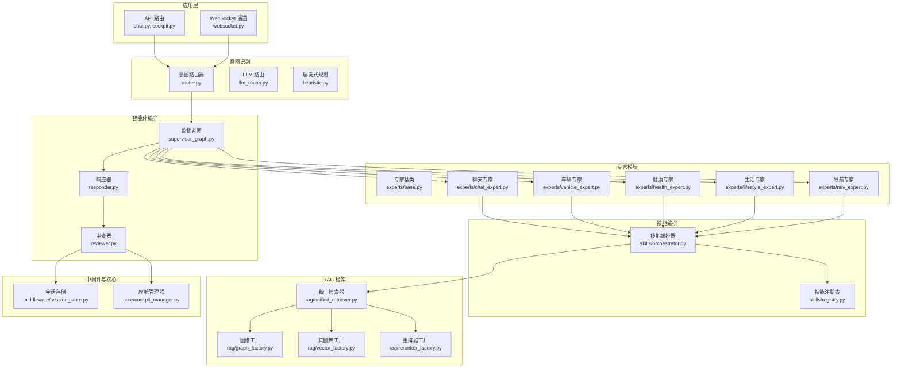
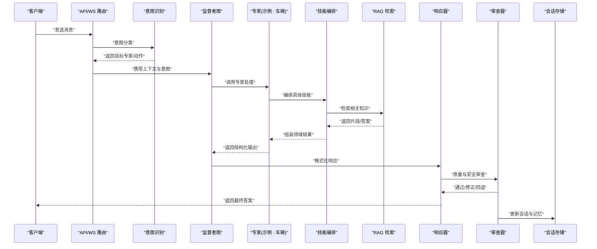
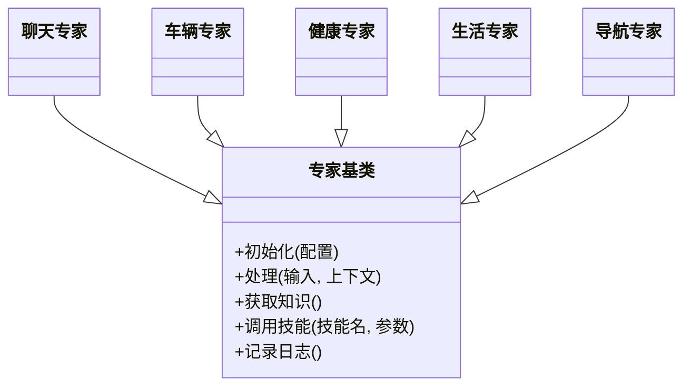
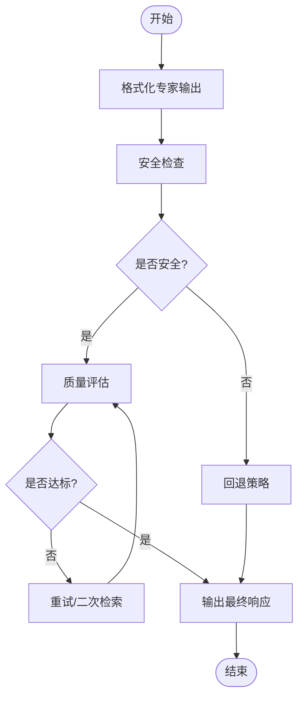
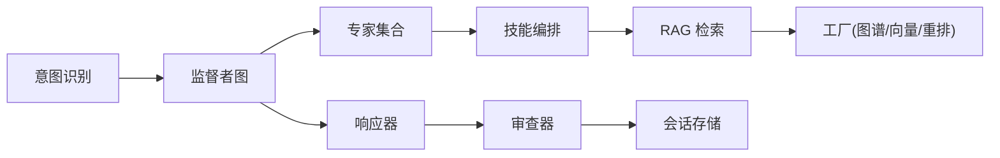

# 多专家AI助手系统

<cite>
**本文引用的文件**   
- [supervisor_graph.py](file://backend_design/nexus/agent/supervisor_graph.py)
- [responder.py](file://backend_design/nexus/agent/responder.py)
- [reviewer.py](file://backend_design/nexus/agent/reviewer.py)
- [base.py](file://backend_design/nexus/agent/experts/base.py)
- [chat_expert.py](file://backend_design/nexus/agent/experts/chat_expert.py)
- [vehicle_expert.py](file://backend_design/nexus/agent/experts/vehicle_expert.py)
- [health_expert.py](file://backend_design/nexus/agent/experts/health_expert.py)
- [lifestyle_expert.py](file://backend_design/nexus/agent/experts/lifestyle_expert.py)
- [nav_expert.py](file://backend_design/nexus/agent/experts/nav_expert.py)
- [router.py](file://backend_design/nexus/intent/router.py)
- [llm_router.py](file://backend_design/nexus/intent/llm_router.py)
- [heuristic.py](file://backend_design/nexus/intent/heuristic.py)
- [session_store.py](file://backend_design/nexus/middleware/session_store.py)
- [cockpit_manager.py](file://backend_design/nexus/core/cockpit_manager.py)
- [main.py](file://backend_design/nexus/main.py)
- [orchestrator.py](file://backend_design/nexus/skills/orchestrator.py)
- [registry.py](file://backend_design/nexus/skills/registry.py)
- [unified_retriever.py](file://backend_design/nexus/rag/unified_retriever.py)
- [graph_factory.py](file://backend_design/nexus/rag/graph_factory.py)
- [vector_factory.py](file://backend_design/nexus/rag/vector_factory.py)
- [reranker_factory.py](file://backend_design/nexus/rag/reranker_factory.py)
</cite>

## 目录
1. [简介](#简介)
2. [项目结构](#项目结构)
3. [核心组件](#核心组件)
4. [架构总览](#架构总览)
5. [详细组件分析](#详细组件分析)
6. [依赖关系分析](#依赖关系分析)
7. [性能考虑](#性能考虑)
8. [故障排查指南](#故障排查指南)
9. [结论](#结论)
10. [附录](#附录)

## 简介
本文件面向NexusCockpit的多专家AI助手系统，系统性阐述其“监督者图(Supervisor Graph)”协调机制、意图识别路由、专家模块职责划分、响应生成与审查流程、上下文管理策略，以及扩展新专家的实践方法。文档同时提供架构图、时序图与流程图，帮助读者从高层到代码级全面理解系统设计与实现要点，并给出性能优化建议与常见问题的排查路径。

## 项目结构
后端核心位于 backend_design/nexus 下，围绕 agent（智能体编排）、intent（意图识别）、skills（技能编排）、rag（检索增强）、middleware（会话与缓存）、core（通用能力）等分层组织。多专家系统的入口由主服务装配，经由意图路由将请求分派至监督者图，再由监督者图调度各专家完成处理，最终经响应器与审查器输出结果。

图表来源
- [main.py:1-200](file://backend_design/nexus/main.py#L1-L200)
- [supervisor_graph.py:1-200](file://backend_design/nexus/agent/supervisor_graph.py#L1-L200)
- [responder.py:1-200](file://backend_design/nexus/agent/responder.py#L1-L200)
- [reviewer.py:1-200](file://backend_design/nexus/agent/reviewer.py#L1-L200)
- [router.py:1-200](file://backend_design/nexus/intent/router.py#L1-L200)
- [llm_router.py:1-200](file://backend_design/nexus/intent/llm_router.py#L1-L200)
- [heuristic.py:1-200](file://backend_design/nexus/intent/heuristic.py#L1-200)
- [base.py:1-200](file://backend_design/nexus/agent/experts/base.py#L1-L200)
- [chat_expert.py:1-200](file://backend_design/nexus/agent/experts/chat_expert.py#L1-L200)
- [vehicle_expert.py:1-200](file://backend_design/nexus/agent/experts/vehicle_expert.py#L1-L200)
- [health_expert.py:1-200](file://backend_design/nexus/agent/experts/health_expert.py#L1-L200)
- [lifestyle_expert.py:1-200](file://backend_design/nexus/agent/experts/lifestyle_expert.py#L1-L200)
- [nav_expert.py:1-200](file://backend_design/nexus/agent/experts/nav_expert.py#L1-L200)
- [orchestrator.py:1-200](file://backend_design/nexus/skills/orchestrator.py#L1-L200)
- [registry.py:1-200](file://backend_design/nexus/skills/registry.py#L1-L200)
- [unified_retriever.py:1-200](file://backend_design/nexus/rag/unified_retriever.py#L1-L200)
- [graph_factory.py:1-200](file://backend_design/nexus/rag/graph_factory.py#L1-L200)
- [vector_factory.py:1-200](file://backend_design/nexus/rag/vector_factory.py#L1-L200)
- [reranker_factory.py:1-200](file://backend_design/nexus/rag/reranker_factory.py#L1-L200)
- [session_store.py:1-200](file://backend_design/nexus/middleware/session_store.py#L1-L200)
- [cockpit_manager.py:1-200](file://backend_design/nexus/core/cockpit_manager.py#L1-L200)

章节来源
- [main.py:1-200](file://backend_design/nexus/main.py#L1-L200)

## 核心组件
- 监督者图：负责解析用户输入、维护对话状态、选择并编排专家执行、聚合结果并触发后续审查与记忆更新。
- 意图识别：结合启发式规则与LLM路由，将请求分类为不同领域或动作，决定进入哪个专家或子流程。
- 专家模块：按领域划分，如聊天、车辆、健康、生活、导航等，各自封装领域知识与工具调用。
- 响应器与审查器：对专家输出进行格式化、安全与质量校验，必要时回退或修正。
- 技能编排与注册：在专家内部通过技能编排器组合具体技能，并通过注册表动态发现与加载。
- RAG检索：统一检索接口对接图谱、向量库与重排器，提升回答准确性与可解释性。
- 会话与上下文：持久化会话历史、偏好与短期记忆，支撑多轮连贯对话。

章节来源
- [supervisor_graph.py:1-200](file://backend_design/nexus/agent/supervisor_graph.py#L1-L200)
- [router.py:1-200](file://backend_design/nexus/intent/router.py#L1-L200)
- [llm_router.py:1-200](file://backend_design/nexus/intent/llm_router.py#L1-L200)
- [heuristic.py:1-200](file://backend_design/nexus/intent/heuristic.py#L1-200)
- [base.py:1-200](file://backend_design/nexus/agent/experts/base.py#L1-L200)
- [responder.py:1-200](file://backend_design/nexus/agent/responder.py#L1-L200)
- [reviewer.py:1-200](file://backend_design/nexus/agent/reviewer.py#L1-L200)
- [orchestrator.py:1-200](file://backend_design/nexus/skills/orchestrator.py#L1-L200)
- [registry.py:1-200](file://backend_design/nexus/skills/registry.py#L1-L200)
- [unified_retriever.py:1-200](file://backend_design/nexus/rag/unified_retriever.py#L1-L200)
- [graph_factory.py:1-200](file://backend_design/nexus/rag/graph_factory.py#L1-L200)
- [vector_factory.py:1-200](file://backend_design/nexus/rag/vector_factory.py#L1-L200)
- [reranker_factory.py:1-200](file://backend_design/nexus/rag/reranker_factory.py#L1-L200)
- [session_store.py:1-200](file://backend_design/nexus/middleware/session_store.py#L1-L200)

## 架构总览
下图展示一次典型的用户请求从接入到输出的端到端流程，包括意图识别、监督者图编排、专家执行、RAG检索、响应生成与审查、上下文更新等环节。

图表来源
- [main.py:1-200](file://backend_design/nexus/main.py#L1-L200)
- [router.py:1-200](file://backend_design/nexus/intent/router.py#L1-L200)
- [supervisor_graph.py:1-200](file://backend_design/nexus/agent/supervisor_graph.py#L1-L200)
- [vehicle_expert.py:1-200](file://backend_design/nexus/agent/experts/vehicle_expert.py#L1-L200)
- [orchestrator.py:1-200](file://backend_design/nexus/skills/orchestrator.py#L1-L200)
- [unified_retriever.py:1-200](file://backend_design/nexus/rag/unified_retriever.py#L1-L200)
- [responder.py:1-200](file://backend_design/nexus/agent/responder.py#L1-L200)
- [reviewer.py:1-200](file://backend_design/nexus/agent/reviewer.py#L1-L200)
- [session_store.py:1-200](file://backend_design/nexus/middleware/session_store.py#L1-L200)

## 详细组件分析

### 监督者图(Supervisor Graph)
- 职责：接收带上下文的请求，依据意图与当前会话状态选择专家；编排并行或串行执行；合并结果；驱动审查与记忆更新。
- 关键设计点：
  - 状态机式流转：解析→路由→执行→聚合→审查→更新。
  - 可扩展的节点：新增专家只需注册并在图中添加边与条件分支。
  - 错误隔离：单个专家失败不影响整体流程，支持回退策略。
- 扩展建议：
  - 在图中增加新的专家节点与条件边。
  - 定义专家间的数据契约，确保聚合逻辑稳定。

章节来源
- [supervisor_graph.py:1-200](file://backend_design/nexus/agent/supervisor_graph.py#L1-L200)

### 意图识别机制
- 组成：
  - 启发式规则：基于关键词、正则、白名单快速匹配，适合高频、确定性场景。
  - LLM路由：利用大模型进行语义理解与分类，适合复杂、模糊意图。
- 路由策略：
  - 先启发式后LLM，兼顾速度与准确率。
  - 返回目标专家标识与必要参数，供监督者图使用。
- 配置与调优：
  - 规则优先级与阈值可调。
  - LLM路由可切换模型与提示模板。

章节来源
- [router.py:1-200](file://backend_design/nexus/intent/router.py#L1-L200)
- [heuristic.py:1-200](file://backend_design/nexus/intent/heuristic.py#L1-200)
- [llm_router.py:1-200](file://backend_design/nexus/intent/llm_router.py#L1-200)

### 专家模块与职责分工
- 聊天专家：负责闲聊、情感陪伴、通用问答，结合记忆与个性化偏好。
- 车辆专家：负责车辆控制、状态查询、诊断建议，调用车辆技能与设备接口。
- 健康专家：负责健康咨询、指标解读、生活方式建议，结合知识库与检索增强。
- 生活专家：日程、提醒、习惯养成、兴趣推荐等生活服务。
- 导航专家：路线规划、POI搜索、实时路况与语音播报。
- 共同特性：
  - 继承自专家基类，统一输入输出契约。
  - 内部通过技能编排器组合具体功能。
  - 可选启用RAG检索以提升准确性。

章节来源
- [base.py:1-200](file://backend_design/nexus/agent/experts/base.py#L1-L200)
- [chat_expert.py:1-200](file://backend_design/nexus/agent/experts/chat_expert.py#L1-L200)
- [vehicle_expert.py:1-200](file://backend_design/nexus/agent/experts/vehicle_expert.py#L1-L200)
- [health_expert.py:1-200](file://backend_design/nexus/agent/experts/health_expert.py#L1-L200)
- [lifestyle_expert.py:1-200](file://backend_design/nexus/agent/experts/lifestyle_expert.py#L1-L200)
- [nav_expert.py:1-200](file://backend_design/nexus/agent/experts/nav_expert.py#L1-L200)

#### 面向对象结构（专家体系）

图表来源
- [base.py:1-200](file://backend_design/nexus/agent/experts/base.py#L1-L200)
- [chat_expert.py:1-200](file://backend_design/nexus/agent/experts/chat_expert.py#L1-L200)
- [vehicle_expert.py:1-200](file://backend_design/nexus/agent/experts/vehicle_expert.py#L1-L200)
- [health_expert.py:1-200](file://backend_design/nexus/agent/experts/health_expert.py#L1-L200)
- [lifestyle_expert.py:1-200](file://backend_design/nexus/agent/experts/lifestyle_expert.py#L1-L200)
- [nav_expert.py:1-200](file://backend_design/nexus/agent/experts/nav_expert.py#L1-L200)

### 响应生成与审查机制
- 响应器：
  - 将专家的结构化输出转换为前端/语音友好的格式。
  - 填充占位符、渲染卡片、拼接富文本。
- 审查器：
  - 安全检查：敏感词过滤、越权访问拦截。
  - 质量评估：完整性、一致性、相关性打分。
  - 回退策略：当评分低于阈值时，采用默认回答或二次检索。
- 输出：
  - 标准化响应对象，包含内容、元数据、审计信息。

章节来源
- [responder.py:1-200](file://backend_design/nexus/agent/responder.py#L1-L200)
- [reviewer.py:1-200](file://backend_design/nexus/agent/reviewer.py#L1-L200)

#### 审查流程（流程图）

图表来源
- [reviewer.py:1-200](file://backend_design/nexus/agent/reviewer.py#L1-L200)
- [responder.py:1-200](file://backend_design/nexus/agent/responder.py#L1-L200)

### 上下文管理与多轮对话
- 会话存储：
  - 保存用户ID、会话ID、历史消息、偏好设置、短期记忆。
  - 支持增量更新与过期清理。
- 上下文注入：
  - 每次请求携带最近N条消息与摘要，减少上下文长度。
  - 个性化信息（姓名、偏好、禁忌）作为系统提示的一部分。
- 记忆提取：
  - 从对话中抽取事实与偏好，写入长期记忆，供后续专家使用。

章节来源
- [session_store.py:1-200](file://backend_design/nexus/middleware/session_store.py#L1-L200)
- [cockpit_manager.py:1-200](file://backend_design/nexus/core/cockpit_manager.py#L1-L200)

### 技能编排与注册
- 编排器：
  - 根据专家需求动态组合多个技能（如空调、媒体、座椅、车窗）。
  - 支持顺序、并行、条件分支等编排模式。
- 注册表：
  - 集中管理可用技能，支持热插拔与版本兼容。
  - 提供描述、参数校验、权限控制等元数据。

章节来源
- [orchestrator.py:1-200](file://backend_design/nexus/skills/orchestrator.py#L1-L200)
- [registry.py:1-200](file://backend_design/nexus/skills/registry.py#L1-L200)

### RAG检索与知识增强
- 统一检索器：
  - 屏蔽底层差异，提供一致的检索接口。
  - 支持混合检索（图谱+向量），并按需重排。
- 工厂模式：
  - 图谱工厂、向量库工厂、重排器工厂按需创建实例。
  - 便于替换实现与A/B测试。

章节来源
- [unified_retriever.py:1-200](file://backend_design/nexus/rag/unified_retriever.py#L1-L200)
- [graph_factory.py:1-200](file://backend_design/nexus/rag/graph_factory.py#L1-L200)
- [vector_factory.py:1-200](file://backend_design/nexus/rag/vector_factory.py#L1-L200)
- [reranker_factory.py:1-200](file://backend_design/nexus/rag/reranker_factory.py#L1-L200)

### 扩展新专家模块的实践步骤
- 步骤概览：
  1) 新建专家类，继承专家基类，实现处理逻辑与知识获取。
  2) 在专家内部通过技能编排器组合所需技能。
  3) 在意图识别中添加规则或LLM路由映射，指向新专家。
  4) 在监督者图中注册新节点与路由边。
  5) 编写单元测试与集成测试，覆盖正常与异常路径。
  6) 上线灰度观察指标，逐步放量。
- 参考路径：
  - 专家基类与现有专家实现：[base.py](file://backend_design/nexus/agent/experts/base.py), [vehicle_expert.py](file://backend_design/nexus/agent/experts/vehicle_expert.py)
  - 意图路由与规则：[router.py](file://backend_design/nexus/intent/router.py), [heuristic.py](file://backend_design/nexus/intent/heuristic.py), [llm_router.py](file://backend_design/nexus/intent/llm_router.py)
  - 监督者图编排：[supervisor_graph.py](file://backend_design/nexus/agent/supervisor_graph.py)
  - 技能编排与注册：[orchestrator.py](file://backend_design/nexus/skills/orchestrator.py), [registry.py](file://backend_design/nexus/skills/registry.py)

章节来源
- [base.py:1-200](file://backend_design/nexus/agent/experts/base.py#L1-L200)
- [vehicle_expert.py:1-200](file://backend_design/nexus/agent/experts/vehicle_expert.py#L1-L200)
- [router.py:1-200](file://backend_design/nexus/intent/router.py#L1-L200)
- [heuristic.py:1-200](file://backend_design/nexus/intent/heuristic.py#L1-200)
- [llm_router.py:1-200](file://backend_design/nexus/intent/llm_router.py#L1-200)
- [supervisor_graph.py:1-200](file://backend_design/nexus/agent/supervisor_graph.py#L1-L200)
- [orchestrator.py:1-200](file://backend_design/nexus/skills/orchestrator.py#L1-L200)
- [registry.py:1-200](file://backend_design/nexus/skills/registry.py#L1-L200)

## 依赖关系分析
- 低耦合高内聚：
  - 专家之间不直接依赖，通过监督者图与统一契约协作。
  - 意图识别与专家解耦，便于替换路由策略。
- 外部依赖：
  - RAG检索依赖图谱与向量库，通过工厂抽象屏蔽差异。
  - 会话存储可能依赖Redis或数据库，通过中间件抽象。
- 潜在循环依赖：
  - 避免专家直接引用监督者图，防止环状依赖。
  - 通过事件或回调机制解耦。

图表来源
- [router.py:1-200](file://backend_design/nexus/intent/router.py#L1-L200)
- [supervisor_graph.py:1-200](file://backend_design/nexus/agent/supervisor_graph.py#L1-L200)
- [orchestrator.py:1-200](file://backend_design/nexus/skills/orchestrator.py#L1-L200)
- [unified_retriever.py:1-200](file://backend_design/nexus/rag/unified_retriever.py#L1-L200)
- [graph_factory.py:1-200](file://backend_design/nexus/rag/graph_factory.py#L1-L200)
- [vector_factory.py:1-200](file://backend_design/nexus/rag/vector_factory.py#L1-L200)
- [reranker_factory.py:1-200](file://backend_design/nexus/rag/reranker_factory.py#L1-L200)
- [responder.py:1-200](file://backend_design/nexus/agent/responder.py#L1-L200)
- [reviewer.py:1-200](file://backend_design/nexus/agent/reviewer.py#L1-L200)
- [session_store.py:1-200](file://backend_design/nexus/middleware/session_store.py#L1-L200)

章节来源
- [supervisor_graph.py:1-200](file://backend_design/nexus/agent/supervisor_graph.py#L1-L200)
- [router.py:1-200](file://backend_design/nexus/intent/router.py#L1-L200)
- [orchestrator.py:1-200](file://backend_design/nexus/skills/orchestrator.py#L1-L200)
- [unified_retriever.py:1-200](file://backend_design/nexus/rag/unified_retriever.py#L1-L200)

## 性能考虑
- 意图识别优化：
  - 优先启发式规则命中，降低LLM调用成本。
  - 缓存热门意图与路由结果。
- 专家执行优化：
  - 并行调用独立专家或技能，缩短端到端延迟。
  - 超时与熔断保护，避免雪崩。
- RAG检索优化：
  - 向量索引预构建与定期重建。
  - 重排器批量处理，减少模型切换开销。
- 响应与审查优化：
  - 流式输出，提高首字节时间。
  - 审查规则向量化或本地化，减少远程依赖。
- 上下文管理优化：
  - 压缩历史消息，保留关键摘要。
  - 会话数据冷热分离，热点会话常驻内存。

## 故障排查指南
- 常见问题定位：
  - 意图误判：检查启发式规则与LLM路由配置，查看日志中的意图分类结果。
  - 专家执行失败：确认专家输入契约与技能权限，查看错误码与堆栈。
  - RAG检索无结果：验证索引状态、查询语句与相似度阈值。
  - 审查回退频繁：调整安全阈值与质量评分权重。
- 监控与观测：
  - 关键指标：意图命中率、专家成功率、检索召回率、审查通过率、端到端延迟。
  - 链路追踪：为每个请求分配唯一ID，贯穿意图、专家、RAG、审查环节。
- 恢复策略：
  - 降级：关闭非核心技能或RAG，仅使用规则与缓存。
  - 回退：切换到备用模型或默认回答。
  - 限流：对高负载专家实施速率限制。

章节来源
- [reviewer.py:1-200](file://backend_design/nexus/agent/reviewer.py#L1-L200)
- [responder.py:1-200](file://backend_design/nexus/agent/responder.py#L1-L200)
- [unified_retriever.py:1-200](file://backend_design/nexus/rag/unified_retriever.py#L1-L200)
- [session_store.py:1-200](file://backend_design/nexus/middleware/session_store.py#L1-L200)

## 结论
多专家AI助手系统通过监督者图统一编排、意图识别精准路由、专家模块化职责清晰、响应与审查双重保障、RAG知识增强与会话上下文管理，实现了高可用、可扩展、高质量的对话体验。遵循本文档的设计与实践建议，可高效扩展新专家、优化性能并快速定位问题。

## 附录
- 术语说明：
  - 监督者图：以图结构表达任务编排与流转的智能体控制器。
  - 意图识别：对用户输入进行分类与动作决策的过程。
  - 专家：具备特定领域能力的处理单元。
  - 技能：可被编排的具体功能模块。
  - RAG：检索增强生成，结合外部知识提升回答质量。
- 参考路径：
  - 主服务入口与装配：[main.py](file://backend_design/nexus/main.py)
  - 专家与编排：[supervisor_graph.py](file://backend_design/nexus/agent/supervisor_graph.py), [base.py](file://backend_design/nexus/agent/experts/base.py)
  - 意图与路由：[router.py](file://backend_design/nexus/intent/router.py), [heuristic.py](file://backend_design/nexus/intent/heuristic.py), [llm_router.py](file://backend_design/nexus/intent/llm_router.py)
  - 响应与审查：[responder.py](file://backend_design/nexus/agent/responder.py), [reviewer.py](file://backend_design/nexus/agent/reviewer.py)
  - 技能与RAG：[orchestrator.py](file://backend_design/nexus/skills/orchestrator.py), [unified_retriever.py](file://backend_design/nexus/rag/unified_retriever.py)
  - 会话与核心：[session_store.py](file://backend_design/nexus/middleware/session_store.py), [cockpit_manager.py](file://backend_design/nexus/core/cockpit_manager.py)