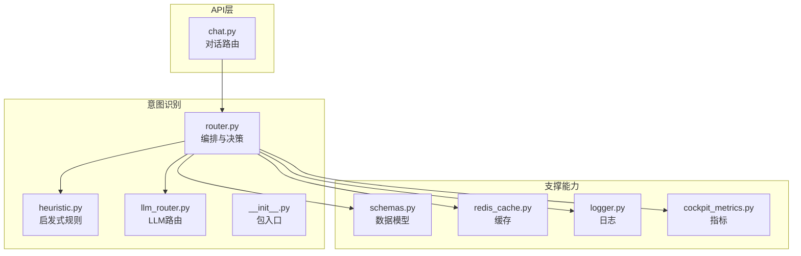
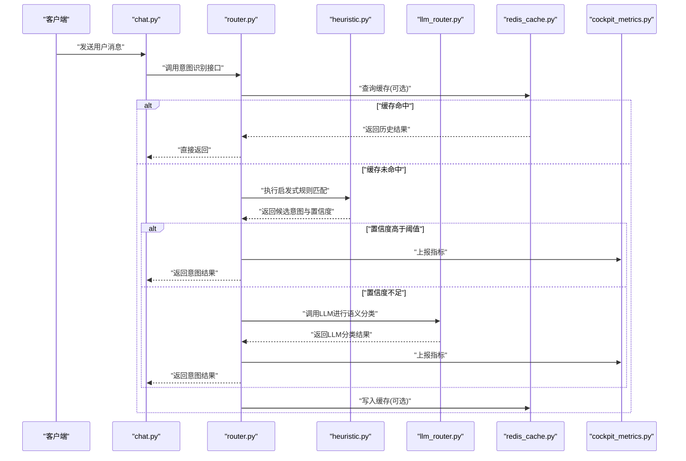
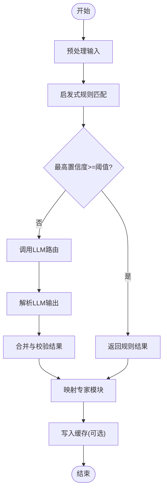
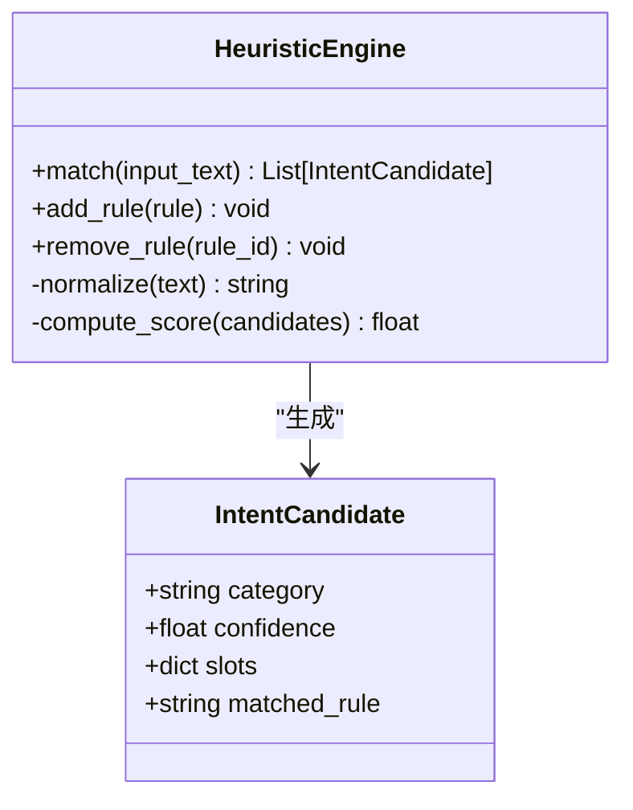
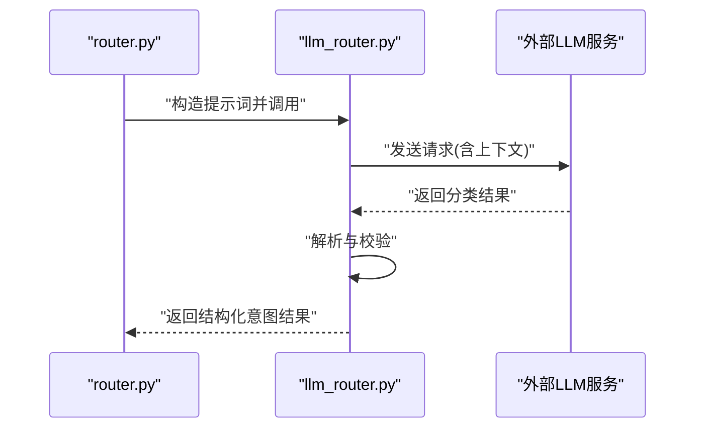
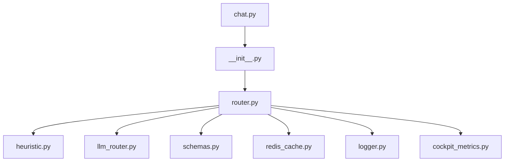

# 意图识别机制

<cite>
**本文引用的文件**   
- [backend_design/nexus/intent/router.py](file://backend_design/nexus/intent/router.py)
- [backend_design/nexus/intent/heuristic.py](file://backend_design/nexus/intent/heuristic.py)
- [backend_design/nexus/intent/llm_router.py](file://backend_design/nexus/intent/llm_router.py)
- [backend_design/nexus/intent/__init__.py](file://backend_design/nexus/intent/__init__.py)
- [backend_design/nexus/api/routes/chat.py](file://backend_design/nexus/api/routes/chat.py)
- [backend_design/nexus/models/schemas.py](file://backend_design/nexus/models/schemas.py)
- [backend_design/nexus/middleware/redis_cache.py](file://backend_design/nexus/middleware/redis_cache.py)
- [backend_design/nexus/core/logger.py](file://backend_design/nexus/core/logger.py)
- [backend_design/nexus/observability/cockpit_metrics.py](file://backend_design/nexus/observability/cockpit_metrics.py)
</cite>

## 目录
1. [简介](#简介)
2. [项目结构](#项目结构)
3. [核心组件](#核心组件)
4. [架构总览](#架构总览)
5. [详细组件分析](#详细组件分析)
6. [依赖关系分析](#依赖关系分析)
7. [性能与缓存策略](#性能与缓存策略)
8. [故障排查指南](#故障排查指南)
9. [结论](#结论)
10. [附录：扩展新意图类型与规则](#附录扩展新意图类型与规则)

## 简介
本文件面向NexusCockpit的“意图识别机制”，系统性阐述多层次意图识别架构，包括启发式规则匹配与大语言模型（LLM）路由的结合使用。文档覆盖意图分类算法、置信度评分与模糊匹配策略、从用户输入到专家模块的映射流程、新增意图类型的实践方法、性能优化与缓存策略，以及准确率评估与持续改进路径。目标是帮助开发者快速理解并安全扩展意图识别能力，同时保障系统稳定性与可观测性。

## 项目结构
意图识别相关代码位于后端设计目录的 intent 子模块中，并通过API层与上层对话路由集成。关键文件如下：
- 路由编排：intent/router.py
- 启发式规则：intent/heuristic.py
- LLM路由：intent/llm_router.py
- 包入口：intent/__init__.py
- API接入点：api/routes/chat.py
- 数据模型：models/schemas.py
- 缓存中间件：middleware/redis_cache.py
- 日志与指标：core/logger.py、observability/cockpit_metrics.py

图表来源
- [backend_design/nexus/intent/router.py](file://backend_design/nexus/intent/router.py)
- [backend_design/nexus/intent/heuristic.py](file://backend_design/nexus/intent/heuristic.py)
- [backend_design/nexus/intent/llm_router.py](file://backend_design/nexus/intent/llm_router.py)
- [backend_design/nexus/intent/__init__.py](file://backend_design/nexus/intent/__init__.py)
- [backend_design/nexus/api/routes/chat.py](file://backend_design/nexus/api/routes/chat.py)
- [backend_design/nexus/models/schemas.py](file://backend_design/nexus/models/schemas.py)
- [backend_design/nexus/middleware/redis_cache.py](file://backend_design/nexus/middleware/redis_cache.py)
- [backend_design/nexus/core/logger.py](file://backend_design/nexus/core/logger.py)
- [backend_design/nexus/observability/cockpit_metrics.py](file://backend_design/nexus/observability/cockpit_metrics.py)

章节来源
- [backend_design/nexus/intent/router.py](file://backend_design/nexus/intent/router.py)
- [backend_design/nexus/intent/heuristic.py](file://backend_design/nexus/intent/heuristic.py)
- [backend_design/nexus/intent/llm_router.py](file://backend_design/nexus/intent/llm_router.py)
- [backend_design/nexus/intent/__init__.py](file://backend_design/nexus/intent/__init__.py)
- [backend_design/nexus/api/routes/chat.py](file://backend_design/nexus/api/routes/chat.py)
- [backend_design/nexus/models/schemas.py](file://backend_design/nexus/models/schemas.py)
- [backend_design/nexus/middleware/redis_cache.py](file://backend_design/nexus/middleware/redis_cache.py)
- [backend_design/nexus/core/logger.py](file://backend_design/nexus/core/logger.py)
- [backend_design/nexus/observability/cockpit_metrics.py](file://backend_design/nexus/observability/cockpit_metrics.py)

## 核心组件
- 路由编排器（router.py）
  - 职责：统一接收用户输入，按优先级执行启发式规则匹配；当规则无法给出高置信度结果时，交由LLM进行语义级分类与路由；输出标准化意图结果（类别、置信度、槽位信息、目标专家模块）。
  - 关键点：支持多级阈值、降级策略、缓存命中优先、指标上报与日志记录。
- 启发式规则引擎（heuristic.py）
  - 职责：基于关键词、正则、短语模板与领域词典进行快速匹配；提供模糊匹配与权重打分；返回候选意图及置信度。
  - 关键点：规则可配置、可扩展；支持多规则组合与冲突消解。
- LLM路由（llm_router.py）
  - 职责：在规则不确定或低置信度场景下，调用大模型进行意图判别；结合提示词工程与结构化输出约束，提高分类准确性。
  - 关键点：超时与重试控制、错误回退至默认专家、结果校验与规范化。
- 包入口（__init__.py）
  - 职责：对外暴露统一的意图识别接口，封装内部实现细节，便于API层与其他模块调用。
- API接入（chat.py）
  - 职责：将用户消息传入意图识别流程，并将识别结果转发给后续处理链路（如专家模块、会话管理、记忆系统等）。
- 数据模型（schemas.py）
  - 职责：定义意图识别请求与响应的数据结构，确保跨模块一致性与可序列化。
- 缓存中间件（redis_cache.py）
  - 职责：为高频查询提供缓存能力，降低重复计算与外部服务调用开销。
- 日志与指标（logger.py、cockpit_metrics.py）
  - 职责：记录关键路径日志与指标，用于监控、诊断与评估。

章节来源
- [backend_design/nexus/intent/router.py](file://backend_design/nexus/intent/router.py)
- [backend_design/nexus/intent/heuristic.py](file://backend_design/nexus/intent/heuristic.py)
- [backend_design/nexus/intent/llm_router.py](file://backend_design/nexus/intent/llm_router.py)
- [backend_design/nexus/intent/__init__.py](file://backend_design/nexus/intent/__init__.py)
- [backend_design/nexus/api/routes/chat.py](file://backend_design/nexus/api/routes/chat.py)
- [backend_design/nexus/models/schemas.py](file://backend_design/nexus/models/schemas.py)
- [backend_design/nexus/middleware/redis_cache.py](file://backend_design/nexus/middleware/redis_cache.py)
- [backend_design/nexus/core/logger.py](file://backend_design/nexus/core/logger.py)
- [backend_design/nexus/observability/cockpit_metrics.py](file://backend_design/nexus/observability/cockpit_metrics.py)

## 架构总览
整体采用“规则优先 + LLM兜底”的多层次架构。请求进入后先尝试快速规则匹配，若命中且置信度高于阈值则直接返回；否则进入LLM路由进行语义理解；最终输出标准化的意图结果，包含类别、置信度、槽位信息与目标专家模块映射。

图表来源
- [backend_design/nexus/api/routes/chat.py](file://backend_design/nexus/api/routes/chat.py)
- [backend_design/nexus/intent/router.py](file://backend_design/nexus/intent/router.py)
- [backend_design/nexus/intent/heuristic.py](file://backend_design/nexus/intent/heuristic.py)
- [backend_design/nexus/intent/llm_router.py](file://backend_design/nexus/intent/llm_router.py)
- [backend_design/nexus/middleware/redis_cache.py](file://backend_design/nexus/middleware/redis_cache.py)
- [backend_design/nexus/observability/cockpit_metrics.py](file://backend_design/nexus/observability/cockpit_metrics.py)

## 详细组件分析

### 路由编排器（router.py）
- 功能要点
  - 统一入口：接收用户输入文本与上下文，组织识别流程。
  - 多级决策：先规则后LLM，支持阈值判断与降级策略。
  - 结果标准化：输出包含意图类别、置信度、槽位、目标专家模块等字段。
  - 可观测性：记录关键路径日志与指标，便于监控与评估。
- 关键流程
  - 预处理：清洗输入、提取基础特征。
  - 规则匹配：调用启发式引擎，得到候选集与置信度。
  - 阈值判定：若最高置信度超过阈值，直接返回；否则进入LLM。
  - LLM路由：构造提示词，调用LLM进行分类，解析结构化输出。
  - 后处理：合并结果、校验槽位、映射专家模块、更新缓存。
- 异常与降级
  - 规则失败：回退到LLM或默认专家。
  - LLM失败：回退到规则最佳候选或默认专家。
  - 超时与限流：通过中间件与配置控制。

图表来源
- [backend_design/nexus/intent/router.py](file://backend_design/nexus/intent/router.py)
- [backend_design/nexus/intent/heuristic.py](file://backend_design/nexus/intent/heuristic.py)
- [backend_design/nexus/intent/llm_router.py](file://backend_design/nexus/intent/llm_router.py)
- [backend_design/nexus/middleware/redis_cache.py](file://backend_design/nexus/middleware/redis_cache.py)

章节来源
- [backend_design/nexus/intent/router.py](file://backend_design/nexus/intent/router.py)

### 启发式规则引擎（heuristic.py）
- 功能要点
  - 关键词与正则：快速定位意图线索。
  - 短语模板：匹配常见表达模式。
  - 模糊匹配：编辑距离、相似度阈值与权重加权。
  - 冲突消解：多规则命中时的优先级与得分聚合。
- 算法要点
  - 规则权重：不同规则对最终置信度的贡献不同。
  - 阈值可调：根据业务场景调整匹配严格程度。
  - 可扩展：新增规则无需改动核心逻辑。
- 输出规范
  - 候选意图列表，每个包含类别、置信度、命中规则、槽位片段。

图表来源
- [backend_design/nexus/intent/heuristic.py](file://backend_design/nexus/intent/heuristic.py)

章节来源
- [backend_design/nexus/intent/heuristic.py](file://backend_design/nexus/intent/heuristic.py)

### LLM路由（llm_router.py）
- 功能要点
  - 语义理解：在规则不确定的情况下，利用大模型进行意图判别。
  - 结构化输出：通过提示词约束，返回标准化JSON格式结果。
  - 容错与降级：超时、异常与不可用状态下的回退策略。
- 关键流程
  - 构建提示词：结合上下文与候选类别，引导模型聚焦意图分类。
  - 调用模型：带超时与重试参数，避免阻塞主流程。
  - 解析结果：校验字段完整性与合法性，必要时修正或回退。
- 性能考虑
  - 并发与批处理：在高吞吐场景下合理调度。
  - 缓存与预取：对常见问法进行缓存或预分类。

图表来源
- [backend_design/nexus/intent/llm_router.py](file://backend_design/nexus/intent/llm_router.py)
- [backend_design/nexus/intent/router.py](file://backend_design/nexus/intent/router.py)

章节来源
- [backend_design/nexus/intent/llm_router.py](file://backend_design/nexus/intent/llm_router.py)

### API接入（chat.py）
- 功能要点
  - 接收用户消息，调用意图识别接口。
  - 将识别结果传递给后续处理链路（专家模块、会话管理等）。
  - 负责鉴权、限流与错误码转换。
- 集成方式
  - 通过包入口统一调用，屏蔽内部实现差异。
  - 支持异步与同步两种调用模式。

章节来源
- [backend_design/nexus/api/routes/chat.py](file://backend_design/nexus/api/routes/chat.py)
- [backend_design/nexus/intent/__init__.py](file://backend_design/nexus/intent/__init__.py)

### 数据模型（schemas.py）
- 功能要点
  - 定义请求与响应结构，确保跨模块一致性。
  - 包含意图类别、置信度、槽位、目标专家模块等字段。
  - 支持序列化与反序列化，便于存储与传输。

章节来源
- [backend_design/nexus/models/schemas.py](file://backend_design/nexus/models/schemas.py)

### 缓存中间件（redis_cache.py）
- 功能要点
  - 为高频意图识别请求提供缓存能力。
  - 支持TTL、键空间管理与失效策略。
  - 与路由编排器协作，命中时直接返回历史结果。

章节来源
- [backend_design/nexus/middleware/redis_cache.py](file://backend_design/nexus/middleware/redis_cache.py)

### 日志与指标（logger.py、cockpit_metrics.py）
- 功能要点
  - 记录关键路径日志，便于问题定位。
  - 上报意图识别相关指标（命中率、延迟、错误率等）。
  - 支持与监控系统集成，形成可视化看板。

章节来源
- [backend_design/nexus/core/logger.py](file://backend_design/nexus/core/logger.py)
- [backend_design/nexus/observability/cockpit_metrics.py](file://backend_design/nexus/observability/cockpit_metrics.py)

## 依赖关系分析
意图识别模块之间的依赖关系清晰，遵循单一职责与松耦合原则。API层仅依赖包入口，路由编排器依赖启发式与LLM路由，两者均依赖数据模型与缓存中间件，并通过日志与指标进行可观测性增强。

图表来源
- [backend_design/nexus/api/routes/chat.py](file://backend_design/nexus/api/routes/chat.py)
- [backend_design/nexus/intent/__init__.py](file://backend_design/nexus/intent/__init__.py)
- [backend_design/nexus/intent/router.py](file://backend_design/nexus/intent/router.py)
- [backend_design/nexus/intent/heuristic.py](file://backend_design/nexus/intent/heuristic.py)
- [backend_design/nexus/intent/llm_router.py](file://backend_design/nexus/intent/llm_router.py)
- [backend_design/nexus/models/schemas.py](file://backend_design/nexus/models/schemas.py)
- [backend_design/nexus/middleware/redis_cache.py](file://backend_design/nexus/middleware/redis_cache.py)
- [backend_design/nexus/core/logger.py](file://backend_design/nexus/core/logger.py)
- [backend_design/nexus/observability/cockpit_metrics.py](file://backend_design/nexus/observability/cockpit_metrics.py)

章节来源
- [backend_design/nexus/api/routes/chat.py](file://backend_design/nexus/api/routes/chat.py)
- [backend_design/nexus/intent/__init__.py](file://backend_design/nexus/intent/__init__.py)
- [backend_design/nexus/intent/router.py](file://backend_design/nexus/intent/router.py)
- [backend_design/nexus/intent/heuristic.py](file://backend_design/nexus/intent/heuristic.py)
- [backend_design/nexus/intent/llm_router.py](file://backend_design/nexus/intent/llm_router.py)
- [backend_design/nexus/models/schemas.py](file://backend_design/nexus/models/schemas.py)
- [backend_design/nexus/middleware/redis_cache.py](file://backend_design/nexus/middleware/redis_cache.py)
- [backend_design/nexus/core/logger.py](file://backend_design/nexus/core/logger.py)
- [backend_design/nexus/observability/cockpit_metrics.py](file://backend_design/nexus/observability/cockpit_metrics.py)

## 性能与缓存策略
- 规则优先：尽可能在本地完成匹配，减少外部调用。
- 阈值控制：合理设置置信度阈值，平衡准确率与延迟。
- 缓存命中：对高频问法进行缓存，缩短响应时间。
- 并发与批处理：在LLM路由阶段采用合理的并发策略，提升吞吐。
- 资源隔离：为LLM调用设置超时与熔断，避免雪崩效应。
- 指标监控：通过指标面板观察命中率、延迟分布与错误率，指导调优。

章节来源
- [backend_design/nexus/intent/router.py](file://backend_design/nexus/intent/router.py)
- [backend_design/nexus/middleware/redis_cache.py](file://backend_design/nexus/middleware/redis_cache.py)
- [backend_design/nexus/observability/cockpit_metrics.py](file://backend_design/nexus/observability/cockpit_metrics.py)

## 故障排查指南
- 常见问题
  - 规则未命中：检查关键词与正则是否覆盖充分，调整权重与阈值。
  - LLM超时：确认外部服务可用性，增加重试与熔断策略。
  - 缓存不一致：清理过期键，检查TTL配置与失效策略。
  - 指标异常：核对日志与指标上报链路，确认埋点位置正确。
- 排查步骤
  - 查看关键路径日志，定位失败节点。
  - 检查缓存命中情况与键空间。
  - 验证数据模型序列化与反序列化是否正确。
  - 对比规则与LLM结果，评估差异原因。

章节来源
- [backend_design/nexus/core/logger.py](file://backend_design/nexus/core/logger.py)
- [backend_design/nexus/middleware/redis_cache.py](file://backend_design/nexus/middleware/redis_cache.py)
- [backend_design/nexus/observability/cockpit_metrics.py](file://backend_design/nexus/observability/cockpit_metrics.py)

## 结论
NexusCockpit的意图识别机制采用“规则优先 + LLM兜底”的多层次架构，既保证了快速响应与高吞吐，又兼顾了复杂语义的理解能力。通过清晰的组件划分、完善的可观测性与灵活的扩展机制，系统能够在保证稳定性的前提下持续演进。建议在生产环境中结合指标与日志进行持续监控与调优，并定期评估准确率与召回率，以驱动意图识别能力的持续提升。

## 附录：扩展新意图类型与规则
- 添加新意图类型
  - 在数据模型中扩展意图类别与槽位定义。
  - 在启发式规则中添加关键词、正则与模板规则。
  - 在LLM路由的提示词中补充新类别的描述与示例。
- 编写识别规则
  - 明确规则优先级与权重，避免冲突。
  - 提供模糊匹配策略与阈值配置。
  - 编写单元测试，覆盖边界用例。
- 集成与测试
  - 在API层注册新意图的处理链路。
  - 通过指标面板观察命中率与延迟变化。
  - 进行A/B测试，评估新规则的效果。

章节来源
- [backend_design/nexus/models/schemas.py](file://backend_design/nexus/models/schemas.py)
- [backend_design/nexus/intent/heuristic.py](file://backend_design/nexus/intent/heuristic.py)
- [backend_design/nexus/intent/llm_router.py](file://backend_design/nexus/intent/llm_router.py)
- [backend_design/nexus/api/routes/chat.py](file://backend_design/nexus/api/routes/chat.py)