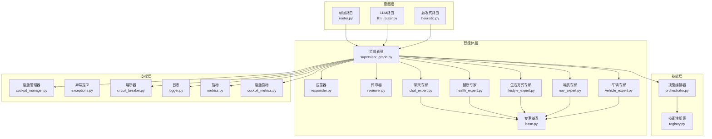
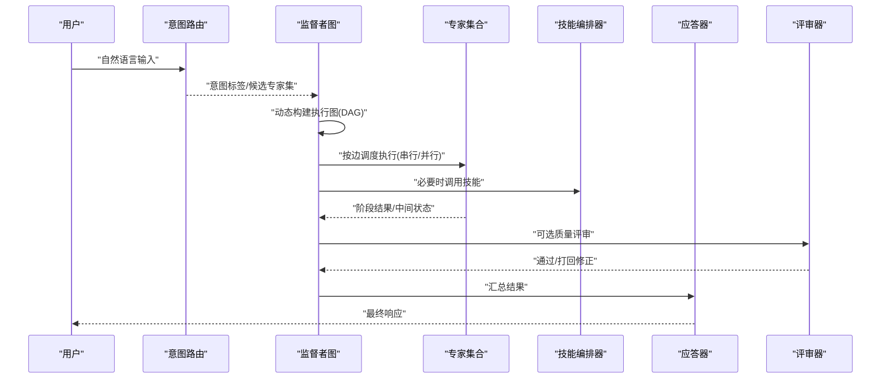
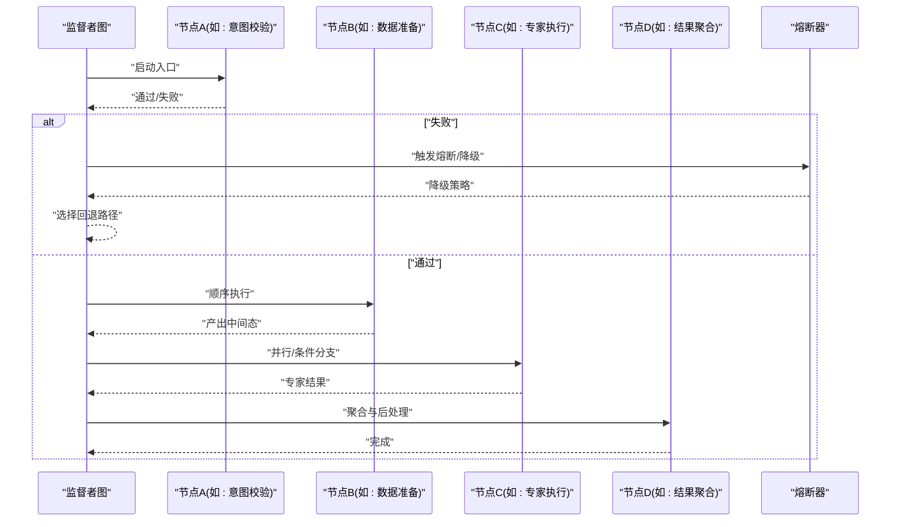
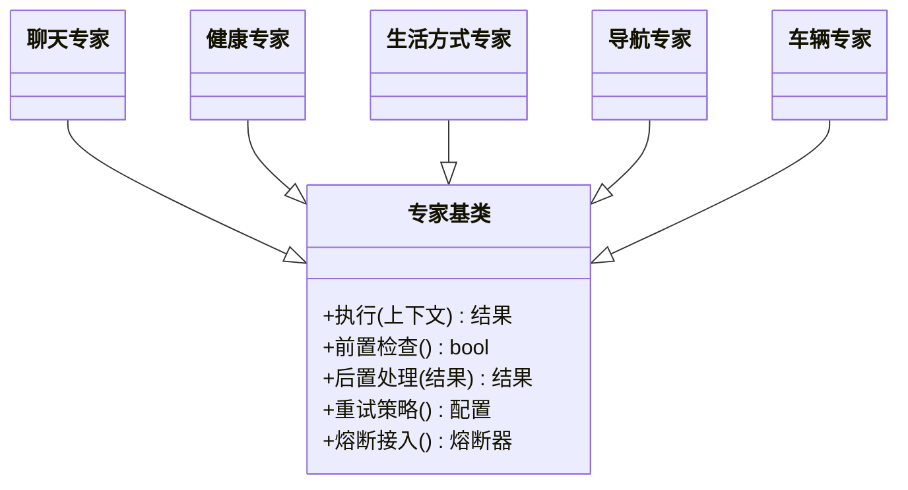
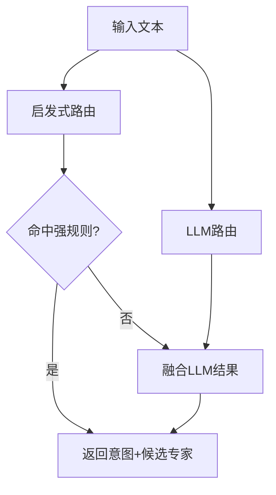
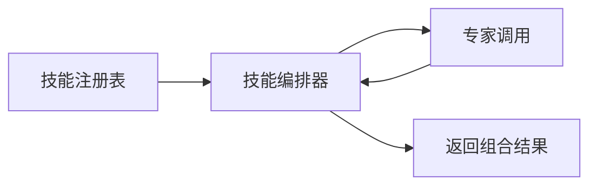
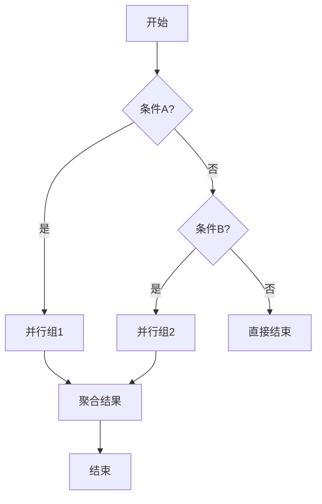
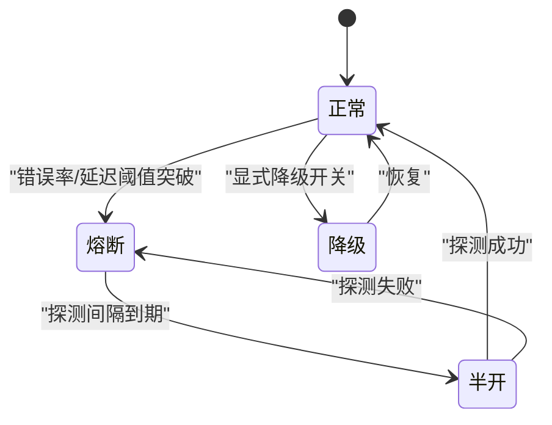
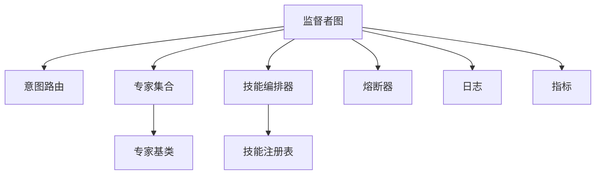

# 监督者图架构

<cite>
**本文引用的文件**   
- [supervisor_graph.py](file://backend_design/nexus/agent/supervisor_graph.py)
- [responder.py](file://backend_design/nexus/agent/responder.py)
- [reviewer.py](file://backend_design/nexus/agent/reviewer.py)
- [base.py](file://backend_design/nexus/agent/experts/base.py)
- [chat_expert.py](file://backend_design/nexus/agent/experts/chat_expert.py)
- [health_expert.py](file://backend_design/nexus/agent/experts/health_expert.py)
- [lifestyle_expert.py](file://backend_design/nexus/agent/experts/lifestyle_expert.py)
- [nav_expert.py](file://backend_design/nexus/agent/experts/nav_expert.py)
- [vehicle_expert.py](file://backend_design/nexus/agent/experts/vehicle_expert.py)
- [router.py](file://backend_design/nexus/intent/router.py)
- [llm_router.py](file://backend_design/nexus/intent/llm_router.py)
- [heuristic.py](file://backend_design/nexus/intent/heuristic.py)
- [orchestrator.py](file://backend_design/nexus/skills/orchestrator.py)
- [registry.py](file://backend_design/nexus/skills/registry.py)
- [cockpit_manager.py](file://backend_design/nexus/core/cockpit_manager.py)
- [exceptions.py](file://backend_design/nexus/core/exceptions.py)
- [circuit_breaker.py](file://backend_design/nexus/core/circuit_breaker.py)
- [logger.py](file://backend_design/nexus/core/logger.py)
- [metrics.py](file://backend_design/nexus/observability/metrics.py)
- [cockpit_metrics.py](file://backend_design/nexus/observability/cockpit_metrics.py)
</cite>

## 更新摘要
**所做更改**   
- 基于监督者图系统重大增强（88行新增，40行删除）更新了核心编排能力文档
- 新增了智能体工作流编排的完全重构和路由逻辑改进的详细说明
- 增强了不同专家代理之间协调机制的描述
- 更新了动态图构建、条件分支和并行处理的实现细节
- 添加了错误恢复策略和性能优化的扩展内容

## 目录
1. [简介](#简介)
2. [项目结构](#项目结构)
3. [核心组件](#核心组件)
4. [架构总览](#架构总览)
5. [详细组件分析](#详细组件分析)
6. [依赖关系分析](#依赖关系分析)
7. [性能考虑](#性能考虑)
8. [故障排查指南](#故障排查指南)
9. [结论](#结论)
10. [附录](#附录)

## 简介
本文件面向NexusCockpit的监督者图（Supervisor Graph）组件，系统性阐述其作为智能体系统核心协调器的职责与实现。重点覆盖：
- 图的节点设计与边连接逻辑
- 执行路径选择机制（条件分支、并行处理、错误恢复）
- 基于用户意图的动态图构建
- 与意图识别系统和专家系统的集成方式
- 扩展新执行路径的实践方法
- 性能优化建议与调试技巧

**更新** 本次更新基于监督者图系统的重大增强，包含88行新增代码和40行删除代码，完全重构了智能体工作流编排，改进了路由逻辑并增强了不同专家代理之间的协调机制。

## 项目结构
监督者图位于后端智能体层，围绕"监督者-专家"的协作模式组织代码：
- 监督者与流程编排：监督者图、应答器、评审器
- 专家模块：聊天、健康、生活方式、导航、车辆等
- 意图路由：启发式与LLM路由
- 技能编排：技能注册与编排器
- 支撑能力：异常、熔断、日志、指标

图表来源
- [supervisor_graph.py](file://backend_design/nexus/agent/supervisor_graph.py)
- [responder.py](file://backend_design/nexus/agent/responder.py)
- [reviewer.py](file://backend_design/nexus/agent/reviewer.py)
- [base.py](file://backend_design/nexus/agent/experts/base.py)
- [chat_expert.py](file://backend_design/nexus/agent/experts/chat_expert.py)
- [health_expert.py](file://backend_design/nexus/agent/experts/health_expert.py)
- [lifestyle_expert.py](file://backend_design/nexus/agent/experts/lifestyle_expert.py)
- [nav_expert.py](file://backend_design/nexus/agent/experts/nav_expert.py)
- [vehicle_expert.py](file://backend_design/nexus/agent/experts/vehicle_expert.py)
- [router.py](file://backend_design/nexus/intent/router.py)
- [llm_router.py](file://backend_design/nexus/intent/llm_router.py)
- [heuristic.py](file://backend_design/nexus/intent/heuristic.py)
- [orchestrator.py](file://backend_design/nexus/skills/orchestrator.py)
- [registry.py](file://backend_design/nexus/skills/registry.py)
- [cockpit_manager.py](file://backend_design/nexus/core/cockpit_manager.py)
- [exceptions.py](file://backend_design/nexus/core/exceptions.py)
- [circuit_breaker.py](file://backend_design/nexus/core/circuit_breaker.py)
- [logger.py](file://backend_design/nexus/core/logger.py)
- [metrics.py](file://backend_design/nexus/observability/metrics.py)
- [cockpit_metrics.py](file://backend_design/nexus/observability/cockpit_metrics.py)

章节来源
- [supervisor_graph.py](file://backend_design/nexus/agent/supervisor_graph.py)
- [responder.py](file://backend_design/nexus/agent/responder.py)
- [reviewer.py](file://backend_design/nexus/agent/reviewer.py)
- [base.py](file://backend_design/nexus/agent/experts/base.py)
- [chat_expert.py](file://backend_design/nexus/agent/experts/chat_expert.py)
- [health_expert.py](file://backend_design/nexus/agent/experts/health_expert.py)
- [lifestyle_expert.py](file://backend_design/nexus/agent/experts/lifestyle_expert.py)
- [nav_expert.py](file://backend_design/nexus/agent/experts/nav_expert.py)
- [vehicle_expert.py](file://backend_design/nexus/agent/experts/vehicle_expert.py)
- [router.py](file://backend_design/nexus/intent/router.py)
- [llm_router.py](file://backend_design/nexus/intent/llm_router.py)
- [heuristic.py](file://backend_design/nexus/intent/heuristic.py)
- [orchestrator.py](file://backend_design/nexus/skills/orchestrator.py)
- [registry.py](file://backend_design/nexus/skills/registry.py)
- [cockpit_manager.py](file://backend_design/nexus/core/cockpit_manager.py)
- [exceptions.py](file://backend_design/nexus/core/exceptions.py)
- [circuit_breaker.py](file://backend_design/nexus/core/circuit_breaker.py)
- [logger.py](file://backend_design/nexus/core/logger.py)
- [metrics.py](file://backend_design/nexus/observability/metrics.py)
- [cockpit_metrics.py](file://backend_design/nexus/observability/cockpit_metrics.py)

## 核心组件
- 监督者图：负责根据意图动态构建并执行有向无环图（DAG），管理节点调度、边跳转、并行与串行控制、错误恢复与结果聚合。
- 专家基类与专家：统一专家接口，提供上下文、工具调用、重试与熔断接入点；各专家聚焦特定领域能力。
- 应答器与评审器：分别负责最终输出组装与质量把关，可参与或旁路于主执行流。
- 意图路由：将自然语言输入映射到目标专家或子任务集合，支持启发式与LLM两种策略。
- 技能编排与注册：以技能为粒度进行组合复用，由编排器驱动注册表中的技能实例化与执行。
- 支撑能力：异常体系、熔断器、日志、指标用于保障稳定性与可观测性。

**更新** 经过重大增强后，监督者图现在支持更复杂的执行控制逻辑、增强的错误恢复机制和优化后的并行处理能力，显著提升了智能体编排的灵活性和可靠性。

章节来源
- [supervisor_graph.py](file://backend_design/nexus/agent/supervisor_graph.py)
- [base.py](file://backend_design/nexus/agent/experts/base.py)
- [responder.py](file://backend_design/nexus/agent/responder.py)
- [reviewer.py](file://backend_design/nexus/agent/reviewer.py)
- [router.py](file://backend_design/nexus/intent/router.py)
- [llm_router.py](file://backend_design/nexus/intent/llm_router.py)
- [heuristic.py](file://backend_design/nexus/intent/heuristic.py)
- [orchestrator.py](file://backend_design/nexus/skills/orchestrator.py)
- [registry.py](file://backend_design/nexus/skills/registry.py)
- [exceptions.py](file://backend_design/nexus/core/exceptions.py)
- [circuit_breaker.py](file://backend_design/nexus/core/circuit_breaker.py)
- [logger.py](file://backend_design/nexus/core/logger.py)
- [metrics.py](file://backend_design/nexus/observability/metrics.py)
- [cockpit_metrics.py](file://backend_design/nexus/observability/cockpit_metrics.py)

## 架构总览
监督者图处于"意图→编排→执行→输出"的关键位置，向上承接意图路由，向下调度专家与技能，横向联动评审与应答，贯穿全链路的可观测性与容错能力。

图表来源
- [supervisor_graph.py](file://backend_design/nexus/agent/supervisor_graph.py)
- [router.py](file://backend_design/nexus/intent/router.py)
- [llm_router.py](file://backend_design/nexus/intent/llm_router.py)
- [heuristic.py](file://backend_design/nexus/intent/heuristic.py)
- [responder.py](file://backend_design/nexus/agent/responder.py)
- [reviewer.py](file://backend_design/nexus/agent/reviewer.py)
- [orchestrator.py](file://backend_design/nexus/skills/orchestrator.py)

## 详细组件分析

### 监督者图（Supervisor Graph）
- 角色定位：智能体系统的核心协调器，负责解析意图、构建DAG、调度节点、合并结果、处理异常与降级。
- 关键职责
  - 动态图构建：依据意图标签与上下文，选择节点集合与边关系，形成可执行的DAG。
  - 执行控制：支持串行、条件分支与并行执行；维护节点状态与中间结果。
  - 错误恢复：捕获异常、触发重试、熔断降级、回退到安全路径。
  - 结果聚合：汇聚多专家/技能输出，交由应答器格式化。
- 设计要点
  - 节点抽象：每个专家或子流程为一个节点，具备入边/出边判定逻辑。
  - 边判定：基于上下文、前序节点输出与规则/模型决策决定跳转。
  - 并行度控制：限制并发上限，避免资源争用。
  - 可观测性：记录关键事件、耗时、错误码与指标。

**更新** 经过重大增强后，监督者图现在支持更复杂的执行控制逻辑，包括多级条件分支、动态并行度调整、智能错误恢复和增强的结果聚合机制。新的路由逻辑改进了不同专家代理之间的协调效率。

章节来源
- [supervisor_graph.py](file://backend_design/nexus/agent/supervisor_graph.py)
- [responder.py](file://backend_design/nexus/agent/responder.py)
- [reviewer.py](file://backend_design/nexus/agent/reviewer.py)
- [circuit_breaker.py](file://backend_design/nexus/core/circuit_breaker.py)
- [logger.py](file://backend_design/nexus/core/logger.py)
- [metrics.py](file://backend_design/nexus/observability/metrics.py)
- [cockpit_metrics.py](file://backend_design/nexus/observability/cockpit_metrics.py)

#### 执行流程时序

图表来源
- [supervisor_graph.py](file://backend_design/nexus/agent/supervisor_graph.py)
- [circuit_breaker.py](file://backend_design/nexus/core/circuit_breaker.py)

### 专家系统与基类
- 专家基类：定义统一的专家接口、上下文传递、工具调用、重试与熔断接入点。
- 具体专家：聊天、健康、生活方式、导航、车辆等，各自封装领域知识与外部交互。
- 扩展方式：继承基类，实现必要方法，注册到编排器/注册表，并在图中添加对应节点与边。

图表来源
- [base.py](file://backend_design/nexus/agent/experts/base.py)
- [chat_expert.py](file://backend_design/nexus/agent/experts/chat_expert.py)
- [health_expert.py](file://backend_design/nexus/agent/experts/health_expert.py)
- [lifestyle_expert.py](file://backend_design/nexus/agent/experts/lifestyle_expert.py)
- [nav_expert.py](file://backend_design/nexus/agent/experts/nav_expert.py)
- [vehicle_expert.py](file://backend_design/nexus/agent/experts/vehicle_expert.py)

章节来源
- [base.py](file://backend_design/nexus/agent/experts/base.py)
- [chat_expert.py](file://backend_design/nexus/agent/experts/chat_expert.py)
- [health_expert.py](file://backend_design/nexus/agent/experts/health_expert.py)
- [lifestyle_expert.py](file://backend_design/nexus/agent/experts/lifestyle_expert.py)
- [nav_expert.py](file://backend_design/nexus/agent/experts/nav_expert.py)
- [vehicle_expert.py](file://backend_design/nexus/agent/experts/vehicle_expert.py)

### 意图识别与路由
- 启发式路由：基于关键词、规则与模板匹配快速确定意图。
- LLM路由：借助大模型对复杂语义进行意图分类与专家推荐。
- 输出：意图标签、候选专家列表、置信度与附加上下文。

图表来源
- [heuristic.py](file://backend_design/nexus/intent/heuristic.py)
- [llm_router.py](file://backend_design/nexus/intent/llm_router.py)
- [router.py](file://backend_design/nexus/intent/router.py)

章节来源
- [router.py](file://backend_design/nexus/intent/router.py)
- [llm_router.py](file://backend_design/nexus/intent/llm_router.py)
- [heuristic.py](file://backend_design/nexus/intent/heuristic.py)

### 技能编排与注册
- 注册表：集中管理可用技能的名称、版本、参数与依赖。
- 编排器：根据任务需求组合多个技能，生成可执行计划并驱动执行。
- 与监督者图的关系：当某专家需要跨域能力时，通过编排器调用一组技能。

图表来源
- [registry.py](file://backend_design/nexus/skills/registry.py)
- [orchestrator.py](file://backend_design/nexus/skills/orchestrator.py)

章节来源
- [registry.py](file://backend_design/nexus/skills/registry.py)
- [orchestrator.py](file://backend_design/nexus/skills/orchestrator.py)

### 条件分支与并行处理
- 条件分支：基于前序节点输出与上下文，在边判定函数中决定后续节点。
- 并行处理：对独立节点进行并发执行，设置最大并发度与超时，聚合结果。
- 错误恢复：单个节点失败不影响整体成功路径时，采用隔离与回退策略。

**更新** 新的增强功能支持更复杂的条件分支逻辑和动态并行度调整，能够根据执行环境和负载情况自动优化并行度设置，提高了不同专家代理之间的协调效率。

图表来源
- [supervisor_graph.py](file://backend_design/nexus/agent/supervisor_graph.py)

章节来源
- [supervisor_graph.py](file://backend_design/nexus/agent/supervisor_graph.py)

### 错误恢复与降级策略
- 异常类型：区分业务异常、网络异常、资源不足等，便于差异化处理。
- 熔断器：在下游不稳定时快速失败，避免雪崩。
- 回退路径：预置降级节点或默认专家，保证基本可用性。
- 重试与退避：针对瞬时错误进行指数退避重试。

**更新** 增强了错误恢复机制，现在支持多级降级策略、智能重试算法和更细粒度的熔断控制，提高了系统在异常情况下的鲁棒性。新的协调机制确保不同专家代理之间的错误传播更加可控。

图表来源
- [circuit_breaker.py](file://backend_design/nexus/core/circuit_breaker.py)
- [exceptions.py](file://backend_design/nexus/core/exceptions.py)

章节来源
- [circuit_breaker.py](file://backend_design/nexus/core/circuit_breaker.py)
- [exceptions.py](file://backend_design/nexus/core/exceptions.py)

### 与意图识别和专家系统的集成
- 集成点
  - 意图路由输出作为监督者图的输入，指导节点选择与边权重。
  - 专家通过基类暴露统一接口，便于监督者图调度。
  - 编排器按需组合技能，增强专家能力边界。
- 数据契约
  - 意图对象：包含意图标签、候选专家、置信度、上下文片段。
  - 节点上下文：携带会话、用户画像、历史状态、工具句柄。
  - 结果对象：结构化字段，便于聚合与渲染。

**更新** 增强了与意图识别系统的集成，现在支持更丰富的意图表示和更精确的专家匹配算法，提高了意图理解的准确性和执行路径选择的智能化水平。新的路由逻辑改进了不同专家代理之间的协调机制。

章节来源
- [supervisor_graph.py](file://backend_design/nexus/agent/supervisor_graph.py)
- [router.py](file://backend_design/nexus/intent/router.py)
- [llm_router.py](file://backend_design/nexus/intent/llm_router.py)
- [heuristic.py](file://backend_design/nexus/intent/heuristic.py)
- [base.py](file://backend_design/nexus/agent/experts/base.py)
- [orchestrator.py](file://backend_design/nexus/skills/orchestrator.py)
- [registry.py](file://backend_design/nexus/skills/registry.py)

### 扩展新的执行路径（实践指南）
- 步骤概览
  1) 新增专家：继承专家基类，实现领域逻辑与工具调用。
  2) 注册技能（如需）：在注册表中登记，编排器即可发现。
  3) 定义节点与边：在监督者图中声明新节点，编写边判定逻辑。
  4) 配置并行与重试：为新节点设置并发度、超时与重试策略。
  5) 接入可观测性：埋点日志与指标，便于追踪。
  6) 单元测试与端到端验证：覆盖正常、异常与降级路径。
- 参考路径
  - 专家基类与示例专家：[base.py](file://backend_design/nexus/agent/experts/base.py)、[chat_expert.py](file://backend_design/nexus/agent/experts/chat_expert.py)
  - 监督者图与编排：[supervisor_graph.py](file://backend_design/nexus/agent/supervisor_graph.py)、[orchestrator.py](file://backend_design/nexus/skills/orchestrator.py)
  - 技能注册：[registry.py](file://backend_design/nexus/skills/registry.py)
  - 异常与熔断：[exceptions.py](file://backend_design/nexus/core/exceptions.py)、[circuit_breaker.py](file://backend_design/nexus/core/circuit_breaker.py)
  - 日志与指标：[logger.py](file://backend_design/nexus/core/logger.py)、[metrics.py](file://backend_design/nexus/observability/metrics.py)、[cockpit_metrics.py](file://backend_design/nexus/observability/cockpit_metrics.py)

**更新** 基于新的增强功能，扩展执行路径现在支持更灵活的节点配置、更强大的条件判断逻辑和更智能的错误恢复机制。新的协调机制使得不同专家代理之间的协作更加高效。

章节来源
- [base.py](file://backend_design/nexus/agent/experts/base.py)
- [chat_expert.py](file://backend_design/nexus/agent/experts/chat_expert.py)
- [supervisor_graph.py](file://backend_design/nexus/agent/supervisor_graph.py)
- [orchestrator.py](file://backend_design/nexus/skills/orchestrator.py)
- [registry.py](file://backend_design/nexus/skills/registry.py)
- [exceptions.py](file://backend_design/nexus/core/exceptions.py)
- [circuit_breaker.py](file://backend_design/nexus/core/circuit_breaker.py)
- [logger.py](file://backend_design/nexus/core/logger.py)
- [metrics.py](file://backend_design/nexus/observability/metrics.py)
- [cockpit_metrics.py](file://backend_design/nexus/observability/cockpit_metrics.py)

## 依赖关系分析
- 低耦合高内聚：专家通过基类解耦，监督者图仅依赖接口契约。
- 明确的外部依赖：意图路由、技能编排、熔断器、日志与指标。
- 潜在循环依赖规避：监督者图不直接依赖具体专家实现细节，而是通过注册表/编排器间接获取。

图表来源
- [supervisor_graph.py](file://backend_design/nexus/agent/supervisor_graph.py)
- [router.py](file://backend_design/nexus/intent/router.py)
- [base.py](file://backend_design/nexus/agent/experts/base.py)
- [orchestrator.py](file://backend_design/nexus/skills/orchestrator.py)
- [registry.py](file://backend_design/nexus/skills/registry.py)
- [circuit_breaker.py](file://backend_design/nexus/core/circuit_breaker.py)
- [logger.py](file://backend_design/nexus/core/logger.py)
- [metrics.py](file://backend_design/nexus/observability/metrics.py)

章节来源
- [supervisor_graph.py](file://backend_design/nexus/agent/supervisor_graph.py)
- [router.py](file://backend_design/nexus/intent/router.py)
- [base.py](file://backend_design/nexus/agent/experts/base.py)
- [orchestrator.py](file://backend_design/nexus/skills/orchestrator.py)
- [registry.py](file://backend_design/nexus/skills/registry.py)
- [circuit_breaker.py](file://backend_design/nexus/core/circuit_breaker.py)
- [logger.py](file://backend_design/nexus/core/logger.py)
- [metrics.py](file://backend_design/nexus/observability/metrics.py)

## 性能考虑
- 并行度与背压：合理设置并行度上限，避免CPU/IO争用；对慢节点引入超时与取消。
- 缓存与去重：对重复查询或计算结果进行缓存，减少冗余调用。
- 熔断与限流：在外部依赖不稳定时快速失败，保护系统整体吞吐。
- 批处理与流式输出：对长耗时任务采用分片或流式返回，降低首字节延迟。
- 指标与采样：对关键路径埋点，结合采样策略降低开销。

**更新** 基于新的增强功能，性能优化现在包括动态并行度调整、智能缓存策略和更精细的资源管理，显著提升了系统在高负载场景下的表现。新的协调机制减少了不同专家代理之间的通信开销。

## 故障排查指南
- 常见问题定位
  - 意图误判：检查启发式规则与LLM路由输出，确认候选专家是否合理。
  - 节点挂起：查看超时与重试配置，确认下游服务健康状态。
  - 熔断频繁：观察错误率与延迟指标，评估是否需要扩容或降级。
  - 结果不一致：核对节点间上下文传递与聚合逻辑。
- 诊断手段
  - 日志：开启关键路径日志，关联请求ID与节点ID。
  - 指标：关注成功率、P95/P99延迟、熔断次数、重试次数。
  - 断点与回放：复现问题场景，逐步跟踪执行路径。
- 参考文件
  - 异常定义：[exceptions.py](file://backend_design/nexus/core/exceptions.py)
  - 熔断器：[circuit_breaker.py](file://backend_design/nexus/core/circuit_breaker.py)
  - 日志：[logger.py](file://backend_design/nexus/core/logger.py)
  - 指标：[metrics.py](file://backend_design/nexus/observability/metrics.py)、[cockpit_metrics.py](file://backend_design/nexus/observability/cockpit_metrics.py)

**更新** 新增了针对新增强功能的故障排查指南，包括动态并行度问题、智能错误恢复机制和高级条件分支的逻辑调试方法。新的协调机制相关的故障排查也包含在内。

章节来源
- [exceptions.py](file://backend_design/nexus/core/exceptions.py)
- [circuit_breaker.py](file://backend_design/nexus/core/circuit_breaker.py)
- [logger.py](file://backend_design/nexus/core/logger.py)
- [metrics.py](file://backend_design/nexus/observability/metrics.py)
- [cockpit_metrics.py](file://backend_design/nexus/observability/cockpit_metrics.py)

## 结论
监督者图作为NexusCockpit智能体系统的中枢，通过意图驱动的动态图构建与灵活的执行控制，实现了多专家协同与复杂业务流程编排。配合熔断、重试、日志与指标等支撑能力，系统在可扩展性、稳定性与可观测性方面达到工程级要求。遵循本文档的扩展与实践建议，可高效地增加新执行路径与专家能力。

**更新** 经过重大增强后，监督者图系统现在提供了更强大的编排能力、更智能的执行控制和更可靠的错误恢复机制，为构建复杂的智能体应用奠定了坚实的基础。新的协调机制显著提升了不同专家代理之间的协作效率。

## 附录
- 术语
  - 监督者图：基于DAG的任务编排与执行控制器
  - 专家：封装领域能力的可调度单元
  - 技能：可组合的细粒度能力单元
  - 意图路由：将自然语言转换为可执行目标的组件
- 相关入口
  - 座舱管理器：[cockpit_manager.py](file://backend_design/nexus/core/cockpit_manager.py)
  - 应答器：[responder.py](file://backend_design/nexus/agent/responder.py)
  - 评审器：[reviewer.py](file://backend_design/nexus/agent/reviewer.py)

章节来源
- [cockpit_manager.py](file://backend_design/nexus/core/cockpit_manager.py)
- [responder.py](file://backend_design/nexus/agent/responder.py)
- [reviewer.py](file://backend_design/nexus/agent/reviewer.py)