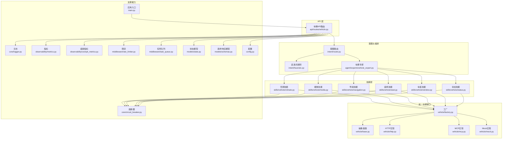
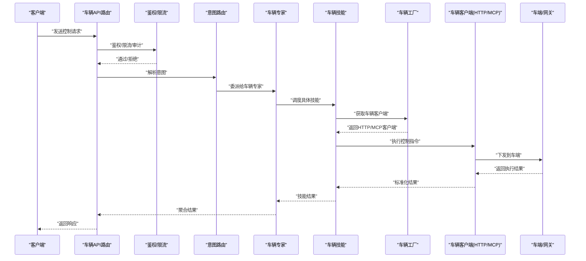
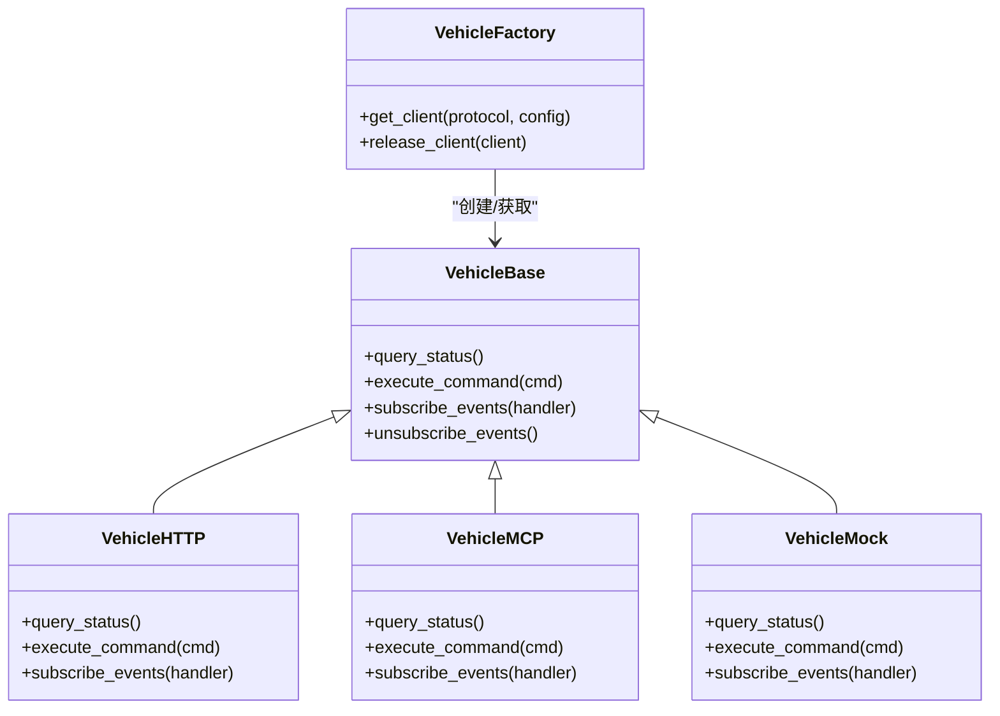
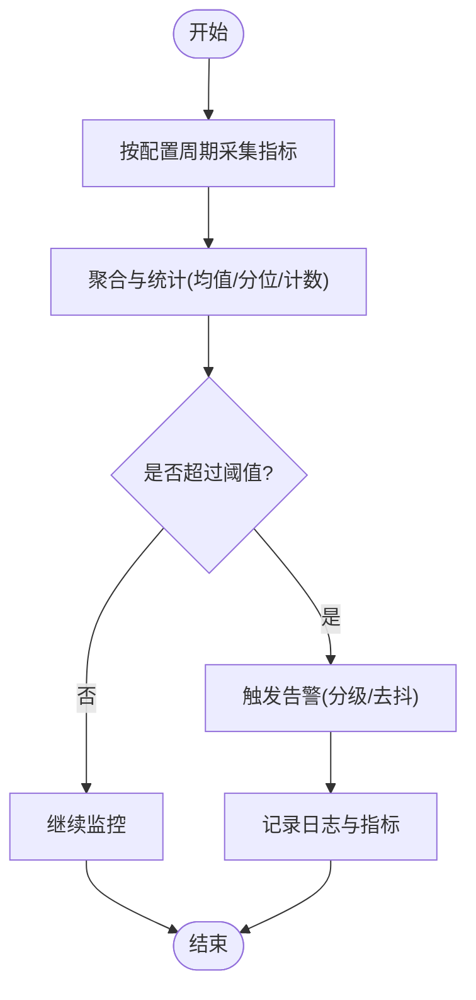
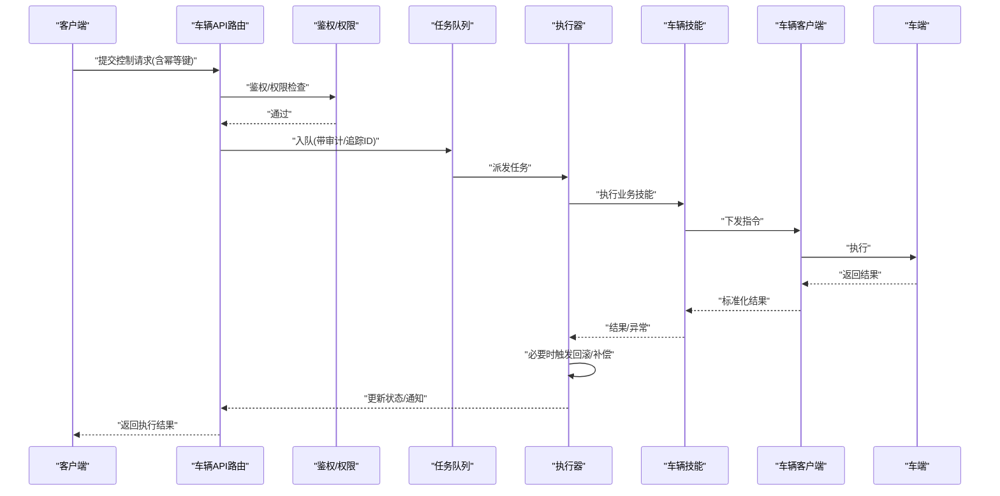
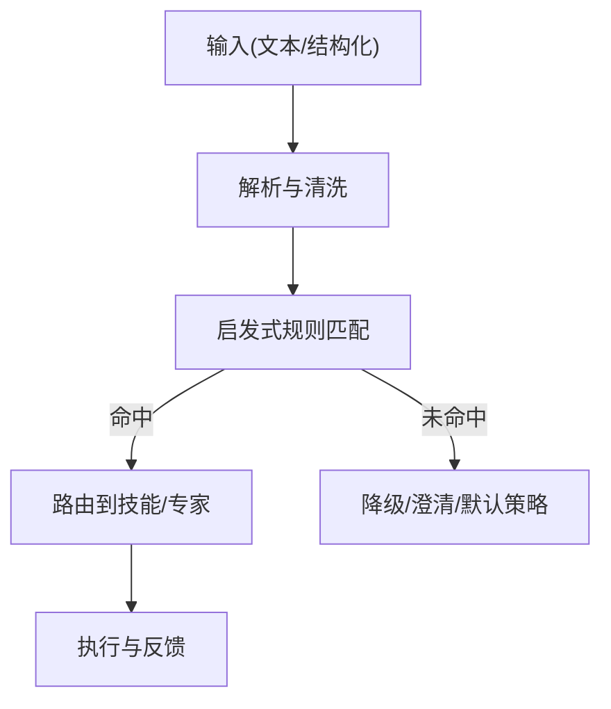
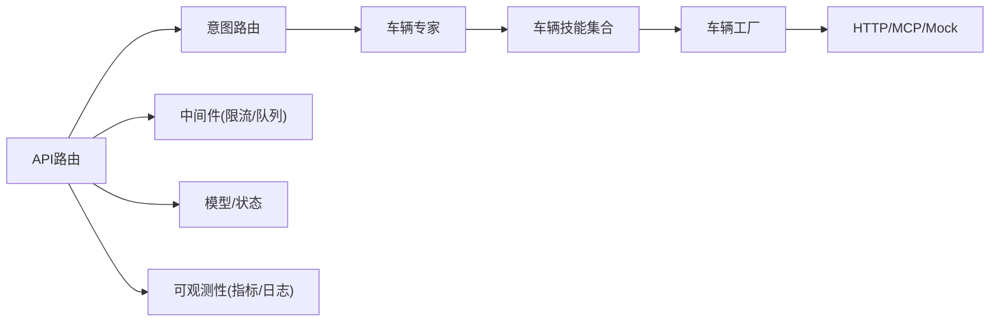

# 智能车辆控制系统

<cite>
**本文引用的文件**   
- [backend_design/nexus/vehicle/base.py](file://backend_design/nexus/vehicle/base.py)
- [backend_design/nexus/vehicle/factory.py](file://backend_design/nexus/vehicle/factory.py)
- [backend_design/nexus/vehicle/http.py](file://backend_design/nexus/vehicle/http.py)
- [backend_design/nexus/vehicle/mcp.py](file://backend_design/nexus/vehicle/mcp.py)
- [backend_design/nexus/vehicle/mock.py](file://backend_design/nexus/vehicle/mock.py)
- [backend_design/nexus/skills/vehicle/climate.py](file://backend_design/nexus/skills/vehicle/climate.py)
- [backend_design/nexus/skills/vehicle/media.py](file://backend_design/nexus/skills/vehicle/media.py)
- [backend_design/nexus/skills/vehicle/navigation.py](file://backend_design/nexus/skills/vehicle/navigation.py)
- [backend_design/nexus/skills/vehicle/seat.py](file://backend_design/nexus/skills/vehicle/seat.py)
- [backend_design/nexus/skills/vehicle/window.py](file://backend_design/nexus/skills/vehicle/window.py)
- [backend_design/nexus/skills/vehicle/status.py](file://backend_design/nexus/skills/vehicle/status.py)
- [backend_design/nexus/api/routes/vehicle.py](file://backend_design/nexus/api/routes/vehicle.py)
- [backend_design/nexus/core/circuit_breaker.py](file://backend_design/nexus/core/circuit_breaker.py)
- [backend_design/nexus/core/logger.py](file://backend_design/nexus/core/logger.py)
- [backend_design/nexus/config.py](file://backend_design/nexus/config.py)
- [backend_design/nexus/main.py](file://backend_design/nexus/main.py)
- [backend_design/nexus/observability/cockpit_metrics.py](file://backend_design/nexus/observability/cockpit_metrics.py)
- [backend_design/nexus/observability/metrics.py](file://backend_design/nexus/observability/metrics.py)
- [backend_design/nexus/middleware/rate_limiter.py](file://backend_design/nexus/middleware/rate_limiter.py)
- [backend_design/nexus/middleware/task_queue.py](file://backend_design/nexus/middleware/task_queue.py)
- [backend_design/nexus/models/state.py](file://backend_design/nexus/models/state.py)
- [backend_design/nexus/models/schemas.py](file://backend_design/nexus/models/schemas.py)
- [backend_design/nexus/intent/router.py](file://backend_design/nexus/intent/router.py)
- [backend_design/nexus/intent/heuristic.py](file://backend_design/nexus/intent/heuristic.py)
- [backend_design/nexus/agent/experts/vehicle_expert.py](file://backend_design/nexus/agent/experts/vehicle_expert.py)
</cite>

## 目录
1. [简介](#简介)
2. [项目结构](#项目结构)
3. [核心组件](#核心组件)
4. [架构总览](#架构总览)
5. [详细组件分析](#详细组件分析)
6. [依赖关系分析](#依赖关系分析)
7. [性能考虑](#性能考虑)
8. [故障排查指南](#故障排查指南)
9. [结论](#结论)
10. [附录](#附录)

## 简介
本文件为 NexusCockpit 智能车辆控制系统的技术文档，聚焦以下目标：
- 统一车辆接口抽象层设计：通过工厂模式支持多种车辆协议（HTTP/MCP），屏蔽底层差异。
- 实时状态监控机制：数据采集频率、异常检测与告警策略。
- 远程控制命令执行流程：权限验证、执行确认与回滚机制。
- 车辆技能功能说明：空调控制、媒体播放、导航设置、座椅调节、车窗控制等。
- 车辆 API 集成开发指南与安全最佳实践。
- 错误处理策略与故障恢复机制。

## 项目结构
系统后端采用分层与模块化组织方式，关键目录与职责如下：
- vehicle：统一车辆接口抽象层与多协议实现（HTTP/MCP/Mock）。
- skills/vehicle：面向业务能力的“车辆技能”（空调、媒体、导航、座椅、车窗、状态）。
- api/routes：对外暴露的 HTTP API 路由（含车辆控制相关接口）。
- core：通用能力（熔断器、日志、认证上下文等）。
- observability：指标采集与可观测性。
- middleware：限流、任务队列等横切能力。
- models：数据模型与状态定义。
- intent：意图识别与路由。
- agent/experts：专家模块（包含车辆专家）。

图表来源
- [backend_design/nexus/api/routes/vehicle.py](file://backend_design/nexus/api/routes/vehicle.py)
- [backend_design/nexus/intent/router.py](file://backend_design/nexus/intent/router.py)
- [backend_design/nexus/intent/heuristic.py](file://backend_design/nexus/intent/heuristic.py)
- [backend_design/nexus/agent/experts/vehicle_expert.py](file://backend_design/nexus/agent/experts/vehicle_expert.py)
- [backend_design/nexus/skills/vehicle/climate.py](file://backend_design/nexus/skills/vehicle/climate.py)
- [backend_design/nexus/skills/vehicle/media.py](file://backend_design/nexus/skills/vehicle/media.py)
- [backend_design/nexus/skills/vehicle/navigation.py](file://backend_design/nexus/skills/vehicle/navigation.py)
- [backend_design/nexus/skills/vehicle/seat.py](file://backend_design/nexus/skills/vehicle/seat.py)
- [backend_design/nexus/skills/vehicle/window.py](file://backend_design/nexus/skills/vehicle/window.py)
- [backend_design/nexus/skills/vehicle/status.py](file://backend_design/nexus/skills/vehicle/status.py)
- [backend_design/nexus/vehicle/base.py](file://backend_design/nexus/vehicle/base.py)
- [backend_design/nexus/vehicle/factory.py](file://backend_design/nexus/vehicle/factory.py)
- [backend_design/nexus/vehicle/http.py](file://backend_design/nexus/vehicle/http.py)
- [backend_design/nexus/vehicle/mcp.py](file://backend_design/nexus/vehicle/mcp.py)
- [backend_design/nexus/vehicle/mock.py](file://backend_design/nexus/vehicle/mock.py)
- [backend_design/nexus/core/circuit_breaker.py](file://backend_design/nexus/core/circuit_breaker.py)
- [backend_design/nexus/core/logger.py](file://backend_design/nexus/core/logger.py)
- [backend_design/nexus/observability/metrics.py](file://backend_design/nexus/observability/metrics.py)
- [backend_design/nexus/observability/cockpit_metrics.py](file://backend_design/nexus/observability/cockpit_metrics.py)
- [backend_design/nexus/middleware/rate_limiter.py](file://backend_design/nexus/middleware/rate_limiter.py)
- [backend_design/nexus/middleware/task_queue.py](file://backend_design/nexus/middleware/task_queue.py)
- [backend_design/nexus/models/state.py](file://backend_design/nexus/models/state.py)
- [backend_design/nexus/models/schemas.py](file://backend_design/nexus/models/schemas.py)
- [backend_design/nexus/config.py](file://backend_design/nexus/config.py)
- [backend_design/nexus/main.py](file://backend_design/nexus/main.py)

章节来源
- [backend_design/nexus/main.py](file://backend_design/nexus/main.py)
- [backend_design/nexus/config.py](file://backend_design/nexus/config.py)

## 核心组件
本节聚焦统一车辆接口抽象层与工厂模式，以及各车辆技能的职责边界。

- 统一车辆接口抽象层
  - 抽象基类定义了标准方法族（如查询状态、下发控制指令、订阅事件等），所有协议实现必须遵循该契约，确保上层调用一致。
  - 通过工厂根据配置或运行时参数选择具体实现（HTTP/MCP/Mock），实现协议无关的上层逻辑。

- 工厂模式
  - 负责实例化并缓存不同协议的 VehicleClient，提供统一的获取接口。
  - 支持按租户、设备或场景切换协议实现，便于灰度与测试。

- 协议实现
  - HTTP：基于 REST/JSON 或 HTTP+WebSocket 的远程调用封装。
  - MCP：基于消息通信协议的客户端封装，适配车端或网关服务。
  - Mock：用于本地开发与联调，模拟车端行为与异常。

- 车辆技能
  - 每个技能对应一个业务能力域，内部调用统一车辆接口完成实际动作，同时负责参数校验、幂等、事务补偿与结果归一化。

章节来源
- [backend_design/nexus/vehicle/base.py](file://backend_design/nexus/vehicle/base.py)
- [backend_design/nexus/vehicle/factory.py](file://backend_design/nexus/vehicle/factory.py)
- [backend_design/nexus/vehicle/http.py](file://backend_design/nexus/vehicle/http.py)
- [backend_design/nexus/vehicle/mcp.py](file://backend_design/nexus/vehicle/mcp.py)
- [backend_design/nexus/vehicle/mock.py](file://backend_design/nexus/vehicle/mock.py)
- [backend_design/nexus/skills/vehicle/climate.py](file://backend_design/nexus/skills/vehicle/climate.py)
- [backend_design/nexus/skills/vehicle/media.py](file://backend_design/nexus/skills/vehicle/media.py)
- [backend_design/nexus/skills/vehicle/navigation.py](file://backend_design/nexus/skills/vehicle/navigation.py)
- [backend_design/nexus/skills/vehicle/seat.py](file://backend_design/nexus/skills/vehicle/seat.py)
- [backend_design/nexus/skills/vehicle/window.py](file://backend_design/nexus/nexus/skills/vehicle/window.py)
- [backend_design/nexus/skills/vehicle/status.py](file://backend_design/nexus/skills/vehicle/status.py)

## 架构总览
从请求到执行的端到端路径如下：
- 前端/外部系统通过 API 路由进入。
- 中间件进行鉴权、限流、审计与指标埋点。
- 意图路由将自然语言或结构化指令解析为技能调用。
- 车辆专家协调多个技能完成复杂任务。
- 技能通过工厂获取统一车辆客户端，最终驱动车端。
- 熔断器保护下游不稳定依赖，任务队列承载异步与重试。
- 指标与日志贯穿全链路，支撑可观测性与排障。

图表来源
- [backend_design/nexus/api/routes/vehicle.py](file://backend_design/nexus/api/routes/vehicle.py)
- [backend_design/nexus/intent/router.py](file://backend_design/nexus/intent/router.py)
- [backend_design/nexus/agent/experts/vehicle_expert.py](file://backend_design/nexus/agent/experts/vehicle_expert.py)
- [backend_design/nexus/vehicle/factory.py](file://backend_design/nexus/vehicle/factory.py)
- [backend_design/nexus/vehicle/http.py](file://backend_design/nexus/vehicle/http.py)
- [backend_design/nexus/vehicle/mcp.py](file://backend_design/nexus/vehicle/mcp.py)

## 详细组件分析

### 统一车辆接口抽象层与工厂模式
- 抽象基类
  - 定义统一的方法签名与语义约定，包括状态查询、控制指令、事件订阅等。
  - 约束返回值结构与错误码规范，便于上层统一处理。
- 工厂
  - 依据配置或上下文选择具体实现，并提供单例/缓存策略减少创建开销。
  - 支持动态切换与降级（例如从 MCP 切换到 Mock）。
- 协议实现
  - HTTP：封装网络请求、超时、重试、鉴权头、序列化/反序列化。
  - MCP：封装消息编解码、会话管理、断线重连。
  - Mock：模拟成功/失败、延迟、随机异常，便于测试。

图表来源
- [backend_design/nexus/vehicle/base.py](file://backend_design/nexus/vehicle/base.py)
- [backend_design/nexus/vehicle/factory.py](file://backend_design/nexus/vehicle/factory.py)
- [backend_design/nexus/vehicle/http.py](file://backend_design/nexus/vehicle/http.py)
- [backend_design/nexus/vehicle/mcp.py](file://backend_design/nexus/vehicle/mcp.py)
- [backend_design/nexus/vehicle/mock.py](file://backend_design/nexus/vehicle/mock.py)

章节来源
- [backend_design/nexus/vehicle/base.py](file://backend_design/nexus/vehicle/base.py)
- [backend_design/nexus/vehicle/factory.py](file://backend_design/nexus/vehicle/factory.py)
- [backend_design/nexus/vehicle/http.py](file://backend_design/nexus/vehicle/http.py)
- [backend_design/nexus/vehicle/mcp.py](file://backend_design/nexus/vehicle/mcp.py)
- [backend_design/nexus/vehicle/mock.py](file://backend_design/nexus/vehicle/mock.py)

### 实时状态监控机制
- 数据采集频率
  - 通过配置项控制轮询周期与批量拉取策略；高频指标建议走事件推送通道，低频指标使用定时任务。
- 异常检测
  - 基于阈值与滑动窗口统计，结合熔断器状态判断健康度。
  - 对关键指标（成功率、时延、错误率）进行趋势分析与突变检测。
- 告警策略
  - 分级告警（警告/严重），去抖与抑制策略避免风暴。
  - 告警内容包含上下文（租户、设备、时间窗、关联请求ID）。

图表来源
- [backend_design/nexus/observability/metrics.py](file://backend_design/nexus/observability/metrics.py)
- [backend_design/nexus/observability/cockpit_metrics.py](file://backend_design/nexus/observability/cockpit_metrics.py)
- [backend_design/nexus/core/circuit_breaker.py](file://backend_design/nexus/core/circuit_breaker.py)
- [backend_design/nexus/config.py](file://backend_design/nexus/config.py)

章节来源
- [backend_design/nexus/observability/metrics.py](file://backend_design/nexus/observability/metrics.py)
- [backend_design/nexus/observability/cockpit_metrics.py](file://backend_design/nexus/observability/cockpit_metrics.py)
- [backend_design/nexus/core/circuit_breaker.py](file://backend_design/nexus/core/circuit_breaker.py)
- [backend_design/nexus/config.py](file://backend_design/nexus/config.py)

### 远程控制命令执行流程（权限、确认、回滚）
- 权限验证
  - 在 API 路由层进行身份与权限校验，结合租户上下文与操作白名单。
- 执行确认
  - 对高风险操作引入二次确认或审批流；对幂等键进行去重。
- 回滚机制
  - 对不可逆或长耗时操作采用事务补偿：记录操作快照，失败时自动回滚或提示人工介入。
- 异步与重试
  - 通过任务队列承载异步执行与指数退避重试，保证最终一致性。

图表来源
- [backend_design/nexus/api/routes/vehicle.py](file://backend_design/nexus/api/routes/vehicle.py)
- [backend_design/nexus/middleware/task_queue.py](file://backend_design/nexus/middleware/task_queue.py)
- [backend_design/nexus/skills/vehicle/climate.py](file://backend_design/nexus/skills/vehicle/climate.py)
- [backend_design/nexus/skills/vehicle/media.py](file://backend_design/nexus/skills/vehicle/media.py)
- [backend_design/nexus/skills/vehicle/navigation.py](file://backend_design/nexus/skills/vehicle/navigation.py)
- [backend_design/nexus/skills/vehicle/seat.py](file://backend_design/nexus/skills/vehicle/seat.py)
- [backend_design/nexus/skills/vehicle/window.py](file://backend_design/nexus/skills/vehicle/window.py)
- [backend_design/nexus/vehicle/factory.py](file://backend_design/nexus/vehicle/factory.py)

章节来源
- [backend_design/nexus/api/routes/vehicle.py](file://backend_design/nexus/api/routes/vehicle.py)
- [backend_design/nexus/middleware/task_queue.py](file://backend_design/nexus/middleware/task_queue.py)

### 车辆技能功能说明
- 空调控制
  - 功能：温度设定、风量、风向、自动模式、除雾、分区控制等。
  - 要点：参数范围校验、安全互斥（如除雾与内循环）、状态同步。
- 媒体播放
  - 功能：播放/暂停、切歌、音量、音源切换、列表管理等。
  - 要点：播放态一致性、跨设备同步、隐私模式。
- 导航设置
  - 功能：目的地输入、路线偏好、途经点、语音播报开关。
  - 要点：坐标合法性、敏感地址脱敏、并发冲突处理。
- 座椅调节
  - 功能：前后/靠背/腰托/加热/通风/记忆位置。
  - 要点：运动部件安全限制、防夹检测、用户画像绑定。
- 车窗控制
  - 功能：升降、开合角度、防夹、一键关闭。
  - 要点：安全互锁（行驶中限制）、儿童锁联动。
- 状态查询
  - 功能：汇总车辆子系统状态、告警信息、能耗与里程等。
  - 要点：数据新鲜度、增量更新、缓存策略。

章节来源
- [backend_design/nexus/skills/vehicle/climate.py](file://backend_design/nexus/skills/vehicle/climate.py)
- [backend_design/nexus/skills/vehicle/media.py](file://backend_design/nexus/skills/vehicle/media.py)
- [backend_design/nexus/skills/vehicle/navigation.py](file://backend_design/nexus/skills/vehicle/navigation.py)
- [backend_design/nexus/skills/vehicle/seat.py](file://backend_design/nexus/skills/vehicle/seat.py)
- [backend_design/nexus/skills/vehicle/window.py](file://backend_design/nexus/skills/vehicle/window.py)
- [backend_design/nexus/skills/vehicle/status.py](file://backend_design/nexus/skills/vehicle/status.py)

### 意图识别与路由
- 意图路由
  - 将用户输入或结构化指令映射到具体技能或专家组合。
- 启发式规则
  - 基于关键词、上下文与历史行为的快速匹配，提升低延迟场景体验。
- 车辆专家
  - 协调多技能协作，处理复杂任务（如“导航回家并打开空调”）。

图表来源
- [backend_design/nexus/intent/router.py](file://backend_design/nexus/intent/router.py)
- [backend_design/nexus/intent/heuristic.py](file://backend_design/nexus/intent/heuristic.py)
- [backend_design/nexus/agent/experts/vehicle_expert.py](file://backend_design/nexus/agent/experts/vehicle_expert.py)

章节来源
- [backend_design/nexus/intent/router.py](file://backend_design/nexus/intent/router.py)
- [backend_design/nexus/intent/heuristic.py](file://backend_design/nexus/intent/heuristic.py)
- [backend_design/nexus/agent/experts/vehicle_expert.py](file://backend_design/nexus/agent/experts/vehicle_expert.py)

## 依赖关系分析
- 组件耦合
  - 技能层仅依赖统一车辆接口与工厂，不感知协议细节，保持高内聚低耦合。
  - API 路由依赖中间件（鉴权、限流、任务队列）与模型（状态、Schema）。
- 外部依赖
  - 指标与日志系统、任务队列、配置中心。
- 潜在环依赖
  - 通过明确分层与接口隔离避免循环引用。

图表来源
- [backend_design/nexus/api/routes/vehicle.py](file://backend_design/nexus/api/routes/vehicle.py)
- [backend_design/nexus/intent/router.py](file://backend_design/nexus/intent/router.py)
- [backend_design/nexus/agent/experts/vehicle_expert.py](file://backend_design/nexus/agent/experts/vehicle_expert.py)
- [backend_design/nexus/vehicle/factory.py](file://backend_design/nexus/vehicle/factory.py)
- [backend_design/nexus/middleware/rate_limiter.py](file://backend_design/nexus/middleware/rate_limiter.py)
- [backend_design/nexus/middleware/task_queue.py](file://backend_design/nexus/middleware/task_queue.py)
- [backend_design/nexus/models/state.py](file://backend_design/nexus/models/state.py)
- [backend_design/nexus/models/schemas.py](file://backend_design/nexus/models/schemas.py)
- [backend_design/nexus/observability/metrics.py](file://backend_design/nexus/observability/metrics.py)
- [backend_design/nexus/core/logger.py](file://backend_design/nexus/core/logger.py)

章节来源
- [backend_design/nexus/api/routes/vehicle.py](file://backend_design/nexus/api/routes/vehicle.py)
- [backend_design/nexus/vehicle/factory.py](file://backend_design/nexus/vehicle/factory.py)
- [backend_design/nexus/middleware/rate_limiter.py](file://backend_design/nexus/middleware/rate_limiter.py)
- [backend_design/nexus/middleware/task_queue.py](file://backend_design/nexus/middleware/task_queue.py)
- [backend_design/nexus/models/state.py](file://backend_design/nexus/models/state.py)
- [backend_design/nexus/models/schemas.py](file://backend_design/nexus/models/schemas.py)
- [backend_design/nexus/observability/metrics.py](file://backend_design/nexus/observability/metrics.py)
- [backend_design/nexus/core/logger.py](file://backend_design/nexus/core/logger.py)

## 性能考虑
- 连接复用与池化：HTTP/MCP 客户端应复用连接，降低握手开销。
- 批处理与合并：状态采集尽量批量拉取，减少往返次数。
- 缓存与失效：热点状态短缓存，配合版本号或时间戳失效。
- 异步与背压：控制指令异步化，结合队列容量与消费者速率控制。
- 熔断与降级：对不稳定下游启用熔断，快速失败与优雅降级。
- 指标采样：高频指标采样上报，避免监控自身成为瓶颈。

[本节为通用指导，无需特定文件来源]

## 故障排查指南
- 常见问题定位
  - 鉴权失败：检查令牌、租户上下文与权限策略。
  - 限流触发：查看限流计数器与配额，调整阈值或扩容。
  - 下游超时/错误：观察熔断器状态、重试次数与退避策略。
  - 状态不一致：核对幂等键、任务队列消费与补偿逻辑。
- 日志与指标
  - 关键节点打点：请求入口、技能执行、车辆客户端调用、任务队列出入队。
  - 指标维度：租户、设备、协议、技能、错误码、时延分位。
- 恢复策略
  - 自动重试与退避、熔断恢复探测、任务重放与死信队列。
  - 人工干预：回滚脚本、状态修复工具与审计追踪。

章节来源
- [backend_design/nexus/core/logger.py](file://backend_design/nexus/core/logger.py)
- [backend_design/nexus/observability/metrics.py](file://backend_design/nexus/observability/metrics.py)
- [backend_design/nexus/core/circuit_breaker.py](file://backend_design/nexus/core/circuit_breaker.py)
- [backend_design/nexus/middleware/rate_limiter.py](file://backend_design/nexus/middleware/rate_limiter.py)
- [backend_design/nexus/middleware/task_queue.py](file://backend_design/nexus/middleware/task_queue.py)

## 结论
本系统通过统一车辆接口抽象与工厂模式，实现了协议无关的车辆控制能力；以技能化拆分业务领域，结合意图路由与专家编排，形成可扩展的智能交互体系。配合熔断、限流、任务队列与完善的可观测性，系统在稳定性、可维护性与安全性方面具备良好基础。后续可在指标精细化、自动化回滚与A/B灰度方面持续优化。

[本节为总结，无需特定文件来源]

## 附录

### 车辆 API 集成开发指南
- 接入步骤
  - 注册与鉴权：申请密钥/令牌，配置租户与设备标识。
  - 选择协议：优先 HTTP，若需双向通信或更低延迟可选 MCP。
  - 调用示例：参考各技能对应的 API 定义与错误码。
  - 幂等与重试：为写操作提供幂等键，合理设置重试与超时。
- 安全最佳实践
  - 传输加密：强制 HTTPS/TLS，证书校验。
  - 最小权限：按租户与角色授权，细粒度控制。
  - 输入校验：严格校验参数范围与格式，防止注入与越界。
  - 审计与追踪：全链路追踪ID，保留必要审计日志。
  - 密钥管理：使用密钥管理服务，定期轮换。
- 兼容性
  - 版本兼容：API 版本前缀与向后兼容策略。
  - 降级策略：当主协议不可用时，自动降级至备用协议或 Mock。

章节来源
- [backend_design/nexus/api/routes/vehicle.py](file://backend_design/nexus/api/routes/vehicle.py)
- [backend_design/nexus/vehicle/http.py](file://backend_design/nexus/vehicle/http.py)
- [backend_design/nexus/vehicle/mcp.py](file://backend_design/nexus/vehicle/mcp.py)
- [backend_design/nexus/vehicle/mock.py](file://backend_design/nexus/vehicle/mock.py)
- [backend_design/nexus/models/schemas.py](file://backend_design/nexus/models/schemas.py)