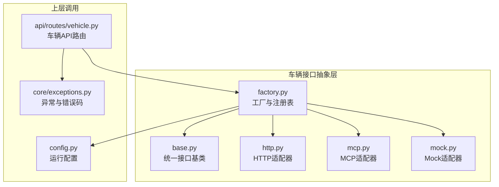
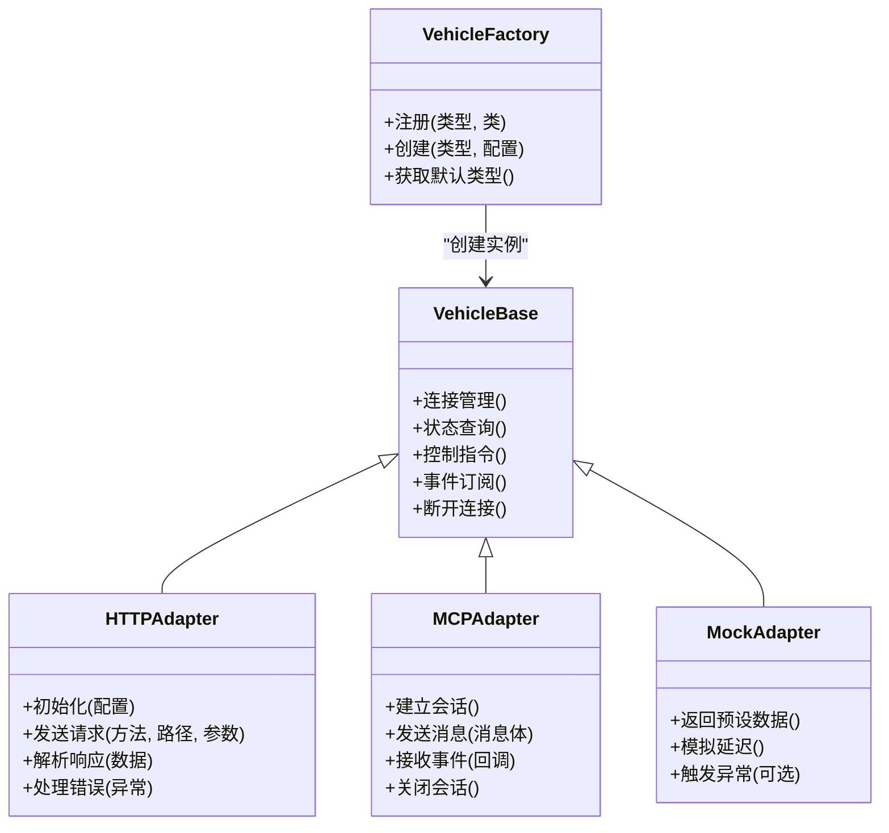
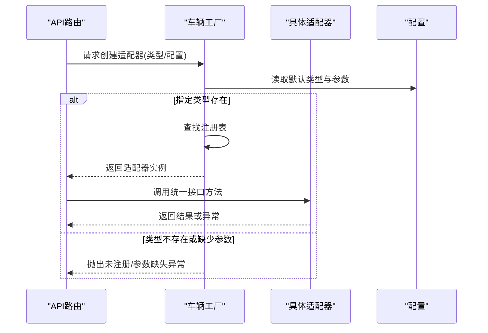
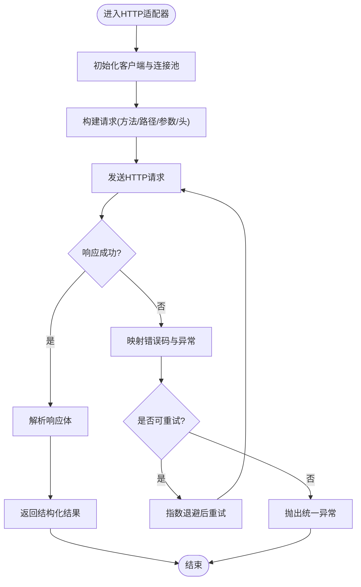
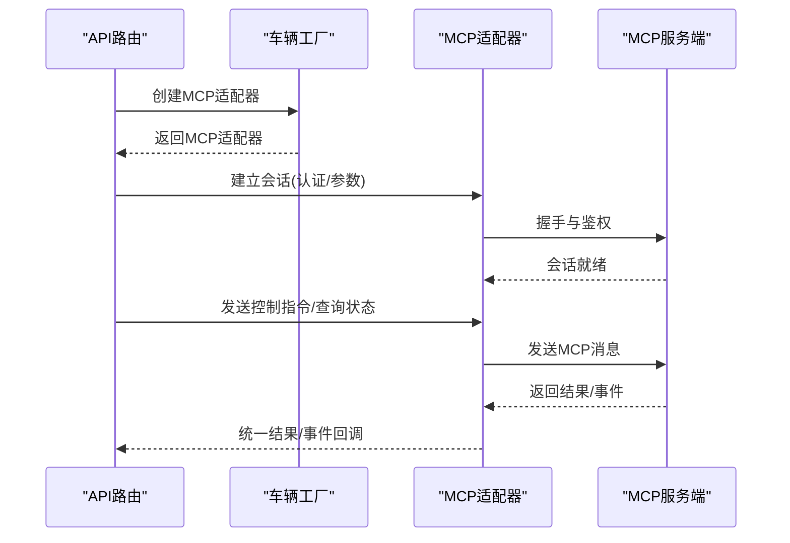
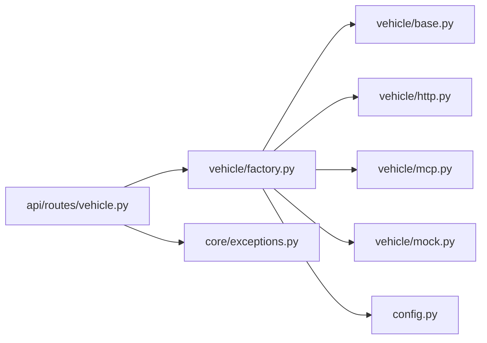

# 车辆接口抽象层

<cite>
**本文引用的文件**   
- [backend_design/nexus/vehicle/base.py](file://backend_design/nexus/vehicle/base.py)
- [backend_design/nexus/vehicle/factory.py](file://backend_design/nexus/vehicle/factory.py)
- [backend_design/nexus/vehicle/http.py](file://backend_design/nexus/vehicle/http.py)
- [backend_design/nexus/vehicle/mcp.py](file://backend_design/nexus/vehicle/mcp.py)
- [backend_design/nexus/vehicle/mock.py](file://backend_design/nexus/vehicle/mock.py)
- [backend_design/nexus/api/routes/vehicle.py](file://backend_design/nexus/api/routes/vehicle.py)
- [backend_design/nexus/core/exceptions.py](file://backend_design/nexus/core/exceptions.py)
- [backend_design/nexus/config.py](file://backend_design/nexus/config.py)
</cite>

## 目录
1. [简介](#简介)
2. [项目结构](#项目结构)
3. [核心组件](#核心组件)
4. [架构总览](#架构总览)
5. [详细组件分析](#详细组件分析)
6. [依赖关系分析](#依赖关系分析)
7. [性能考虑](#性能考虑)
8. [故障排查指南](#故障排查指南)
9. [结论](#结论)
10. [附录](#附录)

## 简介
本文件面向NexusCockpit的车辆接口抽象层，系统性阐述统一车辆接口的设计模式、工厂模式的实现与动态创建机制、多协议适配器（HTTP、MCP、Mock）的差异与策略，以及自定义适配器的开发指南。文档同时提供架构图、时序图、流程图等可视化说明，并给出性能优化建议与最佳实践，帮助读者快速理解并扩展系统能力。

## 项目结构
车辆接口抽象层位于后端模块的 vehicle 子包中，采用“基类定义标准API + 工厂按类型创建具体适配器”的分层设计：
- base.py：定义统一车辆接口基类与通用异常契约
- factory.py：注册表与工厂方法，负责根据配置或参数动态创建具体适配器实例
- http.py：基于HTTP协议的适配器实现
- mcp.py：基于MCP协议的适配器实现
- mock.py：用于开发与测试的模拟适配器实现
- api/routes/vehicle.py：上层API路由对车辆接口的调用入口
- core/exceptions.py：全局异常定义与错误码规范
- config.py：运行时配置项（如默认适配器类型、连接参数等）

图表来源
- [backend_design/nexus/vehicle/base.py](file://backend_design/nexus/vehicle/base.py)
- [backend_design/nexus/vehicle/factory.py](file://backend_design/nexus/vehicle/factory.py)
- [backend_design/nexus/vehicle/http.py](file://backend_design/nexus/vehicle/http.py)
- [backend_design/nexus/vehicle/mcp.py](file://backend_design/nexus/vehicle/mcp.py)
- [backend_design/nexus/vehicle/mock.py](file://backend_design/nexus/vehicle/mock.py)
- [backend_design/nexus/api/routes/vehicle.py](file://backend_design/nexus/api/routes/vehicle.py)
- [backend_design/nexus/core/exceptions.py](file://backend_design/nexus/core/exceptions.py)
- [backend_design/nexus/config.py](file://backend_design/nexus/config.py)

章节来源
- [backend_design/nexus/vehicle/base.py](file://backend_design/nexus/vehicle/base.py)
- [backend_design/nexus/vehicle/factory.py](file://backend_design/nexus/vehicle/factory.py)
- [backend_design/nexus/vehicle/http.py](file://backend_design/nexus/vehicle/http.py)
- [backend_design/nexus/vehicle/mcp.py](file://backend_design/nexus/vehicle/mcp.py)
- [backend_design/nexus/vehicle/mock.py](file://backend_design/nexus/vehicle/mock.py)
- [backend_design/nexus/api/routes/vehicle.py](file://backend_design/nexus/api/routes/vehicle.py)
- [backend_design/nexus/core/exceptions.py](file://backend_design/nexus/core/exceptions.py)
- [backend_design/nexus/config.py](file://backend_design/nexus/config.py)

## 核心组件
- 统一接口基类：定义所有车辆适配器必须实现的标准化API，包括连接管理、状态查询、控制指令下发、事件订阅等基础能力。通过抽象方法与约定，确保不同协议适配器具备一致的外部行为。
- 工厂与注册表：集中维护适配器类型到具体类的映射，提供统一的创建入口。支持从配置读取默认适配器类型，并在运行时动态选择实现。
- 协议适配器：
  - HTTP适配器：基于HTTP REST或RPC风格接口进行通信，关注超时、重试、鉴权头注入、响应体解析与错误码映射。
  - MCP适配器：基于MCP协议进行交互，关注会话建立、消息编解码、流式处理与协议级错误处理。
  - Mock适配器：在本地返回预设数据或随机数据，便于联调与自动化测试。
- 上层API路由：将外部请求转换为对统一接口的调用，屏蔽底层协议差异，向上提供稳定的业务接口。
- 异常与错误码：统一异常体系与错误码规范，保证跨协议的一致错误语义与可观测性。
- 配置：提供默认适配器类型、连接参数、认证信息、超时与重试策略等运行时开关。

章节来源
- [backend_design/nexus/vehicle/base.py](file://backend_design/nexus/vehicle/base.py)
- [backend_design/nexus/vehicle/factory.py](file://backend_design/nexus/vehicle/factory.py)
- [backend_design/nexus/vehicle/http.py](file://backend_design/nexus/vehicle/http.py)
- [backend_design/nexus/vehicle/mcp.py](file://backend_design/nexus/vehicle/mcp.py)
- [backend_design/nexus/vehicle/mock.py](file://backend_design/nexus/vehicle/mock.py)
- [backend_design/nexus/api/routes/vehicle.py](file://backend_design/nexus/api/routes/vehicle.py)
- [backend_design/nexus/core/exceptions.py](file://backend_design/nexus/core/exceptions.py)
- [backend_design/nexus/config.py](file://backend_design/nexus/config.py)

## 架构总览
整体采用“统一接口 + 工厂分发 + 多协议适配器”的分层架构。上层API仅依赖统一接口与工厂，不感知具体协议；工厂根据配置或上下文动态创建对应适配器实例；各适配器内部封装各自协议的连接、认证、错误处理细节。

图表来源
- [backend_design/nexus/vehicle/base.py](file://backend_design/nexus/vehicle/base.py)
- [backend_design/nexus/vehicle/factory.py](file://backend_design/nexus/vehicle/factory.py)
- [backend_design/nexus/vehicle/http.py](file://backend_design/nexus/vehicle/http.py)
- [backend_design/nexus/vehicle/mcp.py](file://backend_design/nexus/vehicle/mcp.py)
- [backend_design/nexus/vehicle/mock.py](file://backend_design/nexus/vehicle/mock.py)

## 详细组件分析

### 统一接口基类（VehicleBase）
- 职责：定义所有车辆适配器必须实现的标准化API，包括连接生命周期管理、状态查询、控制指令下发、事件订阅与取消、资源释放等。
- 设计要点：
  - 使用抽象方法强制子类实现关键能力，避免遗漏。
  - 定义统一的输入输出结构与错误语义，便于上层稳定调用。
  - 提供通用辅助方法（如日志、指标埋点、超时控制）供子类复用。
- 复杂度与性能：
  - 接口本身为薄层，复杂度由具体适配器承担。
  - 建议在子类中实现连接池、缓存与异步化以提升吞吐。

章节来源
- [backend_design/nexus/vehicle/base.py](file://backend_design/nexus/vehicle/base.py)

### 工厂与注册表（VehicleFactory）
- 职责：维护适配器类型到具体类的映射，提供统一的创建入口；支持从配置读取默认适配器类型；支持运行时动态注册新适配器。
- 关键流程：
  - 注册阶段：在应用启动时完成内置适配器（HTTP、MCP、Mock）的注册。
  - 创建阶段：根据传入的类型或配置中的默认类型，查找并实例化对应适配器。
  - 校验阶段：检查必要参数（如URL、密钥、会话ID等），缺失则抛出明确异常。
- 可扩展性：
  - 新增适配器只需实现基类并通过工厂注册即可被上层发现与使用。
  - 支持热插拔：在运行时动态注册新适配器类型。

图表来源
- [backend_design/nexus/vehicle/factory.py](file://backend_design/nexus/vehicle/factory.py)
- [backend_design/nexus/config.py](file://backend_design/nexus/config.py)
- [backend_design/nexus/api/routes/vehicle.py](file://backend_design/nexus/api/routes/vehicle.py)

章节来源
- [backend_design/nexus/vehicle/factory.py](file://backend_design/nexus/vehicle/factory.py)
- [backend_design/nexus/config.py](file://backend_design/nexus/config.py)

### HTTP适配器（HTTPAdapter）
- 连接管理：
  - 使用HTTP客户端连接池，支持连接复用与空闲回收。
  - 支持TLS证书配置、代理设置与域名解析缓存。
- 认证方式：
  - 支持Bearer Token、Basic Auth、签名Header等方式。
  - 支持自动刷新Token与失败重试时的令牌更新。
- 错误处理：
  - 将HTTP状态码映射为统一错误码。
  - 针对网络抖动、超时、服务端限流实施退避重试。
- 性能优化：
  - 启用Keep-Alive、压缩传输、批量请求合并。
  - 合理设置超时与并发度，避免雪崩。

图表来源
- [backend_design/nexus/vehicle/http.py](file://backend_design/nexus/vehicle/http.py)
- [backend_design/nexus/core/exceptions.py](file://backend_design/nexus/core/exceptions.py)

章节来源
- [backend_design/nexus/vehicle/http.py](file://backend_design/nexus/vehicle/http.py)
- [backend_design/nexus/core/exceptions.py](file://backend_design/nexus/core/exceptions.py)

### MCP适配器（MCPAdapter）
- 连接管理：
  - 基于MCP协议建立会话，支持长连接与心跳保活。
  - 支持多路复用与消息路由。
- 认证方式：
  - 支持会话级认证与消息级签名。
  - 支持凭据轮换与重连恢复。
- 错误处理：
  - 捕获协议层错误（如消息格式错误、会话中断）。
  - 将协议错误映射为统一异常，并提供诊断信息。
- 性能优化：
  - 使用异步I/O提升吞吐。
  - 消息批处理与背压控制，防止下游过载。

图表来源
- [backend_design/nexus/vehicle/mcp.py](file://backend_design/nexus/vehicle/mcp.py)
- [backend_design/nexus/vehicle/factory.py](file://backend_design/nexus/vehicle/factory.py)
- [backend_design/nexus/api/routes/vehicle.py](file://backend_design/nexus/api/routes/vehicle.py)

章节来源
- [backend_design/nexus/vehicle/mcp.py](file://backend_design/nexus/vehicle/mcp.py)
- [backend_design/nexus/vehicle/factory.py](file://backend_design/nexus/vehicle/factory.py)
- [backend_design/nexus/api/routes/vehicle.py](file://backend_design/nexus/api/routes/vehicle.py)

### Mock适配器（MockAdapter）
- 用途：开发与测试环境快速验证上层逻辑，无需真实车辆服务。
- 特性：
  - 返回预设数据或随机数据，支持延迟注入以模拟网络抖动。
  - 可配置触发特定异常，用于测试错误处理链路。
- 集成步骤：
  - 在配置中将默认适配器设置为Mock。
  - 编写用例覆盖正常路径与异常路径。

章节来源
- [backend_design/nexus/vehicle/mock.py](file://backend_design/nexus/vehicle/mock.py)

### 上层API路由（api/routes/vehicle.py）
- 职责：暴露REST/WebSocket接口，将外部请求转换为对统一车辆接口的调用。
- 设计要点：
  - 通过工厂获取适配器实例，避免直接耦合具体协议。
  - 统一参数校验、权限校验与审计日志。
  - 将适配器异常转换为标准HTTP响应。

章节来源
- [backend_design/nexus/api/routes/vehicle.py](file://backend_design/nexus/api/routes/vehicle.py)

## 依赖关系分析
- 低耦合：上层API仅依赖统一接口与工厂，不感知具体协议实现。
- 高内聚：每个适配器封装自身协议的连接、认证、错误处理细节。
- 可扩展：新增适配器仅需实现基类并通过工厂注册，无需改动现有代码。
- 潜在风险：
  - 工厂注册表需保证唯一性与线程安全。
  - 配置项变更需做好向后兼容与校验。

图表来源
- [backend_design/nexus/api/routes/vehicle.py](file://backend_design/nexus/api/routes/vehicle.py)
- [backend_design/nexus/vehicle/factory.py](file://backend_design/nexus/vehicle/factory.py)
- [backend_design/nexus/vehicle/base.py](file://backend_design/nexus/vehicle/base.py)
- [backend_design/nexus/vehicle/http.py](file://backend_design/nexus/vehicle/http.py)
- [backend_design/nexus/vehicle/mcp.py](file://backend_design/nexus/vehicle/mcp.py)
- [backend_design/nexus/vehicle/mock.py](file://backend_design/nexus/vehicle/mock.py)
- [backend_design/nexus/core/exceptions.py](file://backend_design/nexus/core/exceptions.py)
- [backend_design/nexus/config.py](file://backend_design/nexus/config.py)

章节来源
- [backend_design/nexus/api/routes/vehicle.py](file://backend_design/nexus/api/routes/vehicle.py)
- [backend_design/nexus/vehicle/factory.py](file://backend_design/nexus/vehicle/factory.py)
- [backend_design/nexus/vehicle/base.py](file://backend_design/nexus/vehicle/base.py)
- [backend_design/nexus/vehicle/http.py](file://backend_design/nexus/vehicle/http.py)
- [backend_design/nexus/vehicle/mcp.py](file://backend_design/nexus/vehicle/mcp.py)
- [backend_design/nexus/vehicle/mock.py](file://backend_design/nexus/vehicle/mock.py)
- [backend_design/nexus/core/exceptions.py](file://backend_design/nexus/core/exceptions.py)
- [backend_design/nexus/config.py](file://backend_design/nexus/config.py)

## 性能考虑
- 连接复用：HTTP适配器启用连接池与Keep-Alive；MCP适配器保持长连接与会话复用。
- 超时与重试：合理设置超时时间，结合指数退避与熔断策略，避免级联失败。
- 异步与并发：在高吞吐场景下采用异步I/O与并发控制，限制最大并发数。
- 缓存与批处理：对热点状态数据进行缓存；支持批量指令以减少往返开销。
- 资源清理：确保连接、会话与事件订阅在异常路径也能正确释放，避免资源泄漏。
- 监控与度量：记录关键指标（QPS、延迟、错误率、重试次数），配合告警与降级策略。

[本节为通用性能指导，不涉及具体文件分析]

## 故障排查指南
- 常见问题定位：
  - 适配器未注册：检查工厂注册表与配置中的默认类型。
  - 认证失败：核对凭证、签名算法与有效期。
  - 超时与重试风暴：调整超时阈值与重试上限，观察下游健康状态。
  - 内存泄漏：确认连接与事件订阅是否正确关闭。
- 错误码与异常：
  - 统一异常体系应包含错误码、错误信息与上下文，便于追踪与上报。
  - 将协议层错误映射为统一异常，避免上层感知具体协议细节。
- 调试技巧：
  - 开启详细日志与请求跟踪，记录入参、出参与耗时。
  - 使用Mock适配器复现问题，隔离外部依赖影响。

章节来源
- [backend_design/nexus/core/exceptions.py](file://backend_design/nexus/core/exceptions.py)
- [backend_design/nexus/vehicle/factory.py](file://backend_design/nexus/vehicle/factory.py)
- [backend_design/nexus/vehicle/mock.py](file://backend_design/nexus/vehicle/mock.py)

## 结论
通过统一接口基类与工厂模式，NexusCockpit实现了灵活、可扩展且易于维护的车辆接口抽象层。HTTP、MCP、Mock等多协议适配器在一致的API之上提供差异化实现，既保证了上层的稳定性，又提升了系统的可演进性。遵循本文的开发指南与最佳实践，可高效扩展新的车辆协议适配器，并在生产环境中获得良好的性能与可靠性。

[本节为总结性内容，不涉及具体文件分析]

## 附录

### 自定义车辆协议适配器开发指南
- 接口实现要求：
  - 继承统一接口基类，实现所有抽象方法。
  - 遵循统一的输入输出结构与错误语义。
  - 实现连接生命周期管理与资源释放。
- 注册与创建：
  - 在工厂注册表中注册新适配器类型与类映射。
  - 在配置中声明默认类型或按需动态创建。
- 测试方法：
  - 使用Mock适配器验证上层逻辑。
  - 编写单元测试覆盖正常路径与异常路径。
  - 使用集成测试对接真实或仿真服务，验证端到端流程。
- 集成步骤：
  - 在应用启动阶段完成注册。
  - 在API路由中通过工厂获取实例并调用。
  - 添加监控与日志，确保可观测性。

章节来源
- [backend_design/nexus/vehicle/base.py](file://backend_design/nexus/vehicle/base.py)
- [backend_design/nexus/vehicle/factory.py](file://backend_design/nexus/vehicle/factory.py)
- [backend_design/nexus/vehicle/mock.py](file://backend_design/nexus/vehicle/mock.py)
- [backend_design/nexus/api/routes/vehicle.py](file://backend_design/nexus/api/routes/vehicle.py)
- [backend_design/nexus/config.py](file://backend_design/nexus/config.py)