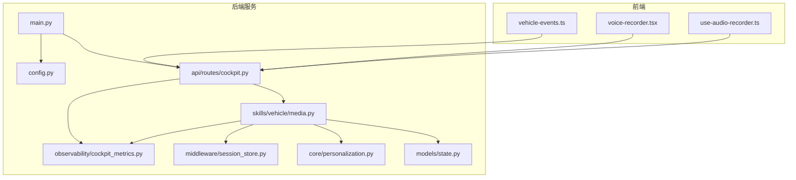
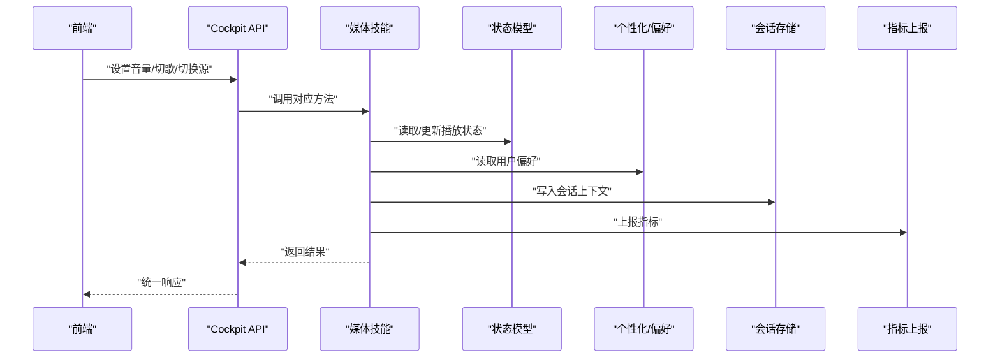
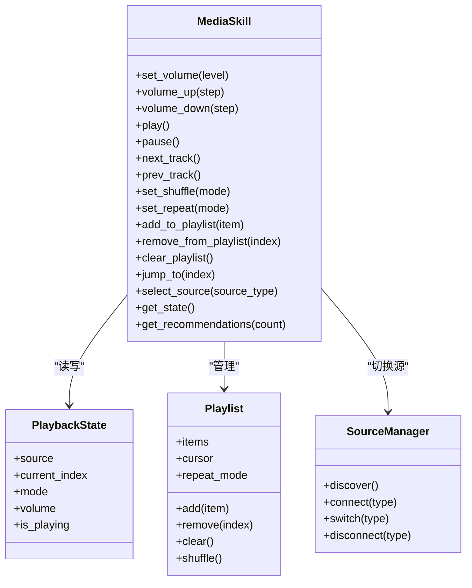
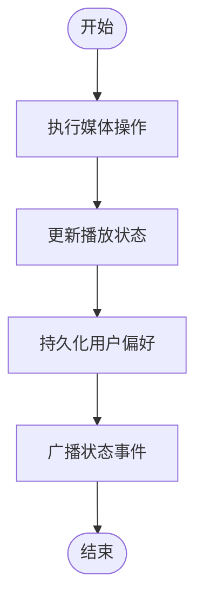
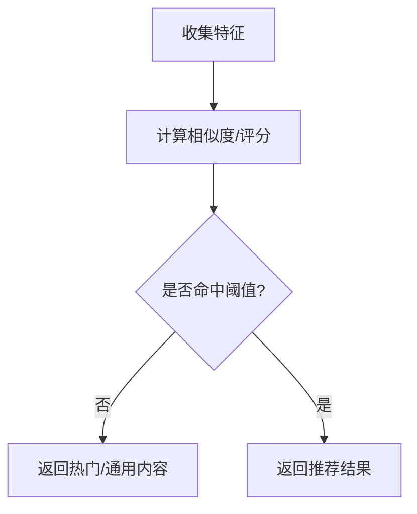
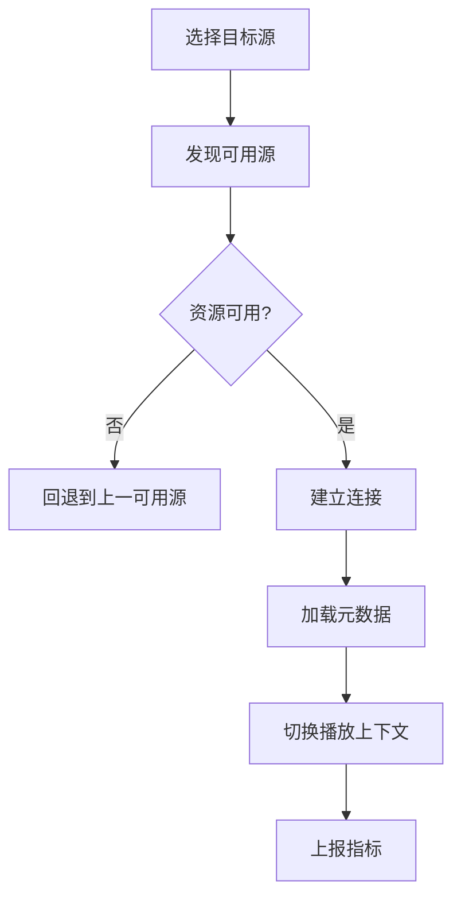
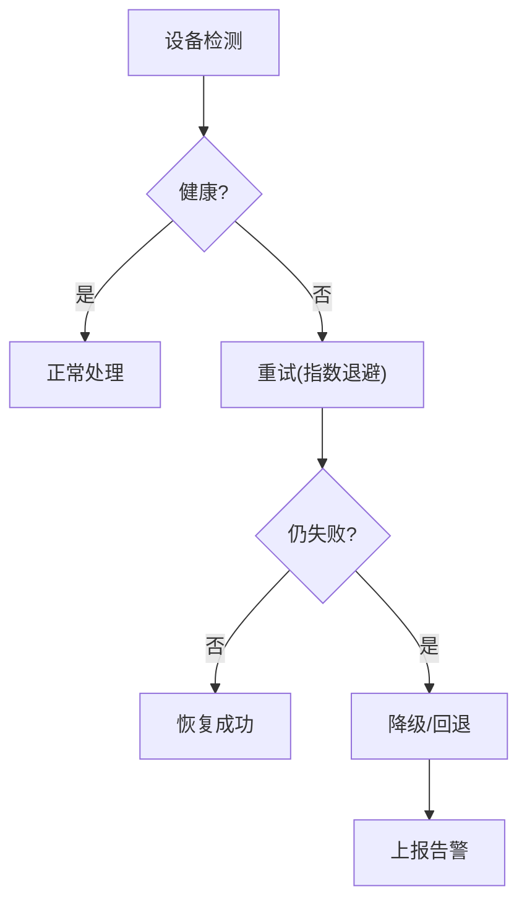
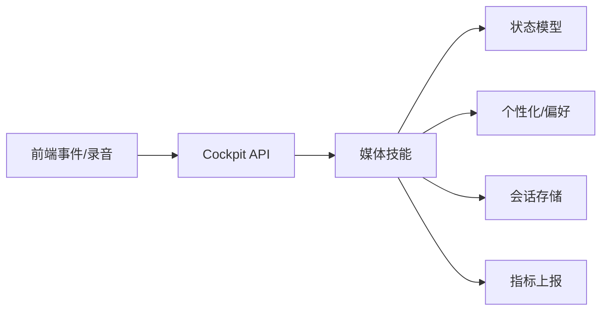

# 媒体播放控制

<cite>
**本文引用的文件**   
- [backend_design/nexus/skills/vehicle/media.py](file://backend_design/nexus/skills/vehicle/media.py)
- [backend_design/nexus/api/routes/cockpit.py](file://backend_design/nexus/api/routes/cockpit.py)
- [backend_design/nexus/core/personalization.py](file://backend_design/nexus/core/personalization.py)
- [backend_design/nexus/models/state.py](file://backend_design/nexus/models/state.py)
- [backend_design/nexus/middleware/session_store.py](file://backend_design/nexus/middleware/session_store.py)
- [backend_design/nexus/observability/cockpit_metrics.py](file://backend_design/nexus/observability/cockpit_metrics.py)
- [backend_design/nexus/config.py](file://backend_design/nexus/config.py)
- [backend_design/nexus/main.py](file://backend_design/nexus/main.py)
- [frontend_design/src/lib/vehicle-events.ts](file://frontend_design/src/lib/vehicle-events.ts)
- [frontend_design/src/components/voice-recorder.tsx](file://frontend_design/src/components/voice-recorder.tsx)
- [frontend_design/src/hooks/use-audio-recorder.ts](file://frontend_design/src/hooks/use-audio-recorder.ts)
</cite>

## 目录
1. [简介](#简介)
2. [项目结构](#项目结构)
3. [核心组件](#核心组件)
4. [架构总览](#架构总览)
5. [详细组件分析](#详细组件分析)
6. [依赖关系分析](#依赖关系分析)
7. [性能考虑](#性能考虑)
8. [故障排查指南](#故障排查指南)
9. [结论](#结论)
10. [附录：API 接口与使用示例](#附录api-接口与使用示例)

## 简介
本文件面向NexusCockpit的媒体播放控制系统，聚焦以下目标：
- 音量控制、曲目切换、播放列表管理等核心功能的实现细节
- 多媒体源管理（蓝牙、USB、在线流媒体）的集成方式与切换逻辑
- 播放状态同步、用户偏好记忆与智能推荐机制
- 完整的API接口文档与使用示例
- 音频设备检测与异常恢复策略

## 项目结构
围绕媒体播放控制的相关代码主要分布在后端技能层、API路由、状态与个性化配置、可观测性指标以及前端事件与录音能力中。下图给出与媒体播放相关的模块组织概览。

图表来源
- [backend_design/nexus/main.py](file://backend_design/nexus/main.py)
- [backend_design/nexus/config.py](file://backend_design/nexus/config.py)
- [backend_design/nexus/api/routes/cockpit.py](file://backend_design/nexus/api/routes/cockpit.py)
- [backend_design/nexus/skills/vehicle/media.py](file://backend_design/nexus/skills/vehicle/media.py)
- [backend_design/nexus/models/state.py](file://backend_design/nexus/models/state.py)
- [backend_design/nexus/core/personalization.py](file://backend_design/nexus/core/personalization.py)
- [backend_design/nexus/middleware/session_store.py](file://backend_design/nexus/middleware/session_store.py)
- [backend_design/nexus/observability/cockpit_metrics.py](file://backend_design/nexus/observability/cockpit_metrics.py)
- [frontend_design/src/lib/vehicle-events.ts](file://frontend_design/src/lib/vehicle-events.ts)
- [frontend_design/src/components/voice-recorder.tsx](file://frontend_design/src/components/voice-recorder.tsx)
- [frontend_design/src/hooks/use-audio-recorder.ts](file://frontend_design/src/hooks/use-audio-recorder.ts)

章节来源
- [backend_design/nexus/main.py](file://backend_design/nexus/main.py)
- [backend_design/nexus/config.py](file://backend_design/nexus/config.py)
- [backend_design/nexus/api/routes/cockpit.py](file://backend_design/nexus/api/routes/cockpit.py)
- [backend_design/nexus/skills/vehicle/media.py](file://backend_design/nexus/skills/vehicle/media.py)
- [backend_design/nexus/models/state.py](file://backend_design/nexus/models/state.py)
- [backend_design/nexus/core/personalization.py](file://backend_design/nexus/core/personalization.py)
- [backend_design/nexus/middleware/session_store.py](file://backend_design/nexus/middleware/session_store.py)
- [backend_design/nexus/observability/cockpit_metrics.py](file://backend_design/nexus/observability/cockpit_metrics.py)
- [frontend_design/src/lib/vehicle-events.ts](file://frontend_design/src/lib/vehicle-events.ts)
- [frontend_design/src/components/voice-recorder.tsx](file://frontend_design/src/components/voice-recorder.tsx)
- [frontend_design/src/hooks/use-audio-recorder.ts](file://frontend_design/src/hooks/use-audio-recorder.ts)

## 核心组件
- 媒体技能（Media Skill）
  - 职责：封装媒体播放控制的核心业务逻辑，包括音量调节、上一首/下一首、播放/暂停、随机/单曲循环、播放列表增删改查、多源选择与切换等。
  - 关键交互：读取/更新播放状态、持久化用户偏好、上报指标。
- 状态模型（State Model）
  - 职责：定义播放状态的数据结构与约束，如当前源、当前曲目索引、播放模式、音量等。
- 个性化与偏好（Personalization）
  - 职责：维护用户偏好（如默认源、最近播放、风格标签），为智能推荐提供输入。
- 会话存储（Session Store）
  - 职责：跨请求保存临时上下文（如最近操作、错误恢复标记）。
- 可观测性（Metrics）
  - 职责：记录媒体相关的关键指标（如切换失败率、延迟、错误码分布）。
- API 路由（Cockpit API）
  - 职责：暴露HTTP/WebSocket接口，将前端指令转发到媒体技能，并返回统一响应。
- 前端事件与录音
  - 职责：通过事件总线与后端交互；提供语音录制能力以支持语音控制媒体。

章节来源
- [backend_design/nexus/skills/vehicle/media.py](file://backend_design/nexus/skills/vehicle/media.py)
- [backend_design/nexus/models/state.py](file://backend_design/nexus/models/state.py)
- [backend_design/nexus/core/personalization.py](file://backend_design/nexus/core/personalization.py)
- [backend_design/nexus/middleware/session_store.py](file://backend_design/nexus/middleware/session_store.py)
- [backend_design/nexus/observability/cockpit_metrics.py](file://backend_design/nexus/observability/cockpit_metrics.py)
- [backend_design/nexus/api/routes/cockpit.py](file://backend_design/nexus/api/routes/cockpit.py)
- [frontend_design/src/lib/vehicle-events.ts](file://frontend_design/src/lib/vehicle-events.ts)
- [frontend_design/src/components/voice-recorder.tsx](file://frontend_design/src/components/voice-recorder.tsx)
- [frontend_design/src/hooks/use-audio-recorder.ts](file://frontend_design/src/hooks/use-audio-recorder.ts)

## 架构总览
媒体播放控制的端到端流程如下：前端通过事件或REST调用触发媒体操作，API路由校验参数后委托给媒体技能执行，媒体技能读写状态与偏好，并通过指标上报可观测数据。

图表来源
- [backend_design/nexus/api/routes/cockpit.py](file://backend_design/nexus/api/routes/cockpit.py)
- [backend_design/nexus/skills/vehicle/media.py](file://backend_design/nexus/skills/vehicle/media.py)
- [backend_design/nexus/models/state.py](file://backend_design/nexus/models/state.py)
- [backend_design/nexus/core/personalization.py](file://backend_design/nexus/core/personalization.py)
- [backend_design/nexus/middleware/session_store.py](file://backend_design/nexus/middleware/session_store.py)
- [backend_design/nexus/observability/cockpit_metrics.py](file://backend_design/nexus/observability/cockpit_metrics.py)

## 详细组件分析

### 媒体技能（Media Skill）
- 功能要点
  - 音量控制：支持绝对值设置与相对增减，包含边界钳制与权限校验。
  - 曲目切换：上一首/下一首、随机播放、单曲循环、顺序播放。
  - 播放列表管理：新增、删除、清空、排序、跳转至指定索引。
  - 多媒体源管理：蓝牙、USB、在线流媒体三种源的发现、连接、切换与回退。
  - 播放状态同步：在状态变更时广播最新状态，保证前后端一致。
  - 用户偏好记忆：记住最近使用的源、常用播放列表、音量上限等。
  - 智能推荐：基于偏好与历史行为生成推荐曲目或播放列表。
- 关键数据结构
  - 播放状态：当前源、当前曲目索引、播放模式、音量、是否正在播放等。
  - 播放列表：条目集合（含元数据）、游标、重复模式。
  - 源信息：类型、名称、连接状态、可用曲目数。
- 复杂度与优化
  - 播放列表操作尽量采用惰性加载与分页，避免全量扫描。
  - 源切换采用幂等设计，减少重复初始化开销。
  - 指标上报异步化，避免阻塞主流程。

图表来源
- [backend_design/nexus/skills/vehicle/media.py](file://backend_design/nexus/skills/vehicle/media.py)
- [backend_design/nexus/models/state.py](file://backend_design/nexus/models/state.py)

章节来源
- [backend_design/nexus/skills/vehicle/media.py](file://backend_design/nexus/skills/vehicle/media.py)
- [backend_design/nexus/models/state.py](file://backend_design/nexus/models/state.py)

### 播放状态同步与用户偏好记忆
- 状态同步
  - 当媒体技能完成一次操作后，会更新内部状态并触发状态广播，前端订阅该事件以刷新UI。
  - 状态变更包含最小必要字段，降低网络负载。
- 偏好记忆
  - 根据用户历史行为与显式设置，持久化偏好（如默认源、音量上限、常用列表）。
  - 偏好更新采用增量合并策略，避免覆盖其他维度的设置。

图表来源
- [backend_design/nexus/skills/vehicle/media.py](file://backend_design/nexus/skills/vehicle/media.py)
- [backend_design/nexus/core/personalization.py](file://backend_design/nexus/core/personalization.py)

章节来源
- [backend_design/nexus/skills/vehicle/media.py](file://backend_design/nexus/skills/vehicle/media.py)
- [backend_design/nexus/core/personalization.py](file://backend_design/nexus/core/personalization.py)

### 智能推荐机制
- 输入特征
  - 用户偏好（风格、艺人、语言）
  - 近期播放历史（时间衰减权重）
  - 场景上下文（时间段、驾驶模式）
- 输出
  - 候选曲目或播放列表片段
- 策略
  - 基于规则与轻量模型的混合策略，优先保证低延迟与稳定性。
  - 冷启动时使用热门与通用内容兜底。

图表来源
- [backend_design/nexus/skills/vehicle/media.py](file://backend_design/nexus/skills/vehicle/media.py)
- [backend_design/nexus/core/personalization.py](file://backend_design/nexus/core/personalization.py)

章节来源
- [backend_design/nexus/skills/vehicle/media.py](file://backend_design/nexus/skills/vehicle/media.py)
- [backend_design/nexus/core/personalization.py](file://backend_design/nexus/core/personalization.py)

### 多媒体源管理与切换逻辑
- 源类型
  - 蓝牙：车载蓝牙设备，支持A2DP/HFP协议。
  - USB：本地U盘媒体库，支持常见音频格式。
  - 在线流媒体：网络音乐服务，支持鉴权与缓存。
- 切换流程
  - 发现可用源 -> 校验权限与资源可用性 -> 建立连接 -> 加载元数据 -> 切换播放上下文 -> 上报指标。
- 回退策略
  - 若目标源不可用，自动回退到上一个可用源或默认源。

图表来源
- [backend_design/nexus/skills/vehicle/media.py](file://backend_design/nexus/skills/vehicle/media.py)

章节来源
- [backend_design/nexus/skills/vehicle/media.py](file://backend_design/nexus/skills/vehicle/media.py)

### 音频设备检测与异常恢复
- 设备检测
  - 周期性探测蓝牙/USB/在线服务的可达性与状态。
  - 对异常状态进行分级（警告/严重）并触发告警。
- 异常恢复
  - 自动重试与指数退避。
  - 降级策略：切换到备用源或启用本地缓存。
  - 会话级错误标记，避免在错误未恢复前继续操作。

图表来源
- [backend_design/nexus/skills/vehicle/media.py](file://backend_design/nexus/skills/vehicle/media.py)
- [backend_design/nexus/middleware/session_store.py](file://backend_design/nexus/middleware/session_store.py)
- [backend_design/nexus/observability/cockpit_metrics.py](file://backend_design/nexus/observability/cockpit_metrics.py)

章节来源
- [backend_design/nexus/skills/vehicle/media.py](file://backend_design/nexus/skills/vehicle/media.py)
- [backend_design/nexus/middleware/session_store.py](file://backend_design/nexus/middleware/session_store.py)
- [backend_design/nexus/observability/cockpit_metrics.py](file://backend_design/nexus/observability/cockpit_metrics.py)

## 依赖关系分析
媒体播放控制涉及的模块耦合关系如下：API路由依赖媒体技能；媒体技能依赖状态模型、个性化、会话存储与指标上报；前端通过事件与API交互。

图表来源
- [backend_design/nexus/api/routes/cockpit.py](file://backend_design/nexus/api/routes/cockpit.py)
- [backend_design/nexus/skills/vehicle/media.py](file://backend_design/nexus/skills/vehicle/media.py)
- [backend_design/nexus/models/state.py](file://backend_design/nexus/models/state.py)
- [backend_design/nexus/core/personalization.py](file://backend_design/nexus/core/personalization.py)
- [backend_design/nexus/middleware/session_store.py](file://backend_design/nexus/middleware/session_store.py)
- [backend_design/nexus/observability/cockpit_metrics.py](file://backend_design/nexus/observability/cockpit_metrics.py)
- [frontend_design/src/lib/vehicle-events.ts](file://frontend_design/src/lib/vehicle-events.ts)
- [frontend_design/src/components/voice-recorder.tsx](file://frontend_design/src/components/voice-recorder.tsx)
- [frontend_design/src/hooks/use-audio-recorder.ts](file://frontend_design/src/hooks/use-audio-recorder.ts)

章节来源
- [backend_design/nexus/api/routes/cockpit.py](file://backend_design/nexus/api/routes/cockpit.py)
- [backend_design/nexus/skills/vehicle/media.py](file://backend_design/nexus/skills/vehicle/media.py)
- [backend_design/nexus/models/state.py](file://backend_design/nexus/models/state.py)
- [backend_design/nexus/core/personalization.py](file://backend_design/nexus/core/personalization.py)
- [backend_design/nexus/middleware/session_store.py](file://backend_design/nexus/middleware/session_store.py)
- [backend_design/nexus/observability/cockpit_metrics.py](file://backend_design/nexus/observability/cockpit_metrics.py)
- [frontend_design/src/lib/vehicle-events.ts](file://frontend_design/src/lib/vehicle-events.ts)
- [frontend_design/src/components/voice-recorder.tsx](file://frontend_design/src/components/voice-recorder.tsx)
- [frontend_design/src/hooks/use-audio-recorder.ts](file://frontend_design/src/hooks/use-audio-recorder.ts)

## 性能考虑
- 批量操作：播放列表增删建议批量提交，减少往返次数。
- 懒加载：大列表分页加载，按需获取元数据。
- 异步上报：指标与日志异步写入，避免阻塞主路径。
- 缓存策略：在线流媒体元数据与封面图缓存，提升首屏速度。
- 连接复用：在线服务保持长连接，减少握手开销。

## 故障排查指南
- 常见问题定位
  - 无法切换源：检查设备检测与连接状态，查看会话中的错误标记。
  - 音量无变化：确认权限与边界钳制逻辑，核对指标中的错误码。
  - 推荐不生效：验证偏好是否更新，检查推荐输入特征是否完整。
- 诊断手段
  - 查看指标面板，关注切换失败率与延迟。
  - 检查会话上下文，确认错误恢复标记是否清除。
  - 复现步骤：记录操作序列与前后端日志，定位断点。

章节来源
- [backend_design/nexus/observability/cockpit_metrics.py](file://backend_design/nexus/observability/cockpit_metrics.py)
- [backend_design/nexus/middleware/session_store.py](file://backend_design/nexus/middleware/session_store.py)
- [backend_design/nexus/skills/vehicle/media.py](file://backend_design/nexus/skills/vehicle/media.py)

## 结论
媒体播放控制系统以媒体技能为核心，结合状态模型、个性化偏好与会话存储，实现了稳定的音量控制、曲目切换与播放列表管理。通过完善的源管理与异常恢复策略，系统能够在复杂环境下保持良好体验。配合前端事件与录音能力，提供了便捷的语音与界面交互入口。

## 附录：API 接口与使用示例
以下为媒体播放控制相关API的说明与使用示例（概念性描述，具体字段以实际实现为准）：

- 设置音量
  - 方法：POST /api/cockpit/media/volume
  - 请求体：{ "level": 数值, "step": 可选数值 }
  - 响应：{ "status": "ok", "volume": 数值 }
  - 示例：设置音量为50；相对增加5

- 播放控制
  - 方法：POST /api/cockpit/media/play | pause | next | prev
  - 响应：{ "status": "ok", "state": 对象 }
  - 示例：播放当前列表；下一首

- 播放模式
  - 方法：POST /api/cockpit/media/mode
  - 请求体：{ "shuffle": 布尔, "repeat": "none|single|all" }
  - 响应：{ "status": "ok", "mode": 对象 }
  - 示例：开启随机播放；设置为单曲循环

- 播放列表管理
  - 方法：POST /api/cockpit/media/playlist/add | remove | clear | jump
  - 请求体：依据操作不同传入索引或条目ID
  - 响应：{ "status": "ok", "playlist": 对象 }
  - 示例：添加曲目到列表；跳转到第3首

- 源切换
  - 方法：POST /api/cockpit/media/source/select
  - 请求体：{ "type": "bluetooth|usb|streaming" }
  - 响应：{ "status": "ok", "source": 对象 }
  - 示例：切换到在线流媒体

- 获取状态与推荐
  - 方法：GET /api/cockpit/media/state | GET /api/cockpit/media/recommendations?count=5
  - 响应：{ "status": "ok", "state": 对象 } 或 { "status": "ok", "recommendations": [曲目] }
  - 示例：获取当前播放状态；获取5条推荐

- 前端事件与录音
  - 事件：通过 vehicle-events.ts 订阅媒体状态变更事件
  - 录音：voice-recorder.tsx 与 use-audio-recorder.ts 提供语音录制能力，用于语音控制媒体

章节来源
- [backend_design/nexus/api/routes/cockpit.py](file://backend_design/nexus/api/routes/cockpit.py)
- [frontend_design/src/lib/vehicle-events.ts](file://frontend_design/src/lib/vehicle-events.ts)
- [frontend_design/src/components/voice-recorder.tsx](file://frontend_design/src/components/voice-recorder.tsx)
- [frontend_design/src/hooks/use-audio-recorder.ts](file://frontend_design/src/hooks/use-audio-recorder.ts)