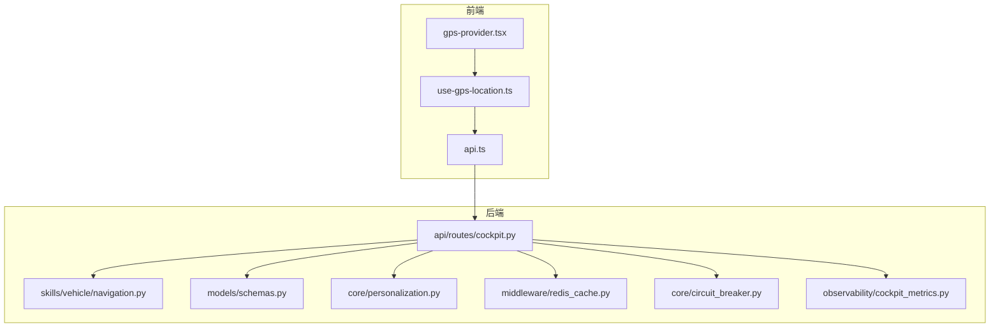
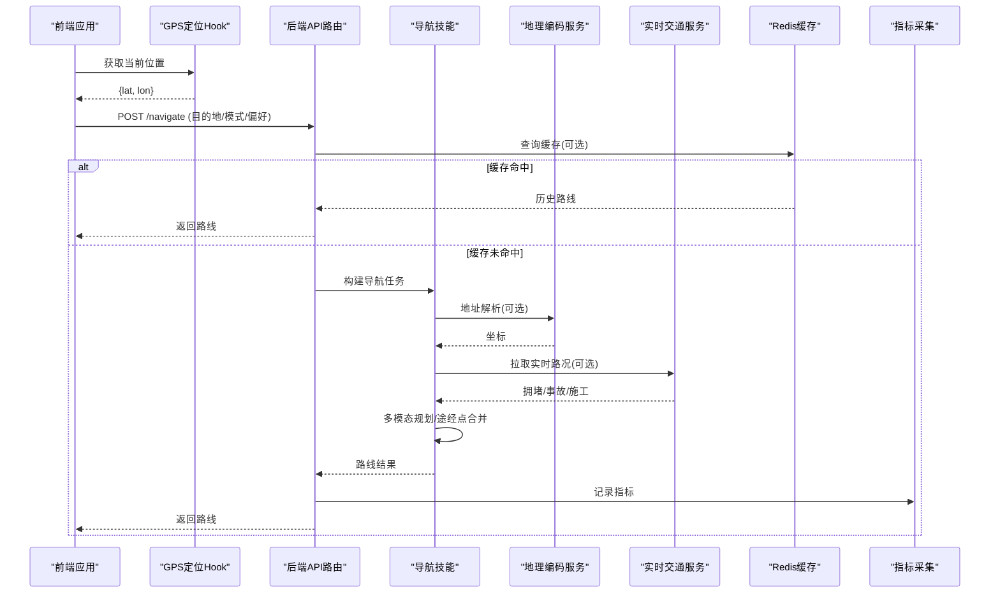
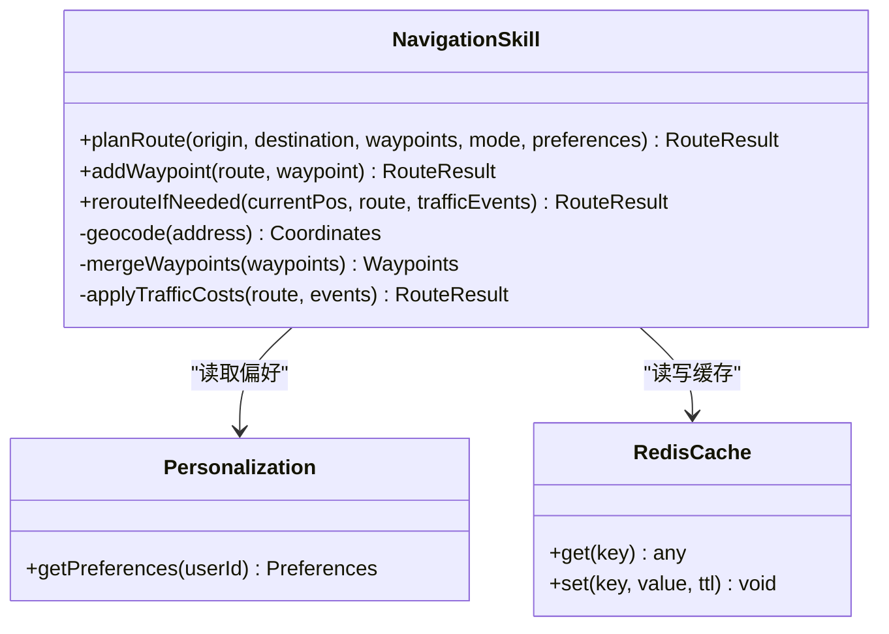
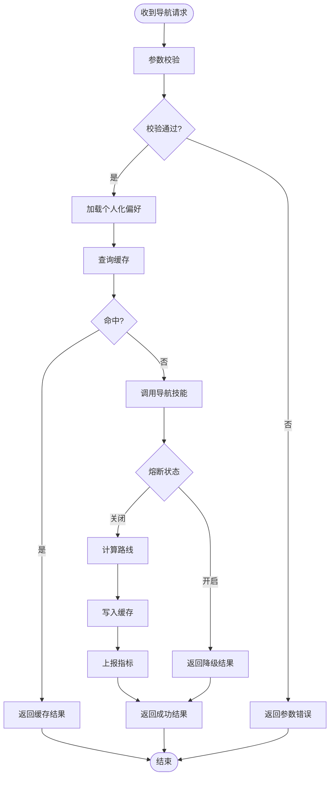
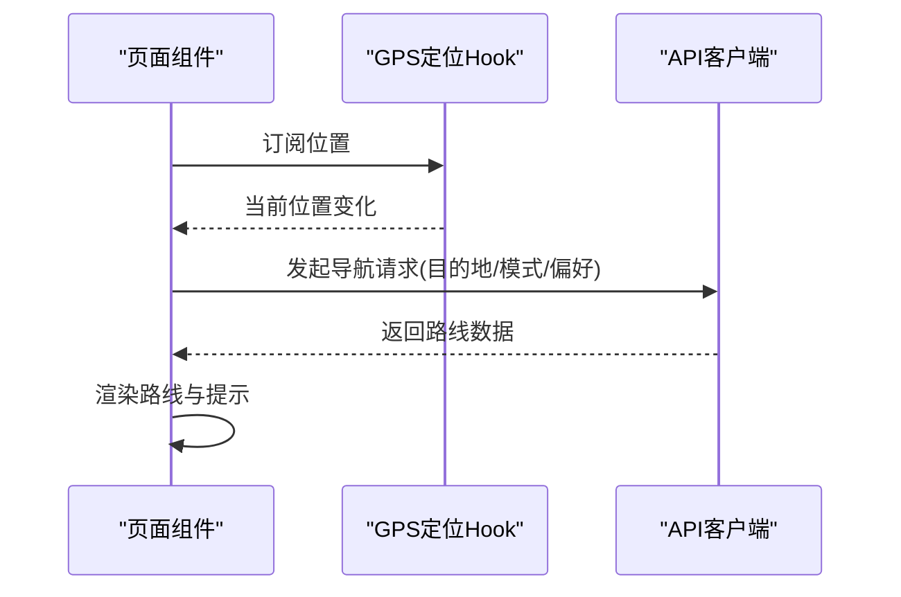
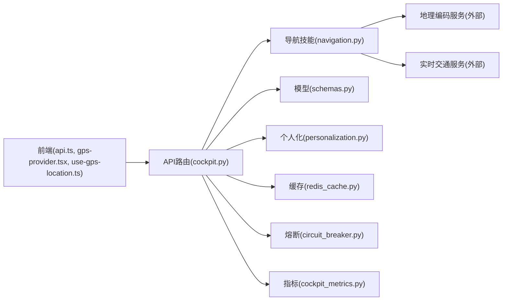

# 导航控制系统

<cite>
**本文引用的文件**   
- [backend_design/nexus/skills/vehicle/navigation.py](file://backend_design/nexus/skills/vehicle/navigation.py)
- [backend_design/nexus/api/routes/cockpit.py](file://backend_design/nexus/api/routes/cockpit.py)
- [backend_design/nexus/core/personalization.py](file://backend_design/nexus/core/personalization.py)
- [backend_design/nexus/models/schemas.py](file://backend_design/nexus/models/schemas.py)
- [frontend_design/src/components/layout/gps-provider.tsx](file://frontend_design/src/components/layout/gps-provider.tsx)
- [frontend_design/src/hooks/use-gps-location.ts](file://frontend_design/src/hooks/use-gps-location.ts)
- [frontend_design/src/lib/api.ts](file://frontend_design/src/lib/api.ts)
- [backend_design/nexus/middleware/redis_cache.py](file://backend_design/nexus/middleware/redis_cache.py)
- [backend_design/nexus/core/circuit_breaker.py](file://backend_design/nexus/core/circuit_breaker.py)
- [backend_design/nexus/observability/cockpit_metrics.py](file://backend_design/nexus/observability/cockpit_metrics.py)
</cite>

## 目录
1. [简介](#简介)
2. [项目结构](#项目结构)
3. [核心组件](#核心组件)
4. [架构总览](#架构总览)
5. [详细组件分析](#详细组件分析)
6. [依赖关系分析](#依赖关系分析)
7. [性能考虑](#性能考虑)
8. [故障排查指南](#故障排查指南)
9. [结论](#结论)
10. [附录](#附录)

## 简介
本文件面向NexusCockpit的导航控制系统，聚焦以下目标：
- 目的地输入、路线规划与途经点添加的实现原理
- 地理编码服务集成、实时交通信息处理与动态重规划机制
- 多模态导航支持（驾车、步行、公共交通）与个性化偏好设置
- 导航API接口说明与前端集成示例
- 离线地图支持与位置隐私保护策略

## 项目结构
导航相关能力由后端技能层、API路由层、模型定义、前端定位与API调用等模块协同完成。关键路径如下：
- 后端技能层：车辆技能中的导航能力封装
- API路由层：暴露导航相关的HTTP接口
- 模型层：统一的数据结构与校验
- 前端：GPS定位提供器、定位Hook与API客户端
- 中间件与可观测性：缓存、熔断、指标采集

图表来源
- [frontend_design/src/components/layout/gps-provider.tsx](file://frontend_design/src/components/layout/gps-provider.tsx)
- [frontend_design/src/hooks/use-gps-location.ts](file://frontend_design/src/hooks/use-gps-location.ts)
- [frontend_design/src/lib/api.ts](file://frontend_design/src/lib/api.ts)
- [backend_design/nexus/api/routes/cockpit.py](file://backend_design/nexus/api/routes/cockpit.py)
- [backend_design/nexus/skills/vehicle/navigation.py](file://backend_design/nexus/skills/vehicle/navigation.py)
- [backend_design/nexus/models/schemas.py](file://backend_design/nexus/models/schemas.py)
- [backend_design/nexus/core/personalization.py](file://backend_design/nexus/core/personalization.py)
- [backend_design/nexus/middleware/redis_cache.py](file://backend_design/nexus/middleware/redis_cache.py)
- [backend_design/nexus/core/circuit_breaker.py](file://backend_design/nexus/core/circuit_breaker.py)
- [backend_design/nexus/observability/cockpit_metrics.py](file://backend_design/nexus/observability/cockpit_metrics.py)

章节来源
- [backend_design/nexus/skills/vehicle/navigation.py](file://backend_design/nexus/skills/vehicle/navigation.py)
- [backend_design/nexus/api/routes/cockpit.py](file://backend_design/nexus/api/routes/cockpit.py)
- [backend_design/nexus/models/schemas.py](file://backend_design/nexus/models/schemas.py)
- [frontend_design/src/components/layout/gps-provider.tsx](file://frontend_design/src/components/layout/gps-provider.tsx)
- [frontend_design/src/hooks/use-gps-location.ts](file://frontend_design/src/hooks/use-gps-location.ts)
- [frontend_design/src/lib/api.ts](file://frontend_design/src/lib/api.ts)

## 核心组件
- 导航技能（Navigation Skill）
  - 职责：封装目的地解析、地理编码、路线规划、途经点管理、多模态选择、重规划触发与结果聚合
  - 关键点：对外暴露结构化方法；内部组合外部地图/导航服务；对异常进行降级与重试
- API路由（Cockpit Routes）
  - 职责：接收前端请求，参数校验，调用导航技能，返回标准化响应
  - 关键点：结合个人化配置与缓存；接入熔断与指标上报
- 数据模型（Schemas）
  - 职责：定义输入输出结构、枚举值、必填字段与约束
- 个人化（Personalization）
  - 职责：读取用户偏好（如驾驶风格、是否避开高速、公共交通优先等），影响路线权重与模式选择
- 前端定位与API
  - 职责：获取设备位置、发起导航请求、展示路线与提示

章节来源
- [backend_design/nexus/skills/vehicle/navigation.py](file://backend_design/nexus/skills/vehicle/navigation.py)
- [backend_design/nexus/api/routes/cockpit.py](file://backend_design/nexus/api/routes/cockpit.py)
- [backend_design/nexus/models/schemas.py](file://backend_design/nexus/models/schemas.py)
- [backend_design/nexus/core/personalization.py](file://backend_design/nexus/core/personalization.py)
- [frontend_design/src/hooks/use-gps-location.ts](file://frontend_design/src/hooks/use-gps-location.ts)
- [frontend_design/src/lib/api.ts](file://frontend_design/src/lib/api.ts)

## 架构总览
导航控制系统的端到端流程：
- 前端通过GPS Hook获取当前位置，使用API客户端向后端发起导航请求
- 后端路由层校验参数并加载个人化配置，必要时命中缓存
- 导航技能执行地理编码、路线规划、途经点合并与多模态计算
- 若检测到实时交通事件或用户变更，触发动态重规划
- 结果经熔断保护与指标采集后返回前端

图表来源
- [frontend_design/src/hooks/use-gps-location.ts](file://frontend_design/src/hooks/use-gps-location.ts)
- [frontend_design/src/lib/api.ts](file://frontend_design/src/lib/api.ts)
- [backend_design/nexus/api/routes/cockpit.py](file://backend_design/nexus/api/routes/cockpit.py)
- [backend_design/nexus/skills/vehicle/navigation.py](file://backend_design/nexus/skills/vehicle/navigation.py)
- [backend_design/nexus/middleware/redis_cache.py](file://backend_design/nexus/middleware/redis_cache.py)
- [backend_design/nexus/observability/cockpit_metrics.py](file://backend_design/nexus/observability/cockpit_metrics.py)

## 详细组件分析

### 导航技能（Navigation Skill）
- 功能要点
  - 目的地输入：支持文本地址与坐标；内部进行地理编码与坐标规范化
  - 路线规划：根据出行模式（驾车/步行/公共交通）与偏好生成候选路线
  - 途经点添加：在已有路线上插入途经点并重新排序与优化
  - 实时交通：融合拥堵、事故、施工等信息进行代价调整
  - 动态重规划：基于位置更新、时间阈值或事件触发进行增量重算
- 数据结构
  - 输入：起点、终点、途经点列表、出行模式、偏好选项、时间窗口
  - 输出：路段序列、预计到达时间、距离、耗时、转向提示、备选方案
- 错误与降级
  - 地理编码失败：回退到最近已知坐标或提示用户修正
  - 外部服务不可用：启用熔断与本地缓存，返回近似路线或延迟提示

图表来源
- [backend_design/nexus/skills/vehicle/navigation.py](file://backend_design/nexus/skills/vehicle/navigation.py)
- [backend_design/nexus/core/personalization.py](file://backend_design/nexus/core/personalization.py)
- [backend_design/nexus/middleware/redis_cache.py](file://backend_design/nexus/middleware/redis_cache.py)

章节来源
- [backend_design/nexus/skills/vehicle/navigation.py](file://backend_design/nexus/skills/vehicle/navigation.py)
- [backend_design/nexus/core/personalization.py](file://backend_design/nexus/core/personalization.py)
- [backend_design/nexus/middleware/redis_cache.py](file://backend_design/nexus/middleware/redis_cache.py)

### API路由（Cockpit Routes）
- 职责
  - 接收导航请求，校验参数，组装上下文（含用户ID与偏好）
  - 调用导航技能，处理缓存与熔断，记录指标
- 关键流程
  - 参数校验：依据模型定义检查必填字段与取值范围
  - 缓存策略：以“起点-终点-模式-偏好”为键命中缓存
  - 熔断保护：当外部服务异常时快速失败并返回降级结果
  - 指标上报：记录请求耗时、成功率、缓存命中率等

图表来源
- [backend_design/nexus/api/routes/cockpit.py](file://backend_design/nexus/api/routes/cockpit.py)
- [backend_design/nexus/models/schemas.py](file://backend_design/nexus/models/schemas.py)
- [backend_design/nexus/middleware/redis_cache.py](file://backend_design/nexus/middleware/redis_cache.py)
- [backend_design/nexus/core/circuit_breaker.py](file://backend_design/nexus/core/circuit_breaker.py)
- [backend_design/nexus/observability/cockpit_metrics.py](file://backend_design/nexus/observability/cockpit_metrics.py)

章节来源
- [backend_design/nexus/api/routes/cockpit.py](file://backend_design/nexus/api/routes/cockpit.py)
- [backend_design/nexus/models/schemas.py](file://backend_design/nexus/models/schemas.py)
- [backend_design/nexus/middleware/redis_cache.py](file://backend_design/nexus/middleware/redis_cache.py)
- [backend_design/nexus/core/circuit_breaker.py](file://backend_design/nexus/core/circuit_breaker.py)
- [backend_design/nexus/observability/cockpit_metrics.py](file://backend_design/nexus/observability/cockpit_metrics.py)

### 前端定位与API集成
- GPS定位
  - 提供器：集中管理定位权限与位置订阅
  - Hook：封装位置获取逻辑，供页面与组件复用
- API客户端
  - 统一封装导航相关接口，携带用户上下文与错误处理
- 集成示例
  - 页面初始化时订阅位置，用户输入目的地后调用导航接口，渲染路线与提示

图表来源
- [frontend_design/src/components/layout/gps-provider.tsx](file://frontend_design/src/components/layout/gps-provider.tsx)
- [frontend_design/src/hooks/use-gps-location.ts](file://frontend_design/src/hooks/use-gps-location.ts)
- [frontend_design/src/lib/api.ts](file://frontend_design/src/lib/api.ts)

章节来源
- [frontend_design/src/components/layout/gps-provider.tsx](file://frontend_design/src/components/layout/gps-provider.tsx)
- [frontend_design/src/hooks/use-gps-location.ts](file://frontend_design/src/hooks/use-gps-location.ts)
- [frontend_design/src/lib/api.ts](file://frontend_design/src/lib/api.ts)

## 依赖关系分析
- 组件耦合
  - API路由依赖导航技能、模型、缓存、熔断与指标
  - 导航技能依赖个人化与缓存，间接依赖外部地理编码与交通服务
  - 前端依赖定位Hook与API客户端
- 外部依赖
  - 地理编码服务：用于地址解析与坐标规范化
  - 实时交通服务：提供拥堵、事故、施工等事件
  - 缓存与指标：提升性能与可观测性

图表来源
- [frontend_design/src/lib/api.ts](file://frontend_design/src/lib/api.ts)
- [frontend_design/src/components/layout/gps-provider.tsx](file://frontend_design/src/components/layout/gps-provider.tsx)
- [frontend_design/src/hooks/use-gps-location.ts](file://frontend_design/src/hooks/use-gps-location.ts)
- [backend_design/nexus/api/routes/cockpit.py](file://backend_design/nexus/api/routes/cockpit.py)
- [backend_design/nexus/skills/vehicle/navigation.py](file://backend_design/nexus/skills/vehicle/navigation.py)
- [backend_design/nexus/models/schemas.py](file://backend_design/nexus/models/schemas.py)
- [backend_design/nexus/core/personalization.py](file://backend_design/nexus/core/personalization.py)
- [backend_design/nexus/middleware/redis_cache.py](file://backend_design/nexus/middleware/redis_cache.py)
- [backend_design/nexus/core/circuit_breaker.py](file://backend_design/nexus/core/circuit_breaker.py)
- [backend_design/nexus/observability/cockpit_metrics.py](file://backend_design/nexus/observability/cockpit_metrics.py)

章节来源
- [backend_design/nexus/api/routes/cockpit.py](file://backend_design/nexus/api/routes/cockpit.py)
- [backend_design/nexus/skills/vehicle/navigation.py](file://backend_design/nexus/skills/vehicle/navigation.py)
- [backend_design/nexus/models/schemas.py](file://backend_design/nexus/models/schemas.py)
- [frontend_design/src/lib/api.ts](file://frontend_design/src/lib/api.ts)

## 性能考虑
- 缓存策略
  - 以“起点-终点-模式-偏好”为键，合理设置TTL，减少重复计算
- 熔断与限流
  - 外部服务异常时快速失败，避免雪崩；结合重试与退避策略
- 指标与监控
  - 记录关键指标（耗时、成功率、缓存命中率、重规划次数）
- 前端优化
  - 去抖与节流位置更新；按需刷新路线；离线降级显示

[本节为通用指导，不直接分析具体文件]

## 故障排查指南
- 常见问题
  - 地理编码失败：检查地址格式与网络连通性；查看降级策略是否生效
  - 实时交通不可用：确认熔断状态与缓存是否返回近似结果
  - 重规划频繁：检查位置更新频率与时间阈值配置
- 定位问题
  - 权限未授予：引导用户授权；检查定位Hook的错误分支
- 日志与指标
  - 查看指标面板中导航相关指标；核对错误码与堆栈

章节来源
- [backend_design/nexus/core/circuit_breaker.py](file://backend_design/nexus/core/circuit_breaker.py)
- [backend_design/nexus/observability/cockpit_metrics.py](file://backend_design/nexus/observability/cockpit_metrics.py)
- [frontend_design/src/hooks/use-gps-location.ts](file://frontend_design/src/hooks/use-gps-location.ts)

## 结论
本导航控制系统通过清晰的技能分层、稳健的API路由与完善的前端定位集成，实现了从目的地输入到动态重规划的完整闭环。借助缓存、熔断与指标体系，系统在可用性与性能之间取得平衡。后续可在多模态算法、离线地图与隐私保护方面持续增强。

[本节为总结，不直接分析具体文件]

## 附录

### 导航API接口说明（建议）
- 基础路径
  - /api/v1/navigate
- 请求体（示例字段）
  - origin: 起点（坐标或地址）
  - destination: 终点（坐标或地址）
  - waypoints: 途经点数组（可选）
  - mode: 出行模式（驾车/步行/公共交通）
  - preferences: 偏好（避开高速、少收费、公共交通优先等）
  - user_id: 用户标识（用于加载偏好）
- 响应体（示例字段）
  - route: 路线对象（路段、距离、耗时、ETA）
  - alternatives: 备选方案
  - traffic_events: 实时交通事件摘要
  - status: 状态码与消息
- 错误码
  - 400: 参数校验失败
  - 500: 内部服务异常
  - 503: 外部服务不可用（熔断）

[本节为接口规范建议，不直接分析具体文件]

### 离线地图与隐私保护策略
- 离线地图
  - 预下载区域地图数据；前端缓存常用路线片段；断网时仅展示静态路线
- 位置隐私
  - 最小化收集原则；默认匿名化处理；用户可关闭位置共享；敏感数据加密存储与传输

[本节为策略建议，不直接分析具体文件]