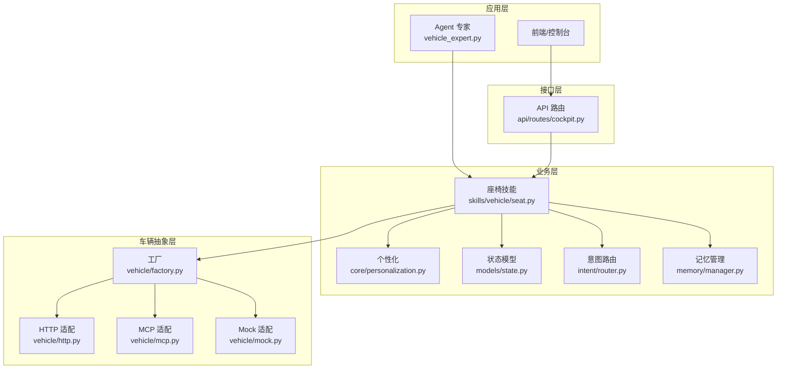
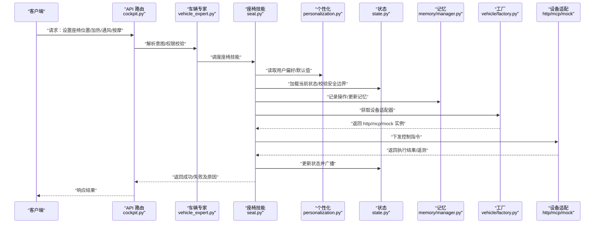
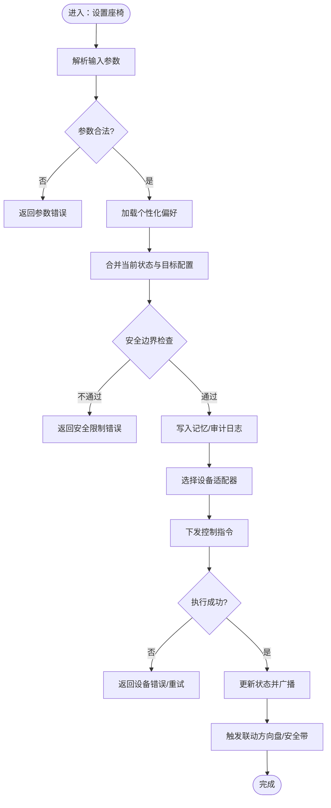
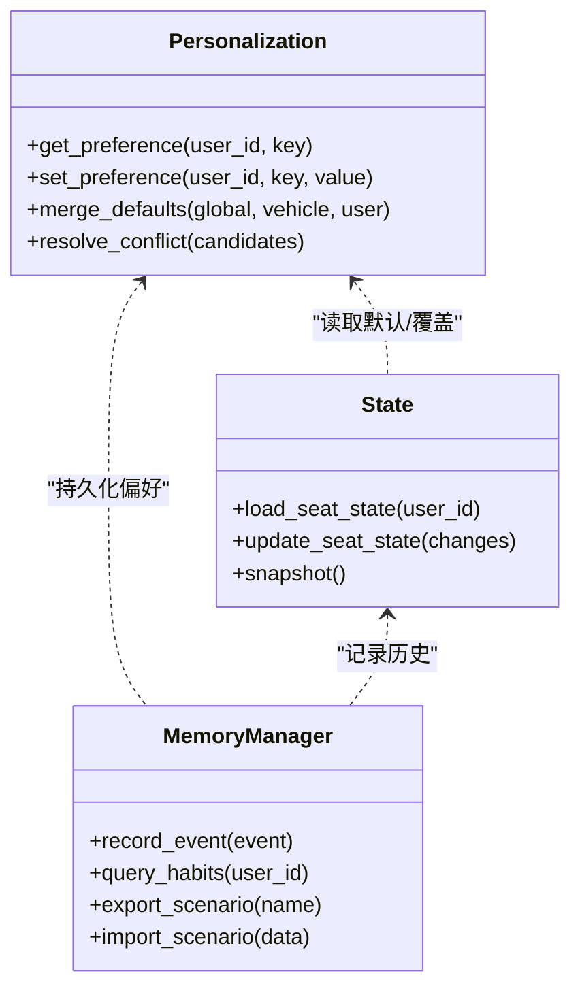
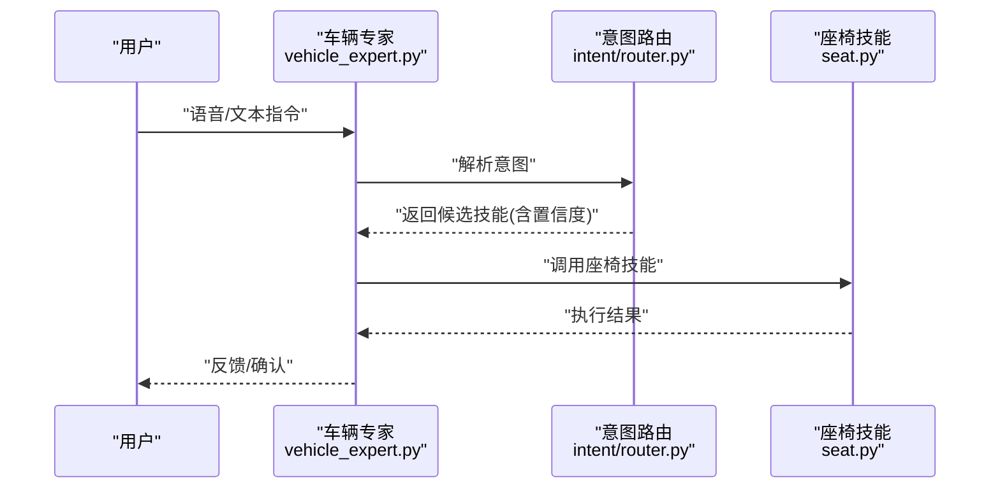
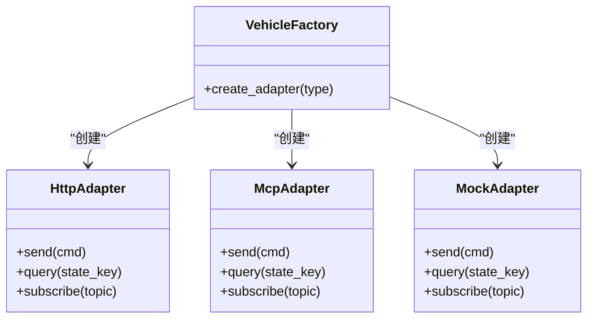
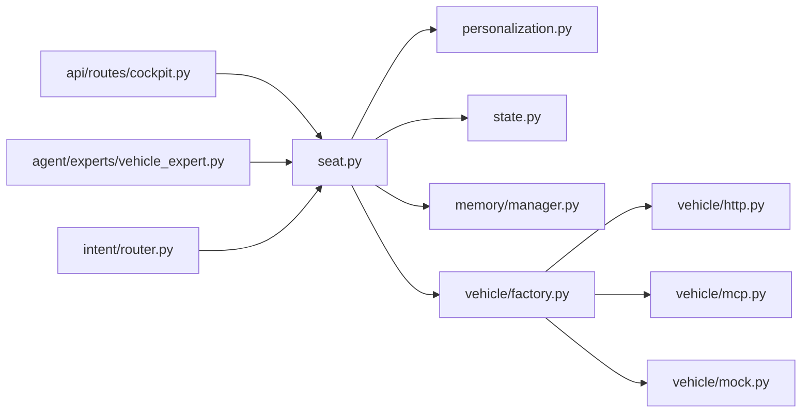

# 座椅控制系统

<cite>
**本文引用的文件**   
- [backend_design/nexus/skills/vehicle/seat.py](file://backend_design/nexus/skills/vehicle/seat.py)
- [backend_design/nexus/api/routes/cockpit.py](file://backend_design/nexus/api/routes/cockpit.py)
- [backend_design/nexus/core/personalization.py](file://backend_design/nexus/core/personalization.py)
- [backend_design/nexus/models/state.py](file://backend_design/nexus/models/state.py)
- [backend_design/nexus/vehicle/factory.py](file://backend_design/nexus/vehicle/factory.py)
- [backend_design/nexus/vehicle/http.py](file://backend_design/nexus/vehicle/http.py)
- [backend_design/nexus/vehicle/mcp.py](file://backend_design/nexus/vehicle/mcp.py)
- [backend_design/nexus/vehicle/mock.py](file://backend_design/nexus/vehicle/mock.py)
- [backend_design/nexus/agent/experts/vehicle_expert.py](file://backend_design/nexus/agent/experts/vehicle_expert.py)
- [backend_design/nexus/intent/router.py](file://backend_design/nexus/intent/router.py)
- [backend_design/nexus/memory/manager.py](file://backend_design/nexus/memory/manager.py)
- [backend_design/nexus/core/logger.py](file://backend_design/nexus/core/logger.py)
- [backend_design/nexus/core/exceptions.py](file://backend_design/nexus/core/exceptions.py)
</cite>

## 目录
1. [简介](#简介)
2. [项目结构](#项目结构)
3. [核心组件](#核心组件)
4. [架构总览](#架构总览)
5. [详细组件分析](#详细组件分析)
6. [依赖关系分析](#依赖关系分析)
7. [性能考虑](#性能考虑)
8. [故障诊断指南](#故障诊断指南)
9. [结论](#结论)
10. [附录](#附录)

## 简介
本文件为 NexusCockpit 的“座椅控制系统”提供系统化技术文档。内容覆盖：
- 座椅位置调整、加热/通风、按摩模式等核心特性
- 多用户记忆配置与冲突处理
- 安全限位保护与防夹检测机制（概念性说明）
- 与车辆其他系统的联动控制（如方向盘联动、安全带提醒）
- 面向上层应用的 API 接口规范与硬件通信协议说明
- 安全最佳实践与故障诊断指南

## 项目结构
与座椅控制直接相关的代码主要位于后端 Python 服务中，围绕“技能（Skill）—意图路由—专家（Expert）—车辆抽象层”的分层组织展开。关键路径包括：
- 技能层：seat.py 定义座椅相关能力
- 接口层：cockpit.py 暴露 HTTP/WebSocket 接口
- 个性化与状态：personalization.py、state.py 管理用户偏好与系统状态
- 车辆抽象层：factory.py、http.py、mcp.py、mock.py 统一对接不同硬件/网关
- 智能体层：vehicle_expert.py 将自然语言指令转化为可执行动作
- 意图路由：router.py 负责从对话上下文选择合适技能
- 记忆与持久化：memory/manager.py 用于长期偏好与场景记忆
- 日志与异常：logger.py、exceptions.py 提供可观测性与错误语义

图表来源
- [backend_design/nexus/skills/vehicle/seat.py](file://backend_design/nexus/skills/vehicle/seat.py)
- [backend_design/nexus/api/routes/cockpit.py](file://backend_design/nexus/api/routes/cockpit.py)
- [backend_design/nexus/core/personalization.py](file://backend_design/nexus/core/personalization.py)
- [backend_design/nexus/models/state.py](file://backend_design/nexus/models/state.py)
- [backend_design/nexus/intent/router.py](file://backend_design/nexus/intent/router.py)
- [backend_design/nexus/memory/manager.py](file://backend_design/nexus/memory/manager.py)
- [backend_design/nexus/vehicle/factory.py](file://backend_design/nexus/vehicle/factory.py)
- [backend_design/nexus/vehicle/http.py](file://backend_design/nexus/vehicle/http.py)
- [backend_design/nexus/vehicle/mcp.py](file://backend_design/nexus/vehicle/mcp.py)
- [backend_design/nexus/vehicle/mock.py](file://backend_design/nexus/vehicle/mock.py)

章节来源
- [backend_design/nexus/skills/vehicle/seat.py](file://backend_design/nexus/skills/vehicle/seat.py)
- [backend_design/nexus/api/routes/cockpit.py](file://backend_design/nexus/api/routes/cockpit.py)
- [backend_design/nexus/core/personalization.py](file://backend_design/nexus/core/personalization.py)
- [backend_design/nexus/models/state.py](file://backend_design/nexus/models/state.py)
- [backend_design/nexus/intent/router.py](file://backend_design/nexus/intent/router.py)
- [backend_design/nexus/memory/manager.py](file://backend_design/nexus/memory/manager.py)
- [backend_design/nexus/vehicle/factory.py](file://backend_design/nexus/vehicle/factory.py)
- [backend_design/nexus/vehicle/http.py](file://backend_design/nexus/vehicle/http.py)
- [backend_design/nexus/vehicle/mcp.py](file://backend_design/nexus/vehicle/mcp.py)
- [backend_design/nexus/vehicle/mock.py](file://backend_design/nexus/vehicle/mock.py)

## 核心组件
- 座椅技能（Seat Skill）
  - 职责：封装座椅位置、加热/通风、按摩等能力的编排与校验；与个性化、状态、记忆和车辆抽象层交互。
  - 关键点：参数校验、安全边界检查、设备能力发现、结果回写与事件上报。
- 个性化（Personalization）
  - 职责：维护用户偏好、默认配置、多用户记忆映射。
  - 关键点：按用户维度隔离配置，支持合并策略与冲突解决。
- 状态模型（State）
  - 职责：描述当前座椅状态（位置、温度、模式、报警标志等）。
  - 关键点：原子更新、变更通知、快照与回放。
- 意图路由（Intent Router）
  - 职责：根据对话上下文选择 Seat Skill 或协同其他技能。
  - 关键点：规则/启发式匹配、置信度阈值、降级策略。
- 记忆管理（Memory Manager）
  - 职责：持久化用户习惯、场景记忆、冲突记录。
  - 关键点：版本化、增量同步、冲突检测与提示。
- 车辆抽象层（Vehicle Abstraction）
  - 职责：屏蔽底层差异，统一通过工厂选择 HTTP/MCP/Mock 实现。
  - 关键点：连接池、重试、熔断、超时、幂等。

章节来源
- [backend_design/nexus/skills/vehicle/seat.py](file://backend_design/nexus/skills/vehicle/seat.py)
- [backend_design/nexus/core/personalization.py](file://backend_design/nexus/core/personalization.py)
- [backend_design/nexus/models/state.py](file://backend_design/nexus/models/state.py)
- [backend_design/nexus/intent/router.py](file://backend_design/nexus/intent/router.py)
- [backend_design/nexus/memory/manager.py](file://backend_design/nexus/memory/manager.py)
- [backend_design/nexus/vehicle/factory.py](file://backend_design/nexus/vehicle/factory.py)
- [backend_design/nexus/vehicle/http.py](file://backend_design/nexus/vehicle/http.py)
- [backend_design/nexus/vehicle/mcp.py](file://backend_design/nexus/vehicle/mcp.py)
- [backend_design/nexus/vehicle/mock.py](file://backend_design/nexus/vehicle/mock.py)

## 架构总览
整体采用“分层+插件化”的架构：上层通过 API 或 Agent 调用 Seat Skill，Skill 组合个性化、状态与记忆，最终经由车辆抽象层下发到具体硬件或网关。

图表来源
- [backend_design/nexus/api/routes/cockpit.py](file://backend_design/nexus/api/routes/cockpit.py)
- [backend_design/nexus/agent/experts/vehicle_expert.py](file://backend_design/nexus/agent/experts/vehicle_expert.py)
- [backend_design/nexus/skills/vehicle/seat.py](file://backend_design/nexus/skills/vehicle/seat.py)
- [backend_design/nexus/core/personalization.py](file://backend_design/nexus/core/personalization.py)
- [backend_design/nexus/models/state.py](file://backend_design/nexus/models/state.py)
- [backend_design/nexus/memory/manager.py](file://backend_design/nexus/memory/manager.py)
- [backend_design/nexus/vehicle/factory.py](file://backend_design/nexus/vehicle/factory.py)
- [backend_design/nexus/vehicle/http.py](file://backend_design/nexus/vehicle/http.py)
- [backend_design/nexus/vehicle/mcp.py](file://backend_design/nexus/vehicle/mcp.py)
- [backend_design/nexus/vehicle/mock.py](file://backend_design/nexus/vehicle/mock.py)

## 详细组件分析

### 座椅技能（Seat Skill）
- 功能范围
  - 位置调整：前后、靠背角度、头枕高度、腿托等
  - 加热/通风：档位控制、目标温度、区域选择
  - 按摩：模式、强度、时长、定时停止
- 关键流程
  - 参数校验与安全边界检查
  - 结合个性化与当前状态生成目标配置
  - 通过设备适配器下发指令并轮询/订阅反馈
  - 更新状态、记录记忆、触发联动（如方向盘联动、安全带提醒）
- 并发与幂等
  - 对同一用户的连续指令进行去抖与合并
  - 使用幂等键避免重复下发
- 错误处理
  - 区分设备不可用、参数越界、超时、通信异常等
  - 提供降级策略（如回退到最近有效状态）

图表来源
- [backend_design/nexus/skills/vehicle/seat.py](file://backend_design/nexus/skills/vehicle/seat.py)
- [backend_design/nexus/core/personalization.py](file://backend_design/nexus/core/personalization.py)
- [backend_design/nexus/models/state.py](file://backend_design/nexus/models/state.py)
- [backend_design/nexus/memory/manager.py](file://backend_design/nexus/memory/manager.py)
- [backend_design/nexus/vehicle/factory.py](file://backend_design/nexus/vehicle/factory.py)
- [backend_design/nexus/vehicle/http.py](file://backend_design/nexus/vehicle/http.py)
- [backend_design/nexus/vehicle/mcp.py](file://backend_design/nexus/vehicle/mcp.py)
- [backend_design/nexus/vehicle/mock.py](file://backend_design/nexus/vehicle/mock.py)

章节来源
- [backend_design/nexus/skills/vehicle/seat.py](file://backend_design/nexus/skills/vehicle/seat.py)
- [backend_design/nexus/core/personalization.py](file://backend_design/nexus/core/personalization.py)
- [backend_design/nexus/models/state.py](file://backend_design/nexus/models/state.py)
- [backend_design/nexus/memory/manager.py](file://backend_design/nexus/memory/manager.py)
- [backend_design/nexus/vehicle/factory.py](file://backend_design/nexus/vehicle/factory.py)
- [backend_design/nexus/vehicle/http.py](file://backend_design/nexus/vehicle/http.py)
- [backend_design/nexus/vehicle/mcp.py](file://backend_design/nexus/vehicle/mcp.py)
- [backend_design/nexus/vehicle/mock.py](file://backend_design/nexus/vehicle/mock.py)

### 个性化与多用户记忆
- 用户维度隔离：以用户标识为键存储偏好与记忆
- 默认值与覆盖：支持全局默认、车型默认、用户自定义三级覆盖
- 冲突处理：当多人共享座位时，依据优先级与时间戳决定生效配置
- 记忆项：常用位置、温度偏好、按摩习惯、场景模板（如“驾驶模式”）

图表来源
- [backend_design/nexus/core/personalization.py](file://backend_design/nexus/core/personalization.py)
- [backend_design/nexus/models/state.py](file://backend_design/nexus/models/state.py)
- [backend_design/nexus/memory/manager.py](file://backend_design/nexus/memory/manager.py)

章节来源
- [backend_design/nexus/core/personalization.py](file://backend_design/nexus/core/personalization.py)
- [backend_design/nexus/models/state.py](file://backend_design/nexus/models/state.py)
- [backend_design/nexus/memory/manager.py](file://backend_design/nexus/memory/manager.py)

### 意图路由与专家协作
- 意图识别：从对话上下文中提取“座椅”相关意图
- 路由决策：命中 Seat Skill 后交由其编排执行
- 专家协作：如需联动（方向盘、安全带），由车辆专家协调其他技能

图表来源
- [backend_design/nexus/agent/experts/vehicle_expert.py](file://backend_design/nexus/agent/experts/vehicle_expert.py)
- [backend_design/nexus/intent/router.py](file://backend_design/nexus/intent/router.py)
- [backend_design/nexus/skills/vehicle/seat.py](file://backend_design/nexus/skills/vehicle/seat.py)

章节来源
- [backend_design/nexus/agent/experts/vehicle_expert.py](file://backend_design/nexus/agent/experts/vehicle_expert.py)
- [backend_design/nexus/intent/router.py](file://backend_design/nexus/intent/router.py)
- [backend_design/nexus/skills/vehicle/seat.py](file://backend_design/nexus/skills/vehicle/seat.py)

### 车辆抽象层与设备适配
- 工厂模式：根据配置动态选择 HTTP/MCP/Mock 适配
- 统一接口：所有设备适配暴露一致的发送/查询/订阅方法
- 健壮性：重试、超时、熔断、连接池、心跳保活

图表来源
- [backend_design/nexus/vehicle/factory.py](file://backend_design/nexus/vehicle/factory.py)
- [backend_design/nexus/vehicle/http.py](file://backend_design/nexus/vehicle/http.py)
- [backend_design/nexus/vehicle/mcp.py](file://backend_design/nexus/vehicle/mcp.py)
- [backend_design/nexus/vehicle/mock.py](file://backend_design/nexus/vehicle/mock.py)

章节来源
- [backend_design/nexus/vehicle/factory.py](file://backend_design/nexus/vehicle/factory.py)
- [backend_design/nexus/vehicle/http.py](file://backend_design/nexus/vehicle/http.py)
- [backend_design/nexus/vehicle/mcp.py](file://backend_design/nexus/vehicle/mcp.py)
- [backend_design/nexus/vehicle/mock.py](file://backend_design/nexus/vehicle/mock.py)

### API 接口规范（概述）
- 入口：通过 cockpit.py 暴露的 REST/WebSocket 接口
- 典型能力
  - 设置座椅位置：包含前后、靠背、头枕、腿托等字段
  - 控制加热/通风：包含档位、目标温度、区域
  - 启动/停止按摩：包含模式、强度、时长
  - 查询状态：返回当前各子系统的实时状态
  - 订阅事件：位置变化、温度变化、报警事件
- 鉴权与会话：基于会话上下文绑定用户 ID，确保多用户隔离
- 错误码：参数错误、越界、设备不可用、超时、未知错误等

章节来源
- [backend_design/nexus/api/routes/cockpit.py](file://backend_design/nexus/api/routes/cockpit.py)

### 硬件通信协议（概述）
- 传输方式
  - HTTP：适用于命令下发与状态查询
  - MCP：适用于高可靠、低延迟的设备总线
  - Mock：开发调试用
- 通用字段
  - 命令类型、目标设备、参数对象、幂等键、时间戳、签名
- 可靠性
  - 重传策略、ACK/NACK、超时与重试上限、断线重连
- 安全
  - 消息签名、序列号防重放、最小权限原则

章节来源
- [backend_design/nexus/vehicle/http.py](file://backend_design/nexus/vehicle/http.py)
- [backend_design/nexus/vehicle/mcp.py](file://backend_design/nexus/vehicle/mcp.py)
- [backend_design/nexus/vehicle/mock.py](file://backend_design/nexus/vehicle/mock.py)

### 联动控制（示例）
- 方向盘联动：座椅前移时自动调整方向盘位置
- 安全带提醒：检测到乘客未系安全带时发出提示
- 联动编排：由 Seat Skill 在成功后触发其他技能或事件

章节来源
- [backend_design/nexus/skills/vehicle/seat.py](file://backend_design/nexus/skills/vehicle/seat.py)
- [backend_design/nexus/agent/experts/vehicle_expert.py](file://backend_design/nexus/agent/experts/vehicle_expert.py)

## 依赖关系分析
- 耦合与内聚
  - Seat Skill 对内聚合个性化、状态、记忆；对外仅依赖车辆抽象层
  - 车辆抽象层屏蔽底层差异，提升内聚性
- 外部依赖
  - HTTP/MCP 网络栈、序列化库、日志与指标采集
- 潜在循环依赖
  - 通过接口解耦与工厂模式避免循环引用

图表来源
- [backend_design/nexus/skills/vehicle/seat.py](file://backend_design/nexus/skills/vehicle/seat.py)
- [backend_design/nexus/core/personalization.py](file://backend_design/nexus/core/personalization.py)
- [backend_design/nexus/models/state.py](file://backend_design/nexus/models/state.py)
- [backend_design/nexus/memory/manager.py](file://backend_design/nexus/memory/manager.py)
- [backend_design/nexus/vehicle/factory.py](file://backend_design/nexus/vehicle/factory.py)
- [backend_design/nexus/vehicle/http.py](file://backend_design/nexus/vehicle/http.py)
- [backend_design/nexus/vehicle/mcp.py](file://backend_design/nexus/vehicle/mcp.py)
- [backend_design/nexus/vehicle/mock.py](file://backend_design/nexus/vehicle/mock.py)
- [backend_design/nexus/api/routes/cockpit.py](file://backend_design/nexus/api/routes/cockpit.py)
- [backend_design/nexus/agent/experts/vehicle_expert.py](file://backend_design/nexus/agent/experts/vehicle_expert.py)
- [backend_design/nexus/intent/router.py](file://backend_design/nexus/intent/router.py)

章节来源
- [backend_design/nexus/skills/vehicle/seat.py](file://backend_design/nexus/skills/vehicle/seat.py)
- [backend_design/nexus/api/routes/cockpit.py](file://backend_design/nexus/api/routes/cockpit.py)
- [backend_design/nexus/agent/experts/vehicle_expert.py](file://backend_design/nexus/agent/experts/vehicle_expert.py)
- [backend_design/nexus/intent/router.py](file://backend_design/nexus/intent/router.py)
- [backend_design/nexus/core/personalization.py](file://backend_design/nexus/core/personalization.py)
- [backend_design/nexus/models/state.py](file://backend_design/nexus/models/state.py)
- [backend_design/nexus/memory/manager.py](file://backend_design/nexus/memory/manager.py)
- [backend_design/nexus/vehicle/factory.py](file://backend_design/nexus/vehicle/factory.py)
- [backend_design/nexus/vehicle/http.py](file://backend_design/nexus/vehicle/http.py)
- [backend_design/nexus/vehicle/mcp.py](file://backend_design/nexus/vehicle/mcp.py)
- [backend_design/nexus/vehicle/mock.py](file://backend_design/nexus/vehicle/mock.py)

## 性能考虑
- 批量指令合并：将相邻的位置/温度调整合并为一次下发
- 异步与事件驱动：状态变更通过事件广播，减少轮询开销
- 缓存与预取：热点用户偏好与常用位置本地缓存
- 限流与去抖：防止高频抖动导致设备频繁动作
- 资源回收：及时释放订阅与连接，避免内存泄漏

## 故障诊断指南
- 常见问题定位
  - 参数越界：检查个性化与状态合并后的目标值是否超出安全边界
  - 设备不可用：查看设备适配器的健康检查与连接状态
  - 超时/重试：关注重试次数、退避策略与熔断器状态
  - 权限/鉴权：确认用户上下文与会话有效性
- 日志与指标
  - 关键节点打点：参数校验、下发、ACK、状态更新
  - 错误分类：参数错误、设备错误、网络错误、未知错误
- 恢复策略
  - 回滚到最近有效状态
  - 降级为只读查询
  - 人工介入与远程复位

章节来源
- [backend_design/nexus/core/logger.py](file://backend_design/nexus/core/logger.py)
- [backend_design/nexus/core/exceptions.py](file://backend_design/nexus/core/exceptions.py)

## 结论
NexusCockpit 的座椅控制系统通过清晰的分层与插件化设计，实现了位置调整、加热/通风、按摩等核心能力，并结合个性化、状态与记忆形成完整的用户化体验。借助统一的车辆抽象层，系统具备良好的扩展性与可移植性。建议在生产环境完善安全边界、联锁逻辑与可观测性，持续优化性能与稳定性。

## 附录
- 术语
  - 技能（Skill）：封装特定领域能力的可复用模块
  - 专家（Expert）：负责意图理解与跨技能编排的智能体组件
  - 设备适配：对具体硬件/网关的通信封装
- 参考路径
  - 技能实现：[backend_design/nexus/skills/vehicle/seat.py](file://backend_design/nexus/skills/vehicle/seat.py)
  - API 入口：[backend_design/nexus/api/routes/cockpit.py](file://backend_design/nexus/api/routes/cockpit.py)
  - 个性化：[backend_design/nexus/core/personalization.py](file://backend_design/nexus/core/personalization.py)
  - 状态模型：[backend_design/nexus/models/state.py](file://backend_design/nexus/models/state.py)
  - 意图路由：[backend_design/nexus/intent/router.py](file://backend_design/nexus/intent/router.py)
  - 记忆管理：[backend_design/nexus/memory/manager.py](file://backend_design/nexus/memory/manager.py)
  - 车辆抽象层：[backend_design/nexus/vehicle/factory.py](file://backend_design/nexus/vehicle/factory.py)、[backend_design/nexus/vehicle/http.py](file://backend_design/nexus/vehicle/http.py)、[backend_design/nexus/vehicle/mcp.py](file://backend_design/nexus/vehicle/mcp.py)、[backend_design/nexus/vehicle/mock.py](file://backend_design/nexus/vehicle/mock.py)
  - 日志与异常：[backend_design/nexus/core/logger.py](file://backend_design/nexus/core/logger.py)、[backend_design/nexus/core/exceptions.py](file://backend_design/nexus/core/exceptions.py)