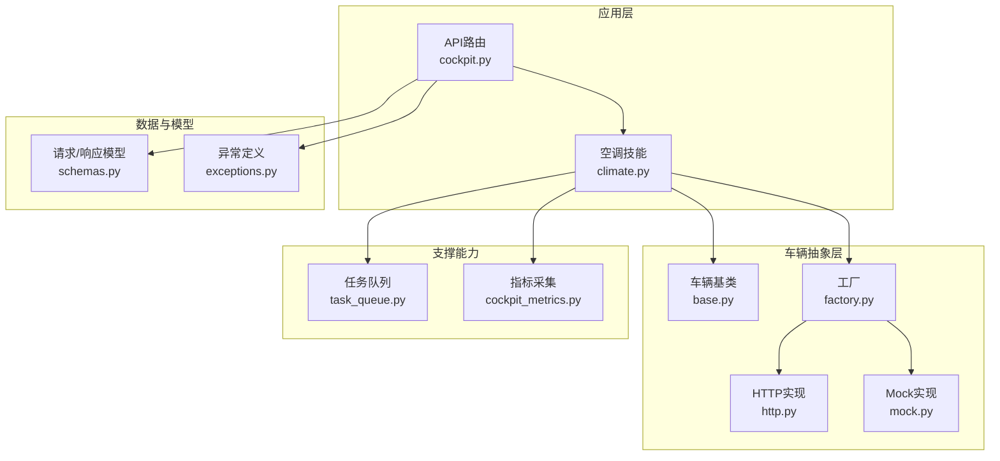
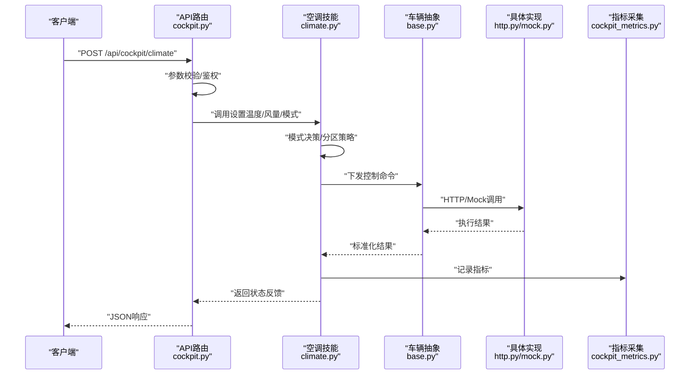
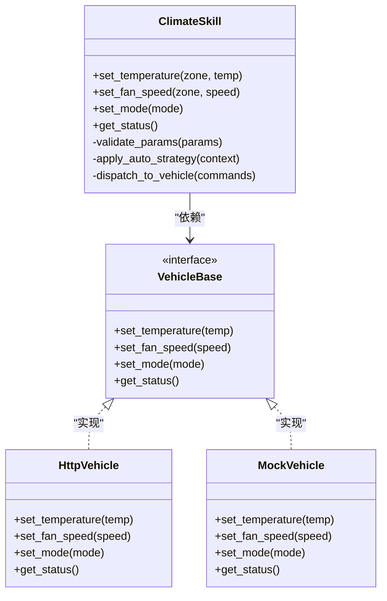
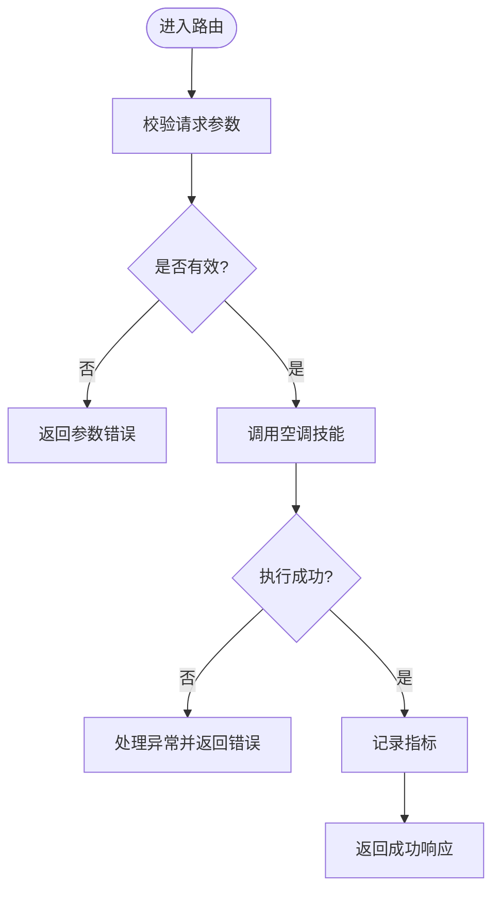
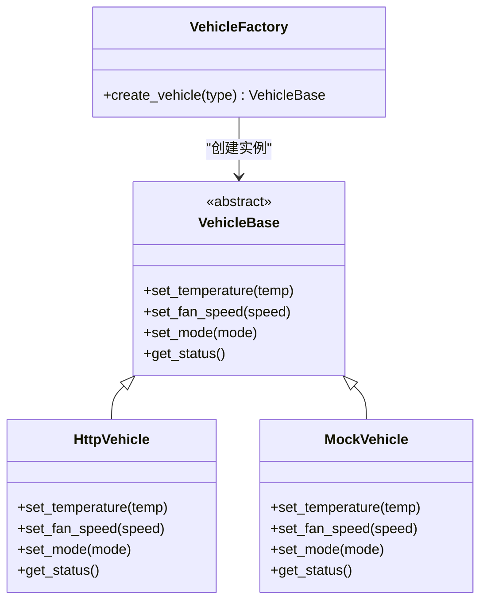
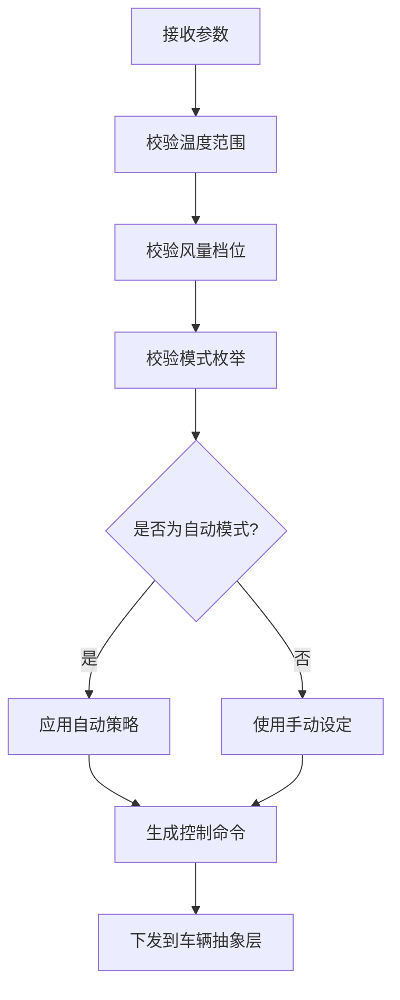
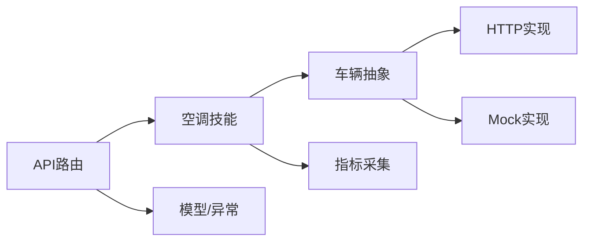

# 空调控制系统

<cite>
**本文引用的文件**   
- [backend_design/nexus/skills/vehicle/climate.py](file://backend_design/nexus/skills/vehicle/climate.py)
- [backend_design/nexus/api/routes/cockpit.py](file://backend_design/nexus/api/routes/cockpit.py)
- [backend_design/nexus/models/schemas.py](file://backend_design/nexus/models/schemas.py)
- [backend_design/nexus/core/exceptions.py](file://backend_design/nexus/core/exceptions.py)
- [backend_design/nexus/vehicle/base.py](file://backend_design/nexus/vehicle/base.py)
- [backend_design/nexus/vehicle/factory.py](file://backend_design/nexus/vehicle/factory.py)
- [backend_design/nexus/vehicle/http.py](file://backend_design/nexus/vehicle/http.py)
- [backend_design/nexus/vehicle/mock.py](file://backend_design/nexus/vehicle/mock.py)
- [backend_design/nexus/middleware/task_queue.py](file://backend_design/nexus/middleware/task_queue.py)
- [backend_design/nexus/observability/cockpit_metrics.py](file://backend_design/nexus/observability/cockpit_metrics.py)
</cite>

## 目录
1. [简介](#简介)
2. [项目结构](#项目结构)
3. [核心组件](#核心组件)
4. [架构总览](#架构总览)
5. [详细组件分析](#详细组件分析)
6. [依赖关系分析](#依赖关系分析)
7. [性能考虑](#性能考虑)
8. [故障排查指南](#故障排查指南)
9. [结论](#结论)
10. [附录](#附录)

## 简介
本文件面向NexusCockpit的空调控制系统，聚焦温度调节、风量设置、模式切换等核心能力，覆盖参数校验、执行流程与状态反馈机制；并阐述自动模式、手动模式、分区控制等高级逻辑。文档同时提供API调用示例与错误处理策略，以及性能优化建议与故障排查指南，帮助开发者快速理解与扩展空调相关功能。

## 项目结构
与空调控制相关的代码主要分布在以下模块：
- 技能层（Skill）：封装空调领域能力，如温度、风量、模式、分区等
- API路由层：暴露HTTP接口，接收请求并调度到对应技能
- 模型与Schema：定义输入输出数据结构与校验规则
- 车辆抽象层：统一不同后端（HTTP/Mock/MCP）的车辆能力实现
- 中间件与可观测性：任务队列、指标采集、异常处理

图表来源
- [backend_design/nexus/api/routes/cockpit.py](file://backend_design/nexus/api/routes/cockpit.py)
- [backend_design/nexus/skills/vehicle/climate.py](file://backend_design/nexus/skills/vehicle/climate.py)
- [backend_design/nexus/models/schemas.py](file://backend_design/nexus/models/schemas.py)
- [backend_design/nexus/core/exceptions.py](file://backend_design/nexus/core/exceptions.py)
- [backend_design/nexus/vehicle/base.py](file://backend_design/nexus/vehicle/base.py)
- [backend_design/nexus/vehicle/factory.py](file://backend_design/nexus/vehicle/factory.py)
- [backend_design/nexus/vehicle/http.py](file://backend_design/nexus/vehicle/http.py)
- [backend_design/nexus/vehicle/mock.py](file://backend_design/nexus/vehicle/mock.py)
- [backend_design/nexus/middleware/task_queue.py](file://backend_design/nexus/middleware/task_queue.py)
- [backend_design/nexus/observability/cockpit_metrics.py](file://backend_design/nexus/observability/cockpit_metrics.py)

章节来源
- [backend_design/nexus/skills/vehicle/climate.py](file://backend_design/nexus/skills/vehicle/climate.py)
- [backend_design/nexus/api/routes/cockpit.py](file://backend_design/nexus/api/routes/cockpit.py)
- [backend_design/nexus/models/schemas.py](file://backend_design/nexus/models/schemas.py)
- [backend_design/nexus/core/exceptions.py](file://backend_design/nexus/core/exceptions.py)
- [backend_design/nexus/vehicle/base.py](file://backend_design/nexus/vehicle/base.py)
- [backend_design/nexus/vehicle/factory.py](file://backend_design/nexus/vehicle/factory.py)
- [backend_design/nexus/vehicle/http.py](file://backend_design/nexus/vehicle/http.py)
- [backend_design/nexus/vehicle/mock.py](file://backend_design/nexus/vehicle/mock.py)
- [backend_design/nexus/middleware/task_queue.py](file://backend_design/nexus/middleware/task_queue.py)
- [backend_design/nexus/observability/cockpit_metrics.py](file://backend_design/nexus/observability/cockpit_metrics.py)

## 核心组件
- 空调技能（Climate Skill）
  - 职责：解析用户意图或API参数，进行参数校验、模式决策、下发控制命令、聚合状态反馈
  - 关键能力：温度调节、风量设置、模式切换（自动/手动）、分区控制（主驾/副驾/后排等）
- API路由（Cockpit Routes）
  - 职责：暴露REST接口，负责鉴权、入参校验、调用技能、返回结果与错误码
- 车辆抽象（Vehicle Abstraction）
  - 职责：屏蔽底层差异，统一温度、风量、模式等能力的调用方式
  - 实现：HTTP客户端、Mock实现、未来可扩展MCP等
- 模型与异常（Schemas & Exceptions）
  - 职责：定义统一的请求/响应结构与错误类型，确保前后端契约一致
- 任务队列与指标（Task Queue & Metrics）
  - 职责：异步执行耗时操作、记录关键指标用于监控与排障

章节来源
- [backend_design/nexus/skills/vehicle/climate.py](file://backend_design/nexus/skills/vehicle/climate.py)
- [backend_design/nexus/api/routes/cockpit.py](file://backend_design/nexus/api/routes/cockpit.py)
- [backend_design/nexus/models/schemas.py](file://backend_design/nexus/models/schemas.py)
- [backend_design/nexus/core/exceptions.py](file://backend_design/nexus/core/exceptions.py)
- [backend_design/nexus/vehicle/base.py](file://backend_design/nexus/vehicle/base.py)
- [backend_design/nexus/vehicle/factory.py](file://backend_design/nexus/vehicle/factory.py)
- [backend_design/nexus/vehicle/http.py](file://backend_design/nexus/vehicle/http.py)
- [backend_design/nexus/vehicle/mock.py](file://backend_design/nexus/vehicle/mock.py)
- [backend_design/nexus/middleware/task_queue.py](file://backend_design/nexus/middleware/task_queue.py)
- [backend_design/nexus/observability/cockpit_metrics.py](file://backend_design/nexus/observability/cockpit_metrics.py)

## 架构总览
空调控制的端到端流程如下：前端通过HTTP调用API路由，路由层将请求交由空调技能处理；技能根据模式与分区策略生成控制指令，并通过车辆抽象层下发至具体实现（HTTP/Mock）；执行完成后，系统返回状态反馈并记录指标。

图表来源
- [backend_design/nexus/api/routes/cockpit.py](file://backend_design/nexus/api/routes/cockpit.py)
- [backend_design/nexus/skills/vehicle/climate.py](file://backend_design/nexus/skills/vehicle/climate.py)
- [backend_design/nexus/vehicle/base.py](file://backend_design/nexus/vehicle/base.py)
- [backend_design/nexus/vehicle/http.py](file://backend_design/nexus/vehicle/http.py)
- [backend_design/nexus/vehicle/mock.py](file://backend_design/nexus/vehicle/mock.py)
- [backend_design/nexus/observability/cockpit_metrics.py](file://backend_design/nexus/observability/cockpit_metrics.py)

## 详细组件分析

### 空调技能（Climate Skill）
- 设计要点
  - 参数校验：温度范围、风量档位、模式枚举、分区标识
  - 模式决策：自动模式依据环境/用户偏好调整；手动模式直接按用户设定执行
  - 分区控制：支持主驾、副驾、后排等多区独立设置
  - 执行与反馈：调用车辆抽象层下发命令，收集执行结果并转换为统一响应
- 复杂度与优化
  - 时间复杂度：O(1)~O(n)，n为分区数量
  - 空间复杂度：O(1)，仅维护少量上下文
  - 优化点：批量下发、缓存默认值、降级策略

图表来源
- [backend_design/nexus/skills/vehicle/climate.py](file://backend_design/nexus/skills/vehicle/climate.py)
- [backend_design/nexus/vehicle/base.py](file://backend_design/nexus/vehicle/base.py)
- [backend_design/nexus/vehicle/http.py](file://backend_design/nexus/vehicle/http.py)
- [backend_design/nexus/vehicle/mock.py](file://backend_design/nexus/vehicle/mock.py)

章节来源
- [backend_design/nexus/skills/vehicle/climate.py](file://backend_design/nexus/skills/vehicle/climate.py)
- [backend_design/nexus/vehicle/base.py](file://backend_design/nexus/vehicle/base.py)
- [backend_design/nexus/vehicle/http.py](file://backend_design/nexus/vehicle/http.py)
- [backend_design/nexus/vehicle/mock.py](file://backend_design/nexus/vehicle/mock.py)

### API路由（Cockpit Routes）
- 职责
  - 暴露REST接口：设置温度、风量、模式、获取状态
  - 参数校验：基于Schema进行严格校验，拒绝非法请求
  - 错误处理：捕获异常并返回标准错误码与消息
  - 指标上报：记录请求耗时、成功率等
- 典型流程
  - 接收请求 -> 校验参数 -> 调用技能 -> 记录指标 -> 返回响应

图表来源
- [backend_design/nexus/api/routes/cockpit.py](file://backend_design/nexus/api/routes/cockpit.py)
- [backend_design/nexus/models/schemas.py](file://backend_design/nexus/models/schemas.py)
- [backend_design/nexus/core/exceptions.py](file://backend_design/nexus/core/exceptions.py)
- [backend_design/nexus/observability/cockpit_metrics.py](file://backend_design/nexus/observability/cockpit_metrics.py)

章节来源
- [backend_design/nexus/api/routes/cockpit.py](file://backend_design/nexus/api/routes/cockpit.py)
- [backend_design/nexus/models/schemas.py](file://backend_design/nexus/models/schemas.py)
- [backend_design/nexus/core/exceptions.py](file://backend_design/nexus/core/exceptions.py)
- [backend_design/nexus/observability/cockpit_metrics.py](file://backend_design/nexus/observability/cockpit_metrics.py)

### 车辆抽象层（Vehicle Abstraction）
- 设计要点
  - 统一接口：所有车辆实现必须遵循基类约定
  - 工厂模式：根据配置选择HTTP或Mock实现
  - 可扩展性：新增实现只需继承基类并注册到工厂
- 关键方法
  - set_temperature、set_fan_speed、set_mode、get_status

图表来源
- [backend_design/nexus/vehicle/factory.py](file://backend_design/nexus/vehicle/factory.py)
- [backend_design/nexus/vehicle/base.py](file://backend_design/nexus/vehicle/base.py)
- [backend_design/nexus/vehicle/http.py](file://backend_design/nexus/vehicle/http.py)
- [backend_design/nexus/vehicle/mock.py](file://backend_design/nexus/vehicle/mock.py)

章节来源
- [backend_design/nexus/vehicle/factory.py](file://backend_design/nexus/vehicle/factory.py)
- [backend_design/nexus/vehicle/base.py](file://backend_design/nexus/vehicle/base.py)
- [backend_design/nexus/vehicle/http.py](file://backend_design/nexus/vehicle/http.py)
- [backend_design/nexus/vehicle/mock.py](file://backend_design/nexus/vehicle/mock.py)

### 参数校验与模式逻辑
- 参数校验
  - 温度：限定上下限，单位一致性检查
  - 风量：档位枚举校验，支持静音/低/中/高/自动
  - 模式：自动/手动/除雾/制冷/制热等枚举
  - 分区：主驾/副驾/后排等标识合法性
- 模式逻辑
  - 自动模式：结合环境传感器与用户偏好动态调整温度与风量
  - 手动模式：严格按用户设定执行
  - 分区控制：多区独立设置，支持联动策略

图表来源
- [backend_design/nexus/skills/vehicle/climate.py](file://backend_design/nexus/skills/vehicle/climate.py)
- [backend_design/nexus/models/schemas.py](file://backend_design/nexus/models/schemas.py)

章节来源
- [backend_design/nexus/skills/vehicle/climate.py](file://backend_design/nexus/skills/vehicle/climate.py)
- [backend_design/nexus/models/schemas.py](file://backend_design/nexus/models/schemas.py)

### API调用示例与错误处理
- 典型接口
  - POST /api/cockpit/climate/set_temperature
  - POST /api/cockpit/climate/set_fan_speed
  - POST /api/cockpit/climate/set_mode
  - GET /api/cockpit/climate/status
- 请求体字段
  - zone：分区标识（可选）
  - temperature：目标温度（数值）
  - fan_speed：风量档位（枚举）
  - mode：模式（枚举）
- 响应格式
  - success：布尔
  - message：描述信息
  - data：执行结果或当前状态
- 错误处理
  - 参数错误：返回400及错误详情
  - 服务异常：返回500及错误摘要
  - 超时/网络失败：重试或降级到Mock

章节来源
- [backend_design/nexus/api/routes/cockpit.py](file://backend_design/nexus/api/routes/cockpit.py)
- [backend_design/nexus/models/schemas.py](file://backend_design/nexus/models/schemas.py)
- [backend_design/nexus/core/exceptions.py](file://backend_design/nexus/core/exceptions.py)

## 依赖关系分析
- 组件耦合
  - API路由依赖空调技能与模型/异常
  - 空调技能依赖车辆抽象层与指标采集
  - 车辆抽象层由工厂管理，具体实现可插拔
- 外部依赖
  - HTTP实现依赖外部车辆服务
  - Mock实现用于开发与测试
- 潜在循环依赖
  - 通过分层与接口隔离避免循环引用

图表来源
- [backend_design/nexus/api/routes/cockpit.py](file://backend_design/nexus/api/routes/cockpit.py)
- [backend_design/nexus/skills/vehicle/climate.py](file://backend_design/nexus/skills/vehicle/climate.py)
- [backend_design/nexus/models/schemas.py](file://backend_design/nexus/models/schemas.py)
- [backend_design/nexus/core/exceptions.py](file://backend_design/nexus/core/exceptions.py)
- [backend_design/nexus/vehicle/base.py](file://backend_design/nexus/vehicle/base.py)
- [backend_design/nexus/vehicle/http.py](file://backend_design/nexus/vehicle/http.py)
- [backend_design/nexus/vehicle/mock.py](file://backend_design/nexus/vehicle/mock.py)
- [backend_design/nexus/observability/cockpit_metrics.py](file://backend_design/nexus/observability/cockpit_metrics.py)

章节来源
- [backend_design/nexus/api/routes/cockpit.py](file://backend_design/nexus/api/routes/cockpit.py)
- [backend_design/nexus/skills/vehicle/climate.py](file://backend_design/nexus/skills/vehicle/climate.py)
- [backend_design/nexus/models/schemas.py](file://backend_design/nexus/models/schemas.py)
- [backend_design/nexus/core/exceptions.py](file://backend_design/nexus/core/exceptions.py)
- [backend_design/nexus/vehicle/base.py](file://backend_design/nexus/vehicle/base.py)
- [backend_design/nexus/vehicle/http.py](file://backend_design/nexus/vehicle/http.py)
- [backend_design/nexus/vehicle/mock.py](file://backend_design/nexus/vehicle/mock.py)
- [backend_design/nexus/observability/cockpit_metrics.py](file://backend_design/nexus/observability/cockpit_metrics.py)

## 性能考虑
- 批量下发：合并同一批次的多区控制命令，减少网络往返
- 缓存默认值：对常用温度/风量/模式设置进行本地缓存，降低重复计算
- 异步执行：耗时操作放入任务队列，避免阻塞主线程
- 连接复用：HTTP实现启用连接池与超时控制
- 降级策略：外部服务不可用时回退到Mock或保守策略
- 指标监控：记录P95/P99延迟、错误率、重试次数，辅助容量规划

[本节为通用指导，不直接分析具体文件]

## 故障排查指南
- 常见问题
  - 参数校验失败：检查请求体字段类型与取值范围
  - 模式不支持：确认模式枚举是否在白名单内
  - 分区无效：核对分区标识是否符合规范
  - 外部服务超时：检查HTTP实现的网络配置与重试策略
- 定位步骤
  - 查看API日志与错误码
  - 检查指标面板中的延迟与错误分布
  - 在开发环境切换Mock实现验证逻辑
  - 逐步缩小问题范围至参数、策略或下游服务
- 恢复措施
  - 修正参数后重试
  - 切换到备用实现或降级模式
  - 扩容或重启下游服务

章节来源
- [backend_design/nexus/core/exceptions.py](file://backend_design/nexus/core/exceptions.py)
- [backend_design/nexus/observability/cockpit_metrics.py](file://backend_design/nexus/observability/cockpit_metrics.py)
- [backend_design/nexus/middleware/task_queue.py](file://backend_design/nexus/middleware/task_queue.py)

## 结论
空调控制系统通过清晰的分层设计与统一的车辆抽象，实现了温度、风量、模式与分区控制的稳定与可扩展。配合严格的参数校验、完善的错误处理与指标监控，系统在可用性、可观测性与可维护性方面具备良好基础。后续可在自动策略、能耗优化与更多分区联动方面持续演进。

[本节为总结性内容，不直接分析具体文件]

## 附录
- 术语表
  - 分区：主驾、副驾、后排等独立控制区域
  - 模式：自动/手动/除雾/制冷/制热等运行模式
  - 风量：风扇转速档位，支持静音/低/中/高/自动
- 参考路径
  - 空调技能实现：[backend_design/nexus/skills/vehicle/climate.py](file://backend_design/nexus/skills/vehicle/climate.py)
  - API路由定义：[backend_design/nexus/api/routes/cockpit.py](file://backend_design/nexus/api/routes/cockpit.py)
  - 模型与异常：[backend_design/nexus/models/schemas.py](file://backend_design/nexus/models/schemas.py)、[backend_design/nexus/core/exceptions.py](file://backend_design/nexus/core/exceptions.py)
  - 车辆抽象与实现：[backend_design/nexus/vehicle/base.py](file://backend_design/nexus/vehicle/base.py)、[backend_design/nexus/vehicle/factory.py](file://backend_design/nexus/vehicle/factory.py)、[backend_design/nexus/vehicle/http.py](file://backend_design/nexus/vehicle/http.py)、[backend_design/nexus/vehicle/mock.py](file://backend_design/nexus/vehicle/mock.py)
  - 任务队列与指标：[backend_design/nexus/middleware/task_queue.py](file://backend_design/nexus/middleware/task_queue.py)、[backend_design/nexus/observability/cockpit_metrics.py](file://backend_design/nexus/observability/cockpit_metrics.py)