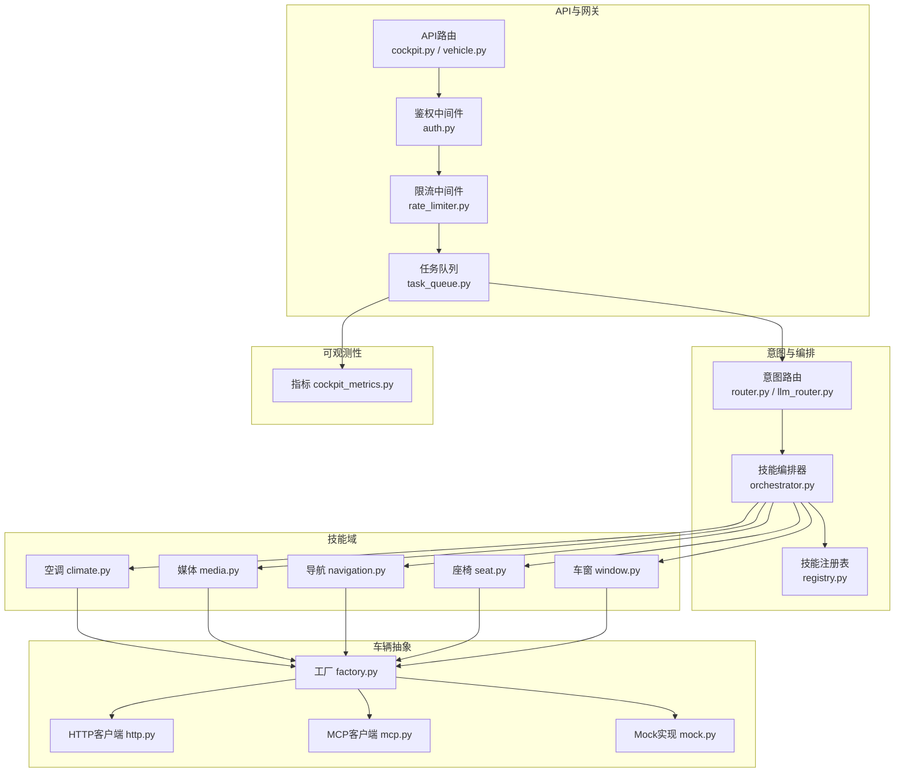
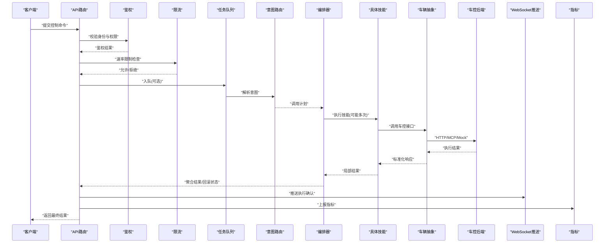
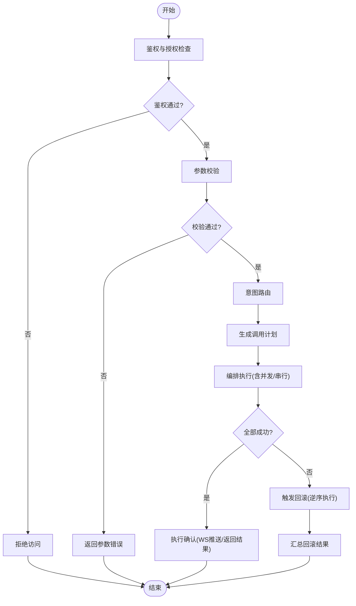
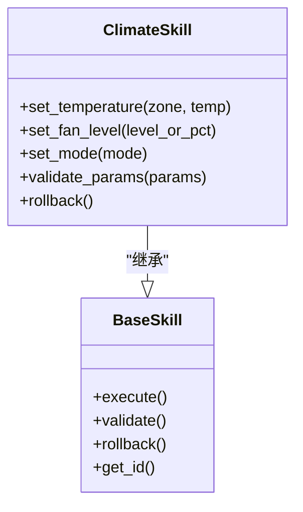
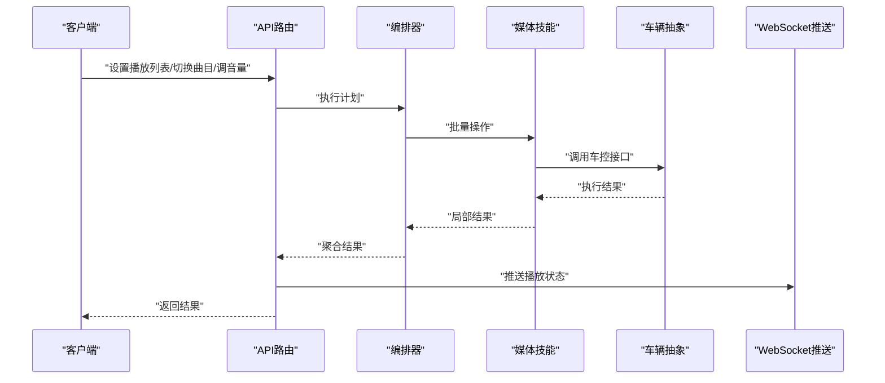
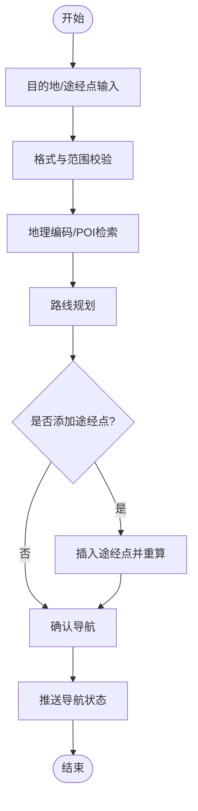
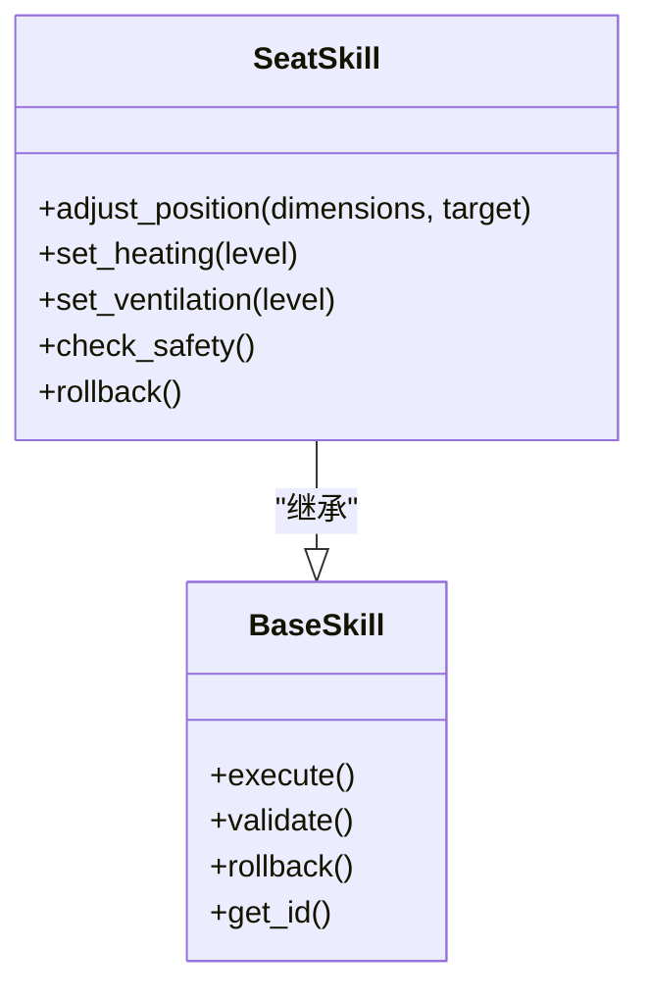
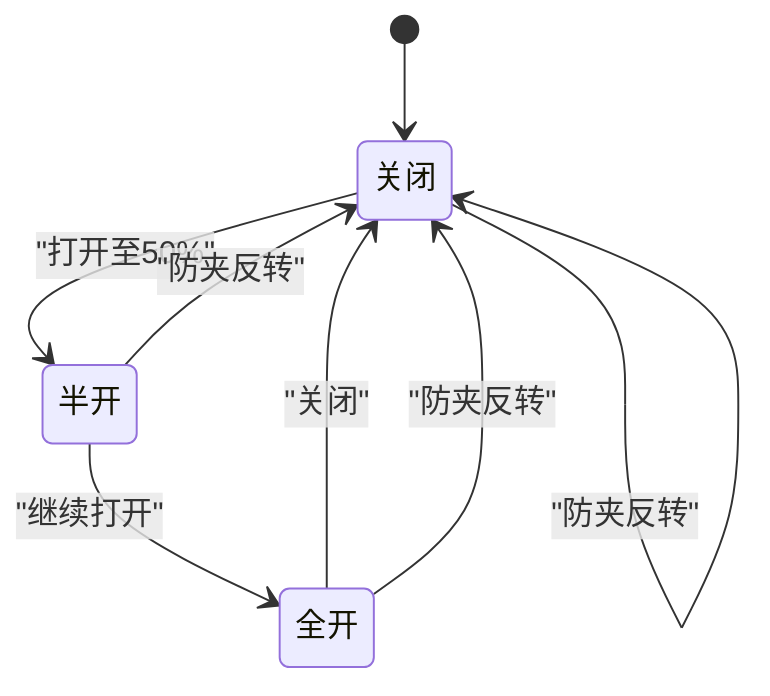
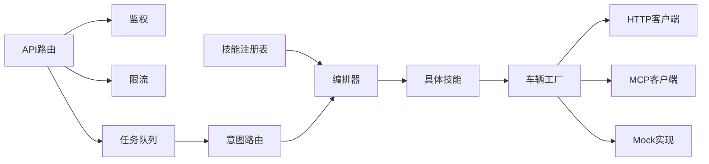

# 远程控制命令

<cite>
**本文引用的文件**   
- [backend_design/nexus/skills/vehicle/climate.py](file://backend_design/nexus/skills/vehicle/climate.py)
- [backend_design/nexus/skills/vehicle/media.py](file://backend_design/nexus/skills/vehicle/media.py)
- [backend_design/nexus/skills/vehicle/navigation.py](file://backend_design/nexus/skills/vehicle/navigation.py)
- [backend_design/nexus/skills/vehicle/seat.py](file://backend_design/nexus/skills/vehicle/seat.py)
- [backend_design/nexus/skills/vehicle/window.py](file://backend_design/nexus/skills/vehicle/window.py)
- [backend_design/nexus/skills/base.py](file://backend_design/nexus/skills/base.py)
- [backend_design/nexus/skills/orchestrator.py](file://backend_design/nexus/skills/orchestrator.py)
- [backend_design/nexus/skills/registry.py](file://backend_design/nexus/skills/registry.py)
- [backend_design/nexus/vehicle/factory.py](file://backend_design/nexus/vehicle/factory.py)
- [backend_design/nexus/vehicle/http.py](file://backend_design/nexus/vehicle/http.py)
- [backend_design/nexus/vehicle/mcp.py](file://backend_design/nexus/vehicle/mcp.py)
- [backend_design/nexus/vehicle/mock.py](file://backend_design/nexus/vehicle/mock.py)
- [backend_design/nexus/api/routes/cockpit.py](file://backend_design/nexus/api/routes/cockpit.py)
- [backend_design/nexus/api/routes/vehicle.py](file://backend_design/nexus/api/routes/vehicle.py)
- [backend_design/nexus/core/auth.py](file://backend_design/nexus/core/auth.py)
- [backend_design/nexus/core/exceptions.py](file://backend_design/nexus/core/exceptions.py)
- [backend_design/nexus/models/schemas.py](file://backend_design/nexus/models/schemas.py)
- [backend_design/nexus/intent/router.py](file://backend_design/nexus/intent/router.py)
- [backend_design/nexus/intent/llm_router.py](file://backend_design/nexus/intent/llm_router.py)
- [backend_design/nexus/middleware/task_queue.py](file://backend_design/nexus/middleware/task_queue.py)
- [backend_design/nexus/middleware/rate_limiter.py](file://backend_design/nexus/middleware/rate_limiter.py)
- [backend_design/nexus/observability/cockpit_metrics.py](file://backend_design/nexus/observability/cockpit_metrics.py)
- [backend_design/nexus_gate/internal/handlers/handlers.go](file://backend_design/nexus_gate/internal/handlers/handlers.go)
- [backend_design/nexus_gate/internal/ws/hub.go](file://backend_design/nexus_gate/internal/ws/hub.go)
- [backend_design/nexus_gate/proto/nexus.proto](file://backend_design/nexus_gate/proto/nexus.proto)
</cite>

## 目录
1. [简介](#简介)
2. [项目结构](#项目结构)
3. [核心组件](#核心组件)
4. [架构总览](#架构总览)
5. [详细组件分析](#详细组件分析)
6. [依赖分析](#依赖分析)
7. [性能考虑](#性能考虑)
8. [故障排查指南](#故障排查指南)
9. [结论](#结论)
10. [附录](#附录)

## 简介
本文件面向NexusCockpit的远程控制命令系统，聚焦“从用户意图到车辆执行”的完整生命周期：权限验证、参数校验、意图路由、技能编排、原子性与回滚、以及执行确认。文档同时覆盖空调、媒体、导航、座椅、车窗五大控制技能的实现要点与扩展方法，并提供安全最佳实践与可观测性建议。

## 项目结构
远程控制命令相关代码主要分布在以下模块：
- 技能层（skills）：按领域划分的具体控制能力（空调、媒体、导航、座椅、车窗等），提供统一的基类与注册机制。
- 编排器（orchestrator）：负责多技能组合、事务边界、回滚策略与结果聚合。
- 车辆抽象（vehicle）：对底层车控接口进行抽象，支持HTTP/MCP/Mock等多种后端。
- API网关与路由（api/routes）：暴露REST/WebSocket入口，承载鉴权、限流、任务队列与指标上报。
- 意图识别（intent）：将自然语言或结构化输入解析为具体技能调用。
- 鉴权与安全（core/auth）：统一认证与授权检查。
- 可观测性（observability）：埋点、指标与日志追踪。

图表来源
- [backend_design/nexus/api/routes/cockpit.py](file://backend_design/nexus/api/routes/cockpit.py)
- [backend_design/nexus/api/routes/vehicle.py](file://backend_design/nexus/api/routes/vehicle.py)
- [backend_design/nexus/core/auth.py](file://backend_design/nexus/core/auth.py)
- [backend_design/nexus/middleware/rate_limiter.py](file://backend_design/nexus/middleware/rate_limiter.py)
- [backend_design/nexus/middleware/task_queue.py](file://backend_design/nexus/middleware/task_queue.py)
- [backend_design/nexus/intent/router.py](file://backend_design/nexus/intent/router.py)
- [backend_design/nexus/intent/llm_router.py](file://backend_design/nexus/intent/llm_router.py)
- [backend_design/nexus/skills/orchestrator.py](file://backend_design/nexus/skills/orchestrator.py)
- [backend_design/nexus/skills/registry.py](file://backend_design/nexus/skills/registry.py)
- [backend_design/nexus/skills/vehicle/climate.py](file://backend_design/nexus/skills/vehicle/climate.py)
- [backend_design/nexus/skills/vehicle/media.py](file://backend_design/nexus/skills/vehicle/media.py)
- [backend_design/nexus/skills/vehicle/navigation.py](file://backend_design/nexus/skills/vehicle/navigation.py)
- [backend_design/nexus/skills/vehicle/seat.py](file://backend_design/nexus/skills/vehicle/seat.py)
- [backend_design/nexus/skills/vehicle/window.py](file://backend_design/nexus/skills/vehicle/window.py)
- [backend_design/nexus/vehicle/factory.py](file://backend_design/nexus/vehicle/factory.py)
- [backend_design/nexus/vehicle/http.py](file://backend_design/nexus/vehicle/http.py)
- [backend_design/nexus/vehicle/mcp.py](file://backend_design/nexus/nexus/vehicle/mcp.py)
- [backend_design/nexus/vehicle/mock.py](file://backend_design/nexus/vehicle/mock.py)
- [backend_design/nexus/observability/cockpit_metrics.py](file://backend_design/nexus/observability/cockpit_metrics.py)

章节来源
- [backend_design/nexus/api/routes/cockpit.py](file://backend_design/nexus/api/routes/cockpit.py)
- [backend_design/nexus/api/routes/vehicle.py](file://backend_design/nexus/api/routes/vehicle.py)
- [backend_design/nexus/skills/orchestrator.py](file://backend_design/nexus/skills/orchestrator.py)
- [backend_design/nexus/vehicle/factory.py](file://backend_design/nexus/vehicle/factory.py)

## 核心组件
- 技能基类与注册表
  - 所有车辆控制技能继承自统一基类，定义标准接口（如执行、校验、回滚钩子）。
  - 注册表集中管理技能名称、版本、权限范围与元数据，供编排器动态发现与调度。
- 编排器
  - 接收意图解析后的调用计划，按顺序或并行执行多个技能。
  - 维护事务上下文，记录每一步状态，失败时触发回滚。
- 车辆抽象层
  - 通过工厂选择具体实现（HTTP/MCP/Mock），屏蔽底层差异。
  - 提供幂等键、超时、重试与熔断等通用能力。
- API与中间件
  - 鉴权：基于JWT/会话的用户身份与角色校验。
  - 限流：防止恶意或异常流量冲击。
  - 任务队列：异步执行耗时操作，返回任务ID用于查询进度。
- 可观测性
  - 指标采集：成功率、延迟、错误码分布、资源使用率。
  - 链路追踪：跨服务请求ID贯穿整个调用链。

章节来源
- [backend_design/nexus/skills/base.py](file://backend_design/nexus/skills/base.py)
- [backend_design/nexus/skills/registry.py](file://backend_design/nexus/skills/registry.py)
- [backend_design/nexus/skills/orchestrator.py](file://backend_design/nexus/skills/orchestrator.py)
- [backend_design/nexus/vehicle/factory.py](file://backend_design/nexus/vehicle/factory.py)
- [backend_design/nexus/core/auth.py](file://backend_design/nexus/core/auth.py)
- [backend_design/nexus/middleware/rate_limiter.py](file://backend_design/nexus/middleware/rate_limiter.py)
- [backend_design/nexus/middleware/task_queue.py](file://backend_design/nexus/middleware/task_queue.py)
- [backend_design/nexus/observability/cockpit_metrics.py](file://backend_design/nexus/observability/cockpit_metrics.py)

## 架构总览
远程控制命令的生命周期如下：
- 入口：API路由接收请求，进入鉴权与限流中间件。
- 解析：意图路由器将输入转换为技能调用计划。
- 编排：编排器根据计划执行各技能，必要时并发执行并合并结果。
- 执行：通过车辆抽象层调用具体后端（HTTP/MCP/Mock）。
- 确认：返回执行结果，推送WebSocket事件，更新指标与日志。

图表来源
- [backend_design/nexus/api/routes/cockpit.py](file://backend_design/nexus/api/routes/cockpit.py)
- [backend_design/nexus/api/routes/vehicle.py](file://backend_design/nexus/api/routes/vehicle.py)
- [backend_design/nexus/core/auth.py](file://backend_design/nexus/core/auth.py)
- [backend_design/nexus/middleware/rate_limiter.py](file://backend_design/nexus/middleware/rate_limiter.py)
- [backend_design/nexus/middleware/task_queue.py](file://backend_design/nexus/middleware/task_queue.py)
- [backend_design/nexus/intent/router.py](file://backend_design/nexus/intent/router.py)
- [backend_design/nexus/intent/llm_router.py](file://backend_design/nexus/intent/llm_router.py)
- [backend_design/nexus/skills/orchestrator.py](file://backend_design/nexus/skills/orchestrator.py)
- [backend_design/nexus/vehicle/factory.py](file://backend_design/nexus/vehicle/factory.py)
- [backend_design/nexus/vehicle/http.py](file://backend_design/nexus/vehicle/http.py)
- [backend_design/nexus/vehicle/mcp.py](file://backend_design/nexus/vehicle/mcp.py)
- [backend_design/nexus/vehicle/mock.py](file://backend_design/nexus/vehicle/mock.py)
- [backend_design/nexus/observability/cockpit_metrics.py](file://backend_design/nexus/observability/cockpit_metrics.py)
- [backend_design/nexus_gate/internal/ws/hub.go](file://backend_design/nexus_gate/internal/ws/hub.go)

## 详细组件分析

### 命令执行生命周期
- 权限验证
  - 基于JWT/会话的身份校验，结合角色与资源权限，确保仅授权用户可执行敏感操作。
- 参数校验
  - 使用统一Schema对输入进行类型、范围与业务约束校验，失败即快速返回。
- 意图路由
  - 规则引擎或LLM辅助路由将自然语言或结构化输入映射到目标技能与参数。
- 编排与执行
  - 编排器维护事务上下文，记录每步状态；支持并发执行与结果聚合。
- 原子性与回滚
  - 每个技能需声明可回滚动作；编排器在失败时按逆序执行回滚钩子，保证一致性。
- 执行确认
  - 通过WebSocket推送执行结果与状态变更；同步接口返回任务ID以便轮询。

图表来源
- [backend_design/nexus/core/auth.py](file://backend_design/nexus/core/auth.py)
- [backend_design/nexus/models/schemas.py](file://backend_design/nexus/models/schemas.py)
- [backend_design/nexus/intent/router.py](file://backend_design/nexus/intent/router.py)
- [backend_design/nexus/intent/llm_router.py](file://backend_design/nexus/intent/llm_router.py)
- [backend_design/nexus/skills/orchestrator.py](file://backend_design/nexus/skills/orchestrator.py)
- [backend_design/nexus/skills/base.py](file://backend_design/nexus/skills/base.py)
- [backend_design/nexus/observability/cockpit_metrics.py](file://backend_design/nexus/observability/cockpit_metrics.py)

章节来源
- [backend_design/nexus/core/auth.py](file://backend_design/nexus/core/auth.py)
- [backend_design/nexus/models/schemas.py](file://backend_design/nexus/models/schemas.py)
- [backend_design/nexus/intent/router.py](file://backend_design/nexus/intent/router.py)
- [backend_design/nexus/intent/llm_router.py](file://backend_design/nexus/intent/llm_router.py)
- [backend_design/nexus/skills/orchestrator.py](file://backend_design/nexus/skills/orchestrator.py)
- [backend_design/nexus/skills/base.py](file://backend_design/nexus/skills/base.py)
- [backend_design/nexus/observability/cockpit_metrics.py](file://backend_design/nexus/observability/cockpit_metrics.py)

### 空调控制（温度调节、风量设置、模式切换）
- 功能要点
  - 温度调节：支持设定目标温度与区域选择（前排/后排/全车）。
  - 风量设置：支持档位或百分比控制，包含自动模式。
  - 模式切换：制冷/制热/除雾/循环等模式切换。
- 实现要点
  - 参数校验：温度范围、风量档位合法性、模式枚举值。
  - 原子性：单次调用只改变一个属性；复杂场景由编排器组合多个原子操作。
  - 回滚：若后续步骤失败，恢复前一步的温度/风量/模式。
- 典型流程
  - 校验参数 → 下发温度 → 下发风量 → 切换模式 → 确认反馈。

图表来源
- [backend_design/nexus/skills/vehicle/climate.py](file://backend_design/nexus/skills/vehicle/climate.py)
- [backend_design/nexus/skills/base.py](file://backend_design/nexus/skills/base.py)

章节来源
- [backend_design/nexus/skills/vehicle/climate.py](file://backend_design/nexus/skills/vehicle/climate.py)
- [backend_design/nexus/skills/base.py](file://backend_design/nexus/skills/base.py)

### 媒体播放（音量控制、曲目切换、播放列表管理）
- 功能要点
  - 音量控制：绝对音量或相对增减，支持静音开关。
  - 曲目切换：上一首/下一首/指定索引或ID。
  - 播放列表管理：创建/清空/添加/删除条目，设置随机/循环模式。
- 实现要点
  - 幂等性：同一播放列表操作具备幂等键，避免重复执行。
  - 状态同步：执行后推送当前播放状态（曲目、进度、模式）。
- 典型流程
  - 校验参数 → 更新播放列表 → 切换曲目 → 调整音量 → 推送状态。

图表来源
- [backend_design/nexus/skills/vehicle/media.py](file://backend_design/nexus/skills/vehicle/media.py)
- [backend_design/nexus/skills/orchestrator.py](file://backend_design/nexus/skills/orchestrator.py)
- [backend_design/nexus/vehicle/factory.py](file://backend_design/nexus/vehicle/factory.py)
- [backend_design/nexus/vehicle/http.py](file://backend_design/nexus/vehicle/http.py)
- [backend_design/nexus/vehicle/mcp.py](file://backend_design/nexus/vehicle/mcp.py)
- [backend_design/nexus/vehicle/mock.py](file://backend_design/nexus/vehicle/mock.py)
- [backend_design/nexus_gate/internal/ws/hub.go](file://backend_design/nexus_gate/internal/ws/hub.go)

章节来源
- [backend_design/nexus/skills/vehicle/media.py](file://backend_design/nexus/skills/vehicle/media.py)
- [backend_design/nexus/skills/orchestrator.py](file://backend_design/nexus/skills/orchestrator.py)
- [backend_design/nexus/vehicle/factory.py](file://backend_design/nexus/vehicle/factory.py)
- [backend_design/nexus/vehicle/http.py](file://backend_design/nexus/vehicle/http.py)
- [backend_design/nexus/vehicle/mcp.py](file://backend_design/nexus/vehicle/mcp.py)
- [backend_design/nexus/vehicle/mock.py](file://backend_design/nexus/vehicle/mock.py)
- [backend_design/nexus_gate/internal/ws/hub.go](file://backend_design/nexus_gate/internal/ws/hub.go)

### 导航设置（目的地输入、路线规划、途经点添加）
- 功能要点
  - 目的地输入：地址/POI/坐标等多源输入。
  - 路线规划：计算最优路径，支持偏好（最短时间/最少拥堵）。
  - 途经点添加：在已规划路线中插入中途停靠点。
- 实现要点
  - 地理编码与有效性校验：经纬度范围、地址格式、POI存在性。
  - 防抖与去重：相同目的地短时间内不重复规划。
  - 回滚：若新增途经点失败，撤销最近一次规划变更。
- 典型流程
  - 校验输入 → 地理编码 → 规划路线 → 添加途经点 → 推送导航状态。

图表来源
- [backend_design/nexus/skills/vehicle/navigation.py](file://backend_design/nexus/skills/vehicle/navigation.py)
- [backend_design/nexus/skills/orchestrator.py](file://backend_design/nexus/skills/orchestrator.py)
- [backend_design/nexus/vehicle/factory.py](file://backend_design/nexus/vehicle/factory.py)
- [backend_design/nexus/vehicle/http.py](file://backend_design/nexus/vehicle/http.py)
- [backend_design/nexus/vehicle/mcp.py](file://backend_design/nexus/vehicle/mcp.py)
- [backend_design/nexus/vehicle/mock.py](file://backend_design/nexus/vehicle/mock.py)

章节来源
- [backend_design/nexus/skills/vehicle/navigation.py](file://backend_design/nexus/skills/vehicle/navigation.py)
- [backend_design/nexus/skills/orchestrator.py](file://backend_design/nexus/skills/orchestrator.py)
- [backend_design/nexus/vehicle/factory.py](file://backend_design/nexus/vehicle/factory.py)
- [backend_design/nexus/vehicle/http.py](file://backend_design/nexus/vehicle/http.py)
- [backend_design/nexus/vehicle/mcp.py](file://backend_design/nexus/vehicle/mcp.py)
- [backend_design/nexus/vehicle/mock.py](file://backend_design/nexus/vehicle/mock.py)

### 座椅调节（位置调整、加热通风）
- 功能要点
  - 位置调整：前后、靠背角度、头枕高度等维度控制。
  - 加热通风：档位控制与分区独立调节。
- 实现要点
  - 安全边界：位置移动需检测障碍物与人体占用状态。
  - 渐进式执行：大跨度调整分步执行，实时反馈进度。
  - 回滚：若某步失败，恢复到上一步位置/档位。
- 典型流程
  - 校验参数 → 安全检查 → 分步移动/调节 → 推送状态。

图表来源
- [backend_design/nexus/skills/vehicle/seat.py](file://backend_design/nexus/skills/vehicle/seat.py)
- [backend_design/nexus/skills/base.py](file://backend_design/nexus/skills/base.py)

章节来源
- [backend_design/nexus/skills/vehicle/seat.py](file://backend_design/nexus/skills/vehicle/seat.py)
- [backend_design/nexus/skills/base.py](file://backend_design/nexus/skills/base.py)

### 车窗控制（开合程度、防夹保护）
- 功能要点
  - 开合程度：百分比或步进控制，支持一键升降。
  - 防夹保护：遇阻检测与反向动作，保障乘员安全。
- 实现要点
  - 状态机：关闭→半开→全开→防夹反转→关闭。
  - 互斥：同侧车窗联动逻辑与冲突处理。
  - 回滚：若中途受阻，立即反转并回到安全位置。
- 典型流程
  - 校验参数 → 防夹检测 → 执行开合 → 状态确认。

图表来源
- [backend_design/nexus/skills/vehicle/window.py](file://backend_design/nexus/skills/vehicle/window.py)
- [backend_design/nexus/skills/base.py](file://backend_design/nexus/skills/base.py)

章节来源
- [backend_design/nexus/skills/vehicle/window.py](file://backend_design/nexus/skills/vehicle/window.py)
- [backend_design/nexus/skills/base.py](file://backend_design/nexus/skills/base.py)

### 命令扩展开发指南
- 新建技能
  - 继承基类，实现执行、校验与回滚方法。
  - 在注册表中登记技能名、版本、权限范围与元数据。
- 参数校验
  - 使用统一Schema定义字段、类型、默认值与约束。
- 原子性与回滚
  - 每个操作尽量保持原子；复杂流程拆分为多步，每步可独立回滚。
- 并发与幂等
  - 为可重复操作提供幂等键；编排器支持并发执行以提升吞吐。
- 安全与最小权限
  - 仅授予必要权限；敏感操作需二次确认或管理员审批。
- 可观测性
  - 上报关键指标（成功/失败、耗时、错误码）；记录审计日志。

章节来源
- [backend_design/nexus/skills/base.py](file://backend_design/nexus/skills/base.py)
- [backend_design/nexus/skills/registry.py](file://backend_design/nexus/skills/registry.py)
- [backend_design/nexus/skills/orchestrator.py](file://backend_design/nexus/skills/orchestrator.py)
- [backend_design/nexus/models/schemas.py](file://backend_design/nexus/models/schemas.py)
- [backend_design/nexus/observability/cockpit_metrics.py](file://backend_design/nexus/observability/cockpit_metrics.py)

### 安全最佳实践
- 鉴权与授权
  - 强制JWT校验；基于角色的细粒度权限控制。
- 输入校验与白名单
  - 严格类型与范围校验；枚举值白名单；拒绝非法字符。
- 速率限制与防重放
  - 全局与用户级限流；请求签名与时间戳防重放。
- 最小权限与隔离
  - 按功能域隔离执行环境；仅开放必要接口。
- 审计与告警
  - 记录关键操作审计日志；异常阈值触发告警。

章节来源
- [backend_design/nexus/core/auth.py](file://backend_design/nexus/core/auth.py)
- [backend_design/nexus/middleware/rate_limiter.py](file://backend_design/nexus/middleware/rate_limiter.py)
- [backend_design/nexus/models/schemas.py](file://backend_design/nexus/models/schemas.py)
- [backend_design/nexus/observability/cockpit_metrics.py](file://backend_design/nexus/observability/cockpit_metrics.py)

## 依赖分析
- 组件耦合
  - 编排器强依赖技能注册表与基类契约；技能弱依赖车辆抽象层。
  - API路由依赖鉴权、限流与任务队列；意图路由依赖规则或LLM。
- 外部依赖
  - HTTP/MCP客户端对接车控后端；WebSocket推送前端状态。
- 潜在循环依赖
  - 通过注册表与工厂解耦，避免直接导入导致的循环依赖。

图表来源
- [backend_design/nexus/skills/registry.py](file://backend_design/nexus/skills/registry.py)
- [backend_design/nexus/skills/orchestrator.py](file://backend_design/nexus/skills/orchestrator.py)
- [backend_design/nexus/vehicle/factory.py](file://backend_design/nexus/vehicle/factory.py)
- [backend_design/nexus/vehicle/http.py](file://backend_design/nexus/vehicle/http.py)
- [backend_design/nexus/vehicle/mcp.py](file://backend_design/nexus/vehicle/mcp.py)
- [backend_design/nexus/vehicle/mock.py](file://backend_design/nexus/vehicle/mock.py)
- [backend_design/nexus/api/routes/cockpit.py](file://backend_design/nexus/api/routes/cockpit.py)
- [backend_design/nexus/core/auth.py](file://backend_design/nexus/core/auth.py)
- [backend_design/nexus/middleware/rate_limiter.py](file://backend_design/nexus/middleware/rate_limiter.py)
- [backend_design/nexus/middleware/task_queue.py](file://backend_design/nexus/middleware/task_queue.py)
- [backend_design/nexus/intent/router.py](file://backend_design/nexus/intent/router.py)

章节来源
- [backend_design/nexus/skills/registry.py](file://backend_design/nexus/skills/registry.py)
- [backend_design/nexus/skills/orchestrator.py](file://backend_design/nexus/skills/orchestrator.py)
- [backend_design/nexus/vehicle/factory.py](file://backend_design/nexus/vehicle/factory.py)
- [backend_design/nexus/api/routes/cockpit.py](file://backend_design/nexus/api/routes/cockpit.py)
- [backend_design/nexus/core/auth.py](file://backend_design/nexus/core/auth.py)
- [backend_design/nexus/middleware/rate_limiter.py](file://backend_design/nexus/middleware/rate_limiter.py)
- [backend_design/nexus/middleware/task_queue.py](file://backend_design/nexus/middleware/task_queue.py)
- [backend_design/nexus/intent/router.py](file://backend_design/nexus/intent/router.py)

## 性能考虑
- 并发执行
  - 编排器对无依赖的技能并发执行，缩短端到端延迟。
- 缓存与去重
  - 对热点查询（如POI检索）启用短期缓存；相同请求去重。
- 超时与重试
  - 为车控接口设置合理超时与指数退避重试；失败快速降级。
- 背压与限流
  - 任务队列削峰填谷；限流保护后端稳定。
- 指标与监控
  - 采集P95/P99延迟、错误率、队列积压等关键指标。

[本节为通用指导，无需特定文件引用]

## 故障排查指南
- 常见问题
  - 鉴权失败：检查JWT有效性与权限配置。
  - 参数错误：核对Schema约束与枚举值。
  - 执行超时：查看车控后端健康状态与网络连通性。
  - 回滚异常：定位最后成功步骤，检查回滚钩子实现。
- 诊断工具
  - 查看任务队列状态与执行历史。
  - 检查WebSocket推送是否正常。
  - 分析指标与日志定位瓶颈与错误根因。

章节来源
- [backend_design/nexus/core/auth.py](file://backend_design/nexus/core/auth.py)
- [backend_design/nexus/models/schemas.py](file://backend_design/nexus/models/schemas.py)
- [backend_design/nexus/middleware/task_queue.py](file://backend_design/nexus/middleware/task_queue.py)
- [backend_design/nexus/observability/cockpit_metrics.py](file://backend_design/nexus/observability/cockpit_metrics.py)
- [backend_design/nexus_gate/internal/ws/hub.go](file://backend_design/nexus_gate/internal/ws/hub.go)

## 结论
远程控制命令系统通过清晰的职责分层与统一契约，实现了高内聚、低耦合的可扩展架构。以原子性与回滚为核心的事务模型保障了操作的可靠性；配合鉴权、限流、可观测性等基础设施，提供了安全稳定的车控体验。遵循本文的开发指南与安全最佳实践，可高效扩展新技能并保持系统健壮性。

[本节为总结，无需特定文件引用]

## 附录
- 协议与消息
  - 网关协议定义位于proto文件，涵盖命令、状态与事件结构。
- WebSocket事件
  - 推送执行进度、状态变更与错误信息，便于前端实时更新。

章节来源
- [backend_design/nexus_gate/proto/nexus.proto](file://backend_design/nexus_gate/proto/nexus.proto)
- [backend_design/nexus_gate/internal/ws/hub.go](file://backend_design/nexus_gate/internal/ws/hub.go)