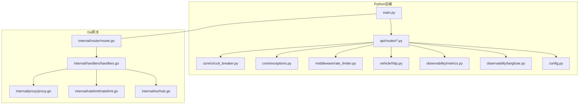
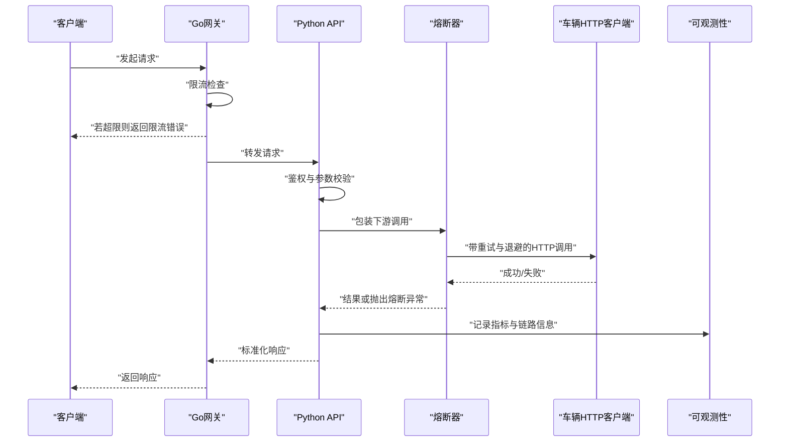
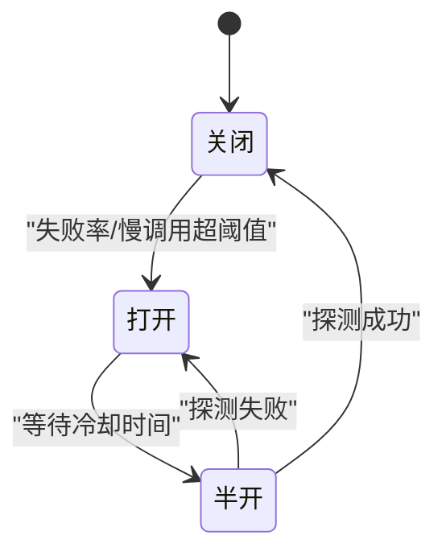
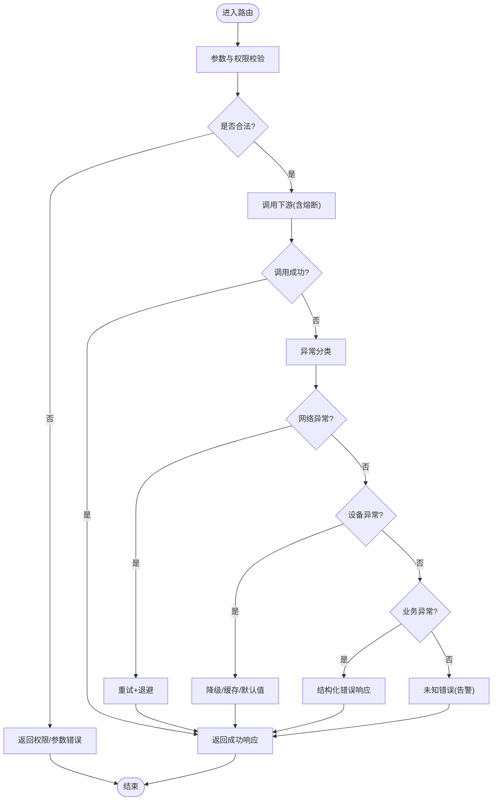
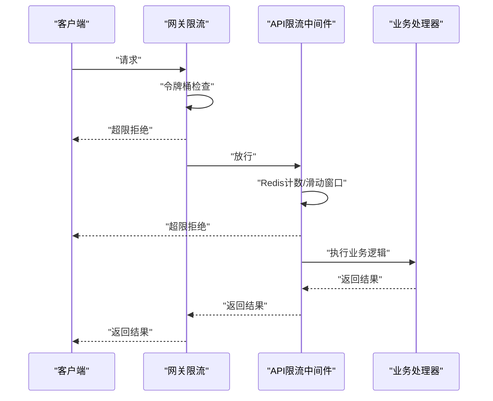
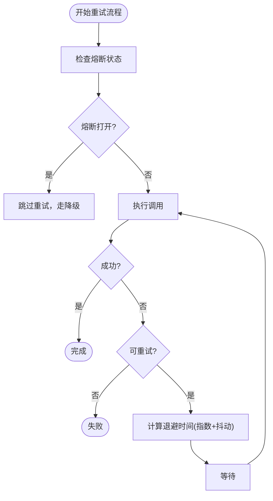
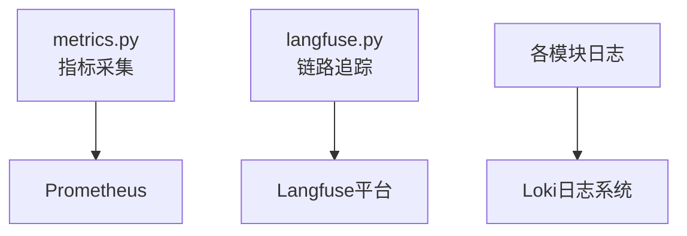
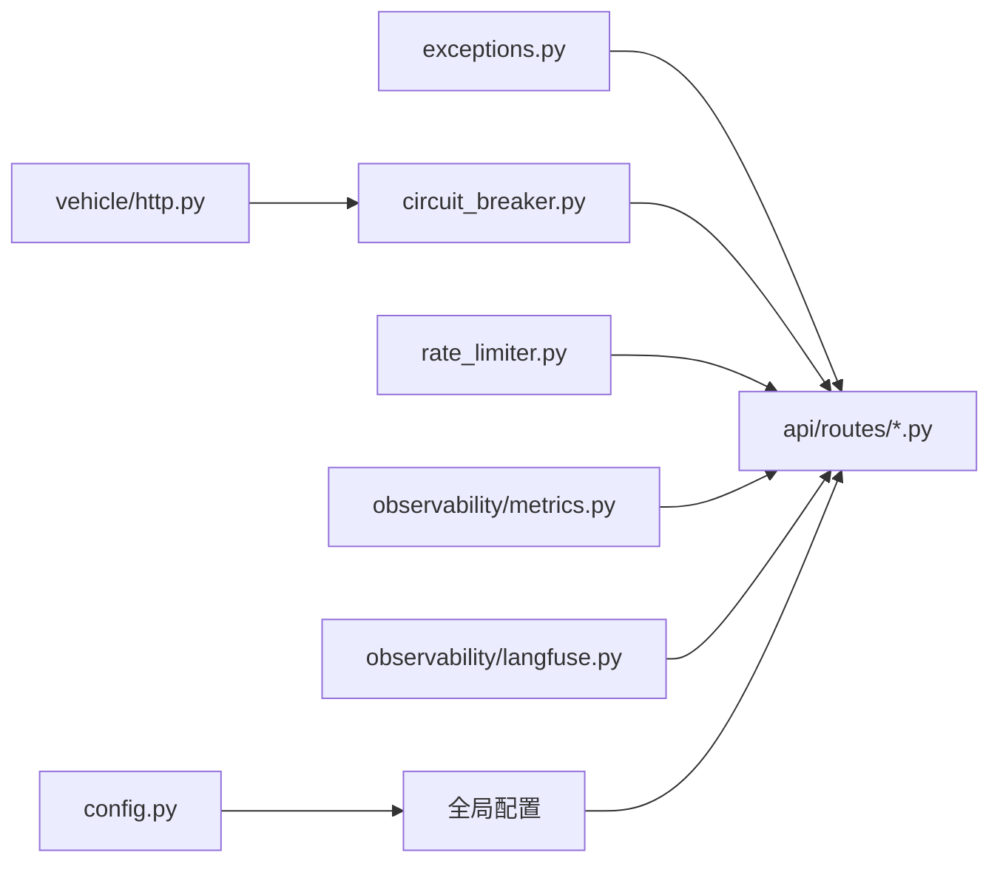

# 错误处理与故障恢复

<cite>
**本文引用的文件**   
- [backend_design/nexus/core/circuit_breaker.py](file://backend_design/nexus/core/circuit_breaker.py)
- [backend_design/nexus/core/exceptions.py](file://backend_design/nexus/core/exceptions.py)
- [backend_design/nexus/middleware/rate_limiter.py](file://backend_design/nexus/middleware/rate_limiter.py)
- [backend_design/nexus/api/routes/chat.py](file://backend_design/nexus/api/routes/chat.py)
- [backend_design/nexus/api/routes/auth.py](file://backend_design/nexus/api/routes/auth.py)
- [backend_design/nexus/api/routes/cockpit.py](file://backend_design/nexus/api/routes/cockpit.py)
- [backend_design/nexus/vehicle/http.py](file://backend_design/nexus/vehicle/http.py)
- [backend_design/nexus/observability/metrics.py](file://backend_design/nexus/observability/metrics.py)
- [backend_design/nexus/observability/langfuse.py](file://backend_design/nexus/observability/langfuse.py)
- [backend_design/nexus/config.py](file://backend_design/nexus/config.py)
- [backend_design/nexus/main.py](file://backend_design/nexus/main.py)
- [backend_design/nexus_gate/internal/ratelimit/ratelimit.go](file://backend_design/nexus_gate/internal/ratelimit/ratelimit.go)
- [backend_design/nexus_gate/internal/handlers/handlers.go](file://backend_design/nexus_gate/internal/handlers/handlers.go)
- [backend_design/nexus_gate/internal/proxy/proxy.go](file://backend_design/nexus_gate/internal/proxy/proxy.go)
- [backend_design/nexus_gate/internal/router/router.go](file://backend_design/nexus_gate/internal/router/router.go)
- [backend_design/nexus_gate/internal/ws/hub.go](file://backend_design/nexus_gate/internal/ws/hub.go)
- [backend_design/scripts/chaos_test.py](file://backend_design/scripts/chaos_test.py)
</cite>

## 目录
1. [简介](#简介)
2. [项目结构](#项目结构)
3. [核心组件](#核心组件)
4. [架构总览](#架构总览)
5. [详细组件分析](#详细组件分析)
6. [依赖关系分析](#依赖关系分析)
7. [性能考量](#性能考量)
8. [故障诊断指南](#故障诊断指南)
9. [灾难恢复与数据一致性](#灾难恢复与数据一致性)
10. [结论](#结论)

## 简介
本文件聚焦于NexusCockpit的错误处理与故障恢复机制，覆盖熔断器模式、异常分类与处理策略、限流机制、重试与退避策略、可观测性与日志分析、以及灾难恢复与数据一致性保证。文档旨在帮助开发者与运维人员快速定位问题、设计健壮的系统行为，并在故障发生时实现可控降级与自动恢复。

## 项目结构
围绕错误处理与故障恢复的关键代码主要分布在以下模块：
- 核心能力：熔断器、异常定义、配置、主入口
- API层路由：聊天、认证、座舱等接口中的错误处理与中间件集成
- 外部调用：车辆HTTP客户端的容错与重试
- 网关层（Go）：限流、代理转发、WebSocket连接管理
- 可观测性：指标采集与链路追踪
- 混沌工程脚本：用于演练与验证故障恢复

图表来源
- [backend_design/nexus/main.py](file://backend_design/nexus/main.py)
- [backend_design/nexus/api/routes/chat.py](file://backend_design/nexus/api/routes/chat.py)
- [backend_design/nexus/core/circuit_breaker.py](file://backend_design/nexus/core/circuit_breaker.py)
- [backend_design/nexus/core/exceptions.py](file://backend_design/nexus/core/exceptions.py)
- [backend_design/nexus/middleware/rate_limiter.py](file://backend_design/nexus/middleware/rate_limiter.py)
- [backend_design/nexus/vehicle/http.py](file://backend_design/nexus/vehicle/http.py)
- [backend_design/nexus/observability/metrics.py](file://backend_design/nexus/observability/metrics.py)
- [backend_design/nexus/observability/langfuse.py](file://backend_design/nexus/observability/langfuse.py)
- [backend_design/nexus/config.py](file://backend_design/nexus/config.py)
- [backend_design/nexus_gate/internal/router/router.go](file://backend_design/nexus_gate/internal/router/router.go)
- [backend_design/nexus_gate/internal/handlers/handlers.go](file://backend_design/nexus_gate/internal/handlers/handlers.go)
- [backend_design/nexus_gate/internal/proxy/proxy.go](file://backend_design/nexus_gate/internal/proxy/proxy.go)
- [backend_design/nexus_gate/internal/ratelimit/ratelimit.go](file://backend_design/nexus_gate/internal/ratelimit/ratelimit.go)
- [backend_design/nexus_gate/internal/ws/hub.go](file://backend_design/nexus_gate/internal/ws/hub.go)

章节来源
- [backend_design/nexus/main.py](file://backend_design/nexus/main.py)
- [backend_design/nexus/config.py](file://backend_design/nexus/config.py)

## 核心组件
- 熔断器：对下游服务或设备调用进行健康检测、失败计数与状态切换，支持半开探测与自动恢复。
- 异常体系：统一异常类型与错误码，便于上层路由与网关层识别并差异化处理。
- 限流：在API层与网关层双重限流，防止恶意请求与资源耗尽。
- 重试与退避：对外部HTTP调用的指数退避与抖动策略，避免雪崩。
- 可观测性：指标与链路追踪埋点，支撑故障定位与容量规划。

章节来源
- [backend_design/nexus/core/circuit_breaker.py](file://backend_design/nexus/core/circuit_breaker.py)
- [backend_design/nexus/core/exceptions.py](file://backend_design/nexus/core/exceptions.py)
- [backend_design/nexus/middleware/rate_limiter.py](file://backend_design/nexus/middleware/rate_limiter.py)
- [backend_design/nexus/vehicle/http.py](file://backend_design/nexus/vehicle/http.py)
- [backend_design/nexus/observability/metrics.py](file://backend_design/nexus/observability/metrics.py)
- [backend_design/nexus/observability/langfuse.py](file://backend_design/nexus/observability/langfuse.py)

## 架构总览
从请求进入网关到后端处理，错误处理贯穿全链路：
- 网关层：基于令牌桶/漏桶的限流，拒绝超限请求；代理转发时携带上下文与错误码。
- API层：中间件执行鉴权与限流；路由层捕获业务异常并转换为标准响应；关键路径使用熔断器保护。
- 外部调用：HTTP客户端封装重试与退避，结合熔断器降低级联故障风险。
- 可观测性：统一指标上报与链路追踪，辅助快速定位根因。

图表来源
- [backend_design/nexus_gate/internal/ratelimit/ratelimit.go](file://backend_design/nexus_gate/internal/ratelimit/ratelimit.go)
- [backend_design/nexus_gate/internal/handlers/handlers.go](file://backend_design/nexus_gate/internal/handlers/handlers.go)
- [backend_design/nexus_gate/internal/proxy/proxy.go](file://backend_design/nexus_gate/internal/proxy/proxy.go)
- [backend_design/nexus/api/routes/chat.py](file://backend_design/nexus/api/routes/chat.py)
- [backend_design/nexus/core/circuit_breaker.py](file://backend_design/nexus/core/circuit_breaker.py)
- [backend_design/nexus/vehicle/http.py](file://backend_design/nexus/vehicle/http.py)
- [backend_design/nexus/observability/metrics.py](file://backend_design/nexus/observability/metrics.py)
- [backend_design/nexus/observability/langfuse.py](file://backend_design/nexus/observability/langfuse.py)

## 详细组件分析

### 熔断器模式（故障检测、触发与自动恢复）
- 故障检测：统计窗口内的失败率与慢调用比例，超过阈值即判定为“不稳定”。
- 熔断触发：当失败率或慢调用比例达到阈值，切换到“熔断”状态，直接短路后续调用。
- 自动恢复：进入“半开”状态后允许少量探测请求，若成功则回到“关闭”，否则再次“打开”。
- 适用场景：对车辆HTTP调用、第三方LLM/RAG服务等不稳定依赖进行保护。

图表来源
- [backend_design/nexus/core/circuit_breaker.py](file://backend_design/nexus/core/circuit_breaker.py)

章节来源
- [backend_design/nexus/core/circuit_breaker.py](file://backend_design/nexus/core/circuit_breaker.py)

### 异常分类与处理策略
- 网络异常：超时、连接失败、DNS解析错误等。策略包括重试、退避、熔断降级。
- 设备异常：车辆离线、指令不可用、权限不足等。策略包括提示用户、回退到本地缓存或默认值。
- 权限异常：未认证、越权访问。策略包括立即拒绝并返回明确错误码，记录审计日志。
- 业务异常：参数非法、状态不一致。策略包括返回结构化错误信息，前端友好提示。

图表来源
- [backend_design/nexus/core/exceptions.py](file://backend_design/nexus/core/exceptions.py)
- [backend_design/nexus/api/routes/chat.py](file://backend_design/nexus/api/routes/chat.py)
- [backend_design/nexus/api/routes/auth.py](file://backend_design/nexus/api/routes/auth.py)
- [backend_design/nexus/api/routes/cockpit.py](file://backend_design/nexus/api/routes/cockpit.py)
- [backend_design/nexus/vehicle/http.py](file://backend_design/nexus/vehicle/http.py)

章节来源
- [backend_design/nexus/core/exceptions.py](file://backend_design/nexus/core/exceptions.py)
- [backend_design/nexus/api/routes/chat.py](file://backend_design/nexus/api/routes/chat.py)
- [backend_design/nexus/api/routes/auth.py](file://backend_design/nexus/api/routes/auth.py)
- [backend_design/nexus/api/routes/cockpit.py](file://backend_design/nexus/api/routes/cockpit.py)
- [backend_design/nexus/vehicle/http.py](file://backend_design/nexus/vehicle/http.py)

### 限流机制（网关与API层）
- 网关层限流：基于令牌桶/漏桶算法，按IP/用户维度限制QPS，超限直接拒绝。
- API层限流：中间件对特定路由进行速率控制，结合Redis实现分布式限流。
- 限流策略：区分读写操作、敏感接口与批量任务，采用不同阈值与惩罚策略。

图表来源
- [backend_design/nexus_gate/internal/ratelimit/ratelimit.go](file://backend_design/nexus_gate/internal/ratelimit/ratelimit.go)
- [backend_design/nexus/middleware/rate_limiter.py](file://backend_design/nexus/middleware/rate_limiter.py)

章节来源
- [backend_design/nexus_gate/internal/ratelimit/ratelimit.go](file://backend_design/nexus_gate/internal/ratelimit/ratelimit.go)
- [backend_design/nexus/middleware/rate_limiter.py](file://backend_design/nexus/middleware/rate_limiter.py)

### 重试机制与退避策略
- 重试条件：仅对幂等且短暂失败的请求进行重试，如网络超时、临时5xx错误。
- 退避策略：指数退避+随机抖动，避免集中重试导致二次冲击。
- 熔断协同：在熔断打开状态下跳过重试，直接进入降级路径。

图表来源
- [backend_design/nexus/vehicle/http.py](file://backend_design/nexus/vehicle/http.py)
- [backend_design/nexus/core/circuit_breaker.py](file://backend_design/nexus/core/circuit_breaker.py)

章节来源
- [backend_design/nexus/vehicle/http.py](file://backend_design/nexus/vehicle/http.py)
- [backend_design/nexus/core/circuit_breaker.py](file://backend_design/nexus/core/circuit_breaker.py)

### 可观测性与日志分析
- 指标采集：成功率、延迟分位、熔断状态、限流拒绝数等。
- 链路追踪：跨网关与API的请求ID透传，关联上下游调用。
- 日志规范：结构化日志，包含错误码、堆栈摘要、上下文标签。

图表来源
- [backend_design/nexus/observability/metrics.py](file://backend_design/nexus/observability/metrics.py)
- [backend_design/nexus/observability/langfuse.py](file://backend_design/nexus/observability/langfuse.py)

章节来源
- [backend_design/nexus/observability/metrics.py](file://backend_design/nexus/observability/metrics.py)
- [backend_design/nexus/observability/langfuse.py](file://backend_design/nexus/observability/langfuse.py)

## 依赖关系分析
- 低耦合高内聚：熔断器独立于业务路由，通过装饰器或包装函数注入。
- 网关与后端解耦：通过标准HTTP协议与错误码约定交互。
- 可观测性横切：指标与追踪在各层统一接入，不侵入业务逻辑。

图表来源
- [backend_design/nexus/core/exceptions.py](file://backend_design/nexus/core/exceptions.py)
- [backend_design/nexus/core/circuit_breaker.py](file://backend_design/nexus/core/circuit_breaker.py)
- [backend_design/nexus/middleware/rate_limiter.py](file://backend_design/nexus/middleware/rate_limiter.py)
- [backend_design/nexus/vehicle/http.py](file://backend_design/nexus/vehicle/http.py)
- [backend_design/nexus/observability/metrics.py](file://backend_design/nexus/observability/metrics.py)
- [backend_design/nexus/observability/langfuse.py](file://backend_design/nexus/observability/langfuse.py)
- [backend_design/nexus/config.py](file://backend_design/nexus/config.py)

章节来源
- [backend_design/nexus/core/exceptions.py](file://backend_design/nexus/core/exceptions.py)
- [backend_design/nexus/core/circuit_breaker.py](file://backend_design/nexus/core/circuit_breaker.py)
- [backend_design/nexus/middleware/rate_limiter.py](file://backend_design/nexus/middleware/rate_limiter.py)
- [backend_design/nexus/vehicle/http.py](file://backend_design/nexus/vehicle/http.py)
- [backend_design/nexus/observability/metrics.py](file://backend_design/nexus/observability/metrics.py)
- [backend_design/nexus/observability/langfuse.py](file://backend_design/nexus/observability/langfuse.py)
- [backend_design/nexus/config.py](file://backend_design/nexus/config.py)

## 性能考量
- 熔断窗口与阈值需根据实际流量与SLA调优，避免误判或过度保护。
- 限流阈值应结合网关与API层共同设定，确保端到端吞吐稳定。
- 重试次数与退避时间需平衡用户体验与下游压力，避免放大故障。
- 指标采样与日志级别在生产环境需谨慎配置，减少开销。

[本节为通用指导，无需引用具体文件]

## 故障诊断指南
- 快速定位：通过链路追踪ID关联网关、API与下游调用，查看错误码与堆栈摘要。
- 指标排查：关注成功率、P95/P99延迟、熔断状态、限流拒绝数等关键指标。
- 日志分析：检索结构化日志关键字段（错误码、上下文标签），过滤噪声。
- 混沌演练：使用混沌测试脚本模拟网络抖动、服务宕机，验证恢复策略有效性。

章节来源
- [backend_design/nexus/observability/metrics.py](file://backend_design/nexus/observability/metrics.py)
- [backend_design/nexus/observability/langfuse.py](file://backend_design/nexus/observability/langfuse.py)
- [backend_design/scripts/chaos_test.py](file://backend_design/scripts/chaos_test.py)

## 灾难恢复与数据一致性
- 服务重启与滚动升级：配合健康检查与就绪探针，确保流量平滑迁移。
- 数据一致性：对外部写操作引入幂等键与补偿事务，失败时重试或人工介入。
- 降级预案：在关键依赖不可用时，启用缓存与默认值，保障核心功能可用。
- 备份与恢复：定期快照与增量备份，制定RTO/RPO目标并演练恢复流程。

[本节为通用指导，无需引用具体文件]

## 结论
通过熔断器、限流、重试与退避、异常分类与可观测性的协同，NexusCockpit能够在复杂环境下保持高可用与鲁棒性。建议持续优化阈值与策略，完善监控告警与演练机制，确保在真实故障场景中快速恢复与最小影响。