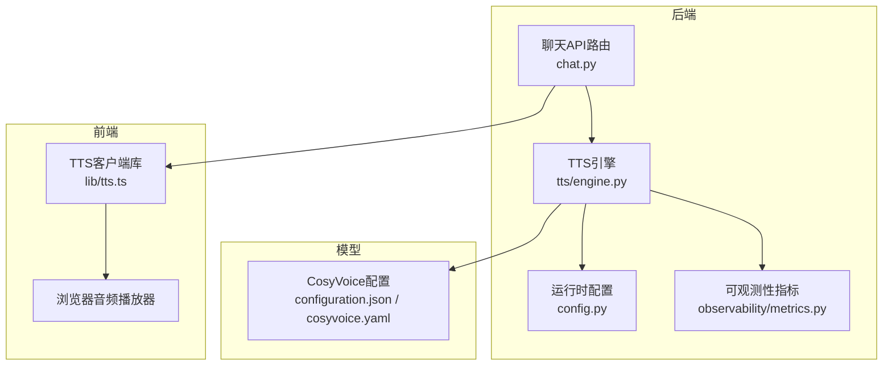
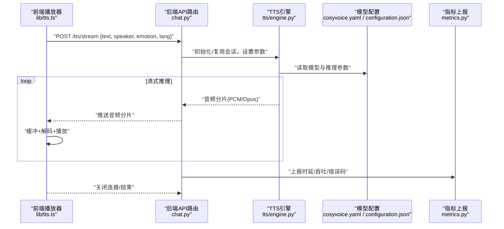
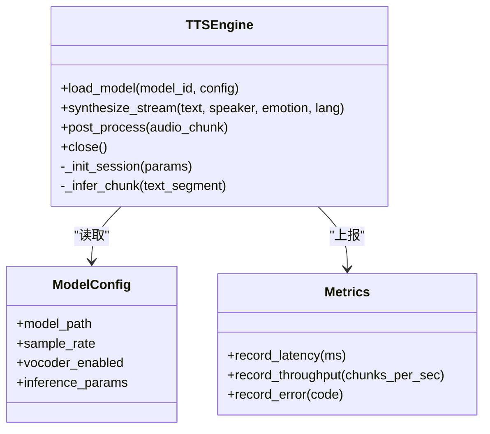
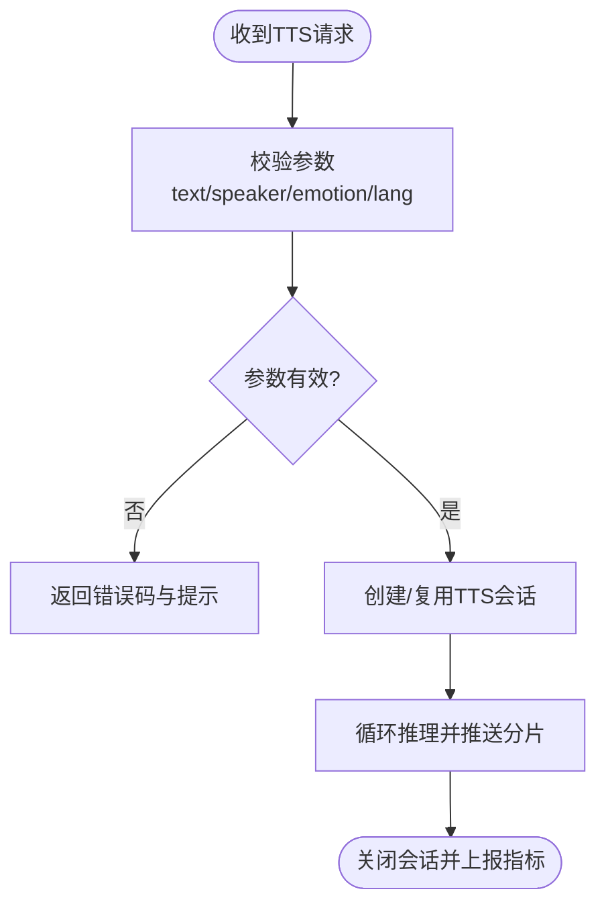
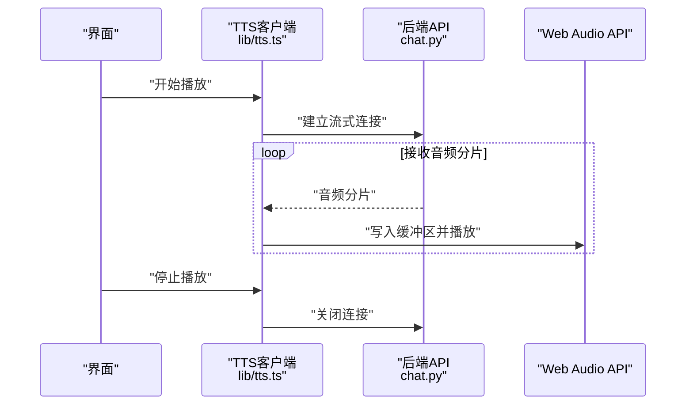
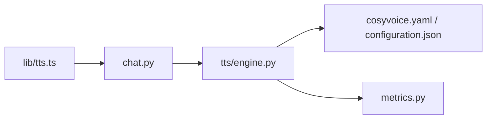

# TTS语音合成系统

<cite>
**本文引用的文件**   
- [backend_design/nexus/tts/engine.py](file://backend_design/nexus/tts/engine.py)
- [backend_design/nexus/api/routes/chat.py](file://backend_design/nexus/api/routes/chat.py)
- [frontend_design/src/lib/tts.ts](file://frontend_design/src/lib/tts.ts)
- [models/tts/cosyvoice/configuration.json](file://models/tts/cosyvoice/configuration.json)
- [models/tts/cosyvoice/cosyvoice.yaml](file://models/tts/cosyvoice/cosyvoice.yaml)
- [assets/speaker/enroll_wav/README.md](file://assets/speaker/enroll_wav/README.md)
- [assets/speaker/users/cockpit-01/nexus_dev/README.md](file://assets/speaker/users/cockpit-01/nexus_dev/README.md)
- [docs/voice/tts-guide.md](file://docs/voice/tts-guide.md)
- [docs/voice/audio-pipeline-guide.md](file://docs/voice/audio-pipeline-guide.md)
- [docs/voice/voiceprint-guide.md](file://docs/voice/voiceprint-guide.md)
- [backend_design/nexus/core/personalization.py](file://backend_design/nexus/core/personalization.py)
- [backend_design/nexus/core/voiceprint.py](file://backend_design/nexus/core/voiceprint.py)
- [backend_design/nexus/config.py](file://backend_design/nexus/config.py)
- [backend_design/nexus/observability/metrics.py](file://backend_design/nexus/observability/metrics.py)
</cite>

## 目录
1. [简介](#简介)
2. [项目结构](#项目结构)
3. [核心组件](#核心组件)
4. [架构总览](#架构总览)
5. [详细组件分析](#详细组件分析)
6. [依赖关系分析](#依赖关系分析)
7. [性能考量](#性能考量)
8. [故障排查指南](#故障排查指南)
9. [结论](#结论)
10. [附录](#附录)

## 简介
本技术文档面向NexusCockpit的TTS文本转语音系统，重点阐述CosyVoice模型的集成实现与工程化落地。内容覆盖：
- 情感化语音合成、个性化音色选择与自然度优化策略
- 流式语音合成（增量生成、低延迟播放、内存优化）
- 多语种支持与方言处理（发音规则、语调控制、韵律调整）
- 语音质量优化（背景音去除、音量标准化、音质增强）
- TTS引擎配置项、音色管理与自定义训练方法
- 前端音频播放器集成示例与性能监控指标

## 项目结构
TTS相关代码主要分布在后端服务、模型配置、前端播放器与文档四个层面：
- 后端TTS引擎与API路由：负责接收文本请求、加载模型、执行推理、输出音频流
- 模型配置：CosyVoice模型参数与运行配置
- 前端播放器：基于Web Audio API进行流式解码与播放
- 文档与资源：TTS使用指南、音频管线说明、声纹与音色管理资料

图表来源
- [backend_design/nexus/api/routes/chat.py](file://backend_design/nexus/api/routes/chat.py)
- [backend_design/nexus/tts/engine.py](file://backend_design/nexus/tts/engine.py)
- [models/tts/cosyvoice/configuration.json](file://models/tts/cosyvoice/configuration.json)
- [models/tts/cosyvoice/cosyvoice.yaml](file://models/tts/cosyvoice/cosyvoice.yaml)
- [frontend_design/src/lib/tts.ts](file://frontend_design/src/lib/tts.ts)
- [backend_design/nexus/config.py](file://backend_design/nexus/config.py)
- [backend_design/nexus/observability/metrics.py](file://backend_design/nexus/observability/metrics.py)

章节来源
- [backend_design/nexus/tts/engine.py](file://backend_design/nexus/tts/engine.py)
- [backend_design/nexus/api/routes/chat.py](file://backend_design/nexus/api/routes/chat.py)
- [frontend_design/src/lib/tts.ts](file://frontend_design/src/lib/tts.ts)
- [models/tts/cosyvoice/configuration.json](file://models/tts/cosyvoice/configuration.json)
- [models/tts/cosyvoice/cosyvoice.yaml](file://models/tts/cosyvoice/cosyvoice.yaml)
- [backend_design/nexus/config.py](file://backend_design/nexus/config.py)
- [backend_design/nexus/observability/metrics.py](file://backend_design/nexus/observability/metrics.py)

## 核心组件
- TTS引擎（后端）
  - 职责：加载CosyVoice模型、解析请求参数（文本、说话人、情感、语言/方言）、执行推理并返回音频流或分片数据
  - 关键能力：流式生成、说话人切换、情感控制、语言/方言路由、质量后处理
- API路由（后端）
  - 职责：暴露HTTP/WebSocket接口，转发TTS请求，聚合指标上报
- 前端TTS客户端
  - 职责：发起流式请求、缓冲音频块、调用Web Audio API播放、管理播放状态与错误重试
- 模型配置
  - 职责：定义CosyVoice模型路径、采样率、推理参数、可选的Vocoder与声学模型开关
- 可观测性与配置
  - 职责：记录TTS时延、吞吐、错误码；提供运行时开关（如是否启用流式、最大分片大小）

章节来源
- [backend_design/nexus/tts/engine.py](file://backend_design/nexus/tts/engine.py)
- [backend_design/nexus/api/routes/chat.py](file://backend_design/nexus/api/routes/chat.py)
- [frontend_design/src/lib/tts.ts](file://frontend_design/src/lib/tts.ts)
- [models/tts/cosyvoice/configuration.json](file://models/tts/cosyvoice/configuration.json)
- [models/tts/cosyvoice/cosyvoice.yaml](file://models/tts/cosyvoice/cosyvoice.yaml)
- [backend_design/nexus/config.py](file://backend_design/nexus/config.py)
- [backend_design/nexus/observability/metrics.py](file://backend_design/nexus/observability/metrics.py)

## 架构总览
整体流程从前端发起TTS请求开始，经后端API路由进入TTS引擎，引擎根据配置加载CosyVoice模型并进行流式推理，将生成的音频片段回传给前端进行实时播放。

图表来源
- [backend_design/nexus/api/routes/chat.py](file://backend_design/nexus/api/routes/chat.py)
- [backend_design/nexus/tts/engine.py](file://backend_design/nexus/tts/engine.py)
- [models/tts/cosyvoice/configuration.json](file://models/tts/cosyvoice/configuration.json)
- [models/tts/cosyvoice/cosyvoice.yaml](file://models/tts/cosyvoice/cosyvoice.yaml)
- [frontend_design/src/lib/tts.ts](file://frontend_design/src/lib/tts.ts)
- [backend_design/nexus/observability/metrics.py](file://backend_design/nexus/observability/metrics.py)

## 详细组件分析

### TTS引擎（后端）
- 功能要点
  - 模型加载与缓存：按模型标识与参数键构建会话缓存，避免重复加载
  - 流式推理：支持增量生成音频分片，降低首包时延
  - 说话人与情感：通过说话人ID与情感标签驱动风格化合成
  - 语言/方言：依据语言/方言代码选择对应词典与韵律模板
  - 质量后处理：可选降噪、响度归一化、动态范围压缩
- 关键数据结构
  - 会话上下文：包含模型句柄、说话人嵌入、情感向量、语言/方言配置
  - 音频分片：固定时长或固定字节数的PCM/Opus片段
- 错误处理
  - 参数校验失败、模型加载失败、推理超时、IO异常等均有明确错误码与日志
- 性能优化
  - 会话复用、分片大小自适应、GPU/CPU设备选择、批处理开关

图表来源
- [backend_design/nexus/tts/engine.py](file://backend_design/nexus/tts/engine.py)
- [models/tts/cosyvoice/configuration.json](file://models/tts/cosyvoice/configuration.json)
- [models/tts/cosyvoice/cosyvoice.yaml](file://models/tts/cosyvoice/cosyvoice.yaml)
- [backend_design/nexus/observability/metrics.py](file://backend_design/nexus/observability/metrics.py)

章节来源
- [backend_design/nexus/tts/engine.py](file://backend_design/nexus/tts/engine.py)
- [models/tts/cosyvoice/configuration.json](file://models/tts/cosyvoice/configuration.json)
- [models/tts/cosyvoice/cosyvoice.yaml](file://models/tts/cosyvoice/cosyvoice.yaml)
- [backend_design/nexus/observability/metrics.py](file://backend_design/nexus/observability/metrics.py)

### API路由（后端）
- 职责
  - 接收前端TTS请求，校验参数，创建或复用TTS会话
  - 将流式音频分片透传至前端，并在结束时清理资源
  - 聚合上报TTS相关指标（首包时延、平均时延、错误率）
- 安全与限流
  - 鉴权中间件、速率限制、输入长度限制
- 兼容性
  - 兼容同步与流式两种模式，便于不同前端适配

图表来源
- [backend_design/nexus/api/routes/chat.py](file://backend_design/nexus/api/routes/chat.py)
- [backend_design/nexus/tts/engine.py](file://backend_design/nexus/tts/engine.py)
- [backend_design/nexus/observability/metrics.py](file://backend_design/nexus/observability/metrics.py)

章节来源
- [backend_design/nexus/api/routes/chat.py](file://backend_design/nexus/api/routes/chat.py)
- [backend_design/nexus/tts/engine.py](file://backend_design/nexus/tts/engine.py)
- [backend_design/nexus/observability/metrics.py](file://backend_design/nexus/observability/metrics.py)

### 前端TTS客户端（播放器集成）
- 职责
  - 发起流式请求，维护WebSocket或SSE连接
  - 对收到的音频分片进行缓冲、解码与播放
  - 管理播放状态（播放/暂停/停止），处理网络抖动与重连
- 播放策略
  - 预缓冲阈值、动态缓冲调整、丢帧策略
  - 音量标准化与静音段跳过
- 错误处理
  - 网络异常、解码失败、播放中断的重试与降级

图表来源
- [frontend_design/src/lib/tts.ts](file://frontend_design/src/lib/tts.ts)
- [backend_design/nexus/api/routes/chat.py](file://backend_design/nexus/api/routes/chat.py)

章节来源
- [frontend_design/src/lib/tts.ts](file://frontend_design/src/lib/tts.ts)
- [backend_design/nexus/api/routes/chat.py](file://backend_design/nexus/api/routes/chat.py)

### 模型配置（CosyVoice）
- 配置项概览
  - 模型路径、采样率、Vocoder开关、推理参数（如温度、Top-K、分段长度）
  - 可选的多语/方言词典与韵律模板路径
- 使用建议
  - 生产环境建议固定模型版本与参数，避免热更新导致的不一致
  - 针对车载场景，适当提高采样率与降低分片时长以平衡音质与时延

章节来源
- [models/tts/cosyvoice/configuration.json](file://models/tts/cosyvoice/configuration.json)
- [models/tts/cosyvoice/cosyvoice.yaml](file://models/tts/cosyvoice/cosyvoice.yaml)

### 音色管理与个性化
- 音色注册与存储
  - 用户音色样本存放于assets/speaker目录，支持按租户/用户维度组织
- 声纹识别与匹配
  - 通过声纹特征进行说话人识别与推荐，提升个性化体验
- 个性化偏好
  - 结合用户历史交互与偏好设置，自动选择合适的情感与语速

章节来源
- [assets/speaker/enroll_wav/README.md](file://assets/speaker/enroll_wav/README.md)
- [assets/speaker/users/cockpit-01/nexus_dev/README.md](file://assets/speaker/users/cockpit-01/nexus_dev/README.md)
- [backend_design/nexus/core/voiceprint.py](file://backend_design/nexus/core/voiceprint.py)
- [backend_design/nexus/core/personalization.py](file://backend_design/nexus/core/personalization.py)

### 多语种与方言处理
- 语言/方言路由
  - 根据请求中的语言/方言代码选择对应词典与韵律模板
- 发音与韵律
  - 针对不同语言的音素边界与重音规则进行调整
  - 方言特有的语调与节奏可通过韵律模板微调
- 质量保障
  - 在混合语言场景中，确保跨语言切换自然，避免突兀停顿

章节来源
- [models/tts/cosyvoice/configuration.json](file://models/tts/cosyvoice/configuration.json)
- [models/tts/cosyvoice/cosyvoice.yaml](file://models/tts/cosyvoice/cosyvoice.yaml)
- [docs/voice/tts-guide.md](file://docs/voice/tts-guide.md)

### 语音质量优化策略
- 背景音去除
  - 在端侧或服务端引入轻量降噪模块，抑制环境噪声
- 音量标准化
  - 统一响度级别，避免忽大忽小
- 音质增强
  - 动态范围压缩、高频补偿、去混响（视硬件条件开启）

章节来源
- [docs/voice/audio-pipeline-guide.md](file://docs/voice/audio-pipeline-guide.md)
- [backend_design/nexus/tts/engine.py](file://backend_design/nexus/tts/engine.py)

### 自定义训练与微调
- 训练数据准备
  - 收集高质量语音样本，标注文本与说话人信息
- 训练流程
  - 基于CosyVoice框架进行声学模型与Vocoder微调
  - 验证集评估自然度与相似度指标
- 部署与发布
  - 导出权重与配置，纳入模型仓库并按版本管理

章节来源
- [docs/voice/tts-guide.md](file://docs/voice/tts-guide.md)
- [models/tts/cosyvoice/configuration.json](file://models/tts/cosyvoice/configuration.json)
- [models/tts/cosyvoice/cosyvoice.yaml](file://models/tts/cosyvoice/cosyvoice.yaml)

## 依赖关系分析
- 组件耦合
  - API路由依赖TTS引擎与会话管理
  - TTS引擎依赖模型配置与指标上报
  - 前端依赖API路由提供的流式接口
- 外部依赖
  - CosyVoice模型与可选Vocoder
  - 浏览器Web Audio API（前端）
  - 指标采集与可视化（Prometheus/Grafana）

图表来源
- [backend_design/nexus/api/routes/chat.py](file://backend_design/nexus/api/routes/chat.py)
- [backend_design/nexus/tts/engine.py](file://backend_design/nexus/tts/engine.py)
- [models/tts/cosyvoice/configuration.json](file://models/tts/cosyvoice/configuration.json)
- [models/tts/cosyvoice/cosyvoice.yaml](file://models/tts/cosyvoice/cosyvoice.yaml)
- [frontend_design/src/lib/tts.ts](file://frontend_design/src/lib/tts.ts)
- [backend_design/nexus/observability/metrics.py](file://backend_design/nexus/observability/metrics.py)

章节来源
- [backend_design/nexus/api/routes/chat.py](file://backend_design/nexus/api/routes/chat.py)
- [backend_design/nexus/tts/engine.py](file://backend_design/nexus/tts/engine.py)
- [frontend_design/src/lib/tts.ts](file://frontend_design/src/lib/tts.ts)
- [backend_design/nexus/observability/metrics.py](file://backend_design/nexus/observability/metrics.py)

## 性能考量
- 首包时延
  - 采用流式推理与较小分片，缩短首包时间
- 吞吐与并发
  - 会话复用与批处理提升吞吐；合理设置并发上限
- 内存占用
  - 控制分片大小与缓冲队列长度，避免峰值内存过高
- 设备利用
  - GPU加速推理，CPU作为降级方案
- 前端播放
  - 动态缓冲与丢帧策略，在网络波动下保持流畅

[本节为通用指导，不直接分析具体文件]

## 故障排查指南
- 常见问题
  - 模型加载失败：检查模型路径与权限
  - 流式中断：检查网络稳定性与后端心跳机制
  - 音质异常：确认采样率与Vocoder配置一致
- 定位手段
  - 查看TTS指标（时延、吞吐、错误码）
  - 核对前后端参数一致性（语言/方言、说话人ID）
  - 回放音频分片，定位问题阶段（生成/传输/播放）

章节来源
- [backend_design/nexus/observability/metrics.py](file://backend_design/nexus/observability/metrics.py)
- [backend_design/nexus/tts/engine.py](file://backend_design/nexus/tts/engine.py)
- [backend_design/nexus/api/routes/chat.py](file://backend_design/nexus/api/routes/chat.py)

## 结论
本TTS系统以CosyVoice为核心，结合流式推理与前端实时播放，实现了低延迟、高自然的语音合成体验。通过完善的配置管理、音色与个性化策略、以及质量优化手段，满足车载场景对语音交互的高要求。建议在持续迭代中关注指标监控与A/B测试，不断优化自然度与用户体验。

[本节为总结性内容，不直接分析具体文件]

## 附录
- 参考文档
  - TTS使用指南：[docs/voice/tts-guide.md](file://docs/voice/tts-guide.md)
  - 音频管线说明：[docs/voice/audio-pipeline-guide.md](file://docs/voice/audio-pipeline-guide.md)
  - 声纹与音色管理：[docs/voice/voiceprint-guide.md](file://docs/voice/voiceprint-guide.md)
- 配置与资源
  - CosyVoice配置：[models/tts/cosyvoice/configuration.json](file://models/tts/cosyvoice/configuration.json)、[models/tts/cosyvoice/cosyvoice.yaml](file://models/tts/cosyvoice/cosyvoice.yaml)
  - 音色样本目录：[assets/speaker/enroll_wav/README.md](file://assets/speaker/enroll_wav/README.md)、[assets/speaker/users/cockpit-01/nexus_dev/README.md](file://assets/speaker/users/cockpit-01/nexus_dev/README.md)