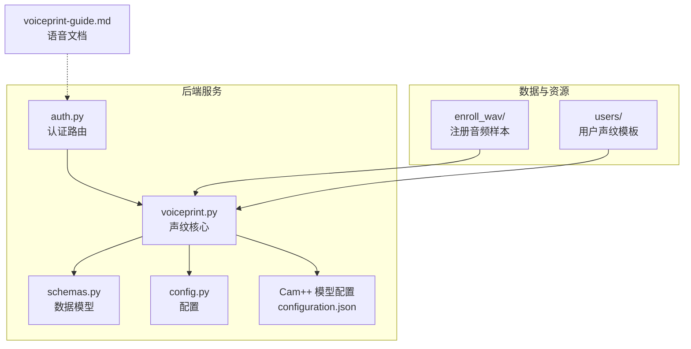
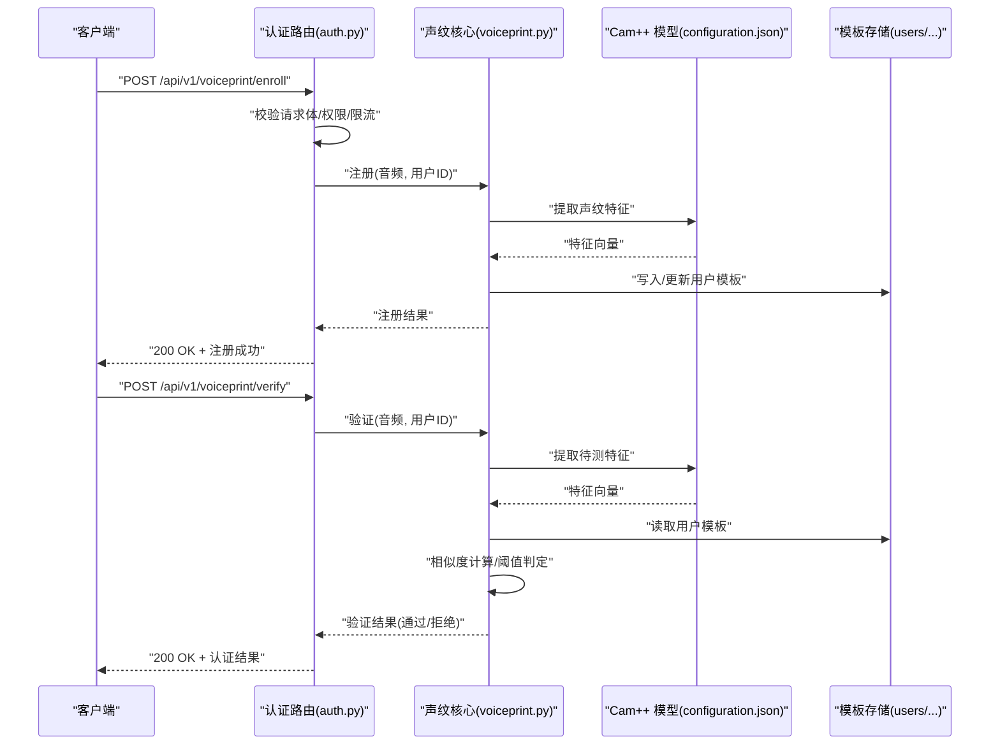
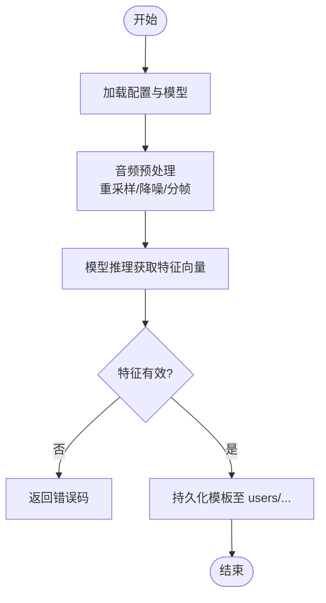
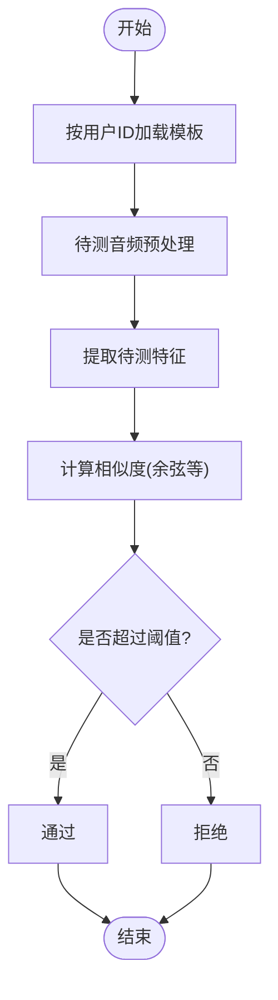
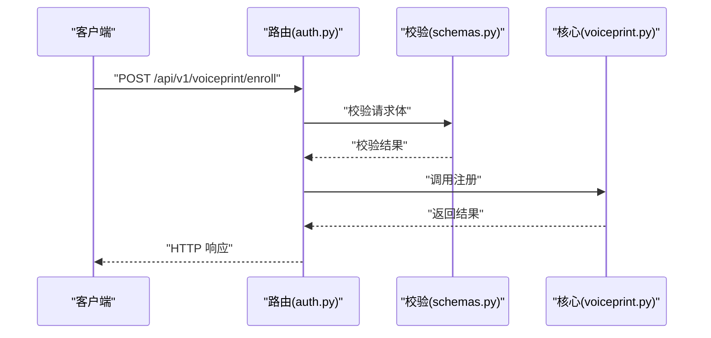
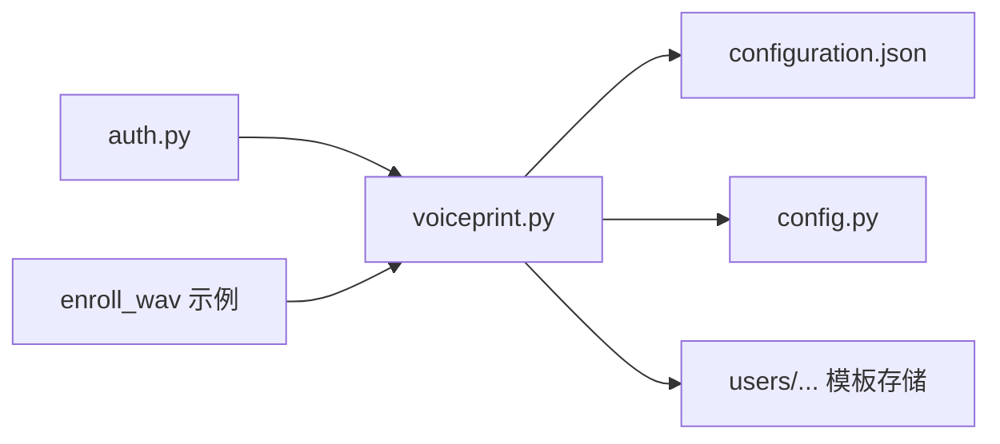

# 声纹识别认证

<cite>
**本文引用的文件**   
- [backend_design/nexus/core/voiceprint.py](file://backend_design/nexus/core/voiceprint.py)
- [backend_design/nexus/api/routes/auth.py](file://backend_design/nexus/api/routes/auth.py)
- [backend_design/nexus/models/schemas.py](file://backend_design/nexus/models/schemas.py)
- [backend_design/nexus/config.py](file://backend_design/nexus/config.py)
- [models/sv/cam_plus/configuration.json](file://models/sv/cam_plus/configuration.json)
- [assets/speaker/enroll_wav/README.md](file://assets/speaker/enroll_wav/README.md)
- [assets/speaker/users/cockpit-01/nexus_dev/README.md](file://assets/speaker/users/cockpit-01/nexus_dev/README.md)
- [docs/voice/voiceprint-guide.md](file://docs/voice/voiceprint-guide.md)
</cite>

## 目录
1. [简介](#简介)
2. [项目结构](#项目结构)
3. [核心组件](#核心组件)
4. [架构总览](#架构总览)
5. [详细组件分析](#详细组件分析)
6. [依赖关系分析](#依赖关系分析)
7. [性能考虑](#性能考虑)
8. [故障排查指南](#故障排查指南)
9. [结论](#结论)
10. [附录：API 接口文档与示例](#附录api-接口文档与示例)

## 简介
本技术文档面向 NexusCockpit 的声纹识别认证子系统，聚焦于 Cam++ 模型的集成实现、用户注册与身份验证流程、声纹数据库管理（模板存储、索引优化、批量操作）、安全策略（防重放、活体检测、隐私保护）、匹配算法（相似度计算、阈值调整、误识率控制），以及系统配置、性能调优与安全加固方法。文档同时提供完整的 API 接口说明与使用示例，帮助开发者快速集成与运维。

## 项目结构
与声纹识别相关的代码与资源主要分布在以下位置：
- 后端核心逻辑：backend_design/nexus/core/voiceprint.py
- 认证路由与接口：backend_design/nexus/api/routes/auth.py
- 数据模型与校验：backend_design/nexus/models/schemas.py
- 配置项：backend_design/nexus/config.py
- Cam++ 模型配置：models/sv/cam_plus/configuration.json
- 示例音频与用户模板目录：assets/speaker/enroll_wav、assets/speaker/users
- 语音相关文档：docs/voice/voiceprint-guide.md

图表来源
- [backend_design/nexus/api/routes/auth.py](file://backend_design/nexus/api/routes/auth.py)
- [backend_design/nexus/core/voiceprint.py](file://backend_design/nexus/core/voiceprint.py)
- [backend_design/nexus/models/schemas.py](file://backend_design/nexus/models/schemas.py)
- [backend_design/nexus/config.py](file://backend_design/nexus/config.py)
- [models/sv/cam_plus/configuration.json](file://models/sv/cam_plus/configuration.json)
- [assets/speaker/enroll_wav/README.md](file://assets/speaker/enroll_wav/README.md)
- [assets/speaker/users/cockpit-01/nexus_dev/README.md](file://assets/speaker/users/cockpit-01/nexus_dev/README.md)
- [docs/voice/voiceprint-guide.md](file://docs/voice/voiceprint-guide.md)

章节来源
- [backend_design/nexus/core/voiceprint.py](file://backend_design/nexus/core/voiceprint.py)
- [backend_design/nexus/api/routes/auth.py](file://backend_design/nexus/api/routes/auth.py)
- [backend_design/nexus/models/schemas.py](file://backend_design/nexus/models/schemas.py)
- [backend_design/nexus/config.py](file://backend_design/nexus/config.py)
- [models/sv/cam_plus/configuration.json](file://models/sv/cam_plus/configuration.json)
- [assets/speaker/enroll_wav/README.md](file://assets/speaker/enroll_wav/README.md)
- [assets/speaker/users/cockpit-01/nexus_dev/README.md](file://assets/speaker/users/cockpit-01/nexus_dev/README.md)
- [docs/voice/voiceprint-guide.md](file://docs/voice/voiceprint-guide.md)

## 核心组件
- 声纹核心模块（voiceprint.py）
  - 负责加载 Cam++ 模型、提取声纹特征、生成与更新用户模板、执行比对与评分、管理本地模板存储与索引。
  - 关键能力包括：音频预处理、特征向量抽取、模板持久化、相似度计算、阈值判定、批量注册与检索。
- 认证路由（auth.py）
  - 暴露注册、登录（声纹认证）、查询、删除等 REST 接口；处理请求校验、会话上下文、错误码与响应封装。
- 数据模型（schemas.py）
  - 定义注册/认证请求与响应的数据结构、字段约束与校验规则。
- 配置（config.py）
  - 集中管理模型路径、采样率、分帧参数、相似度阈值、超时、并发、缓存与日志级别等。
- Cam++ 模型配置（configuration.json）
  - 描述模型权重、输入格式、输出维度、归一化方式等推理所需元信息。
- 示例资源与文档
  - assets/speaker 下提供注册音频样例与用户模板目录结构；docs/voice/voiceprint-guide.md 提供端到端使用指引。

章节来源
- [backend_design/nexus/core/voiceprint.py](file://backend_design/nexus/core/voiceprint.py)
- [backend_design/nexus/api/routes/auth.py](file://backend_design/nexus/api/routes/auth.py)
- [backend_design/nexus/models/schemas.py](file://backend_design/nexus/models/schemas.py)
- [backend_design/nexus/config.py](file://backend_design/nexus/config.py)
- [models/sv/cam_plus/configuration.json](file://models/sv/cam_plus/configuration.json)
- [docs/voice/voiceprint-guide.md](file://docs/voice/voiceprint-guide.md)

## 架构总览
整体采用“前端/网关 -> 认证路由 -> 声纹核心 -> 模型与存储”的分层架构。认证路由负责协议与校验，声纹核心封装模型推理与业务逻辑，模型配置与模板数据作为外部依赖。

图表来源
- [backend_design/nexus/api/routes/auth.py](file://backend_design/nexus/api/routes/auth.py)
- [backend_design/nexus/core/voiceprint.py](file://backend_design/nexus/core/voiceprint.py)
- [models/sv/cam_plus/configuration.json](file://models/sv/cam_plus/configuration.json)
- [assets/speaker/users/cockpit-01/nexus_dev/README.md](file://assets/speaker/users/cockpit-01/nexus_dev/README.md)

## 详细组件分析

### 声纹核心模块（voiceprint.py）
职责与边界
- 模型加载与初始化：根据 configuration.json 加载 Cam++ 模型与必要预处理参数。
- 特征提取：对输入音频进行降噪、重采样、分帧、加窗、归一化后送入模型得到固定维度的声纹向量。
- 模板管理：将用户 ID 与特征向量映射到本地存储（如 users/{tenant}/{user}/ 目录），支持覆盖更新与批量导入。
- 匹配与评分：计算待测特征与模板向量的相似度（如余弦相似度），结合阈值判定通过与否。
- 异常与降级：捕获模型加载失败、IO 错误、非法输入等异常，返回统一错误码并记录日志。

关键流程（注册）

图表来源
- [backend_design/nexus/core/voiceprint.py](file://backend_design/nexus/core/voiceprint.py)
- [models/sv/cam_plus/configuration.json](file://models/sv/cam_plus/configuration.json)

关键流程（验证）

图表来源
- [backend_design/nexus/core/voiceprint.py](file://backend_design/nexus/core/voiceprint.py)

章节来源
- [backend_design/nexus/core/voiceprint.py](file://backend_design/nexus/core/voiceprint.py)

### 认证路由（auth.py）
职责与边界
- 暴露 REST 接口：注册、验证、查询、删除、批量导入等。
- 请求校验：基于 schemas.py 的结构与约束进行入参校验。
- 安全中间件：鉴权、限流、防重放（时间戳+随机数签名）、审计日志。
- 响应封装：统一成功/失败结构与状态码。

典型调用链

图表来源
- [backend_design/nexus/api/routes/auth.py](file://backend_design/nexus/api/routes/auth.py)
- [backend_design/nexus/models/schemas.py](file://backend_design/nexus/models/schemas.py)
- [backend_design/nexus/core/voiceprint.py](file://backend_design/nexus/core/voiceprint.py)

章节来源
- [backend_design/nexus/api/routes/auth.py](file://backend_design/nexus/api/routes/auth.py)
- [backend_design/nexus/models/schemas.py](file://backend_design/nexus/models/schemas.py)

### 数据模型（schemas.py）
- 定义注册/验证请求体字段（如用户标识、音频数据或上传文件、可选提示词等）。
- 定义响应体结构（如状态码、消息、相似度分数、模板版本等）。
- 提供字段类型、必填性、长度范围、枚举值等约束。

章节来源
- [backend_design/nexus/models/schemas.py](file://backend_design/nexus/models/schemas.py)

### 配置（config.py）
- 模型路径与设备选择（CPU/GPU）。
- 音频参数：采样率、分帧长度、步长、窗口函数、归一化策略。
- 匹配参数：相似度度量、阈值、最大重试次数、超时。
- 存储路径：模板根目录、备份策略、索引文件位置。
- 运行时：并发度、线程池大小、缓存开关、日志级别。

章节来源
- [backend_design/nexus/config.py](file://backend_design/nexus/config.py)

### Cam++ 模型配置（configuration.json）
- 模型权重路径、输入张量形状、输出维度。
- 预处理要求（如声道数、采样率、静音裁剪）。
- 后处理选项（L2 归一化、特征缩放）。

章节来源
- [models/sv/cam_plus/configuration.json](file://models/sv/cam_plus/configuration.json)

### 示例资源与文档
- enroll_wav：提供标准长度的注册音频样例，便于快速验证流水线。
- users：按租户/用户组织模板目录，便于多租户隔离与批量管理。
- voiceprint-guide.md：包含端到端注册与验证步骤、常见问题与最佳实践。

章节来源
- [assets/speaker/enroll_wav/README.md](file://assets/speaker/enroll_wav/README.md)
- [assets/speaker/users/cockpit-01/nexus_dev/README.md](file://assets/speaker/users/cockpit-01/nexus_dev/README.md)
- [docs/voice/voiceprint-guide.md](file://docs/voice/voiceprint-guide.md)

## 依赖关系分析
- 路由层依赖模型层与数据层：auth.py 调用 voiceprint.py，后者依赖 configuration.json 与本地模板存储。
- 配置驱动：config.py 贯穿模型加载、预处理、匹配阈值与存储路径。
- 外部资源：示例音频与用户模板位于 assets/speaker 下，供开发与演示使用。

图表来源
- [backend_design/nexus/api/routes/auth.py](file://backend_design/nexus/api/routes/auth.py)
- [backend_design/nexus/core/voiceprint.py](file://backend_design/nexus/core/voiceprint.py)
- [backend_design/nexus/config.py](file://backend_design/nexus/config.py)
- [models/sv/cam_plus/configuration.json](file://models/sv/cam_plus/configuration.json)
- [assets/speaker/enroll_wav/README.md](file://assets/speaker/enroll_wav/README.md)
- [assets/speaker/users/cockpit-01/nexus_dev/README.md](file://assets/speaker/users/cockpit-01/nexus_dev/README.md)

章节来源
- [backend_design/nexus/api/routes/auth.py](file://backend_design/nexus/api/routes/auth.py)
- [backend_design/nexus/core/voiceprint.py](file://backend_design/nexus/core/voiceprint.py)
- [backend_design/nexus/config.py](file://backend_design/nexus/config.py)
- [models/sv/cam_plus/configuration.json](file://models/sv/cam_plus/configuration.json)
- [assets/speaker/enroll_wav/README.md](file://assets/speaker/enroll_wav/README.md)
- [assets/speaker/users/cockpit-01/nexus_dev/README.md](file://assets/speaker/users/cockpit-01/nexus_dev/README.md)

## 性能考虑
- 模型推理
  - 优先使用 GPU 加速；合理设置批大小与并发度，避免内存溢出。
  - 启用特征缓存（同一次会话内重复验证可复用已提取的特征）。
- 预处理
  - 预分配缓冲区，减少频繁分配；按需启用降噪与静音裁剪。
- 存储与索引
  - 模板文件按用户分目录存放，避免单目录过大导致 IO 抖动。
  - 为高频用户建立轻量索引（如哈希表或倒排索引）以加速查找。
- 阈值与误识率
  - 依据业务场景校准阈值，平衡 FAR/FRR；定期评估 ROC 曲线并动态调整。
- 监控与告警
  - 记录推理耗时、相似度分布、拒绝率与错误码，设置阈值告警。

[本节为通用指导，不直接分析具体文件]

## 故障排查指南
- 模型加载失败
  - 检查 configuration.json 中权重路径与输入输出维度是否与模型一致。
  - 确认运行环境依赖与硬件可用性（CUDA/CPU）。
- 音频预处理异常
  - 核对采样率、声道数、时长是否符合模型要求；检查静音裁剪与归一化参数。
- 模板读写错误
  - 检查 users/ 目录权限与磁盘空间；确保用户目录存在且可写。
- 认证通过率过低
  - 调整阈值；增加注册音频质量与多样性；复核预处理与归一化一致性。
- 性能瓶颈
  - 开启特征缓存；增大批大小；限制并发；观察 CPU/GPU 利用率与 IO 等待。

章节来源
- [backend_design/nexus/core/voiceprint.py](file://backend_design/nexus/core/voiceprint.py)
- [models/sv/cam_plus/configuration.json](file://models/sv/cam_plus/configuration.json)
- [backend_design/nexus/config.py](file://backend_design/nexus/config.py)

## 结论
NexusCockpit 的声纹识别认证系统以 Cam++ 为核心，围绕“注册-存储-验证”的主链路构建，具备清晰的模块化设计与可扩展的配置体系。通过合理的阈值校准、索引优化与监控告警，可在保证安全性的前提下获得稳定的性能表现。建议在生产环境中完善活体检测与隐私保护措施，并持续评估误识率与用户体验。

[本节为总结性内容，不直接分析具体文件]

## 附录：API 接口文档与示例

### 接口总览
- 注册声纹
  - 方法：POST
  - 路径：/api/v1/voiceprint/enroll
  - 功能：为用户注册声纹模板
  - 请求体：参考 schemas.py 中的注册模型定义
  - 响应：注册结果（成功/失败、模板版本等）
- 声纹验证
  - 方法：POST
  - 路径：/api/v1/voiceprint/verify
  - 功能：根据音频与用户标识进行身份验证
  - 请求体：参考 schemas.py 中的验证模型定义
  - 响应：认证结果（通过/拒绝、相似度分数等）
- 查询声纹模板
  - 方法：GET
  - 路径：/api/v1/voiceprint/template
  - 功能：查询指定用户的模板是否存在及元信息
- 删除声纹模板
  - 方法：DELETE
  - 路径：/api/v1/voiceprint/template
  - 功能：删除指定用户的声纹模板
- 批量导入
  - 方法：POST
  - 路径：/api/v1/voiceprint/batch-enroll
  - 功能：批量注册用户模板（适用于离线迁移或初始化）

注意：以上接口由 auth.py 暴露，请求体与响应结构遵循 schemas.py 的定义。

章节来源
- [backend_design/nexus/api/routes/auth.py](file://backend_design/nexus/api/routes/auth.py)
- [backend_design/nexus/models/schemas.py](file://backend_design/nexus/models/schemas.py)

### 使用示例（概念性）
- 注册
  - 准备一段清晰、稳定的中文语音（约 5-10 秒），提交至 /api/v1/voiceprint/enroll，附带用户标识。
  - 成功后会生成对应用户的模板文件，后续可直接用于验证。
- 验证
  - 在登录时采集一段语音，提交至 /api/v1/voiceprint/verify，携带用户标识。
  - 若相似度超过阈值则认证成功，否则拒绝。
- 批量导入
  - 将预先提取好的特征或音频打包，调用 /api/v1/voiceprint/batch-enroll 完成批量注册。

[本节为概念性示例，不直接分析具体文件]