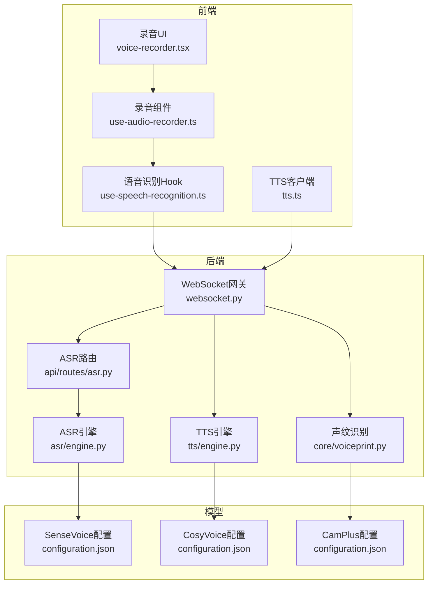
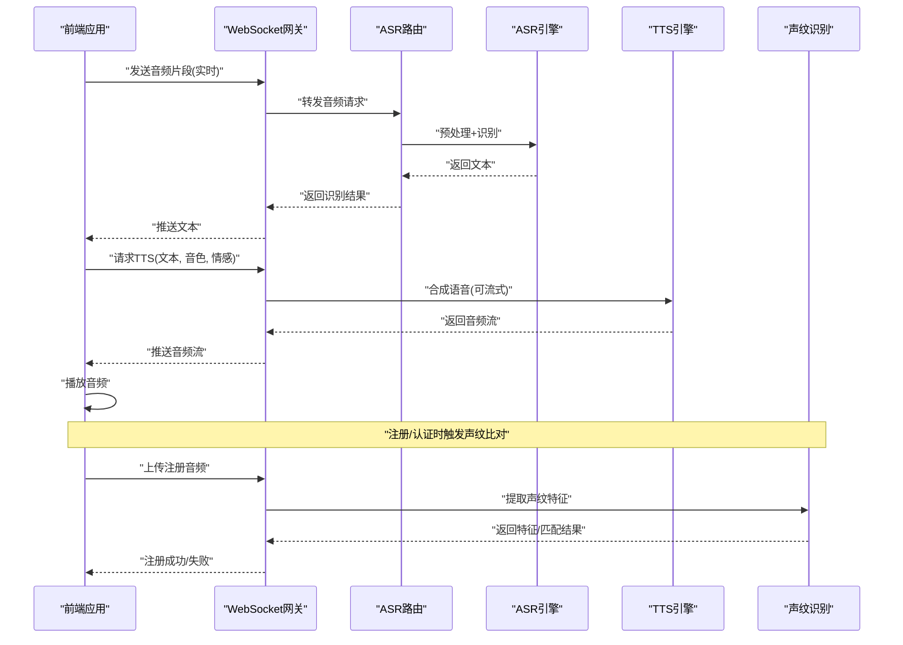
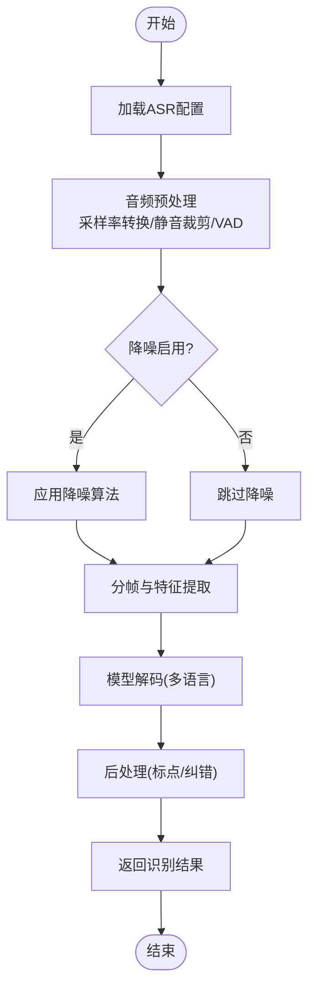
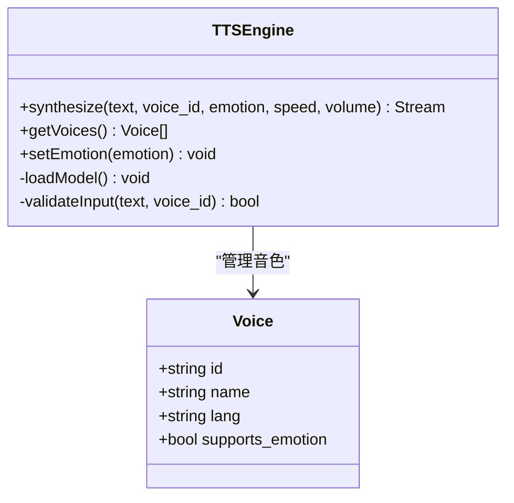
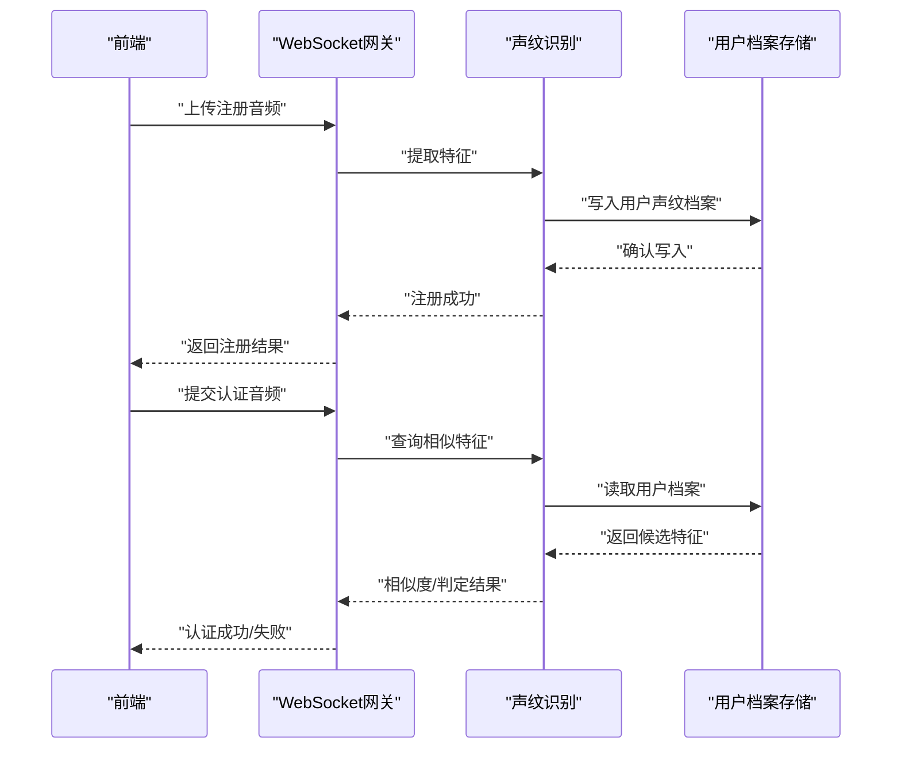
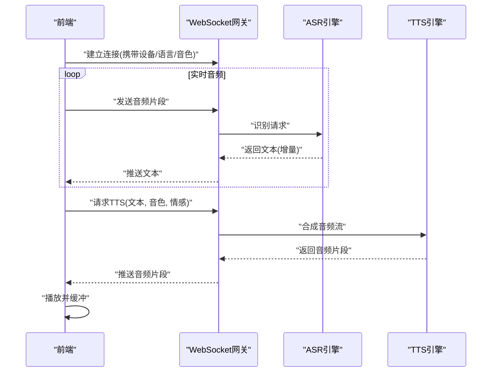
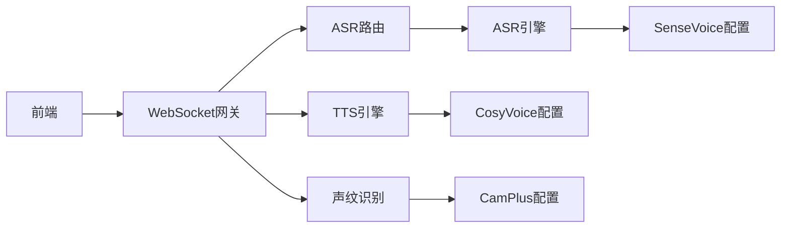

# 语音交互系统

<cite>
**本文引用的文件**   
- [backend_design/nexus/asr/engine.py](file://backend_design/nexus/asr/engine.py)
- [backend_design/nexus/tts/engine.py](file://backend_design/nexus/tts/engine.py)
- [backend_design/nexus/core/voiceprint.py](file://backend_design/nexus/core/voiceprint.py)
- [backend_design/nexus/api/routes/asr.py](file://backend_design/nexus/api/routes/asr.py)
- [backend_design/nexus/api/websocket.py](file://backend_design/nexus/api/websocket.py)
- [frontend_design/src/hooks/use-audio-recorder.ts](file://frontend_design/src/hooks/use-audio-recorder.ts)
- [frontend_design/src/hooks/use-speech-recognition.ts](file://frontend_design/src/hooks/use-speech-recognition.ts)
- [frontend_design/src/lib/tts.ts](file://frontend_design/src/lib/tts.ts)
- [frontend_design/src/components/voice-recorder.tsx](file://frontend_design/src/components/voice-recorder.tsx)
- [models/asr/sensevoice/configuration.json](file://models/asr/sensevoice/configuration.json)
- [models/tts/cosyvoice/configuration.json](file://models/tts/cosyvoice/configuration.json)
- [models/sv/cam_plus/configuration.json](file://models/sv/cam_plus/configuration.json)
- [docs/voice/audio-pipeline-guide.md](file://docs/voice/audio-pipeline-guide.md)
- [docs/voice/tts-guide.md](file://docs/voice/tts-guide.md)
- [docs/voice/voiceprint-guide.md](file://docs/voice/voiceprint-guide.md)
</cite>

## 目录
1. [简介](#简介)
2. [项目结构](#项目结构)
3. [核心组件](#核心组件)
4. [架构总览](#架构总览)
5. [详细组件分析](#详细组件分析)
6. [依赖关系分析](#依赖关系分析)
7. [性能考虑](#性能考虑)
8. [故障排查指南](#故障排查指南)
9. [结论](#结论)
10. [附录](#附录)

## 简介
本技术文档面向NexusCockpit的语音交互系统，覆盖自动语音识别（ASR）、文本转语音（TTS）、声纹识别（SV）以及前后端音频处理全流程。文档从系统架构、数据流、关键算法与工程实现角度进行系统化阐述，并提供性能优化与调试方法、多设备适配与跨平台兼容性说明，帮助读者快速理解并高效使用该系统。

## 项目结构
语音相关代码主要分布在后端Python服务与前端Next.js应用中：
- 后端
  - ASR引擎：backend_design/nexus/asr/engine.py
  - TTS引擎：backend_design/nexus/tts/engine.py
  - 声纹识别：backend_design/nexus/core/voiceprint.py
  - API路由：backend_design/nexus/api/routes/asr.py
  - WebSocket网关：backend_design/nexus/api/websocket.py
- 前端
  - 录音与播放：frontend_design/src/hooks/use-audio-recorder.ts、frontend_design/src/components/voice-recorder.tsx
  - 语音识别集成：frontend_design/src/hooks/use-speech-recognition.ts
  - TTS客户端：frontend_design/src/lib/tts.ts
- 模型配置
  - ASR模型：models/asr/sensevoice/configuration.json
  - TTS模型：models/tts/cosyvoice/configuration.json
  - 声纹模型：models/sv/cam_plus/configuration.json
- 文档
  - 音频管线、TTS与声纹指南：docs/voice/*.md

图表来源
- [backend_design/nexus/api/websocket.py](file://backend_design/nexus/api/websocket.py)
- [backend_design/nexus/api/routes/asr.py](file://backend_design/nexus/api/routes/asr.py)
- [backend_design/nexus/asr/engine.py](file://backend_design/nexus/asr/engine.py)
- [backend_design/nexus/tts/engine.py](file://backend_design/nexus/tts/engine.py)
- [backend_design/nexus/core/voiceprint.py](file://backend_design/nexus/core/voiceprint.py)
- [frontend_design/src/hooks/use-audio-recorder.ts](file://frontend_design/src/hooks/use-audio-recorder.ts)
- [frontend_design/src/hooks/use-speech-recognition.ts](file://frontend_design/src/hooks/use-speech-recognition.ts)
- [frontend_design/src/lib/tts.ts](file://frontend_design/src/lib/tts.ts)
- [frontend_design/src/components/voice-recorder.tsx](file://frontend_design/src/components/voice-recorder.tsx)
- [models/asr/sensevoice/configuration.json](file://models/asr/sensevoice/configuration.json)
- [models/tts/cosyvoice/configuration.json](file://models/tts/cosyvoice/configuration.json)
- [models/sv/cam_plus/configuration.json](file://models/sv/cam_plus/configuration.json)

章节来源
- [docs/voice/audio-pipeline-guide.md](file://docs/voice/audio-pipeline-guide.md)
- [docs/voice/tts-guide.md](file://docs/voice/tts-guide.md)
- [docs/voice/voiceprint-guide.md](file://docs/voice/voiceprint-guide.md)

## 核心组件
- ASR自动语音识别
  - 负责接收前端音频流或文件，执行降噪、分帧、特征提取与解码，输出文本结果。
  - 支持多语言识别能力，由模型配置驱动。
- TTS文本转语音
  - 将文本转换为自然语音，支持情感化合成与个性化音色选择，提供流式播放接口。
- 声纹识别
  - 完成用户注册与匹配，用于身份验证与个性化策略。
- 前后端音频处理
  - 前端负责麦克风采集、编码与传输；后端负责解码、推理与结果回传；TTS支持流式播放。

章节来源
- [backend_design/nexus/asr/engine.py](file://backend_design/nexus/asr/engine.py)
- [backend_design/nexus/tts/engine.py](file://backend_design/nexus/tts/engine.py)
- [backend_design/nexus/core/voiceprint.py](file://backend_design/nexus/core/voiceprint.py)
- [frontend_design/src/hooks/use-audio-recorder.ts](file://frontend_design/src/hooks/use-audio-recorder.ts)
- [frontend_design/src/hooks/use-speech-recognition.ts](file://frontend_design/src/hooks/use-speech-recognition.ts)
- [frontend_design/src/lib/tts.ts](file://frontend_design/src/lib/tts.ts)

## 架构总览
端到端语音交互流程如下：
- 前端通过Web Audio API采集麦克风音频，封装为PCM或Opus片段，经WebSocket实时推送至后端。
- 后端WebSocket网关转发到ASR路由，调用ASR引擎进行降噪、分帧与识别，返回文本。
- 业务逻辑生成回复后，调用TTS引擎合成语音，以流式方式推送到前端进行播放。
- 声纹识别在注册与认证阶段参与，确保用户身份与个性化设置一致。

图表来源
- [backend_design/nexus/api/websocket.py](file://backend_design/nexus/api/websocket.py)
- [backend_design/nexus/api/routes/asr.py](file://backend_design/nexus/api/routes/asr.py)
- [backend_design/nexus/asr/engine.py](file://backend_design/nexus/asr/engine.py)
- [backend_design/nexus/tts/engine.py](file://backend_design/nexus/tts/engine.py)
- [backend_design/nexus/core/voiceprint.py](file://backend_design/nexus/core/voiceprint.py)

## 详细组件分析

### ASR自动语音识别引擎
- 功能要点
  - 音频预处理：采样率统一、静音检测、VAD（可选）。
  - 降噪算法：频谱减法、维纳滤波等（根据配置启用）。
  - 多语言支持：基于SenseVoice模型配置，支持中文、英文等多语种识别。
  - 流式识别：支持增量输入与实时输出。
- 关键数据结构
  - 音频块：包含采样率、声道数、数据字节序列。
  - 识别参数：语言、热词、置信度阈值、是否流式。
  - 识别结果：文本、时间戳、置信度。
- 复杂度与性能
  - 分帧长度与重叠影响延迟与精度；合理设置窗口大小与步长。
  - 批量推理与GPU加速可降低延迟。
- 错误处理
  - 音频格式校验、超时重试、降级策略（本地缓存或提示重录）。

图表来源
- [backend_design/nexus/asr/engine.py](file://backend_design/nexus/asr/engine.py)
- [models/asr/sensevoice/configuration.json](file://models/asr/sensevoice/configuration.json)

章节来源
- [backend_design/nexus/asr/engine.py](file://backend_design/nexus/asr/engine.py)
- [models/asr/sensevoice/configuration.json](file://models/asr/sensevoice/configuration.json)

### TTS文本转语音系统
- 功能要点
  - 情感化合成：根据情感标签调整韵律与语调。
  - 个性化音色：按用户ID或音色ID选择不同说话人。
  - 流式播放：服务端边合成边推送，前端边收边播，降低首包延迟。
- 关键数据结构
  - 合成请求：文本、音色ID、情感、语速、音量。
  - 合成响应：音频流片段、元信息（采样率、时长）。
- 复杂度与性能
  - 流式合成减少等待时间；批量化提升吞吐。
  - 缓存常用短语与音色模板，提高命中率。
- 错误处理
  - 文本清洗、非法字符过滤；网络异常重试与降级（静态音频兜底）。

图表来源
- [backend_design/nexus/tts/engine.py](file://backend_design/nexus/tts/engine.py)
- [models/tts/cosyvoice/configuration.json](file://models/tts/cosyvoice/configuration.json)

章节来源
- [backend_design/nexus/tts/engine.py](file://backend_design/nexus/tts/engine.py)
- [models/tts/cosyvoice/configuration.json](file://models/tts/cosyvoice/configuration.json)

### 声纹识别系统
- 功能要点
  - 用户注册：采集一段清晰语音，提取声纹特征并存储。
  - 身份验证：对比当前语音与已存特征，计算相似度并判定。
  - 安全防护：防重放攻击、噪声鲁棒性、阈值自适应。
- 关键数据结构
  - 声纹特征向量：固定维度嵌入。
  - 用户档案：用户ID、特征哈希、注册时间与版本。
- 复杂度与性能
  - 特征提取与相似度计算需低延迟；可引入近似最近邻检索。
- 错误处理
  - 音频质量评估、重复注册检测、阈值动态调整。

图表来源
- [backend_design/nexus/core/voiceprint.py](file://backend_design/nexus/core/voiceprint.py)
- [models/sv/cam_plus/configuration.json](file://models/sv/cam_plus/configuration.json)

章节来源
- [backend_design/nexus/core/voiceprint.py](file://backend_design/nexus/core/voiceprint.py)
- [models/sv/cam_plus/configuration.json](file://models/sv/cam_plus/configuration.json)

### 前后端音频处理完整流程
- 前端采集与传输
  - 使用Web Audio API捕获麦克风，按固定帧长打包为二进制片段。
  - 通过WebSocket持续推送音频流，附带会话ID与设备信息。
- 后端处理与回传
  - WebSocket网关鉴权与会话管理，路由到ASR/TTS/声纹模块。
  - 识别结果与合成音频流通过同一连接回传，前端无缝衔接。
- 播放与同步
  - 前端维护播放队列，避免卡顿与丢帧；支持暂停/恢复。

图表来源
- [frontend_design/src/hooks/use-audio-recorder.ts](file://frontend_design/src/hooks/use-audio-recorder.ts)
- [frontend_design/src/hooks/use-speech-recognition.ts](file://frontend_design/src/hooks/use-speech-recognition.ts)
- [frontend_design/src/lib/tts.ts](file://frontend_design/src/lib/tts.ts)
- [backend_design/nexus/api/websocket.py](file://backend_design/nexus/api/websocket.py)
- [backend_design/nexus/api/routes/asr.py](file://backend_design/nexus/api/routes/asr.py)
- [backend_design/nexus/asr/engine.py](file://backend_design/nexus/asr/engine.py)
- [backend_design/nexus/tts/engine.py](file://backend_design/nexus/tts/engine.py)

章节来源
- [frontend_design/src/components/voice-recorder.tsx](file://frontend_design/src/components/voice-recorder.tsx)
- [frontend_design/src/hooks/use-audio-recorder.ts](file://frontend_design/src/hooks/use-audio-recorder.ts)
- [frontend_design/src/hooks/use-speech-recognition.ts](file://frontend_design/src/hooks/use-speech-recognition.ts)
- [frontend_design/src/lib/tts.ts](file://frontend_design/src/lib/tts.ts)
- [backend_design/nexus/api/websocket.py](file://backend_design/nexus/api/websocket.py)
- [backend_design/nexus/api/routes/asr.py](file://backend_design/nexus/api/routes/asr.py)

## 依赖关系分析
- 模块耦合
  - WebSocket网关作为中心枢纽，解耦前端与各后端服务。
  - ASR/TTS/声纹模块各自独立，通过配置与接口契约协作。
- 外部依赖
  - SenseVoice、CosyVoice、CamPlus模型配置文件驱动行为。
- 潜在循环依赖
  - 通过网关与路由层隔离，避免直接相互引用。

图表来源
- [backend_design/nexus/api/websocket.py](file://backend_design/nexus/api/websocket.py)
- [backend_design/nexus/api/routes/asr.py](file://backend_design/nexus/api/routes/asr.py)
- [backend_design/nexus/asr/engine.py](file://backend_design/nexus/asr/engine.py)
- [backend_design/nexus/tts/engine.py](file://backend_design/nexus/tts/engine.py)
- [backend_design/nexus/core/voiceprint.py](file://backend_design/nexus/core/voiceprint.py)
- [models/asr/sensevoice/configuration.json](file://models/asr/sensevoice/configuration.json)
- [models/tts/cosyvoice/configuration.json](file://models/tts/cosyvoice/configuration.json)
- [models/sv/cam_plus/configuration.json](file://models/sv/cam_plus/configuration.json)

章节来源
- [backend_design/nexus/api/websocket.py](file://backend_design/nexus/api/websocket.py)
- [backend_design/nexus/api/routes/asr.py](file://backend_design/nexus/api/routes/asr.py)

## 性能考虑
- 降低延迟
  - 前端减小帧长、启用Opus压缩；后端采用流式识别与合成。
  - 预热模型与缓存热点音色，减少冷启动开销。
- 资源利用
  - GPU并行推理、批处理音频片段；CPU/GPU负载均衡。
- 稳定性
  - 断线重连、指数退避；音频缓冲与丢帧策略。
- 监控与度量
  - 记录端到端延迟、识别准确率、合成首包时间；结合日志与指标面板定位瓶颈。

[本节为通用指导，不直接分析具体文件]

## 故障排查指南
- 常见问题
  - 音频无法采集：检查浏览器权限、设备枚举与采样率兼容。
  - 识别结果为空：确认音频质量、降噪参数与语言配置。
  - TTS无声：核对音色ID、情感标签与网络流式传输状态。
  - 声纹认证失败：检查阈值设置、音频长度与噪声环境。
- 调试方法
  - 前端：控制台打印音频帧大小与时长；回放原始片段定位问题。
  - 后端：开启详细日志，记录各阶段耗时与中间结果。
  - 模型：切换轻量模型或关闭降噪进行对比测试。

章节来源
- [docs/voice/audio-pipeline-guide.md](file://docs/voice/audio-pipeline-guide.md)
- [docs/voice/tts-guide.md](file://docs/voice/tts-guide.md)
- [docs/voice/voiceprint-guide.md](file://docs/voice/voiceprint-guide.md)

## 结论
NexusCockpit的语音交互系统通过模块化设计与流式处理实现了低延迟、高可用的端到端体验。ASR、TTS与声纹识别各司其职，配合WebSocket网关形成稳定可靠的通信链路。通过合理的性能优化与完善的调试手段，可在多设备与跨平台环境下获得一致的语音交互效果。

[本节为总结，不直接分析具体文件]

## 附录
- 多设备适配
  - 移动端与桌面端差异：采样率、缓冲区大小与权限策略不同，建议在前端做设备探测与参数自适应。
- 跨平台兼容性
  - Web Audio API与WebSocket在各主流浏览器中支持良好；必要时提供降级方案（如HTTP轮询与静态音频）。
- 最佳实践
  - 明确协议边界与错误码；统一音频格式与元信息；对敏感操作（声纹注册/认证）增加二次确认与审计日志。

[本节为概念性内容，不直接分析具体文件]