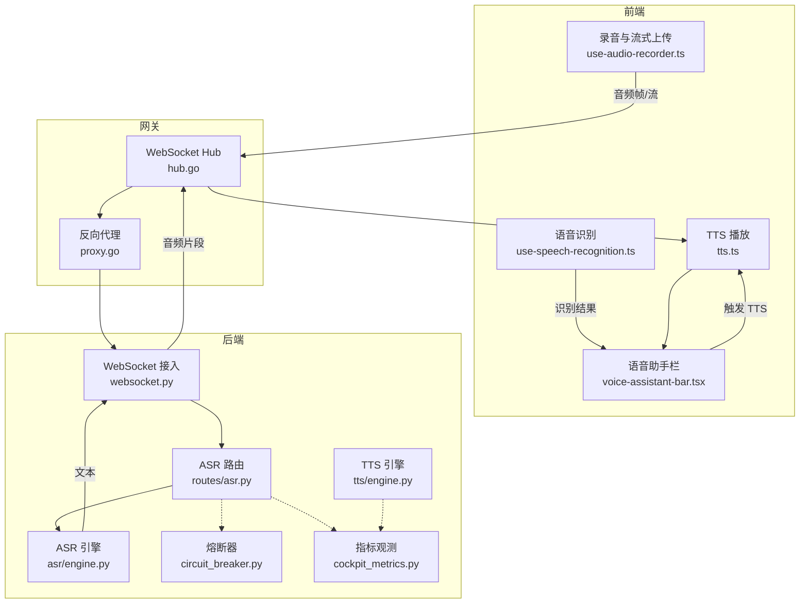
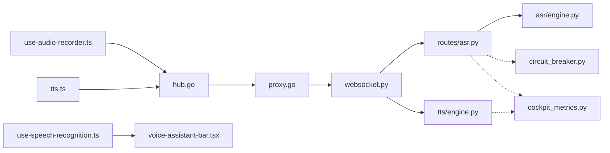

# 音频处理流水线

<cite>
**本文引用的文件**   
- [frontend_design/src/hooks/use-audio-recorder.ts](file://frontend_design/src/hooks/use-audio-recorder.ts)
- [frontend_design/src/hooks/use-speech-recognition.ts](file://frontend_design/src/hooks/use-speech-recognition.ts)
- [frontend_design/src/components/voice-recorder.tsx](file://frontend_design/src/components/voice-recorder.tsx)
- [frontend_design/src/lib/tts.ts](file://frontend_design/src/lib/tts.ts)
- [frontend_design/src/components/vehicle/voice-assistant-bar.tsx](file://frontend_design/src/components/vehicle/voice-assistant-bar.tsx)
- [backend_design/nexus/api/routes/asr.py](file://backend_design/nexus/api/routes/asr.py)
- [backend_design/nexus/asr/engine.py](file://backend_design/nexus/asr/engine.py)
- [backend_design/nexus/tts/engine.py](file://backend_design/nexus/tts/engine.py)
- [backend_design/nexus/api/websocket.py](file://backend_design/nexus/api/websocket.py)
- [backend_design/nexus_gate/internal/ws/hub.go](file://backend_design/nexus_gate/internal/ws/hub.go)
- [backend_design/nexus_gate/internal/proxy/proxy.go](file://backend_design/nexus_gate/internal/proxy/proxy.go)
- [backend_design/nexus/core/circuit_breaker.py](file://backend_design/nexus/core/circuit_breaker.py)
- [backend_design/nexus/observability/cockpit_metrics.py](file://backend_design/nexus/observability/cockpit_metrics.py)
- [docs/voice/audio-pipeline-guide.md](file://docs/voice/audio-pipeline-guide.md)
- [docs/voice/tts-guide.md](file://docs/voice/tts-guide.md)
</cite>

## 目录
1. [简介](#简介)
2. [项目结构](#项目结构)
3. [核心组件](#核心组件)
4. [架构总览](#架构总览)
5. [详细组件分析](#详细组件分析)
6. [依赖关系分析](#依赖关系分析)
7. [性能考虑](#性能考虑)
8. [故障排查指南](#故障排查指南)
9. [结论](#结论)
10. [附录](#附录)

## 简介
本技术文档聚焦于 NexusCockpit 的音频处理流水线，覆盖从前端麦克风采集、实时流式识别（ASR）、后端语音合成（TTS）到前端播放的端到端流程。文档重点阐述：
- 前后端音频格式转换、压缩编码与传输优化策略
- 实时音频流处理：缓冲区管理、网络传输与错误恢复
- 音频质量控制：降噪、回声消除与音量调节
- 跨平台兼容性：浏览器、移动端与桌面端集成方案
- 性能优化技巧、调试工具与常见问题解决方案
- 完整语音交互界面组件实现与用户交互设计模式

## 项目结构
本项目在前后端分别实现了音频采集、识别与合成的关键能力：
- 前端
  - 录音与流式上传：use-audio-recorder.ts、voice-recorder.tsx
  - 语音识别：use-speech-recognition.ts
  - 文本转语音播放：tts.ts
  - 语音助手栏 UI：voice-assistant-bar.tsx
- 网关层
  - WebSocket Hub：hub.go
  - 反向代理：proxy.go
- 后端服务
  - ASR 路由与引擎：routes/asr.py、asr/engine.py
  - TTS 引擎：tts/engine.py
  - WebSocket 接入：api/websocket.py
  - 熔断保护：core/circuit_breaker.py
  - 指标观测：observability/cockpit_metrics.py
- 文档
  - 音频流水线指南：docs/voice/audio-pipeline-guide.md
  - TTS 指南：docs/voice/tts-guide.md



图表来源
- [frontend_design/src/hooks/use-audio-recorder.ts](file://frontend_design/src/hooks/use-audio-recorder.ts)
- [frontend_design/src/hooks/use-speech-recognition.ts](file://frontend_design/src/hooks/use-speech-recognition.ts)
- [frontend_design/src/components/voice-recorder.tsx](file://frontend_design/src/components/voice-recorder.tsx)
- [frontend_design/src/lib/tts.ts](file://frontend_design/src/lib/tts.ts)
- [frontend_design/src/components/vehicle/voice-assistant-bar.tsx](file://frontend_design/src/components/vehicle/voice-assistant-bar.tsx)
- [backend_design/nexus_gate/internal/ws/hub.go](file://backend_design/nexus_gate/internal/ws/hub.go)
- [backend_design/nexus_gate/internal/proxy/proxy.go](file://backend_design/nexus_gate/internal/proxy/proxy.go)
- [backend_design/nexus/api/websocket.py](file://backend_design/nexus/api/websocket.py)
- [backend_design/nexus/api/routes/asr.py](file://backend_design/nexus/api/routes/asr.py)
- [backend_design/nexus/asr/engine.py](file://backend_design/nexus/asr/engine.py)
- [backend_design/nexus/tts/engine.py](file://backend_design/nexus/tts/engine.py)
- [backend_design/nexus/core/circuit_breaker.py](file://backend_design/nexus/core/circuit_breaker.py)
- [backend_design/nexus/observability/cockpit_metrics.py](file://backend_design/nexus/observability/cockpit_metrics.py)

章节来源
- [docs/voice/audio-pipeline-guide.md](file://docs/voice/audio-pipeline-guide.md)
- [docs/voice/tts-guide.md](file://docs/voice/tts-guide.md)

## 核心组件
- 前端录音与流式上传
  - 负责捕获麦克风输入、分片为音频帧并通过 WebSocket 持续推送至网关
  - 提供开始/停止控制、静音检测与重连逻辑
- 前端语音识别
  - 基于 Web Speech API 或自定义流式协议进行本地/云端识别
  - 将识别结果回写至 UI 状态并驱动后续对话流程
- 前端 TTS 播放
  - 接收后端返回的音频片段，解码并播放，支持增量播放与缓冲控制
- 网关 WebSocket Hub
  - 维护连接、转发消息、限流与鉴权
- 网关反向代理
  - 将 WebSocket 请求转发至后端服务
- 后端 ASR 路由与引擎
  - 解析音频帧、调用识别模型、输出文本事件
- 后端 TTS 引擎
  - 根据文本生成音频片段，按流式方式返回
- 熔断器与指标观测
  - 对下游服务进行熔断保护与可观测性上报

章节来源
- [frontend_design/src/hooks/use-audio-recorder.ts](file://frontend_design/src/hooks/use-audio-recorder.ts)
- [frontend_design/src/hooks/use-speech-recognition.ts](file://frontend_design/src/hooks/use-speech-recognition.ts)
- [frontend_design/src/components/voice-recorder.tsx](file://frontend_design/src/components/voice-recorder.tsx)
- [frontend_design/src/lib/tts.ts](file://frontend_design/src/lib/tts.ts)
- [frontend_design/src/components/vehicle/voice-assistant-bar.tsx](file://frontend_design/src/components/vehicle/voice-assistant-bar.tsx)
- [backend_design/nexus_gate/internal/ws/hub.go](file://backend_design/nexus_gate/internal/ws/hub.go)
- [backend_design/nexus_gate/internal/proxy/proxy.go](file://backend_design/nexus_gate/internal/proxy/proxy.go)
- [backend_design/nexus/api/websocket.py](file://backend_design/nexus/api/websocket.py)
- [backend_design/nexus/api/routes/asr.py](file://backend_design/nexus/api/routes/asr.py)
- [backend_design/nexus/asr/engine.py](file://backend_design/nexus/asr/engine.py)
- [backend_design/nexus/tts/engine.py](file://backend_design/nexus/tts/engine.py)
- [backend_design/nexus/core/circuit_breaker.py](file://backend_design/nexus/core/circuit_breaker.py)
- [backend_design/nexus/observability/cockpit_metrics.py](file://backend_design/nexus/observability/cockpit_metrics.py)

## 架构总览
下图展示了从麦克风采集到语音合成的端到端数据流与控制流。

```mermaid
sequenceDiagram
participant U as "用户"
participant F as "前端录音<br/>use-audio-recorder.ts"
participant G as "网关Hub<br/>hub.go"
participant P as "网关代理<br/>proxy.go"
participant B as "后端WS<br/>websocket.py"
participant A as "ASR路由<br/>routes/asr.py"
participant E as "ASR引擎<br/>asr/engine.py"
participant T as "TTS引擎<br/>tts/engine.py"
participant PL as "前端播放器<br/>tts.ts"
U->>F : "点击录音"
F->>G : "建立WebSocket连接"
F->>G : "发送音频帧(分片)"
G->>P : "转发WebSocket帧"
P->>B : "转发至后端WS"
B->>A : "分发音频帧"
A->>E : "调用识别引擎"
E-->>A : "返回识别文本片段"
A-->>B : "推送文本事件"
B-->>G : "转发文本事件"
G-->>F : "前端收到识别结果"
F->>PL : "触发TTS播放"
PL->>G : "请求TTS音频片段"
G->>P->>B->>T : "路由到TTS引擎"
T-->>B : "返回音频片段"
B-->>G-->>PL : "流式播放音频"
```

图表来源
- [frontend_design/src/hooks/use-audio-recorder.ts](file://frontend_design/src/hooks/use-audio-recorder.ts)
- [frontend_design/src/lib/tts.ts](file://frontend_design/src/lib/tts.ts)
- [backend_design/nexus_gate/internal/ws/hub.go](file://backend_design/nexus_gate/internal/ws/hub.go)
- [backend_design/nexus_gate/internal/proxy/proxy.go](file://backend_design/nexus_gate/internal/proxy/proxy.go)
- [backend_design/nexus/api/websocket.py](file://backend_design/nexus/api/websocket.py)
- [backend_design/nexus/api/routes/asr.py](file://backend_design/nexus/api/routes/asr.py)
- [backend_design/nexus/asr/engine.py](file://backend_design/nexus/asr/engine.py)
- [backend_design/nexus/tts/engine.py](file://backend_design/nexus/tts/engine.py)

## 详细组件分析

### 前端录音与流式上传（use-audio-recorder.ts）
- 功能要点
  - 使用 MediaRecorder 或 AudioWorklet 捕获麦克风输入
  - 将音频数据切分为固定大小的帧，通过 WebSocket 持续发送
  - 实现静音检测以自动结束长时录音
  - 断线重连与背压控制，避免前端阻塞
- 数据结构与复杂度
  - 帧大小与采样率决定带宽与延迟；典型帧大小为 20–40ms
  - 时间复杂度 O(n)，空间复杂度 O(k)（k 为缓冲区大小）
- 错误处理
  - 权限拒绝、设备不可用、网络中断等异常分支
  - 指数退避重连与降级策略（如回退到非流式上传）
- 性能优化
  - 合理设置帧大小与采样率，平衡延迟与带宽
  - 使用 OffscreenCanvas/AudioWorklet 降低主线程压力
- 兼容性与安全
  - HTTPS 强制要求；iOS Safari 需用户手势触发录音
  - 移动端后台限制与唤醒策略

章节来源
- [frontend_design/src/hooks/use-audio-recorder.ts](file://frontend_design/src/hooks/use-audio-recorder.ts)
- [frontend_design/src/components/voice-recorder.tsx](file://frontend_design/src/components/voice-recorder.tsx)

### 前端语音识别（use-speech-recognition.ts）
- 功能要点
  - 基于 Web Speech API 或自定义流式协议进行识别
  - 增量更新识别结果，支持标点与说话人分离（若可用）
- 数据处理
  - 将识别文本与时间戳关联，便于 UI 展示与对齐
- 错误处理
  - 识别失败、语言包缺失、权限问题等
- 性能优化
  - 节流更新 UI，避免频繁重绘
  - 合并短句减少渲染开销

章节来源
- [frontend_design/src/hooks/use-speech-recognition.ts](file://frontend_design/src/hooks/use-speech-recognition.ts)

### 前端 TTS 播放（tts.ts）
- 功能要点
  - 接收后端返回的音频片段，解码并播放
  - 支持增量播放与缓冲控制，降低首帧延迟
- 数据结构与算法
  - 环形缓冲队列，按播放进度消费
  - 自适应缓冲策略，依据网络抖动动态调整
- 错误处理
  - 解码失败、网络超时、媒体源不可用等
- 性能优化
  - 预取下一片段，平滑播放
  - 使用 Web Audio API 的低延迟路径

章节来源
- [frontend_design/src/lib/tts.ts](file://frontend_design/src/lib/tts.ts)

### 语音助手栏 UI（voice-assistant-bar.tsx）
- 功能要点
  - 整合录音、识别与播放状态，提供统一入口
  - 显示波形动画、识别文本与播放进度
- 交互设计
  - 长按录音、松开发送；双击取消；滑动静音
  - 无障碍支持（ARIA 标签、键盘导航）
- 状态管理
  - 集中管理录音中、识别中、播放中等状态
  - 错误提示与重试按钮

章节来源
- [frontend_design/src/components/vehicle/voice-assistant-bar.tsx](file://frontend_design/src/components/vehicle/voice-assistant-bar.tsx)

### 网关 WebSocket Hub（hub.go）
- 功能要点
  - 维护客户端连接集合，广播与点对点转发
  - 鉴权与会话绑定，限流与配额控制
- 并发模型
  - 每连接一个 goroutine，读写分离
  - 心跳检测与空闲断开
- 错误处理
  - 连接异常、消息过大、非法协议等
- 性能优化
  - 批量写入与零拷贝优化
  - 连接池与复用策略

章节来源
- [backend_design/nexus_gate/internal/ws/hub.go](file://backend_design/nexus_gate/internal/ws/hub.go)

### 网关反向代理（proxy.go）
- 功能要点
  - 将 WebSocket 请求转发至后端服务
  - 负载均衡与健康检查
- 错误处理
  - 上游不可达、超时与重试策略
- 性能优化
  - 连接池与 keep-alive
  - 头部裁剪与压缩

章节来源
- [backend_design/nexus_gate/internal/proxy/proxy.go](file://backend_design/nexus_gate/internal/proxy/proxy.go)

### 后端 WebSocket 接入（websocket.py）
- 功能要点
  - 接收前端音频帧，路由至 ASR/TTS 模块
  - 维持会话上下文与状态机
- 错误处理
  - 协议不匹配、消息格式错误、资源不足
- 性能优化
  - 异步 I/O 与协程调度
  - 背压与流量整形

章节来源
- [backend_design/nexus/api/websocket.py](file://backend_design/nexus/api/websocket.py)

### ASR 路由与引擎（routes/asr.py, asr/engine.py）
- 功能要点
  - 解析音频帧，调用识别引擎，输出文本事件
  - 支持流式识别与分段拼接
- 数据结构
  - 帧元数据（采样率、时长、序列号）
  - 识别结果（文本、置信度、时间戳）
- 错误处理
  - 模型加载失败、推理超时、内存不足
- 性能优化
  - 批处理与并行推理
  - 缓存热词与上下文

章节来源
- [backend_design/nexus/api/routes/asr.py](file://backend_design/nexus/api/routes/asr.py)
- [backend_design/nexus/asr/engine.py](file://backend_design/nexus/asr/engine.py)

### TTS 引擎（tts/engine.py）
- 功能要点
  - 根据文本生成音频片段，支持流式输出
  - 多音色与语速控制
- 数据结构
  - 音频块（PCM/WAV/Opus），采样率与位深
- 错误处理
  - 文本过长、模型不可用、编码失败
- 性能优化
  - 增量合成与预取
  - 量化与加速推理

章节来源
- [backend_design/nexus/tts/engine.py](file://backend_design/nexus/tts/engine.py)

### 熔断器与指标观测（circuit_breaker.py, cockpit_metrics.py）
- 功能要点
  - 对下游服务进行熔断保护，快速失败与恢复
  - 收集关键指标（延迟、吞吐、错误率）
- 配置项
  - 阈值、窗口大小、冷却时间
- 可视化
  - 与 Grafana/Prometheus 集成

章节来源
- [backend_design/nexus/core/circuit_breaker.py](file://backend_design/nexus/core/circuit_breaker.py)
- [backend_design/nexus/observability/cockpit_metrics.py](file://backend_design/nexus/observability/cockpit_metrics.py)

## 依赖关系分析


图表来源
- [frontend_design/src/hooks/use-audio-recorder.ts](file://frontend_design/src/hooks/use-audio-recorder.ts)
- [frontend_design/src/hooks/use-speech-recognition.ts](file://frontend_design/src/hooks/use-speech-recognition.ts)
- [frontend_design/src/components/voice-recorder.tsx](file://frontend_design/src/components/voice-recorder.tsx)
- [frontend_design/src/lib/tts.ts](file://frontend_design/src/lib/tts.ts)
- [frontend_design/src/components/vehicle/voice-assistant-bar.tsx](file://frontend_design/src/components/vehicle/voice-assistant-bar.tsx)
- [backend_design/nexus_gate/internal/ws/hub.go](file://backend_design/nexus_gate/internal/ws/hub.go)
- [backend_design/nexus_gate/internal/proxy/proxy.go](file://backend_design/nexus_gate/internal/proxy/proxy.go)
- [backend_design/nexus/api/websocket.py](file://backend_design/nexus/api/websocket.py)
- [backend_design/nexus/api/routes/asr.py](file://backend_design/nexus/api/routes/asr.py)
- [backend_design/nexus/asr/engine.py](file://backend_design/nexus/asr/engine.py)
- [backend_design/nexus/tts/engine.py](file://backend_design/nexus/tts/engine.py)
- [backend_design/nexus/core/circuit_breaker.py](file://backend_design/nexus/core/circuit_breaker.py)
- [backend_design/nexus/observability/cockpit_metrics.py](file://backend_design/nexus/observability/cockpit_metrics.py)

章节来源
- [backend_design/nexus_gate/internal/ws/hub.go](file://backend_design/nexus_gate/internal/ws/hub.go)
- [backend_design/nexus_gate/internal/proxy/proxy.go](file://backend_design/nexus_gate/internal/proxy/proxy.go)
- [backend_design/nexus/api/websocket.py](file://backend_design/nexus/api/websocket.py)
- [backend_design/nexus/api/routes/asr.py](file://backend_design/nexus/api/routes/asr.py)
- [backend_design/nexus/asr/engine.py](file://backend_design/nexus/asr/engine.py)
- [backend_design/nexus/tts/engine.py](file://backend_design/nexus/tts/engine.py)
- [backend_design/nexus/core/circuit_breaker.py](file://backend_design/nexus/core/circuit_breaker.py)
- [backend_design/nexus/observability/cockpit_metrics.py](file://backend_design/nexus/observability/cockpit_metrics.py)

## 性能考虑
- 音频格式与压缩
  - 推荐 PCM 用于低延迟链路，Opus 用于高压缩比场景
  - 采样率与位深权衡：16kHz/16bit 适合语音，48kHz/24bit 用于高质量回放
- 缓冲区管理
  - 前端帧大小 20–40ms，后端环形缓冲与预取
  - 自适应缓冲策略应对网络抖动
- 网络传输优化
  - WebSocket 二进制帧，避免 JSON 序列化开销
  - 心跳保活与拥塞控制
- 错误恢复
  - 指数退避重连、断点续传（可选）
  - 降级策略：回退到非流式上传或离线识别
- 质量增强
  - 降噪、回声消除、自动增益控制（AGC）
  - 端侧 VAD（语音活动检测）减少无效传输
- 可观测性
  - 指标：首帧延迟、端到端延迟、丢包率、CPU/内存占用
  - 日志与追踪：请求 ID、会话 ID、错误码

[本节为通用指导，无需特定文件引用]

## 故障排查指南
- 常见问题
  - 无法获取麦克风权限：检查 HTTPS 与用户手势
  - 音频无声或断续：检查采样率、帧大小与缓冲策略
  - 识别结果乱码：确认编码与字符集一致
  - TTS 播放卡顿：检查网络抖动与缓冲阈值
- 定位步骤
  - 前端：打开控制台查看媒体源与 WebSocket 状态
  - 网关：检查连接数、消息速率与错误日志
  - 后端：查看 ASR/TTS 引擎指标与熔断状态
- 工具建议
  - 浏览器开发者工具：网络面板、媒体面板
  - 抓包工具：Wireshark 分析 WebSocket 帧
  - 监控面板：Prometheus/Grafana 查看关键指标

章节来源
- [backend_design/nexus/core/circuit_breaker.py](file://backend_design/nexus/core/circuit_breaker.py)
- [backend_design/nexus/observability/cockpit_metrics.py](file://backend_design/nexus/observability/cockpit_metrics.py)

## 结论
NexusCockpit 的音频处理流水线通过前后端协作与网关中转，实现了从麦克风采集到语音合成的端到端能力。通过合理的格式选择、缓冲策略、错误恢复与可观测性建设，系统在延迟、稳定性与用户体验方面达到良好平衡。未来可在降噪与回声消除、跨端适配与性能调优方面持续迭代。

[本节为总结，无需特定文件引用]

## 附录
- 参考文档
  - 音频流水线指南：docs/voice/audio-pipeline-guide.md
  - TTS 指南：docs/voice/tts-guide.md

章节来源
- [docs/voice/audio-pipeline-guide.md](file://docs/voice/audio-pipeline-guide.md)
- [docs/voice/tts-guide.md](file://docs/voice/tts-guide.md)